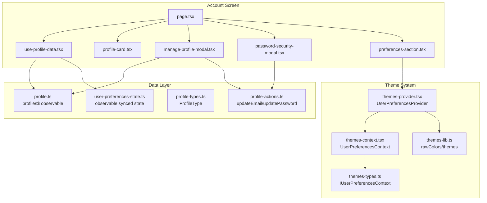
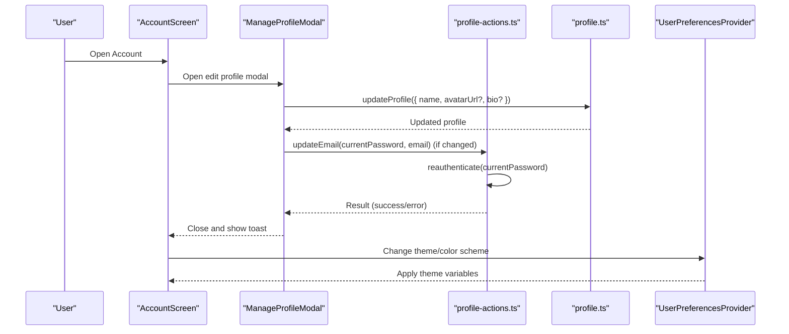
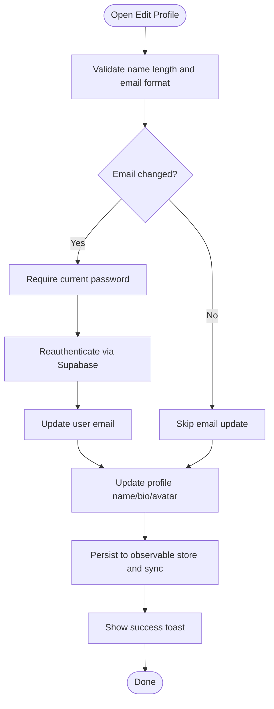
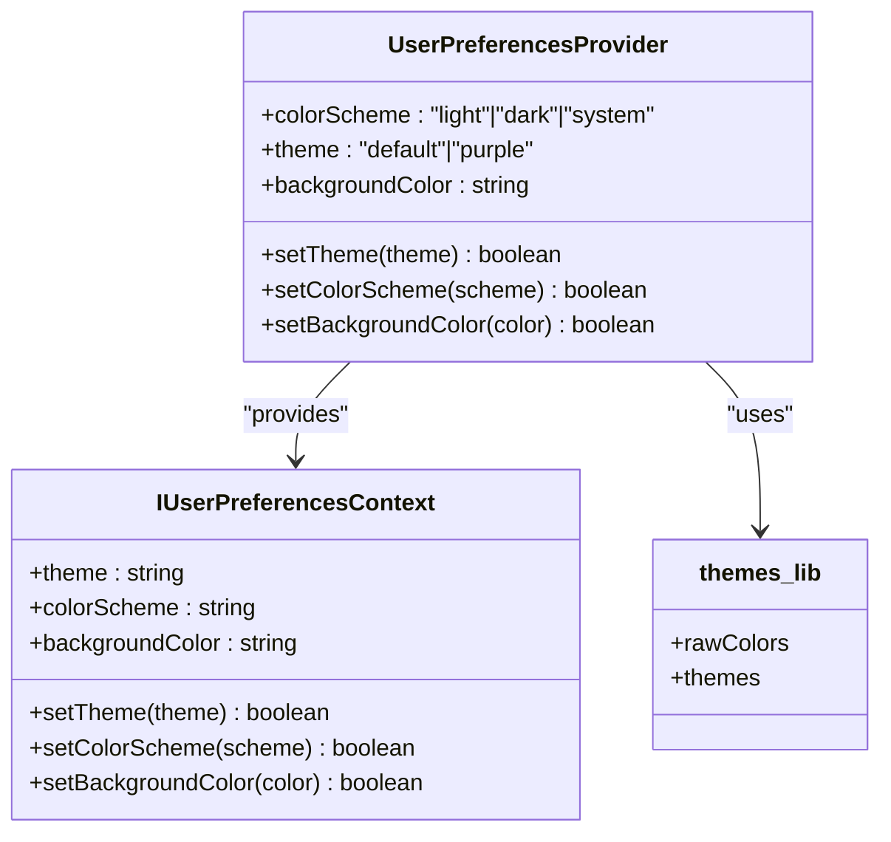
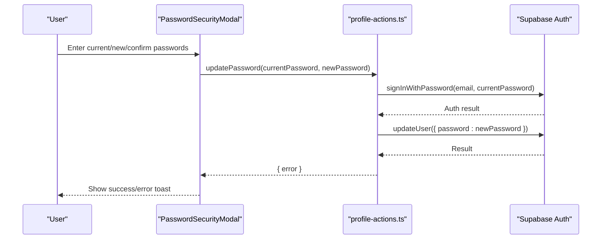
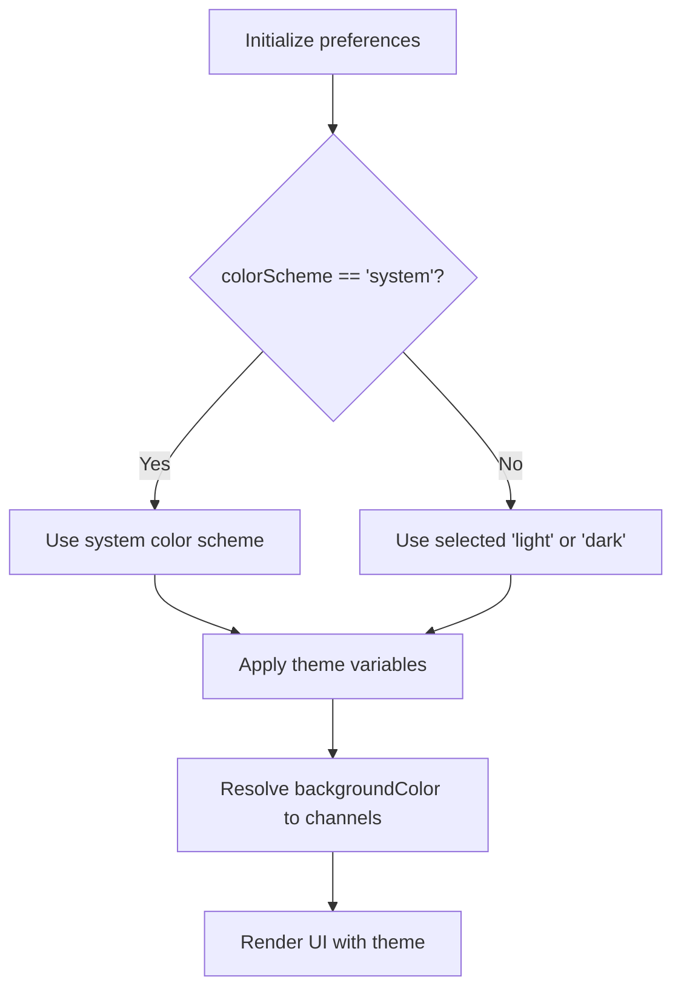
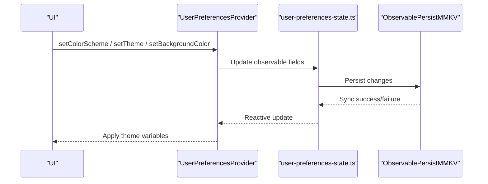
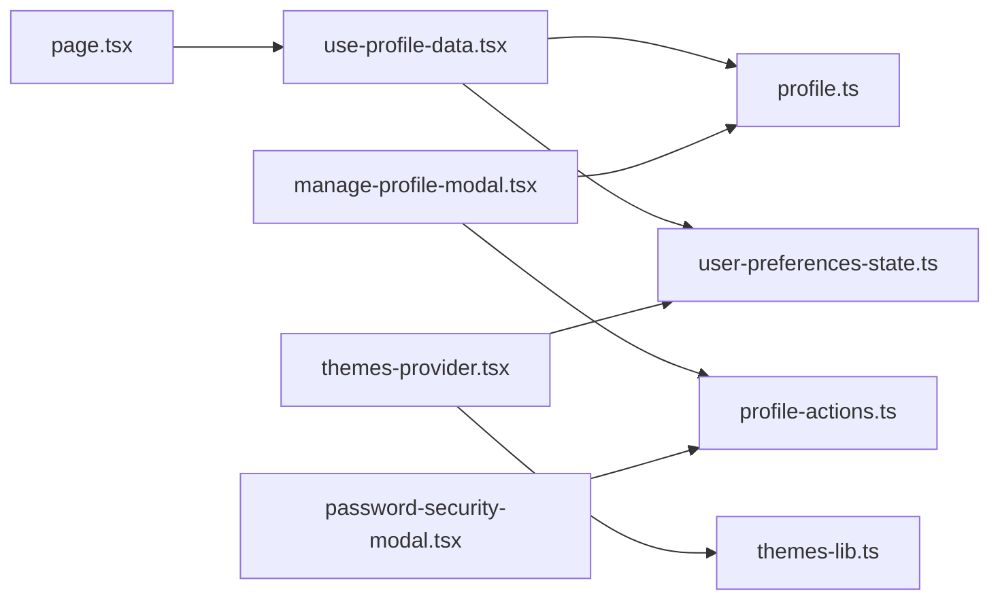

# Account Management

<cite>
**Referenced Files in This Document**
- [page.tsx](file://src/features/account/page.tsx)
- [use-profile-data.tsx](file://src/features/account/use-profile-data.tsx)
- [profile-card.tsx](file://src/features/account/components/profile-card.tsx)
- [manage-profile-modal.tsx](file://src/features/account/components/manage-profile-modal.tsx)
- [password-security-modal.tsx](file://src/features/account/components/password-security-modal.tsx)
- [preferences-section.tsx](file://src/features/account/components/preferences-section.tsx)
- [profile.ts](file://src/data/states/profile.ts)
- [profile-actions.ts](file://src/data/actions/profile.ts)
- [profile-types.ts](file://src/data/types/profile.ts)
- [user-preferences-state.ts](file://src/data/states/user-preferences.ts)
- [themes-provider.tsx](file://src/context/themes/provider.tsx)
- [themes-context.tsx](file://src/context/themes/context.tsx)
- [themes-types.ts](file://src/context/themes/types.ts)
- [themes-lib.ts](file://src/lib/themes.ts)
- [user-types.ts](file://src/data/types/user.ts)
</cite>

## Table of Contents
1. [Introduction](#introduction)
2. [Project Structure](#project-structure)
3. [Core Components](#core-components)
4. [Architecture Overview](#architecture-overview)
5. [Detailed Component Analysis](#detailed-component-analysis)
6. [Dependency Analysis](#dependency-analysis)
7. [Performance Considerations](#performance-considerations)
8. [Troubleshooting Guide](#troubleshooting-guide)
9. [Conclusion](#conclusion)

## Introduction
This document describes the PowerLists account management system, focusing on profile management, preferences configuration, password security, theme customization, and persistence mechanisms. It explains how personal information is edited, avatars are handled, contact details are managed, and how users can customize theme and behavior settings. It also documents password change workflows, security validations, system preference detection, and the persistence of user preferences.

## Project Structure
The account management feature is organized around a dedicated screen that composes modular UI components and integrates with data stores and authentication services. The structure emphasizes separation of concerns:
- Screen-level composition and orchestration
- Profile editing via modal forms with validation
- Password change via secure modal
- Preferences section for theme and color scheme
- Theme provider and context for runtime theme application
- Data layer for profiles and user preferences with persistence

**Diagram sources**
- [page.tsx:18-67](file://src/features/account/page.tsx#L18-L67)
- [use-profile-data.tsx:7-14](file://src/features/account/use-profile-data.tsx#L7-L14)
- [profile-card.tsx:19-34](file://src/features/account/components/profile-card.tsx#L19-L34)
- [manage-profile-modal.tsx:35-183](file://src/features/account/components/manage-profile-modal.tsx#L35-L183)
- [password-security-modal.tsx:37-147](file://src/features/account/components/password-security-modal.tsx#L37-L147)
- [preferences-section.tsx:32-98](file://src/features/account/components/preferences-section.tsx#L32-L98)
- [profile.ts:10-20](file://src/data/states/profile.ts#L10-L20)
- [profile-actions.ts:30-52](file://src/data/actions/profile.ts#L30-L52)
- [profile-types.ts:11-24](file://src/data/types/profile.ts#L11-L24)
- [user-preferences-state.ts:12-25](file://src/data/states/user-preferences.ts#L12-L25)
- [themes-provider.tsx:18-152](file://src/context/themes/provider.tsx#L18-L152)
- [themes-context.tsx:4-17](file://src/context/themes/context.tsx#L4-L17)
- [themes-types.ts:7-14](file://src/context/themes/types.ts#L7-L14)
- [themes-lib.ts:15-213](file://src/lib/themes.ts#L15-L213)

**Section sources**
- [page.tsx:18-67](file://src/features/account/page.tsx#L18-L67)
- [use-profile-data.tsx:7-14](file://src/features/account/use-profile-data.tsx#L7-L14)
- [profile.ts:10-20](file://src/data/states/profile.ts#L10-L20)
- [user-preferences-state.ts:12-25](file://src/data/states/user-preferences.ts#L12-L25)
- [themes-provider.tsx:18-152](file://src/context/themes/provider.tsx#L18-L152)

## Core Components
- Account screen orchestrates profile display, action cards, preferences, and logout.
- Profile card renders user identity with avatar fallback initials.
- Manage profile modal handles name and email updates with validation and optional current password requirement for email changes.
- Password security modal manages current and new password with confirmation and reauthentication.
- Preferences section exposes theme and color scheme selection.
- Theme provider computes effective color scheme and applies theme variables.
- Data stores encapsulate profile CRUD and preferences persistence.

**Section sources**
- [page.tsx:18-67](file://src/features/account/page.tsx#L18-L67)
- [profile-card.tsx:19-34](file://src/features/account/components/profile-card.tsx#L19-L34)
- [manage-profile-modal.tsx:35-183](file://src/features/account/components/manage-profile-modal.tsx#L35-L183)
- [password-security-modal.tsx:37-147](file://src/features/account/components/password-security-modal.tsx#L37-L147)
- [preferences-section.tsx:32-98](file://src/features/account/components/preferences-section.tsx#L32-L98)
- [themes-provider.tsx:30-132](file://src/context/themes/provider.tsx#L30-L132)
- [profile.ts:33-186](file://src/data/states/profile.ts#L33-L186)
- [user-preferences-state.ts:12-25](file://src/data/states/user-preferences.ts#L12-L25)

## Architecture Overview
The account management architecture follows a layered pattern:
- UI layer: screen and components
- Domain logic: profile CRUD and password/email actions
- Persistence: observable stores synced with local storage and remote backend
- Theming: provider computes effective theme and color scheme

**Diagram sources**
- [page.tsx:35-64](file://src/features/account/page.tsx#L35-L64)
- [manage-profile-modal.tsx:63-103](file://src/features/account/components/manage-profile-modal.tsx#L63-L103)
- [profile-actions.ts:30-52](file://src/data/actions/profile.ts#L30-L52)
- [profile.ts:121-159](file://src/data/states/profile.ts#L121-L159)
- [themes-provider.tsx:37-78](file://src/context/themes/provider.tsx#L37-L78)

## Detailed Component Analysis

### Profile Management Interface
- Personal information editing:
  - Name and bio are editable via profile store mutations.
  - Avatar URL is stored in the profile entity; the profile card displays either the avatar image or initials fallback.
- Contact details management:
  - Email updates require current password verification through a reauthentication step.
- Avatar upload:
  - The profile schema supports an avatar URL; the UI uses the avatar component with a fallback to initials computed from the name.

**Diagram sources**
- [manage-profile-modal.tsx:63-103](file://src/features/account/components/manage-profile-modal.tsx#L63-L103)
- [profile-actions.ts:30-40](file://src/data/actions/profile.ts#L30-L40)
- [profile.ts:121-159](file://src/data/states/profile.ts#L121-L159)
- [profile-card.tsx:19-34](file://src/features/account/components/profile-card.tsx#L19-L34)

**Section sources**
- [manage-profile-modal.tsx:20-24](file://src/features/account/components/manage-profile-modal.tsx#L20-L24)
- [manage-profile-modal.tsx:69-72](file://src/features/account/components/manage-profile-modal.tsx#L69-L72)
- [manage-profile-modal.tsx:74-99](file://src/features/account/components/manage-profile-modal.tsx#L74-L99)
- [profile-actions.ts:30-40](file://src/data/actions/profile.ts#L30-L40)
- [profile.ts:121-159](file://src/data/states/profile.ts#L121-L159)
- [profile-card.tsx:19-34](file://src/features/account/components/profile-card.tsx#L19-L34)

### Preferences Configuration System
- Theme selection:
  - Two themes are supported: default and purple.
  - Theme changes are persisted and applied immediately.
- Color scheme:
  - Options: system, light, dark.
  - Effective color scheme respects system preference when set to system.
- Background color:
  - Supports default or explicit color variable selection, resolved to an RGB-like channel string.

**Diagram sources**
- [themes-provider.tsx:18-152](file://src/context/themes/provider.tsx#L18-L152)
- [themes-types.ts:7-14](file://src/context/themes/types.ts#L7-L14)
- [themes-lib.ts:15-213](file://src/lib/themes.ts#L15-L213)

**Section sources**
- [preferences-section.tsx:14-23](file://src/features/account/components/preferences-section.tsx#L14-L23)
- [preferences-section.tsx:32-98](file://src/features/account/components/preferences-section.tsx#L32-L98)
- [themes-provider.tsx:30-132](file://src/context/themes/provider.tsx#L30-L132)
- [user-preferences-state.ts:6-10](file://src/data/states/user-preferences.ts#L6-L10)

### Password Security Features
- Password change workflow:
  - Requires current password for reauthentication.
  - Enforces minimum length for new password.
  - Confirms new password equality.
- Security validation:
  - Invalid credentials return specific error messages.
  - On success, a success toast is shown; on failure, an error toast is presented.
- Account protection measures:
  - Email updates require current password verification.
  - Password updates leverage Supabase’s authenticated session.

**Diagram sources**
- [password-security-modal.tsx:55-68](file://src/features/account/components/password-security-modal.tsx#L55-L68)
- [profile-actions.ts:42-52](file://src/data/actions/profile.ts#L42-L52)

**Section sources**
- [password-security-modal.tsx:19-28](file://src/features/account/components/password-security-modal.tsx#L19-L28)
- [password-security-modal.tsx:55-68](file://src/features/account/components/password-security-modal.tsx#L55-L68)
- [profile-actions.ts:3-28](file://src/data/actions/profile.ts#L3-L28)
- [profile-actions.ts:42-52](file://src/data/actions/profile.ts#L42-L52)

### Theme Customization System
- Multiple color schemes:
  - Light and dark variants for each theme.
- Background color options:
  - Default background variable or explicit color selection.
- System preference detection:
  - When color scheme is set to system, the provider aligns with the device’s color scheme.

**Diagram sources**
- [themes-provider.tsx:30-114](file://src/context/themes/provider.tsx#L30-L114)
- [themes-lib.ts:15-213](file://src/lib/themes.ts#L15-L213)

**Section sources**
- [themes-provider.tsx:30-114](file://src/context/themes/provider.tsx#L30-L114)
- [themes-lib.ts:15-213](file://src/lib/themes.ts#L15-L213)

### User Preferences Persistence
- Preferences are stored in an observable synced state with local persistence.
- The store initializes with default values and retries synchronization on failure.
- Theme and color scheme changes are persisted immediately upon user interaction.

**Diagram sources**
- [user-preferences-state.ts:12-25](file://src/data/states/user-preferences.ts#L12-L25)
- [themes-provider.tsx:37-98](file://src/context/themes/provider.tsx#L37-L98)

**Section sources**
- [user-preferences-state.ts:12-25](file://src/data/states/user-preferences.ts#L12-L25)
- [themes-provider.tsx:37-98](file://src/context/themes/provider.tsx#L37-L98)

### Data Export/Import and Account Deletion
- Profile deletion:
  - The profile store exposes a deletion method that removes the current user’s profile from the observable store and triggers synchronization.
- Data export/import:
  - Not implemented in the referenced code. The profile store supports resetting and clearing persisted data, but explicit export/import APIs are not present in the reviewed files.

**Section sources**
- [profile.ts:171-186](file://src/data/states/profile.ts#L171-L186)
- [profile.ts:188-193](file://src/data/states/profile.ts#L188-L193)

## Dependency Analysis
Key dependencies and relationships:
- Account screen depends on profile data hook and theme context.
- Profile modal depends on profile store and authentication actions.
- Password modal depends on authentication actions.
- Theme provider depends on theme definitions and user preferences store.
- Profile store depends on Supabase and local persistence.

**Diagram sources**
- [page.tsx:18-67](file://src/features/account/page.tsx#L18-L67)
- [use-profile-data.tsx:7-14](file://src/features/account/use-profile-data.tsx#L7-L14)
- [profile.ts:10-20](file://src/data/states/profile.ts#L10-L20)
- [user-preferences-state.ts:12-25](file://src/data/states/user-preferences.ts#L12-L25)
- [manage-profile-modal.tsx:35-183](file://src/features/account/components/manage-profile-modal.tsx#L35-L183)
- [password-security-modal.tsx:37-147](file://src/features/account/components/password-security-modal.tsx#L37-L147)
- [profile-actions.ts:30-52](file://src/data/actions/profile.ts#L30-L52)
- [themes-provider.tsx:18-152](file://src/context/themes/provider.tsx#L18-L152)
- [themes-lib.ts:15-213](file://src/lib/themes.ts#L15-L213)

**Section sources**
- [page.tsx:18-67](file://src/features/account/page.tsx#L18-L67)
- [use-profile-data.tsx:7-14](file://src/features/account/use-profile-data.tsx#L7-L14)
- [profile.ts:10-20](file://src/data/states/profile.ts#L10-L20)
- [user-preferences-state.ts:12-25](file://src/data/states/user-preferences.ts#L12-L25)
- [manage-profile-modal.tsx:35-183](file://src/features/account/components/manage-profile-modal.tsx#L35-L183)
- [password-security-modal.tsx:37-147](file://src/features/account/components/password-security-modal.tsx#L37-L147)
- [profile-actions.ts:30-52](file://src/data/actions/profile.ts#L30-L52)
- [themes-provider.tsx:18-152](file://src/context/themes/provider.tsx#L18-L152)
- [themes-lib.ts:15-213](file://src/lib/themes.ts#L15-L213)

## Performance Considerations
- Reactive updates: Changes to preferences and profile propagate through observable stores, minimizing unnecessary re-renders.
- Local persistence: Preferences are persisted locally to reduce network round-trips and improve responsiveness.
- Theme computation: Effective color scheme and background color are computed once and memoized to avoid repeated work.

## Troubleshooting Guide
- Profile update failures:
  - Verify that the user is authenticated and that the profile exists before attempting updates.
  - Check for errors returned by the profile store and display appropriate feedback.
- Email update errors:
  - Ensure current password is provided and valid; invalid credentials will prevent email updates.
- Password update errors:
  - Confirm that the current password is correct and the new password meets minimum length requirements.
- Theme not applying:
  - Verify that the theme name is valid and that the color scheme setting is not locked to an incompatible mode.

**Section sources**
- [profile.ts:33-48](file://src/data/states/profile.ts#L33-L48)
- [profile.ts:121-159](file://src/data/states/profile.ts#L121-L159)
- [profile-actions.ts:3-28](file://src/data/actions/profile.ts#L3-L28)
- [themes-provider.tsx:64-78](file://src/context/themes/provider.tsx#L64-L78)

## Conclusion
The PowerLists account management system provides a cohesive set of features for profile editing, contact details management, password security, and theme customization. It leverages observable stores for reactive updates, local persistence for reliability, and a robust theme provider for dynamic appearance control. While export/import and explicit account deletion are not implemented in the reviewed code, the existing components offer a solid foundation for extending these capabilities.