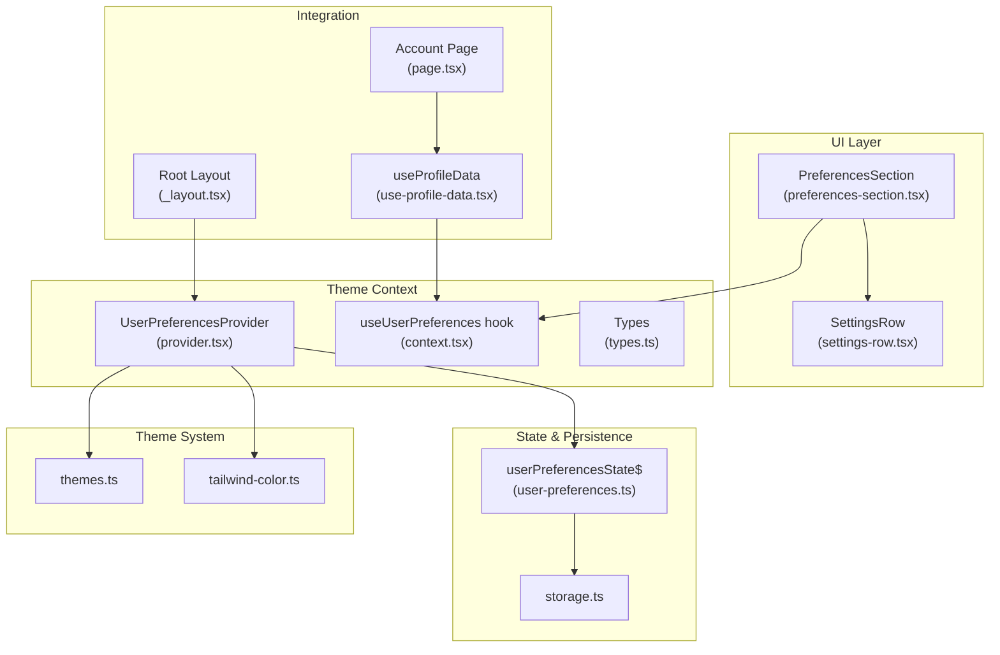
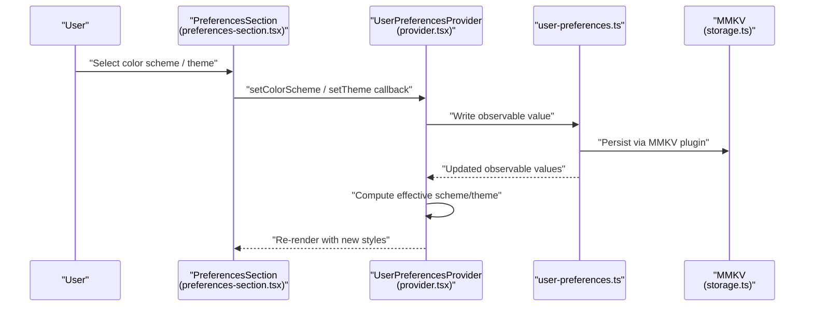
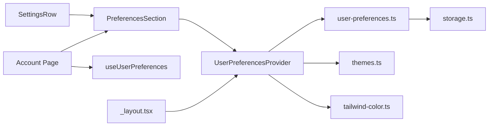

# Preferences Configuration

<cite>
**Referenced Files in This Document**
- [preferences-section.tsx](file://src/features/account/components/preferences-section.tsx)
- [settings-row.tsx](file://src/features/account/components/settings-row.tsx)
- [user-preferences.ts](file://src/data/states/user-preferences.ts)
- [provider.tsx](file://src/context/themes/provider.tsx)
- [context.tsx](file://src/context/themes/context.tsx)
- [types.ts](file://src/context/themes/types.ts)
- [themes.ts](file://src/lib/themes.ts)
- [tailwind-color.ts](file://src/utils/tailwind-color.ts)
- [page.tsx](file://src/features/account/page.tsx)
- [use-profile-data.tsx](file://src/features/account/use-profile-data.tsx)
- [storage.ts](file://src/data/storage.ts)
- [_layout.tsx](file://src/app/_layout.tsx)
</cite>

## Table of Contents
1. [Introduction](#introduction)
2. [Project Structure](#project-structure)
3. [Core Components](#core-components)
4. [Architecture Overview](#architecture-overview)
5. [Detailed Component Analysis](#detailed-component-analysis)
6. [Dependency Analysis](#dependency-analysis)
7. [Performance Considerations](#performance-considerations)
8. [Troubleshooting Guide](#troubleshooting-guide)
9. [Conclusion](#conclusion)

## Introduction
This document explains the user preferences configuration system used to organize application settings such as theme selection, color scheme, and background customization. It covers the settings row component pattern for consistent UI interactions, the state management with persistent storage, and the theme system including color scheme detection and background customization. It also provides examples of preference validation, default value handling, and persistence patterns.

## Project Structure
The preferences system spans several layers:
- UI components for displaying and editing preferences
- A theme provider that computes effective theme and color scheme
- A centralized preferences state with persistent storage
- Utilities for theme color resolution and conversion

**Diagram sources**
- [preferences-section.tsx:1-99](file://src/features/account/components/preferences-section.tsx#L1-L99)
- [settings-row.tsx:1-47](file://src/features/account/components/settings-row.tsx#L1-L47)
- [provider.tsx:1-156](file://src/context/themes/provider.tsx#L1-L156)
- [context.tsx:1-18](file://src/context/themes/context.tsx#L1-L18)
- [types.ts:1-15](file://src/context/themes/types.ts#L1-L15)
- [user-preferences.ts:1-28](file://src/data/states/user-preferences.ts#L1-L28)
- [themes.ts:1-214](file://src/lib/themes.ts#L1-L214)
- [tailwind-color.ts:1-241](file://src/utils/tailwind-color.ts#L1-L241)
- [page.tsx:1-70](file://src/features/account/page.tsx#L1-L70)
- [use-profile-data.tsx:1-18](file://src/features/account/use-profile-data.tsx#L1-L18)
- [storage.ts:1-74](file://src/data/storage.ts#L1-L74)
- [_layout.tsx:1-63](file://src/app/_layout.tsx#L1-L63)

**Section sources**
- [preferences-section.tsx:1-99](file://src/features/account/components/preferences-section.tsx#L1-L99)
- [settings-row.tsx:1-47](file://src/features/account/components/settings-row.tsx#L1-L47)
- [user-preferences.ts:1-28](file://src/data/states/user-preferences.ts#L1-L28)
- [provider.tsx:1-156](file://src/context/themes/provider.tsx#L1-L156)
- [context.tsx:1-18](file://src/context/themes/context.tsx#L1-L18)
- [types.ts:1-15](file://src/context/themes/types.ts#L1-L15)
- [themes.ts:1-214](file://src/lib/themes.ts#L1-L214)
- [tailwind-color.ts:1-241](file://src/utils/tailwind-color.ts#L1-L241)
- [page.tsx:1-70](file://src/features/account/page.tsx#L1-L70)
- [use-profile-data.tsx:1-18](file://src/features/account/use-profile-data.tsx#L1-L18)
- [storage.ts:1-74](file://src/data/storage.ts#L1-L74)
- [_layout.tsx:1-63](file://src/app/_layout.tsx#L1-L63)

## Core Components
- PreferencesSection: Renders grouped settings rows for color scheme and theme, and binds selection events to parent handlers.
- SettingsRow: A reusable row component supporting an icon, label, optional right content, chevron visibility, and destructive styling.
- UserPreferencesProvider: Computes effective color scheme and theme, exposes setters, and applies styles to the app container.
- user-preferences state: Observable preferences with defaults, persisted via MMKV, and synced across sessions.
- Theme system: Centralized color definitions and helpers to resolve theme variables and convert colors.

**Section sources**
- [preferences-section.tsx:25-99](file://src/features/account/components/preferences-section.tsx#L25-L99)
- [settings-row.tsx:8-47](file://src/features/account/components/settings-row.tsx#L8-L47)
- [provider.tsx:18-156](file://src/context/themes/provider.tsx#L18-L156)
- [user-preferences.ts:6-28](file://src/data/states/user-preferences.ts#L6-L28)
- [themes.ts:15-214](file://src/lib/themes.ts#L15-L214)
- [tailwind-color.ts:132-147](file://src/utils/tailwind-color.ts#L132-L147)

## Architecture Overview
The preferences system integrates UI, state, and theme layers:
- UI components render preferences and delegate changes to the theme provider.
- The theme provider reads from the observable preferences state and updates system color scheme and theme variables.
- Persistent storage ensures preferences survive app restarts and device migrations.

**Diagram sources**
- [preferences-section.tsx:32-99](file://src/features/account/components/preferences-section.tsx#L32-L99)
- [provider.tsx:37-98](file://src/context/themes/provider.tsx#L37-L98)
- [user-preferences.ts:12-28](file://src/data/states/user-preferences.ts#L12-L28)
- [storage.ts:1-74](file://src/data/storage.ts#L1-L74)

## Detailed Component Analysis

### PreferencesSection Component
Responsibilities:
- Define available options for color scheme and theme.
- Render two grouped settings rows for color scheme and theme.
- Bind selection callbacks to update preferences.

Behavior highlights:
- Uses SettingsRow to present labeled rows with icons and right-aligned selects.
- Translates current values to select options for controlled rendering.
- Delegates change handling to parent-provided callbacks.

Validation and defaults:
- Defaults are provided by the observable state; the component does not override them.

Persistence:
- Changes propagate to the observable state, which persists via MMKV.

**Section sources**
- [preferences-section.tsx:14-99](file://src/features/account/components/preferences-section.tsx#L14-L99)

### SettingsRow Component Pattern
Responsibilities:
- Provide a consistent layout for preference rows with icon, label, and optional right content.
- Support optional chevron when no right content is provided.
- Allow destructive styling for sensitive actions.

Usage pattern:
- Reusable across preferences and other settings screens.
- Encourages uniform UX for clickable rows.

**Section sources**
- [settings-row.tsx:18-47](file://src/features/account/components/settings-row.tsx#L18-L47)

### Theme Provider and Context
Responsibilities:
- Compute effective color scheme considering system preference and user choice.
- Expose setters for theme, color scheme, and background color.
- Apply theme variables and background color to the app container.

Effective color scheme computation:
- If user selected "system", derive from system color scheme.
- Otherwise, use the explicit light/dark selection.

Background color resolution:
- Converts theme variables to HSL for safe application.
- Falls back to reasonable defaults when variables are missing.

Validation and error handling:
- Validates inputs for color scheme and theme name.
- Logs errors during persistence attempts.

**Section sources**
- [provider.tsx:30-132](file://src/context/themes/provider.tsx#L30-L132)
- [context.tsx:11-17](file://src/context/themes/context.tsx#L11-L17)
- [types.ts:7-14](file://src/context/themes/types.ts#L7-L14)

### Theme System and Color Resolution
Raw color definitions:
- Centralized color palette per theme and scheme.
- Provides both raw numeric channels and NativeWind vars.

Color resolution utilities:
- Resolve CSS variables, Tailwind colors, or direct hex/RGB/HSL.
- Convert theme variables to HSL channels safely with fallbacks.

**Section sources**
- [themes.ts:15-214](file://src/lib/themes.ts#L15-L214)
- [tailwind-color.ts:132-147](file://src/utils/tailwind-color.ts#L132-L147)

### Preferences State Management and Persistence
State model:
- Observable preferences with typed keys for theme, color scheme, and background color.
- Defaults initialized in the observable state.

Persistence:
- Persisted using an MMKV plugin with a named store.
- Retry on sync failures enabled for reliability.

Storage integration:
- MMKV instance configured with encryption key from environment.
- Utility functions for clearing, key inspection, and deletion.

**Section sources**
- [user-preferences.ts:6-28](file://src/data/states/user-preferences.ts#L6-L28)
- [storage.ts:1-74](file://src/data/storage.ts#L1-L74)

### Integration in Account Screen
Responsibilities:
- Wire PreferencesSection to theme context getters and setters.
- Pass current theme and color scheme values.
- Delegate change callbacks to the theme provider.

**Section sources**
- [page.tsx:18-67](file://src/features/account/page.tsx#L18-L67)
- [use-profile-data.tsx:7-17](file://src/features/account/use-profile-data.tsx#L7-L17)

## Dependency Analysis
The preferences system exhibits clean separation of concerns:
- UI depends on context for theme values and setters.
- Provider depends on observable state and theme utilities.
- State depends on MMKV persistence.
- Theme utilities support color conversions and variable resolution.

**Diagram sources**
- [settings-row.tsx:1-47](file://src/features/account/components/settings-row.tsx#L1-L47)
- [preferences-section.tsx:1-99](file://src/features/account/components/preferences-section.tsx#L1-L99)
- [provider.tsx:1-156](file://src/context/themes/provider.tsx#L1-L156)
- [user-preferences.ts:1-28](file://src/data/states/user-preferences.ts#L1-L28)
- [storage.ts:1-74](file://src/data/storage.ts#L1-L74)
- [themes.ts:1-214](file://src/lib/themes.ts#L1-L214)
- [tailwind-color.ts:1-241](file://src/utils/tailwind-color.ts#L1-L241)
- [page.tsx:1-70](file://src/features/account/page.tsx#L1-L70)
- [context.tsx:1-18](file://src/context/themes/context.tsx#L1-L18)
- [_layout.tsx:1-63](file://src/app/_layout.tsx#L1-L63)

**Section sources**
- [preferences-section.tsx:1-99](file://src/features/account/components/preferences-section.tsx#L1-L99)
- [settings-row.tsx:1-47](file://src/features/account/components/settings-row.tsx#L1-L47)
- [provider.tsx:1-156](file://src/context/themes/provider.tsx#L1-L156)
- [user-preferences.ts:1-28](file://src/data/states/user-preferences.ts#L1-L28)
- [storage.ts:1-74](file://src/data/storage.ts#L1-L74)
- [themes.ts:1-214](file://src/lib/themes.ts#L1-L214)
- [tailwind-color.ts:1-241](file://src/utils/tailwind-color.ts#L1-L241)
- [page.tsx:1-70](file://src/features/account/page.tsx#L1-L70)
- [context.tsx:1-18](file://src/context/themes/context.tsx#L1-L18)
- [_layout.tsx:1-63](file://src/app/_layout.tsx#L1-L63)

## Performance Considerations
- Minimize re-renders by using memoization in the provider and selective updates via observables.
- Keep theme computations lightweight; avoid heavy synchronous work in render paths.
- Persist only necessary preferences to reduce IO overhead.

## Troubleshooting Guide
Common issues and resolutions:
- Invalid color scheme or theme values: Validation throws errors; ensure values match allowed sets.
- Background color not applying: Verify theme variable exists and is resolvable; fallbacks are applied when missing.
- Persistence failures: Check MMKV encryption key and storage permissions; review logs for sync errors.
- Device migration: MMKV persists across devices; ensure encryption keys are consistent if encrypted.

**Section sources**
- [provider.tsx:37-98](file://src/context/themes/provider.tsx#L37-L98)
- [tailwind-color.ts:132-147](file://src/utils/tailwind-color.ts#L132-L147)
- [storage.ts:19-23](file://src/data/storage.ts#L19-L23)

## Conclusion
The preferences configuration system combines a reusable settings row pattern, a robust theme provider, and observable state with persistent storage. It supports color scheme selection, theme switching, and background customization while ensuring defaults, validation, and persistence across sessions and devices.