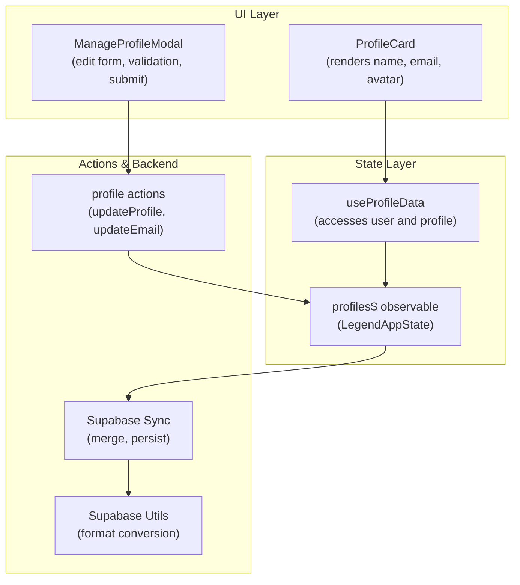
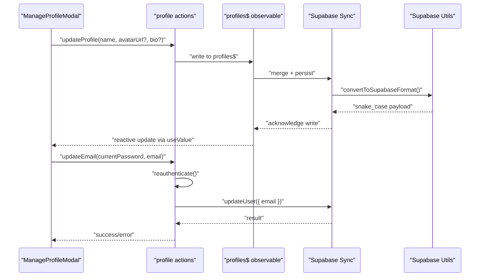
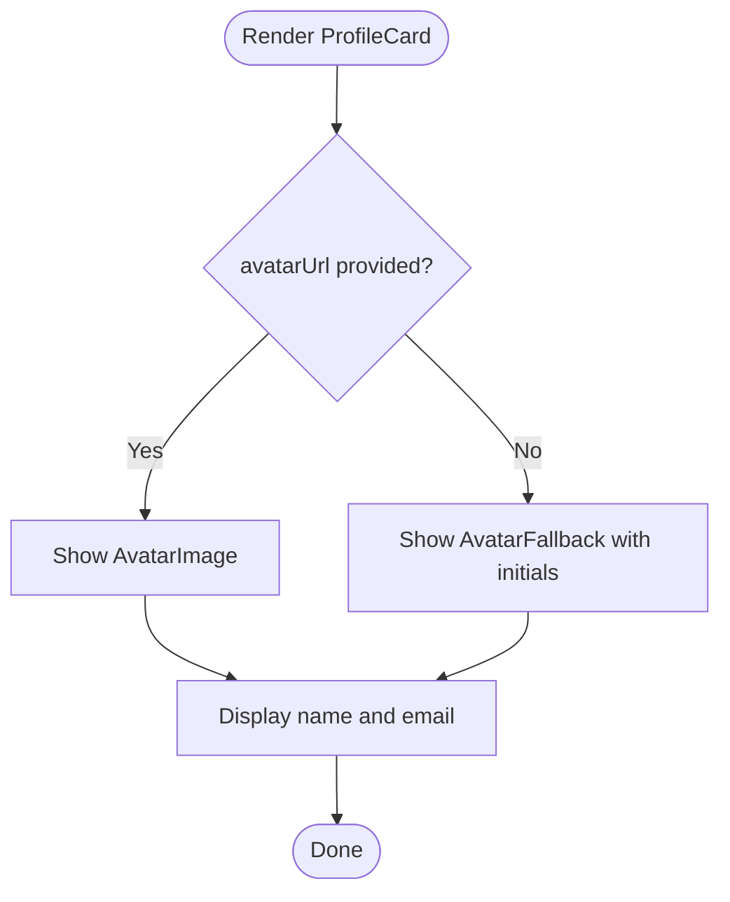
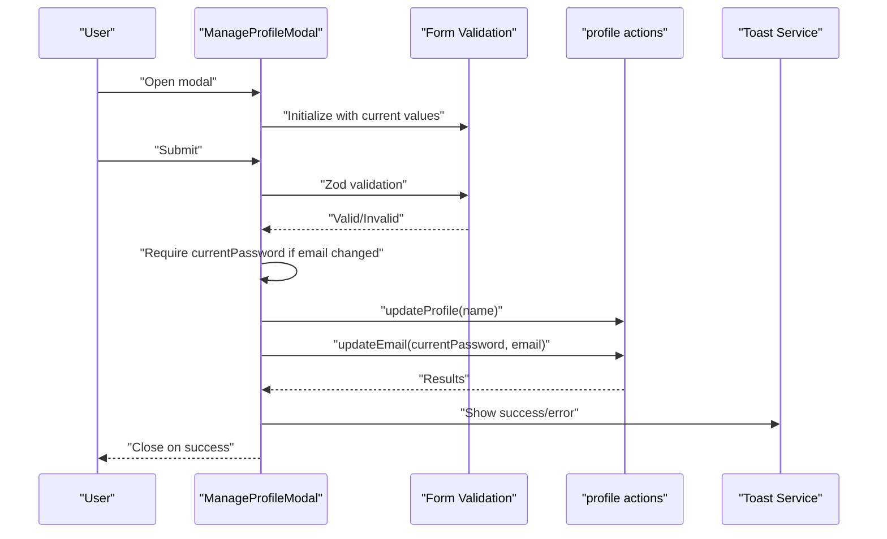
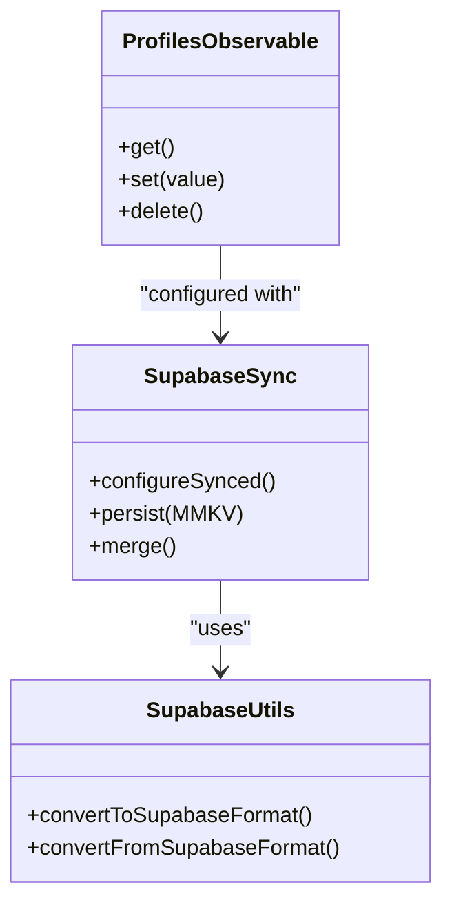
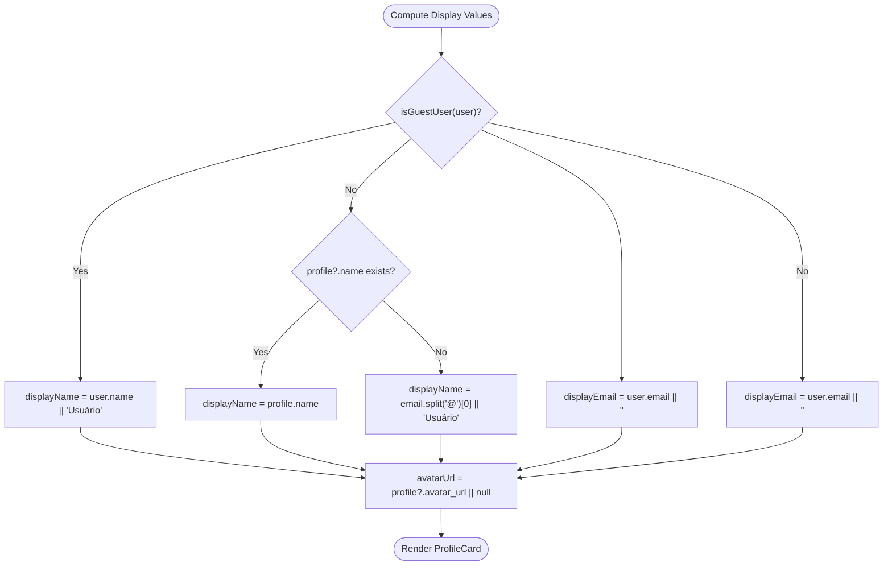
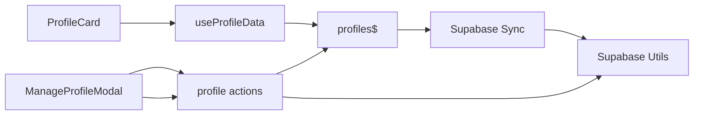

# Profile Management

<cite>
**Referenced Files in This Document**
- [profile-card.tsx](file://src/features/account/components/profile-card.tsx)
- [manage-profile-modal.tsx](file://src/features/account/components/manage-profile-modal.tsx)
- [page.tsx](file://src/features/account/page.tsx)
- [use-profile-data.tsx](file://src/features/account/use-profile-data.tsx)
- [profile.ts](file://src/data/states/profile.ts)
- [profile-actions.ts](file://src/data/actions/profile.ts)
- [profile-types.ts](file://src/data/types/profile.ts)
- [database.ts](file://src/data/database.ts)
- [user-types.ts](file://src/data/types/user.ts)
- [user-hook.ts](file://src/hooks/use-user.ts)
- [supabase-utils.ts](file://src/lib/supabase/utils.ts)
</cite>

## Table of Contents
1. [Introduction](#introduction)
2. [Project Structure](#project-structure)
3. [Core Components](#core-components)
4. [Architecture Overview](#architecture-overview)
5. [Detailed Component Analysis](#detailed-component-analysis)
6. [Dependency Analysis](#dependency-analysis)
7. [Performance Considerations](#performance-considerations)
8. [Troubleshooting Guide](#troubleshooting-guide)
9. [Conclusion](#conclusion)

## Introduction
This document describes the profile management system, focusing on:
- The profile card component that renders user identity and avatar
- The manage profile modal workflow for editing personal details, including validation, persistence, and email change reauthentication
- Profile data state management via LegendAppState and synchronization with Supabase
- Guest user profile handling and display logic
- Profile data fetching patterns and error handling

## Project Structure
The profile management system spans UI components, data state management, and backend synchronization:
- UI: ProfileCard and ManageProfileModal components
- State: LegendAppState observable store for profiles with Supabase sync
- Actions: Profile update actions and email reauthentication
- Types: Strongly typed profile and user models
- Hooks: User and profile data access utilities

**Diagram sources**
- [profile-card.tsx:1-35](file://src/features/account/components/profile-card.tsx#L1-L35)
- [manage-profile-modal.tsx:1-184](file://src/features/account/components/manage-profile-modal.tsx#L1-L184)
- [use-profile-data.tsx:1-18](file://src/features/account/use-profile-data.tsx#L1-L18)
- [profile.ts:10-20](file://src/data/states/profile.ts#L10-L20)
- [profile-actions.ts:1-53](file://src/data/actions/profile.ts#L1-L53)
- [supabase-utils.ts:1-10](file://src/lib/supabase/utils.ts#L1-L10)
- [database.ts:13-35](file://src/data/database.ts#L13-L35)

**Section sources**
- [profile-card.tsx:1-35](file://src/features/account/components/profile-card.tsx#L1-L35)
- [manage-profile-modal.tsx:1-184](file://src/features/account/components/manage-profile-modal.tsx#L1-L184)
- [use-profile-data.tsx:1-18](file://src/features/account/use-profile-data.tsx#L1-L18)
- [profile.ts:10-20](file://src/data/states/profile.ts#L10-L20)
- [profile-actions.ts:1-53](file://src/data/actions/profile.ts#L1-L53)
- [supabase-utils.ts:1-10](file://src/lib/supabase/utils.ts#L1-L10)
- [database.ts:13-35](file://src/data/database.ts#L13-L35)

## Core Components
- ProfileCard: Displays user name, email, and avatar with initials fallback
- ManageProfileModal: Editable form with Zod validation, conditional password prompt for email changes, and submission handling
- useProfileData: Provides reactive access to user, profile, and theme preferences
- profiles$ observable: Centralized state for profiles with Supabase synchronization
- profile actions: Update profile name/bio/avatar and update email with reauthentication

**Section sources**
- [profile-card.tsx:19-35](file://src/features/account/components/profile-card.tsx#L19-L35)
- [manage-profile-modal.tsx:35-103](file://src/features/account/components/manage-profile-modal.tsx#L35-L103)
- [use-profile-data.tsx:7-15](file://src/features/account/use-profile-data.tsx#L7-L15)
- [profile.ts:10-20](file://src/data/states/profile.ts#L10-L20)
- [profile-actions.ts:30-40](file://src/data/actions/profile.ts#L30-L40)

## Architecture Overview
The system uses a reactive state layer powered by LegendAppState with Supabase synchronization. Changes made in the UI propagate to the observable store, which merges with local persistence and synchronizes with Supabase. Profile updates are atomic and typed, ensuring consistency across the client and server.

**Diagram sources**
- [manage-profile-modal.tsx:63-103](file://src/features/account/components/manage-profile-modal.tsx#L63-L103)
- [profile.ts:121-159](file://src/data/states/profile.ts#L121-L159)
- [profile-actions.ts:30-40](file://src/data/actions/profile.ts#L30-L40)
- [supabase-utils.ts:3-9](file://src/lib/supabase/utils.ts#L3-L9)
- [database.ts:13-29](file://src/data/database.ts#L13-L29)

## Detailed Component Analysis

### Profile Card Component
Purpose:
- Render user identity and avatar with initials fallback when no avatar is present
- Accept props for name, email, and optional avatar URL

Key behaviors:
- Initials generation from the first two name parts
- Conditional rendering of avatar image vs. initials fallback
- Responsive layout with centered alignment

**Diagram sources**
- [profile-card.tsx:19-35](file://src/features/account/components/profile-card.tsx#L19-L35)

**Section sources**
- [profile-card.tsx:11-17](file://src/features/account/components/profile-card.tsx#L11-L17)
- [profile-card.tsx:20-32](file://src/features/account/components/profile-card.tsx#L20-L32)

### Manage Profile Modal Workflow
Purpose:
- Allow users to edit name and email with validation
- Require current password when changing email
- Persist changes via profile actions and show feedback

Validation rules:
- Name: minimum 2 characters
- Email: valid email format
- Current password: required when email is changed

Submission flow:
- Detect changes in name and email
- Conditionally require current password for email change
- Execute updates concurrently for name/email
- Handle errors and show toasts
- Close modal on success

**Diagram sources**
- [manage-profile-modal.tsx:20-26](file://src/features/account/components/manage-profile-modal.tsx#L20-L26)
- [manage-profile-modal.tsx:63-103](file://src/features/account/components/manage-profile-modal.tsx#L63-L103)
- [profile-actions.ts:30-40](file://src/data/actions/profile.ts#L30-L40)

**Section sources**
- [manage-profile-modal.tsx:20-26](file://src/features/account/components/manage-profile-modal.tsx#L20-L26)
- [manage-profile-modal.tsx:63-103](file://src/features/account/components/manage-profile-modal.tsx#L63-L103)

### Profile Data State Management with LegendAppState
State model:
- profiles$ observable configured with Supabase sync
- Merge mode with local persistence via MMKV
- Automatic conversion between camelCase and snake_case

Operations:
- getProfile: fetch current user’s profile
- createProfile: initialize profile for authenticated user
- updateProfile: update name, avatar, and bio
- deleteProfile: remove profile record
- resetProfilesStore: clear observable and persisted data

**Diagram sources**
- [profile.ts:10-20](file://src/data/states/profile.ts#L10-L20)
- [database.ts:13-29](file://src/data/database.ts#L13-L29)
- [supabase-utils.ts:3-9](file://src/lib/supabase/utils.ts#L3-L9)

**Section sources**
- [profile.ts:10-20](file://src/data/states/profile.ts#L10-L20)
- [profile.ts:33-48](file://src/data/states/profile.ts#L33-L48)
- [profile.ts:61-103](file://src/data/states/profile.ts#L61-L103)
- [profile.ts:121-159](file://src/data/states/profile.ts#L121-L159)
- [profile.ts:171-186](file://src/data/states/profile.ts#L171-L186)
- [database.ts:13-29](file://src/data/database.ts#L13-L29)
- [supabase-utils.ts:3-9](file://src/lib/supabase/utils.ts#L3-L9)

### Guest User Profile Handling and Display Logic
Display logic:
- For guest users: show user.name or default label; hide email
- For authenticated users: show profile.name if available, otherwise derive name from email; always show email

Avatar resolution:
- Use profile.avatar_url if present; otherwise no avatar

**Diagram sources**
- [page.tsx:24-28](file://src/features/account/page.tsx#L24-L28)
- [user-types.ts:41-43](file://src/data/types/user.ts#L41-L43)

**Section sources**
- [page.tsx:24-28](file://src/features/account/page.tsx#L24-L28)
- [user-types.ts:41-43](file://src/data/types/user.ts#L41-L43)

### Profile Data Fetching Patterns
- Reactive access via useProfileData: subscribes to LegendAppState and extracts current profile for the logged-in user
- profiles$ observable keyed by user id; filtering ensures only the current user’s profile is considered
- Type-safe conversions between client-side camelCase and Supabase snake_case fields

**Section sources**
- [use-profile-data.tsx:7-15](file://src/features/account/use-profile-data.tsx#L7-L15)
- [profile.ts:10-20](file://src/data/states/profile.ts#L10-L20)
- [supabase-utils.ts:3-9](file://src/lib/supabase/utils.ts#L3-L9)

### Examples and Best Practices
- Validation rules:
  - Name: minimum length enforced
  - Email: format validated
  - Current password: mandatory when changing email
- Image handling:
  - Avatar URL stored in profile; rendered conditionally in ProfileCard
- Error handling:
  - Action-level error propagation with user-friendly messages
  - Toast notifications for success and failure
  - Graceful fallbacks (initials avatar, derived name)

**Section sources**
- [manage-profile-modal.tsx:20-26](file://src/features/account/components/manage-profile-modal.tsx#L20-L26)
- [manage-profile-modal.tsx:69-96](file://src/features/account/components/manage-profile-modal.tsx#L69-L96)
- [profile-card.tsx:22-27](file://src/features/account/components/profile-card.tsx#L22-L27)

## Dependency Analysis
High-level dependencies:
- UI components depend on state hooks and actions
- State layer depends on Supabase sync and persistence
- Actions depend on Supabase auth and profile state
- Utilities bridge client and server field naming conventions

**Diagram sources**
- [profile-card.tsx:19-35](file://src/features/account/components/profile-card.tsx#L19-L35)
- [manage-profile-modal.tsx:10-12](file://src/features/account/components/manage-profile-modal.tsx#L10-L12)
- [use-profile-data.tsx:2-5](file://src/features/account/use-profile-data.tsx#L2-L5)
- [profile.ts:10-20](file://src/data/states/profile.ts#L10-L20)
- [profile-actions.ts:1-1](file://src/data/actions/profile.ts#L1-L1)
- [supabase-utils.ts:1-10](file://src/lib/supabase/utils.ts#L1-L10)
- [database.ts:13-29](file://src/data/database.ts#L13-L29)

**Section sources**
- [profile-card.tsx:19-35](file://src/features/account/components/profile-card.tsx#L19-L35)
- [manage-profile-modal.tsx:10-12](file://src/features/account/components/manage-profile-modal.tsx#L10-L12)
- [use-profile-data.tsx:2-5](file://src/features/account/use-profile-data.tsx#L2-L5)
- [profile.ts:10-20](file://src/data/states/profile.ts#L10-L20)
- [profile-actions.ts:1-1](file://src/data/actions/profile.ts#L1-L1)
- [supabase-utils.ts:1-10](file://src/lib/supabase/utils.ts#L1-L10)
- [database.ts:13-29](file://src/data/database.ts#L13-L29)

## Performance Considerations
- Reactive updates: LegendAppState triggers minimal re-renders when only affected fields change
- Batched writes: updateProfile applies multiple field updates atomically in the observable store
- Local persistence: MMKV reduces network latency and improves resilience during offline scenarios
- Field conversion: centralized decamelize/camelize utilities avoid repeated transformations

## Troubleshooting Guide
Common issues and resolutions:
- Email change requires current password: ensure the modal prompts for currentPassword when email is modified
- Profile not found: updateProfile throws if no profile exists; ensure profile initialization occurs after authentication
- Reauthentication failures: updateEmail returns specific error messages for invalid credentials or auth failures
- Avatar not displaying: verify avatar_url is set in profile; fallback initials are shown when null
- Guest user display: confirm guest user flag and name/email presence for correct rendering

**Section sources**
- [manage-profile-modal.tsx:69-72](file://src/features/account/components/manage-profile-modal.tsx#L69-L72)
- [profile.ts:131-133](file://src/data/states/profile.ts#L131-L133)
- [profile-actions.ts:34-39](file://src/data/actions/profile.ts#L34-L39)
- [profile-card.tsx:22-27](file://src/features/account/components/profile-card.tsx#L22-L27)
- [page.tsx:24-28](file://src/features/account/page.tsx#L24-L28)

## Conclusion
The profile management system combines a clean UI layer with robust reactive state management and Supabase synchronization. It enforces strong validation, handles guest and authenticated users distinctly, and provides reliable persistence and error handling. The modular design allows for straightforward extension, such as adding avatar upload functionality, while maintaining type safety and predictable data flow.