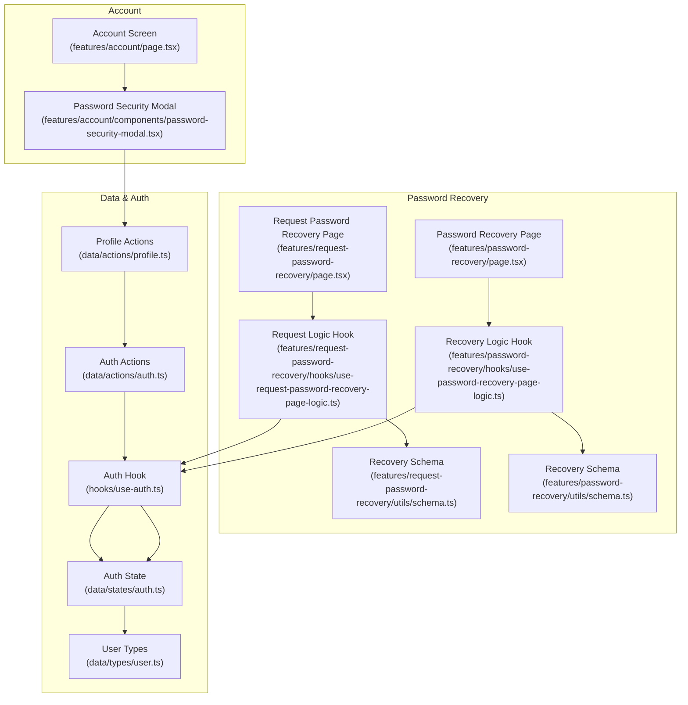
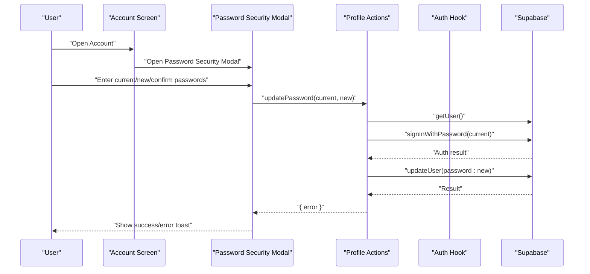
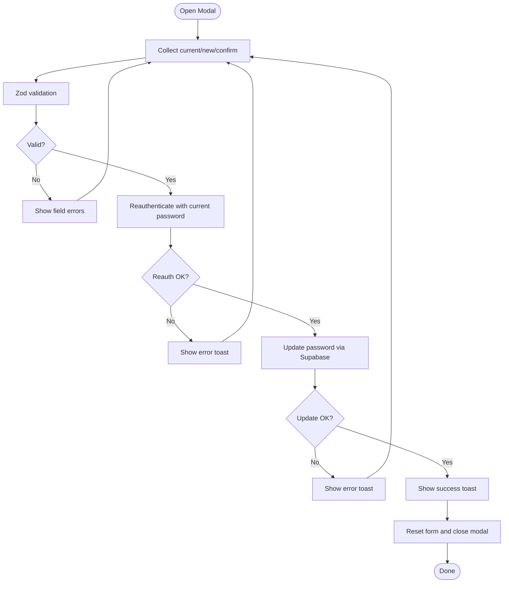
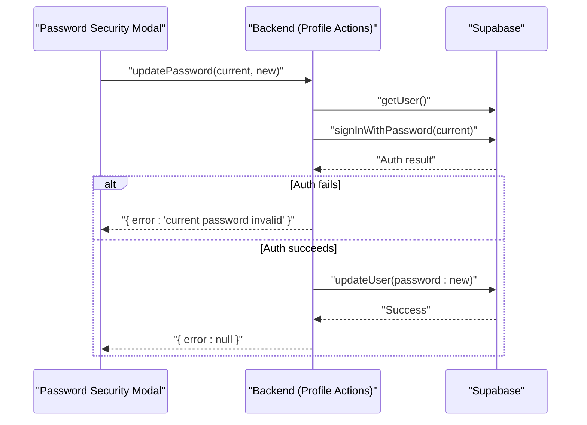
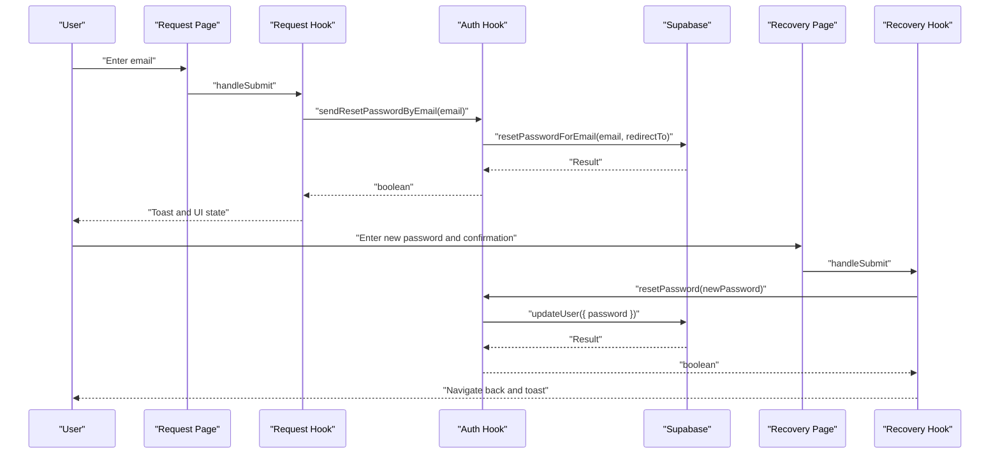
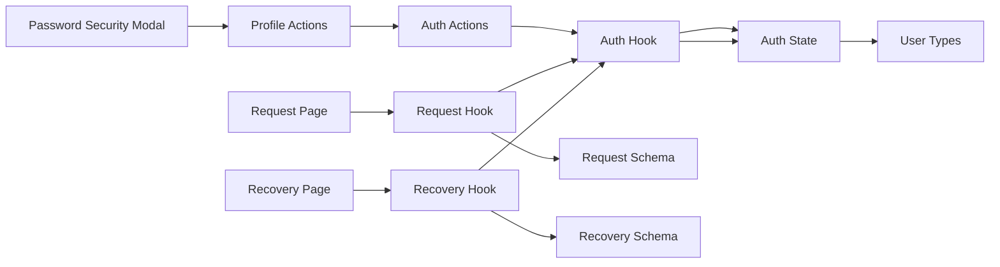

# Security Settings

<cite>
**Referenced Files in This Document**
- [password-security-modal.tsx](file://src/features/account/components/password-security-modal.tsx)
- [profile.ts](file://src/data/actions/profile.ts)
- [account.tsx](file://src/features/account/page.tsx)
- [auth.ts](file://src/data/actions/auth.ts)
- [use-auth.ts](file://src/hooks/use-auth.ts)
- [request-password-recovery.tsx](file://src/features/request-password-recovery/page.tsx)
- [use-request-password-recovery-page-logic.ts](file://src/features/request-password-recovery/hooks/use-request-password-recovery-page-logic.ts)
- [schema.ts (request-password-recovery)](file://src/features/request-password-recovery/utils/schema.ts)
- [password-recovery.tsx](file://src/features/password-recovery/page.tsx)
- [use-password-recovery-page-logic.ts](file://src/features/password-recovery/hooks/use-password-recovery-page-logic.ts)
- [schema.ts (password-recovery)](file://src/features/password-recovery/utils/schema.ts)
- [schema.ts (create-account)](file://src/features/create-account/utils/schema.ts)
- [auth.ts (state)](file://src/data/states/auth.ts)
- [user.ts](file://src/data/types/user.ts)
</cite>

## Table of Contents
1. [Introduction](#introduction)
2. [Project Structure](#project-structure)
3. [Core Components](#core-components)
4. [Architecture Overview](#architecture-overview)
5. [Detailed Component Analysis](#detailed-component-analysis)
6. [Dependency Analysis](#dependency-analysis)
7. [Performance Considerations](#performance-considerations)
8. [Troubleshooting Guide](#troubleshooting-guide)
9. [Conclusion](#conclusion)

## Introduction
This document describes the security settings and password management system, focusing on:
- The password security modal for changing passwords, including form validation, security requirements, and error handling.
- The password change workflow with current password verification, new password confirmation, and error handling.
- Password recovery integration covering request password recovery and password reset processes.
- Security validation patterns, password policy enforcement, and account protection measures.
- Examples of secure password handling, validation error responses, and security best practices for user authentication.

## Project Structure
The security-related features are organized under:
- Account management screen and modal for password changes.
- Password recovery request and reset pages with dedicated hooks and validation schemas.
- Authentication utilities and Supabase integration for secure operations.

**Diagram sources**
- [account.tsx:18-70](file://src/features/account/page.tsx#L18-L70)
- [password-security-modal.tsx:37-148](file://src/features/account/components/password-security-modal.tsx#L37-L148)
- [profile.ts:42-52](file://src/data/actions/profile.ts#L42-L52)
- [auth.ts:99-110](file://src/data/actions/auth.ts#L99-L110)
- [use-auth.ts:185-229](file://src/hooks/use-auth.ts#L185-L229)
- [auth.ts (state):22-33](file://src/data/states/auth.ts#L22-L33)
- [user.ts:1-44](file://src/data/types/user.ts#L1-L44)
- [request-password-recovery.tsx:13-101](file://src/features/request-password-recovery/page.tsx#L13-L101)
- [use-request-password-recovery-page-logic.ts:18-88](file://src/features/request-password-recovery/hooks/use-request-password-recovery-page-logic.ts#L18-L88)
- [schema.ts (request-password-recovery):1-6](file://src/features/request-password-recovery/utils/schema.ts#L1-L6)
- [password-recovery.tsx:14-139](file://src/features/password-recovery/page.tsx#L14-L139)
- [use-password-recovery-page-logic.ts:9-55](file://src/features/password-recovery/hooks/use-password-recovery-page-logic.ts#L9-L55)
- [schema.ts (password-recovery):1-18](file://src/features/password-recovery/utils/schema.ts#L1-L18)

**Section sources**
- [account.tsx:18-70](file://src/features/account/page.tsx#L18-L70)
- [password-security-modal.tsx:37-148](file://src/features/account/components/password-security-modal.tsx#L37-L148)
- [profile.ts:42-52](file://src/data/actions/profile.ts#L42-L52)
- [auth.ts:99-110](file://src/data/actions/auth.ts#L99-L110)
- [use-auth.ts:185-229](file://src/hooks/use-auth.ts#L185-L229)
- [auth.ts (state):22-33](file://src/data/states/auth.ts#L22-L33)
- [user.ts:1-44](file://src/data/types/user.ts#L1-L44)
- [request-password-recovery.tsx:13-101](file://src/features/request-password-recovery/page.tsx#L13-L101)
- [use-request-password-recovery-page-logic.ts:18-88](file://src/features/request-password-recovery/hooks/use-request-password-recovery-page-logic.ts#L18-L88)
- [schema.ts (request-password-recovery):1-6](file://src/features/request-password-recovery/utils/schema.ts#L1-L6)
- [password-recovery.tsx:14-139](file://src/features/password-recovery/page.tsx#L14-L139)
- [use-password-recovery-page-logic.ts:9-55](file://src/features/password-recovery/hooks/use-password-recovery-page-logic.ts#L9-L55)
- [schema.ts (password-recovery):1-18](file://src/features/password-recovery/utils/schema.ts#L1-L18)

## Core Components
- Password Security Modal: Collects current and new password, validates via Zod, and triggers a secure update through profile actions.
- Profile Actions: Performs current password reauthentication and updates the user’s password via Supabase.
- Auth Hook: Provides password recovery operations (send reset email and reset password) and integrates with Supabase.
- Request Password Recovery Page and Hook: Validates email input, enforces rate limits, and sends reset emails.
- Password Recovery Page and Hook: Handles new password and confirmation, ensuring equality and minimum length, then resets the password.

Key responsibilities:
- Form validation and user feedback.
- Secure credential handling and error propagation.
- Rate limiting and protection against abuse during recovery requests.
- Session and state synchronization after sensitive operations.

**Section sources**
- [password-security-modal.tsx:19-28](file://src/features/account/components/password-security-modal.tsx#L19-L28)
- [profile.ts:3-28](file://src/data/actions/profile.ts#L3-L28)
- [use-auth.ts:185-229](file://src/hooks/use-auth.ts#L185-L229)
- [use-request-password-recovery-page-logic.ts:43-75](file://src/features/request-password-recovery/hooks/use-request-password-recovery-page-logic.ts#L43-L75)
- [use-password-recovery-page-logic.ts:28-41](file://src/features/password-recovery/hooks/use-password-recovery-page-logic.ts#L28-L41)

## Architecture Overview
The security system integrates UI components with data actions and authentication utilities. It leverages Supabase for identity operations and local state for user/session management.

**Diagram sources**
- [account.tsx:30-66](file://src/features/account/page.tsx#L30-L66)
- [password-security-modal.tsx:55-68](file://src/features/account/components/password-security-modal.tsx#L55-L68)
- [profile.ts:42-52](file://src/data/actions/profile.ts#L42-L52)
- [use-auth.ts:99-110](file://src/data/actions/auth.ts#L99-L110)

## Detailed Component Analysis

### Password Security Modal
Purpose:
- Provide a secure interface to change the user’s password.
- Validate inputs and show localized error messages.
- Reauthenticate the user with the current password before applying changes.

Validation and requirements:
- Current password: required.
- New password: minimum length enforced.
- Confirm password: must match new password.

Processing logic:
- On submit, disable UI, call update action, handle errors, and show toasts.
- Reset form and close modal on success.

**Diagram sources**
- [password-security-modal.tsx:19-28](file://src/features/account/components/password-security-modal.tsx#L19-L28)
- [password-security-modal.tsx:55-68](file://src/features/account/components/password-security-modal.tsx#L55-L68)
- [profile.ts:42-52](file://src/data/actions/profile.ts#L42-L52)

**Section sources**
- [password-security-modal.tsx:19-28](file://src/features/account/components/password-security-modal.tsx#L19-L28)
- [password-security-modal.tsx:37-148](file://src/features/account/components/password-security-modal.tsx#L37-L148)
- [profile.ts:42-52](file://src/data/actions/profile.ts#L42-L52)

### Password Change Workflow
End-to-end flow:
- Open Account screen → open Password Security Modal.
- Enter current password and new password.
- Backend reauthenticates using current password.
- If valid, updates the password in Supabase.
- On success, shows success toast and closes modal; otherwise, shows error toast.

**Diagram sources**
- [profile.ts:3-28](file://src/data/actions/profile.ts#L3-L28)
- [profile.ts:42-52](file://src/data/actions/profile.ts#L42-L52)

**Section sources**
- [profile.ts:3-28](file://src/data/actions/profile.ts#L3-L28)
- [profile.ts:42-52](file://src/data/actions/profile.ts#L42-L52)

### Password Recovery Integration
Request Password Recovery:
- Validates email format.
- Enforces rate limits (per minute and per hour).
- Sends reset password email via Supabase with a redirect to the recovery page.

Password Recovery Reset:
- Validates new password length and confirmation equality.
- Updates the password via Supabase and navigates back.

**Diagram sources**
- [request-password-recovery.tsx:13-101](file://src/features/request-password-recovery/page.tsx#L13-L101)
- [use-request-password-recovery-page-logic.ts:43-75](file://src/features/request-password-recovery/hooks/use-request-password-recovery-page-logic.ts#L43-L75)
- [use-auth.ts:185-208](file://src/hooks/use-auth.ts#L185-L208)
- [password-recovery.tsx:14-139](file://src/features/password-recovery/page.tsx#L14-L139)
- [use-password-recovery-page-logic.ts:28-41](file://src/features/password-recovery/hooks/use-password-recovery-page-logic.ts#L28-L41)
- [use-auth.ts:210-229](file://src/hooks/use-auth.ts#L210-L229)

**Section sources**
- [request-password-recovery.tsx:13-101](file://src/features/request-password-recovery/page.tsx#L13-L101)
- [use-request-password-recovery-page-logic.ts:18-88](file://src/features/request-password-recovery/hooks/use-request-password-recovery-page-logic.ts#L18-L88)
- [schema.ts (request-password-recovery):1-6](file://src/features/request-password-recovery/utils/schema.ts#L1-L6)
- [password-recovery.tsx:14-139](file://src/features/password-recovery/page.tsx#L14-L139)
- [use-password-recovery-page-logic.ts:9-55](file://src/features/password-recovery/hooks/use-password-recovery-page-logic.ts#L9-L55)
- [schema.ts (password-recovery):1-18](file://src/features/password-recovery/utils/schema.ts#L1-L18)
- [use-auth.ts:185-229](file://src/hooks/use-auth.ts#L185-L229)

### Security Validation Patterns and Policy Enforcement
- Minimum password lengths:
  - Change password: new password minimum length enforced.
  - Create account: password minimum length enforced.
  - Password recovery: new password minimum length enforced.
- Equality checks:
  - Change password: new password must equal confirmation.
  - Password recovery: new password must equal confirmation.
- Email validation:
  - Request password recovery: strict email format validation.
- Rate limiting:
  - Request password recovery: per-minute and per-hour caps to prevent abuse.
- Reauthentication:
  - Change password: current password verified before applying changes.
- Secure transmission:
  - All sensitive operations use Supabase authenticated APIs.

**Section sources**
- [password-security-modal.tsx:19-28](file://src/features/account/components/password-security-modal.tsx#L19-L28)
- [schema.ts (create-account):5-8](file://src/features/create-account/utils/schema.ts#L5-L8)
- [schema.ts (password-recovery):7-17](file://src/features/password-recovery/utils/schema.ts#L7-L17)
- [use-request-password-recovery-page-logic.ts:47-59](file://src/features/request-password-recovery/hooks/use-request-password-recovery-page-logic.ts#L47-L59)
- [profile.ts:42-52](file://src/data/actions/profile.ts#L42-L52)

### Account Protection Measures
- Session and user synchronization after authentication and sign-in/sign-up.
- Guest user handling and migration to authenticated sessions.
- Centralized error handling with user-friendly messages.
- Local state persistence for user/session with initialization flags.

**Section sources**
- [auth.ts:16-30](file://src/data/actions/auth.ts#L16-L30)
- [auth.ts:72-97](file://src/data/actions/auth.ts#L72-L97)
- [use-auth.ts:29-74](file://src/hooks/use-auth.ts#L29-L74)
- [auth.ts (state):22-33](file://src/data/states/auth.ts#L22-L33)
- [user.ts:41-43](file://src/data/types/user.ts#L41-L43)

## Dependency Analysis
The components interact as follows:
- UI components depend on hooks for form logic and validation.
- Hooks depend on authentication utilities for Supabase operations.
- Profile actions depend on Supabase for reauthentication and updates.
- Auth actions depend on Supabase and local state for session management.

**Diagram sources**
- [password-security-modal.tsx:37-148](file://src/features/account/components/password-security-modal.tsx#L37-L148)
- [profile.ts:42-52](file://src/data/actions/profile.ts#L42-L52)
- [auth.ts:99-110](file://src/data/actions/auth.ts#L99-L110)
- [use-auth.ts:185-229](file://src/hooks/use-auth.ts#L185-L229)
- [auth.ts (state):22-33](file://src/data/states/auth.ts#L22-L33)
- [user.ts:1-44](file://src/data/types/user.ts#L1-L44)
- [request-password-recovery.tsx:13-101](file://src/features/request-password-recovery/page.tsx#L13-L101)
- [use-request-password-recovery-page-logic.ts:18-88](file://src/features/request-password-recovery/hooks/use-request-password-recovery-page-logic.ts#L18-L88)
- [schema.ts (request-password-recovery):1-6](file://src/features/request-password-recovery/utils/schema.ts#L1-L6)
- [password-recovery.tsx:14-139](file://src/features/password-recovery/page.tsx#L14-L139)
- [use-password-recovery-page-logic.ts:9-55](file://src/features/password-recovery/hooks/use-password-recovery-page-logic.ts#L9-L55)
- [schema.ts (password-recovery):1-18](file://src/features/password-recovery/utils/schema.ts#L1-L18)

**Section sources**
- [password-security-modal.tsx:37-148](file://src/features/account/components/password-security-modal.tsx#L37-L148)
- [profile.ts:42-52](file://src/data/actions/profile.ts#L42-L52)
- [auth.ts:99-110](file://src/data/actions/auth.ts#L99-L110)
- [use-auth.ts:185-229](file://src/hooks/use-auth.ts#L185-L229)
- [auth.ts (state):22-33](file://src/data/states/auth.ts#L22-L33)
- [user.ts:1-44](file://src/data/types/user.ts#L1-L44)
- [request-password-recovery.tsx:13-101](file://src/features/request-password-recovery/page.tsx#L13-L101)
- [use-request-password-recovery-page-logic.ts:18-88](file://src/features/request-password-recovery/hooks/use-request-password-recovery-page-logic.ts#L18-L88)
- [schema.ts (request-password-recovery):1-6](file://src/features/request-password-recovery/utils/schema.ts#L1-L6)
- [password-recovery.tsx:14-139](file://src/features/password-recovery/page.tsx#L14-L139)
- [use-password-recovery-page-logic.ts:9-55](file://src/features/password-recovery/hooks/use-password-recovery-page-logic.ts#L9-L55)
- [schema.ts (password-recovery):1-18](file://src/features/password-recovery/utils/schema.ts#L1-L18)

## Performance Considerations
- Minimize network calls: batch operations where possible and avoid redundant reauth attempts.
- Debounce or throttle recovery email requests to respect rate limits.
- Keep UI responsive: disable submit buttons while loading and show appropriate loading states.
- Persist minimal session data locally to reduce cold-start overhead.

## Troubleshooting Guide
Common issues and resolutions:
- Current password incorrect: The system reauthenticates using the provided current password and returns a specific error if credentials are invalid.
- New password mismatch: Confirmation must exactly match the new password; mismatches trigger validation errors.
- Email validation failures: Ensure the email matches the expected format before sending recovery requests.
- Rate limit exceeded: Requests are blocked temporarily; inform users of remaining time and retry availability.
- Network or server errors: Centralized error handling displays user-friendly messages and logs underlying errors.

Operational tips:
- Use toast notifications to communicate success and failure states clearly.
- Reset forms and close modals on successful operations to prevent stale data.
- Verify session state after sensitive operations to maintain consistency.

**Section sources**
- [profile.ts:15-26](file://src/data/actions/profile.ts#L15-L26)
- [password-security-modal.tsx:59-62](file://src/features/account/components/password-security-modal.tsx#L59-L62)
- [use-request-password-recovery-page-logic.ts:47-59](file://src/features/request-password-recovery/hooks/use-request-password-recovery-page-logic.ts#L47-L59)
- [use-auth.ts:111-120](file://src/hooks/use-auth.ts#L111-L120)
- [use-auth.ts:199-207](file://src/hooks/use-auth.ts#L199-L207)
- [use-auth.ts:218-228](file://src/hooks/use-auth.ts#L218-L228)

## Conclusion
The security settings and password management system combines robust client-side validation, secure backend reauthentication, and Supabase-driven operations to protect user accounts. It enforces strong password policies, prevents abuse via rate limiting, and provides clear feedback through toasts and UI states. Adhering to these patterns ensures a secure and user-friendly authentication experience.