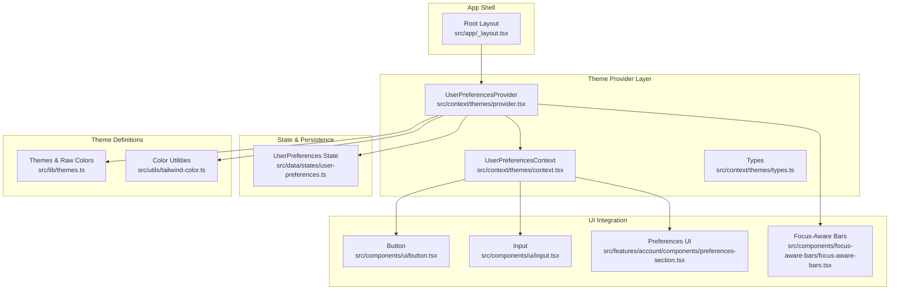
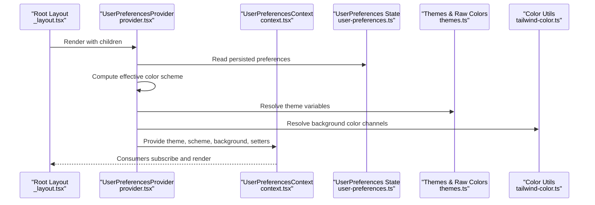
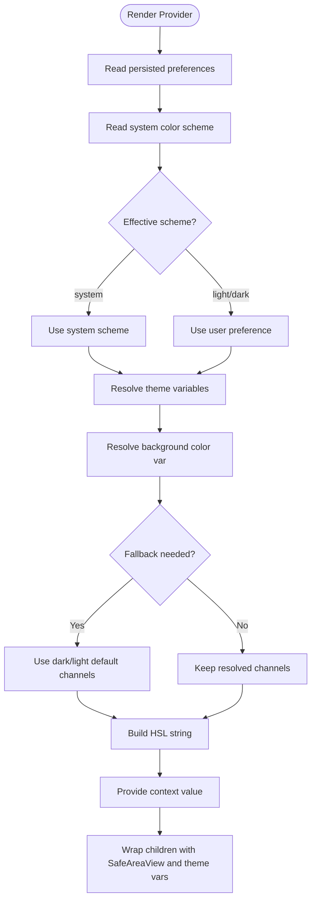
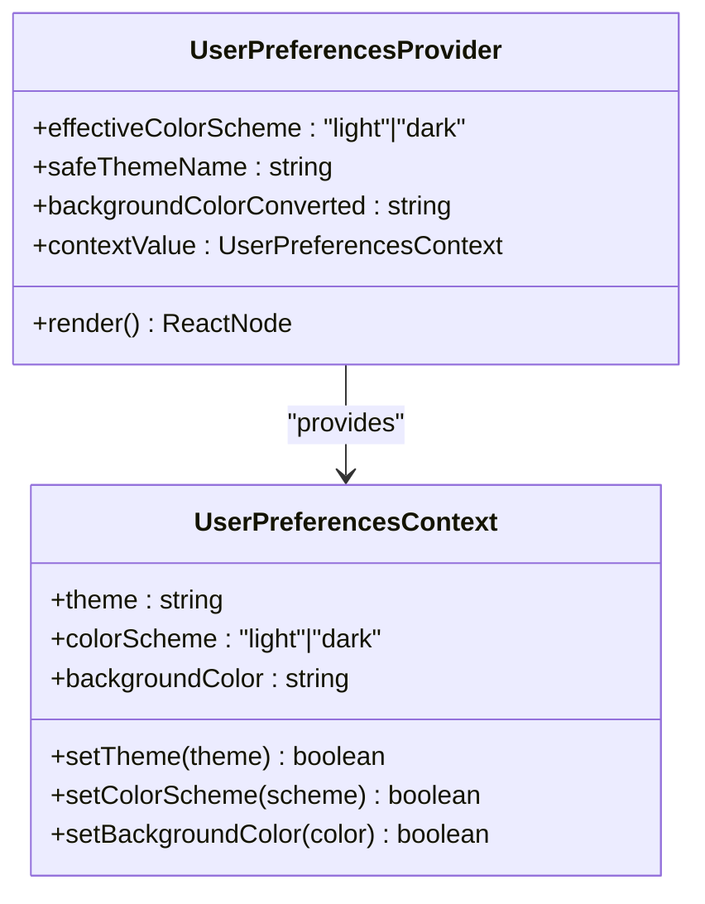
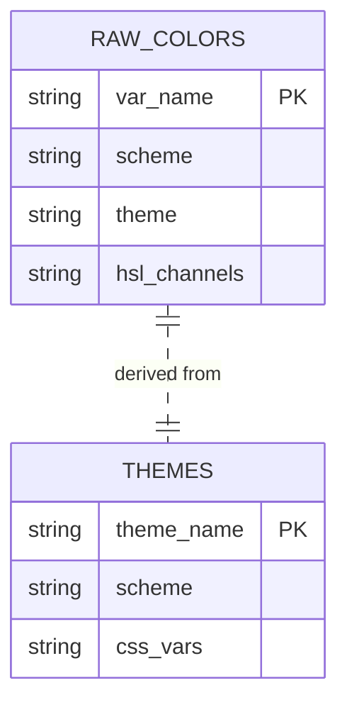
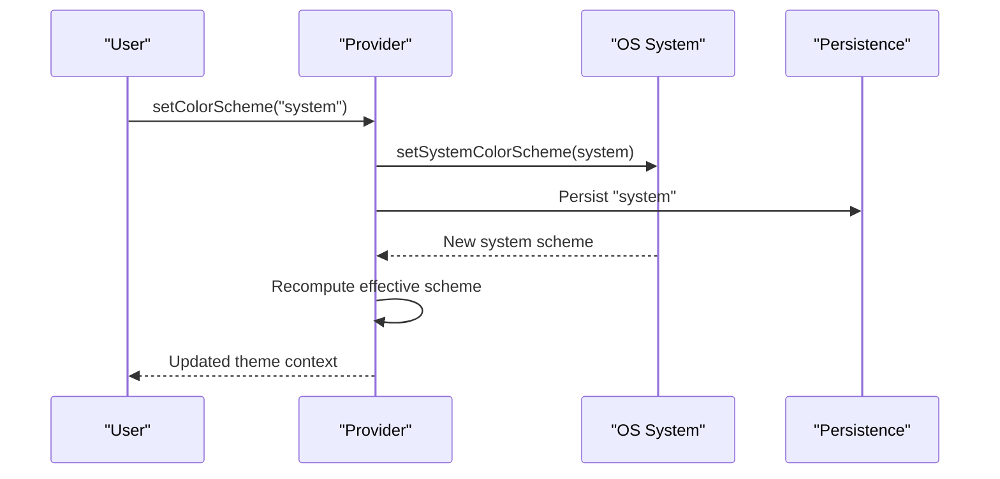
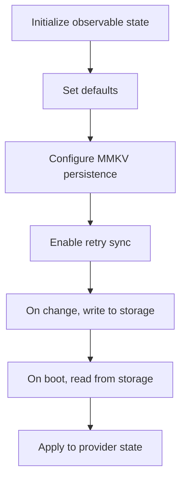
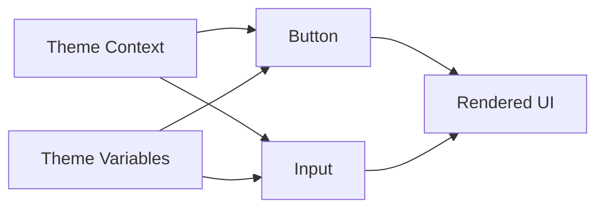
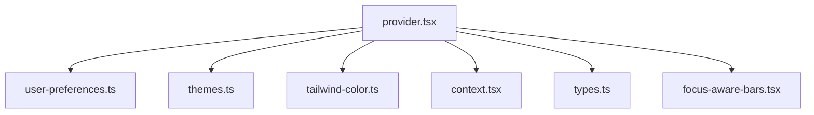

# Theme Customization

<cite>
**Referenced Files in This Document**
- [_layout.tsx](file://src/app/_layout.tsx)
- [provider.tsx](file://src/context/themes/provider.tsx)
- [context.tsx](file://src/context/themes/context.tsx)
- [types.ts](file://src/context/themes/types.ts)
- [user-preferences.ts](file://src/data/states/user-preferences.ts)
- [themes.ts](file://src/lib/themes.ts)
- [tailwind-color.ts](file://src/utils/tailwind-color.ts)
- [preferences-section.tsx](file://src/features/account/components/preferences-section.tsx)
- [button.tsx](file://src/components/ui/button.tsx)
- [input.tsx](file://src/components/ui/input.tsx)
- [focus-aware-bars.tsx](file://src/components/focus-aware-bars/focus-aware-bars.tsx)
- [focus-aware-bars.types.ts](file://src/components/focus-aware-bars/focus-aware-bars.types.ts)
</cite>

## Table of Contents
1. [Introduction](#introduction)
2. [Project Structure](#project-structure)
3. [Core Components](#core-components)
4. [Architecture Overview](#architecture-overview)
5. [Detailed Component Analysis](#detailed-component-analysis)
6. [Dependency Analysis](#dependency-analysis)
7. [Performance Considerations](#performance-considerations)
8. [Troubleshooting Guide](#troubleshooting-guide)
9. [Conclusion](#conclusion)

## Introduction
This document explains the theme customization system used across the application. It covers how the theme provider manages color schemes, background colors, and visual appearance; how the theme context enables reactive updates and state synchronization; the theme types and color palette definitions; system preference detection and automatic theme switching; persistence of user preferences; and integration with UI components. Accessibility and responsive design patterns are also addressed.

## Project Structure
The theme system is organized around a provider component that exposes a context consumed by UI components. Preferences are persisted and synchronized via a state library with MMKV persistence. Theme definitions are centralized in a single source-of-truth module, and utilities support color resolution and safe fallbacks.

**Diagram sources**
- [_layout.tsx:34-58](file://src/app/_layout.tsx#L34-L58)
- [provider.tsx:18-152](file://src/context/themes/provider.tsx#L18-L152)
- [context.tsx:1-17](file://src/context/themes/context.tsx#L1-L17)
- [types.ts:1-14](file://src/context/themes/types.ts#L1-L14)
- [user-preferences.ts:1-27](file://src/data/states/user-preferences.ts#L1-L27)
- [themes.ts:1-214](file://src/lib/themes.ts#L1-L214)
- [tailwind-color.ts:1-241](file://src/utils/tailwind-color.ts#L1-L241)
- [button.tsx:1-109](file://src/components/ui/button.tsx#L1-L109)
- [input.tsx:1-36](file://src/components/ui/input.tsx#L1-L36)
- [preferences-section.tsx:1-99](file://src/features/account/components/preferences-section.tsx#L1-L99)
- [focus-aware-bars.tsx:1-16](file://src/components/focus-aware-bars/focus-aware-bars.tsx#L1-L16)

**Section sources**
- [_layout.tsx:17-61](file://src/app/_layout.tsx#L17-L61)

## Core Components
- Theme Provider: Centralizes theme state, computes effective color scheme, resolves background color, and exposes setters to update preferences reactively.
- Theme Context: Provides theme metadata and setters to consumers.
- User Preferences State: Observable state with persisted storage for theme, color scheme, and background color.
- Theme Definitions: Single source of truth for raw color tokens and derived NativeWind variables.
- Color Utilities: Safe resolution helpers for theme variables and Tailwind colors.
- UI Components: Buttons and inputs that consume theme variables for consistent styling.
- Preferences UI: Settings rows that bind to theme and color scheme changes.
- System Bars Integration: Adjusts system bars to match the current theme.

**Section sources**
- [provider.tsx:18-152](file://src/context/themes/provider.tsx#L18-L152)
- [context.tsx:1-17](file://src/context/themes/context.tsx#L1-L17)
- [types.ts:1-14](file://src/context/themes/types.ts#L1-L14)
- [user-preferences.ts:1-27](file://src/data/states/user-preferences.ts#L1-L27)
- [themes.ts:1-214](file://src/lib/themes.ts#L1-L214)
- [tailwind-color.ts:94-241](file://src/utils/tailwind-color.ts#L94-L241)
- [button.tsx:1-109](file://src/components/ui/button.tsx#L1-L109)
- [input.tsx:1-36](file://src/components/ui/input.tsx#L1-L36)
- [preferences-section.tsx:1-99](file://src/features/account/components/preferences-section.tsx#L1-L99)
- [focus-aware-bars.tsx:1-16](file://src/components/focus-aware-bars/focus-aware-bars.tsx#L1-L16)

## Architecture Overview
The theme system follows a layered architecture:
- Provider computes effective color scheme from user preferences and system settings.
- Theme variables are resolved from the selected theme and scheme.
- Background color is computed from theme tokens with safe fallbacks.
- UI components read from the theme context and apply NativeWind variables.
- Changes propagate through observability and persistence to synchronize state across sessions.

**Diagram sources**
- [_layout.tsx:34-58](file://src/app/_layout.tsx#L34-L58)
- [provider.tsx:21-132](file://src/context/themes/provider.tsx#L21-L132)
- [context.tsx:1-17](file://src/context/themes/context.tsx#L1-L17)
- [user-preferences.ts:12-25](file://src/data/states/user-preferences.ts#L12-L25)
- [themes.ts:204-214](file://src/lib/themes.ts#L204-L214)
- [tailwind-color.ts:132-147](file://src/utils/tailwind-color.ts#L132-L147)

## Detailed Component Analysis

### Theme Provider Implementation
The provider:
- Reads persisted preferences and system color scheme.
- Computes an effective color scheme, honoring “system” preference.
- Resolves theme variables and converts background color to HSL with safe fallbacks.
- Exposes setters for theme, color scheme, and background color.
- Wraps children with SafeAreaView and applies theme variables as inline styles.

Key behaviors:
- Automatic system preference detection and switching.
- Validation of inputs before updating state.
- Persistence via observable state with MMKV plugin.
- Safe conversion of theme variables to usable color values.

**Diagram sources**
- [provider.tsx:21-152](file://src/context/themes/provider.tsx#L21-L152)
- [tailwind-color.ts:101-119](file://src/utils/tailwind-color.ts#L101-L119)

**Section sources**
- [provider.tsx:18-152](file://src/context/themes/provider.tsx#L18-L152)

### Theme Context System
The context exposes:
- Current theme name.
- Effective color scheme.
- Computed background color.
- Setters to change theme, color scheme, and background.

Consumers use a hook to access the context and receive reactive updates when preferences change.

**Diagram sources**
- [context.tsx:1-17](file://src/context/themes/context.tsx#L1-L17)
- [types.ts:7-14](file://src/context/themes/types.ts#L7-L14)
- [provider.tsx:116-132](file://src/context/themes/provider.tsx#L116-L132)

**Section sources**
- [context.tsx:1-17](file://src/context/themes/context.tsx#L1-L17)
- [types.ts:1-14](file://src/context/themes/types.ts#L1-L14)
- [provider.tsx:116-132](file://src/context/themes/provider.tsx#L116-L132)

### Theme Types and Color Palette
Theme definitions include:
- Raw color tokens per theme and scheme.
- Derived NativeWind variables for direct style usage.
- Two built-in themes: default and purple.

The palette organizes tokens by semantic roles (primary, secondary, background, foreground, surfaces, muted/accent, destructive, borders/inputs, semantic colors, onboarding, bottom bar).

**Diagram sources**
- [themes.ts:15-198](file://src/lib/themes.ts#L15-L198)
- [themes.ts:204-214](file://src/lib/themes.ts#L204-L214)

**Section sources**
- [themes.ts:1-214](file://src/lib/themes.ts#L1-L214)

### System Preference Detection and Automatic Switching
Automatic switching is handled by:
- Reading the system color scheme.
- Using “system” as a sentinel to dynamically follow OS settings.
- Updating both the system UI and internal state when toggled.

**Diagram sources**
- [provider.tsx:37-62](file://src/context/themes/provider.tsx#L37-L62)

**Section sources**
- [provider.tsx:30-62](file://src/context/themes/provider.tsx#L30-L62)

### Theme Persistence Mechanism
User preferences are persisted and synchronized using an observable state with MMKV:
- Initial defaults include theme, color scheme, and background color.
- Persistence name is configured for user preferences.
- Retry on sync is enabled to improve reliability.

**Diagram sources**
- [user-preferences.ts:12-25](file://src/data/states/user-preferences.ts#L12-L25)

**Section sources**
- [user-preferences.ts:1-27](file://src/data/states/user-preferences.ts#L1-L27)

### Examples of Theme Switching Logic
- Changing color scheme:
  - Validates input against allowed values.
  - Updates system UI and persists the preference.
- Changing theme:
  - Validates theme exists in the theme registry.
  - Persists the new theme selection.
- Changing background color:
  - Accepts a CSS variable or “default”.
  - Persists the chosen background variable.

These operations return booleans indicating success or failure, enabling callers to handle errors gracefully.

**Section sources**
- [provider.tsx:37-98](file://src/context/themes/provider.tsx#L37-L98)

### Color Scheme Validation
Validation ensures only supported values are accepted:
- Color scheme accepts “light”, “dark”, or “system”.
- Theme name must exist in the theme registry.
- Background color must be a valid CSS variable or “default”.

Violations trigger console errors and return false to signal failure.

**Section sources**
- [provider.tsx:38-94](file://src/context/themes/provider.tsx#L38-L94)

### Integration with UI Components
UI components consume theme variables directly:
- Buttons and inputs use theme variables for backgrounds, borders, foregrounds, and accents.
- Variants and sizes adapt to the current theme and scheme.
- Text and interactive states reflect theme tokens consistently.

**Diagram sources**
- [button.tsx:6-54](file://src/components/ui/button.tsx#L6-L54)
- [input.tsx:5-31](file://src/components/ui/input.tsx#L5-L31)
- [themes.ts:204-214](file://src/lib/themes.ts#L204-L214)

**Section sources**
- [button.tsx:1-109](file://src/components/ui/button.tsx#L1-L109)
- [input.tsx:1-36](file://src/components/ui/input.tsx#L1-L36)
- [themes.ts:204-214](file://src/lib/themes.ts#L204-L214)

### Preferences UI Integration
The preferences section binds to theme and color scheme changes:
- Uses a select component to choose between themes and color modes.
- Updates are delegated to parent handlers that call the context setters.

**Section sources**
- [preferences-section.tsx:1-99](file://src/features/account/components/preferences-section.tsx#L1-L99)

### System Bars and Accessibility
System bars adjust to the current color scheme to maintain visual continuity:
- Focus-aware bars update style on focus and on mount.
- Supports light/dark modes aligned with the effective theme.

Accessibility considerations:
- Ensure sufficient contrast between foreground and background tokens.
- Test dynamic color scheme changes with assistive technologies.
- Verify focus indicators remain visible under both light and dark schemes.

**Section sources**
- [focus-aware-bars.tsx:1-16](file://src/components/focus-aware-bars/focus-aware-bars.tsx#L1-L16)
- [focus-aware-bars.types.ts:1-4](file://src/components/focus-aware-bars/focus-aware-bars.types.ts#L1-L4)

## Dependency Analysis
The provider depends on:
- State observability for reactive updates.
- NativeWind’s color scheme detection.
- Theme definitions and color utilities for safe resolution.
- Persistence plugin for MMKV-backed storage.

**Diagram sources**
- [provider.tsx:1-11](file://src/context/themes/provider.tsx#L1-L11)
- [user-preferences.ts:1-27](file://src/data/states/user-preferences.ts#L1-L27)
- [themes.ts:1-214](file://src/lib/themes.ts#L1-L214)
- [tailwind-color.ts:1-241](file://src/utils/tailwind-color.ts#L1-L241)
- [context.tsx:1-17](file://src/context/themes/context.tsx#L1-L17)
- [types.ts:1-14](file://src/context/themes/types.ts#L1-L14)
- [focus-aware-bars.tsx:1-16](file://src/components/focus-aware-bars/focus-aware-bars.tsx#L1-L16)

**Section sources**
- [provider.tsx:1-11](file://src/context/themes/provider.tsx#L1-L11)

## Performance Considerations
- Memoization: Provider uses useMemo to compute effective scheme, theme variables, and background color, minimizing re-renders.
- Reactive updates: Observability ensures minimal propagation of changes across the tree.
- Persistence: MMKV persistence avoids blocking UI and supports fast reads/writes.
- Color resolution: Safe helpers prevent exceptions and reduce layout thrashing.

[No sources needed since this section provides general guidance]

## Troubleshooting Guide
Common issues and resolutions:
- Invalid color scheme or theme:
  - The provider validates inputs and logs errors; ensure values are among supported options.
- Background color not applying:
  - Confirm the CSS variable exists in the selected theme and scheme; the utility provides fallbacks.
- System mode not switching:
  - Verify system color scheme detection and that “system” is selected; the provider recomputes the effective scheme accordingly.
- UI not reflecting theme changes:
  - Ensure components consume the theme context and that the provider wraps the app shell.

**Section sources**
- [provider.tsx:38-94](file://src/context/themes/provider.tsx#L38-L94)
- [tailwind-color.ts:132-147](file://src/utils/tailwind-color.ts#L132-L147)

## Conclusion
The theme customization system centralizes theme definitions, enforces validation, persists user preferences, and integrates seamlessly with UI components. It supports automatic system switching, safe color resolution, and consistent visual updates across the application. By leveraging observability and NativeWind variables, the system remains maintainable and extensible.