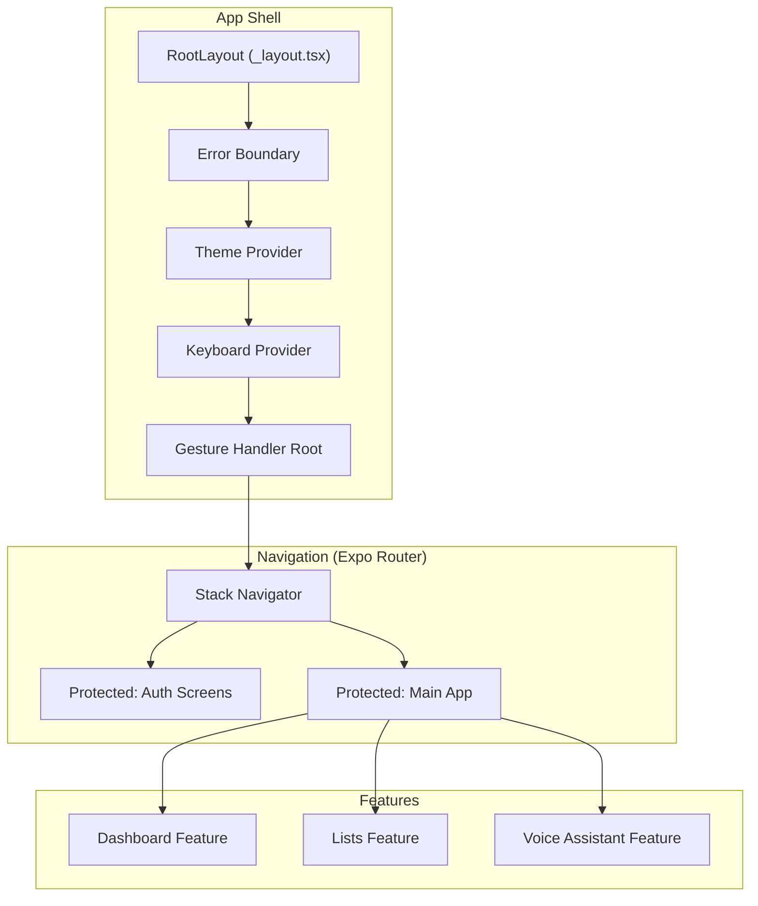
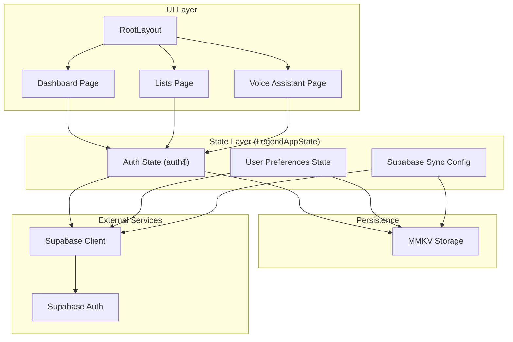
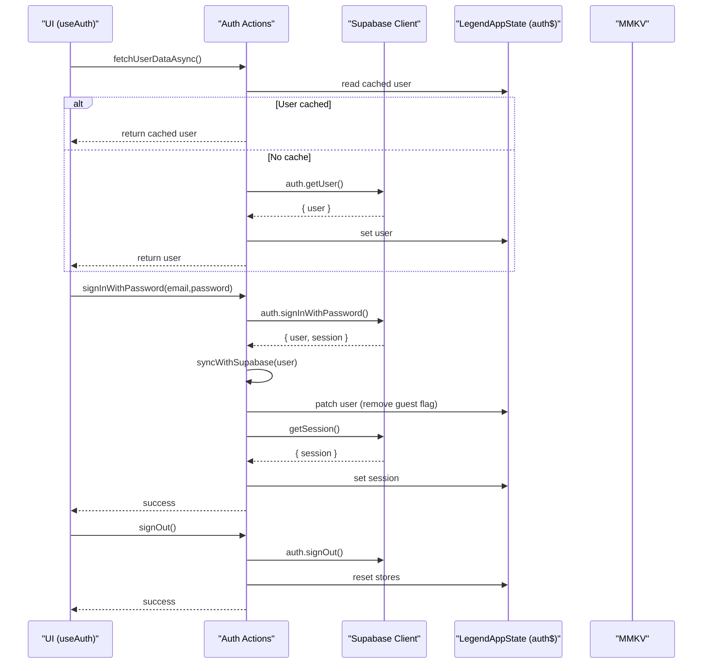
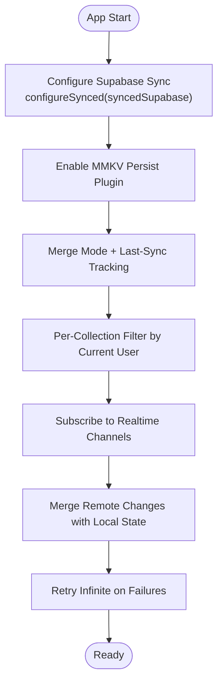
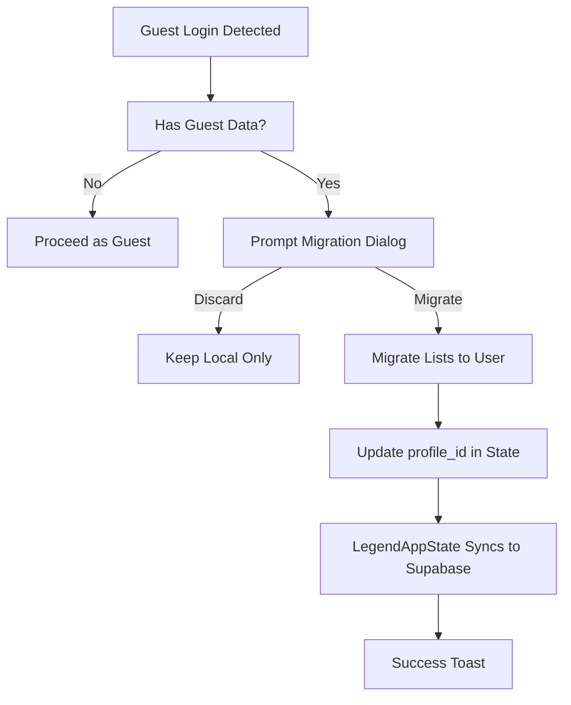
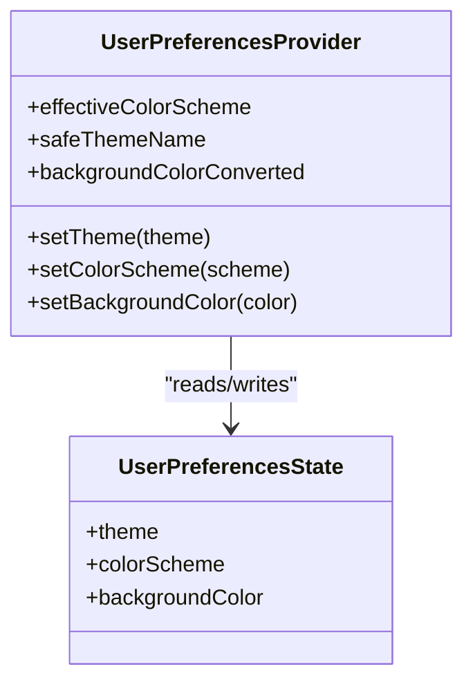
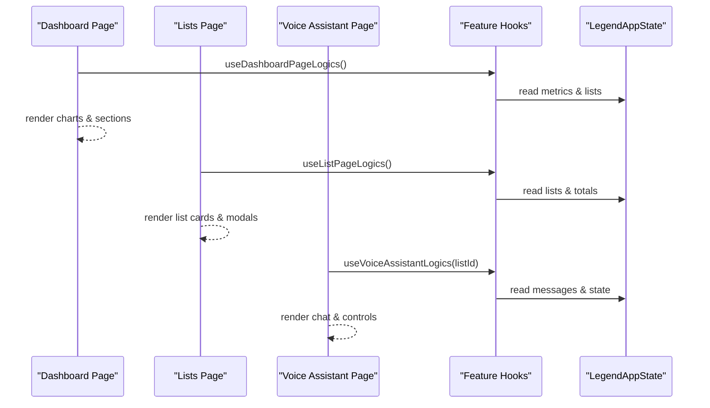
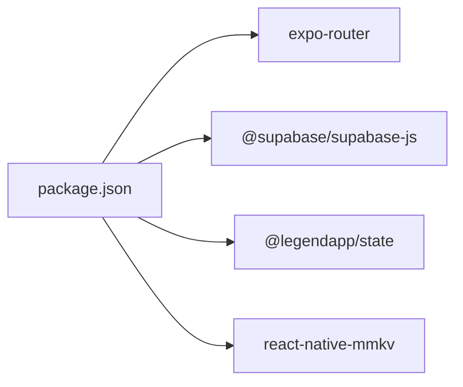

# Architecture Overview

<cite>
**Referenced Files in This Document**
- [RootLayout](file://src/app/_layout.tsx)
- [Auth State](file://src/data/states/auth.ts)
- [Auth Actions](file://src/data/actions/auth.ts)
- [Auth Hook](file://src/hooks/use-auth.ts)
- [Supabase Client](file://src/lib/supabase/supabase.ts)
- [Supabase Sync Config](file://src/data/database.ts)
- [MMKV Storage](file://src/data/storage.ts)
- [Sync Service](file://src/services/sync.ts)
- [Theme Provider](file://src/context/themes/provider.tsx)
- [Lists Page](file://src/features/lists/page.tsx)
- [Dashboard Page](file://src/features/dashboard/page.tsx)
- [Voice Assistant Page](file://src/features/voice-assistant/page.tsx)
- [Package Dependencies](file://package.json)
</cite>

## Table of Contents
1. [Introduction](#introduction)
2. [Project Structure](#project-structure)
3. [Core Components](#core-components)
4. [Architecture Overview](#architecture-overview)
5. [Detailed Component Analysis](#detailed-component-analysis)
6. [Dependency Analysis](#dependency-analysis)
7. [Performance Considerations](#performance-considerations)
8. [Troubleshooting Guide](#troubleshooting-guide)
9. [Conclusion](#conclusion)

## Introduction
This document presents the architecture of the PowerLists system, focusing on its feature-based modular structure, reactive state management with LegendAppState, and a dual-storage strategy combining cloud and local persistence. It explains how authentication, state management, UI components, and external services interact, and documents technical decisions such as using Expo Router for navigation, Supabase for real-time database, and MMKV for local persistence. Cross-cutting concerns like real-time synchronization, offline-first behavior, and theme management are addressed with system context diagrams and detailed component analyses.

## Project Structure
PowerLists follows a feature-based modular structure under the src/features directory, grouping related pages, components, hooks, and utilities per feature. Navigation is handled via Expo Router, with protected routes controlling access based on authentication state. Global providers (theme, error boundary, keyboard, gesture) wrap the routing stack in the root layout.

**Diagram sources**
- [RootLayout:34-61](file://src/app/_layout.tsx#L34-L61)
- [Dashboard Page:49-132](file://src/features/dashboard/page.tsx#L49-L132)
- [Lists Page:19-97](file://src/features/lists/page.tsx#L19-L97)
- [Voice Assistant Page:9-59](file://src/features/voice-assistant/page.tsx#L9-L59)

**Section sources**
- [RootLayout:17-62](file://src/app/_layout.tsx#L17-L62)
- [Package Dependencies:50-86](file://package.json#L50-L86)

## Core Components
- Reactive State Management with LegendAppState:
  - Centralized observables for auth, user preferences, and feature entities.
  - Supabase sync configured globally to merge remote changes with local persistence.
- Dual Storage Strategy:
  - Local persistence via MMKV for offline-first behavior and fast reads/writes.
  - Cloud persistence via Supabase for real-time synchronization and multi-device access.
- Authentication:
  - Supabase Auth integrated with MMKV for session persistence and secure storage.
  - Guest user support with seamless migration to authenticated accounts.
- Navigation:
  - Expo Router with protected routes ensuring only authenticated users reach main screens.
- Theming:
  - Theme provider backed by LegendAppState for reactive theme/color scheme/background updates.

**Section sources**
- [Auth State:22-33](file://src/data/states/auth.ts#L22-L33)
- [Supabase Sync Config:13-29](file://src/data/database.ts#L13-L29)
- [MMKV Storage:15-23](file://src/data/storage.ts#L15-L23)
- [Supabase Client:21-28](file://src/lib/supabase/supabase.ts#L21-L28)
- [Theme Provider:18-152](file://src/context/themes/provider.tsx#L18-L152)

## Architecture Overview
The system architecture centers on a reactive state layer powered by LegendAppState, which bridges local MMKV storage and Supabase real-time synchronization. Authentication is handled by Supabase with session persistence in MMKV. Navigation is declarative via Expo Router, with route guards protecting authenticated areas. Features consume state observables and expose typed hooks for UI logic.

**Diagram sources**
- [RootLayout:34-61](file://src/app/_layout.tsx#L34-L61)
- [Auth State:22-33](file://src/data/states/auth.ts#L22-L33)
- [Supabase Sync Config:13-29](file://src/data/database.ts#L13-L29)
- [Supabase Client:21-28](file://src/lib/supabase/supabase.ts#L21-L28)
- [MMKV Storage:15-23](file://src/data/storage.ts#L15-L23)
- [Dashboard Page:49-132](file://src/features/dashboard/page.tsx#L49-L132)
- [Lists Page:19-97](file://src/features/lists/page.tsx#L19-L97)
- [Voice Assistant Page:9-59](file://src/features/voice-assistant/page.tsx#L9-L59)

## Detailed Component Analysis

### Authentication Flow and State Synchronization
The authentication subsystem integrates Supabase Auth with LegendAppState for reactive state updates and persistent caching. The flow supports guest sessions, authenticated login/signup, session refresh, and migration of guest data to authenticated accounts.

**Diagram sources**
- [Auth Hook:29-74](file://src/hooks/use-auth.ts#L29-L74)
- [Auth Actions:16-30](file://src/data/actions/auth.ts#L16-L30)
- [Auth Actions:99-110](file://src/data/actions/auth.ts#L99-L110)
- [Auth Actions:127-133](file://src/data/actions/auth.ts#L127-L133)
- [Supabase Client:21-28](file://src/lib/supabase/supabase.ts#L21-L28)
- [Auth State:22-33](file://src/data/states/auth.ts#L22-L33)

**Section sources**
- [Auth Hook:19-261](file://src/hooks/use-auth.ts#L19-L261)
- [Auth Actions:16-138](file://src/data/actions/auth.ts#L16-L138)
- [Supabase Client:21-28](file://src/lib/supabase/supabase.ts#L21-L28)
- [Auth State:22-33](file://src/data/states/auth.ts#L22-L33)

### Real-Time Synchronization and Offline-First Behavior
Supabase sync is configured globally to merge remote changes with local state, persisting to MMKV for offline resilience. The configuration defines change tracking, retry behavior, and per-collection filtering based on the current user.

**Diagram sources**
- [Supabase Sync Config:13-29](file://src/data/database.ts#L13-L29)
- [Supabase Client:21-28](file://src/lib/supabase/supabase.ts#L21-L28)

**Section sources**
- [Supabase Sync Config:13-29](file://src/data/database.ts#L13-L29)
- [Supabase Client:21-28](file://src/lib/supabase/supabase.ts#L21-L28)

### Guest-to-Authenticated Migration
The SyncService coordinates migration of guest-created lists to authenticated user accounts. It detects guest data, prompts the user, and updates list ownership in state, triggering automatic Supabase synchronization.

**Diagram sources**
- [Sync Service:102-150](file://src/services/sync.ts#L102-L150)
- [Sync Service:166-201](file://src/services/sync.ts#L166-L201)
- [Auth Hook:97-103](file://src/hooks/use-auth.ts#L97-L103)

**Section sources**
- [Sync Service:41-203](file://src/services/sync.ts#L41-L203)
- [Auth Hook:97-103](file://src/hooks/use-auth.ts#L97-L103)

### Theme Management and Reactive UI
The ThemeProvider consumes user preferences from LegendAppState and applies theme variables reactively. It merges system color scheme with user preferences and exposes setters to update theme, color scheme, and background color, persisting changes to MMKV.

**Diagram sources**
- [Theme Provider:18-152](file://src/context/themes/provider.tsx#L18-L152)
- [Theme Provider:10-11](file://src/context/themes/provider.tsx#L10-L11)

**Section sources**
- [Theme Provider:18-152](file://src/context/themes/provider.tsx#L18-L152)

### Feature Pages and State Consumption
Feature pages consume state observables and expose typed hooks for UI logic. They leverage LegendList for efficient rendering and integrate with navigation and modals.

**Diagram sources**
- [Dashboard Page:49-132](file://src/features/dashboard/page.tsx#L49-L132)
- [Lists Page:19-97](file://src/features/lists/page.tsx#L19-L97)
- [Voice Assistant Page:9-59](file://src/features/voice-assistant/page.tsx#L9-L59)

**Section sources**
- [Dashboard Page:49-132](file://src/features/dashboard/page.tsx#L49-L132)
- [Lists Page:19-97](file://src/features/lists/page.tsx#L19-L97)
- [Voice Assistant Page:9-59](file://src/features/voice-assistant/page.tsx#L9-L59)

## Dependency Analysis
The system relies on a small set of core libraries: Expo Router for navigation, Supabase for authentication and real-time database, LegendAppState for reactive state and synchronization, and MMKV for local persistence. These dependencies are declared in the package manifest and wired together through centralized configuration.

**Diagram sources**
- [Package Dependencies:50-86](file://package.json#L50-L86)

**Section sources**
- [Package Dependencies:50-86](file://package.json#L50-L86)

## Performance Considerations
- Efficient Rendering:
  - Use LegendList for virtualized rendering of large datasets in lists and dashboards.
  - Lazy-load heavy feature components to reduce initial bundle size.
- State Updates:
  - Prefer granular observables and avoid unnecessary re-renders by subscribing only to required fields.
- Network Resilience:
  - Rely on Supabase retry configuration and offline-first MMKV persistence to minimize network-dependent delays.
- Memory:
  - Clear storage selectively during logout and migration to prevent accumulation of stale data.

## Troubleshooting Guide
- Authentication Issues:
  - Verify Supabase client initialization and environment variables for URL and anon key.
  - Check session restoration flow and error handling in the auth hook.
- State Synchronization:
  - Confirm Supabase sync configuration and collection filters align with current user context.
  - Inspect retry behavior and last-sync tracking to diagnose intermittent failures.
- Storage Corruption:
  - Use storage debug utilities to inspect keys and values; clear selective keys if needed.
- Theme Problems:
  - Validate theme provider wiring and user preferences persistence; ensure reactive updates are enabled.

**Section sources**
- [Supabase Client:21-28](file://src/lib/supabase/supabase.ts#L21-L28)
- [Auth Hook:111-120](file://src/hooks/use-auth.ts#L111-L120)
- [Supabase Sync Config:13-29](file://src/data/database.ts#L13-L29)
- [MMKV Storage:54-62](file://src/data/storage.ts#L54-L62)
- [Theme Provider:116-132](file://src/context/themes/provider.tsx#L116-L132)

## Conclusion
PowerLists employs a clean, feature-based architecture with reactive state management and a robust dual-storage strategy. Supabase provides real-time synchronization and authentication, while MMKV ensures offline-first responsiveness. Expo Router organizes navigation with route guards, and the ThemeProvider delivers a cohesive UI experience. Together, these choices yield a scalable, resilient system suitable for cross-platform deployment.