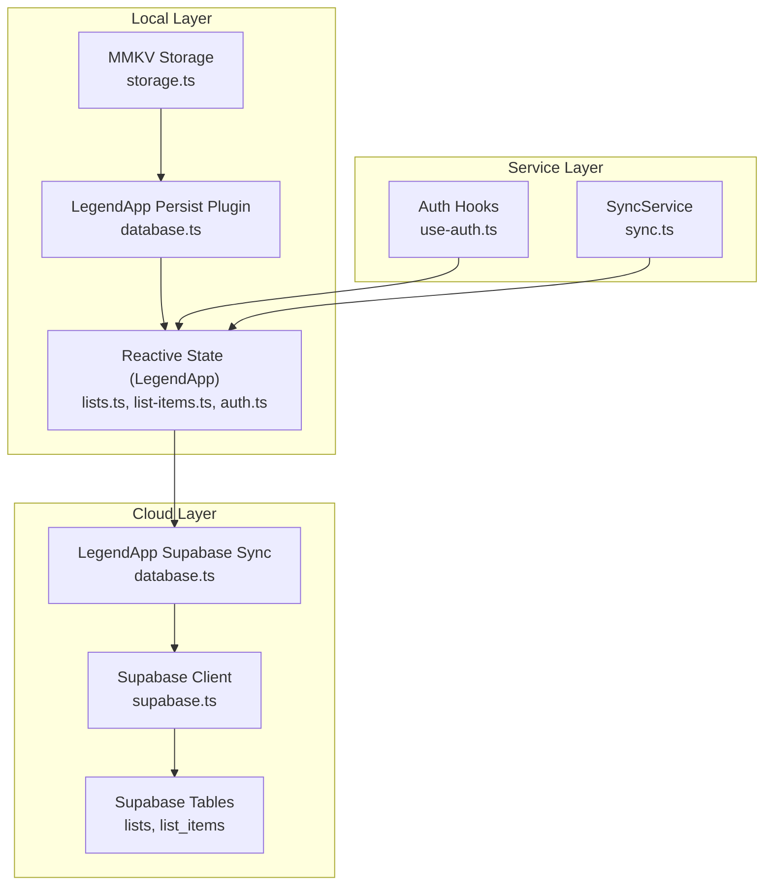
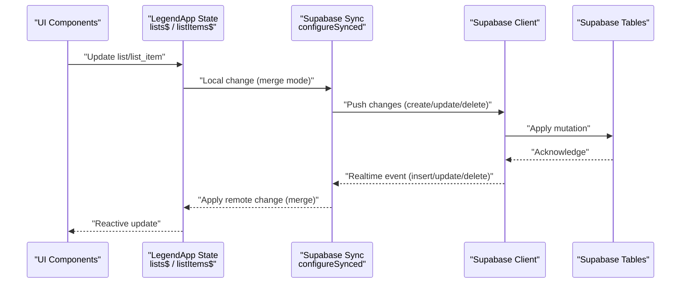
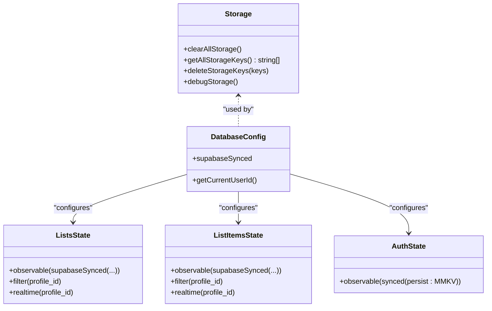
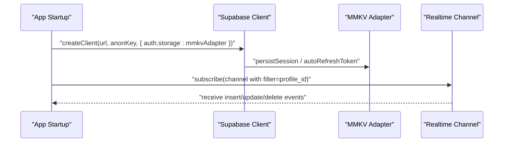
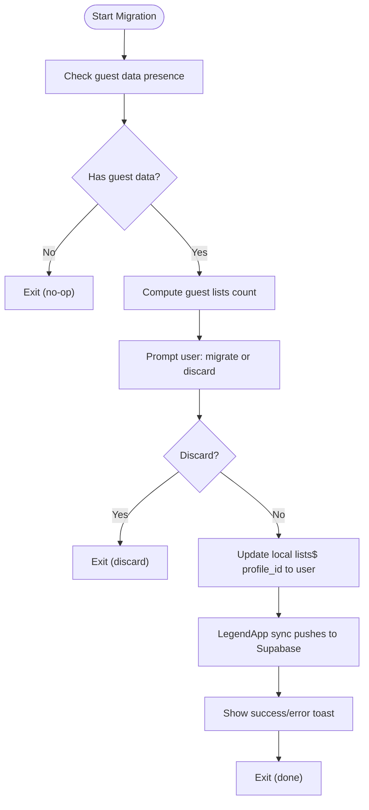
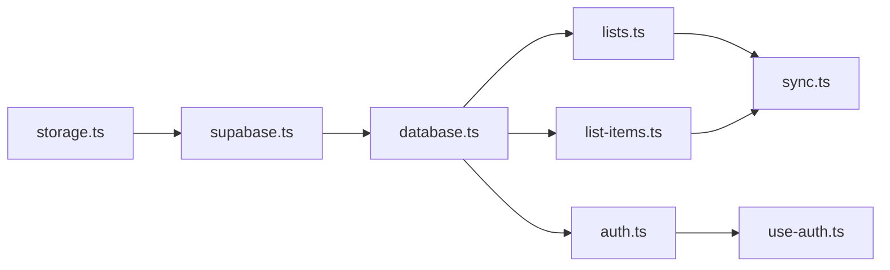

# Data Synchronization

<cite>
**Referenced Files in This Document**
- [sync.ts](file://src/services/sync.ts)
- [storage.ts](file://src/data/storage.ts)
- [database.ts](file://src/data/database.ts)
- [supabase.ts](file://src/lib/supabase/supabase.ts)
- [lists.ts](file://src/data/states/lists.ts)
- [list-items.ts](file://src/data/states/list-items.ts)
- [auth.ts](file://src/data/states/auth.ts)
- [list.ts](file://src/data/types/list.ts)
- [list-item.ts](file://src/data/types/list-item.ts)
- [use-auth.ts](file://src/hooks/use-auth.ts)
</cite>

## Table of Contents
1. [Introduction](#introduction)
2. [Project Structure](#project-structure)
3. [Core Components](#core-components)
4. [Architecture Overview](#architecture-overview)
5. [Detailed Component Analysis](#detailed-component-analysis)
6. [Dependency Analysis](#dependency-analysis)
7. [Performance Considerations](#performance-considerations)
8. [Troubleshooting Guide](#troubleshooting-guide)
9. [Conclusion](#conclusion)

## Introduction
This document describes the data synchronization architecture of PowerLists, focusing on the dual-storage strategy that combines local MMKV persistence with cloud synchronization via Supabase. It explains how the system achieves offline-first behavior, real-time updates, conflict resolution, and resilient network handling. It also documents the sync service implementation, data consistency patterns, and integration between local reactive state and cloud database updates.

## Project Structure
The synchronization architecture spans several layers:
- Local persistence: MMKV-backed storage configured via LegendApp’s persistence plugins.
- Reactive state: LegendApp observables that mirror remote data and persist locally.
- Cloud synchronization: Supabase client configured with MMKV-backed auth storage and LegendApp’s Supabase sync plugin.
- Sync service: A dedicated service for guest-to-user data migration and user-triggered operations.

**Diagram sources**
- [storage.ts:1-74](file://src/data/storage.ts#L1-L74)
- [database.ts:13-29](file://src/data/database.ts#L13-L29)
- [lists.ts:5-26](file://src/data/states/lists.ts#L5-L26)
- [list-items.ts:5-23](file://src/data/states/list-items.ts#L5-L23)
- [auth.ts:22-33](file://src/data/states/auth.ts#L22-L33)
- [supabase.ts:21-28](file://src/lib/supabase/supabase.ts#L21-L28)
- [sync.ts:41-202](file://src/services/sync.ts#L41-L202)
- [use-auth.ts:19-48](file://src/hooks/use-auth.ts#L19-L48)

**Section sources**
- [storage.ts:1-74](file://src/data/storage.ts#L1-L74)
- [database.ts:13-29](file://src/data/database.ts#L13-L29)
- [lists.ts:5-26](file://src/data/states/lists.ts#L5-L26)
- [list-items.ts:5-23](file://src/data/states/list-items.ts#L5-L23)
- [auth.ts:22-33](file://src/data/states/auth.ts#L22-L33)
- [supabase.ts:21-28](file://src/lib/supabase/supabase.ts#L21-L28)
- [sync.ts:41-202](file://src/services/sync.ts#L41-L202)
- [use-auth.ts:19-48](file://src/hooks/use-auth.ts#L19-L48)

## Core Components
- Dual-storage configuration:
  - Local persistence via MMKV and LegendApp’s persist plugin ensures offline-first behavior and fast reads/writes.
  - Supabase client uses MMKV as auth storage to persist sessions and tokens.
- Reactive state:
  - Lists and list items observables are configured with Supabase sync, filtering by profile_id and enabling real-time channels per user.
  - Auth state persists locally for guest sessions and user sessions.
- Sync service:
  - Provides guest-to-user data migration by updating profile_id on local lists and triggering automatic cloud sync.
  - Exposes helpers to detect guest data and prompt migration.

**Section sources**
- [database.ts:13-29](file://src/data/database.ts#L13-L29)
- [lists.ts:5-26](file://src/data/states/lists.ts#L5-L26)
- [list-items.ts:5-23](file://src/data/states/list-items.ts#L5-L23)
- [auth.ts:22-33](file://src/data/states/auth.ts#L22-L33)
- [supabase.ts:21-28](file://src/lib/supabase/supabase.ts#L21-L28)
- [sync.ts:48-201](file://src/services/sync.ts#L48-L201)

## Architecture Overview
PowerLists uses a merge-based synchronization model with persistent local state and real-time channels. The flow below illustrates how local changes propagate to the cloud and how remote changes update local state.

**Diagram sources**
- [database.ts:13-29](file://src/data/database.ts#L13-L29)
- [lists.ts:5-26](file://src/data/states/lists.ts#L5-L26)
- [list-items.ts:5-23](file://src/data/states/list-items.ts#L5-L23)
- [supabase.ts:21-28](file://src/lib/supabase/supabase.ts#L21-L28)

## Detailed Component Analysis

### Local Persistence and Reactive State
- MMKV-backed storage:
  - Encrypted storage via environment-provided encryption key.
  - Utility functions for clearing, key enumeration, and debugging.
- LegendApp persistence:
  - Supabase sync is configured with merge mode, last-sync tracking, and infinite retry.
  - Local observables persist under named stores and are filtered by profile_id.
- Auth persistence:
  - User and session state persist locally to support guest sessions and offline usage.

**Diagram sources**
- [storage.ts:19-74](file://src/data/storage.ts#L19-L74)
- [database.ts:13-35](file://src/data/database.ts#L13-L35)
- [lists.ts:5-26](file://src/data/states/lists.ts#L5-L26)
- [list-items.ts:5-23](file://src/data/states/list-items.ts#L5-L23)
- [auth.ts:22-33](file://src/data/states/auth.ts#L22-L33)

**Section sources**
- [storage.ts:19-74](file://src/data/storage.ts#L19-L74)
- [database.ts:13-35](file://src/data/database.ts#L13-L35)
- [lists.ts:5-26](file://src/data/states/lists.ts#L5-L26)
- [list-items.ts:5-23](file://src/data/states/list-items.ts#L5-L23)
- [auth.ts:22-33](file://src/data/states/auth.ts#L22-L33)

### Supabase Client and Real-Time Channels
- Supabase client is initialized with MMKV-backed auth storage to persist sessions and refresh tokens.
- Real-time channels are scoped to the current user via a filter expression built from the current profile_id.
- The sync configuration enforces merge semantics and tracks last-sync timestamps for incremental changes.

**Diagram sources**
- [supabase.ts:21-28](file://src/lib/supabase/supabase.ts#L21-L28)
- [lists.ts:17-21](file://src/data/states/lists.ts#L17-L21)
- [list-items.ts:17-21](file://src/data/states/list-items.ts#L17-L21)

**Section sources**
- [supabase.ts:21-28](file://src/lib/supabase/supabase.ts#L21-L28)
- [lists.ts:17-21](file://src/data/states/lists.ts#L17-L21)
- [list-items.ts:17-21](file://src/data/states/list-items.ts#L17-L21)
- [database.ts:13-29](file://src/data/database.ts#L13-L29)

### Sync Service: Guest-to-User Data Migration
- Purpose:
  - Detects whether a guest has local lists and prompts the user to migrate them to their authenticated account.
  - Updates local lists’ profile_id, which triggers automatic cloud sync through LegendApp’s Supabase integration.
- Behavior:
  - Queries local lists$ to compute counts and decide migration eligibility.
  - Uses a native Alert to present migration choices and reports results via toasts.

**Diagram sources**
- [sync.ts:102-150](file://src/services/sync.ts#L102-L150)
- [sync.ts:166-201](file://src/services/sync.ts#L166-L201)
- [lists.ts:5-26](file://src/data/states/lists.ts#L5-L26)

**Section sources**
- [sync.ts:48-201](file://src/services/sync.ts#L48-L201)
- [lists.ts:5-26](file://src/data/states/lists.ts#L5-L26)

### Data Models and Field Contracts
- List entity:
  - Includes identifiers, metadata, and optional embedded list_items projections.
- List item entity:
  - Includes identifiers, pricing/quantity, and checked state.
- These types inform how the sync layer selects and merges data.

**Section sources**
- [list.ts:3-16](file://src/data/types/list.ts#L3-L16)
- [list-item.ts:1-12](file://src/data/types/list-item.ts#L1-L12)

## Dependency Analysis
- LegendApp state observables depend on:
  - Supabase client for mutations and real-time.
  - MMKV persistence plugin for offline-first behavior.
- Supabase client depends on:
  - MMKV adapter for auth session persistence.
- Sync service depends on:
  - Local reactive state to read/write guest data.
  - Native Alert and toast utilities for user feedback.

**Diagram sources**
- [storage.ts:19-23](file://src/data/storage.ts#L19-L23)
- [supabase.ts:21-28](file://src/lib/supabase/supabase.ts#L21-L28)
- [database.ts:13-29](file://src/data/database.ts#L13-L29)
- [lists.ts:5-26](file://src/data/states/lists.ts#L5-L26)
- [list-items.ts:5-23](file://src/data/states/list-items.ts#L5-L23)
- [auth.ts:22-33](file://src/data/states/auth.ts#L22-L33)
- [sync.ts:48-201](file://src/services/sync.ts#L48-L201)
- [use-auth.ts:19-48](file://src/hooks/use-auth.ts#L19-L48)

**Section sources**
- [storage.ts:19-23](file://src/data/storage.ts#L19-L23)
- [supabase.ts:21-28](file://src/lib/supabase/supabase.ts#L21-L28)
- [database.ts:13-29](file://src/data/database.ts#L13-L29)
- [lists.ts:5-26](file://src/data/states/lists.ts#L5-L26)
- [list-items.ts:5-23](file://src/data/states/list-items.ts#L5-L23)
- [auth.ts:22-33](file://src/data/states/auth.ts#L22-L33)
- [sync.ts:48-201](file://src/services/sync.ts#L48-L201)
- [use-auth.ts:19-48](file://src/hooks/use-auth.ts#L19-L48)

## Performance Considerations
- Offline-first and minimal network:
  - Local persistence reduces network overhead and improves responsiveness.
  - Merge mode avoids redundant writes and conflicts by aligning local and remote states.
- Incremental sync:
  - Last-sync tracking minimizes payload sizes during synchronization.
- Bandwidth-conscious queries:
  - Selective field retrieval and embedded relations reduce payload sizes.
- Retry and resilience:
  - Infinite retry policies ensure eventual consistency even under intermittent connectivity.
- Large dataset strategies:
  - Pagination or chunked operations can be introduced at the UI layer if needed.
  - Consider partitioning by date or status to limit query scopes.

[No sources needed since this section provides general guidance]

## Troubleshooting Guide
- Symptom: Changes not syncing to cloud
  - Verify Supabase client initialization and auth storage adapter.
  - Confirm that realtime filter expressions match the current profile_id.
- Symptom: Conflicting edits after offline work
  - Merge mode should reconcile differences; inspect last-sync timestamps and conflict resolution behavior.
- Symptom: Guest data not migrating
  - Ensure lists$ reflects guest-owned records and that profile_id updates propagate to Supabase.
- Symptom: Session not persisting
  - Confirm MMKV encryption key availability and that auth persistence is enabled.

**Section sources**
- [supabase.ts:21-28](file://src/lib/supabase/supabase.ts#L21-L28)
- [lists.ts:17-21](file://src/data/states/lists.ts#L17-L21)
- [database.ts:13-29](file://src/data/database.ts#L13-L29)
- [sync.ts:166-201](file://src/services/sync.ts#L166-L201)

## Conclusion
PowerLists employs a robust dual-storage architecture: local MMKV persistence for offline-first performance and Supabase synchronization for real-time, reliable cloud updates. The merge-based sync mode, last-sync tracking, and infinite retry policies ensure consistency and resilience. The SyncService complements this by enabling seamless guest-to-user data migration through local updates that trigger automatic cloud synchronization. Together, these patterns deliver a responsive, resilient, and scalable data layer suitable for large datasets and varied network conditions.