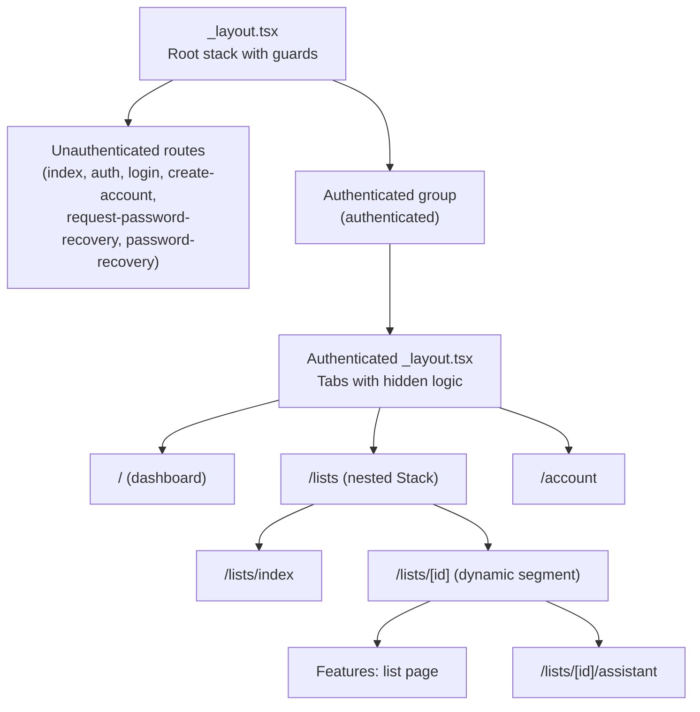
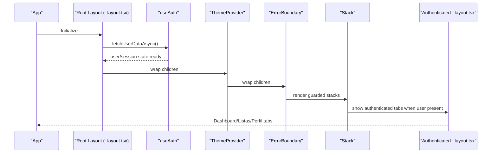
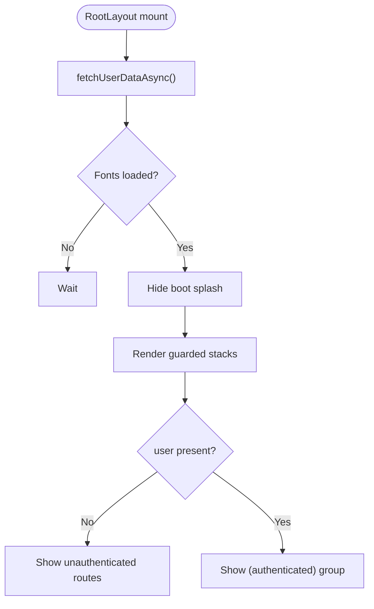
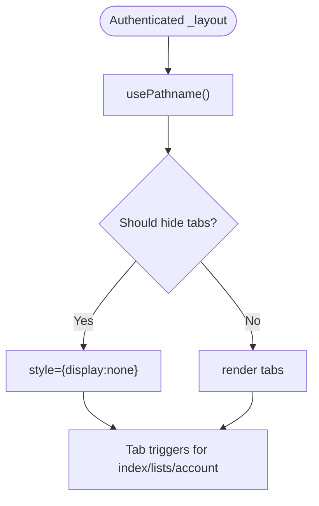
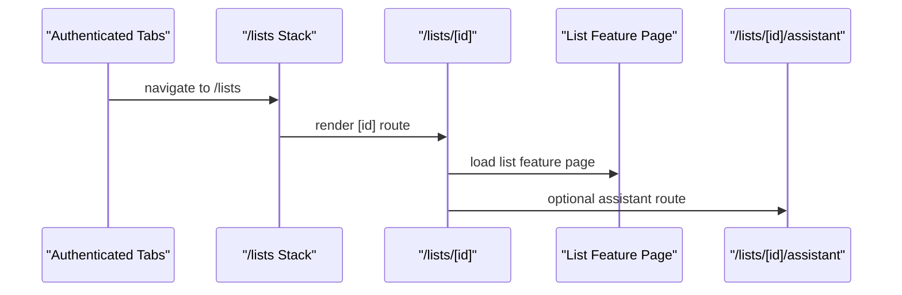
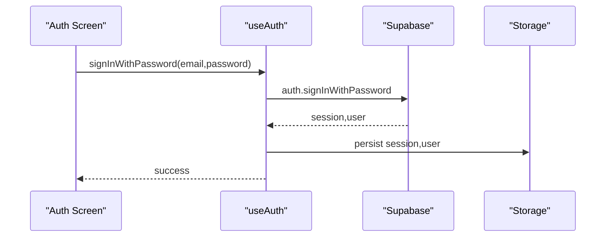
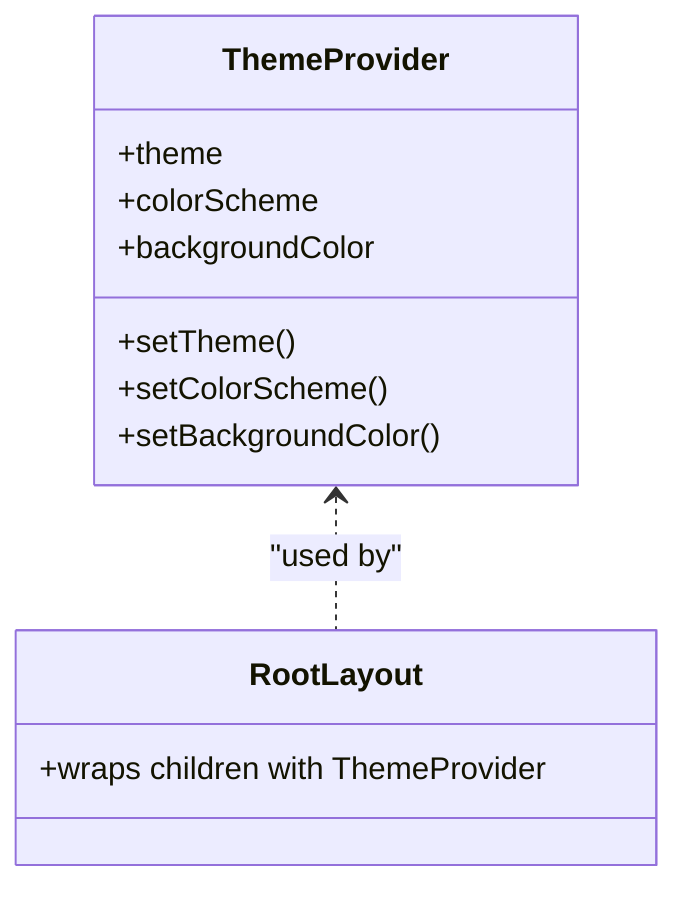
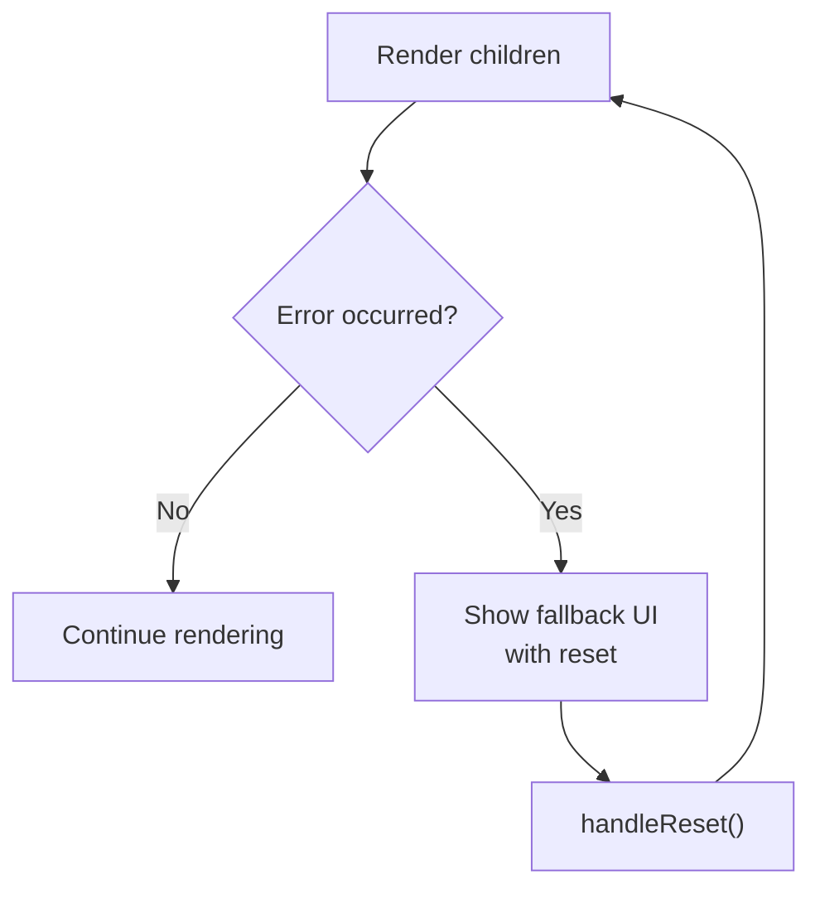
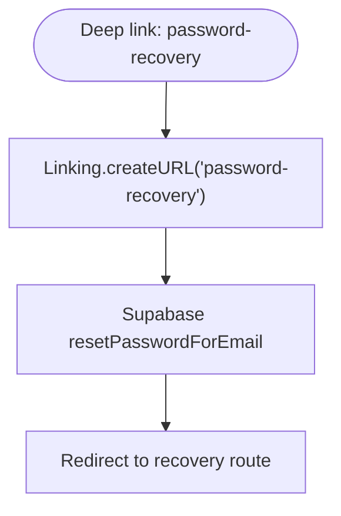
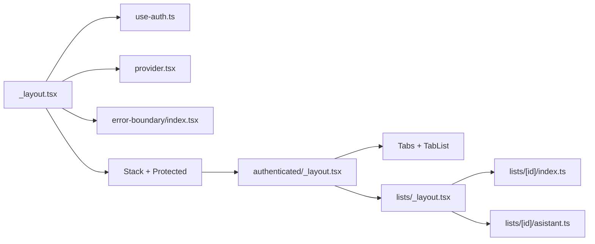

# Navigation Architecture

<cite>
**Referenced Files in This Document**
- [src/app/_layout.tsx](file://src/app/_layout.tsx)
- [src/app/(authenticated)/_layout.tsx](file://src/app/(authenticated)/_layout.tsx)
- [src/app/(authenticated)/lists/_layout.tsx](file://src/app/(authenticated)/lists/_layout.tsx)
- [src/app/(authenticated)/lists/[id]/index.ts](file://src/app/(authenticated)/lists/[id]/index.ts)
- [src/app/(authenticated)/lists/[id]/asistant.ts](file://src/app/(authenticated)/lists/[id]/asistant.ts)
- [src/app/index.tsx](file://src/app/index.tsx)
- [src/app/auth.tsx](file://src/app/auth.tsx)
- [src/features/auth/page.tsx](file://src/features/auth/page.tsx)
- [src/hooks/use-auth.ts](file://src/hooks/use-auth.ts)
- [src/hooks/use-user.ts](file://src/hooks/use-user.ts)
- [src/context/themes/provider.tsx](file://src/context/themes/provider.tsx)
- [src/components/error-boundary/index.tsx](file://src/components/error-boundary/index.tsx)
</cite>

## Table of Contents
1. [Introduction](#introduction)
2. [Project Structure](#project-structure)
3. [Core Components](#core-components)
4. [Architecture Overview](#architecture-overview)
5. [Detailed Component Analysis](#detailed-component-analysis)
6. [Dependency Analysis](#dependency-analysis)
7. [Performance Considerations](#performance-considerations)
8. [Troubleshooting Guide](#troubleshooting-guide)
9. [Conclusion](#conclusion)

## Introduction
This document explains the navigation architecture of PowerLists built on Expo Router. It covers protected routes, conditional rendering based on authentication state, layout structures, and how the Stack Navigator manages screen transitions. It also documents the Protected component behavior, the role of the Tab-based authenticated layout, integration with the theme provider and error boundary, and practical guidance for route parameters, deep links, and performance optimizations.

## Project Structure
The navigation system is organized around:
- Root layout orchestrating global providers and guarded stacks
- Unauthenticated route group for onboarding and auth flows
- Authenticated route group with nested stacks and tabs
- Feature pages wired via file-based routing

**Diagram sources**
- [src/app/_layout.tsx:34-51](file://src/app/_layout.tsx#L34-L51)
- [src/app/(authenticated)/_layout.tsx:27-57](file://src/app/(authenticated)/_layout.tsx#L27-L57)
- [src/app/(authenticated)/lists/_layout.tsx:3-9](file://src/app/(authenticated)/lists/_layout.tsx#L3-L9)

**Section sources**
- [src/app/_layout.tsx:17-62](file://src/app/_layout.tsx#L17-L62)
- [src/app/(authenticated)/_layout.tsx:16-59](file://src/app/(authenticated)/_layout.tsx#L16-L59)
- [src/app/(authenticated)/lists/_layout.tsx:1-11](file://src/app/(authenticated)/lists/_layout.tsx#L1-L11)

## Core Components
- Root layout with providers and guarded stacks:
  - Theme provider wraps the entire app
  - Error boundary wraps navigation to catch runtime errors
  - Stack.Protected gates routes based on user presence
  - Global loading and font initialization
- Authenticated layout with tabs:
  - Conditional tab visibility based on pathname
  - Hidden tab bar on specific routes and dynamic segments
- Authentication hooks:
  - Centralized session and user state management
  - Sign-in, sign-up, sign-out, and password reset flows
- Theme provider:
  - Provides theme, color scheme, and background color context
- Error boundary:
  - Graceful error handling with reset option

**Section sources**
- [src/app/_layout.tsx:17-62](file://src/app/_layout.tsx#L17-L62)
- [src/app/(authenticated)/_layout.tsx:16-59](file://src/app/(authenticated)/_layout.tsx#L16-L59)
- [src/hooks/use-auth.ts:19-261](file://src/hooks/use-auth.ts#L19-L261)
- [src/hooks/use-user.ts:8-85](file://src/hooks/use-user.ts#L8-L85)
- [src/context/themes/provider.tsx:18-153](file://src/context/themes/provider.tsx#L18-L153)
- [src/components/error-boundary/index.tsx:15-55](file://src/components/error-boundary/index.tsx#L15-L55)

## Architecture Overview
The navigation architecture uses Expo Router’s file-based routing with guarded stacks and nested layouts. The root layout initializes the app, loads fonts, hides the boot splash after initialization, and renders two guarded stacks:
- Unauthenticated routes: shown when user is absent
- Authenticated routes: shown when user exists

The authenticated group uses a Tab-based layout that conditionally hides the tab bar on specific screens and dynamic segments.

**Diagram sources**
- [src/app/_layout.tsx:17-62](file://src/app/_layout.tsx#L17-L62)
- [src/hooks/use-auth.ts:29-74](file://src/hooks/use-auth.ts#L29-L74)
- [src/app/(authenticated)/_layout.tsx:16-59](file://src/app/(authenticated)/_layout.tsx#L16-L59)

## Detailed Component Analysis

### Root Layout and Guarded Stacks
- Initializes authentication state and fonts
- Hides boot splash after initialization
- Renders guarded stacks:
  - Unauthenticated: index, auth, login, create-account, request-password-recovery, password-recovery
  - Authenticated: (authenticated) group
- Wraps the entire navigation tree with ThemeProvider and ErrorBoundary

**Diagram sources**
- [src/app/_layout.tsx:24-32](file://src/app/_layout.tsx#L24-L32)
- [src/app/_layout.tsx:34-51](file://src/app/_layout.tsx#L34-L51)

**Section sources**
- [src/app/_layout.tsx:17-62](file://src/app/_layout.tsx#L17-L62)

### Authenticated Layout and Tab Visibility
- Uses Tabs and TabList to render bottom navigation
- Hides tabs on specific routes and dynamic segments using pathname checks
- Provides named TabTriggers mapped to feature pages

**Diagram sources**
- [src/app/(authenticated)/_layout.tsx:17-25](file://src/app/(authenticated)/_layout.tsx#L17-L25)
- [src/app/(authenticated)/_layout.tsx:27-57](file://src/app/(authenticated)/_layout.tsx#L27-L57)

**Section sources**
- [src/app/(authenticated)/_layout.tsx:16-59](file://src/app/(authenticated)/_layout.tsx#L16-L59)

### Authenticated Nested Stack: Lists
- Nested Stack under /lists exposes:
  - index: list overview
  - [id]: dynamic list detail with assistant feature
- Dynamic segment enables route parameters for list identification

**Diagram sources**
- [src/app/(authenticated)/lists/_layout.tsx:3-9](file://src/app/(authenticated)/lists/_layout.tsx#L3-L9)
- [src/app/(authenticated)/lists/[id]/index.ts:1](file://src/app/(authenticated)/lists/[id]/index.ts#L1)
- [src/app/(authenticated)/lists/[id]/asistant.ts:1](file://src/app/(authenticated)/lists/[id]/asistant.ts#L1)

**Section sources**
- [src/app/(authenticated)/lists/_layout.tsx:1-11](file://src/app/(authenticated)/lists/_layout.tsx#L1-L11)
- [src/app/(authenticated)/lists/[id]/index.ts:1-2](file://src/app/(authenticated)/lists/[id]/index.ts#L1-L2)
- [src/app/(authenticated)/lists/[id]/asistant.ts:1-2](file://src/app/(authenticated)/lists/[id]/asistant.ts#L1-L2)

### Authentication Hooks and Session Management
- Centralized state via Legend state stores
- Handles sign-in, sign-up, sign-out, password reset, and session checks
- Integrates with Supabase for session and user synchronization
- Manages guest-to-registered user migration and data sync

**Diagram sources**
- [src/features/auth/page.tsx:8-55](file://src/features/auth/page.tsx#L8-L55)
- [src/hooks/use-auth.ts:76-121](file://src/hooks/use-auth.ts#L76-L121)

**Section sources**
- [src/hooks/use-auth.ts:19-261](file://src/hooks/use-auth.ts#L19-L261)
- [src/hooks/use-user.ts:8-85](file://src/hooks/use-user.ts#L8-L85)

### Theme Provider Integration
- Provides theme, color scheme, and background color context
- Applies theme variables to the root view
- Ensures consistent theming across guarded stacks and nested layouts

**Diagram sources**
- [src/context/themes/provider.tsx:18-153](file://src/context/themes/provider.tsx#L18-L153)
- [src/app/_layout.tsx:37-38](file://src/app/_layout.tsx#L37-L38)

**Section sources**
- [src/context/themes/provider.tsx:18-153](file://src/context/themes/provider.tsx#L18-L153)
- [src/app/_layout.tsx:37-38](file://src/app/_layout.tsx#L37-L38)

### Error Boundary Integration
- Wraps the Stack to catch navigation and rendering errors
- Provides a reset mechanism and user-friendly fallback UI

**Diagram sources**
- [src/components/error-boundary/index.tsx:15-55](file://src/components/error-boundary/index.tsx#L15-L55)
- [src/app/_layout.tsx:38-38](file://src/app/_layout.tsx#L38-L38)

**Section sources**
- [src/components/error-boundary/index.tsx:15-55](file://src/components/error-boundary/index.tsx#L15-L55)
- [src/app/_layout.tsx:38-38](file://src/app/_layout.tsx#L38-L38)

### Route Parameters and Deep Linking
- Dynamic segment pattern [id] in /lists/[id] supports route parameters for list identification
- Password reset flow uses Expo Linking to construct a deep link to the recovery route

**Diagram sources**
- [src/hooks/use-auth.ts:185-208](file://src/hooks/use-auth.ts#L185-L208)

**Section sources**
- [src/app/(authenticated)/lists/_layout.tsx:6-7](file://src/app/(authenticated)/lists/_layout.tsx#L6-L7)
- [src/hooks/use-auth.ts:185-208](file://src/hooks/use-auth.ts#L185-L208)

## Dependency Analysis
- Root layout depends on:
  - Authentication hooks for user/session state
  - Theme provider and error boundary for global UX
  - Stack and Protected for guarded routing
- Authenticated layout depends on:
  - Pathname detection for tab visibility
  - TabButton for tab rendering
- Lists nested stack depends on:
  - Dynamic segment resolution for list detail
  - Feature pages for list and assistant views

**Diagram sources**
- [src/app/_layout.tsx:17-62](file://src/app/_layout.tsx#L17-L62)
- [src/app/(authenticated)/_layout.tsx:16-59](file://src/app/(authenticated)/_layout.tsx#L16-L59)
- [src/app/(authenticated)/lists/_layout.tsx:1-11](file://src/app/(authenticated)/lists/_layout.tsx#L1-L11)

**Section sources**
- [src/app/_layout.tsx:17-62](file://src/app/_layout.tsx#L17-L62)
- [src/app/(authenticated)/_layout.tsx:16-59](file://src/app/(authenticated)/_layout.tsx#L16-L59)
- [src/app/(authenticated)/lists/_layout.tsx:1-11](file://src/app/(authenticated)/lists/_layout.tsx#L1-L11)

## Performance Considerations
- Lazy-load feature pages via file-based routing to minimize initial bundle size
- Keep guarded stacks shallow to reduce re-rendering overhead
- Avoid unnecessary re-renders by memoizing tab visibility logic
- Defer heavy initialization until fonts and auth are ready
- Use minimal global providers and scope heavy ones to necessary subtrees
- Prefer static imports for frequently accessed components and lazy imports for others

## Troubleshooting Guide
- Authentication loops:
  - Verify that user/session state is initialized before rendering guarded stacks
  - Ensure guest-to-registered migration completes before navigating to authenticated routes
- Tab visibility issues:
  - Confirm pathname checks match intended routes and dynamic segments
  - Validate that hidden routes are excluded from tab rendering logic
- Navigation errors:
  - Wrap critical navigations with the error boundary to capture and recover from errors
  - Provide a reset action to retry navigation after an error
- Deep linking:
  - Confirm deep link construction matches route names and redirection targets
  - Test password reset flow to ensure proper redirection to recovery route

**Section sources**
- [src/app/_layout.tsx:24-32](file://src/app/_layout.tsx#L24-L32)
- [src/app/(authenticated)/_layout.tsx:19-25](file://src/app/(authenticated)/_layout.tsx#L19-L25)
- [src/components/error-boundary/index.tsx:15-55](file://src/components/error-boundary/index.tsx#L15-L55)
- [src/hooks/use-auth.ts:185-208](file://src/hooks/use-auth.ts#L185-L208)

## Conclusion
PowerLists’ navigation architecture leverages Expo Router’s guarded stacks and nested layouts to deliver a secure, responsive, and theme-consistent user experience. Authentication state drives conditional rendering, while the authenticated tab layout provides intuitive navigation. Providers and boundaries encapsulate cross-cutting concerns, and dynamic segments enable flexible route parameter handling. Following the outlined patterns and best practices ensures maintainability and performance across the app.