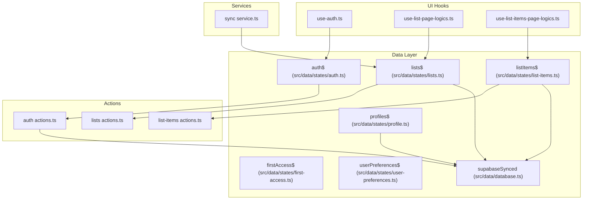
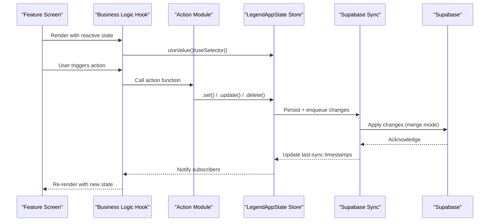
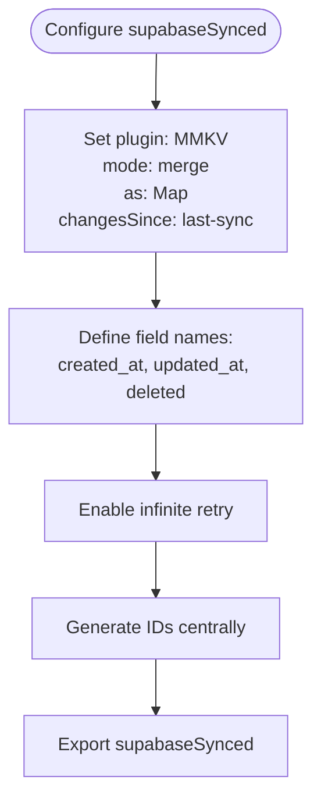
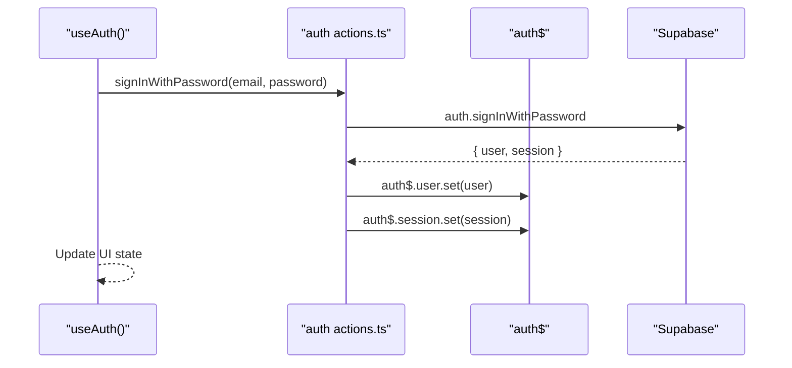
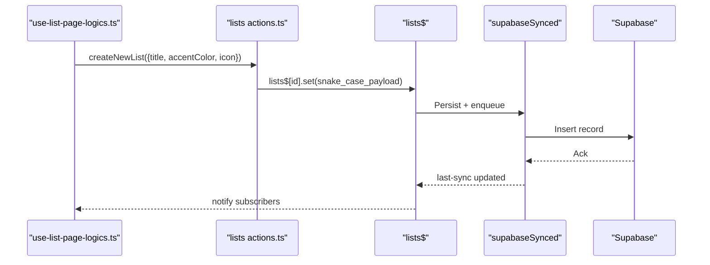
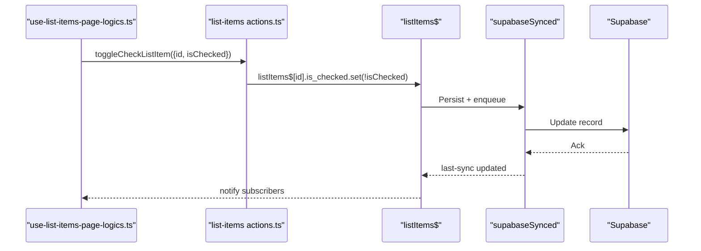
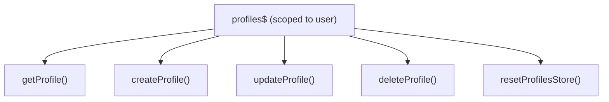
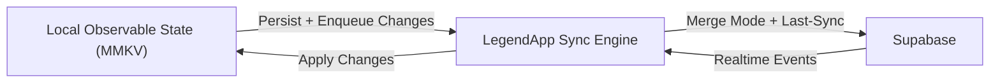
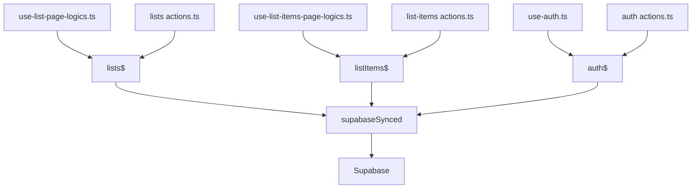

# State Management Architecture

<cite>
**Referenced Files in This Document**
- [auth.ts](file://src/data/states/auth.ts)
- [lists.ts](file://src/data/states/lists.ts)
- [list-items.ts](file://src/data/states/list-items.ts)
- [profile.ts](file://src/data/states/profile.ts)
- [first-access.ts](file://src/data/states/first-access.ts)
- [user-preferences.ts](file://src/data/states/user-preferences.ts)
- [database.ts](file://src/data/database.ts)
- [auth actions.ts](file://src/data/actions/auth.ts)
- [lists actions.ts](file://src/data/actions/lists.ts)
- [list-items actions.ts](file://src/data/actions/list-items.ts)
- [use-auth.ts](file://src/hooks/use-auth.ts)
- [use-list-page-logics.ts](file://src/features/lists/hooks/use-list-page-logics.ts)
- [use-list-items-page-logics.ts](file://src/features/list/hooks/use-list-items-page-logics.ts)
- [sync service.ts](file://src/services/sync.ts)
- [storage.ts](file://src/data/storage.ts)
- [RULES.md](file://__docs__/RULES.md)
- [new-screen.md](file://.github/agents/new-screen.md)
</cite>

## Table of Contents
1. [Introduction](#introduction)
2. [Project Structure](#project-structure)
3. [Core Components](#core-components)
4. [Architecture Overview](#architecture-overview)
5. [Detailed Component Analysis](#detailed-component-analysis)
6. [Dependency Analysis](#dependency-analysis)
7. [Performance Considerations](#performance-considerations)
8. [Troubleshooting Guide](#troubleshooting-guide)
9. [Conclusion](#conclusion)
10. [Appendices](#appendices)

## Introduction
This document describes the state management architecture of PowerLists, centered around Legend App’s reactive state system and Supabase synchronization. It explains the state hierarchy (authentication, lists, list items), the dual-state approach (local reactive state + cloud sync), initialization and mutation patterns, conflict resolution, integration with React hooks, performance and memory strategies, persistence and offline-first behavior, and recovery mechanisms.

## Project Structure
PowerLists organizes state under a clear separation of concerns:
- Data layer: observable stores in src/data/states/, action modules in src/data/actions/, and shared database configuration in src/data/database.ts
- UI layer: feature pages and hooks in src/features/*, with business logic hooks consuming observable stores
- Services: cross-cutting concerns like data migration in src/services/

**Diagram sources**
- [auth.ts:1-34](file://src/data/states/auth.ts#L1-L34)
- [lists.ts:1-27](file://src/data/states/lists.ts#L1-L27)
- [list-items.ts:1-24](file://src/data/states/list-items.ts#L1-L24)
- [profile.ts:1-194](file://src/data/states/profile.ts#L1-L194)
- [database.ts:1-36](file://src/data/database.ts#L1-L36)
- [auth actions.ts:1-138](file://src/data/actions/auth.ts#L1-L138)
- [lists actions.ts:1-211](file://src/data/actions/lists.ts#L1-L211)
- [list-items actions.ts:1-193](file://src/data/actions/list-items.ts#L1-L193)
- [use-auth.ts:1-261](file://src/hooks/use-auth.ts#L1-L261)
- [use-list-page-logics.ts:1-82](file://src/features/lists/hooks/use-list-page-logics.ts#L1-L82)
- [use-list-items-page-logics.ts:1-124](file://src/features/list/hooks/use-list-items-page-logics.ts#L1-L124)
- [sync service.ts:1-203](file://src/services/sync.ts#L1-L203)

**Section sources**
- [RULES.md:42-77](file://__docs__/RULES.md#L42-L77)
- [new-screen.md:145-214](file://.github/agents/new-screen.md#L145-L214)

## Core Components
- LegendAppState: Global observable stores configured with Supabase sync and MMKV persistence
- Supabase integration: Centralized via supabaseSynced with merge mode, last-sync tracking, and retry behavior
- Authentication state: Reactive user/session state with local persistence
- Domain stores: Lists and list items with per-user filtering and real-time subscriptions
- Profiles and auxiliary stores: Profiles, first-access flag, and user preferences with persistence
- Actions: Pure mutation functions that write to observable stores, triggering sync
- React hooks: Business logic hooks that subscribe to stores and expose derived UI state

**Section sources**
- [auth.ts:1-34](file://src/data/states/auth.ts#L1-L34)
- [lists.ts:1-27](file://src/data/states/lists.ts#L1-L27)
- [list-items.ts:1-24](file://src/data/states/list-items.ts#L1-L24)
- [profile.ts:1-194](file://src/data/states/profile.ts#L1-L194)
- [first-access.ts:1-16](file://src/data/states/first-access.ts#L1-L16)
- [user-preferences.ts:1-27](file://src/data/states/user-preferences.ts#L1-L27)
- [database.ts:1-36](file://src/data/database.ts#L1-L36)
- [auth actions.ts:1-138](file://src/data/actions/auth.ts#L1-L138)
- [lists actions.ts:1-211](file://src/data/actions/lists.ts#L1-L211)
- [list-items actions.ts:1-193](file://src/data/actions/list-items.ts#L1-L193)

## Architecture Overview
The system follows an observer-driven architecture:
- Stores are observable and can be persisted locally and synchronized with Supabase
- UI reads from stores via hooks; writes go through action modules that mutate observable state
- Real-time filters and per-user scoping ensure data isolation
- Conflict resolution is handled by merge mode and last-sync timestamps

**Diagram sources**
- [use-list-page-logics.ts:1-82](file://src/features/lists/hooks/use-list-page-logics.ts#L1-L82)
- [use-list-items-page-logics.ts:1-124](file://src/features/list/hooks/use-list-items-page-logics.ts#L1-L124)
- [lists actions.ts:1-211](file://src/data/actions/lists.ts#L1-L211)
- [list-items actions.ts:1-193](file://src/data/actions/list-items.ts#L1-L193)
- [database.ts:13-36](file://src/data/database.ts#L13-L36)

## Detailed Component Analysis

### LegendAppState and Supabase Sync Configuration
- Centralized sync configuration defines:
  - Plugin: MMKV persistence
  - Mode: merge
  - As: Map
  - Changes tracking: last-sync
  - Field names: created_at, updated_at, deleted
  - Retry policy: infinite
  - ID generation: centralized generator
- Real-time filters derive from current user ID to scope data per user

**Diagram sources**
- [database.ts:13-36](file://src/data/database.ts#L13-L36)

**Section sources**
- [database.ts:1-36](file://src/data/database.ts#L1-L36)

### Authentication State (auth$)
- Reactive user, session, initialized, and loading flags
- Local persistence via synced observable
- Hook orchestrates sign-in/sign-up, session checks, and guest-to-user migration

**Diagram sources**
- [use-auth.ts:76-121](file://src/hooks/use-auth.ts#L76-L121)
- [auth actions.ts:99-110](file://src/data/actions/auth.ts#L99-L110)
- [auth.ts:22-33](file://src/data/states/auth.ts#L22-L33)

**Section sources**
- [auth.ts:1-34](file://src/data/states/auth.ts#L1-L34)
- [use-auth.ts:1-261](file://src/hooks/use-auth.ts#L1-L261)
- [auth actions.ts:1-138](file://src/data/actions/auth.ts#L1-L138)

### Lists State (lists$) and Mutation Actions
- Store configured with:
  - Collection: lists
  - Select: includes nested list_items aggregation
  - Filter: profile_id equals current user
  - Realtime filter: profile_id scoped
- Actions provide CRUD operations that mutate observable state, triggering sync

**Diagram sources**
- [lists.ts:5-26](file://src/data/states/lists.ts#L5-L26)
- [lists actions.ts:79-122](file://src/data/actions/lists.ts#L79-L122)
- [use-list-page-logics.ts:13-82](file://src/features/lists/hooks/use-list-page-logics.ts#L13-L82)

**Section sources**
- [lists.ts:1-27](file://src/data/states/lists.ts#L1-L27)
- [lists actions.ts:1-211](file://src/data/actions/lists.ts#L1-L211)

### List Items State (listItems$) and Mutation Actions
- Store configured with:
  - Collection: list_items
  - Filter: profile_id equals current user
  - Realtime filter: profile_id scoped
- Actions provide CRUD operations and toggling checked status

**Diagram sources**
- [list-items.ts:5-24](file://src/data/states/list-items.ts#L5-L24)
- [list-items actions.ts:109-127](file://src/data/actions/list-items.ts#L109-L127)
- [use-list-items-page-logics.ts:40-46](file://src/features/list/hooks/use-list-items-page-logics.ts#L40-L46)

**Section sources**
- [list-items.ts:1-24](file://src/data/states/list-items.ts#L1-L24)
- [list-items actions.ts:1-193](file://src/data/actions/list-items.ts#L1-L193)

### Profiles State and Persistence Utilities
- Profiles store scoped to current user ID
- Helper actions to get/create/update/delete profiles
- Reset utilities clear observable and persisted metadata

**Diagram sources**
- [profile.ts:10-20](file://src/data/states/profile.ts#L10-L20)
- [profile.ts:33-193](file://src/data/states/profile.ts#L33-L193)

**Section sources**
- [profile.ts:1-194](file://src/data/states/profile.ts#L1-L194)

### First Access and User Preferences
- First-access flag persisted locally
- User preferences persisted and synchronized

**Section sources**
- [first-access.ts:1-16](file://src/data/states/first-access.ts#L1-L16)
- [user-preferences.ts:1-27](file://src/data/states/user-preferences.ts#L1-L27)

### Dual-State Approach: Local Reactive State + Cloud Synchronization
- Stores are observable and persisted locally via MMKV
- Supabase sync applies changes with merge semantics and last-sync tracking
- Real-time filters ensure per-user isolation
- Retry policies guarantee eventual consistency

**Diagram sources**
- [database.ts:13-36](file://src/data/database.ts#L13-L36)
- [lists.ts:17-21](file://src/data/states/lists.ts#L17-L21)
- [list-items.ts:17-21](file://src/data/states/list-items.ts#L17-L21)

**Section sources**
- [database.ts:1-36](file://src/data/database.ts#L1-L36)
- [lists.ts:1-27](file://src/data/states/lists.ts#L1-L27)
- [list-items.ts:1-24](file://src/data/states/list-items.ts#L1-L24)

### State Initialization Patterns
- Auth store initializes with null user and flags
- Lists and list items initialize empty maps
- Profiles scoped to current user ID
- First-access and preferences initialize with defaults
- React tracking enabled to warn when state is not subscribed

**Section sources**
- [auth.ts:15-33](file://src/data/states/auth.ts#L15-L33)
- [lists.ts](file://src/data/states/lists.ts#L7)
- [list-items.ts](file://src/data/states/list-items.ts#L7)
- [profile.ts:11-19](file://src/data/states/profile.ts#L11-L19)
- [first-access.ts](file://src/data/states/first-access.ts#L9)
- [user-preferences.ts:14-18](file://src/data/states/user-preferences.ts#L14-L18)
- [database.ts:9-11](file://src/data/database.ts#L9-L11)

### State Mutation Strategies
- Actions orchestrate mutations to observable stores
- Payloads are normalized to snake_case before syncing
- Derived UI state computed in hooks using selectors and memoization
- UI state remains separate from global state (e.g., modal flags, search queries)

**Section sources**
- [lists actions.ts:79-122](file://src/data/actions/lists.ts#L79-L122)
- [list-items actions.ts:53-104](file://src/data/actions/list-items.ts#L53-L104)
- [use-list-page-logics.ts:19-36](file://src/features/lists/hooks/use-list-page-logics.ts#L19-L36)
- [use-list-items-page-logics.ts:22-31](file://src/features/list/hooks/use-list-items-page-logics.ts#L22-L31)

### Conflict Resolution Mechanisms
- Merge mode ensures concurrent updates reconcile gracefully
- Last-sync tracking prevents stale re-applying
- Retry policy with infinite attempts ensures eventual consistency
- Real-time events update local state atomically

**Section sources**
- [database.ts:20-28](file://src/data/database.ts#L20-L28)
- [lists.ts:22-24](file://src/data/states/lists.ts#L22-L24)
- [list-items.ts:14-16](file://src/data/states/list-items.ts#L14-L16)

### Integration Between LegendAppState and React Hooks
- Business logic hooks subscribe to stores using useValue/useSelector
- UI state remains in React useState for ephemeral flags
- Derived computations are memoized to minimize re-renders

**Section sources**
- [use-list-page-logics.ts:1-82](file://src/features/lists/hooks/use-list-page-logics.ts#L1-L82)
- [use-list-items-page-logics.ts:1-124](file://src/features/list/hooks/use-list-items-page-logics.ts#L1-L124)
- [use-auth.ts:1-261](file://src/hooks/use-auth.ts#L1-L261)

### Offline-First State Handling and Recovery
- MMKV persistence enables offline reads/writes
- Supabase sync resumes upon connectivity
- Guest-to-user migration service migrates local lists to authenticated user
- Reset utilities clear stores and persisted metadata

**Section sources**
- [storage.ts:1-74](file://src/data/storage.ts#L1-L74)
- [sync service.ts:102-150](file://src/services/sync.ts#L102-L150)
- [lists actions.ts:205-211](file://src/data/actions/lists.ts#L205-L211)
- [list-items actions.ts:188-193](file://src/data/actions/list-items.ts#L188-L193)

## Dependency Analysis
- UI hooks depend on observable stores
- Actions depend on stores and Supabase client
- Stores depend on supabaseSynced configuration
- Auth store influences current user ID used for filtering

**Diagram sources**
- [use-list-page-logics.ts:1-82](file://src/features/lists/hooks/use-list-page-logics.ts#L1-L82)
- [use-list-items-page-logics.ts:1-124](file://src/features/list/hooks/use-list-items-page-logics.ts#L1-L124)
- [use-auth.ts:1-261](file://src/hooks/use-auth.ts#L1-L261)
- [lists actions.ts:1-211](file://src/data/actions/lists.ts#L1-L211)
- [list-items actions.ts:1-193](file://src/data/actions/list-items.ts#L1-L193)
- [auth actions.ts:1-138](file://src/data/actions/auth.ts#L1-L138)
- [lists.ts:1-27](file://src/data/states/lists.ts#L1-L27)
- [list-items.ts:1-24](file://src/data/states/list-items.ts#L1-L24)
- [auth.ts:1-34](file://src/data/states/auth.ts#L1-L34)
- [database.ts:1-36](file://src/data/database.ts#L1-L36)

**Section sources**
- [use-list-page-logics.ts:1-82](file://src/features/lists/hooks/use-list-page-logics.ts#L1-L82)
- [use-list-items-page-logics.ts:1-124](file://src/features/list/hooks/use-list-items-page-logics.ts#L1-L124)
- [use-auth.ts:1-261](file://src/hooks/use-auth.ts#L1-L261)
- [lists actions.ts:1-211](file://src/data/actions/lists.ts#L1-L211)
- [list-items actions.ts:1-193](file://src/data/actions/list-items.ts#L1-L193)
- [auth actions.ts:1-138](file://src/data/actions/auth.ts#L1-L138)
- [lists.ts:1-27](file://src/data/states/lists.ts#L1-L27)
- [list-items.ts:1-24](file://src/data/states/list-items.ts#L1-L24)
- [auth.ts:1-34](file://src/data/states/auth.ts#L1-L34)
- [database.ts:1-36](file://src/data/database.ts#L1-L36)

## Performance Considerations
- Prefer selector-based reads to avoid unnecessary recomputations
- Memoize derived computations in hooks
- Use targeted updates (per-record .set/.update) to minimize sync overhead
- Limit realtime subscriptions to essential scopes
- Batch UI state updates with useState to reduce renders
- For large datasets, consider pagination or virtualization in UI components

[No sources needed since this section provides general guidance]

## Troubleshooting Guide
- If UI does not update, ensure state is accessed via useValue/useSelector and not bypassed
- If sync stalls, verify network connectivity and retry policy
- If conflicts appear, confirm merge mode and last-sync fields are configured
- For guest-to-user migration issues, check migration service prompts and list ownership updates
- To debug persistence, inspect MMKV keys and values using storage utilities

**Section sources**
- [RULES.md:42-77](file://__docs__/RULES.md#L42-L77)
- [storage.ts:54-62](file://src/data/storage.ts#L54-L62)
- [sync service.ts:102-150](file://src/services/sync.ts#L102-L150)

## Conclusion
PowerLists leverages Legend App’s reactive state to deliver a robust, offline-first architecture. The dual-state model—combining local observable stores with Supabase synchronization—ensures responsive UI and reliable data consistency. The state hierarchy cleanly separates authentication, domain entities, and preferences, while hooks encapsulate business logic and UI state. With merge-mode sync, last-sync tracking, and retry policies, the system achieves resilience and scalability.

## Appendices

### State Hierarchy Summary
- Authentication: auth$
- Domain:
  - Lists: lists$
  - List items: listItems$
  - Profiles: profiles$
- Auxiliary:
  - First access: firstAccess$
  - User preferences: userPreferences$

**Section sources**
- [auth.ts:1-34](file://src/data/states/auth.ts#L1-L34)
- [lists.ts:1-27](file://src/data/states/lists.ts#L1-L27)
- [list-items.ts:1-24](file://src/data/states/list-items.ts#L1-L24)
- [profile.ts:1-194](file://src/data/states/profile.ts#L1-L194)
- [first-access.ts:1-16](file://src/data/states/first-access.ts#L1-L16)
- [user-preferences.ts:1-27](file://src/data/states/user-preferences.ts#L1-L27)