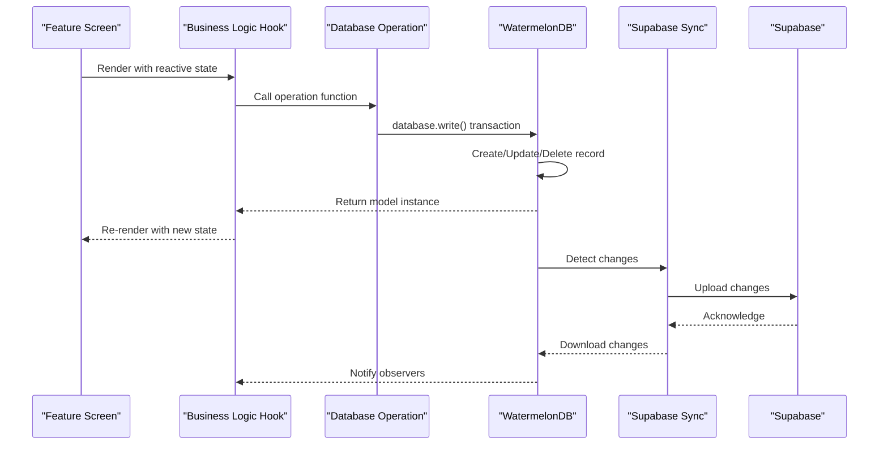
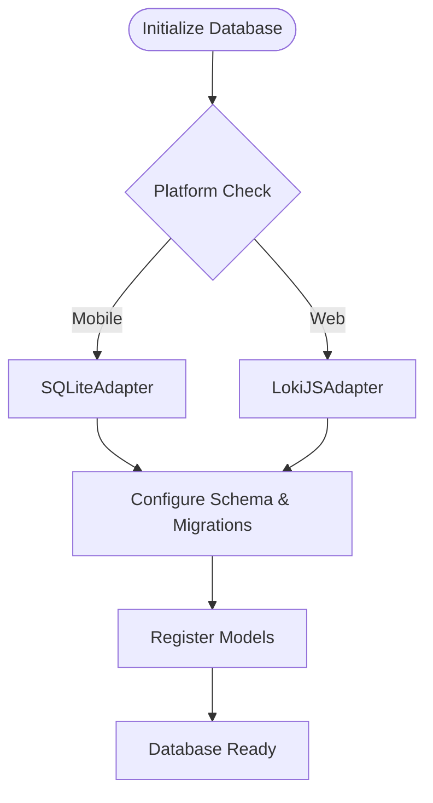
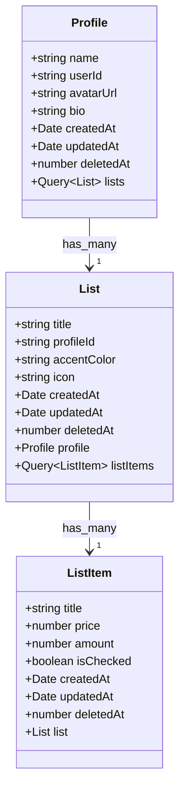
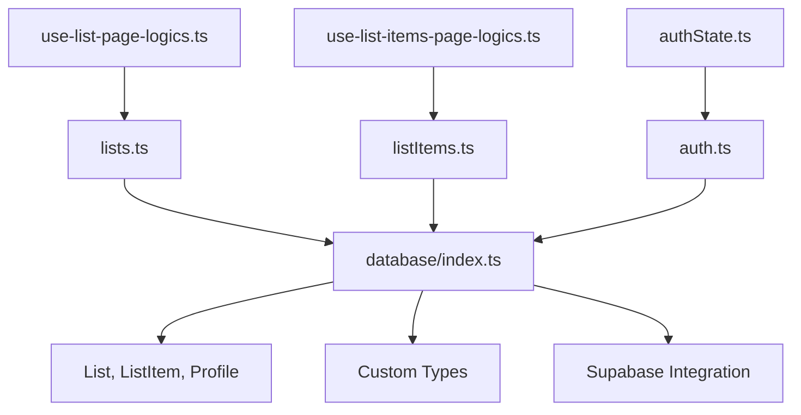

# State Management Architecture

<cite>
**Referenced Files in This Document**
- [database/index.ts](file://src/database/index.ts)
- [database/schema.ts](file://src/database/schema.ts)
- [database/models/List.ts](file://src/database/models/List.ts)
- [database/models/ListItem.ts](file://src/database/models/ListItem.ts)
- [database/models/Profile.ts](file://src/database/models/Profile.ts)
- [database/operations/lists.ts](file://src/database/operations/lists.ts)
- [database/operations/listItems.ts](file://src/database/operations/listItems.ts)
- [database/operations/auth.ts](file://src/database/operations/auth.ts)
- [database/operations/profile.ts](file://src/database/operations/profile.ts)
- [database/operations/profiles.ts](file://src/database/operations/profiles.ts)
- [hooks/use-observable-query.ts](file://src/hooks/use-observable-query.ts)
- [features/lists/hooks/use-list-page-logics.ts](file://src/features/lists/hooks/use-list-page-logics.ts)
- [features/list/hooks/use-list-items-page-logics.ts](file://src/features/list/hooks/use-list-items-page-logics.ts)
- [features/auth/authState.ts](file://src/features/auth/authState.ts)
- [lib/supabase/types/database-custom-types.ts](file://src/lib/supabase/types/database-custom-types.ts)
- [services/sync.ts](file://src/services/sync.ts)
- [data/types/auth.ts](file://src/data/types/auth.ts)
- [data/types/profile.ts](file://src/data/types/profile.ts)
- [data/utils.ts](file://src/data/utils.ts)
- [data/session-store.ts](file://src/data/session-store.ts)
- [RULES.md](file://__docs__/RULES.md)
</cite>

## Update Summary
**Changes Made**
- Complete migration from Legend App observable state management to WatermelonDB integration
- Updated state management patterns from reactive observables to database-first architecture
- Replaced '$' suffix observables with PascalCase database models (List, ListItem, Profile)
- Integrated WatermelonDB with Supabase for cloud synchronization
- Updated state hierarchy to reflect database-centric design
- Modified hooks to work with WatermelonDB queries and mutations
- Enhanced offline-first capabilities with local database persistence

## Table of Contents
1. [Introduction](#introduction)
2. [Project Structure](#project-structure)
3. [Core Components](#core-components)
4. [Architecture Overview](#architecture-overview)
5. [Detailed Component Analysis](#detailed-component-analysis)
6. [Dependency Analysis](#dependency-analysis)
7. [Performance Considerations](#performance-considerations)
8. [Troubleshooting Guide](#troubleshooting-guide)
9. [Conclusion](#conclusion)
10. [Appendices](#appendices)

## Introduction
This document describes the state management architecture of PowerLists, now built entirely on WatermelonDB integration with Supabase synchronization. The system has migrated from Legend App's reactive observable state management to a database-first architecture, featuring PascalCase database models, offline-first capabilities, and seamless cloud synchronization. This architecture provides robust state management with automatic UI updates, observer-based synchronization, and comprehensive offline support.

## Project Structure
PowerLists now organizes state management around WatermelonDB as the central data layer:
- Database layer: WatermelonDB models in src/database/models/, operations in src/database/operations/, and schema configuration in src/database/schema.ts
- UI layer: feature pages and hooks in src/features/*, with business logic hooks consuming WatermelonDB queries and mutations
- Supabase integration: Cloud synchronization and authentication services
- Type safety: Custom database types for enhanced TypeScript support

```mermaid
graph TB
subgraph "Database Layer"
DB["database (src/database/index.ts)"]
SCHEMA["schema (src/database/schema.ts)"]
MODELS["Models (List, ListItem, Profile)"]
OPS["Operations (lists.ts, listItems.ts, auth.ts)"]
END
subgraph "UI Layer"
HOOKS["Business Logic Hooks"]
COMPONENTS["Feature Components"]
END
subgraph "Supabase Integration"
AUTH["Auth Service"]
SYNC["Sync Service"]
TYPES["Custom Types"]
END
DB --> SCHEMA
DB --> MODELS
DB --> OPS
HOOKS --> DB
COMPONENTS --> HOOKS
AUTH --> SYNC
SYNC --> DB
TYPES --> MODELS
```

**Diagram sources**
- [database/index.ts:1-33](file://src/database/index.ts#L1-L33)
- [database/schema.ts:1-45](file://src/database/schema.ts#L1-L45)
- [database/models/List.ts:1-23](file://src/database/models/List.ts#L1-L23)
- [database/operations/lists.ts:1-64](file://src/database/operations/lists.ts#L1-L64)
- [database/operations/listItems.ts:1-50](file://src/database/operations/listItems.ts#L1-L50)

**Section sources**
- [database/index.ts:1-33](file://src/database/index.ts#L1-L33)
- [database/schema.ts:1-45](file://src/database/schema.ts#L1-L45)
- [database/models/List.ts:1-23](file://src/database/models/List.ts#L1-L23)
- [database/models/ListItem.ts:1-20](file://src/database/models/ListItem.ts#L1-L20)
- [database/models/Profile.ts:1-21](file://src/database/models/Profile.ts#L1-L21)

## Core Components
- **WatermelonDB Database**: Central database instance with platform-specific adapters (SQLite for mobile, LokiJS for web)
- **Database Models**: PascalCase models representing database entities (List, ListItem, Profile) with proper field mappings
- **Operations Layer**: CRUD operations for each model with proper transaction handling
- **Supabase Integration**: Cloud synchronization and authentication services
- **Type Safety**: Custom database types for enhanced TypeScript support and better developer experience
- **Offline-First Architecture**: Local database persistence with automatic cloud synchronization
- **Observer Pattern**: Automatic UI updates through WatermelonDB's reactive query system

**Section sources**
- [database/index.ts:12-32](file://src/database/index.ts#L12-L32)
- [database/models/List.ts:7-22](file://src/database/models/List.ts#L7-L22)
- [database/models/ListItem.ts:6-19](file://src/database/models/ListItem.ts#L6-L19)
- [database/models/Profile.ts:6-21](file://src/database/models/Profile.ts#L6-L21)
- [database/operations/lists.ts:16-64](file://src/database/operations/lists.ts#L16-L64)
- [database/operations/listItems.ts:12-50](file://src/database/operations/listItems.ts#L12-L50)

## Architecture Overview
The system follows a database-first architecture with WatermelonDB as the central state manager:
- Database models define the state structure with proper field mappings and relationships
- Operations handle all data mutations within database transactions
- Supabase provides cloud synchronization and authentication
- UI components subscribe to database queries for automatic updates
- Offline-first design ensures data availability without network connectivity
- Type-safe operations prevent runtime errors and improve development experience



**Diagram sources**
- [features/lists/hooks/use-list-page-logics.ts:1-82](file://src/features/lists/hooks/use-list-page-logics.ts#L1-L82)
- [database/operations/lists.ts:27-36](file://src/database/operations/lists.ts#L27-L36)
- [database/operations/listItems.ts:42-49](file://src/database/operations/listItems.ts#L42-L49)
- [services/sync.ts:1-203](file://src/services/sync.ts#L1-L203)

## Detailed Component Analysis

### WatermelonDB Database Configuration
- **Platform Detection**: Automatically selects appropriate adapter (SQLite for mobile, LokiJS for web)
- **Model Registration**: All database models registered with the database instance
- **Migration Support**: Built-in migration system for schema evolution
- **Error Handling**: Comprehensive error handling for database setup failures



**Diagram sources**
- [database/index.ts:12-32](file://src/database/index.ts#L12-L32)

**Section sources**
- [database/index.ts:1-33](file://src/database/index.ts#L1-L33)

### Database Models and Relationships
- **List Model**: Represents shopping lists with profile association and list items relationship
- **ListItem Model**: Represents individual items within lists with pricing and quantity tracking
- **Profile Model**: Represents user profiles with authentication integration
- **Field Mapping**: Proper mapping between database fields and TypeScript properties
- **Associations**: Defined relationships enable efficient querying and data integrity



**Diagram sources**
- [database/models/List.ts:7-22](file://src/database/models/List.ts#L7-L22)
- [database/models/ListItem.ts:6-19](file://src/database/models/ListItem.ts#L6-L19)
- [database/models/Profile.ts:6-21](file://src/database/models/Profile.ts#L6-L21)

**Section sources**
- [database/models/List.ts:1-23](file://src/database/models/List.ts#L1-L23)
- [database/models/ListItem.ts:1-20](file://src/database/models/ListItem.ts#L1-L20)
- [database/models/Profile.ts:1-21](file://src/database/models/Profile.ts#L1-L21)

### Database Operations Layer
- **Transaction Safety**: All operations wrapped in database.write() transactions
- **Query Optimization**: Efficient queries with proper indexing and filtering
- **CRUD Operations**: Complete CRUD functionality for each model
- **Soft Deletion**: Support for soft deletion with deleted_at field
- **Relationship Handling**: Proper handling of model relationships

**Section sources**
- [database/operations/lists.ts:1-64](file://src/database/operations/lists.ts#L1-L64)
- [database/operations/listItems.ts:1-50](file://src/database/operations/listItems.ts#L1-L50)
- [database/operations/profile.ts:1-53](file://src/database/operations/profile.ts#L1-L53)

### Supabase Integration and Authentication
- **Authentication Service**: Complete user authentication with Supabase
- **Guest User Support**: Temporary guest users with automatic migration to authenticated users
- **Session Management**: Persistent session handling with automatic cleanup
- **Error Handling**: Comprehensive error handling for authentication operations
- **User Synchronization**: Automatic synchronization between local and remote user data

**Section sources**
- [database/operations/auth.ts:14-136](file://src/database/operations/auth.ts#L14-L136)
- [features/auth/authState.ts:1-200](file://src/features/auth/authState.ts#L1-L200)

### Type Safety and Custom Types
- **Database Custom Types**: Snake_case field names for database compatibility
- **TypeScript Models**: PascalCase property names for developer convenience
- **Type Merging**: Custom types merged with generated Supabase types
- **Enhanced Developer Experience**: Better IntelliSense and compile-time error checking

**Section sources**
- [lib/supabase/types/database-custom-types.ts:1-46](file://src/lib/supabase/types/database-custom-types.ts#L1-L46)
- [data/types/auth.ts:1-26](file://src/data/types/auth.ts#L1-L26)
- [data/types/profile.ts:1-29](file://src/data/types/profile.ts#L1-L29)

### State Initialization and Lifecycle
- **Database Initialization**: Automatic database setup with proper error handling
- **Model Registration**: All models automatically registered with database instance
- **Transaction Management**: Proper transaction boundaries for data consistency
- **Cleanup Operations**: Automatic cleanup during logout and app termination

**Section sources**
- [database/index.ts:29-32](file://src/database/index.ts#L29-L32)
- [database/operations/auth.ts:125-131](file://src/database/operations/auth.ts#L125-L131)

### Integration with React Hooks
- **Observable Queries**: Hooks subscribe to database queries for automatic updates
- **State Management**: Complex state management handled transparently by WatermelonDB
- **Performance Optimization**: Efficient query caching and minimal re-renders
- **Error Boundaries**: Proper error handling within hook lifecycle

**Section sources**
- [hooks/use-observable-query.ts:1-200](file://src/hooks/use-observable-query.ts#L1-L200)
- [features/lists/hooks/use-list-page-logics.ts:1-82](file://src/features/lists/hooks/use-list-page-logics.ts#L1-L82)
- [features/list/hooks/use-list-items-page-logics.ts:1-124](file://src/features/list/hooks/use-list-items-page-logics.ts#L1-L124)

### Offline-First Architecture and Recovery
- **Local Persistence**: All data stored locally in WatermelonDB
- **Automatic Synchronization**: Background sync with Supabase when connectivity available
- **Conflict Resolution**: Intelligent conflict resolution during sync operations
- **Graceful Degradation**: Full functionality even without internet connectivity
- **Data Integrity**: Maintains data consistency across devices and sessions

**Section sources**
- [services/sync.ts:1-203](file://src/services/sync.ts#L1-L203)
- [database/operations/lists.ts:55-64](file://src/database/operations/lists.ts#L55-L64)
- [database/operations/listItems.ts:41-50](file://src/database/operations/listItems.ts#L41-L50)

## Dependency Analysis
The new architecture creates clear dependency boundaries:
- UI components depend on database operations through hooks
- Operations depend on WatermelonDB database instance
- Authentication depends on Supabase and database for user management
- Models provide type safety and relationship definitions
- Custom types bridge database and application layers



**Diagram sources**
- [features/lists/hooks/use-list-page-logics.ts:1-82](file://src/features/lists/hooks/use-list-page-logics.ts#L1-L82)
- [features/list/hooks/use-list-items-page-logics.ts:1-124](file://src/features/list/hooks/use-list-items-page-logics.ts#L1-L124)
- [database/operations/lists.ts:1-64](file://src/database/operations/lists.ts#L1-L64)
- [database/operations/listItems.ts:1-50](file://src/database/operations/listItems.ts#L1-L50)
- [database/operations/auth.ts:1-136](file://src/database/operations/auth.ts#L1-L136)
- [database/index.ts:1-33](file://src/database/index.ts#L1-L33)

**Section sources**
- [features/lists/hooks/use-list-page-logics.ts:1-82](file://src/features/lists/hooks/use-list-page-logics.ts#L1-L82)
- [features/list/hooks/use-list-items-page-logics.ts:1-124](file://src/features/list/hooks/use-list-items-page-logics.ts#L1-L124)
- [database/operations/lists.ts:1-64](file://src/database/operations/lists.ts#L1-L64)
- [database/operations/listItems.ts:1-50](file://src/database/operations/listItems.ts#L1-L50)
- [database/operations/auth.ts:1-136](file://src/database/operations/auth.ts#L1-L136)
- [database/index.ts:1-33](file://src/database/index.ts#L1-L33)

## Performance Considerations
- **Database Transactions**: All mutations wrapped in transactions for atomicity and performance
- **Query Optimization**: Indexed fields and efficient query patterns minimize database overhead
- **Automatic Caching**: WatermelonDB provides intelligent query caching
- **Background Sync**: Network operations performed asynchronously to avoid blocking UI
- **Memory Management**: Proper cleanup of database connections and observers
- **Large Dataset Handling**: Efficient pagination and virtualization for large lists

## Troubleshooting Guide
- **Database Setup Issues**: Check platform-specific adapter configuration and migration status
- **Query Performance**: Verify proper indexing and query patterns in operations layer
- **Sync Conflicts**: Monitor sync logs and implement proper conflict resolution strategies
- **Authentication Problems**: Verify Supabase configuration and user session state
- **Type Errors**: Ensure custom types match database schema and TypeScript configurations

**Section sources**
- [database/index.ts:24-27](file://src/database/index.ts#L24-L27)
- [database/operations/lists.ts:27-36](file://src/database/operations/lists.ts#L27-L36)
- [services/sync.ts:102-150](file://src/services/sync.ts#L102-L150)

## Conclusion
PowerLists has successfully migrated to a robust WatermelonDB-based state management architecture. The new system provides superior offline-first capabilities, enhanced type safety, and improved developer experience through PascalCase database models. The integration with Supabase ensures seamless cloud synchronization while maintaining local data persistence. This architecture delivers scalable, maintainable state management that supports complex business logic and provides excellent user experience across all platforms.

## Appendices

### State Hierarchy Summary
- **Database Layer**: WatermelonDB models (List, ListItem, Profile)
- **Operations Layer**: CRUD operations for each model
- **Authentication**: Supabase-based user management
- **Type Safety**: Custom database types with snake_case fields
- **Synchronization**: Automatic cloud sync with conflict resolution

**Section sources**
- [database/models/List.ts:1-23](file://src/database/models/List.ts#L1-L23)
- [database/models/ListItem.ts:1-20](file://src/database/models/ListItem.ts#L1-L20)
- [database/models/Profile.ts:1-21](file://src/database/models/Profile.ts#L1-L21)
- [database/operations/lists.ts:1-64](file://src/database/operations/lists.ts#L1-L64)
- [database/operations/listItems.ts:1-50](file://src/database/operations/listItems.ts#L1-L50)
- [database/operations/auth.ts:14-136](file://src/database/operations/auth.ts#L14-L136)
- [lib/supabase/types/database-custom-types.ts:1-46](file://src/lib/supabase/types/database-custom-types.ts#L1-L46)