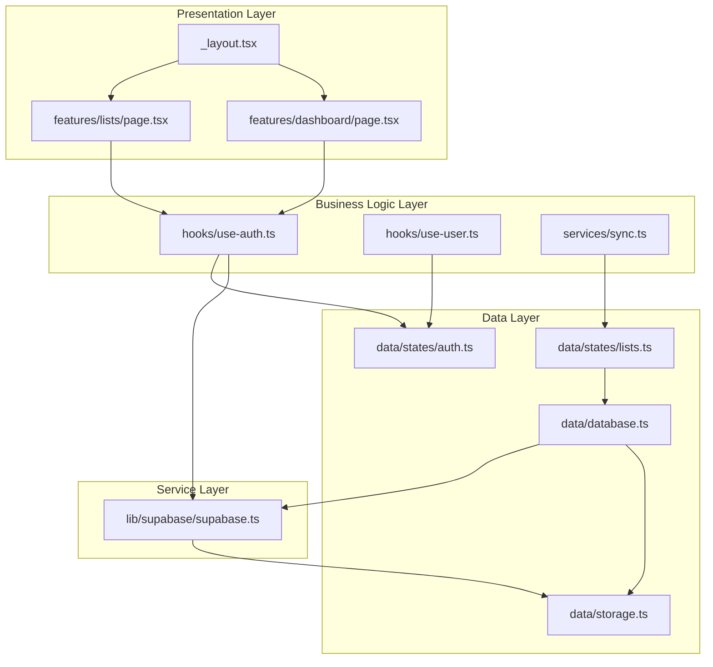
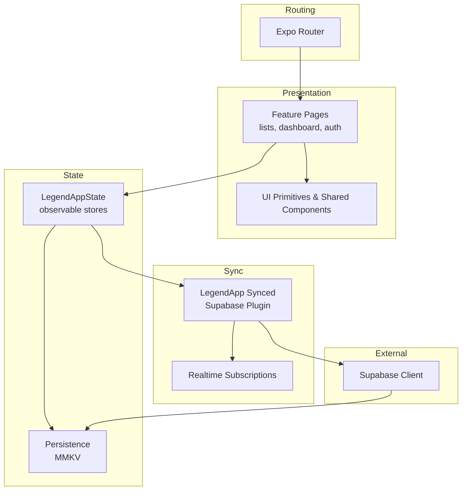
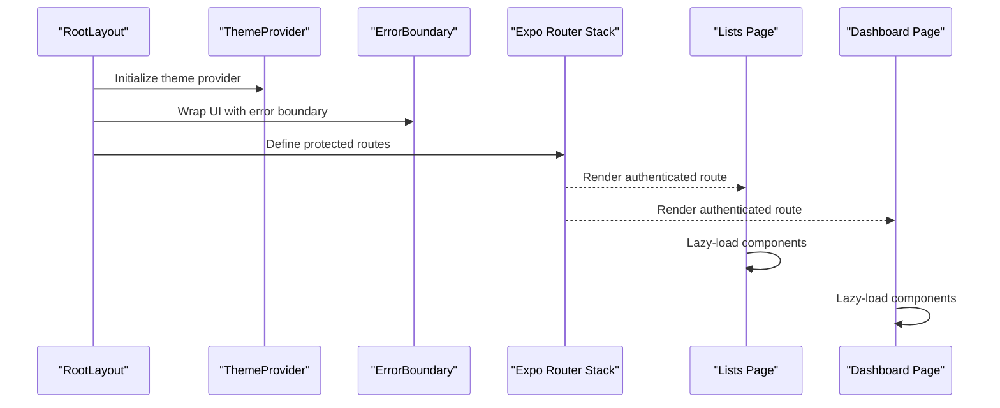
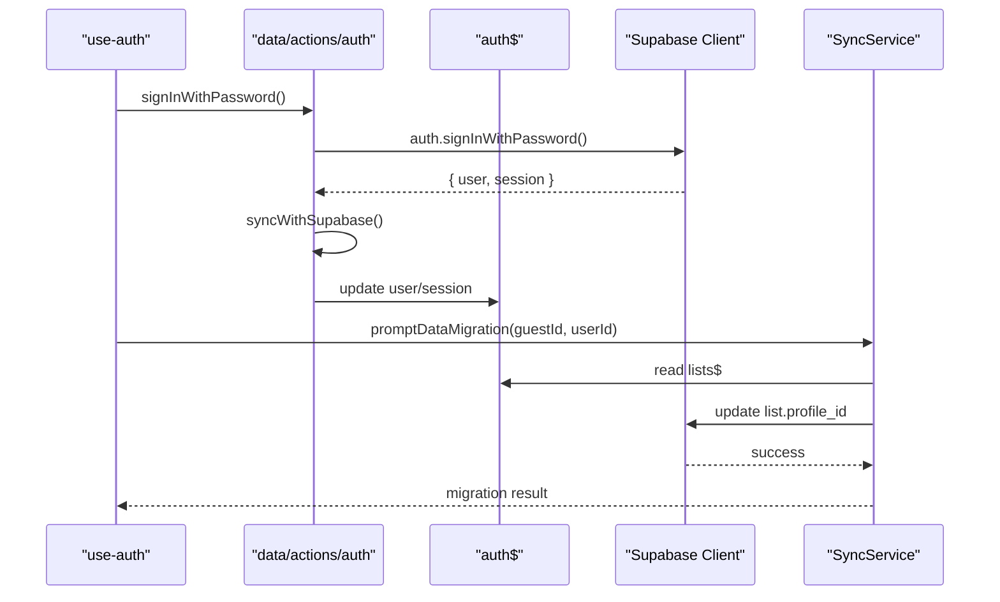
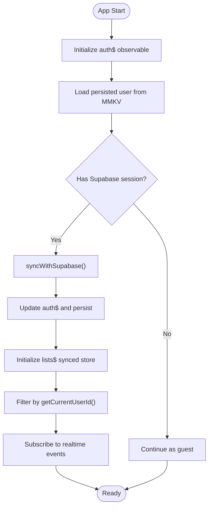
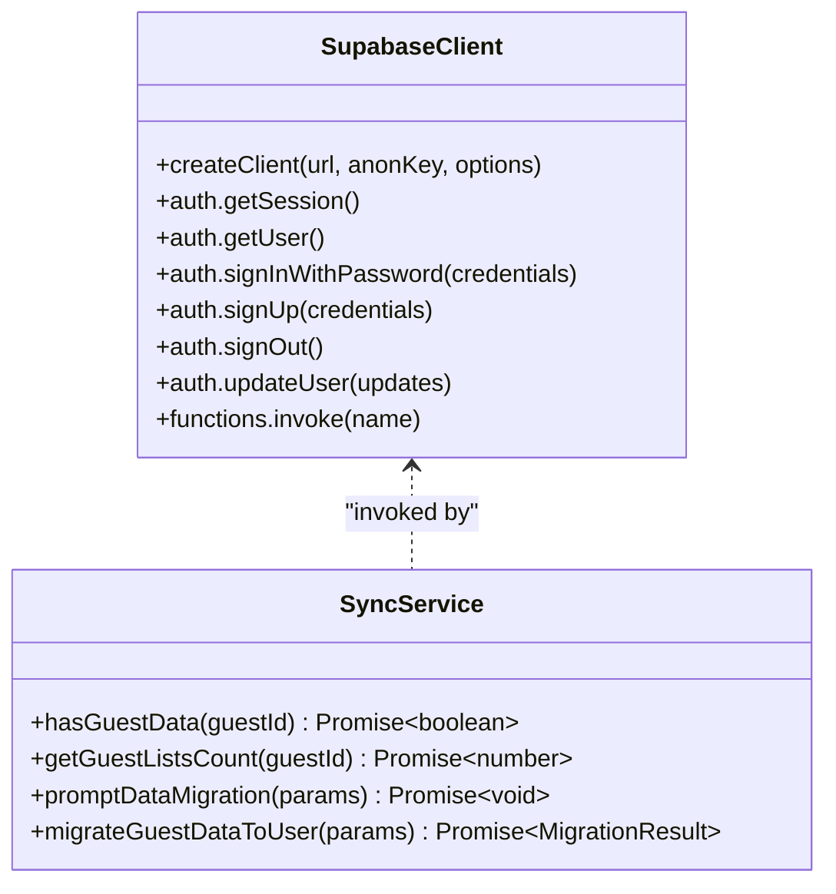
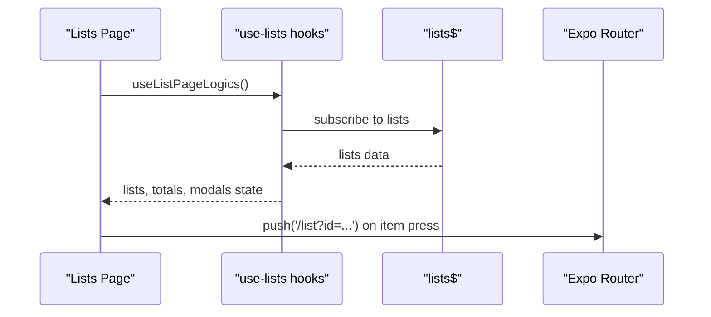
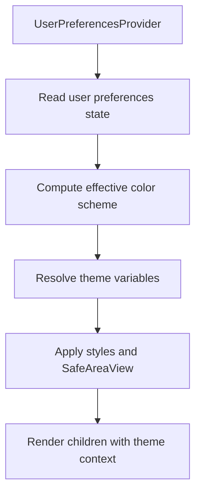
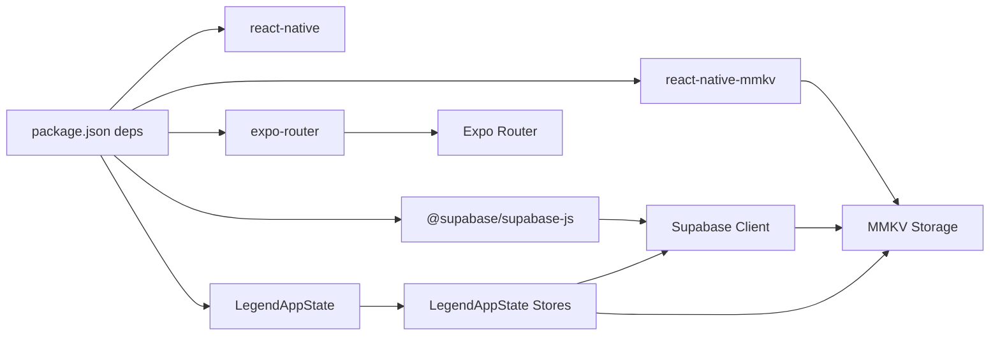

# System Architecture

<cite>
**Referenced Files in This Document**
- [package.json](file://package.json)
- [src/app/_layout.tsx](file://src/app/_layout.tsx)
- [src/lib/supabase/supabase.ts](file://src/lib/supabase/supabase.ts)
- [src/data/database.ts](file://src/data/database.ts)
- [src/data/states/auth.ts](file://src/data/states/auth.ts)
- [src/data/states/lists.ts](file://src/data/states/lists.ts)
- [src/data/storage.ts](file://src/data/storage.ts)
- [src/hooks/use-auth.ts](file://src/hooks/use-auth.ts)
- [src/hooks/use-user.ts](file://src/hooks/use-user.ts)
- [src/data/actions/auth.ts](file://src/data/actions/auth.ts)
- [src/services/sync.ts](file://src/services/sync.ts)
- [src/features/lists/page.tsx](file://src/features/lists/page.tsx)
- [src/features/dashboard/page.tsx](file://src/features/dashboard/page.tsx)
- [src/context/themes/provider.tsx](file://src/context/themes/provider.tsx)
</cite>

## Table of Contents
1. [Introduction](#introduction)
2. [Project Structure](#project-structure)
3. [Core Components](#core-components)
4. [Architecture Overview](#architecture-overview)
5. [Detailed Component Analysis](#detailed-component-analysis)
6. [Dependency Analysis](#dependency-analysis)
7. [Performance Considerations](#performance-considerations)
8. [Troubleshooting Guide](#troubleshooting-guide)
9. [Conclusion](#conclusion)
10. [Appendices](#appendices)

## Introduction
This document describes the system architecture of PowerLists, a cross-platform mobile application built with React Native and Expo. The architecture follows a feature-based modular design with clear separation of concerns across four primary layers:
- Presentation Layer: React Native components and feature pages
- Business Logic Layer: Feature modules encapsulating page logic and domain-specific computations
- Data Layer: State management via LegendAppState and persistence using dual storage (MMKV and Supabase)
- Service Layer: External integrations (authentication, real-time sync, and migrations)

The system emphasizes scalability, performance, and maintainability through reactive state, lazy-loaded components, and a robust offline-first strategy with automatic cloud synchronization.

## Project Structure
PowerLists organizes code by features and layers:
- src/app: Routing and root layout powered by Expo Router
- src/features: Feature-based modules (auth, dashboard, lists, list, voice assistant, etc.)
- src/components: Reusable UI primitives and shared components
- src/hooks: Custom hooks orchestrating state and services
- src/data: Data layer including states, actions, types, and storage adapters
- src/services: Cross-cutting services (toasts, sync)
- src/lib: External integrations (Supabase client)
- src/context: Global providers (themes)

**Diagram sources**
- [src/app/_layout.tsx:1-63](file://src/app/_layout.tsx#L1-L63)
- [src/features/lists/page.tsx:1-98](file://src/features/lists/page.tsx#L1-L98)
- [src/features/dashboard/page.tsx:1-135](file://src/features/dashboard/page.tsx#L1-L135)
- [src/hooks/use-auth.ts:1-261](file://src/hooks/use-auth.ts#L1-L261)
- [src/hooks/use-user.ts:1-85](file://src/hooks/use-user.ts#L1-L85)
- [src/services/sync.ts:1-203](file://src/services/sync.ts#L1-L203)
- [src/data/states/auth.ts:1-34](file://src/data/states/auth.ts#L1-L34)
- [src/data/states/lists.ts:1-27](file://src/data/states/lists.ts#L1-L27)
- [src/data/database.ts:1-36](file://src/data/database.ts#L1-L36)
- [src/data/storage.ts:1-74](file://src/data/storage.ts#L1-L74)
- [src/lib/supabase/supabase.ts:1-29](file://src/lib/supabase/supabase.ts#L1-L29)

**Section sources**
- [package.json:1-118](file://package.json#L1-L118)
- [src/app/_layout.tsx:1-63](file://src/app/_layout.tsx#L1-L63)

## Core Components
- Expo Router: Application routing and protected routes
- LegendAppState: Reactive state management with automatic persistence and sync
- Supabase: Authentication, real-time subscriptions, and server-side persistence
- MMKV: Local encryption-backed storage for sessions and offline-first behavior
- Feature Modules: Self-contained UI and logic per feature (auth, dashboard, lists, etc.)

Key responsibilities:
- Presentation Layer: Renders feature pages, handles navigation, and applies global providers
- Business Logic Layer: Encapsulates page logic, user actions, and migration flows
- Data Layer: Manages observable stores, sync configuration, and storage adapters
- Service Layer: Provides cross-cutting services and integrates external systems

**Section sources**
- [src/app/_layout.tsx:1-63](file://src/app/_layout.tsx#L1-L63)
- [src/hooks/use-auth.ts:1-261](file://src/hooks/use-auth.ts#L1-L261)
- [src/hooks/use-user.ts:1-85](file://src/hooks/use-user.ts#L1-L85)
- [src/services/sync.ts:1-203](file://src/services/sync.ts#L1-L203)
- [src/data/states/auth.ts:1-34](file://src/data/states/auth.ts#L1-L34)
- [src/data/states/lists.ts:1-27](file://src/data/states/lists.ts#L1-L27)
- [src/data/database.ts:1-36](file://src/data/database.ts#L1-L36)
- [src/lib/supabase/supabase.ts:1-29](file://src/lib/supabase/supabase.ts#L1-L29)
- [src/data/storage.ts:1-74](file://src/data/storage.ts#L1-L74)

## Architecture Overview
The system is designed around a layered, reactive architecture:
- Presentation Layer: Feature pages and shared UI components
- Business Logic Layer: Hooks orchestrate actions, state updates, and navigation
- Data Layer: LegendAppState observable stores with persisted and synced state
- Service Layer: Supabase client configured with MMKV adapter for secure local auth sessions

**Diagram sources**
- [src/app/_layout.tsx:1-63](file://src/app/_layout.tsx#L1-L63)
- [src/features/lists/page.tsx:1-98](file://src/features/lists/page.tsx#L1-L98)
- [src/features/dashboard/page.tsx:1-135](file://src/features/dashboard/page.tsx#L1-L135)
- [src/data/states/auth.ts:1-34](file://src/data/states/auth.ts#L1-L34)
- [src/data/states/lists.ts:1-27](file://src/data/states/lists.ts#L1-L27)
- [src/data/database.ts:1-36](file://src/data/database.ts#L1-L36)
- [src/lib/supabase/supabase.ts:1-29](file://src/lib/supabase/supabase.ts#L1-L29)
- [src/data/storage.ts:1-74](file://src/data/storage.ts#L1-L74)

## Detailed Component Analysis

### Presentation Layer
- Root Layout: Initializes theme provider, error boundary, keyboard provider, gesture handler, boot splash, and protected routes
- Feature Pages:
  - Lists Page: Renders a virtualized list of shopping lists with lazy-loaded components and floating action buttons
  - Dashboard Page: Renders analytics and summaries with lazy-loaded sections and navigation helpers

**Diagram sources**
- [src/app/_layout.tsx:1-63](file://src/app/_layout.tsx#L1-L63)
- [src/features/lists/page.tsx:1-98](file://src/features/lists/page.tsx#L1-L98)
- [src/features/dashboard/page.tsx:1-135](file://src/features/dashboard/page.tsx#L1-L135)

**Section sources**
- [src/app/_layout.tsx:1-63](file://src/app/_layout.tsx#L1-L63)
- [src/features/lists/page.tsx:1-98](file://src/features/lists/page.tsx#L1-L98)
- [src/features/dashboard/page.tsx:1-135](file://src/features/dashboard/page.tsx#L1-L135)

### Business Logic Layer
- use-auth: Centralizes authentication flows, session checks, sign-in/sign-up, password reset, and guest-to-user migration
- use-user: Manages user updates, guest creation, and soft/hard deletion flows
- SyncService: Handles guest data detection and migration to authenticated users

**Diagram sources**
- [src/hooks/use-auth.ts:1-261](file://src/hooks/use-auth.ts#L1-L261)
- [src/data/actions/auth.ts:1-138](file://src/data/actions/auth.ts#L1-L138)
- [src/data/states/auth.ts:1-34](file://src/data/states/auth.ts#L1-L34)
- [src/lib/supabase/supabase.ts:1-29](file://src/lib/supabase/supabase.ts#L1-L29)
- [src/services/sync.ts:1-203](file://src/services/sync.ts#L1-L203)

**Section sources**
- [src/hooks/use-auth.ts:1-261](file://src/hooks/use-auth.ts#L1-L261)
- [src/hooks/use-user.ts:1-85](file://src/hooks/use-user.ts#L1-L85)
- [src/data/actions/auth.ts:1-138](file://src/data/actions/auth.ts#L1-L138)
- [src/services/sync.ts:1-203](file://src/services/sync.ts#L1-L203)

### Data Layer
- LegendAppState Stores:
  - auth$: Reactive store for user, session, initialization, and loading state with persisted user via MMKV
  - lists$: Reactive store synced with Supabase for lists and list items, filtered by current user
- Sync Configuration:
  - configureSynced with Supabase plugin, merge mode, generated IDs, and retry policies
  - Realtime filters scoped to current user
- Storage:
  - MMKV configured with optional encryption key and adapter for Supabase auth persistence

**Diagram sources**
- [src/data/states/auth.ts:1-34](file://src/data/states/auth.ts#L1-L34)
- [src/data/states/lists.ts:1-27](file://src/data/states/lists.ts#L1-L27)
- [src/data/database.ts:1-36](file://src/data/database.ts#L1-L36)
- [src/data/storage.ts:1-74](file://src/data/storage.ts#L1-L74)
- [src/lib/supabase/supabase.ts:1-29](file://src/lib/supabase/supabase.ts#L1-L29)

**Section sources**
- [src/data/states/auth.ts:1-34](file://src/data/states/auth.ts#L1-L34)
- [src/data/states/lists.ts:1-27](file://src/data/states/lists.ts#L1-L27)
- [src/data/database.ts:1-36](file://src/data/database.ts#L1-L36)
- [src/data/storage.ts:1-74](file://src/data/storage.ts#L1-L74)
- [src/lib/supabase/supabase.ts:1-29](file://src/lib/supabase/supabase.ts#L1-L29)

### Service Layer
- Supabase Client: Configured with MMKV adapter for auth persistence, auto-refresh tokens, and session persistence
- SyncService: Detects guest data, prompts migration, and updates list ownership to authenticated users

**Diagram sources**
- [src/lib/supabase/supabase.ts:1-29](file://src/lib/supabase/supabase.ts#L1-L29)
- [src/services/sync.ts:1-203](file://src/services/sync.ts#L1-L203)

**Section sources**
- [src/lib/supabase/supabase.ts:1-29](file://src/lib/supabase/supabase.ts#L1-L29)
- [src/services/sync.ts:1-203](file://src/services/sync.ts#L1-L203)

### Feature Modules
- Lists Feature: Virtualized rendering of lists with lazy-loaded components, modals, and FAB for creation
- Dashboard Feature: Analytics sections with lazy-loading and navigation to detailed views

**Diagram sources**
- [src/features/lists/page.tsx:1-98](file://src/features/lists/page.tsx#L1-L98)

**Section sources**
- [src/features/lists/page.tsx:1-98](file://src/features/lists/page.tsx#L1-L98)
- [src/features/dashboard/page.tsx:1-135](file://src/features/dashboard/page.tsx#L1-L135)

### Global Providers and Theming
- Theme Provider: Manages theme, color scheme, and background color with persistence and dynamic updates

**Diagram sources**
- [src/context/themes/provider.tsx:1-156](file://src/context/themes/provider.tsx#L1-L156)

**Section sources**
- [src/context/themes/provider.tsx:1-156](file://src/context/themes/provider.tsx#L1-L156)

## Dependency Analysis
- Routing: Expo Router controls navigation and protected routes
- State Management: LegendAppState provides reactive stores with persistence and sync plugins
- Persistence: MMKV for local encryption-backed storage; Supabase for server-side persistence and real-time
- External Integrations: Supabase client configured with MMKV adapter for auth sessions

**Diagram sources**
- [package.json:1-118](file://package.json#L1-L118)

**Section sources**
- [package.json:1-118](file://package.json#L1-L118)

## Performance Considerations
- Virtualization: Lists feature uses a virtualized list to render large datasets efficiently
- Lazy Loading: Feature pages lazily load heavy components to reduce initial bundle size
- Reactive Updates: LegendAppState minimizes re-renders by tracking only observed values
- Offline-First: MMKV ensures fast local reads; Supabase sync handles eventual consistency
- Realtime Filtering: Backend filtering reduces payload sizes and improves responsiveness

[No sources needed since this section provides general guidance]

## Troubleshooting Guide
Common areas to inspect:
- Authentication failures: Review session retrieval and error handling in authentication hooks
- Migration issues: Verify guest data presence and migration prompts
- Sync conflicts: Check retry policies and merge mode configuration
- Storage corruption: Use storage debug utilities to inspect keys and values

**Section sources**
- [src/hooks/use-auth.ts:1-261](file://src/hooks/use-auth.ts#L1-L261)
- [src/services/sync.ts:1-203](file://src/services/sync.ts#L1-L203)
- [src/data/database.ts:1-36](file://src/data/database.ts#L1-L36)
- [src/data/storage.ts:1-74](file://src/data/storage.ts#L1-L74)

## Conclusion
PowerLists employs a clean, layered architecture with feature-based modularity and reactive state management. The combination of LegendAppState, MMKV, and Supabase enables a scalable, responsive, and maintainable solution that supports both offline-first and real-time collaboration scenarios.

[No sources needed since this section summarizes without analyzing specific files]

## Appendices

### Architectural Decision Records (ADRs)

- LegendAppState
  - Decision: Adopt LegendAppState for reactive state management with built-in persistence and sync plugins
  - Rationale: Reduces boilerplate, centralizes state logic, and simplifies offline-first and real-time synchronization
  - Impact: Improved developer productivity and consistent state handling across features

- Expo Router
  - Decision: Use Expo Router for declarative routing and protected routes
  - Rationale: Streamlines navigation, supports nested layouts, and integrates well with Expo ecosystem
  - Impact: Cleaner route structure and easier maintenance of authenticated vs anonymous flows

- Dual Storage Strategy (MMKV + Supabase)
  - Decision: Persist auth sessions and selected app data in MMKV while syncing core domain data to Supabase
  - Rationale: Balances performance (immediate local reads) with reliability (cloud sync and backups)
  - Impact: Enhanced user experience with offline capability and seamless cloud synchronization

[No sources needed since this section provides general guidance]