# UI Architecture

<cite>
**Referenced Files in This Document**
- [src/app/_layout.tsx](file://src/app/_layout.tsx)
- [src/context/themes/provider.tsx](file://src/context/themes/provider.tsx)
- [src/context/themes/context.tsx](file://src/context/themes/context.tsx)
- [src/context/themes/types.ts](file://src/context/themes/types.ts)
- [src/lib/themes.ts](file://src/lib/themes.ts)
- [src/utils/tailwind-color.ts](file://src/utils/tailwind-color.ts)
- [src/lib/utils.ts](file://src/lib/utils.ts)
- [src/components/ui/button.tsx](file://src/components/ui/button.tsx)
- [src/components/ui/text.tsx](file://src/components/ui/text.tsx)
- [src/components/ui/icon.tsx](file://src/components/ui/icon.tsx)
- [src/components/molecules/app-modal/index.tsx](file://src/components/molecules/app-modal/index.tsx)
- [src/components/molecules/circular-carousel/index.tsx](file://src/components/molecules/circular-carousel/index.tsx)
- [src/components/swipeable/SwipeableItem.tsx](file://src/components/swipeable/SwipeableItem.tsx)
- [src/features/lists/components/card-list.tsx](file://src/features/lists/components/card-list.tsx)
</cite>

## Table of Contents
1. [Introduction](#introduction)
2. [Project Structure](#project-structure)
3. [Core Components](#core-components)
4. [Architecture Overview](#architecture-overview)
5. [Detailed Component Analysis](#detailed-component-analysis)
6. [Dependency Analysis](#dependency-analysis)
7. [Performance Considerations](#performance-considerations)
8. [Accessibility Features](#accessibility-features)
9. [Integration with Nativewind and Tailwind CSS](#integration-with-nativewind-and-tailwind-css)
10. [Responsive Design Considerations](#responsive-design-considerations)
11. [Testing Strategies](#testing-strategies)
12. [Component Library Guidelines](#component-library-guidelines)
13. [Troubleshooting Guide](#troubleshooting-guide)
14. [Conclusion](#conclusion)

## Introduction
This document describes the UI architecture of PowerLists, focusing on component layers (primitives, molecules, and features), the theme system, styling with Nativewind/Tailwind, composition patterns, lifecycle and performance, accessibility, and testing strategies. It aims to help developers build consistent, reusable, and accessible UI components across the application.

## Project Structure
The UI layer is organized into:
- Primitives: Basic building blocks like Button, Text, Icon, Input, etc.
- Molecules: Composed UI units like Modal, CircularCarousel, and SwipeableItem.
- Features: Feature-specific screens and components (e.g., Lists, List items).
- Theme system: Centralized theme provider, context, and theme definitions.

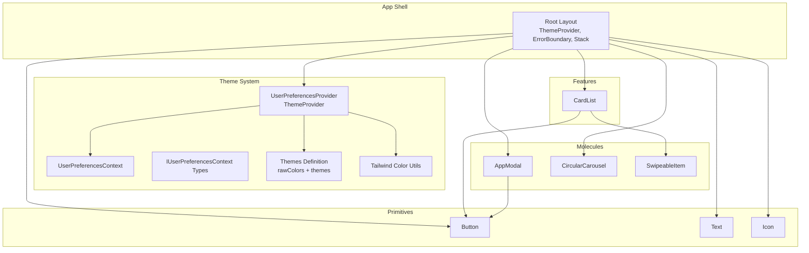

**Diagram sources**
- [src/app/_layout.tsx:17-62](file://src/app/_layout.tsx#L17-L62)
- [src/context/themes/provider.tsx:18-156](file://src/context/themes/provider.tsx#L18-L156)
- [src/context/themes/context.tsx:1-18](file://src/context/themes/context.tsx#L1-L18)
- [src/context/themes/types.ts:1-15](file://src/context/themes/types.ts#L1-L15)
- [src/lib/themes.ts:15-214](file://src/lib/themes.ts#L15-L214)
- [src/utils/tailwind-color.ts:132-147](file://src/utils/tailwind-color.ts#L132-L147)
- [src/components/ui/button.tsx:95-109](file://src/components/ui/button.tsx#L95-L109)
- [src/components/ui/text.tsx:67-87](file://src/components/ui/text.tsx#L67-L87)
- [src/components/ui/icon.tsx:44-56](file://src/components/ui/icon.tsx#L44-L56)
- [src/components/molecules/app-modal/index.tsx:36-226](file://src/components/molecules/app-modal/index.tsx#L36-L226)
- [src/components/molecules/circular-carousel/index.tsx:105-192](file://src/components/molecules/circular-carousel/index.tsx#L105-L192)
- [src/components/swipeable/SwipeableItem.tsx:10-39](file://src/components/swipeable/SwipeableItem.tsx#L10-L39)
- [src/features/lists/components/card-list.tsx:24-97](file://src/features/lists/components/card-list.tsx#L24-L97)

**Section sources**
- [src/app/_layout.tsx:17-62](file://src/app/_layout.tsx#L17-L62)
- [src/context/themes/provider.tsx:18-156](file://src/context/themes/provider.tsx#L18-L156)

## Core Components
- Primitives:
  - Button: Variants and sizes with class variance authority, platform-aware focus and hover states, and text variant propagation via context.
  - Text: Semantic variants (h1–h4, p, lead, code, small, muted) with accessibility roles and levels.
  - Icon: Nativewind-compatible wrapper around Tabler icons with className support.
- Molecules:
  - AppModal: Overlay/content/handle/footer with animated transitions, drag-to-dismiss, and portal rendering.
  - CircularCarousel: Animated carousel with interpolated transforms, blur intensity, and snapping.
  - SwipeableItem: Reanimated-powered swipeable container with hitSlop and pan guards.
- Feature-specific:
  - CardList: Feature card with swipe actions, icon mapping, accent color classes, and navigation.

**Section sources**
- [src/components/ui/button.tsx:95-109](file://src/components/ui/button.tsx#L95-L109)
- [src/components/ui/text.tsx:67-87](file://src/components/ui/text.tsx#L67-L87)
- [src/components/ui/icon.tsx:44-56](file://src/components/ui/icon.tsx#L44-L56)
- [src/components/molecules/app-modal/index.tsx:36-226](file://src/components/molecules/app-modal/index.tsx#L36-L226)
- [src/components/molecules/circular-carousel/index.tsx:105-192](file://src/components/molecules/circular-carousel/index.tsx#L105-L192)
- [src/components/swipeable/SwipeableItem.tsx:10-39](file://src/components/swipeable/SwipeableItem.tsx#L10-L39)
- [src/features/lists/components/card-list.tsx:24-97](file://src/features/lists/components/card-list.tsx#L24-L97)

## Architecture Overview
The UI architecture centers on a ThemeProvider that supplies theme variables, color scheme, and background color to the app. The provider computes an effective color scheme (system-aware), resolves theme variables, and applies them to the root view. Primitives and molecules consume these values via Tailwind classes and Nativewind’s vars.

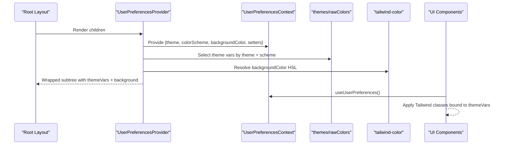

**Diagram sources**
- [src/app/_layout.tsx:37-58](file://src/app/_layout.tsx#L37-L58)
- [src/context/themes/provider.tsx:18-156](file://src/context/themes/provider.tsx#L18-L156)
- [src/context/themes/context.tsx:11-17](file://src/context/themes/context.tsx#L11-L17)
- [src/lib/themes.ts:204-214](file://src/lib/themes.ts#L204-L214)
- [src/utils/tailwind-color.ts:132-147](file://src/utils/tailwind-color.ts#L132-L147)

## Detailed Component Analysis

### Theme System
- Provider responsibilities:
  - Derives effective color scheme from user preference and system setting.
  - Exposes setters for theme, color scheme, and background color.
  - Converts background color to HSL for safe application.
  - Supplies theme variables (via NativeWind vars) to the root view.
- Context and types:
  - Strongly typed context and hook to access theme settings.
- Theme definitions:
  - Centralized raw color tokens per theme and scheme.
  - Automatic generation of NativeWind vars for style props.

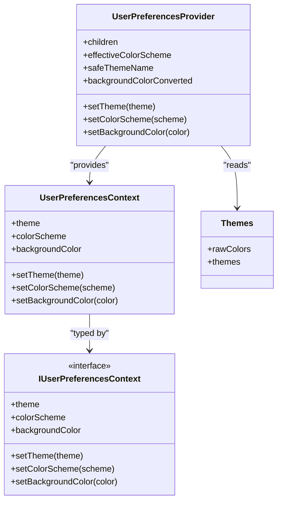

**Diagram sources**
- [src/context/themes/provider.tsx:18-156](file://src/context/themes/provider.tsx#L18-L156)
- [src/context/themes/context.tsx:11-17](file://src/context/themes/context.tsx#L11-L17)
- [src/context/themes/types.ts:7-14](file://src/context/themes/types.ts#L7-L14)
- [src/lib/themes.ts:15-214](file://src/lib/themes.ts#L15-L214)

**Section sources**
- [src/context/themes/provider.tsx:18-156](file://src/context/themes/provider.tsx#L18-L156)
- [src/context/themes/context.tsx:11-17](file://src/context/themes/context.tsx#L11-L17)
- [src/context/themes/types.ts:7-14](file://src/context/themes/types.ts#L7-L14)
- [src/lib/themes.ts:15-214](file://src/lib/themes.ts#L15-L214)

### Primitive Components

#### Button
- Composition pattern:
  - Uses class variance authority to define variants and sizes.
  - Provides a text variant context so descendant Text components inherit appropriate text classes.
  - Platform-aware focus/hover and disabled states.
- Prop interface:
  - Extends Pressable props and adds variant/size selection.
- Reusability:
  - Encapsulates shared styling and interaction semantics.

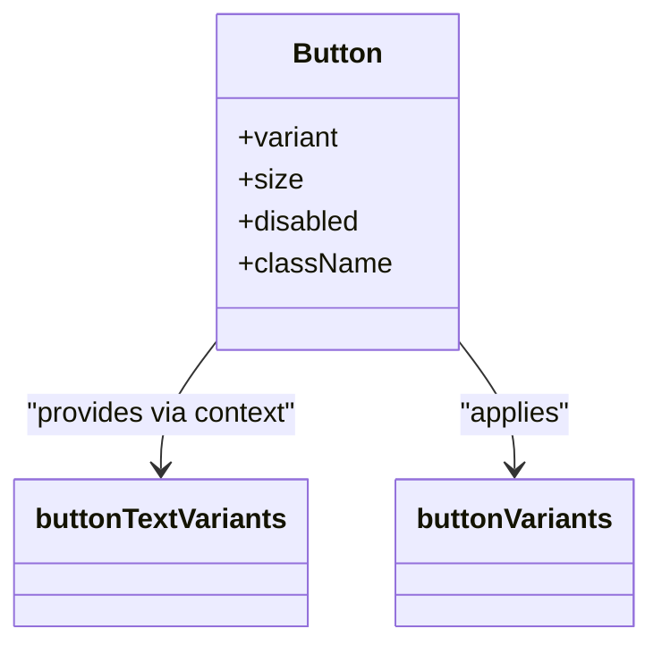

**Diagram sources**
- [src/components/ui/button.tsx:95-109](file://src/components/ui/button.tsx#L95-L109)

**Section sources**
- [src/components/ui/button.tsx:95-109](file://src/components/ui/button.tsx#L95-L109)

#### Text
- Composition pattern:
  - Accepts semantic variants and maps them to Tailwind classes.
  - Supports asChild via rn-primitives slot for composition.
  - Assigns accessibility roles and aria-levels for headings.
- Prop interface:
  - Extends RN Text with variant selection and asChild flag.

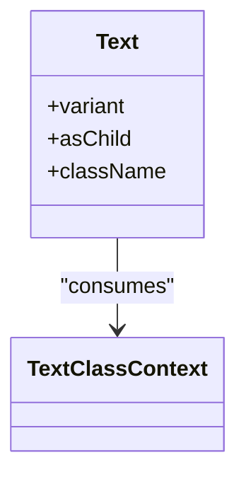

**Diagram sources**
- [src/components/ui/text.tsx:67-87](file://src/components/ui/text.tsx#L67-L87)

**Section sources**
- [src/components/ui/text.tsx:67-87](file://src/components/ui/text.tsx#L67-L87)

#### Icon
- Composition pattern:
  - Nativewind-compatible wrapper around Tabler icons using cssInterop.
  - Applies text-foreground by default and supports className overrides.
- Prop interface:
  - Accepts Tabler icon component and standard icon props.

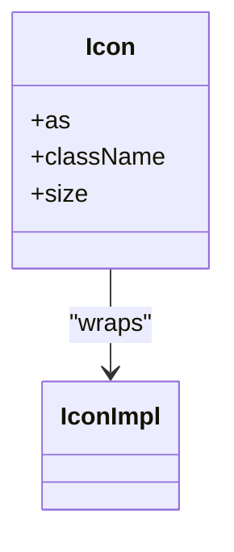

**Diagram sources**
- [src/components/ui/icon.tsx:44-56](file://src/components/ui/icon.tsx#L44-L56)

**Section sources**
- [src/components/ui/icon.tsx:44-56](file://src/components/ui/icon.tsx#L44-L56)

### Molecule Components

#### AppModal
- Composition pattern:
  - Uses @rn-primitives/dialog primitives with portal host and FullWindowOverlay for iOS.
  - Animated overlay/content with Reanimated transitions and drag-to-dismiss.
  - Header/Footer/Button integration for confirm/cancel flows.
- Prop interfaces:
  - Modal props, content props, header/footer props, and drag context.
- Reusability:
  - Provides a consistent modal shell across the app with standardized animations and gestures.

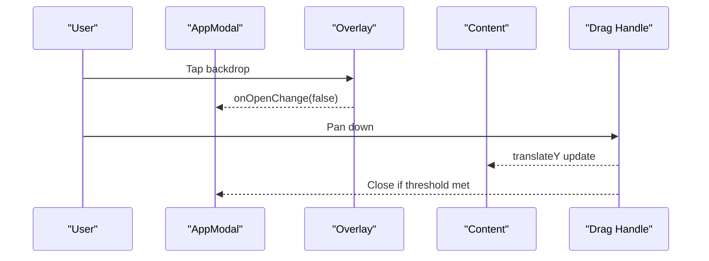

**Diagram sources**
- [src/components/molecules/app-modal/index.tsx:36-226](file://src/components/molecules/app-modal/index.tsx#L36-L226)

**Section sources**
- [src/components/molecules/app-modal/index.tsx:36-226](file://src/components/molecules/app-modal/index.tsx#L36-L226)

#### CircularCarousel
- Composition pattern:
  - Animated FlatList with shared values driving transforms, opacity, and blur intensity.
  - Interpolated transforms for 3D-like effect and paging/snapping behavior.
- Prop interfaces:
  - Data, renderItem, spacing, widths, and index change callback.
- Reusability:
  - Generic carousel suitable for any content type with consistent UX.

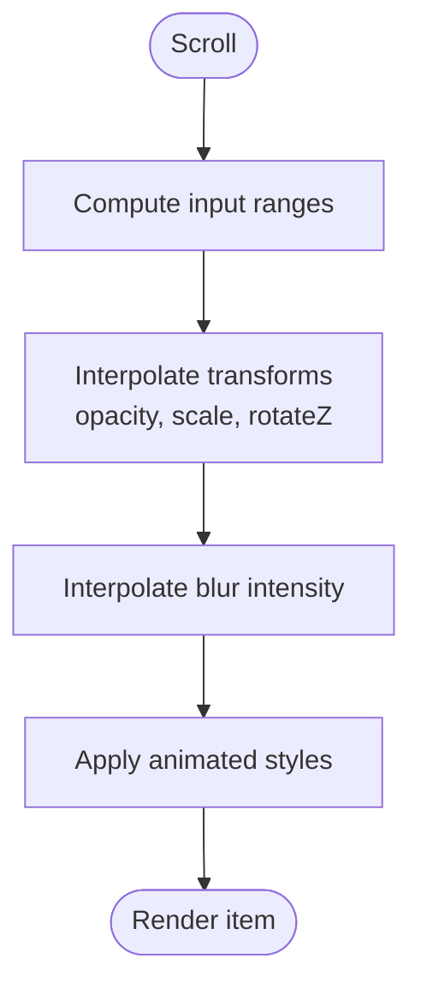

**Diagram sources**
- [src/components/molecules/circular-carousel/index.tsx:105-192](file://src/components/molecules/circular-carousel/index.tsx#L105-L192)

**Section sources**
- [src/components/molecules/circular-carousel/index.tsx:105-192](file://src/components/molecules/circular-carousel/index.tsx#L105-L192)

#### SwipeableItem
- Composition pattern:
  - ReanimatedSwipeable with computed hitSlop and pan guards to avoid conflicts.
  - Imperative ref exposes close method for parent components.
- Prop interfaces:
  - Extends ReanimatedSwipeable props plus onOpen/onClose callbacks.
- Reusability:
  - Provides consistent swipe behavior across feature cards and lists.

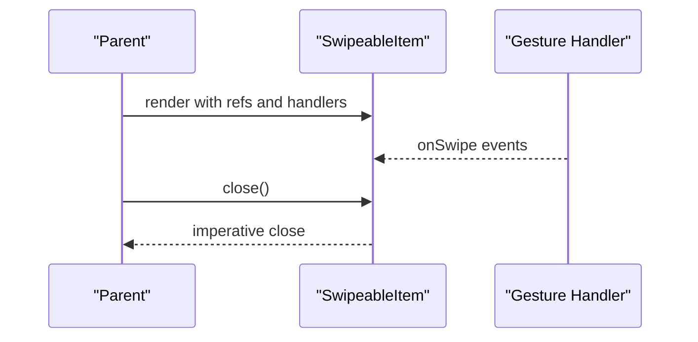

**Diagram sources**
- [src/components/swipeable/SwipeableItem.tsx:10-39](file://src/components/swipeable/SwipeableItem.tsx#L10-L39)

**Section sources**
- [src/components/swipeable/SwipeableItem.tsx:10-39](file://src/components/swipeable/SwipeableItem.tsx#L10-L39)

### Feature-Specific Components

#### CardList
- Composition pattern:
  - Integrates SwipeableItem for right actions, Icon via Icon wrapper, and Text for labels.
  - Uses accent color classes and icon mapping utilities.
  - Navigates to list detail on press.
- Prop interfaces:
  - List entity, total price, and callbacks for edit/delete.
- Reusability:
  - Encapsulates list card presentation and actions for the Lists feature.

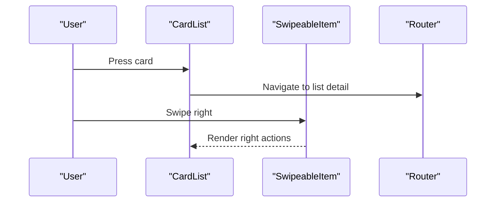

**Diagram sources**
- [src/features/lists/components/card-list.tsx:24-97](file://src/features/lists/components/card-list.tsx#L24-L97)
- [src/components/swipeable/SwipeableItem.tsx:10-39](file://src/components/swipeable/SwipeableItem.tsx#L10-L39)

**Section sources**
- [src/features/lists/components/card-list.tsx:24-97](file://src/features/lists/components/card-list.tsx#L24-L97)

## Dependency Analysis
- Theme provider depends on:
  - NativeWind color scheme detection and appearance.
  - Legend state for user preferences persistence.
  - Theme definitions and color resolution utilities.
- UI components depend on:
  - Tailwind classes applied via Nativewind.
  - Utility functions for class merging and color resolution.
- Feature components depend on:
  - Molecules for interaction patterns (modals, swipeables).
  - Utilities for icons, accent colors, and totals.

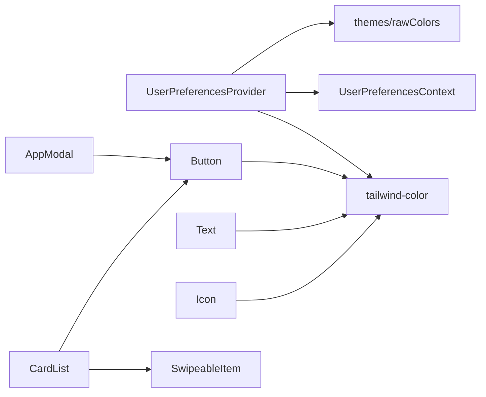

**Diagram sources**
- [src/context/themes/provider.tsx:18-156](file://src/context/themes/provider.tsx#L18-L156)
- [src/lib/themes.ts:15-214](file://src/lib/themes.ts#L15-L214)
- [src/utils/tailwind-color.ts:132-147](file://src/utils/tailwind-color.ts#L132-L147)
- [src/components/ui/button.tsx:95-109](file://src/components/ui/button.tsx#L95-L109)
- [src/components/ui/text.tsx:67-87](file://src/components/ui/text.tsx#L67-L87)
- [src/components/ui/icon.tsx:44-56](file://src/components/ui/icon.tsx#L44-L56)
- [src/components/molecules/app-modal/index.tsx:36-226](file://src/components/molecules/app-modal/index.tsx#L36-L226)
- [src/components/swipeable/SwipeableItem.tsx:10-39](file://src/components/swipeable/SwipeableItem.tsx#L10-L39)
- [src/features/lists/components/card-list.tsx:24-97](file://src/features/lists/components/card-list.tsx#L24-L97)

**Section sources**
- [src/context/themes/provider.tsx:18-156](file://src/context/themes/provider.tsx#L18-L156)
- [src/lib/themes.ts:15-214](file://src/lib/themes.ts#L15-L214)
- [src/utils/tailwind-color.ts:132-147](file://src/utils/tailwind-color.ts#L132-L147)
- [src/components/ui/button.tsx:95-109](file://src/components/ui/button.tsx#L95-L109)
- [src/components/ui/text.tsx:67-87](file://src/components/ui/text.tsx#L67-L87)
- [src/components/ui/icon.tsx:44-56](file://src/components/ui/icon.tsx#L44-L56)
- [src/components/molecules/app-modal/index.tsx:36-226](file://src/components/molecules/app-modal/index.tsx#L36-L226)
- [src/components/swipeable/SwipeableItem.tsx:10-39](file://src/components/swipeable/SwipeableItem.tsx#L10-L39)
- [src/features/lists/components/card-list.tsx:24-97](file://src/features/lists/components/card-list.tsx#L24-L97)

## Performance Considerations
- Memoization:
  - Feature components use React.memo with shallow prop equality checks to prevent unnecessary re-renders.
- Animations:
  - Reanimated shared values and interpolated styles minimize layout thrashing; paging-enabled FlatList reduces offscreen work.
- Gestures:
  - Pan guards and computed hitSlop reduce gesture conflicts and improve responsiveness.
- Theme application:
  - Precomputed theme variables and HSL conversion reduce runtime computations.
- Accessibility:
  - Proper roles and aria-levels on Text variants; focus-visible rings and keyboard providers.

**Section sources**
- [src/features/lists/components/card-list.tsx:87-97](file://src/features/lists/components/card-list.tsx#L87-L97)
- [src/components/molecules/circular-carousel/index.tsx:127-131](file://src/components/molecules/circular-carousel/index.tsx#L127-L131)
- [src/components/swipeable/SwipeableItem.tsx:16-17](file://src/components/swipeable/SwipeableItem.tsx#L16-L17)
- [src/context/themes/provider.tsx:100-114](file://src/context/themes/provider.tsx#L100-L114)
- [src/components/ui/text.tsx:49-63](file://src/components/ui/text.tsx#L49-L63)

## Accessibility Features
- Semantic Text roles:
  - Headings receive role="heading" and aria-level mapping.
- Focus management:
  - Platform-specific focus-visible rings and ring-based outlines for interactive elements.
- Keyboard support:
  - KeyboardProvider and gesture handler integration enable accessible navigation.
- Color contrast:
  - Theme-aware foreground/background pairs ensure readable text across schemes.

**Section sources**
- [src/components/ui/text.tsx:49-63](file://src/components/ui/text.tsx#L49-L63)
- [src/app/_layout.tsx:36-60](file://src/app/_layout.tsx#L36-L60)

## Integration with Nativewind and Tailwind CSS
- Theme variables:
  - themes exports NativeWind vars for each theme and scheme; rawColors defines the canonical color tokens.
- Utility classes:
  - cn merges classes via clsx and tailwind-merge to avoid conflicts.
- Dynamic styling:
  - ThemeProvider applies themeVars to the root view and converts background color to HSL for consistent rendering.
- Icon styling:
  - Icon uses cssInterop to accept className and apply color/size via style props.

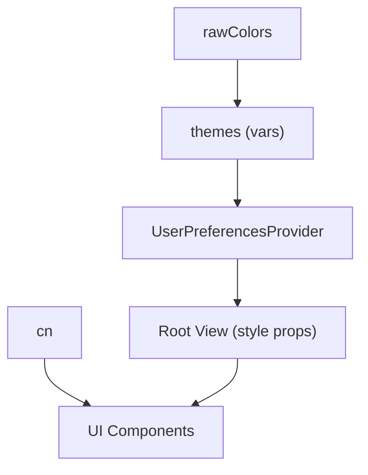

**Diagram sources**
- [src/lib/themes.ts:15-214](file://src/lib/themes.ts#L15-L214)
- [src/context/themes/provider.tsx:134-149](file://src/context/themes/provider.tsx#L134-L149)
- [src/lib/utils.ts:4-6](file://src/lib/utils.ts#L4-L6)
- [src/utils/tailwind-color.ts:132-147](file://src/utils/tailwind-color.ts#L132-L147)
- [src/components/ui/icon.tsx:13-22](file://src/components/ui/icon.tsx#L13-L22)

**Section sources**
- [src/lib/themes.ts:15-214](file://src/lib/themes.ts#L15-L214)
- [src/context/themes/provider.tsx:134-149](file://src/context/themes/provider.tsx#L134-L149)
- [src/lib/utils.ts:4-6](file://src/lib/utils.ts#L4-L6)
- [src/utils/tailwind-color.ts:132-147](file://src/utils/tailwind-color.ts#L132-L147)
- [src/components/ui/icon.tsx:13-22](file://src/components/ui/icon.tsx#L13-L22)

## Responsive Design Considerations
- Adaptive sizing:
  - Button variants adjust padding and height per breakpoint; icon sizing adapts to content.
- Gesture and layout:
  - Carousel uses window width to compute item widths and spacing; swipe hitSlop scales with device width.
- Safe areas and overlays:
  - SafeAreaView and FullWindowOverlay ensure content respects system bars and safe insets.

**Section sources**
- [src/components/ui/button.tsx:42-47](file://src/components/ui/button.tsx#L42-L47)
- [src/components/molecules/circular-carousel/index.tsx:18-21](file://src/components/molecules/circular-carousel/index.tsx#L18-L21)
- [src/components/molecules/app-modal/index.tsx:31-34](file://src/components/molecules/app-modal/index.tsx#L31-L34)

## Testing Strategies
- Unit tests:
  - Property-based tests for dashboard metrics and price calculations validate numerical correctness under varied inputs.
  - Speech recognition service property tests ensure robust parsing behavior.
- Behavior tests:
  - Jest behavior config and setup files support component behavior testing.
- UI tests:
  - Formatters and currency utilities include property tests to validate formatting and rounding.

Recommendations:
- Snapshot tests for primitive and molecule components to detect unintended style/layout regressions.
- Interaction tests with gesture handlers and modals using component refs and callbacks.
- Accessibility tests verifying roles, aria-levels, and focus behavior.

**Section sources**
- [src/features/dashboard/utils/__tests__/dashboard-metrics.property.test.ts](file://src/features/dashboard/utils/__tests__/dashboard-metrics.property.test.ts)
- [src/features/lists/utils/__tests__/price-calcs.property.test.ts](file://src/features/lists/utils/__tests__/price-calcs.property.test.ts)
- [src/features/voice-assistant/__tests__/speech-recognition-service.property.test.ts](file://src/features/voice-assistant/__tests__/speech-recognition-service.property.test.ts)
- [src/utils/currency.ts](file://src/utils/currency.ts)
- [src/utils/formatters.ts](file://src/utils/formatters.ts)

## Component Library Guidelines
- Naming and location:
  - Place primitives in src/components/ui, molecules in src/components/molecules, and feature-specific components under src/features/<feature>/components.
- Props and composition:
  - Prefer variant/size props for styling; propagate class contexts for nested text.
  - Use ref forwarding for gesture-driven components.
- Theming:
  - Always derive colors from theme variables; avoid hardcoded values.
  - Use cn for class merging and ensure no conflicting utilities.
- Accessibility:
  - Assign semantic roles and aria-levels for headings; ensure focus-visible states.
- Performance:
  - Memoize components with stable prop equality; leverage Reanimated for smooth animations.
- Testing:
  - Add unit tests for logic and property tests for data transformations; include behavior tests for interactions.

## Troubleshooting Guide
- Theme not applied:
  - Verify ThemeProvider wraps the app and theme variables are supplied to the root view.
  - Confirm color scheme and theme selections are valid.
- Background color issues:
  - Ensure backgroundColor is resolved via theme color utilities and falls back to defaults when missing.
- Modal animation glitches:
  - Check portal host configuration and FullWindowOverlay usage on iOS.
  - Validate drag thresholds and spring configurations.
- Swipe conflicts:
  - Confirm pan guards and hitSlop are computed and applied to the swipeable container.

**Section sources**
- [src/context/themes/provider.tsx:18-156](file://src/context/themes/provider.tsx#L18-L156)
- [src/utils/tailwind-color.ts:132-147](file://src/utils/tailwind-color.ts#L132-L147)
- [src/components/molecules/app-modal/index.tsx:31-34](file://src/components/molecules/app-modal/index.tsx#L31-L34)
- [src/components/swipeable/SwipeableItem.tsx:16-17](file://src/components/swipeable/SwipeableItem.tsx#L16-L17)

## Conclusion
PowerLists’ UI architecture emphasizes a strong theme system, reusable primitives and molecules, and feature-specific components that compose seamlessly. By leveraging Nativewind/Tailwind, class variance authority, and Reanimated, the system achieves consistent styling, smooth interactions, and accessible experiences. Following the provided guidelines ensures maintainability, performance, and scalability across the component library.