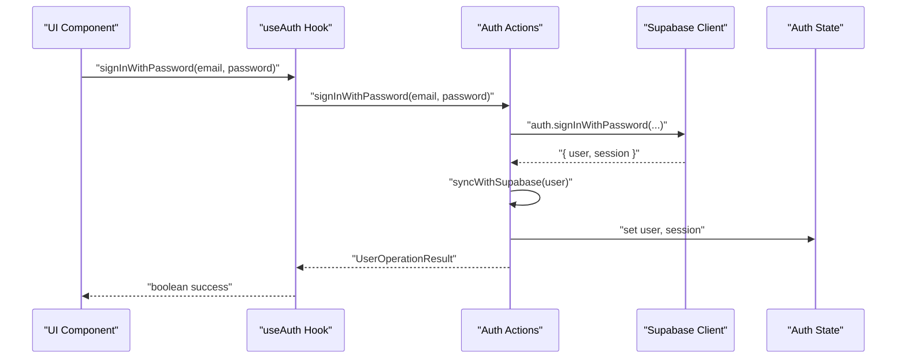
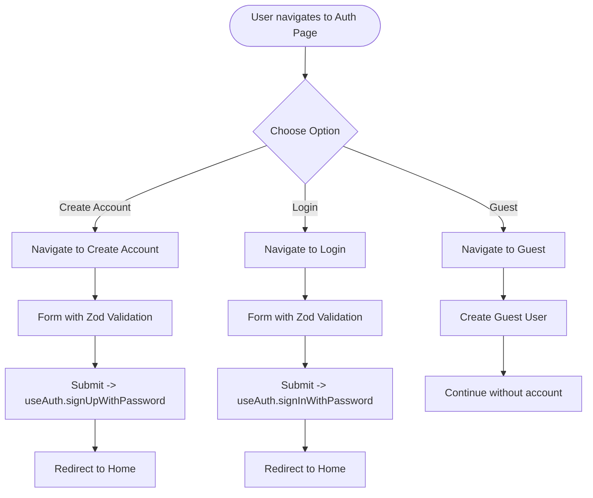
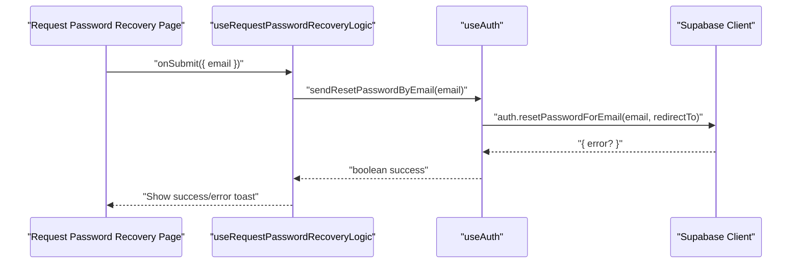
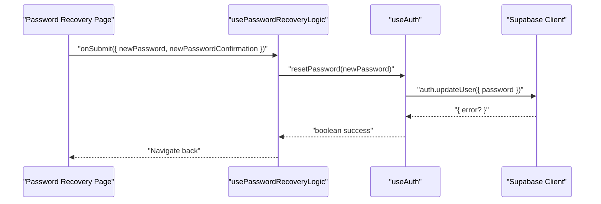
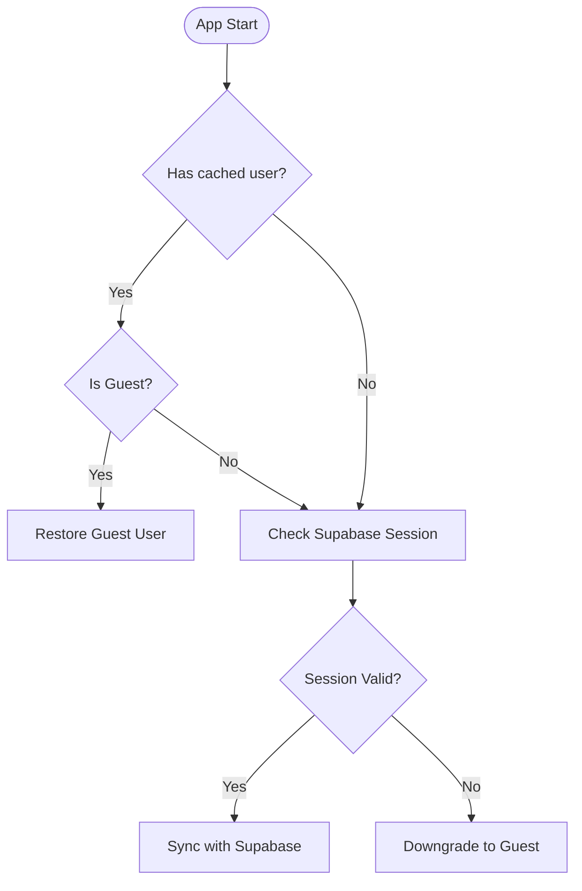
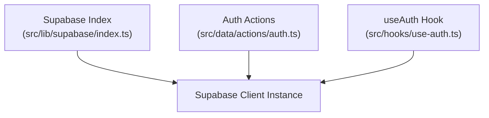
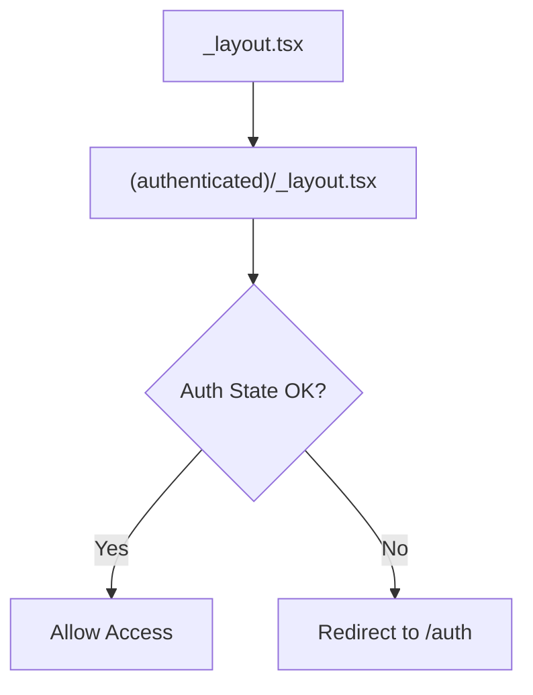
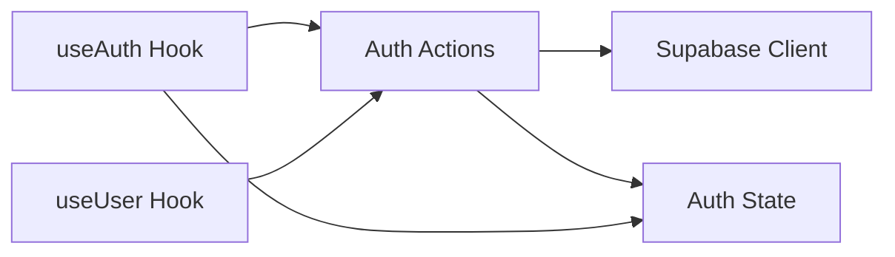

# Authentication System

<cite>
**Referenced Files in This Document**
- [src/hooks/use-auth.ts](file://src/hooks/use-auth.ts)
- [src/hooks/use-user.ts](file://src/hooks/use-user.ts)
- [src/data/actions/auth.ts](file://src/data/actions/auth.ts)
- [src/data/states/auth.ts](file://src/data/states/auth.ts)
- [src/features/auth/hooks/use-auth-page-logic.ts](file://src/features/auth/hooks/use-auth-page-logic.ts)
- [src/features/create-account/hooks/use-create-account-logic.ts](file://src/features/create-account/hooks/use-create-account-logic.ts)
- [src/features/login/utils/shema.ts](file://src/features/login/utils/shema.ts)
- [src/features/request-password-recovery/hooks/use-request-password-recovery-page-logic.ts](file://src/features/request-password-recovery/hooks/use-request-password-recovery-page-logic.ts)
- [src/features/password-recovery/hooks/use-password-recovery-page-logic.ts](file://src/features/password-recovery/hooks/use-password-recovery-page-logic.ts)
- [src/lib/supabase/index.ts](file://src/lib/supabase/index.ts)
- [src/app/auth.tsx](file://src/app/auth.tsx)
- [src/app/create-account.tsx](file://src/app/create-account.tsx)
- [src/app/login.tsx](file://src/app/login.tsx)
- [src/app/password-recovery.tsx](file://src/app/password-recovery.tsx)
- [src/app/request-password-recovery.tsx](file://src/app/request-password-recovery.tsx)
- [src/app/(authenticated)/_layout.tsx](file://src/app/(authenticated)/_layout.tsx)
- [src/app/_layout.tsx](file://src/app/_layout.tsx)
</cite>

## Table of Contents
1. [Introduction](#introduction)
2. [Project Structure](#project-structure)
3. [Core Components](#core-components)
4. [Architecture Overview](#architecture-overview)
5. [Detailed Component Analysis](#detailed-component-analysis)
6. [Dependency Analysis](#dependency-analysis)
7. [Performance Considerations](#performance-considerations)
8. [Security Considerations](#security-considerations)
9. [Troubleshooting Guide](#troubleshooting-guide)
10. [Conclusion](#conclusion)

## Introduction
This document describes the PowerLists authentication system. It covers the complete authentication flow including user registration, login, password recovery, and guest user support. It documents the Supabase authentication integration, session management, and token handling. It also explains the reactive state management for authentication status, user session persistence, and automatic logout scenarios. Security considerations, password validation rules, and email verification processes are included. Finally, it documents the authentication hooks, state management patterns, and integration with the broader application state, along with examples of authentication guards, protected route handling, and user session restoration.

## Project Structure
The authentication system is organized around three layers:
- Hooks: UI-facing composables that orchestrate authentication actions and expose reactive state.
- Actions: Business logic that interacts with Supabase and local stores.
- State: Reactive store with persistence for user, session, initialization, and loading flags.

```mermaid
graph TB
subgraph "UI Layer"
AuthPage["Auth Page Logic Hook<br/>(features/auth/hooks/use-auth-page-logic.ts)"]
CreateAccHook["Create Account Hook<br/>(features/create-account/hooks/use-create-account-logic.ts)"]
LoginSchema["Login Schema<br/>(features/login/utils/shema.ts)"]
ReqPassHook["Request Password Recovery Hook<br/>(features/request-password-recovery/hooks/use-request-password-recovery-page-logic.ts)"]
PassRecHook["Password Recovery Hook<br/>(features/password-recovery/hooks/use-password-recovery-page-logic.ts)"]
end
subgraph "Hooks Layer"
UseAuth["useAuth Hook<br/>(src/hooks/use-auth.ts)"]
UseUser["useUser Hook<br/>(src/hooks/use-user.ts)"]
end
subgraph "Actions Layer"
AuthActions["Auth Actions<br/>(src/data/actions/auth.ts)"]
end
subgraph "State Layer"
AuthState["Auth State<br/>(src/data/states/auth.ts)"]
end
subgraph "Supabase"
Supabase["Supabase Client<br/>(src/lib/supabase/index.ts)"]
end
AuthPage --> UseAuth
CreateAccHook --> UseAuth
ReqPassHook --> UseAuth
PassRecHook --> UseAuth
UseAuth --> AuthActions
UseUser --> AuthActions
AuthActions --> Supabase
AuthActions --> AuthState
UseAuth --> AuthState
```

**Diagram sources**
- [src/features/auth/hooks/use-auth-page-logic.ts:1-29](file://src/features/auth/hooks/use-auth-page-logic.ts#L1-L29)
- [src/features/create-account/hooks/use-create-account-logic.ts:1-51](file://src/features/create-account/hooks/use-create-account-logic.ts#L1-L51)
- [src/features/login/utils/shema.ts:1-2](file://src/features/login/utils/shema.ts#L1-L2)
- [src/features/request-password-recovery/hooks/use-request-password-recovery-page-logic.ts:1-88](file://src/features/request-password-recovery/hooks/use-request-password-recovery-page-logic.ts#L1-L88)
- [src/features/password-recovery/hooks/use-password-recovery-page-logic.ts:1-55](file://src/features/password-recovery/hooks/use-password-recovery-page-logic.ts#L1-L55)
- [src/hooks/use-auth.ts:1-261](file://src/hooks/use-auth.ts#L1-L261)
- [src/hooks/use-user.ts:1-85](file://src/hooks/use-user.ts#L1-L85)
- [src/data/actions/auth.ts:1-138](file://src/data/actions/auth.ts#L1-L138)
- [src/data/states/auth.ts:1-34](file://src/data/states/auth.ts#L1-L34)
- [src/lib/supabase/index.ts:1-4](file://src/lib/supabase/index.ts#L1-L4)

**Section sources**
- [src/hooks/use-auth.ts:1-261](file://src/hooks/use-auth.ts#L1-L261)
- [src/data/actions/auth.ts:1-138](file://src/data/actions/auth.ts#L1-L138)
- [src/data/states/auth.ts:1-34](file://src/data/states/auth.ts#L1-L34)

## Core Components
- useAuth: Central hook orchestrating authentication operations, session checks, and state updates.
- useUser: User-centric operations including guest creation, profile updates, and soft/hard deletion.
- Auth Actions: Encapsulate Supabase interactions (sign up, sign in, reset password, sign out) and local synchronization.
- Auth State: Reactive store with persisted user/session state and initialization/loading flags.

Key responsibilities:
- Registration: Creates a new Supabase user and synchronizes local state.
- Login: Authenticates via password, restores session, and migrates guest data if applicable.
- Password recovery: Sends reset email and updates password after validation.
- Guest user: Allows anonymous usage with optional migration to authenticated user.
- Session management: Checks session validity, restores user from Supabase, and handles logout.

**Section sources**
- [src/hooks/use-auth.ts:19-261](file://src/hooks/use-auth.ts#L19-L261)
- [src/hooks/use-user.ts:8-85](file://src/hooks/use-user.ts#L8-L85)
- [src/data/actions/auth.ts:16-138](file://src/data/actions/auth.ts#L16-L138)
- [src/data/states/auth.ts:8-34](file://src/data/states/auth.ts#L8-L34)

## Architecture Overview
The authentication architecture integrates UI hooks with Supabase and a reactive state store. The flow below maps actual code paths and interactions.



**Diagram sources**
- [src/hooks/use-auth.ts:76-121](file://src/hooks/use-auth.ts#L76-L121)
- [src/data/actions/auth.ts:99-110](file://src/data/actions/auth.ts#L99-L110)
- [src/data/states/auth.ts:22-33](file://src/data/states/auth.ts#L22-L33)

**Section sources**
- [src/hooks/use-auth.ts:76-121](file://src/hooks/use-auth.ts#L76-L121)
- [src/data/actions/auth.ts:99-110](file://src/data/actions/auth.ts#L99-L110)
- [src/data/states/auth.ts:22-33](file://src/data/states/auth.ts#L22-L33)

## Detailed Component Analysis

### Authentication Hooks and Pages
- Auth Page Logic: Provides navigation helpers for create account, login, and guest access.
- Create Account Logic: Integrates form validation, secure password entry, and registration flow.
- Request Password Recovery Logic: Implements rate limiting, validation, and email dispatch.
- Password Recovery Logic: Validates new password confirmation and updates the user’s password.



**Diagram sources**
- [src/features/auth/hooks/use-auth-page-logic.ts:5-28](file://src/features/auth/hooks/use-auth-page-logic.ts#L5-L28)
- [src/features/create-account/hooks/use-create-account-logic.ts:9-50](file://src/features/create-account/hooks/use-create-account-logic.ts#L9-L50)
- [src/features/login/utils/shema.ts:1-2](file://src/features/login/utils/shema.ts#L1-L2)

**Section sources**
- [src/features/auth/hooks/use-auth-page-logic.ts:5-28](file://src/features/auth/hooks/use-auth-page-logic.ts#L5-L28)
- [src/features/create-account/hooks/use-create-account-logic.ts:9-50](file://src/features/create-account/hooks/use-create-account-logic.ts#L9-L50)
- [src/features/login/utils/shema.ts:1-2](file://src/features/login/utils/shema.ts#L1-L2)

### Password Recovery Flow


**Diagram sources**
- [src/features/request-password-recovery/hooks/use-request-password-recovery-page-logic.ts:43-75](file://src/features/request-password-recovery/hooks/use-request-password-recovery-page-logic.ts#L43-L75)
- [src/hooks/use-auth.ts:185-208](file://src/hooks/use-auth.ts#L185-L208)

**Section sources**
- [src/features/request-password-recovery/hooks/use-request-password-recovery-page-logic.ts:43-75](file://src/features/request-password-recovery/hooks/use-request-password-recovery-page-logic.ts#L43-L75)
- [src/hooks/use-auth.ts:185-208](file://src/hooks/use-auth.ts#L185-L208)

### Password Reset Flow


**Diagram sources**
- [src/features/password-recovery/hooks/use-password-recovery-page-logic.ts:28-41](file://src/features/password-recovery/hooks/use-password-recovery-page-logic.ts#L28-L41)
- [src/hooks/use-auth.ts:210-229](file://src/hooks/use-auth.ts#L210-L229)

**Section sources**
- [src/features/password-recovery/hooks/use-password-recovery-page-logic.ts:28-41](file://src/features/password-recovery/hooks/use-password-recovery-page-logic.ts#L28-L41)
- [src/hooks/use-auth.ts:210-229](file://src/hooks/use-auth.ts#L210-L229)

### Guest User Support
- Guest creation: Generates a temporary user record with a unique identifier and sets session to null.
- Data migration: When a guest logs in, the system prompts migration of stored data to the authenticated user.
- Automatic downgrade: On session invalidity, the user is downgraded to guest mode.



**Diagram sources**
- [src/hooks/use-auth.ts:29-74](file://src/hooks/use-auth.ts#L29-L74)
- [src/data/actions/auth.ts:16-30](file://src/data/actions/auth.ts#L16-L30)
- [src/data/actions/auth.ts:112-125](file://src/data/actions/auth.ts#L112-L125)

**Section sources**
- [src/hooks/use-auth.ts:29-74](file://src/hooks/use-auth.ts#L29-L74)
- [src/data/actions/auth.ts:16-30](file://src/data/actions/auth.ts#L16-L30)
- [src/data/actions/auth.ts:112-125](file://src/data/actions/auth.ts#L112-L125)

### Supabase Integration and Token Handling
- Supabase client export: Centralized access to Supabase client and types.
- Session and user retrieval: Used to restore sessions and synchronize user data.
- Password reset and update: Uses Supabase auth APIs for secure operations.



**Diagram sources**
- [src/lib/supabase/index.ts:1-4](file://src/lib/supabase/index.ts#L1-L4)
- [src/data/actions/auth.ts:1-12](file://src/data/actions/auth.ts#L1-L12)
- [src/hooks/use-auth.ts:4-5](file://src/hooks/use-auth.ts#L4-L5)

**Section sources**
- [src/lib/supabase/index.ts:1-4](file://src/lib/supabase/index.ts#L1-L4)
- [src/data/actions/auth.ts:1-12](file://src/data/actions/auth.ts#L1-L12)
- [src/hooks/use-auth.ts:4-5](file://src/hooks/use-auth.ts#L4-L5)

### Protected Routes and Guards
Protected routes are handled via the authenticated route layout. The authentication state determines whether the user can access authenticated content.



**Diagram sources**
- [src/app/_layout.tsx](file://src/app/_layout.tsx)
- [src/app/(authenticated)/_layout.tsx](file://src/app/(authenticated)/_layout.tsx)

**Section sources**
- [src/app/_layout.tsx](file://src/app/_layout.tsx)
- [src/app/(authenticated)/_layout.tsx](file://src/app/(authenticated)/_layout.tsx)

## Dependency Analysis
The authentication system exhibits clear separation of concerns:
- UI hooks depend on useAuth/useUser.
- useAuth/useUser depend on Auth Actions.
- Auth Actions depend on Supabase and Auth State.
- Auth State persists user/session data.



**Diagram sources**
- [src/hooks/use-auth.ts:19-261](file://src/hooks/use-auth.ts#L19-L261)
- [src/hooks/use-user.ts:8-85](file://src/hooks/use-user.ts#L8-L85)
- [src/data/actions/auth.ts:1-138](file://src/data/actions/auth.ts#L1-L138)
- [src/data/states/auth.ts:1-34](file://src/data/states/auth.ts#L1-L34)

**Section sources**
- [src/hooks/use-auth.ts:19-261](file://src/hooks/use-auth.ts#L19-L261)
- [src/hooks/use-user.ts:8-85](file://src/hooks/use-user.ts#L8-L85)
- [src/data/actions/auth.ts:1-138](file://src/data/actions/auth.ts#L1-L138)
- [src/data/states/auth.ts:1-34](file://src/data/states/auth.ts#L1-L34)

## Performance Considerations
- Reactive state updates: Using Legend state minimizes re-renders by updating only changed fields.
- Persistence: Persisted user/session reduces cold-start work and avoids redundant network calls.
- Batched operations: Group related updates (e.g., user sync) to reduce repeated reads/writes.
- Debounced or throttled UI interactions: Consider throttling email resend attempts to avoid excessive network calls.

## Security Considerations
- Password validation: Enforced via form schemas on registration and password recovery pages.
- Secure transport: Supabase client handles encrypted communication; ensure environment variables are configured securely.
- Rate limiting: Email resend logic includes rate limiting to prevent abuse.
- Token handling: Session and user data are managed through Supabase auth APIs; local tokens are not manually stored.
- Guest-to-auth migration: Data migration occurs after successful authentication to maintain data integrity.
- Soft and hard deletes: Separate flows for soft deletion (marking deleted_at) and hard deletion (invoking serverless function) with appropriate checks.

**Section sources**
- [src/features/create-account/hooks/use-create-account-logic.ts:19-25](file://src/features/create-account/hooks/use-create-account-logic.ts#L19-L25)
- [src/features/password-recovery/hooks/use-password-recovery-page-logic.ts:20-26](file://src/features/password-recovery/hooks/use-password-recovery-page-logic.ts#L20-L26)
- [src/features/request-password-recovery/hooks/use-request-password-recovery-page-logic.ts:43-75](file://src/features/request-password-recovery/hooks/use-request-password-recovery-page-logic.ts#L43-L75)
- [src/hooks/use-user.ts:39-82](file://src/hooks/use-user.ts#L39-L82)

## Troubleshooting Guide
Common issues and resolutions:
- Login failures: Errors are normalized and surfaced via toast notifications; check credentials and network connectivity.
- Registration failures: Validate form inputs and ensure unique email; errors are handled gracefully.
- Password reset emails: Respect rate limits; verify email exists and retry after cooldown.
- Session restoration: If session is invalid, the system downgrades to guest mode; re-authenticate to restore full access.
- Logout: Clears session and resets stores; ensure to navigate to the auth screen after logout.

Operational hooks and actions involved:
- useAuth: Centralized error handling and toast notifications.
- Auth Actions: Normalize errors and propagate meaningful messages.
- useUser: Handles user lifecycle operations including soft/hard deletion.

**Section sources**
- [src/hooks/use-auth.ts:111-120](file://src/hooks/use-auth.ts#L111-L120)
- [src/hooks/use-auth.ts:152-160](file://src/hooks/use-auth.ts#L152-L160)
- [src/hooks/use-auth.ts:185-208](file://src/hooks/use-auth.ts#L185-L208)
- [src/hooks/use-auth.ts:210-229](file://src/hooks/use-auth.ts#L210-L229)
- [src/data/actions/auth.ts:135-137](file://src/data/actions/auth.ts#L135-L137)
- [src/hooks/use-user.ts:39-82](file://src/hooks/use-user.ts#L39-L82)

## Conclusion
The PowerLists authentication system integrates Supabase auth with a reactive state layer to provide a seamless user experience. It supports registration, login, password recovery, and guest usage with robust error handling and security measures. The hooks and actions encapsulate Supabase interactions while maintaining clean separation of concerns, enabling scalable and maintainable authentication flows.