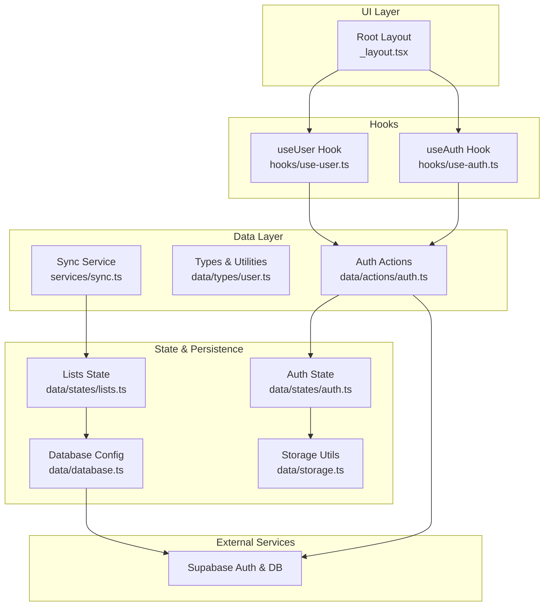
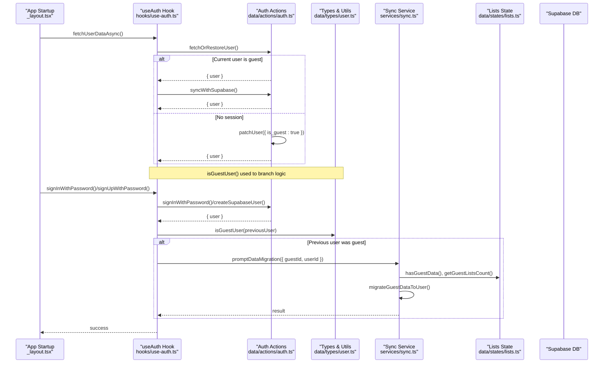
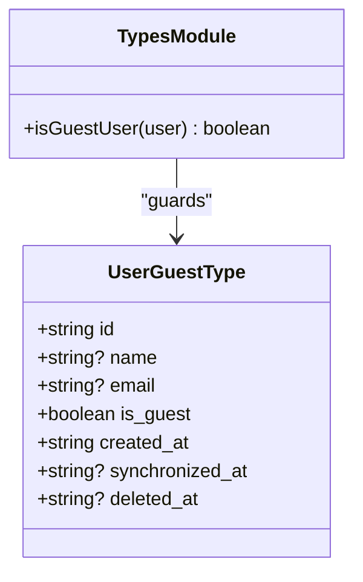
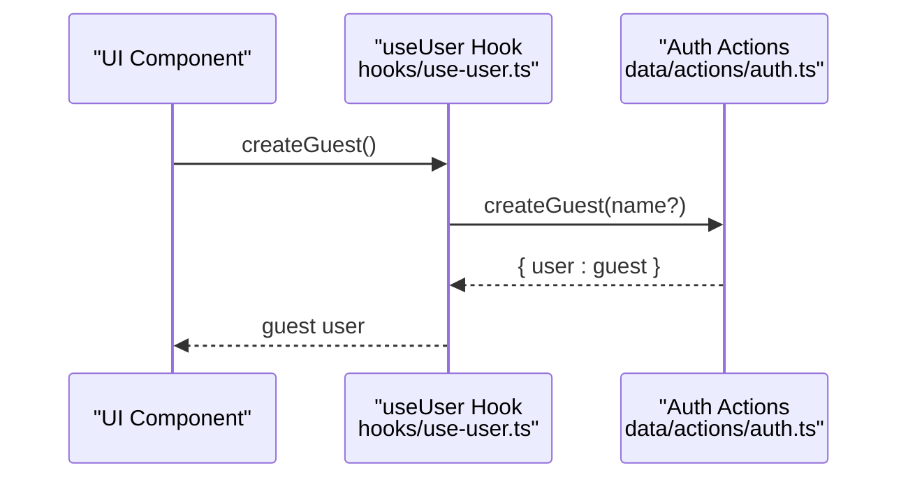
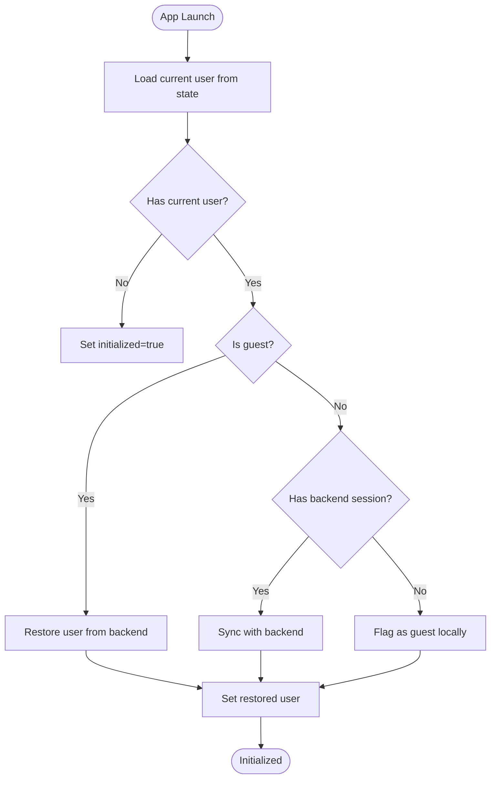
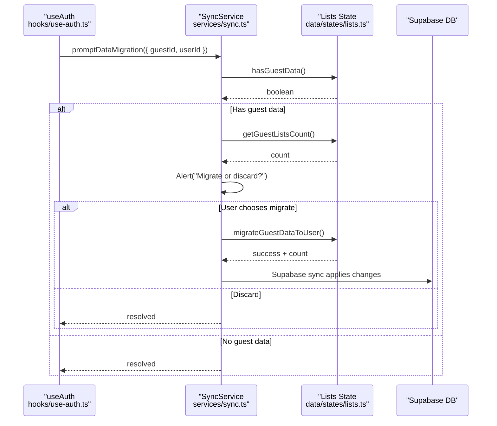
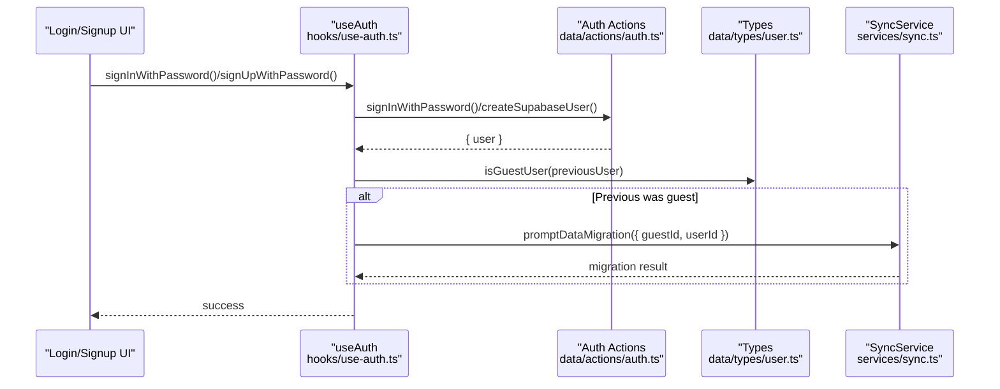
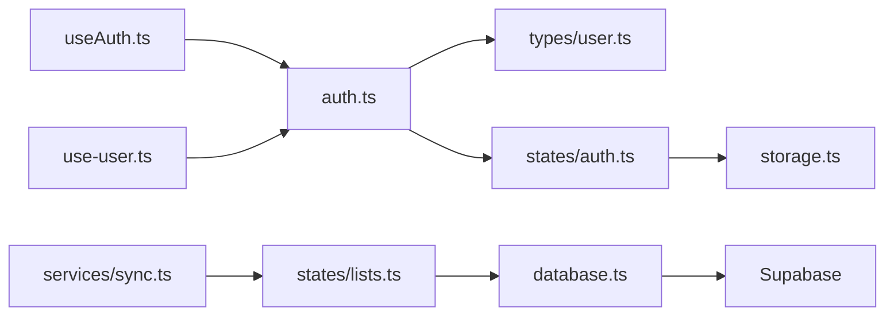

# Guest User Support

<cite>
**Referenced Files in This Document**
- [src/data/actions/auth.ts](file://src/data/actions/auth.ts)
- [src/hooks/use-auth.ts](file://src/hooks/use-auth.ts)
- [src/hooks/use-user.ts](file://src/hooks/use-user.ts)
- [src/data/types/user.ts](file://src/data/types/user.ts)
- [src/services/sync.ts](file://src/services/sync.ts)
- [src/data/states/auth.ts](file://src/data/states/auth.ts)
- [src/data/states/lists.ts](file://src/data/states/lists.ts)
- [src/data/database.ts](file://src/data/database.ts)
- [src/data/storage.ts](file://src/data/storage.ts)
- [src/app/_layout.tsx](file://src/app/_layout.tsx)
- [src/hooks/__tests__/use-auth.test.tsx](file://src/hooks/__tests__/use-auth.test.tsx)
</cite>

## Table of Contents
1. [Introduction](#introduction)
2. [Project Structure](#project-structure)
3. [Core Components](#core-components)
4. [Architecture Overview](#architecture-overview)
5. [Detailed Component Analysis](#detailed-component-analysis)
6. [Dependency Analysis](#dependency-analysis)
7. [Performance Considerations](#performance-considerations)
8. [Troubleshooting Guide](#troubleshooting-guide)
9. [Conclusion](#conclusion)

## Introduction
This document explains the guest user support system in the application. It covers the guest user concept, automatic guest account creation, temporary user accounts, and the seamless transition to registered users. It also documents guest user lifecycle management, data association and migration during registration or login, the isGuestUser utility, sync service integration for data migration, and handling of guest user limitations. The goal is to provide a clear understanding of how guest users are detected, how their data is preserved and migrated, and how the system ensures data continuity during conversion to registered users.

## Project Structure
The guest user system spans several layers:
- Authentication actions and hooks orchestrate guest creation, sign-in/sign-up, session restoration, and sign-out.
- Types define the guest user model and the isGuestUser utility.
- Sync service detects guest data and coordinates migration to authenticated users.
- State management persists user sessions locally and synchronizes with Supabase.
- Database configuration integrates Supabase synchronization and filtering by current user.

**Diagram sources**
- [src/app/_layout.tsx:17-62](file://src/app/_layout.tsx#L17-L62)
- [src/hooks/use-auth.ts:19-261](file://src/hooks/use-auth.ts#L19-L261)
- [src/hooks/use-user.ts:8-85](file://src/hooks/use-user.ts#L8-L85)
- [src/data/actions/auth.ts:16-138](file://src/data/actions/auth.ts#L16-L138)
- [src/data/types/user.ts:1-44](file://src/data/types/user.ts#L1-L44)
- [src/services/sync.ts:41-203](file://src/services/sync.ts#L41-L203)
- [src/data/states/auth.ts:22-34](file://src/data/states/auth.ts#L22-L34)
- [src/data/states/lists.ts:5-27](file://src/data/states/lists.ts#L5-L27)
- [src/data/database.ts:31-36](file://src/data/database.ts#L31-L36)
- [src/data/storage.ts:29-32](file://src/data/storage.ts#L29-L32)

**Section sources**
- [src/app/_layout.tsx:17-62](file://src/app/_layout.tsx#L17-L62)
- [src/hooks/use-auth.ts:19-261](file://src/hooks/use-auth.ts#L19-L261)
- [src/hooks/use-user.ts:8-85](file://src/hooks/use-user.ts#L8-L85)
- [src/data/actions/auth.ts:16-138](file://src/data/actions/auth.ts#L16-L138)
- [src/data/types/user.ts:1-44](file://src/data/types/user.ts#L1-L44)
- [src/services/sync.ts:41-203](file://src/services/sync.ts#L41-L203)
- [src/data/states/auth.ts:22-34](file://src/data/states/auth.ts#L22-L34)
- [src/data/states/lists.ts:5-27](file://src/data/states/lists.ts#L5-L27)
- [src/data/database.ts:31-36](file://src/data/database.ts#L31-L36)
- [src/data/storage.ts:29-32](file://src/data/storage.ts#L29-L32)

## Core Components
- Guest user model and detection:
  - Guest users are represented with a dedicated type and marked with a flag indicating temporary status.
  - A utility function determines whether the current user is a guest.
- Authentication lifecycle:
  - Automatic guest account creation for anonymous users.
  - Restoration of previously authenticated users from Supabase.
  - Seamless conversion to registered users upon sign-in or sign-up.
- Data migration:
  - Detection of guest-associated data.
  - Prompting users to migrate data to their authenticated account.
  - Performing migration by updating ownership identifiers and relying on state synchronization.
- State and persistence:
  - Local persistence of user sessions and lists.
  - Supabase synchronization with conflict resolution and retries.
- Session management:
  - Initialization of auth state on app launch.
  - Session restoration and guest flagging when no session is present.

**Section sources**
- [src/data/types/user.ts:5-13](file://src/data/types/user.ts#L5-L13)
- [src/data/types/user.ts:41-43](file://src/data/types/user.ts#L41-L43)
- [src/data/actions/auth.ts:112-125](file://src/data/actions/auth.ts#L112-L125)
- [src/hooks/use-auth.ts:29-74](file://src/hooks/use-auth.ts#L29-L74)
- [src/hooks/use-auth.ts:76-161](file://src/hooks/use-auth.ts#L76-L161)
- [src/services/sync.ts:48-81](file://src/services/sync.ts#L48-L81)
- [src/services/sync.ts:102-150](file://src/services/sync.ts#L102-L150)
- [src/services/sync.ts:166-201](file://src/services/sync.ts#L166-L201)
- [src/data/states/auth.ts:22-34](file://src/data/states/auth.ts#L22-L34)
- [src/data/states/lists.ts:5-27](file://src/data/states/lists.ts#L5-L27)
- [src/data/database.ts:31-36](file://src/data/database.ts#L31-L36)

## Architecture Overview
The guest user architecture integrates local state, Supabase synchronization, and explicit migration prompts. The flow below illustrates how guest users are created, how data is associated with them, and how migration occurs when users register or log in.

**Diagram sources**
- [src/app/_layout.tsx:24-32](file://src/app/_layout.tsx#L24-L32)
- [src/hooks/use-auth.ts:29-74](file://src/hooks/use-auth.ts#L29-L74)
- [src/hooks/use-auth.ts:76-161](file://src/hooks/use-auth.ts#L76-L161)
- [src/data/actions/auth.ts:16-30](file://src/data/actions/auth.ts#L16-L30)
- [src/data/actions/auth.ts:72-97](file://src/data/actions/auth.ts#L72-L97)
- [src/data/types/user.ts:41-43](file://src/data/types/user.ts#L41-L43)
- [src/services/sync.ts:48-81](file://src/services/sync.ts#L48-L81)
- [src/services/sync.ts:102-150](file://src/services/sync.ts#L102-L150)
- [src/services/sync.ts:166-201](file://src/services/sync.ts#L166-L201)
- [src/data/states/lists.ts:5-27](file://src/data/states/lists.ts#L5-L27)

## Detailed Component Analysis

### Guest User Model and Detection
- Guest user type:
  - Includes a flag marking the user as temporary.
  - Stores timestamps for creation and synchronization.
- Detection utility:
  - A type guard identifies guest users to branch authentication and migration logic.

**Diagram sources**
- [src/data/types/user.ts:5-13](file://src/data/types/user.ts#L5-L13)
- [src/data/types/user.ts:41-43](file://src/data/types/user.ts#L41-L43)

**Section sources**
- [src/data/types/user.ts:5-13](file://src/data/types/user.ts#L5-L13)
- [src/data/types/user.ts:41-43](file://src/data/types/user.ts#L41-L43)

### Automatic Guest Account Creation
- Guest creation action:
  - Generates a unique identifier and sets the guest user in local state.
  - Marks the user as temporary and initializes metadata.
- Hook wrapper:
  - Provides a controlled creation flow with loading state management and error handling.

**Diagram sources**
- [src/hooks/use-user.ts:22-37](file://src/hooks/use-user.ts#L22-L37)
- [src/data/actions/auth.ts:112-125](file://src/data/actions/auth.ts#L112-L125)

**Section sources**
- [src/data/actions/auth.ts:112-125](file://src/data/actions/auth.ts#L112-L125)
- [src/hooks/use-user.ts:22-37](file://src/hooks/use-user.ts#L22-L37)

### Guest User Lifecycle and Session Management
- Initialization:
  - On app startup, the system restores or creates a user context.
  - If a guest user is detected, it attempts to restore a backend session.
  - If no session exists, the current user is flagged as guest locally.
- Session restoration:
  - When a session is present, the user is synchronized with backend state.
  - When absent, the user is forced into guest mode locally.

**Diagram sources**
- [src/hooks/use-auth.ts:29-74](file://src/hooks/use-auth.ts#L29-L74)
- [src/data/actions/auth.ts:16-30](file://src/data/actions/auth.ts#L16-L30)
- [src/data/actions/auth.ts:72-97](file://src/data/actions/auth.ts#L72-L97)

**Section sources**
- [src/hooks/use-auth.ts:29-74](file://src/hooks/use-auth.ts#L29-L74)
- [src/data/actions/auth.ts:16-30](file://src/data/actions/auth.ts#L16-L30)
- [src/data/actions/auth.ts:72-97](file://src/data/actions/auth.ts#L72-L97)

### Data Association and Migration
- Data association:
  - Lists are owned by profiles identified by profile_id.
  - Guest lists are associated with the guest’s profile_id.
- Migration detection:
  - The sync service checks for guest-associated lists and counts them.
- Migration prompt:
  - Presents a native alert to migrate or discard guest data.
- Migration execution:
  - Updates list ownership identifiers in local state.
  - Relies on Supabase synchronization to apply changes server-side.

**Diagram sources**
- [src/hooks/use-auth.ts:97-103](file://src/hooks/use-auth.ts#L97-L103)
- [src/hooks/use-auth.ts:139-145](file://src/hooks/use-auth.ts#L139-L145)
- [src/services/sync.ts:102-150](file://src/services/sync.ts#L102-L150)
- [src/services/sync.ts:166-201](file://src/services/sync.ts#L166-L201)
- [src/data/states/lists.ts:5-27](file://src/data/states/lists.ts#L5-L27)

**Section sources**
- [src/services/sync.ts:48-81](file://src/services/sync.ts#L48-L81)
- [src/services/sync.ts:102-150](file://src/services/sync.ts#L102-L150)
- [src/services/sync.ts:166-201](file://src/services/sync.ts#L166-L201)
- [src/data/states/lists.ts:5-27](file://src/data/states/lists.ts#L5-L27)

### Seamless Transition to Registered Users
- Sign-in and sign-up:
  - Both operations synchronize the authenticated user into local state.
  - If the previous user was a guest, the migration prompt is invoked.
- Backend synchronization:
  - Patching user records updates flags and timestamps.
  - Supabase synchronization ensures remote consistency.

**Diagram sources**
- [src/hooks/use-auth.ts:76-161](file://src/hooks/use-auth.ts#L76-L161)
- [src/data/actions/auth.ts:99-110](file://src/data/actions/auth.ts#L99-L110)
- [src/data/actions/auth.ts:32-50](file://src/data/actions/auth.ts#L32-L50)
- [src/data/types/user.ts:41-43](file://src/data/types/user.ts#L41-L43)
- [src/services/sync.ts:102-150](file://src/services/sync.ts#L102-L150)

**Section sources**
- [src/hooks/use-auth.ts:76-161](file://src/hooks/use-auth.ts#L76-L161)
- [src/data/actions/auth.ts:99-110](file://src/data/actions/auth.ts#L99-L110)
- [src/data/actions/auth.ts:32-50](file://src/data/actions/auth.ts#L32-L50)
- [src/data/types/user.ts:41-43](file://src/data/types/user.ts#L41-L43)
- [src/services/sync.ts:102-150](file://src/services/sync.ts#L102-L150)

### Data Continuity Guarantees
- Local persistence:
  - User and lists are persisted locally to ensure continuity across app restarts.
- Supabase synchronization:
  - Supabase integration handles conflict resolution and retries.
  - Filtering by current user ensures lists are scoped appropriately.
- Controlled migration:
  - Migration is opt-in and only triggered when guest data exists.
  - Migration updates ownership identifiers atomically in state, then syncs to backend.

**Section sources**
- [src/data/states/auth.ts:22-34](file://src/data/states/auth.ts#L22-L34)
- [src/data/states/lists.ts:5-27](file://src/data/states/lists.ts#L5-L27)
- [src/data/database.ts:31-36](file://src/data/database.ts#L31-L36)
- [src/services/sync.ts:166-201](file://src/services/sync.ts#L166-L201)

## Dependency Analysis
The guest user system exhibits clear separation of concerns:
- Hooks depend on actions for authentication operations.
- Actions depend on types for user modeling and utilities.
- Sync service depends on state for data detection and migration.
- State depends on database configuration for Supabase integration.
- Storage utilities support clearing persisted data during sign-out.

**Diagram sources**
- [src/hooks/use-auth.ts:19-261](file://src/hooks/use-auth.ts#L19-L261)
- [src/hooks/use-user.ts:8-85](file://src/hooks/use-user.ts#L8-L85)
- [src/data/actions/auth.ts:16-138](file://src/data/actions/auth.ts#L16-L138)
- [src/data/types/user.ts:1-44](file://src/data/types/user.ts#L1-L44)
- [src/data/states/auth.ts:22-34](file://src/data/states/auth.ts#L22-L34)
- [src/services/sync.ts:41-203](file://src/services/sync.ts#L41-L203)
- [src/data/states/lists.ts:5-27](file://src/data/states/lists.ts#L5-L27)
- [src/data/database.ts:31-36](file://src/data/database.ts#L31-L36)
- [src/data/storage.ts:29-32](file://src/data/storage.ts#L29-L32)

**Section sources**
- [src/hooks/use-auth.ts:19-261](file://src/hooks/use-auth.ts#L19-L261)
- [src/hooks/use-user.ts:8-85](file://src/hooks/use-user.ts#L8-L85)
- [src/data/actions/auth.ts:16-138](file://src/data/actions/auth.ts#L16-L138)
- [src/data/types/user.ts:1-44](file://src/data/types/user.ts#L1-L44)
- [src/data/states/auth.ts:22-34](file://src/data/states/auth.ts#L22-L34)
- [src/services/sync.ts:41-203](file://src/services/sync.ts#L41-L203)
- [src/data/states/lists.ts:5-27](file://src/data/states/lists.ts#L5-L27)
- [src/data/database.ts:31-36](file://src/data/database.ts#L31-L36)
- [src/data/storage.ts:29-32](file://src/data/storage.ts#L29-L32)

## Performance Considerations
- Local persistence reduces cold-start latency by avoiding immediate network calls.
- Supabase synchronization operates with retries and merge mode to minimize conflicts.
- Migration operations update state locally and rely on incremental sync, minimizing redundant writes.
- Filtering by current user in state prevents unnecessary data retrieval.

## Troubleshooting Guide
Common scenarios and resolutions:
- Guest creation fails:
  - Verify ID generation and state updates in the guest creation action.
  - Confirm loading state transitions and error propagation in the hook wrapper.
- Migration not triggered:
  - Ensure guest data detection returns true and guest lists count is greater than zero.
  - Confirm the prompt flow executes and migration is invoked when “migrate” is selected.
- Session restoration issues:
  - Check initialization logic for guest flagging when no backend session is present.
  - Validate synchronization after sign-in or sign-up.
- Data continuity concerns:
  - Confirm local storage clearing only occurs during sign-out.
  - Verify Supabase filters align with current user ID.

**Section sources**
- [src/hooks/use-user.ts:22-37](file://src/hooks/use-user.ts#L22-L37)
- [src/data/actions/auth.ts:112-125](file://src/data/actions/auth.ts#L112-L125)
- [src/services/sync.ts:48-81](file://src/services/sync.ts#L48-L81)
- [src/services/sync.ts:102-150](file://src/services/sync.ts#L102-L150)
- [src/hooks/use-auth.ts:29-74](file://src/hooks/use-auth.ts#L29-L74)
- [src/hooks/use-auth.ts:76-161](file://src/hooks/use-auth.ts#L76-L161)
- [src/data/storage.ts:29-32](file://src/data/storage.ts#L29-L32)
- [src/data/states/lists.ts:5-27](file://src/data/states/lists.ts#L5-L27)

## Conclusion
The guest user support system provides a robust foundation for anonymous usage with seamless conversion to registered accounts. By leveraging local state persistence, Supabase synchronization, and a targeted migration service, the system preserves user data and ensures continuity during transitions. The isGuestUser utility and explicit migration prompts guarantee predictable behavior and user control over data ownership. Together, these mechanisms deliver a smooth, reliable experience for guest users while maintaining data integrity and scalability.