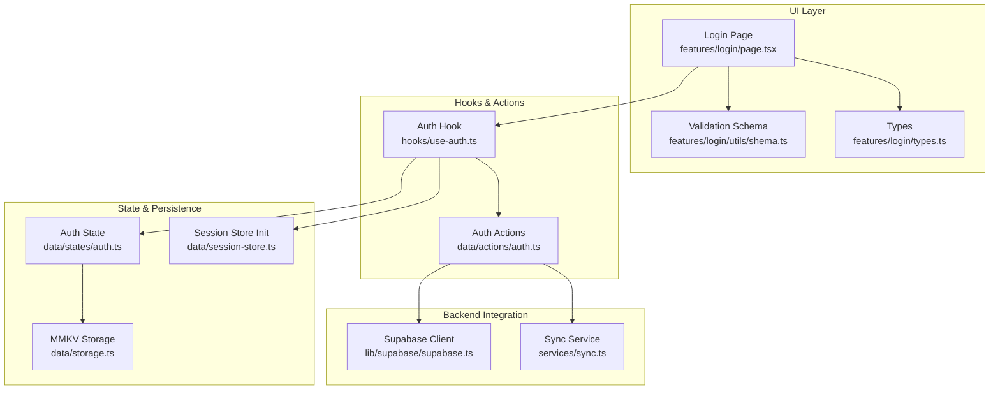
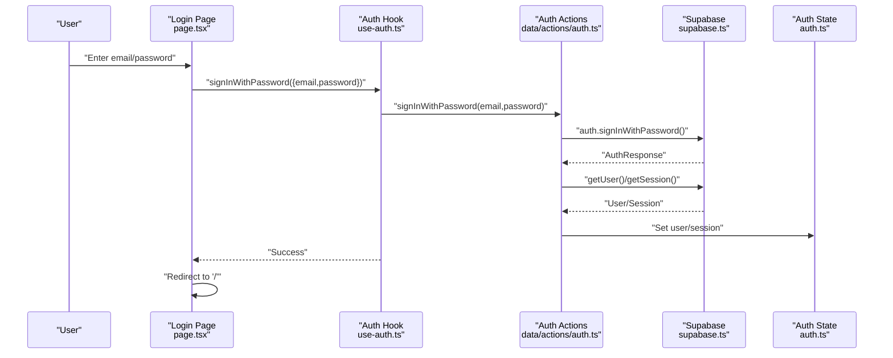
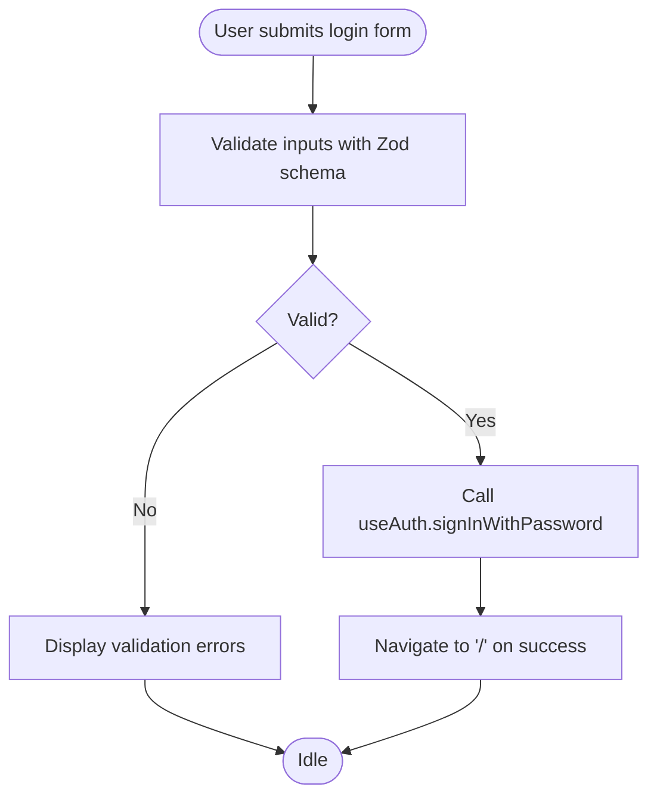
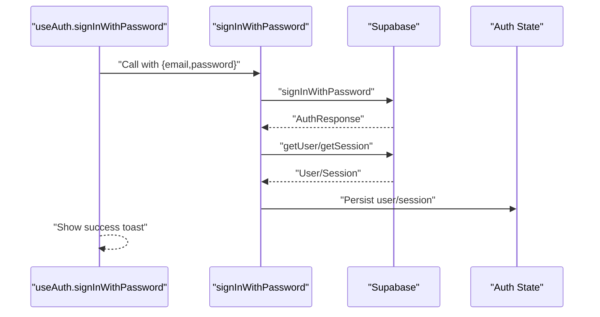
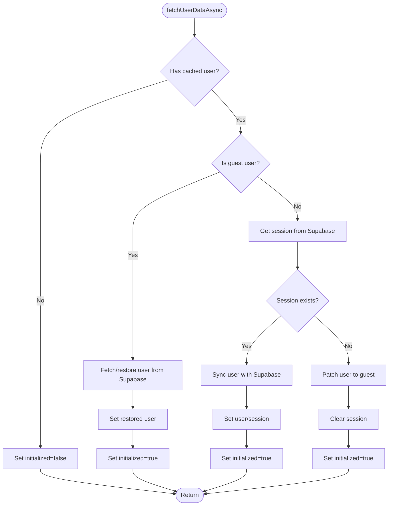
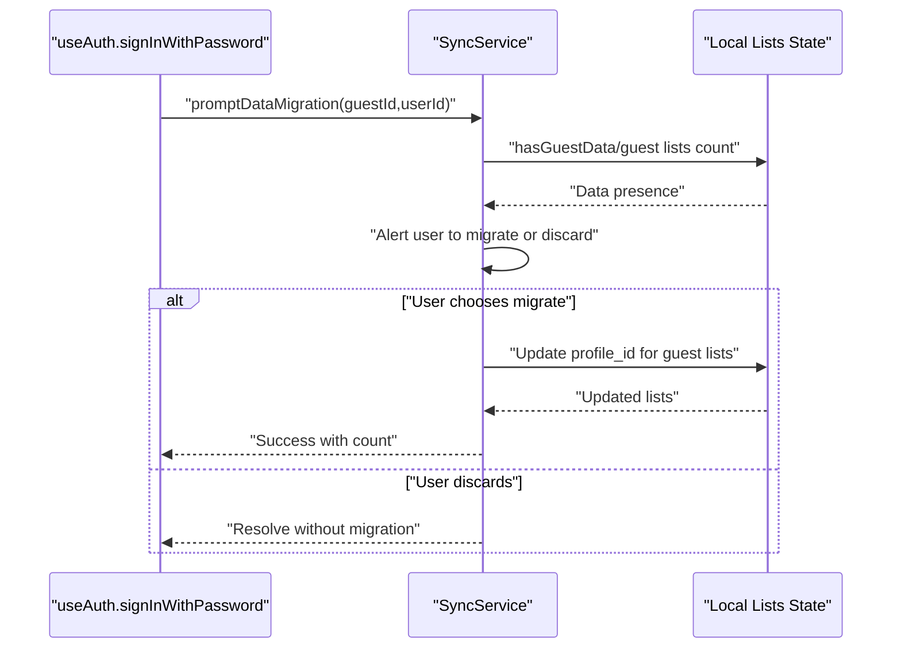
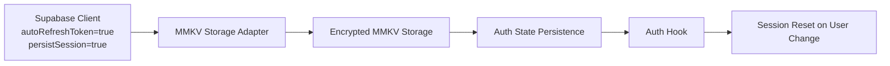
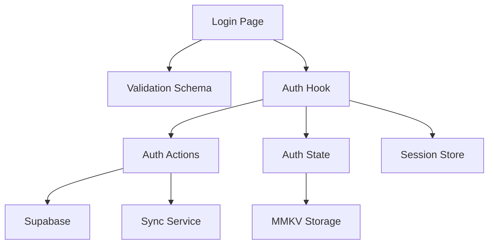

# Login System

<cite>
**Referenced Files in This Document**
- [src/app/login.tsx](file://src/app/login.tsx)
- [src/features/login/page.tsx](file://src/features/login/page.tsx)
- [src/features/login/utils/shema.ts](file://src/features/login/utils/shema.ts)
- [src/features/login/types.ts](file://src/features/login/types.ts)
- [src/hooks/use-auth.ts](file://src/hooks/use-auth.ts)
- [src/data/actions/auth.ts](file://src/data/actions/auth.ts)
- [src/data/states/auth.ts](file://src/data/states/auth.ts)
- [src/data/types/user.ts](file://src/data/types/user.ts)
- [src/data/session-store.ts](file://src/data/session-store.ts)
- [src/data/storage.ts](file://src/data/storage.ts)
- [src/lib/supabase/supabase.ts](file://src/lib/supabase/supabase.ts)
- [src/services/sync.ts](file://src/services/sync.ts)
</cite>

## Table of Contents
1. [Introduction](#introduction)
2. [Project Structure](#project-structure)
3. [Core Components](#core-components)
4. [Architecture Overview](#architecture-overview)
5. [Detailed Component Analysis](#detailed-component-analysis)
6. [Dependency Analysis](#dependency-analysis)
7. [Performance Considerations](#performance-considerations)
8. [Troubleshooting Guide](#troubleshooting-guide)
9. [Conclusion](#conclusion)

## Introduction
This document explains the login system functionality in PowerLists. It covers the authentication flow from the login page through form validation, credential verification, session establishment, and user session restoration. It also documents error handling for invalid credentials, guest user session handling, automatic redirection after successful login, security measures, session persistence, and edge cases such as expired sessions or invalid tokens.

## Project Structure
The login system spans UI pages, form validation, authentication hooks, and backend integration via Supabase. Key areas include:
- Login page and form rendering
- Form validation schema and types
- Authentication hook orchestrating login actions
- Backend actions for user authentication and session sync
- State management with persistent storage
- Supabase client configuration with MMKV-backed persistence
- Guest-to-user data migration service
- Session store initialization and cleanup

**Diagram sources**
- [src/features/login/page.tsx:1-172](file://src/features/login/page.tsx#L1-L172)
- [src/features/login/utils/shema.ts:1-9](file://src/features/login/utils/shema.ts#L1-L9)
- [src/features/login/types.ts:1-5](file://src/features/login/types.ts#L1-L5)
- [src/hooks/use-auth.ts:1-261](file://src/hooks/use-auth.ts#L1-L261)
- [src/data/actions/auth.ts:1-138](file://src/data/actions/auth.ts#L1-L138)
- [src/data/states/auth.ts:1-34](file://src/data/states/auth.ts#L1-L34)
- [src/data/session-store.ts:1-24](file://src/data/session-store.ts#L1-L24)
- [src/data/storage.ts:1-74](file://src/data/storage.ts#L1-L74)
- [src/lib/supabase/supabase.ts:1-29](file://src/lib/supabase/supabase.ts#L1-L29)
- [src/services/sync.ts:1-203](file://src/services/sync.ts#L1-L203)

**Section sources**
- [src/app/login.tsx:1-2](file://src/app/login.tsx#L1-L2)
- [src/features/login/page.tsx:1-172](file://src/features/login/page.tsx#L1-L172)
- [src/features/login/utils/shema.ts:1-9](file://src/features/login/utils/shema.ts#L1-L9)
- [src/features/login/types.ts:1-5](file://src/features/login/types.ts#L1-L5)
- [src/hooks/use-auth.ts:1-261](file://src/hooks/use-auth.ts#L1-L261)
- [src/data/actions/auth.ts:1-138](file://src/data/actions/auth.ts#L1-L138)
- [src/data/states/auth.ts:1-34](file://src/data/states/auth.ts#L1-L34)
- [src/data/session-store.ts:1-24](file://src/data/session-store.ts#L1-L24)
- [src/data/storage.ts:1-74](file://src/data/storage.ts#L1-L74)
- [src/lib/supabase/supabase.ts:1-29](file://src/lib/supabase/supabase.ts#L1-L29)
- [src/services/sync.ts:1-203](file://src/services/sync.ts#L1-L203)

## Core Components
- Login Page: Renders the login form, handles submission, and redirects on success.
- Validation Schema: Enforces email format and minimum password length.
- Auth Hook: Centralizes authentication logic, manages loading states, and coordinates with Supabase.
- Auth Actions: Performs sign-in, user sync, guest creation, and sign-out.
- State Management: Persistent user/session state with MMKV-backed storage.
- Supabase Client: Configured with auto-refresh, token persistence, and MMKV storage adapter.
- Session Store: Resets application stores when the user changes.
- Sync Service: Handles migration of guest data to authenticated users.

**Section sources**
- [src/features/login/page.tsx:21-53](file://src/features/login/page.tsx#L21-L53)
- [src/features/login/utils/shema.ts:3-8](file://src/features/login/utils/shema.ts#L3-L8)
- [src/hooks/use-auth.ts:76-121](file://src/hooks/use-auth.ts#L76-L121)
- [src/data/actions/auth.ts:99-110](file://src/data/actions/auth.ts#L99-L110)
- [src/data/states/auth.ts:22-33](file://src/data/states/auth.ts#L22-L33)
- [src/lib/supabase/supabase.ts:21-28](file://src/lib/supabase/supabase.ts#L21-L28)
- [src/data/session-store.ts:10-23](file://src/data/session-store.ts#L10-L23)
- [src/services/sync.ts:102-150](file://src/services/sync.ts#L102-L150)

## Architecture Overview
The login system follows a layered architecture:
- UI layer renders the login form and delegates submission to the auth hook.
- Validation ensures input correctness before invoking authentication actions.
- The auth hook calls backend actions that integrate with Supabase for authentication and session retrieval.
- State management persists user and session data locally and synchronizes with Supabase.
- Edge cases like expired sessions or invalid tokens are handled gracefully with user feedback.

**Diagram sources**
- [src/features/login/page.tsx:39-44](file://src/features/login/page.tsx#L39-L44)
- [src/hooks/use-auth.ts:76-121](file://src/hooks/use-auth.ts#L76-L121)
- [src/data/actions/auth.ts:99-110](file://src/data/actions/auth.ts#L99-L110)
- [src/lib/supabase/supabase.ts:21-28](file://src/lib/supabase/supabase.ts#L21-L28)
- [src/data/states/auth.ts:22-33](file://src/data/states/auth.ts#L22-L33)

## Detailed Component Analysis

### Login Page and Form Handling
- The login page uses a form library to manage fields and validation.
- Email and password are validated against the schema before submission.
- On submit, the auth hook performs sign-in and redirects to the home route upon success.
- Password visibility toggling is supported via a button.
- Navigation to password recovery and account creation is integrated.

**Diagram sources**
- [src/features/login/page.tsx:27-44](file://src/features/login/page.tsx#L27-L44)
- [src/features/login/utils/shema.ts:3-8](file://src/features/login/utils/shema.ts#L3-L8)

**Section sources**
- [src/features/login/page.tsx:21-172](file://src/features/login/page.tsx#L21-L172)
- [src/features/login/utils/shema.ts:1-9](file://src/features/login/utils/shema.ts#L1-L9)
- [src/features/login/types.ts:1-5](file://src/features/login/types.ts#L1-L5)

### Authentication Actions and Session Establishment
- The sign-in action validates inputs, calls Supabase to authenticate, and synchronizes the user with local state.
- Session retrieval ensures the session is captured after successful authentication.
- Loading states are managed during asynchronous operations.
- Errors are normalized and surfaced to the user via toasts.

**Diagram sources**
- [src/hooks/use-auth.ts:76-121](file://src/hooks/use-auth.ts#L76-L121)
- [src/data/actions/auth.ts:99-110](file://src/data/actions/auth.ts#L99-L110)
- [src/lib/supabase/supabase.ts:21-28](file://src/lib/supabase/supabase.ts#L21-L28)
- [src/data/states/auth.ts:22-33](file://src/data/states/auth.ts#L22-L33)

**Section sources**
- [src/data/actions/auth.ts:99-110](file://src/data/actions/auth.ts#L99-L110)
- [src/hooks/use-auth.ts:76-121](file://src/hooks/use-auth.ts#L76-L121)

### User Session Restoration and Edge Cases
- The auth hook restores sessions by checking Supabase sessions and syncing user data.
- If no session exists, the current user is downgraded to a guest user locally.
- Errors during restoration lead to clean state initialization and user feedback.
- Expired sessions or invalid tokens are handled by resetting the user to guest mode.

**Diagram sources**
- [src/hooks/use-auth.ts:29-74](file://src/hooks/use-auth.ts#L29-L74)
- [src/data/actions/auth.ts:16-30](file://src/data/actions/auth.ts#L16-L30)

**Section sources**
- [src/hooks/use-auth.ts:29-74](file://src/hooks/use-auth.ts#L29-L74)
- [src/data/actions/auth.ts:16-30](file://src/data/actions/auth.ts#L16-L30)

### Guest User Handling and Data Migration
- Guest users are represented with a special flag and are downgraded if no session is found.
- When a guest authenticates, the system prompts to migrate local data to the authenticated user.
- The migration service checks for existing lists and updates ownership, providing user feedback.

**Diagram sources**
- [src/hooks/use-auth.ts:97-103](file://src/hooks/use-auth.ts#L97-L103)
- [src/services/sync.ts:102-150](file://src/services/sync.ts#L102-L150)
- [src/data/session-store.ts:10-23](file://src/data/session-store.ts#L10-L23)

**Section sources**
- [src/data/types/user.ts:5-13](file://src/data/types/user.ts#L5-L13)
- [src/hooks/use-auth.ts:97-103](file://src/hooks/use-auth.ts#L97-L103)
- [src/services/sync.ts:102-150](file://src/services/sync.ts#L102-L150)

### Security Measures and Session Persistence
- Supabase client is configured with auto-refresh tokens, persistent sessions, and MMKV-backed storage.
- Local storage encryption is enabled via an encryption key when provided.
- Session store resets application data when the user changes, preventing stale data leakage.
- Sign-out clears Supabase session, local user state, and all persisted storage.

**Diagram sources**
- [src/lib/supabase/supabase.ts:21-28](file://src/lib/supabase/supabase.ts#L21-L28)
- [src/data/storage.ts:15-23](file://src/data/storage.ts#L15-L23)
- [src/data/states/auth.ts:22-33](file://src/data/states/auth.ts#L22-L33)
- [src/data/session-store.ts:10-23](file://src/data/session-store.ts#L10-L23)

**Section sources**
- [src/lib/supabase/supabase.ts:21-28](file://src/lib/supabase/supabase.ts#L21-L28)
- [src/data/storage.ts:1-74](file://src/data/storage.ts#L1-L74)
- [src/data/states/auth.ts:22-33](file://src/data/states/auth.ts#L22-L33)
- [src/data/session-store.ts:10-23](file://src/data/session-store.ts#L10-L23)

## Dependency Analysis
The login system exhibits clear separation of concerns:
- UI depends on validation schema and the auth hook.
- Auth hook depends on auth actions and state management.
- Auth actions depend on Supabase for authentication and session retrieval.
- State management integrates with MMKV for persistence.
- Session store reacts to user changes to reset application data.

**Diagram sources**
- [src/features/login/page.tsx:1-172](file://src/features/login/page.tsx#L1-L172)
- [src/features/login/utils/shema.ts:1-9](file://src/features/login/utils/shema.ts#L1-L9)
- [src/hooks/use-auth.ts:1-261](file://src/hooks/use-auth.ts#L1-L261)
- [src/data/actions/auth.ts:1-138](file://src/data/actions/auth.ts#L1-L138)
- [src/data/states/auth.ts:1-34](file://src/data/states/auth.ts#L1-L34)
- [src/data/storage.ts:1-74](file://src/data/storage.ts#L1-L74)
- [src/data/session-store.ts:1-24](file://src/data/session-store.ts#L1-L24)
- [src/services/sync.ts:1-203](file://src/services/sync.ts#L1-L203)

**Section sources**
- [src/features/login/page.tsx:1-172](file://src/features/login/page.tsx#L1-L172)
- [src/features/login/utils/shema.ts:1-9](file://src/features/login/utils/shema.ts#L1-L9)
- [src/hooks/use-auth.ts:1-261](file://src/hooks/use-auth.ts#L1-L261)
- [src/data/actions/auth.ts:1-138](file://src/data/actions/auth.ts#L1-L138)
- [src/data/states/auth.ts:1-34](file://src/data/states/auth.ts#L1-L34)
- [src/data/storage.ts:1-74](file://src/data/storage.ts#L1-L74)
- [src/data/session-store.ts:1-24](file://src/data/session-store.ts#L1-L24)
- [src/services/sync.ts:1-203](file://src/services/sync.ts#L1-L203)

## Performance Considerations
- Minimize re-renders by leveraging controlled form fields and avoiding unnecessary state updates.
- Debounce or throttle network requests where applicable to reduce redundant calls.
- Persist user and session data locally to avoid repeated network calls on app restart.
- Keep validation lightweight and synchronous to maintain responsive UI.

## Troubleshooting Guide
Common issues and resolutions:
- Invalid credentials: The auth hook normalizes errors and displays a user-friendly message. Verify email format and password length.
- Network failures: Ensure environment variables for Supabase are set and the device has connectivity.
- Session restoration errors: The auth hook gracefully initializes state if session retrieval fails.
- Guest session downgrade: If no session exists, the user is downgraded to guest locally; this is expected behavior.
- Sign-out problems: The sign-out action clears Supabase session, local state, and storage; confirm all steps complete.

**Section sources**
- [src/hooks/use-auth.ts:111-120](file://src/hooks/use-auth.ts#L111-L120)
- [src/hooks/use-auth.ts:163-183](file://src/hooks/use-auth.ts#L163-L183)
- [src/hooks/use-auth.ts:25-27](file://src/hooks/use-auth.ts#L25-L27)
- [src/data/actions/auth.ts:127-133](file://src/data/actions/auth.ts#L127-L133)

## Conclusion
The login system integrates a robust UI layer with strong validation, centralized authentication logic, and persistent state management backed by Supabase and MMKV. It supports guest-to-user migration, handles edge cases like expired sessions, and provides clear user feedback through toasts. The architecture promotes maintainability and scalability while ensuring security and reliability.