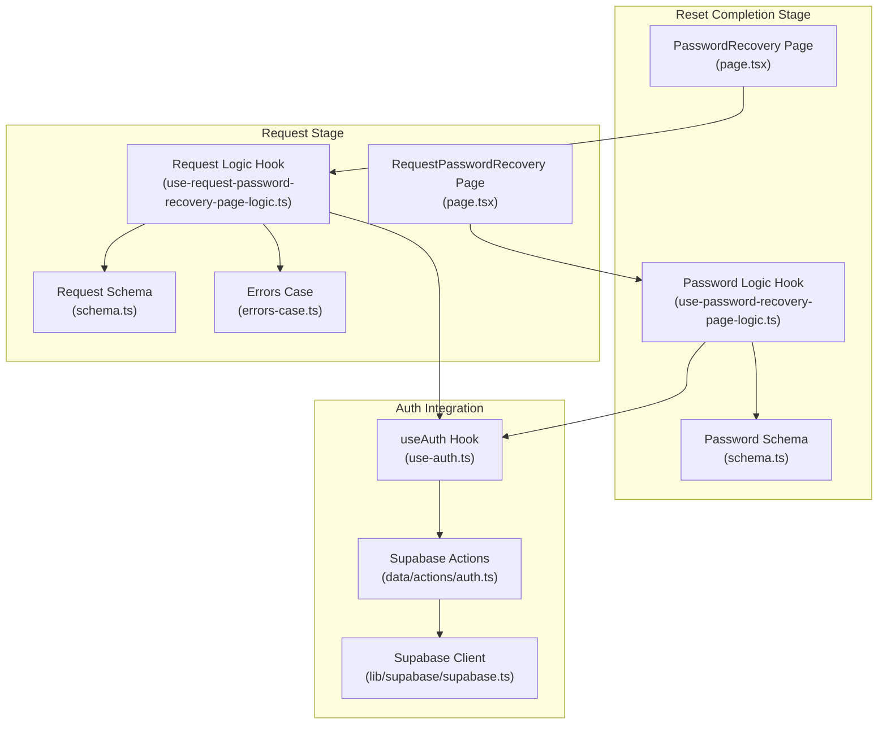
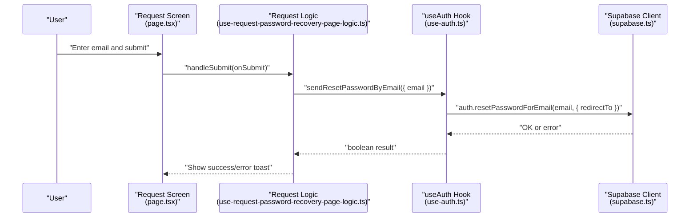
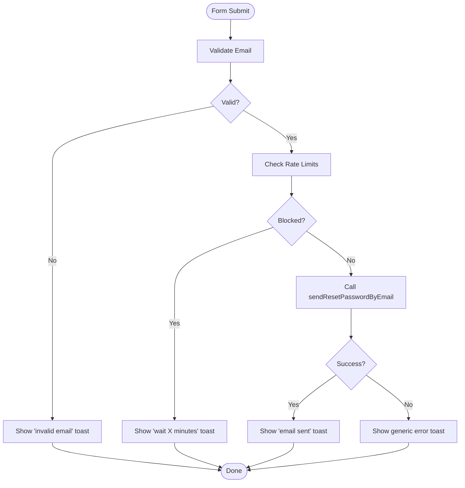
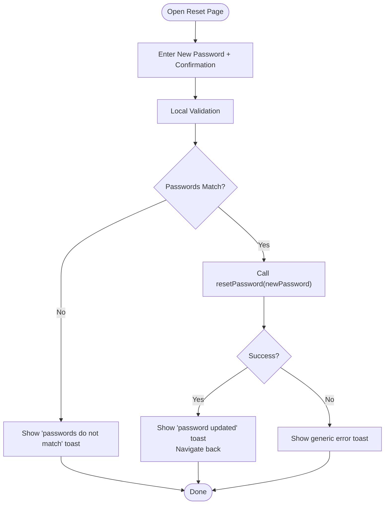
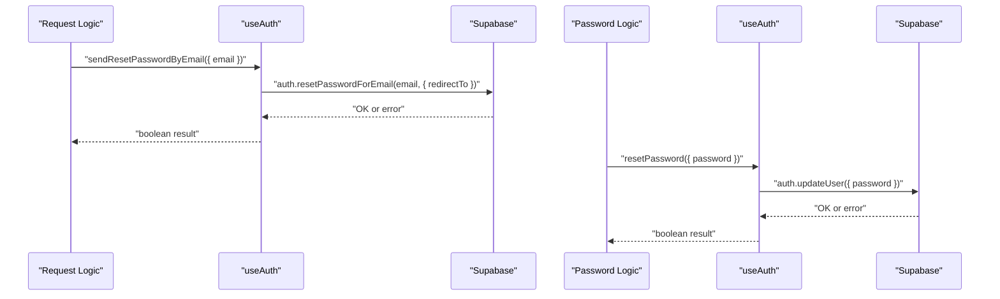
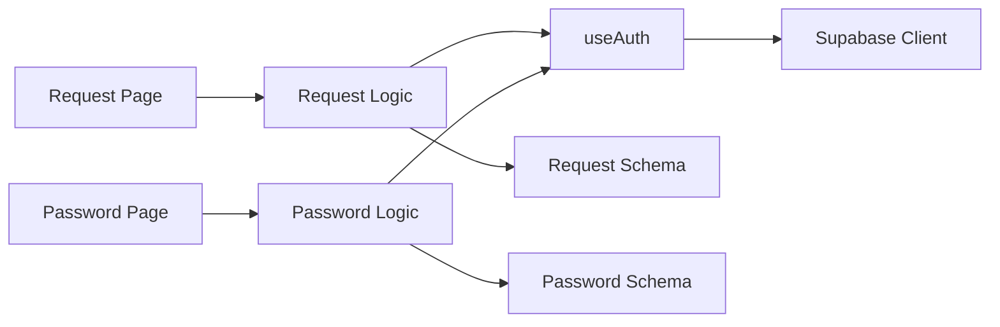

# Password Recovery

<cite>
**Referenced Files in This Document**
- [src/app/request-password-recovery.tsx](file://src/app/request-password-recovery.tsx)
- [src/app/password-recovery.tsx](file://src/app/password-recovery.tsx)
- [src/features/request-password-recovery/page.tsx](file://src/features/request-password-recovery/page.tsx)
- [src/features/request-password-recovery/hooks/use-request-password-recovery-page-logic.ts](file://src/features/request-password-recovery/hooks/use-request-password-recovery-page-logic.ts)
- [src/features/request-password-recovery/utils/schema.ts](file://src/features/request-password-recovery/utils/schema.ts)
- [src/features/request-password-recovery/utils/errors-case.ts](file://src/features/request-password-recovery/utils/errors-case.ts)
- [src/features/password-recovery/page.tsx](file://src/features/password-recovery/page.tsx)
- [src/features/password-recovery/hooks/use-password-recovery-page-logic.ts](file://src/features/password-recovery/hooks/use-password-recovery-page-logic.ts)
- [src/features/password-recovery/utils/schema.ts](file://src/features/password-recovery/utils/schema.ts)
- [src/hooks/use-auth.ts](file://src/hooks/use-auth.ts)
- [src/lib/supabase/supabase.ts](file://src/lib/supabase/supabase.ts)
- [src/data/actions/auth.ts](file://src/data/actions/auth.ts)
</cite>

## Table of Contents
1. [Introduction](#introduction)
2. [Project Structure](#project-structure)
3. [Core Components](#core-components)
4. [Architecture Overview](#architecture-overview)
5. [Detailed Component Analysis](#detailed-component-analysis)
6. [Dependency Analysis](#dependency-analysis)
7. [Performance Considerations](#performance-considerations)
8. [Troubleshooting Guide](#troubleshooting-guide)
9. [Conclusion](#conclusion)

## Introduction
This document explains the password recovery system in the application. It covers the two-stage process:
- Stage 1: Requesting a password reset via email
- Stage 2: Completing the reset by setting a new password

It documents email validation, secure reset token handling, password strength requirements, error handling, Supabase authentication integration, redirect URL configuration, and security considerations for password reset links.

## Project Structure
The password recovery feature is organized into pages, hooks, forms, and shared authentication utilities:
- Request stage page and logic
- Reset completion page and logic
- Zod schemas for validation
- Shared authentication hooks and Supabase integration
- Supabase client configuration

**Diagram sources**
- [src/features/request-password-recovery/page.tsx:13-100](file://src/features/request-password-recovery/page.tsx#L13-L100)
- [src/features/request-password-recovery/hooks/use-request-password-recovery-page-logic.ts:18-87](file://src/features/request-password-recovery/hooks/use-request-password-recovery-page-logic.ts#L18-L87)
- [src/features/request-password-recovery/utils/schema.ts:1-6](file://src/features/request-password-recovery/utils/schema.ts#L1-L6)
- [src/features/request-password-recovery/utils/errors-case.ts:1-43](file://src/features/request-password-recovery/utils/errors-case.ts#L1-L43)
- [src/features/password-recovery/page.tsx:14-138](file://src/features/password-recovery/page.tsx#L14-L138)
- [src/features/password-recovery/hooks/use-password-recovery-page-logic.ts:9-54](file://src/features/password-recovery/hooks/use-password-recovery-page-logic.ts#L9-L54)
- [src/features/password-recovery/utils/schema.ts:1-18](file://src/features/password-recovery/utils/schema.ts#L1-L18)
- [src/hooks/use-auth.ts:185-229](file://src/hooks/use-auth.ts#L185-L229)
- [src/data/actions/auth.ts:1-138](file://src/data/actions/auth.ts#L1-L138)
- [src/lib/supabase/supabase.ts:1-29](file://src/lib/supabase/supabase.ts#L1-L29)

**Section sources**
- [src/app/request-password-recovery.tsx:1-2](file://src/app/request-password-recovery.tsx#L1-L2)
- [src/app/password-recovery.tsx:1-2](file://src/app/password-recovery.tsx#L1-L2)
- [src/features/request-password-recovery/page.tsx:1-101](file://src/features/request-password-recovery/page.tsx#L1-L101)
- [src/features/request-password-recovery/hooks/use-request-password-recovery-page-logic.ts:1-88](file://src/features/request-password-recovery/hooks/use-request-password-recovery-page-logic.ts#L1-L88)
- [src/features/request-password-recovery/utils/schema.ts:1-6](file://src/features/request-password-recovery/utils/schema.ts#L1-L6)
- [src/features/request-password-recovery/utils/errors-case.ts:1-43](file://src/features/request-password-recovery/utils/errors-case.ts#L1-L43)
- [src/features/password-recovery/page.tsx:1-139](file://src/features/password-recovery/page.tsx#L1-L139)
- [src/features/password-recovery/hooks/use-password-recovery-page-logic.ts:1-55](file://src/features/password-recovery/hooks/use-password-recovery-page-logic.ts#L1-L55)
- [src/features/password-recovery/utils/schema.ts:1-18](file://src/features/password-recovery/utils/schema.ts#L1-L18)
- [src/hooks/use-auth.ts:185-229](file://src/hooks/use-auth.ts#L185-L229)
- [src/lib/supabase/supabase.ts:1-29](file://src/lib/supabase/supabase.ts#L1-L29)
- [src/data/actions/auth.ts:1-138](file://src/data/actions/auth.ts#L1-L138)

## Core Components
- RequestPasswordRecoveryScreen: Renders the email input screen, handles submission, rate limiting, and displays feedback.
- PasswordRecoveryScreen: Renders the new password and confirmation inputs, validates locally, and submits to Supabase.
- useAuth: Provides resetPassword and sendResetPasswordByEmail backed by Supabase.
- Supabase client: Configured with persistent auth storage and URL polyfill.
- Validation schemas: Zod-based validation for email and new password requirements.

Key responsibilities:
- Email validation and rate limiting before sending reset emails.
- Secure handling of reset tokens via Supabase’s redirect-based flow.
- Local password strength and confirmation checks before submission.
- Error messaging mapped to user-friendly toasts.

**Section sources**
- [src/features/request-password-recovery/page.tsx:13-100](file://src/features/request-password-recovery/page.tsx#L13-L100)
- [src/features/request-password-recovery/hooks/use-request-password-recovery-page-logic.ts:18-87](file://src/features/request-password-recovery/hooks/use-request-password-recovery-page-logic.ts#L18-L87)
- [src/features/request-password-recovery/utils/schema.ts:1-6](file://src/features/request-password-recovery/utils/schema.ts#L1-L6)
- [src/features/request-password-recovery/utils/errors-case.ts:1-43](file://src/features/request-password-recovery/utils/errors-case.ts#L1-L43)
- [src/features/password-recovery/page.tsx:14-138](file://src/features/password-recovery/page.tsx#L14-L138)
- [src/features/password-recovery/hooks/use-password-recovery-page-logic.ts:9-54](file://src/features/password-recovery/hooks/use-password-recovery-page-logic.ts#L9-L54)
- [src/features/password-recovery/utils/schema.ts:1-18](file://src/features/password-recovery/utils/schema.ts#L1-L18)
- [src/hooks/use-auth.ts:185-229](file://src/hooks/use-auth.ts#L185-L229)
- [src/lib/supabase/supabase.ts:1-29](file://src/lib/supabase/supabase.ts#L1-L29)

## Architecture Overview
The system integrates UI screens with a shared authentication hook that delegates to Supabase. The reset flow uses Supabase’s built-in email-based reset with a redirect to the app.

**Diagram sources**
- [src/features/request-password-recovery/page.tsx:13-100](file://src/features/request-password-recovery/page.tsx#L13-L100)
- [src/features/request-password-recovery/hooks/use-request-password-recovery-page-logic.ts:43-75](file://src/features/request-password-recovery/hooks/use-request-password-recovery-page-logic.ts#L43-L75)
- [src/hooks/use-auth.ts:185-208](file://src/hooks/use-auth.ts#L185-L208)
- [src/lib/supabase/supabase.ts:21-28](file://src/lib/supabase/supabase.ts#L21-L28)

## Detailed Component Analysis

### Request Password Recovery: Email Submission
- Purpose: Accepts user email, validates, enforces rate limits, and triggers Supabase reset email.
- Validation:
  - Email must be a valid format.
  - Rate limiting:
    - One email per minute per address.
    - Maximum five successful resets per hour per address.
- Redirect URL:
  - Uses Expo Linking to construct a deep link to the password recovery route.
- Error handling:
  - Maps domain-specific errors to user-facing toasts.

**Diagram sources**
- [src/features/request-password-recovery/hooks/use-request-password-recovery-page-logic.ts:43-75](file://src/features/request-password-recovery/hooks/use-request-password-recovery-page-logic.ts#L43-L75)
- [src/features/request-password-recovery/utils/errors-case.ts:3-42](file://src/features/request-password-recovery/utils/errors-case.ts#L3-L42)
- [src/features/request-password-recovery/utils/schema.ts:1-6](file://src/features/request-password-recovery/utils/schema.ts#L1-L6)

**Section sources**
- [src/features/request-password-recovery/page.tsx:13-100](file://src/features/request-password-recovery/page.tsx#L13-L100)
- [src/features/request-password-recovery/hooks/use-request-password-recovery-page-logic.ts:18-87](file://src/features/request-password-recovery/hooks/use-request-password-recovery-page-logic.ts#L18-L87)
- [src/features/request-password-recovery/utils/schema.ts:1-6](file://src/features/request-password-recovery/utils/schema.ts#L1-L6)
- [src/features/request-password-recovery/utils/errors-case.ts:1-43](file://src/features/request-password-recovery/utils/errors-case.ts#L1-L43)

### Password Recovery: New Password Setting
- Purpose: Accepts new password and confirmation, validates locally, and updates the user’s password via Supabase.
- Validation:
  - Minimum length requirement for the new password.
  - Confirmation must match the new password.
- Submission:
  - Calls resetPassword with the new password.
  - On success, navigates back to the previous screen.

**Diagram sources**
- [src/features/password-recovery/hooks/use-password-recovery-page-logic.ts:28-41](file://src/features/password-recovery/hooks/use-password-recovery-page-logic.ts#L28-L41)
- [src/features/password-recovery/utils/schema.ts:5-17](file://src/features/password-recovery/utils/schema.ts#L5-L17)

**Section sources**
- [src/features/password-recovery/page.tsx:14-138](file://src/features/password-recovery/page.tsx#L14-L138)
- [src/features/password-recovery/hooks/use-password-recovery-page-logic.ts:9-54](file://src/features/password-recovery/hooks/use-password-recovery-page-logic.ts#L9-L54)
- [src/features/password-recovery/utils/schema.ts:1-18](file://src/features/password-recovery/utils/schema.ts#L1-L18)

### Authentication Integration with Supabase
- sendResetPasswordByEmail:
  - Constructs a redirect URL pointing to the app’s password recovery route.
  - Invokes Supabase to send a reset email with the redirect.
- resetPassword:
  - Updates the user’s password after they open the reset link and set a new password.
- Supabase client:
  - Configured with persistent auth session storage and token refresh.

**Diagram sources**
- [src/hooks/use-auth.ts:185-229](file://src/hooks/use-auth.ts#L185-L229)
- [src/lib/supabase/supabase.ts:21-28](file://src/lib/supabase/supabase.ts#L21-L28)

**Section sources**
- [src/hooks/use-auth.ts:185-229](file://src/hooks/use-auth.ts#L185-L229)
- [src/lib/supabase/supabase.ts:1-29](file://src/lib/supabase/supabase.ts#L1-L29)

## Dependency Analysis
- UI pages depend on their respective hooks for form state and submission.
- Hooks depend on useAuth for Supabase operations.
- useAuth depends on Supabase client and exposes wrappers around Supabase auth APIs.
- Validation schemas are consumed by the hooks to drive form validation.

**Diagram sources**
- [src/features/request-password-recovery/page.tsx:13-100](file://src/features/request-password-recovery/page.tsx#L13-L100)
- [src/features/request-password-recovery/hooks/use-request-password-recovery-page-logic.ts:18-87](file://src/features/request-password-recovery/hooks/use-request-password-recovery-page-logic.ts#L18-L87)
- [src/features/request-password-recovery/utils/schema.ts:1-6](file://src/features/request-password-recovery/utils/schema.ts#L1-L6)
- [src/features/password-recovery/page.tsx:14-138](file://src/features/password-recovery/page.tsx#L14-L138)
- [src/features/password-recovery/hooks/use-password-recovery-page-logic.ts:9-54](file://src/features/password-recovery/hooks/use-password-recovery-page-logic.ts#L9-L54)
- [src/features/password-recovery/utils/schema.ts:1-18](file://src/features/password-recovery/utils/schema.ts#L1-L18)
- [src/hooks/use-auth.ts:185-229](file://src/hooks/use-auth.ts#L185-L229)
- [src/lib/supabase/supabase.ts:1-29](file://src/lib/supabase/supabase.ts#L1-L29)

**Section sources**
- [src/features/request-password-recovery/page.tsx:13-100](file://src/features/request-password-recovery/page.tsx#L13-L100)
- [src/features/request-password-recovery/hooks/use-request-password-recovery-page-logic.ts:18-87](file://src/features/request-password-recovery/hooks/use-request-password-recovery-page-logic.ts#L18-L87)
- [src/features/request-password-recovery/utils/schema.ts:1-6](file://src/features/request-password-recovery/utils/schema.ts#L1-L6)
- [src/features/password-recovery/page.tsx:14-138](file://src/features/password-recovery/page.tsx#L14-L138)
- [src/features/password-recovery/hooks/use-password-recovery-page-logic.ts:9-54](file://src/features/password-recovery/hooks/use-password-recovery-page-logic.ts#L9-L54)
- [src/features/password-recovery/utils/schema.ts:1-18](file://src/features/password-recovery/utils/schema.ts#L1-L18)
- [src/hooks/use-auth.ts:185-229](file://src/hooks/use-auth.ts#L185-L229)
- [src/lib/supabase/supabase.ts:1-29](file://src/lib/supabase/supabase.ts#L1-L29)

## Performance Considerations
- Minimize network calls:
  - Validate early on the client to avoid unnecessary Supabase calls.
- UI responsiveness:
  - Keep loading states visible during async operations to prevent repeated submissions.
- Storage:
  - Supabase auth persistence is configured; ensure minimal redundant session checks.

## Troubleshooting Guide
Common failure scenarios and handling:
- Invalid email format:
  - Triggered by schema validation; shows a user-facing toast indicating invalid email.
- Too many requests:
  - One email per minute and five per hour enforced; shows toasts prompting the user to wait.
- Email not found:
  - Supabase returns an error; mapped to a toast informing the user to enter a valid email.
- Generic errors:
  - Catch-all toasts prompt retry later.
- Password mismatch:
  - Local validation prevents submission; shows a toast indicating mismatch.
- Weak password:
  - Local minimum length check; adjust schema if stricter requirements are needed.
- Reset failure:
  - Supabase update error; shows a toast prompting retry.

Operational tips:
- Verify environment variables for Supabase URL and anon key are present.
- Confirm the redirect URL resolves to the app’s password recovery route.
- Ensure persistent auth storage is functioning to maintain session state.

**Section sources**
- [src/features/request-password-recovery/utils/errors-case.ts:3-42](file://src/features/request-password-recovery/utils/errors-case.ts#L3-L42)
- [src/features/request-password-recovery/hooks/use-request-password-recovery-page-logic.ts:43-75](file://src/features/request-password-recovery/hooks/use-request-password-recovery-page-logic.ts#L43-L75)
- [src/features/password-recovery/hooks/use-password-recovery-page-logic.ts:28-41](file://src/features/password-recovery/hooks/use-password-recovery-page-logic.ts#L28-L41)
- [src/hooks/use-auth.ts:185-229](file://src/hooks/use-auth.ts#L185-L229)
- [src/lib/supabase/supabase.ts:6-28](file://src/lib/supabase/supabase.ts#L6-L28)

## Conclusion
The password recovery system combines client-side validation, rate limiting, and Supabase’s secure reset flow. Users request a reset email, receive a link that redirects into the app, and set a new password with local validation. The design emphasizes user feedback, safety via rate limits, and robust error handling.