# Session Management

<cite>
**Referenced Files in This Document**
- [src/lib/supabase/supabase.ts](file://src/lib/supabase/supabase.ts)
- [src/data/states/auth.ts](file://src/data/states/auth.ts)
- [src/data/session-store.ts](file://src/data/session-store.ts)
- [src/hooks/use-auth.ts](file://src/hooks/use-auth.ts)
- [src/hooks/use-user.ts](file://src/hooks/use-user.ts)
- [src/data/actions/auth.ts](file://src/data/actions/auth.ts)
- [src/data/storage.ts](file://src/data/storage.ts)
- [src/services/sync.ts](file://src/services/sync.ts)
- [src/app/_layout.tsx](file://src/app/_layout.tsx)
- [src/data/types/user.ts](file://src/data/types/user.ts)
- [src/data/types/auth.ts](file://src/data/types/auth.ts)
</cite>

## Table of Contents
1. [Introduction](#introduction)
2. [Project Structure](#project-structure)
3. [Core Components](#core-components)
4. [Architecture Overview](#architecture-overview)
5. [Detailed Component Analysis](#detailed-component-analysis)
6. [Dependency Analysis](#dependency-analysis)
7. [Performance Considerations](#performance-considerations)
8. [Troubleshooting Guide](#troubleshooting-guide)
9. [Conclusion](#conclusion)

## Introduction
This document describes the session management system used by the application. It covers the lifecycle of user sessions from initialization to cleanup, including automatic session checking, restoration on app startup, and handling of expired or invalid sessions. It also explains how reactive state management integrates with session persistence and Supabase authentication state, and documents the session store implementation, token management, and cleanup procedures during sign-out.

## Project Structure
The session management system spans several layers:
- Supabase client configuration with MMKV-backed persistence
- Reactive state for authentication and user data
- Hooks orchestrating authentication flows and session checks
- Actions encapsulating authentication operations
- Session store for resetting domain stores upon user changes
- Storage utilities for secure persistence and cleanup

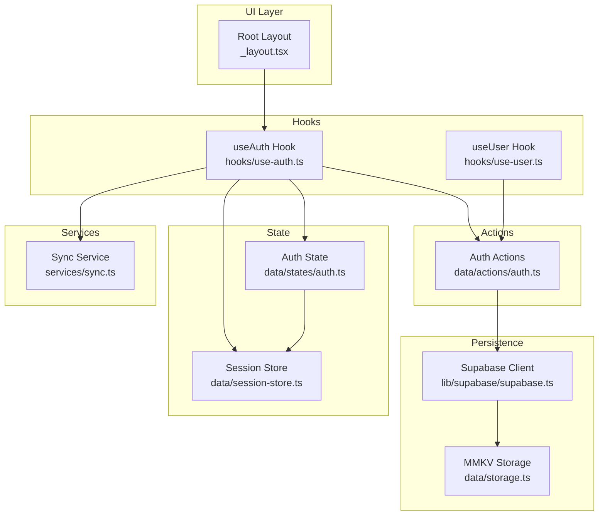

**Diagram sources**
- [src/app/_layout.tsx:17-62](file://src/app/_layout.tsx#L17-L62)
- [src/hooks/use-auth.ts:19-260](file://src/hooks/use-auth.ts#L19-L260)
- [src/hooks/use-user.ts:8-84](file://src/hooks/use-user.ts#L8-L84)
- [src/data/actions/auth.ts:16-137](file://src/data/actions/auth.ts#L16-L137)
- [src/data/states/auth.ts:22-33](file://src/data/states/auth.ts#L22-L33)
- [src/data/session-store.ts:10-23](file://src/data/session-store.ts#L10-L23)
- [src/lib/supabase/supabase.ts:21-28](file://src/lib/supabase/supabase.ts#L21-L28)
- [src/data/storage.ts:15-32](file://src/data/storage.ts#L15-L32)
- [src/services/sync.ts:41-202](file://src/services/sync.ts#L41-L202)

**Section sources**
- [src/app/_layout.tsx:17-62](file://src/app/_layout.tsx#L17-L62)
- [src/lib/supabase/supabase.ts:21-28](file://src/lib/supabase/supabase.ts#L21-L28)
- [src/data/states/auth.ts:22-33](file://src/data/states/auth.ts#L22-L33)
- [src/data/session-store.ts:10-23](file://src/data/session-store.ts#L10-L23)
- [src/hooks/use-auth.ts:19-260](file://src/hooks/use-auth.ts#L19-L260)
- [src/hooks/use-user.ts:8-84](file://src/hooks/use-user.ts#L8-L84)
- [src/data/actions/auth.ts:16-137](file://src/data/actions/auth.ts#L16-L137)
- [src/data/storage.ts:15-32](file://src/data/storage.ts#L15-L32)
- [src/services/sync.ts:41-202](file://src/services/sync.ts#L41-L202)

## Core Components
- Supabase client configured with MMKV-backed storage for session persistence, auto-refresh tokens, and persistent sessions.
- Reactive authentication state with persisted user and session fields.
- Session store that resets domain stores when the user identity changes.
- Authentication hooks that orchestrate session initialization, restoration, validation, sign-in/sign-up, and sign-out.
- User hook for guest creation and user updates.
- Sync service for migrating guest data to authenticated users.
- Storage utilities for secure persistence and bulk cleanup.

**Section sources**
- [src/lib/supabase/supabase.ts:21-28](file://src/lib/supabase/supabase.ts#L21-L28)
- [src/data/states/auth.ts:22-33](file://src/data/states/auth.ts#L22-L33)
- [src/data/session-store.ts:10-23](file://src/data/session-store.ts#L10-L23)
- [src/hooks/use-auth.ts:19-260](file://src/hooks/use-auth.ts#L19-L260)
- [src/hooks/use-user.ts:8-84](file://src/hooks/use-user.ts#L8-L84)
- [src/data/actions/auth.ts:16-137](file://src/data/actions/auth.ts#L16-L137)
- [src/services/sync.ts:41-202](file://src/services/sync.ts#L41-L202)
- [src/data/storage.ts:15-32](file://src/data/storage.ts#L15-L32)

## Architecture Overview
The session lifecycle integrates Supabase authentication with reactive state and persistent storage. Initialization occurs on app startup via the root layout, which triggers user/session restoration. Reactive state tracks user identity and session validity, while the session store ensures domain data is reset when the user changes. Sign-out clears Supabase session state and local storage, and the UI guards protect routes based on authentication state.

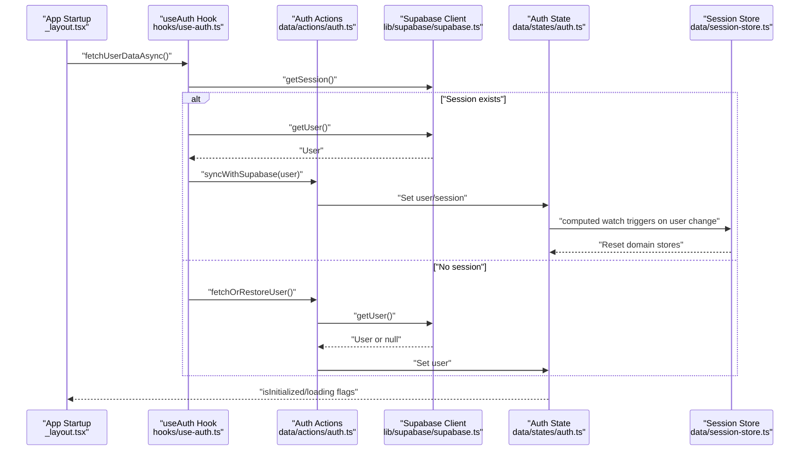

**Diagram sources**
- [src/app/_layout.tsx:20-32](file://src/app/_layout.tsx#L20-L32)
- [src/hooks/use-auth.ts:29-74](file://src/hooks/use-auth.ts#L29-L74)
- [src/data/actions/auth.ts:16-97](file://src/data/actions/auth.ts#L16-L97)
- [src/lib/supabase/supabase.ts:21-28](file://src/lib/supabase/supabase.ts#L21-L28)
- [src/data/states/auth.ts:22-33](file://src/data/states/auth.ts#L22-L33)
- [src/data/session-store.ts:10-23](file://src/data/session-store.ts#L10-L23)

## Detailed Component Analysis

### Supabase Client and Token Persistence
- The Supabase client is configured with an MMKV adapter for auth storage, enabling persistent sessions across app restarts.
- Auto-refresh token and persistent session settings ensure seamless revalidation without manual intervention.
- Environment variables provide the Supabase URL and anonymous key.

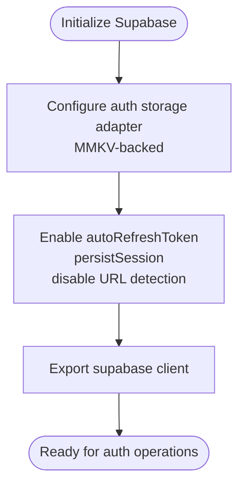

**Diagram sources**
- [src/lib/supabase/supabase.ts:21-28](file://src/lib/supabase/supabase.ts#L21-L28)

**Section sources**
- [src/lib/supabase/supabase.ts:21-28](file://src/lib/supabase/supabase.ts#L21-L28)

### Reactive Authentication State
- The auth$ observable holds user, session, initialization, and loading flags.
- The user field is persisted via MMKV, ensuring cross-process availability.
- The session field remains non-persisted, allowing runtime-only session tracking.

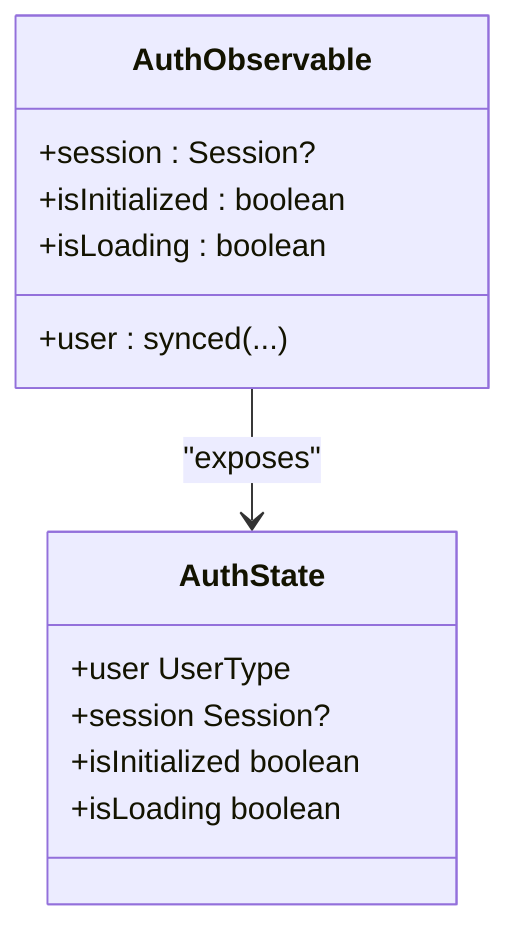

**Diagram sources**
- [src/data/states/auth.ts:8-33](file://src/data/states/auth.ts#L8-L33)

**Section sources**
- [src/data/states/auth.ts:8-33](file://src/data/states/auth.ts#L8-L33)

### Session Store and Domain Reset
- The session store watches the reactive user and resets domain-specific stores when the user identity changes.
- This ensures clean separation of data per user and prevents leakage across sign-ins.

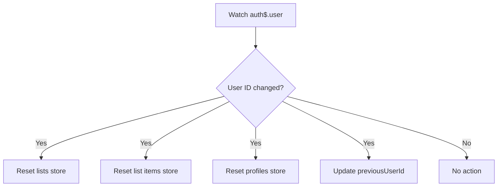

**Diagram sources**
- [src/data/session-store.ts:10-23](file://src/data/session-store.ts#L10-L23)

**Section sources**
- [src/data/session-store.ts:10-23](file://src/data/session-store.ts#L10-L23)

### Authentication Hook: Initialization and Restoration
- On app startup, the root layout calls fetchUserDataAsync to initialize or restore the user session.
- If the current user is a guest, it restores or creates a user and marks initialization complete.
- If a session exists, it syncs with Supabase and updates state; otherwise, it downgrades a non-guest user to guest mode.

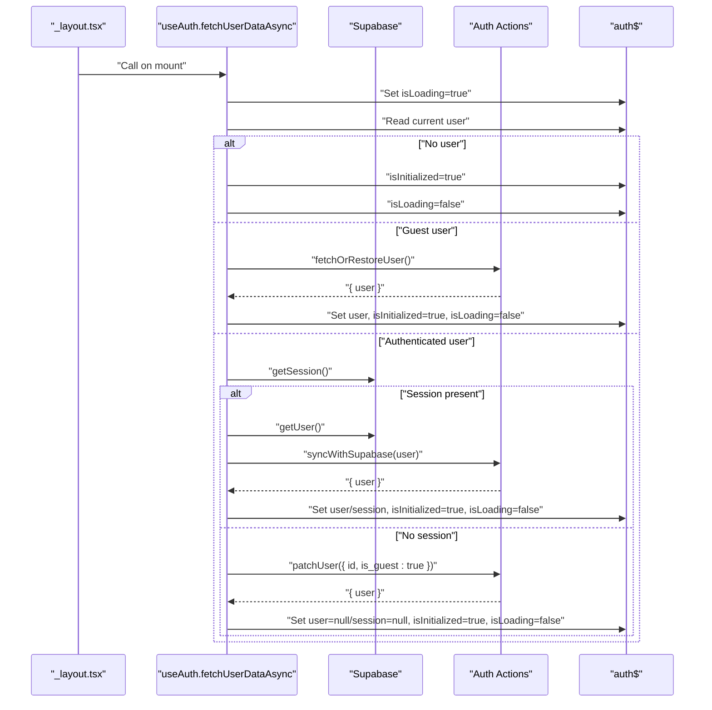

**Diagram sources**
- [src/app/_layout.tsx:20-32](file://src/app/_layout.tsx#L20-L32)
- [src/hooks/use-auth.ts:29-74](file://src/hooks/use-auth.ts#L29-L74)
- [src/data/actions/auth.ts:16-97](file://src/data/actions/auth.ts#L16-L97)

**Section sources**
- [src/app/_layout.tsx:20-32](file://src/app/_layout.tsx#L20-L32)
- [src/hooks/use-auth.ts:29-74](file://src/hooks/use-auth.ts#L29-L74)
- [src/data/actions/auth.ts:16-97](file://src/data/actions/auth.ts#L16-L97)

### Authentication Hook: Automatic Session Checking
- The checkSession method validates the current session against Supabase.
- If valid, it refreshes local state from Supabase; if invalid, it downgrades the user to guest mode.

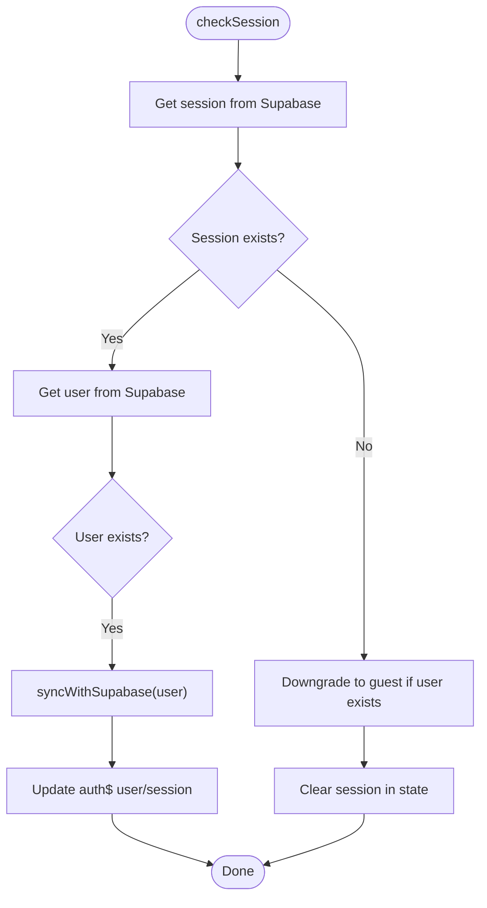

**Diagram sources**
- [src/hooks/use-auth.ts:231-258](file://src/hooks/use-auth.ts#L231-L258)
- [src/data/actions/auth.ts:72-97](file://src/data/actions/auth.ts#L72-L97)

**Section sources**
- [src/hooks/use-auth.ts:231-258](file://src/hooks/use-auth.ts#L231-L258)
- [src/data/actions/auth.ts:72-97](file://src/data/actions/auth.ts#L72-L97)

### Authentication Hook: Sign-In, Sign-Up, and Password Operations
- Sign-in and sign-up create or restore a user, then retrieve the session and update state.
- Password reset requests use Supabase’s email-based flow with a redirect URL.
- Post-authentication, the system optionally prompts data migration for guests.

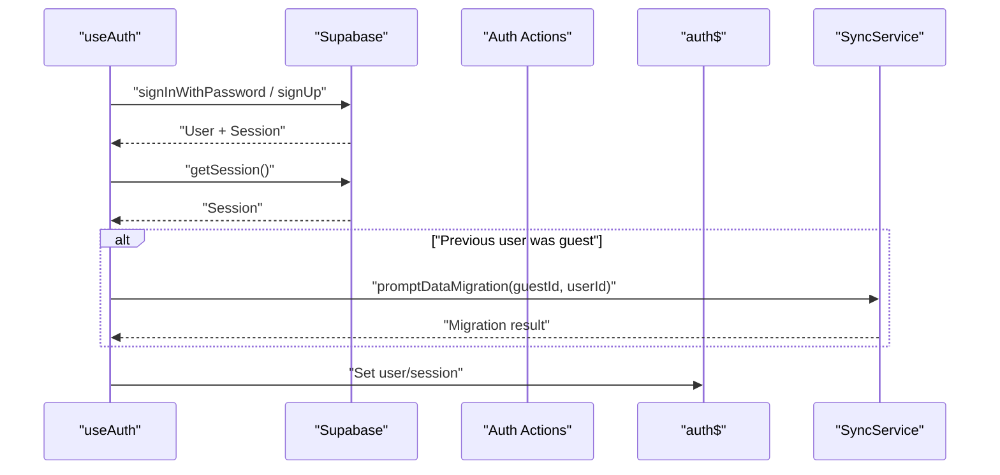

**Diagram sources**
- [src/hooks/use-auth.ts:76-161](file://src/hooks/use-auth.ts#L76-L161)
- [src/data/actions/auth.ts:99-130](file://src/data/actions/auth.ts#L99-L130)
- [src/services/sync.ts:102-149](file://src/services/sync.ts#L102-L149)

**Section sources**
- [src/hooks/use-auth.ts:76-161](file://src/hooks/use-auth.ts#L76-L161)
- [src/data/actions/auth.ts:99-130](file://src/data/actions/auth.ts#L99-L130)
- [src/services/sync.ts:102-149](file://src/services/sync.ts#L102-L149)

### Authentication Hook: Sign-Out and Cleanup
- Sign-out invokes Supabase sign-out, clears reactive state, resets domain stores, and clears all storage.
- Toast notifications confirm success or errors.

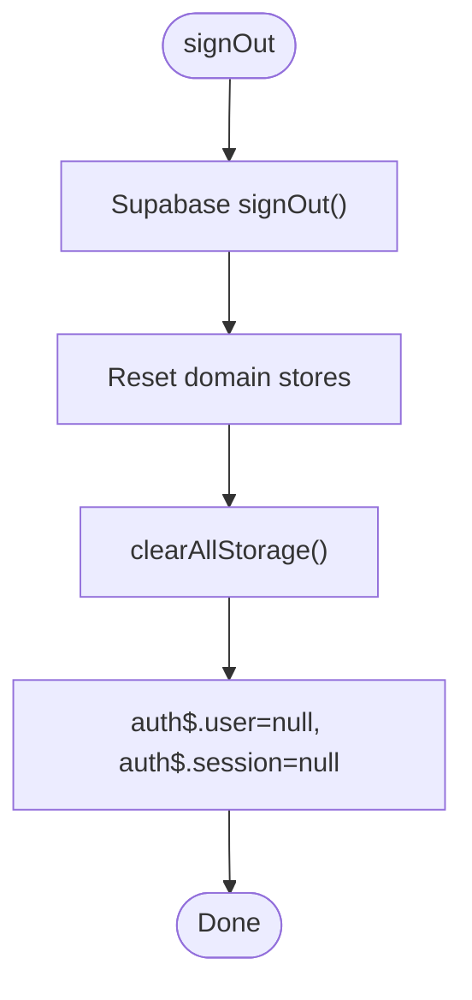

**Diagram sources**
- [src/hooks/use-auth.ts:163-183](file://src/hooks/use-auth.ts#L163-L183)
- [src/data/actions/auth.ts:127-133](file://src/data/actions/auth.ts#L127-L133)
- [src/data/storage.ts:29-32](file://src/data/storage.ts#L29-L32)

**Section sources**
- [src/hooks/use-auth.ts:163-183](file://src/hooks/use-auth.ts#L163-L183)
- [src/data/actions/auth.ts:127-133](file://src/data/actions/auth.ts#L127-L133)
- [src/data/storage.ts:29-32](file://src/data/storage.ts#L29-L32)

### User Hook: Guest Creation and Soft/Hard Deletion
- Guest users can be created and set as the current user with session cleared.
- Soft deletion marks the user as deleted (respecting guest vs authenticated behavior).
- Hard deletion invokes a server-side function for authenticated users.

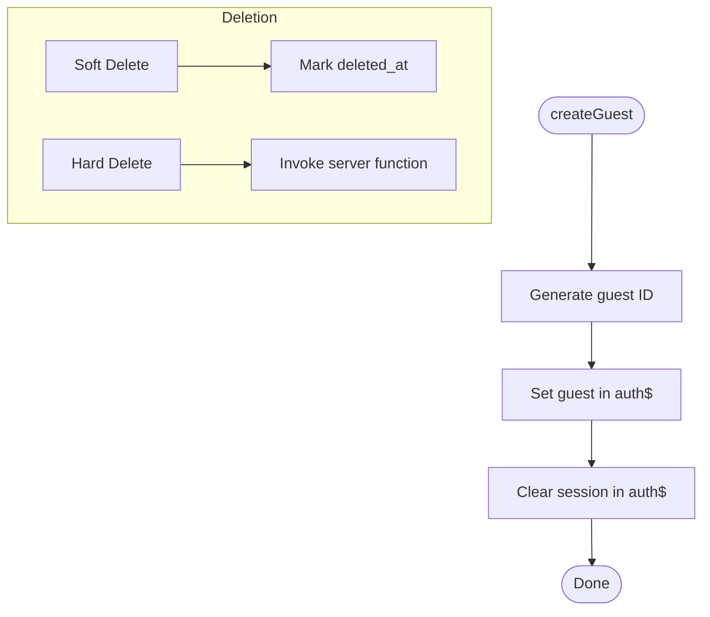

**Diagram sources**
- [src/hooks/use-user.ts:22-37](file://src/hooks/use-user.ts#L22-L37)
- [src/hooks/use-user.ts:39-82](file://src/hooks/use-user.ts#L39-L82)
- [src/data/actions/auth.ts:112-125](file://src/data/actions/auth.ts#L112-L125)

**Section sources**
- [src/hooks/use-user.ts:22-37](file://src/hooks/use-user.ts#L22-L37)
- [src/hooks/use-user.ts:39-82](file://src/hooks/use-user.ts#L39-L82)
- [src/data/actions/auth.ts:112-125](file://src/data/actions/auth.ts#L112-L125)

### Data Migration Service for Guests
- Detects whether a guest has saved data and prompts migration to authenticated accounts.
- Updates list ownership by changing profile_id in reactive state, triggering automatic Supabase sync.

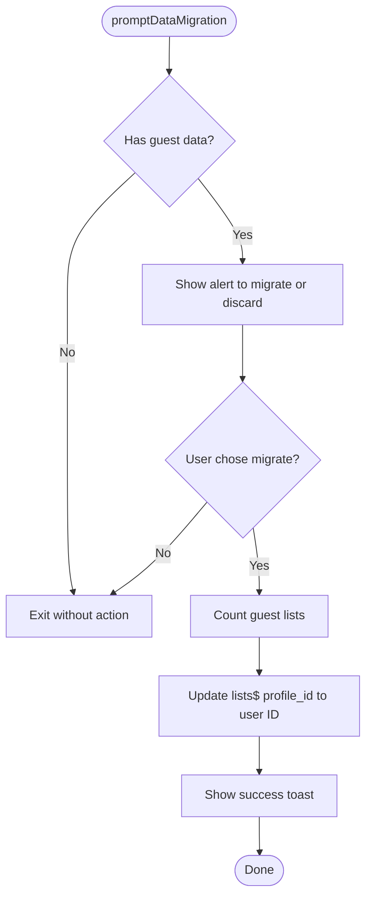

**Diagram sources**
- [src/services/sync.ts:102-149](file://src/services/sync.ts#L102-L149)
- [src/services/sync.ts:166-201](file://src/services/sync.ts#L166-L201)

**Section sources**
- [src/services/sync.ts:102-149](file://src/services/sync.ts#L102-L149)
- [src/services/sync.ts:166-201](file://src/services/sync.ts#L166-L201)

### Types Supporting Session Management
- User types distinguish between authenticated users and guests, including flags and timestamps.
- Auth types define props/results for sign-in/sign-up and session retrieval.

**Section sources**
- [src/data/types/user.ts:3-44](file://src/data/types/user.ts#L3-L44)
- [src/data/types/auth.ts:3-26](file://src/data/types/auth.ts#L3-L26)

## Dependency Analysis
The session management system exhibits layered dependencies:
- UI depends on hooks for authentication orchestration.
- Hooks depend on actions for business logic and on Supabase for backend operations.
- Actions depend on Supabase and reactive state for updates.
- Reactive state integrates with the session store for domain resets.
- Storage utilities underpin Supabase persistence and app-wide cleanup.

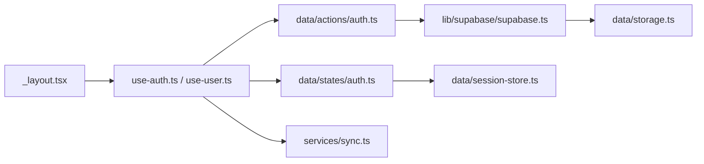

**Diagram sources**
- [src/app/_layout.tsx:17-62](file://src/app/_layout.tsx#L17-L62)
- [src/hooks/use-auth.ts:19-260](file://src/hooks/use-auth.ts#L19-L260)
- [src/hooks/use-user.ts:8-84](file://src/hooks/use-user.ts#L8-L84)
- [src/data/actions/auth.ts:16-137](file://src/data/actions/auth.ts#L16-L137)
- [src/data/states/auth.ts:22-33](file://src/data/states/auth.ts#L22-L33)
- [src/data/session-store.ts:10-23](file://src/data/session-store.ts#L10-L23)
- [src/lib/supabase/supabase.ts:21-28](file://src/lib/supabase/supabase.ts#L21-L28)
- [src/data/storage.ts:15-32](file://src/data/storage.ts#L15-L32)
- [src/services/sync.ts:41-202](file://src/services/sync.ts#L41-L202)

**Section sources**
- [src/app/_layout.tsx:17-62](file://src/app/_layout.tsx#L17-L62)
- [src/hooks/use-auth.ts:19-260](file://src/hooks/use-auth.ts#L19-L260)
- [src/hooks/use-user.ts:8-84](file://src/hooks/use-user.ts#L8-L84)
- [src/data/actions/auth.ts:16-137](file://src/data/actions/auth.ts#L16-L137)
- [src/data/states/auth.ts:22-33](file://src/data/states/auth.ts#L22-L33)
- [src/data/session-store.ts:10-23](file://src/data/session-store.ts#L10-L23)
- [src/lib/supabase/supabase.ts:21-28](file://src/lib/supabase/supabase.ts#L21-L28)
- [src/data/storage.ts:15-32](file://src/data/storage.ts#L15-L32)
- [src/services/sync.ts:41-202](file://src/services/sync.ts#L41-L202)

## Performance Considerations
- Reactive state updates are efficient due to fine-grained observables; avoid unnecessary writes to reduce recomputation.
- Session restoration runs once on startup; keep network calls minimal and cache results in state.
- Domain store resets occur only on user identity changes; ensure store reset logic is lightweight.
- Auto-refresh tokens minimize redundant sign-in attempts; monitor token refresh intervals to balance reliability and battery usage.

## Troubleshooting Guide
Common issues and resolutions:
- Session not restored on startup
  - Verify environment variables for Supabase URL and anonymous key are set.
  - Confirm MMKV encryption key is configured consistently.
  - Ensure fetchUserDataAsync is called on mount and that isInitialized is set after completion.
- Expired or invalid session
  - Use checkSession to reconcile local state with Supabase; it will downgrade to guest if needed.
  - Inspect Supabase session and user retrieval calls for errors.
- Sign-out does not clear data
  - Confirm performSignOut is invoked and that clearAllStorage is executed.
  - Verify domain stores are reset after sign-out.
- Guest migration not triggered
  - Ensure promptDataMigration is called after sign-in/sign-up when a guest previously existed.
  - Confirm lists$ contains guest-owned data before migration.

**Section sources**
- [src/lib/supabase/supabase.ts:21-28](file://src/lib/supabase/supabase.ts#L21-L28)
- [src/data/storage.ts:29-32](file://src/data/storage.ts#L29-L32)
- [src/hooks/use-auth.ts:231-258](file://src/hooks/use-auth.ts#L231-L258)
- [src/hooks/use-auth.ts:163-183](file://src/hooks/use-auth.ts#L163-L183)
- [src/services/sync.ts:102-149](file://src/services/sync.ts#L102-L149)

## Conclusion
The session management system combines Supabase authentication with reactive state and persistent storage to deliver a robust, user-friendly experience. Initialization, restoration, validation, and cleanup are handled cohesively, with automatic domain store resets and optional guest-to-user data migration. The architecture supports scalability and maintainability while ensuring secure and reliable session handling.