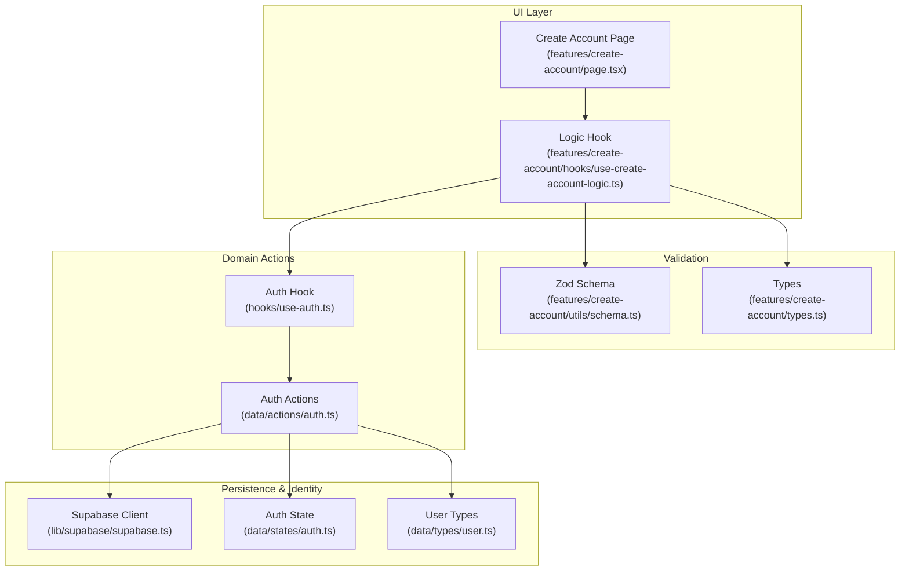
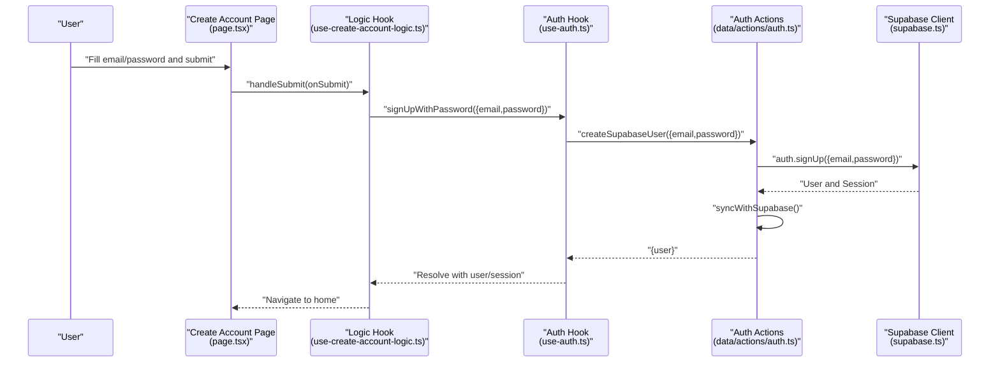
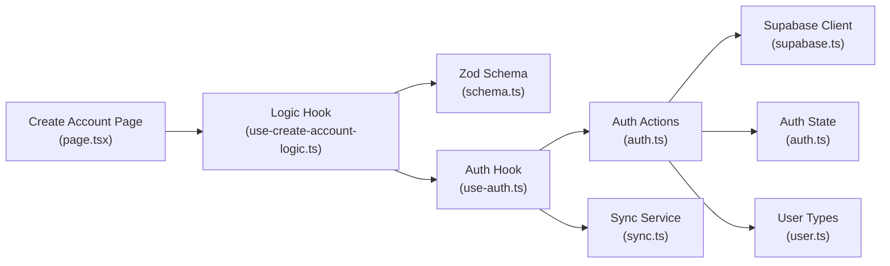

# User Registration

<cite>
**Referenced Files in This Document**
- [create-account.tsx](file://src/app/create-account.tsx)
- [page.tsx](file://src/features/create-account/page.tsx)
- [use-create-account-logic.ts](file://src/features/create-account/hooks/use-create-account-logic.ts)
- [schema.ts](file://src/features/create-account/utils/schema.ts)
- [types.ts](file://src/features/create-account/types.ts)
- [auth.ts](file://src/data/actions/auth.ts)
- [use-auth.ts](file://src/hooks/use-auth.ts)
- [supabase.ts](file://src/lib/supabase/supabase.ts)
- [index.ts](file://src/lib/supabase/index.ts)
- [auth.ts](file://src/data/states/auth.ts)
- [user.ts](file://src/data/types/user.ts)
- [sync.ts](file://src/services/sync.ts)
</cite>

## Table of Contents
1. [Introduction](#introduction)
2. [Project Structure](#project-structure)
3. [Core Components](#core-components)
4. [Architecture Overview](#architecture-overview)
5. [Detailed Component Analysis](#detailed-component-analysis)
6. [Dependency Analysis](#dependency-analysis)
7. [Performance Considerations](#performance-considerations)
8. [Troubleshooting Guide](#troubleshooting-guide)
9. [Conclusion](#conclusion)

## Introduction
This document explains the user registration flow end-to-end, covering the create account page, form validation, password and email requirements, backend authentication actions, and session management after registration. It also documents how guest user conversion occurs during registration and how Supabase is integrated for user creation and session persistence.

## Project Structure
The registration feature is organized around a dedicated page, a logic hook, a Zod validation schema, and backend authentication actions. Supabase is configured to persist sessions and tokens locally, while the app’s state stores the current user and session.

**Diagram sources**
- [page.tsx:14-134](file://src/features/create-account/page.tsx#L14-L134)
- [use-create-account-logic.ts:9-50](file://src/features/create-account/hooks/use-create-account-logic.ts#L9-L50)
- [schema.ts:3-8](file://src/features/create-account/utils/schema.ts#L3-L8)
- [types.ts:1-5](file://src/features/create-account/types.ts#L1-L5)
- [auth.ts:32-50](file://src/data/actions/auth.ts#L32-L50)
- [use-auth.ts:123-161](file://src/hooks/use-auth.ts#L123-L161)
- [supabase.ts:21-28](file://src/lib/supabase/supabase.ts#L21-L28)
- [auth.ts:22-33](file://src/data/states/auth.ts#L22-L33)
- [user.ts:1-44](file://src/data/types/user.ts#L1-L44)

**Section sources**
- [create-account.tsx:1-2](file://src/app/create-account.tsx#L1-L2)
- [page.tsx:14-134](file://src/features/create-account/page.tsx#L14-L134)
- [use-create-account-logic.ts:9-50](file://src/features/create-account/hooks/use-create-account-logic.ts#L9-L50)
- [schema.ts:3-8](file://src/features/create-account/utils/schema.ts#L3-L8)
- [types.ts:1-5](file://src/features/create-account/types.ts#L1-L5)
- [auth.ts:32-50](file://src/data/actions/auth.ts#L32-L50)
- [use-auth.ts:123-161](file://src/hooks/use-auth.ts#L123-L161)
- [supabase.ts:21-28](file://src/lib/supabase/supabase.ts#L21-L28)
- [auth.ts:22-33](file://src/data/states/auth.ts#L22-L33)
- [user.ts:1-44](file://src/data/types/user.ts#L1-L44)

## Core Components
- Create Account Page: Renders the registration form with email and password fields, validation feedback, and submission handling.
- Logic Hook: Orchestrates form state, validation, and calls the authentication action to create an account.
- Validation Schema: Enforces email format and minimum password length.
- Authentication Actions: Performs Supabase sign-up, updates local auth state, and manages guest-to-user conversion.
- Supabase Client: Provides session persistence and token refresh with MMKV-backed storage.
- Auth State: Holds the current user, session, initialization flag, and loading state.
- User Types: Defines guest and authenticated user shapes and helpers.

**Section sources**
- [page.tsx:44-120](file://src/features/create-account/page.tsx#L44-L120)
- [use-create-account-logic.ts:15-34](file://src/features/create-account/hooks/use-create-account-logic.ts#L15-L34)
- [schema.ts:3-8](file://src/features/create-account/utils/schema.ts#L3-L8)
- [auth.ts:32-50](file://src/data/actions/auth.ts#L32-L50)
- [supabase.ts:21-28](file://src/lib/supabase/supabase.ts#L21-L28)
- [auth.ts:22-33](file://src/data/states/auth.ts#L22-L33)
- [user.ts:1-44](file://src/data/types/user.ts#L1-L44)

## Architecture Overview
The registration flow integrates UI, validation, domain actions, and Supabase identity. After successful sign-up, the app retrieves the session, converts a guest user to an authenticated user if needed, and persists the session locally.

**Diagram sources**
- [page.tsx:104-119](file://src/features/create-account/page.tsx#L104-L119)
- [use-create-account-logic.ts:27-34](file://src/features/create-account/hooks/use-create-account-logic.ts#L27-L34)
- [use-auth.ts:123-161](file://src/hooks/use-auth.ts#L123-L161)
- [auth.ts:32-50](file://src/data/actions/auth.ts#L32-L50)
- [supabase.ts:21-28](file://src/lib/supabase/supabase.ts#L21-L28)

## Detailed Component Analysis

### Create Account Page
- Renders email and password fields with controlled inputs via React Hook Form.
- Displays validation error messages below each field.
- Submits via handleSubmit and triggers the logic hook’s onSubmit handler.
- Shows a loading state and disables the submit button while signing up.
- Navigates to the login page on “already have an account” action.

Key behaviors:
- Controlled form fields bound to the hook’s control.
- Error rendering for email and password.
- Submit button with spinner during async operation.
- Navigation to login route.

**Section sources**
- [page.tsx:44-120](file://src/features/create-account/page.tsx#L44-L120)

### Logic Hook: useCreateAccountLogic
- Initializes React Hook Form with Zod resolver and default empty values.
- Exposes control, errors, and handlers for secure text entry toggling.
- Implements onSubmit to call the auth hook’s sign-up function.
- On success, navigates to the home route; on error, logs and surfaces toast via the auth hook.

Validation integration:
- Uses Zod schema to validate form data before submission.

**Section sources**
- [use-create-account-logic.ts:15-34](file://src/features/create-account/hooks/use-create-account-logic.ts#L15-L34)

### Validation Schema: CreateAccountSchema
- Email validation enforces a valid email format.
- Password validation enforces a minimum length and trims whitespace.

Validation outcomes:
- Clear error messages for invalid email and short passwords.

**Section sources**
- [schema.ts:3-8](file://src/features/create-account/utils/schema.ts#L3-L8)

### Authentication Actions: createSupabaseUser
- Calls Supabase sign-up with email and password.
- Ensures a user was created and marks the user as non-guest.
- Updates the local auth state with the new user.
- Returns the created user object.

Session retrieval:
- After sign-up, the auth hook retrieves the session from Supabase.

**Section sources**
- [auth.ts:32-50](file://src/data/actions/auth.ts#L32-L50)

### Auth Hook: signUpWithPassword
- Sets loading state, calls the domain action to create a Supabase user.
- Retrieves the session and handles guest-to-user conversion if applicable.
- Updates the auth state with the user and session.
- Displays success/error toasts and propagates errors.

Guest conversion:
- If the previous user was a guest, prompts data migration and updates lists’ ownership.

**Section sources**
- [use-auth.ts:123-161](file://src/hooks/use-auth.ts#L123-L161)
- [sync.ts:102-150](file://src/services/sync.ts#L102-L150)

### Supabase Client and Session Persistence
- Creates a Supabase client with environment variables for URL and anon key.
- Configures auth storage to use MMKV adapter for persistence.
- Enables auto-refresh of tokens and persistent sessions.

**Section sources**
- [supabase.ts:21-28](file://src/lib/supabase/supabase.ts#L21-L28)

### Auth State and User Types
- Auth state holds user, session, initialization flag, and loading state.
- User types define guest and authenticated user structures and helpers.
- Guest users are converted to authenticated users upon sign-up.

**Section sources**
- [auth.ts:22-33](file://src/data/states/auth.ts#L22-L33)
- [user.ts:1-44](file://src/data/types/user.ts#L1-L44)

### Guest User Conversion During Registration
- If the previous user was a guest, the auth hook triggers a migration service to move lists from the guest profile to the authenticated user.
- The migration updates list ownership and shows feedback via toasts.

**Section sources**
- [use-auth.ts:139-145](file://src/hooks/use-auth.ts#L139-L145)
- [sync.ts:166-201](file://src/services/sync.ts#L166-L201)

## Dependency Analysis
The registration flow depends on:
- UI page and logic hook for form rendering and submission.
- Zod schema for validation.
- Auth hook and actions for Supabase integration and state updates.
- Supabase client for identity and session persistence.
- Sync service for guest-to-user data migration.

**Diagram sources**
- [page.tsx:14-134](file://src/features/create-account/page.tsx#L14-L134)
- [use-create-account-logic.ts:9-50](file://src/features/create-account/hooks/use-create-account-logic.ts#L9-L50)
- [schema.ts:3-8](file://src/features/create-account/utils/schema.ts#L3-L8)
- [use-auth.ts:123-161](file://src/hooks/use-auth.ts#L123-L161)
- [auth.ts:32-50](file://src/data/actions/auth.ts#L32-L50)
- [supabase.ts:21-28](file://src/lib/supabase/supabase.ts#L21-L28)
- [sync.ts:102-150](file://src/services/sync.ts#L102-L150)
- [auth.ts:22-33](file://src/data/states/auth.ts#L22-L33)
- [user.ts:1-44](file://src/data/types/user.ts#L1-L44)

**Section sources**
- [page.tsx:14-134](file://src/features/create-account/page.tsx#L14-L134)
- [use-create-account-logic.ts:9-50](file://src/features/create-account/hooks/use-create-account-logic.ts#L9-L50)
- [schema.ts:3-8](file://src/features/create-account/utils/schema.ts#L3-L8)
- [use-auth.ts:123-161](file://src/hooks/use-auth.ts#L123-L161)
- [auth.ts:32-50](file://src/data/actions/auth.ts#L32-L50)
- [supabase.ts:21-28](file://src/lib/supabase/supabase.ts#L21-L28)
- [sync.ts:102-150](file://src/services/sync.ts#L102-L150)
- [auth.ts:22-33](file://src/data/states/auth.ts#L22-L33)
- [user.ts:1-44](file://src/data/types/user.ts#L1-L44)

## Performance Considerations
- Minimize re-renders by keeping validation logic inside the hook and avoiding unnecessary props drilling.
- Debounce or throttle network requests where appropriate, although registration is a single call.
- Persist sessions efficiently using MMKV to avoid repeated sign-in prompts.
- Keep validation lightweight with Zod primitives to maintain responsive UI.

## Troubleshooting Guide
Common issues and resolutions:
- Invalid email format: Ensure the email matches the Zod validation rule.
- Password too short: Enforce the minimum length requirement before submission.
- Network errors during sign-up: The auth hook displays a generic error toast; check environment variables and Supabase credentials.
- Session not persisted: Verify MMKV storage is initialized and Supabase auth settings are enabled.
- Guest data not migrating: Confirm the guest has lists and the migration prompt is triggered.

Operational checks:
- Confirm environment variables for Supabase URL and anon key are present.
- Verify the auth state is updated after sign-up and session retrieval.
- Inspect error handling in the auth hook for precise messaging.

**Section sources**
- [schema.ts:3-8](file://src/features/create-account/utils/schema.ts#L3-L8)
- [use-auth.ts:152-159](file://src/hooks/use-auth.ts#L152-L159)
- [supabase.ts:21-28](file://src/lib/supabase/supabase.ts#L21-L28)
- [auth.ts:22-33](file://src/data/states/auth.ts#L22-L33)

## Conclusion
The registration flow combines a clean UI, robust validation, and Supabase-backed authentication. It supports guest-to-user conversion with seamless data migration and maintains session persistence through MMKV. By following the documented components and troubleshooting steps, teams can reliably extend or modify the registration experience while preserving security and user continuity.