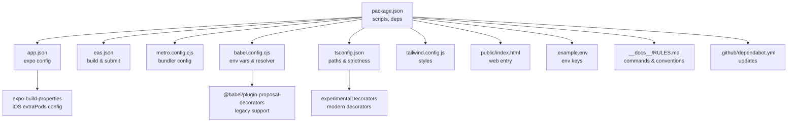
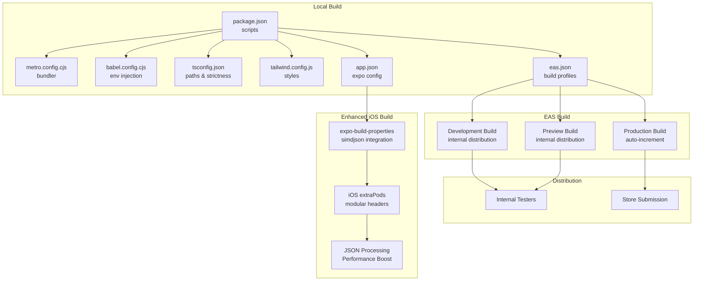
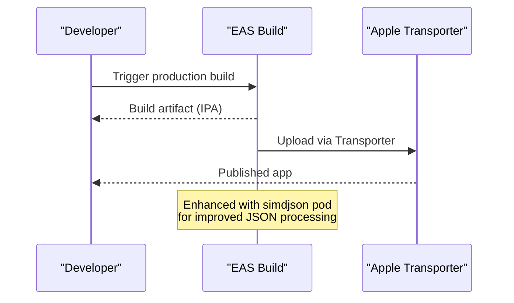
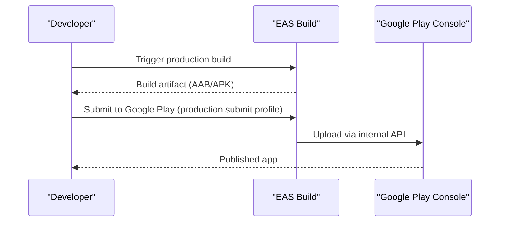
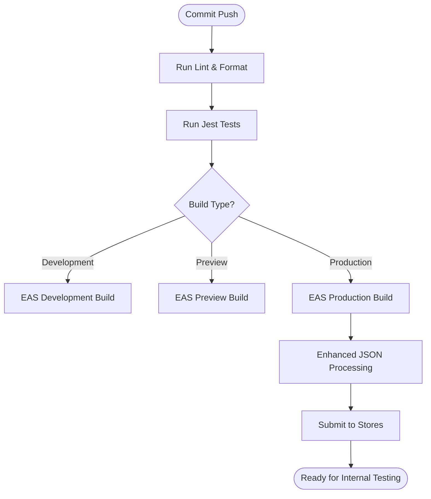
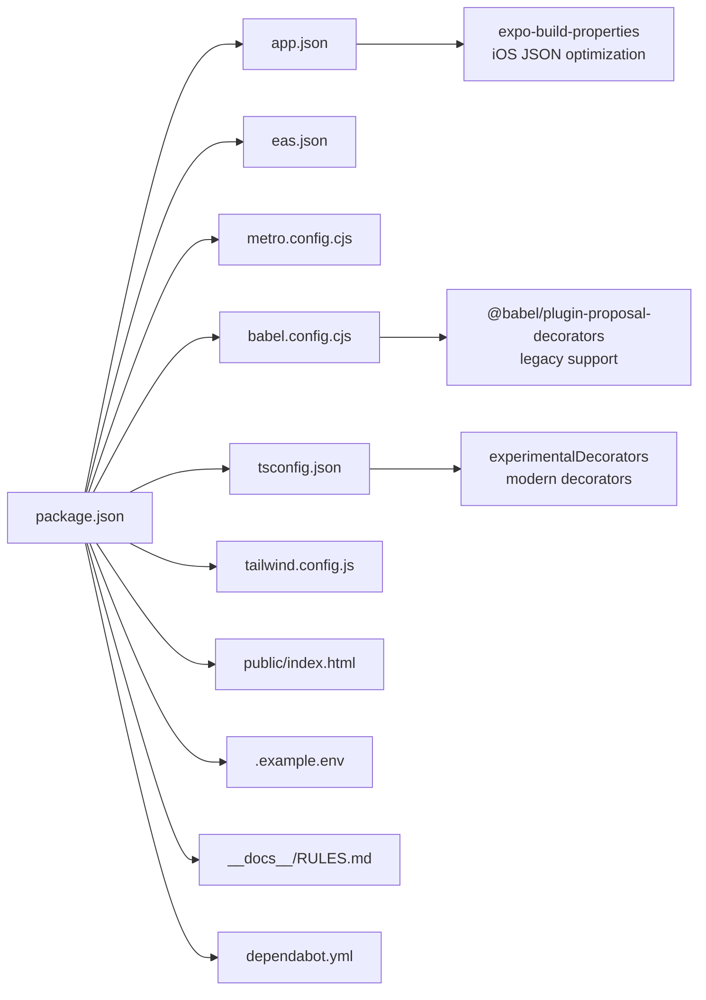

# Build and Deployment

<cite>
**Referenced Files in This Document**
- [package.json](file://package.json)
- [eas.json](file://eas.json)
- [app.json](file://app.json)
- [babel.config.cjs](file://babel.config.cjs)
- [metro.config.cjs](file://metro.config.cjs)
- [public/index.html](file://public/index.html)
- [tsconfig.json](file://tsconfig.json)
- [tailwind.config.js](file://tailwind.config.js)
- [.example.env](file://.example.env)
- [__docs__/RULES.md](file://__docs__/RULES.md)
- [.github/dependabot.yml](file://.github/dependabot.yml)
</cite>

## Update Summary
**Changes Made**
- Enhanced iOS build configuration with new expo-build-properties integration for improved JSON processing performance
- Updated Babel configuration to enable legacy decorators support for backward compatibility
- Added TypeScript experimentalDecorators option for modern decorator syntax support
- Implemented new iOS extraPods configuration with simdjson pod featuring modular headers
- Improved build performance through optimized native module integration

## Table of Contents
1. [Introduction](#introduction)
2. [Project Structure](#project-structure)
3. [Core Components](#core-components)
4. [Architecture Overview](#architecture-overview)
5. [Detailed Component Analysis](#detailed-component-analysis)
6. [Dependency Analysis](#dependency-analysis)
7. [Performance Considerations](#performance-considerations)
8. [Troubleshooting Guide](#troubleshooting-guide)
9. [Conclusion](#conclusion)
10. [Appendices](#appendices)

## Introduction
This document explains how to build and deploy PowerLists across multiple platforms using Expo and EAS Build. It covers build configuration, environment variable management, platform-specific deployment strategies for iOS and Android, web deployment considerations, CI/CD integration, automated testing, and troubleshooting. The goal is to provide a practical, repeatable process for developers and operators to reliably ship updates to internal testers and stores.

**Updated** Enhanced with new expo-build-properties integration for improved JSON processing performance and modern decorator support.

## Project Structure
PowerLists is an Expo-based cross-platform project configured for native builds and web bundling. Key build and deployment artifacts include:
- Application metadata and platform configurations in app.json
- EAS Build profiles and submission settings in eas.json
- Metro bundler configuration for native and web targets in metro.config.cjs
- Babel configuration for environment variables and module resolution in babel.config.cjs
- Web entry template in public/index.html
- TypeScript path aliases and strictness in tsconfig.json
- Tailwind/NativeWind styling configuration in tailwind.config.js
- Example environment variables in .example.env
- Developer commands and conventions in __docs__/RULES.md
- Dependency update automation in .github/dependabot.yml

**Diagram sources**
- [package.json:1-119](file://package.json#L1-L119)
- [app.json:1-113](file://app.json#L1-L113)
- [eas.json:1-22](file://eas.json#L1-L22)
- [metro.config.cjs:1-7](file://metro.config.cjs#L1-L7)
- [babel.config.cjs:1-50](file://babel.config.cjs#L1-L50)
- [tsconfig.json:1-14](file://tsconfig.json#L1-L14)
- [tailwind.config.js:1-176](file://tailwind.config.js#L1-L176)
- [public/index.html:1-56](file://public/index.html#L1-L56)
- [.example.env:1-2](file://.example.env#L1-L2)
- [__docs__/RULES.md:1-159](file://__docs__/RULES.md#L1-L159)
- [.github/dependabot.yml:1-6](file://.github/dependabot.yml#L1-L6)

**Section sources**
- [package.json:1-119](file://package.json#L1-L119)
- [app.json:1-113](file://app.json#L1-L113)
- [eas.json:1-22](file://eas.json#L1-L22)
- [metro.config.cjs:1-7](file://metro.config.cjs#L1-L7)
- [babel.config.cjs:1-50](file://babel.config.cjs#L1-L50)
- [tsconfig.json:1-14](file://tsconfig.json#L1-L14)
- [tailwind.config.js:1-176](file://tailwind.config.js#L1-L176)
- [public/index.html:1-56](file://public/index.html#L1-L56)
- [.example.env:1-2](file://.example.env#L1-L2)
- [__docs__/RULES.md:1-159](file://__docs__/RULES.md#L1-L159)
- [.github/dependabot.yml:1-6](file://.github/dependabot.yml#L1-L6)

## Core Components
- Expo configuration and platform plugins in app.json define identifiers, permissions, bundler, and platform-specific settings.
- EAS Build profiles in eas.json specify development, preview, and production builds, including auto-increment behavior and distribution modes.
- Metro bundler configuration integrates with NativeWind for responsive styling and sets input CSS and rem scaling.
- Babel configuration injects environment variables at build-time and resolves aliases for imports.
- TypeScript configuration enables strictness and path aliases aligned with the project's source layout.
- Tailwind/NativeWind theme defines semantic tokens, color scales, animations, and content globs for style extraction.
- Web entry template public/index.html provides a boot splash and resets for web environments.
- Environment variables are declared in .example.env and consumed via Babel's module resolver.

**Updated** Enhanced with new expo-build-properties integration for iOS JSON processing optimization and modern decorator support.

**Section sources**
- [app.json:1-113](file://app.json#L1-L113)
- [eas.json:1-22](file://eas.json#L1-L22)
- [metro.config.cjs:1-7](file://metro.config.cjs#L1-L7)
- [babel.config.cjs:1-50](file://babel.config.cjs#L1-L50)
- [tsconfig.json:1-14](file://tsconfig.json#L1-L14)
- [tailwind.config.js:1-176](file://tailwind.config.js#L1-L176)
- [public/index.html:1-56](file://public/index.html#L1-L56)
- [.example.env:1-2](file://.example.env#L1-L2)

## Architecture Overview
The build and deployment pipeline leverages Expo and EAS Build to produce native binaries and a web bundle. The flow below maps the configuration files to their roles in the pipeline.

**Diagram sources**
- [package.json:1-119](file://package.json#L1-L119)
- [metro.config.cjs:1-7](file://metro.config.cjs#L1-L7)
- [babel.config.cjs:1-50](file://babel.config.cjs#L1-L50)
- [tsconfig.json:1-14](file://tsconfig.json#L1-L14)
- [tailwind.config.js:1-176](file://tailwind.config.js#L1-L176)
- [app.json:1-113](file://app.json#L1-L113)
- [eas.json:1-22](file://eas.json#L1-L22)

## Detailed Component Analysis

### Expo Build Configuration (app.json)
- Defines app metadata, scheme, slug, version, orientation, icon, JS engine, and experiments.
- Registers plugins for boot splash, secure store, router, asset, edge-to-edge, font, speech recognition, and audio.
- Sets iOS bundle identifier and encryption configuration.
- Configures Android package, adaptive icon, intent filters for universal links, and software keyboard layout mode.
- Enables web bundler and favicon.
- Includes EAS project ID under extra.

**Updated** Enhanced with new expo-build-properties plugin configuration that integrates simdjson pod with modular headers for improved JSON processing performance on iOS.

Key implications:
- Plugins drive native capabilities and permissions.
- Intent filters enable deep linking and password recovery flows.
- Web bundler selection affects how the Progressive Web App is produced.
- iOS extraPods configuration improves build performance and JSON processing speed.

**Section sources**
- [app.json:1-113](file://app.json#L1-L113)

### EAS Build Setup (eas.json)
- CLI version requirement and remote app version source.
- Build profiles:
  - development: development client with internal distribution.
  - preview: internal distribution.
  - production: auto-increment enabled for versioning.
- Submit profile for production.

Operational guidance:
- Use development for internal QA and quick iteration.
- Use preview for broader internal testing.
- Use production for store releases; ensure credentials and provisioning profiles are configured in EAS Build.

**Section sources**
- [eas.json:1-22](file://eas.json#L1-L22)

### Environment Variable Management
- Babel configuration injects environment variables at build-time using react-native-dotenv with a shared module name and path.
- The example environment file declares public keys for Supabase.
- Scripts include a pre-install hook to enable Corepack and pin Yarn version for deterministic installs.

Recommendations:
- Store secrets in EAS Build credentials and environment variables; avoid committing sensitive data.
- Keep .env files out of version control; maintain .example.env for contributors.
- Use APP_ENV to control environment-specific behavior during compilation.

**Section sources**
- [babel.config.cjs:1-50](file://babel.config.cjs#L1-L50)
- [.example.env:1-2](file://.example.env#L1-L2)
- [package.json:12-12](file://package.json#L12-L12)

### Build Script Configuration
- Scripts include start, android, ios, web, prebuild, lint, format, and a preinstall hook for EAS.
- Prebuild generates native project folders for Android and iOS.
- Lint and format scripts enforce code quality.

Best practices:
- Run prebuild before building to ensure native dependencies are prepared.
- Integrate lint/format into CI to prevent low-quality submissions.

**Section sources**
- [package.json:4-13](file://package.json#L4-L13)
- [__docs__/RULES.md:5-16](file://__docs__/RULES.md#L5-L16)

### Web Deployment Configuration
- public/index.html provides a boot splash and resets for web compatibility.
- app.json configures web bundler and favicon.
- Metro configuration integrates with NativeWind and sets CSS input and rem scaling.

Considerations:
- Progressive Web App features depend on service worker configuration and manifest generation by Expo.
- Ensure domain and HTTPS are properly configured for deep links and PWApp install prompts.

**Section sources**
- [public/index.html:1-56](file://public/index.html#L1-L56)
- [app.json:102-105](file://app.json#L102-L105)
- [metro.config.cjs:1-7](file://metro.config.cjs#L1-L7)

### Cross-Platform Build Optimization
- Metro with NativeWind optimizes CSS and enables responsive styling across platforms.
- TypeScript strictness and path aliases improve reliability and developer experience.
- Tailwind preset and theme configuration streamline design tokens and animations.

**Updated** Enhanced with improved iOS JSON processing capabilities through simdjson integration for better performance in data-intensive operations.

**Section sources**
- [metro.config.cjs:1-7](file://metro.config.cjs#L1-L7)
- [tsconfig.json:1-14](file://tsconfig.json#L1-L14)
- [tailwind.config.js:1-176](file://tailwind.config.js#L1-L176)

### iOS Deployment Process
- Bundle identifier and encryption configuration are defined in app.json.
- EAS Build profiles support production builds; ensure Apple certificates and provisioning profiles are configured in EAS Build.
- Use the production submit profile in eas.json to automate store submissions.

**Updated** Enhanced with new simdjson pod integration that provides improved JSON parsing performance for iOS builds, particularly beneficial for applications with heavy data processing requirements.

**Diagram sources**
- [app.json:73-79](file://app.json#L73-L79)
- [eas.json:18-20](file://eas.json#L18-L20)

### Android Deployment Process
- Package name and adaptive icon are configured in app.json.
- EAS Build profiles support production builds; ensure keystore and signing configurations are set in EAS Build.
- Use the production submit profile in eas.json to automate store submissions.

**Diagram sources**
- [app.json:80-101](file://app.json#L80-L101)
- [eas.json:18-20](file://eas.json#L18-L20)

### Code Signing Requirements
- iOS: Apple Distribution certificate and provisioning profile must be configured in EAS Build.
- Android: Keystore must be configured in EAS Build; ensure upload key and app signing are set up.

Note: This section provides operational guidance. Refer to EAS Build documentation for exact steps to configure credentials.

### Store Submission Procedures
- Production submit profile in eas.json enables automated submission after a successful build.
- Ensure metadata, screenshots, and release notes are prepared in the respective stores prior to submission.

**Section sources**
- [eas.json:18-20](file://eas.json#L18-L20)

### CI/CD Integration and Automated Testing
- Dependabot is configured to keep npm dependencies updated on a weekly schedule.
- While there is no dedicated test script in package.json, Jest configuration exists for unit and behavior tests. Use targeted execution in CI to validate changes.

Recommended CI tasks:
- Install dependencies with Corepack enabled (handled by preinstall hook).
- Run lint and format checks.
- Execute Jest tests with targeted patterns.
- Build development and preview artifacts via EAS Build.
- Gate production deployments behind approvals and successful builds.

**Section sources**
- [.github/dependabot.yml:1-6](file://.github/dependabot.yml#L1-L6)
- [package.json:4-13](file://package.json#L4-L13)
- [__docs__/RULES.md:105-109](file://__docs__/RULES.md#L105-L109)

### Release Pipeline Automation
- EAS Build profiles define development, preview, and production stages with distribution modes.
- Auto-increment in production helps track releases consistently.
- Submit profile automates store uploads post-build.

**Diagram sources**
- [eas.json:6-20](file://eas.json#L6-L20)
- [package.json:4-13](file://package.json#L4-L13)
- [__docs__/RULES.md:105-109](file://__docs__/RULES.md#L105-L109)

## Dependency Analysis
The build system relies on coordinated configuration across multiple files. The diagram below highlights key dependencies and their roles.

**Diagram sources**
- [package.json:1-119](file://package.json#L1-L119)
- [app.json:1-113](file://app.json#L1-L113)
- [eas.json:1-22](file://eas.json#L1-L22)
- [metro.config.cjs:1-7](file://metro.config.cjs#L1-L7)
- [babel.config.cjs:1-50](file://babel.config.cjs#L1-L50)
- [tsconfig.json:1-14](file://tsconfig.json#L1-L14)
- [tailwind.config.js:1-176](file://tailwind.config.js#L1-L176)
- [public/index.html:1-56](file://public/index.html#L1-L56)
- [.example.env:1-2](file://.example.env#L1-L2)
- [__docs__/RULES.md:1-159](file://__docs__/RULES.md#L1-L159)
- [.github/dependabot.yml:1-6](file://.github/dependabot.yml#L1-L6)

**Section sources**
- [package.json:1-119](file://package.json#L1-L119)
- [app.json:1-113](file://app.json#L1-L113)
- [eas.json:1-22](file://eas.json#L1-L22)
- [metro.config.cjs:1-7](file://metro.config.cjs#L1-L7)
- [babel.config.cjs:1-50](file://babel.config.cjs#L1-L50)
- [tsconfig.json:1-14](file://tsconfig.json#L1-L14)
- [tailwind.config.js:1-176](file://tailwind.config.js#L1-L176)
- [public/index.html:1-56](file://public/index.html#L1-L56)
- [.example.env:1-2](file://.example.env#L1-L2)
- [__docs__/RULES.md:1-159](file://__docs__/RULES.md#L1-L159)
- [.github/dependabot.yml:1-6](file://.github/dependabot.yml#L1-L6)

## Performance Considerations
- Enable strict TypeScript checks to catch issues early.
- Use NativeWind/Tailwind for efficient styling extraction and runtime performance.
- Keep Metro and Babel configurations minimal to reduce build times.
- Leverage EAS Build caching and incremental builds for faster iterations.
- **Updated** The new simdjson pod integration provides significant performance improvements for JSON processing operations, particularly beneficial for applications handling large datasets or frequent data serialization/deserialization.

## Troubleshooting Guide
Common issues and resolutions:
- Missing environment variables at build time:
  - Ensure .env is populated locally and environment variables are set in EAS Build.
  - Verify Babel's module resolver path and module name match the usage in code.
- Build fails due to incompatible CLI or app version source:
  - Confirm EAS CLI version meets the minimum requirement and appVersionSource is set as expected.
- iOS build fails with signing errors:
  - Configure Apple Distribution certificate and provisioning profile in EAS Build.
- Android build fails with signing errors:
  - Configure keystore and app signing in EAS Build.
- Web deployment issues:
  - Validate web bundler settings and public/index.html content.
  - Ensure domain and HTTPS are configured for deep links and PWA features.
- Dependency updates causing breakage:
  - Use Dependabot to propose weekly updates; validate in CI before merging.
- **Updated** iOS build performance issues with JSON processing:
  - Verify simdjson pod is properly integrated and modular headers are enabled.
  - Check that extraPods configuration in app.json matches the expected pod structure.
  - Ensure the simdjson dependency is correctly installed and accessible.

**Section sources**
- [babel.config.cjs:1-50](file://babel.config.cjs#L1-L50)
- [eas.json:2-5](file://eas.json#L2-L5)
- [app.json:23-36](file://app.json#L23-L36)
- [.github/dependabot.yml:1-6](file://.github/dependabot.yml#L1-L6)

## Conclusion
PowerLists' build and deployment pipeline is centered on Expo and EAS Build, with clear separation between development, preview, and production stages. By leveraging environment variables, structured configuration files, and CI-friendly scripts, teams can reliably deliver updates across iOS, Android, and web. Adhering to the outlined practices ensures predictable builds, secure credential handling, and streamlined store submissions.

**Updated** The recent enhancements with expo-build-properties integration and improved decorator support provide better build performance and modern development capabilities, particularly benefiting iOS JSON processing performance and TypeScript decorator compatibility.

## Appendices
- Example environment variables:
  - EXPO_PUBLIC_SUPABASE_URL
  - EXPO_PUBLIC_SUPABASE_ANON_KEY

**Section sources**
- [.example.env:1-2](file://.example.env#L1-L2)