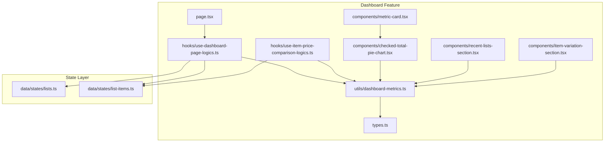
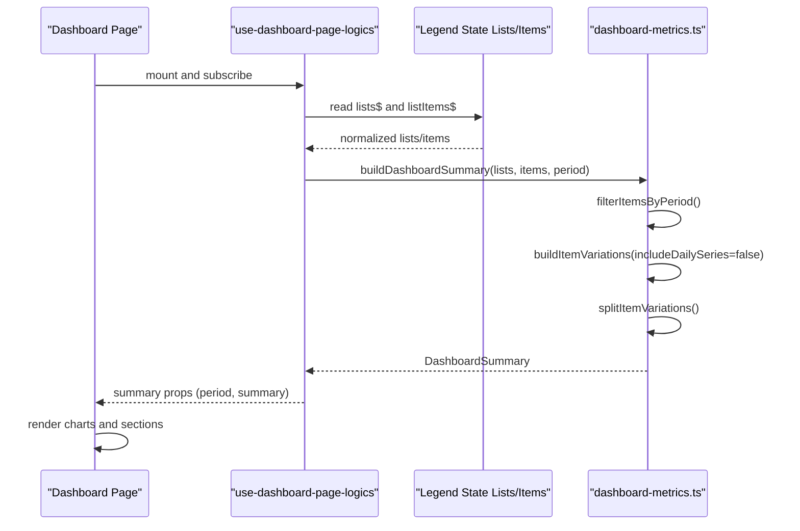
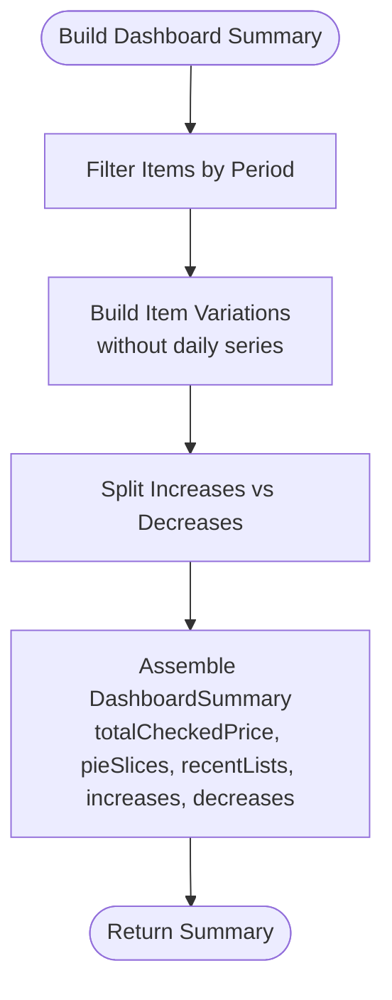
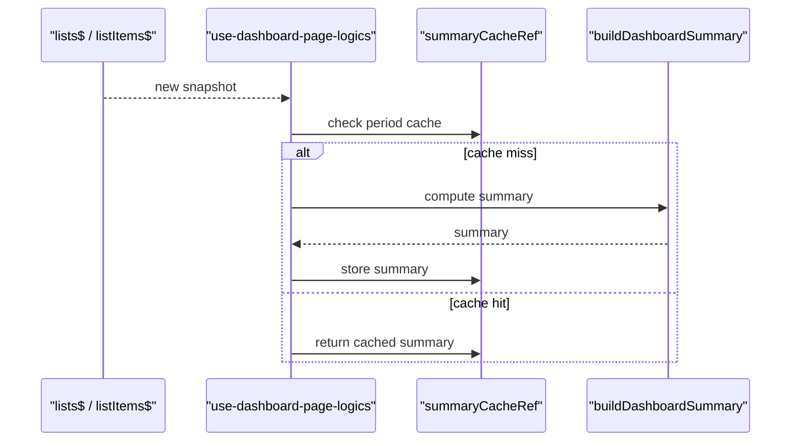
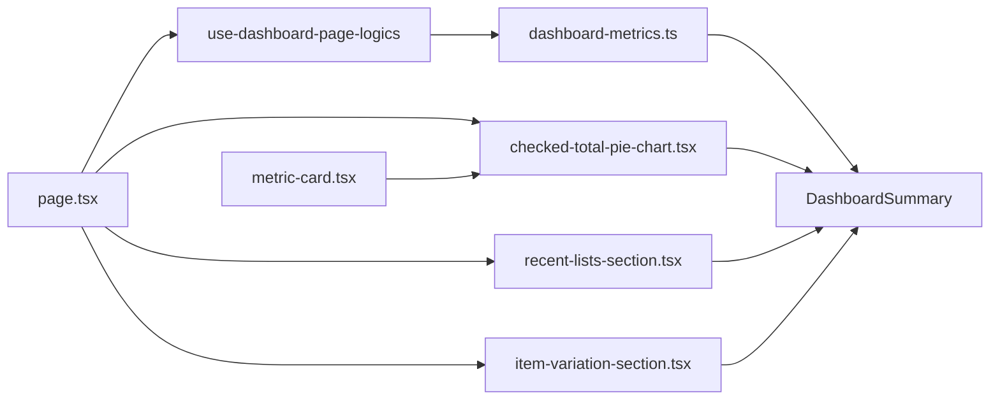
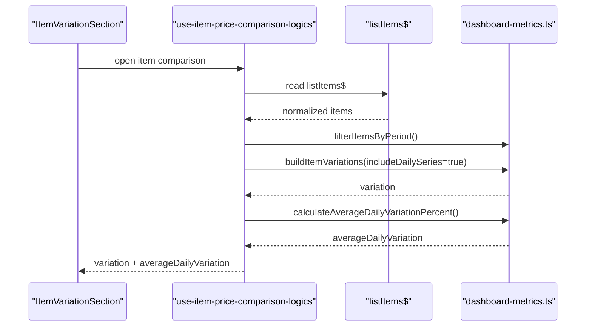
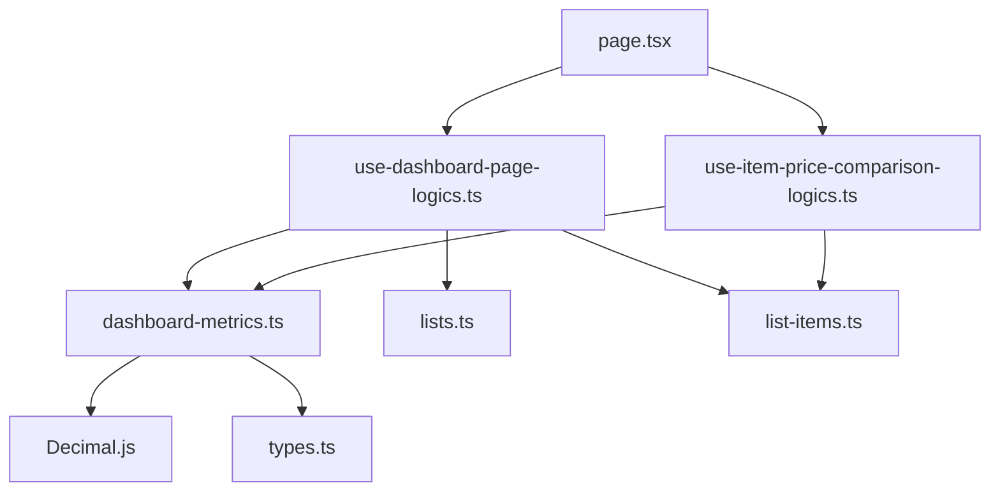

# Dashboard Metrics and Calculation Engine

<cite>
**Referenced Files in This Document**
- [dashboard-metrics.ts](file://src/features/dashboard/utils/dashboard-metrics.ts)
- [index.ts](file://src/features/dashboard/utils/index.ts)
- [types.ts](file://src/features/dashboard/types.ts)
- [use-dashboard-page-logics.ts](file://src/features/dashboard/hooks/use-dashboard-page-logics.ts)
- [page.tsx](file://src/features/dashboard/page.tsx)
- [list-items.ts](file://src/data/states/list-items.ts)
- [lists.ts](file://src/data/states/lists.ts)
- [checked-total-pie-chart.tsx](file://src/features/dashboard/components/checked-total-pie-chart.tsx)
- [recent-lists-section.tsx](file://src/features/dashboard/components/recent-lists-section.tsx)
- [item-variation-section.tsx](file://src/features/dashboard/components/item-variation-section.tsx)
- [metric-card.tsx](file://src/features/dashboard/components/metric-card.tsx)
- [use-item-price-comparison-logics.ts](file://src/features/dashboard/hooks/use-item-price-comparison-logics.ts)
- [dashboard-metrics.property.test.ts](file://src/features/dashboard/utils/__tests__/dashboard-metrics.property.test.ts)
</cite>

## Table of Contents
1. [Introduction](#introduction)
2. [Project Structure](#project-structure)
3. [Core Components](#core-components)
4. [Architecture Overview](#architecture-overview)
5. [Detailed Component Analysis](#detailed-component-analysis)
6. [Dependency Analysis](#dependency-analysis)
7. [Performance Considerations](#performance-considerations)
8. [Troubleshooting Guide](#troubleshooting-guide)
9. [Conclusion](#conclusion)
10. [Appendices](#appendices)

## Introduction
This document describes the dashboard metrics calculation engine responsible for transforming raw shopping list data into actionable insights. It covers:
- Core metrics computation: total checked price, percentage changes, and statistical aggregations
- Data transformation, filtering, and normalization utilities
- Strategies for different time periods and grouping methods
- Integration with the state management system, reactive updates, and caching
- Mathematical formulations for price trends, variance, and comparative metrics
- Examples of customization, edge case handling, and debugging techniques

## Project Structure
The dashboard metrics engine lives under the dashboard feature and integrates with the state layer and UI components.

**Diagram sources**
- [dashboard-metrics.ts:1-421](file://src/features/dashboard/utils/dashboard-metrics.ts#L1-L421)
- [types.ts:1-65](file://src/features/dashboard/types.ts#L1-L65)
- [use-dashboard-page-logics.ts:1-98](file://src/features/dashboard/hooks/use-dashboard-page-logics.ts#L1-L98)
- [use-item-price-comparison-logics.ts:1-82](file://src/features/dashboard/hooks/use-item-price-comparison-logics.ts#L1-L82)
- [checked-total-pie-chart.tsx:1-184](file://src/features/dashboard/components/checked-total-pie-chart.tsx#L1-L184)
- [recent-lists-section.tsx:1-43](file://src/features/dashboard/components/recent-lists-section.tsx#L1-L43)
- [item-variation-section.tsx:1-70](file://src/features/dashboard/components/item-variation-section.tsx#L1-L70)
- [metric-card.tsx:1-31](file://src/features/dashboard/components/metric-card.tsx#L1-L31)
- [page.tsx:1-135](file://src/features/dashboard/page.tsx#L1-L135)
- [lists.ts:1-27](file://src/data/states/lists.ts#L1-L27)
- [list-items.ts:1-24](file://src/data/states/list-items.ts#L1-L24)

**Section sources**
- [dashboard-metrics.ts:1-421](file://src/features/dashboard/utils/dashboard-metrics.ts#L1-L421)
- [types.ts:1-65](file://src/features/dashboard/types.ts#L1-L65)
- [use-dashboard-page-logics.ts:1-98](file://src/features/dashboard/hooks/use-dashboard-page-logics.ts#L1-L98)
- [page.tsx:1-135](file://src/features/dashboard/page.tsx#L1-L135)
- [lists.ts:1-27](file://src/data/states/lists.ts#L1-L27)
- [list-items.ts:1-24](file://src/data/states/list-items.ts#L1-L24)

## Core Components
- Metrics utilities: filtering by period, grouping by list and item, building summaries, and computing statistics
- State integration: reactive retrieval of lists and items via Legend state observables
- UI components: rendering charts, recent lists, and item variations
- Tests: property-based tests validating correctness of totals, averages, and grouping

Key responsibilities:
- Filter and normalize timestamps for items and lists
- Compute checked totals per list and overall
- Aggregate item price variations with directional classification
- Build daily series with averaging and sample counts
- Provide cached summaries per period

**Section sources**
- [dashboard-metrics.ts:65-130](file://src/features/dashboard/utils/dashboard-metrics.ts#L65-L130)
- [dashboard-metrics.ts:161-195](file://src/features/dashboard/utils/dashboard-metrics.ts#L161-L195)
- [dashboard-metrics.ts:197-348](file://src/features/dashboard/utils/dashboard-metrics.ts#L197-L348)
- [dashboard-metrics.ts:389-405](file://src/features/dashboard/utils/dashboard-metrics.ts#L389-L405)
- [use-dashboard-page-logics.ts:41-97](file://src/features/dashboard/hooks/use-dashboard-page-logics.ts#L41-L97)
- [dashboard-metrics.property.test.ts:88-203](file://src/features/dashboard/utils/__tests__/dashboard-metrics.property.test.ts#L88-L203)

## Architecture Overview
The engine follows a reactive pipeline:
- Real-time state streams feed normalized lists and items
- Hook orchestrates caching and computes dashboard summary per selected period
- Utilities compute metrics and statistics
- UI components render summaries and drill-down views

**Diagram sources**
- [page.tsx:49-97](file://src/features/dashboard/page.tsx#L49-L97)
- [use-dashboard-page-logics.ts:41-97](file://src/features/dashboard/hooks/use-dashboard-page-logics.ts#L41-L97)
- [lists.ts:5-26](file://src/data/states/lists.ts#L5-L26)
- [list-items.ts:5-24](file://src/data/states/list-items.ts#L5-L24)
- [dashboard-metrics.ts:389-405](file://src/features/dashboard/utils/dashboard-metrics.ts#L389-L405)

## Detailed Component Analysis

### Metrics Utilities
The core utility module defines:
- Timestamp normalization and resolution
- Period-based filtering
- Checked price aggregation
- Pie slices per list
- Daily series aggregation with averaging
- Item variation computation with direction and percent change
- Summary builder and period helpers

**Diagram sources**
- [dashboard-metrics.ts:389-405](file://src/features/dashboard/utils/dashboard-metrics.ts#L389-L405)
- [dashboard-metrics.ts:65-88](file://src/features/dashboard/utils/dashboard-metrics.ts#L65-L88)
- [dashboard-metrics.ts:325-348](file://src/features/dashboard/utils/dashboard-metrics.ts#L325-L348)
- [dashboard-metrics.ts:350-360](file://src/features/dashboard/utils/dashboard-metrics.ts#L350-L360)

Key algorithms and formulas:
- Total checked price: sum of price × amount for items marked as checked
- Percentage change: ((last − first) / first) × 100
- Direction classification: positive/negative threshold for increase/decrease; otherwise stable
- Average daily variation percent: mean of daily ((current − previous) / previous) × 100, skipping zero previous values

Edge cases handled:
- Missing dates fallback to creation/update timestamps
- Empty series returns safe defaults (zero averages, empty daily series)
- Non-positive prices filtered out for meaningful comparisons
- Normalization trims and lowercases item titles for grouping

**Section sources**
- [dashboard-metrics.ts:55-63](file://src/features/dashboard/utils/dashboard-metrics.ts#L55-L63)
- [dashboard-metrics.ts:100-103](file://src/features/dashboard/utils/dashboard-metrics.ts#L100-L103)
- [dashboard-metrics.ts:132-152](file://src/features/dashboard/utils/dashboard-metrics.ts#L132-L152)
- [dashboard-metrics.ts:161-195](file://src/features/dashboard/utils/dashboard-metrics.ts#L161-L195)
- [dashboard-metrics.ts:197-250](file://src/features/dashboard/utils/dashboard-metrics.ts#L197-L250)
- [dashboard-metrics.ts:256-323](file://src/features/dashboard/utils/dashboard-metrics.ts#L256-L323)
- [dashboard-metrics.ts:370-387](file://src/features/dashboard/utils/dashboard-metrics.ts#L370-L387)
- [dashboard-metrics.ts:407-421](file://src/features/dashboard/utils/dashboard-metrics.ts#L407-L421)

### State Management and Reactive Updates
- Lists and items are observable streams synchronized with Supabase and persisted locally
- The dashboard hook subscribes to these streams and normalizes data
- A per-period cache avoids recomputation on period changes
- Cache is invalidated when underlying lists or items change

**Diagram sources**
- [lists.ts:5-26](file://src/data/states/lists.ts#L5-L26)
- [list-items.ts:5-24](file://src/data/states/list-items.ts#L5-L24)
- [use-dashboard-page-logics.ts:41-97](file://src/features/dashboard/hooks/use-dashboard-page-logics.ts#L41-L97)

**Section sources**
- [lists.ts:1-27](file://src/data/states/lists.ts#L1-L27)
- [list-items.ts:1-24](file://src/data/states/list-items.ts#L1-L24)
- [use-dashboard-page-logics.ts:41-97](file://src/features/dashboard/hooks/use-dashboard-page-logics.ts#L41-L97)

### UI Integration and Rendering
- Dashboard page composes lazy-loaded sections and passes summary props
- Charts and sections consume normalized metrics and render visualizations
- Metric card component renders summarized values with optional subtitles

**Diagram sources**
- [page.tsx:49-129](file://src/features/dashboard/page.tsx#L49-L129)
- [use-dashboard-page-logics.ts:90-96](file://src/features/dashboard/hooks/use-dashboard-page-logics.ts#L90-L96)
- [checked-total-pie-chart.tsx:34-179](file://src/features/dashboard/components/checked-total-pie-chart.tsx#L34-L179)
- [recent-lists-section.tsx:15-42](file://src/features/dashboard/components/recent-lists-section.tsx#L15-L42)
- [item-variation-section.tsx:18-69](file://src/features/dashboard/components/item-variation-section.tsx#L18-L69)
- [metric-card.tsx:14-30](file://src/features/dashboard/components/metric-card.tsx#L14-L30)

**Section sources**
- [page.tsx:1-135](file://src/features/dashboard/page.tsx#L1-L135)
- [checked-total-pie-chart.tsx:1-184](file://src/features/dashboard/components/checked-total-pie-chart.tsx#L1-L184)
- [recent-lists-section.tsx:1-43](file://src/features/dashboard/components/recent-lists-section.tsx#L1-L43)
- [item-variation-section.tsx:1-70](file://src/features/dashboard/components/item-variation-section.tsx#L1-L70)
- [metric-card.tsx:1-31](file://src/features/dashboard/components/metric-card.tsx#L1-L31)

### Item Price Comparison Drill-Down
- A dedicated hook filters items by period, builds variations with daily series, and computes average daily variation percent
- Navigation passes item key/title and period to comparison page

**Diagram sources**
- [use-item-price-comparison-logics.ts:32-81](file://src/features/dashboard/hooks/use-item-price-comparison-logics.ts#L32-L81)
- [list-items.ts:5-24](file://src/data/states/list-items.ts#L5-L24)
- [dashboard-metrics.ts:65-88](file://src/features/dashboard/utils/dashboard-metrics.ts#L65-L88)
- [dashboard-metrics.ts:325-348](file://src/features/dashboard/utils/dashboard-metrics.ts#L325-L348)
- [dashboard-metrics.ts:370-387](file://src/features/dashboard/utils/dashboard-metrics.ts#L370-L387)

**Section sources**
- [use-item-price-comparison-logics.ts:1-82](file://src/features/dashboard/hooks/use-item-price-comparison-logics.ts#L1-L82)
- [dashboard-metrics.ts:325-387](file://src/features/dashboard/utils/dashboard-metrics.ts#L325-L387)

## Dependency Analysis
- The metrics utilities depend on:
  - Types for shape definitions
  - Decimal.js for precise arithmetic
  - Locale-aware date formatting for labels
- The dashboard page depends on:
  - Hooks for reactive data and caching
  - Components for rendering
- State layer depends on:
  - Supabase synchronization and local persistence
  - Real-time filters scoped to the current user

**Diagram sources**
- [dashboard-metrics.ts:1-14](file://src/features/dashboard/utils/dashboard-metrics.ts#L1-L14)
- [types.ts:1-65](file://src/features/dashboard/types.ts#L1-L65)
- [page.tsx:1-135](file://src/features/dashboard/page.tsx#L1-L135)
- [use-dashboard-page-logics.ts:1-98](file://src/features/dashboard/hooks/use-dashboard-page-logics.ts#L1-L98)
- [use-item-price-comparison-logics.ts:1-82](file://src/features/dashboard/hooks/use-item-price-comparison-logics.ts#L1-L82)
- [lists.ts:1-27](file://src/data/states/lists.ts#L1-L27)
- [list-items.ts:1-24](file://src/data/states/list-items.ts#L1-L24)

**Section sources**
- [dashboard-metrics.ts:1-14](file://src/features/dashboard/utils/dashboard-metrics.ts#L1-L14)
- [types.ts:1-65](file://src/features/dashboard/types.ts#L1-L65)
- [lists.ts:1-27](file://src/data/states/lists.ts#L1-L27)
- [list-items.ts:1-24](file://src/data/states/list-items.ts#L1-L24)

## Performance Considerations
- Caching: Per-period summary cache prevents repeated computations when switching periods
- Filtering: Early exit for “all” period avoids unnecessary filtering work
- Aggregation: Single-pass reductions with Decimal minimize floating-point drift
- Rendering: Lazy loading of heavy components reduces initial load
- Real-time updates: Reactive hooks recompute only when watched state changes

Optimization opportunities:
- Memoize normalization steps for lists and items
- Consider indexed lookups for frequent queries (e.g., listId -> items)
- Batch updates when applying filters to very large datasets

**Section sources**
- [use-dashboard-page-logics.ts:41-97](file://src/features/dashboard/hooks/use-dashboard-page-logics.ts#L41-L97)
- [dashboard-metrics.ts:65-88](file://src/features/dashboard/utils/dashboard-metrics.ts#L65-L88)
- [dashboard-metrics.ts:55-63](file://src/features/dashboard/utils/dashboard-metrics.ts#L55-L63)

## Troubleshooting Guide
Common issues and resolutions:
- Incorrect totals:
  - Verify checked items are properly filtered and multiplied by amounts
  - Ensure Decimal arithmetic is used consistently for precision
- Missing or stale data:
  - Confirm state subscriptions are active and normalized
  - Clear cache on data changes to force recalculation
- Zero or negative price entries:
  - These are intentionally filtered out for meaningful comparisons
- Empty charts:
  - Ensure slices have positive values before rendering bars
- Drift in averages:
  - Use Decimal-based reductions and avoid intermediate rounding

Validation resources:
- Property-based tests confirm correctness of totals, averages, and grouping

**Section sources**
- [dashboard-metrics.property.test.ts:88-203](file://src/features/dashboard/utils/__tests__/dashboard-metrics.property.test.ts#L88-L203)
- [dashboard-metrics.ts:197-250](file://src/features/dashboard/utils/dashboard-metrics.ts#L197-L250)
- [dashboard-metrics.ts:325-348](file://src/features/dashboard/utils/dashboard-metrics.ts#L325-L348)

## Conclusion
The dashboard metrics engine combines reactive state management with robust calculation utilities to deliver accurate, efficient, and user-friendly financial insights. Its modular design supports customization, maintains performance through caching and memoization, and provides clear extension points for additional metrics and visualizations.

## Appendices

### Mathematical Formulas Reference
- Total checked price: Σ(price_i × amount_i) for i ∈ checked
- Percentage change: ((last − first) / first) × 100
- Direction classification:
  - Increase if recent delta > 0.01%
  - Decrease if recent delta < −0.01%
  - Stable otherwise
- Average daily variation percent: mean of ((current_t − current_{t−1}) / current_{t−1}) × 100 over t ∈ [2..n], skipping zero denominators

**Section sources**
- [dashboard-metrics.ts:217-225](file://src/features/dashboard/utils/dashboard-metrics.ts#L217-L225)
- [dashboard-metrics.ts:370-387](file://src/features/dashboard/utils/dashboard-metrics.ts#L370-L387)