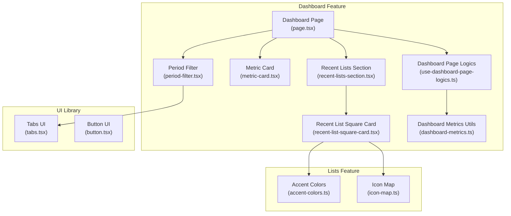
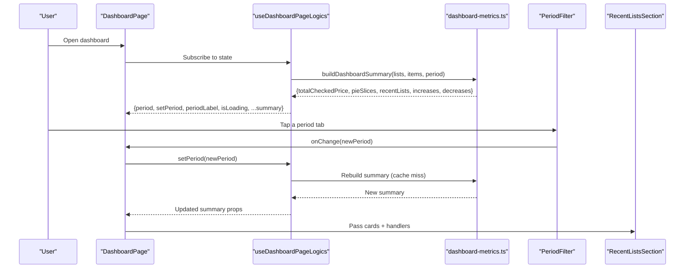
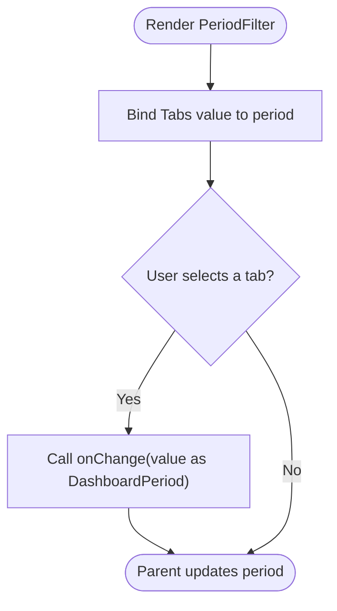
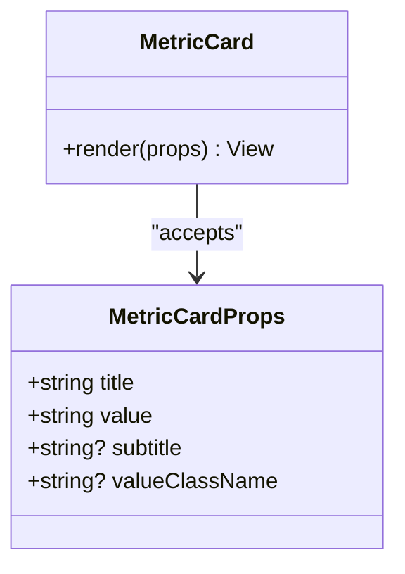
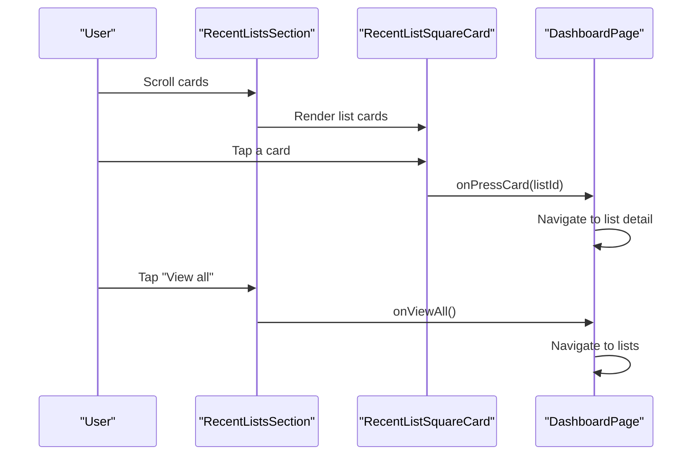
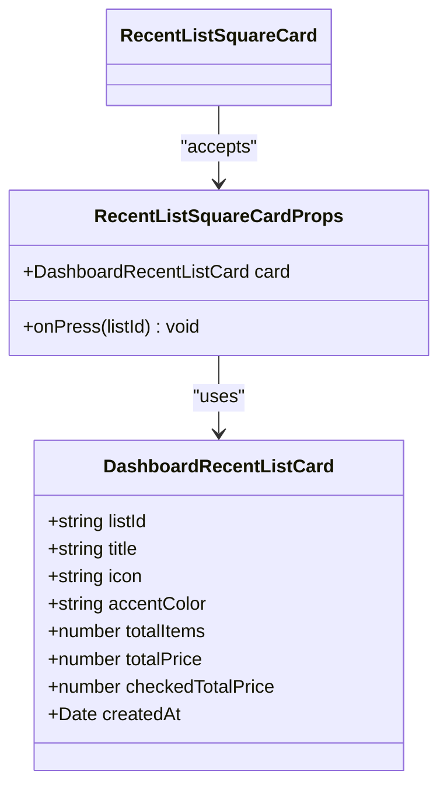
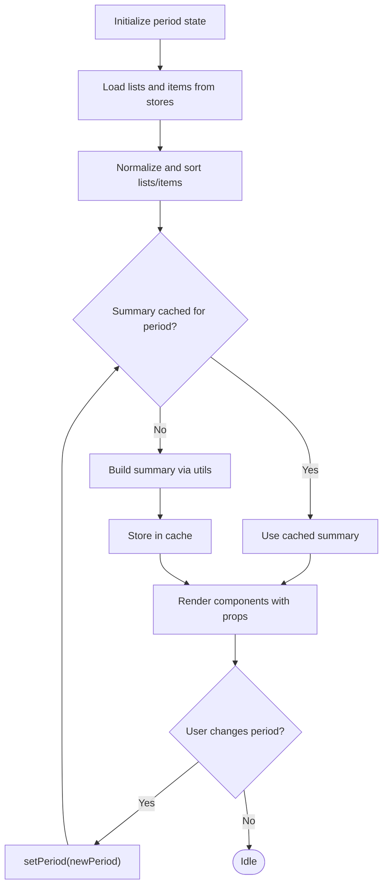
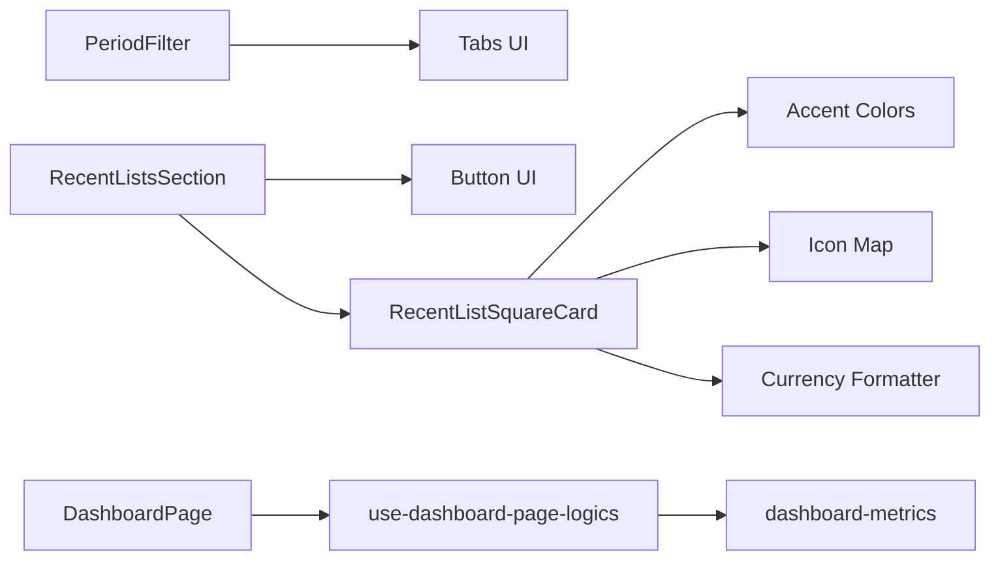

# Dashboard Overview Components

<cite>
**Referenced Files in This Document**
- [index.ts](file://src/features/dashboard/components/index.ts)
- [period-filter.tsx](file://src/features/dashboard/components/period-filter.tsx)
- [metric-card.tsx](file://src/features/dashboard/components/metric-card.tsx)
- [recent-lists-section.tsx](file://src/features/dashboard/components/recent-lists-section.tsx)
- [recent-list-square-card.tsx](file://src/features/dashboard/components/recent-list-square-card.tsx)
- [page.tsx](file://src/features/dashboard/page.tsx)
- [use-dashboard-page-logics.ts](file://src/features/dashboard/hooks/use-dashboard-page-logics.ts)
- [dashboard-metrics.ts](file://src/features/dashboard/utils/dashboard-metrics.ts)
- [accent-colors.ts](file://src/features/lists/utils/accent-colors.ts)
- [icon-map.ts](file://src/features/lists/utils/icon-map.ts)
- [tabs.tsx](file://src/components/ui/tabs.tsx)
- [button.tsx](file://src/components/ui/button.tsx)
- [currency.ts](file://src/utils/currency.ts)
</cite>

## Table of Contents
1. [Introduction](#introduction)
2. [Project Structure](#project-structure)
3. [Core Components](#core-components)
4. [Architecture Overview](#architecture-overview)
5. [Detailed Component Analysis](#detailed-component-analysis)
6. [Dependency Analysis](#dependency-analysis)
7. [Performance Considerations](#performance-considerations)
8. [Troubleshooting Guide](#troubleshooting-guide)
9. [Conclusion](#conclusion)
10. [Appendices](#appendices)

## Introduction
This document explains the dashboard overview components that present key metrics, time-based filtering, and recent shopping lists. It covers:
- Period filter implementation for time range selection and period change handling
- Metric card components for KPIs and statistics
- Recent lists section with interactive cards, navigation, and preview behavior
- The recent list square card component’s layout, styling, and interactions
- Composition patterns, prop interfaces, and integration with dashboard state management
- Examples of customization, responsive design considerations, and accessibility features

## Project Structure
The dashboard overview lives under the dashboard feature and composes reusable UI components and utilities:
- Components: period filter, metric cards, recent lists section, and recent list square card
- Page: orchestrates state, lazy-loads async components, and wires navigation
- Hooks: manages period state, caches summaries, and derives metrics
- Utilities: compute time-based filters, build summaries, and format values

**Diagram sources**
- [page.tsx:1-135](file://src/features/dashboard/page.tsx#L1-L135)
- [period-filter.tsx:1-35](file://src/features/dashboard/components/period-filter.tsx#L1-L35)
- [metric-card.tsx:1-31](file://src/features/dashboard/components/metric-card.tsx#L1-L31)
- [recent-lists-section.tsx:1-43](file://src/features/dashboard/components/recent-lists-section.tsx#L1-L43)
- [recent-list-square-card.tsx:1-48](file://src/features/dashboard/components/recent-list-square-card.tsx#L1-L48)
- [use-dashboard-page-logics.ts:1-98](file://src/features/dashboard/hooks/use-dashboard-page-logics.ts#L1-L98)
- [dashboard-metrics.ts:1-421](file://src/features/dashboard/utils/dashboard-metrics.ts#L1-L421)
- [tabs.tsx:1-69](file://src/components/ui/tabs.tsx#L1-L69)
- [button.tsx:1-109](file://src/components/ui/button.tsx#L1-L109)
- [accent-colors.ts:1-93](file://src/features/lists/utils/accent-colors.ts#L1-L93)
- [icon-map.ts:1-20](file://src/features/lists/utils/icon-map.ts#L1-L20)

**Section sources**
- [index.ts:1-9](file://src/features/dashboard/components/index.ts#L1-L9)
- [page.tsx:1-135](file://src/features/dashboard/page.tsx#L1-L135)

## Core Components
- Period Filter: A tabbed selector for time ranges (all, week, month, year) with controlled value binding and change callback.
- Metric Card: A lightweight card for displaying titles, values, and optional subtitles with customizable value styling.
- Recent Lists Section: A horizontally scrollable section of recent list cards with a “View all” action and empty state.
- Recent List Square Card: An interactive square card representing a list with icon, item count, title, and formatted total price.

**Section sources**
- [period-filter.tsx:8-35](file://src/features/dashboard/components/period-filter.tsx#L8-L35)
- [metric-card.tsx:7-31](file://src/features/dashboard/components/metric-card.tsx#L7-L31)
- [recent-lists-section.tsx:9-43](file://src/features/dashboard/components/recent-lists-section.tsx#L9-L43)
- [recent-list-square-card.tsx:13-48](file://src/features/dashboard/components/recent-list-square-card.tsx#L13-L48)

## Architecture Overview
The dashboard page lazy-loads components and passes derived data and callbacks from a centralized hook. The hook computes metrics based on lists and items, caches per-period summaries, and exposes period controls and labels.

**Diagram sources**
- [page.tsx:49-135](file://src/features/dashboard/page.tsx#L49-L135)
- [use-dashboard-page-logics.ts:41-98](file://src/features/dashboard/hooks/use-dashboard-page-logics.ts#L41-L98)
- [dashboard-metrics.ts:389-421](file://src/features/dashboard/utils/dashboard-metrics.ts#L389-L421)
- [period-filter.tsx:13-35](file://src/features/dashboard/components/period-filter.tsx#L13-L35)
- [recent-lists-section.tsx:15-43](file://src/features/dashboard/components/recent-lists-section.tsx#L15-L43)

## Detailed Component Analysis

### Period Filter
- Purpose: Allow users to switch between time ranges (all, week, month, year).
- Implementation:
  - Uses a tabbed UI with four triggers mapped to period values.
  - Controlled via a value/onChange pattern to update parent state.
- Props:
  - period: current selected period
  - onChange: handler receiving the new period
- Accessibility and UX:
  - Uses a native-friendly tab component with keyboard focus and screen-reader support.
  - Triggers a state update that recomputes dashboard metrics.

**Diagram sources**
- [period-filter.tsx:13-35](file://src/features/dashboard/components/period-filter.tsx#L13-L35)
- [tabs.tsx:1-69](file://src/components/ui/tabs.tsx#L1-L69)

**Section sources**
- [period-filter.tsx:8-35](file://src/features/dashboard/components/period-filter.tsx#L8-L35)
- [tabs.tsx:1-69](file://src/components/ui/tabs.tsx#L1-L69)

### Metric Card
- Purpose: Display KPIs such as totals, counts, and summaries.
- Props:
  - title: label text
  - value: primary value text
  - subtitle: optional secondary text
  - valueClassName: optional override for value styling
- Styling:
  - Rounded card container with background and borders
  - Typography hierarchy for muted labels, bold values, and small subtitles
- Composition:
  - Memoized to avoid unnecessary re-renders when values are unchanged

**Diagram sources**
- [metric-card.tsx:7-31](file://src/features/dashboard/components/metric-card.tsx#L7-L31)

**Section sources**
- [metric-card.tsx:7-31](file://src/features/dashboard/components/metric-card.tsx#L7-L31)

### Recent Lists Section
- Purpose: Show the latest shopping lists as horizontal cards with a “View all” action.
- Props:
  - cards: array of recent list cards
  - onViewAll: handler invoked when “View all” is pressed
  - onPressCard: handler invoked with a listId when a card is pressed
- Behavior:
  - Renders a horizontal scrollable list of RecentListSquareCard
  - Shows an empty state when no cards are present
- Navigation:
  - “View all” navigates to the lists page
  - Individual cards navigate to the list detail page

**Diagram sources**
- [recent-lists-section.tsx:15-43](file://src/features/dashboard/components/recent-lists-section.tsx#L15-L43)
- [recent-list-square-card.tsx:18-48](file://src/features/dashboard/components/recent-list-square-card.tsx#L18-L48)
- [page.tsx:63-96](file://src/features/dashboard/page.tsx#L63-L96)

**Section sources**
- [recent-lists-section.tsx:9-43](file://src/features/dashboard/components/recent-lists-section.tsx#L9-L43)
- [button.tsx:1-109](file://src/components/ui/button.tsx#L1-L109)

### Recent List Square Card
- Purpose: Present a single recent list as a square card with icon, item count, title, and formatted total price.
- Props:
  - card: DashboardRecentListCard
  - onPress: handler receiving the listId
- Layout and styling:
  - Aspect ratio maintained via a square container
  - Accent color token resolved to background/foreground classes for themed visuals
  - Icon chosen from a mapping keyed by list icon name
  - Total price formatted using a currency formatter
- Interactions:
  - Pressable with active opacity feedback
  - Navigates to list detail on press

**Diagram sources**
- [recent-list-square-card.tsx:13-48](file://src/features/dashboard/components/recent-list-square-card.tsx#L13-L48)
- [accent-colors.ts:85-93](file://src/features/lists/utils/accent-colors.ts#L85-L93)
- [icon-map.ts:11-20](file://src/features/lists/utils/icon-map.ts#L11-L20)
- [currency.ts:1-40](file://src/utils/currency.ts#L1-L40)

**Section sources**
- [recent-list-square-card.tsx:13-48](file://src/features/dashboard/components/recent-list-square-card.tsx#L13-L48)
- [accent-colors.ts:1-93](file://src/features/lists/utils/accent-colors.ts#L1-L93)
- [icon-map.ts:1-20](file://src/features/lists/utils/icon-map.ts#L1-L20)
- [currency.ts:1-40](file://src/utils/currency.ts#L1-L40)

### Dashboard State Management and Data Flow
- Hook responsibilities:
  - Manages period state and toggles
  - Normalizes and sorts lists and items from reactive stores
  - Caches summaries per period to avoid recomputation
  - Exposes computed metrics and labels
- Page wiring:
  - Lazy-loads components to optimize initial load
  - Passes props and handlers to child components
  - Handles navigation to list detail and lists page

**Diagram sources**
- [use-dashboard-page-logics.ts:41-98](file://src/features/dashboard/hooks/use-dashboard-page-logics.ts#L41-L98)
- [dashboard-metrics.ts:389-421](file://src/features/dashboard/utils/dashboard-metrics.ts#L389-L421)
- [page.tsx:49-135](file://src/features/dashboard/page.tsx#L49-L135)

**Section sources**
- [use-dashboard-page-logics.ts:1-98](file://src/features/dashboard/hooks/use-dashboard-page-logics.ts#L1-L98)
- [dashboard-metrics.ts:65-88](file://src/features/dashboard/utils/dashboard-metrics.ts#L65-L88)
- [page.tsx:49-135](file://src/features/dashboard/page.tsx#L49-L135)

## Dependency Analysis
- Component coupling:
  - PeriodFilter depends on Tabs UI primitives
  - RecentListsSection composes RecentListSquareCard and Button UI
  - RecentListSquareCard depends on accent colors and icon mapping utilities
- Data dependencies:
  - Dashboard page logic depends on reactive stores and dashboard metrics utilities
  - Currency formatting is used in list cards
- External integrations:
  - Navigation handled via router push
  - Lazy loading for components improves startup performance

**Diagram sources**
- [period-filter.tsx:3-5](file://src/features/dashboard/components/period-filter.tsx#L3-L5)
- [recent-lists-section.tsx:3-7](file://src/features/dashboard/components/recent-lists-section.tsx#L3-L7)
- [recent-list-square-card.tsx:4-8](file://src/features/dashboard/components/recent-list-square-card.tsx#L4-L8)
- [accent-colors.ts:1-93](file://src/features/lists/utils/accent-colors.ts#L1-L93)
- [icon-map.ts:1-20](file://src/features/lists/utils/icon-map.ts#L1-L20)
- [page.tsx:9-15](file://src/features/dashboard/page.tsx#L9-L15)
- [use-dashboard-page-logics.ts:4-10](file://src/features/dashboard/hooks/use-dashboard-page-logics.ts#L4-L10)
- [dashboard-metrics.ts:1-12](file://src/features/dashboard/utils/dashboard-metrics.ts#L1-L12)
- [currency.ts:1-40](file://src/utils/currency.ts#L1-L40)

**Section sources**
- [tabs.tsx:1-69](file://src/components/ui/tabs.tsx#L1-L69)
- [button.tsx:1-109](file://src/components/ui/button.tsx#L1-L109)
- [accent-colors.ts:1-93](file://src/features/lists/utils/accent-colors.ts#L1-L93)
- [icon-map.ts:1-20](file://src/features/lists/utils/icon-map.ts#L1-L20)
- [dashboard-metrics.ts:1-421](file://src/features/dashboard/utils/dashboard-metrics.ts#L1-L421)
- [currency.ts:1-40](file://src/utils/currency.ts#L1-L40)

## Performance Considerations
- Memoization and caching:
  - Summary computation is cached per period to prevent repeated work
  - Items and lists are normalized once and sorted deterministically
- Lazy loading:
  - Dashboard components are loaded asynchronously to reduce initial bundle size
- Rendering:
  - Metric cards and list cards are memoized to minimize re-renders
- Horizontal scrolling:
  - Recent lists are horizontally scrollable to keep the layout compact

[No sources needed since this section provides general guidance]

## Troubleshooting Guide
- Period filter not updating:
  - Ensure the onChange handler updates the period state in the parent
  - Verify the Tabs value is bound to the current period
- Empty recent lists:
  - Confirm that lists exist and items are associated with them
  - Check that normalization preserves dates and identifiers
- Incorrect accent colors or icons:
  - Validate that list accentColor and icon fields are set
  - Ensure accent color tokens are supported and icon keys exist in the map
- Currency formatting issues:
  - Ensure numeric prices are passed to the formatter
  - Verify locale formatting expectations

**Section sources**
- [period-filter.tsx:16-17](file://src/features/dashboard/components/period-filter.tsx#L16-L17)
- [use-dashboard-page-logics.ts:12-39](file://src/features/dashboard/hooks/use-dashboard-page-logics.ts#L12-L39)
- [accent-colors.ts:76-93](file://src/features/lists/utils/accent-colors.ts#L76-L93)
- [icon-map.ts:11-20](file://src/features/lists/utils/icon-map.ts#L11-L20)
- [currency.ts:1-40](file://src/utils/currency.ts#L1-L40)

## Conclusion
The dashboard overview components provide a cohesive, state-driven interface for exploring shopping list metrics and recent activity. The period filter enables flexible time-based analysis, while metric cards and recent lists communicate key insights. The design leverages memoization, caching, and lazy loading to maintain responsiveness, and integrates with UI primitives and utilities for consistent styling and behavior.

[No sources needed since this section summarizes without analyzing specific files]

## Appendices

### Component Prop Interfaces
- PeriodFilter
  - period: DashboardPeriod
  - onChange: (period: DashboardPeriod) => void
- MetricCard
  - title: string
  - value: string
  - subtitle?: string
  - valueClassName?: string
- RecentListsSection
  - cards: DashboardRecentListCard[]
  - onViewAll: () => void
  - onPressCard: (listId: string) => void
- RecentListSquareCard
  - card: DashboardRecentListCard
  - onPress: (listId: string) => void

**Section sources**
- [period-filter.tsx:8-11](file://src/features/dashboard/components/period-filter.tsx#L8-L11)
- [metric-card.tsx:7-12](file://src/features/dashboard/components/metric-card.tsx#L7-L12)
- [recent-lists-section.tsx:9-13](file://src/features/dashboard/components/recent-lists-section.tsx#L9-L13)
- [recent-list-square-card.tsx:13-16](file://src/features/dashboard/components/recent-list-square-card.tsx#L13-L16)

### Time Range Selection and Calculations
- Period selection:
  - Supported periods: all, week, month, year
  - Period label mapping is localized
- Date calculations:
  - Weekly: 7 days prior to now
  - Monthly: 30 days prior to now
  - Yearly: exactly one year prior to now
  - All: no time bounds applied
- Filtering:
  - Items filtered by creation/update timestamps within the selected window

**Section sources**
- [dashboard-metrics.ts:65-88](file://src/features/dashboard/utils/dashboard-metrics.ts#L65-L88)
- [dashboard-metrics.ts:407-412](file://src/features/dashboard/utils/dashboard-metrics.ts#L407-L412)

### Responsive Design and Accessibility Notes
- Responsive:
  - Horizontal scroll for recent lists accommodates various screen widths
  - Cards maintain aspect ratios and spacing for consistent grid behavior
- Accessibility:
  - Tabs component supports keyboard navigation and focus styles
  - Buttons expose proper roles and states
  - Text sizes and contrast align with UI library defaults

**Section sources**
- [tabs.tsx:1-69](file://src/components/ui/tabs.tsx#L1-L69)
- [button.tsx:1-109](file://src/components/ui/button.tsx#L1-L109)
- [recent-lists-section.tsx:26-34](file://src/features/dashboard/components/recent-lists-section.tsx#L26-L34)