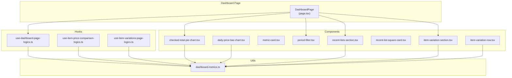
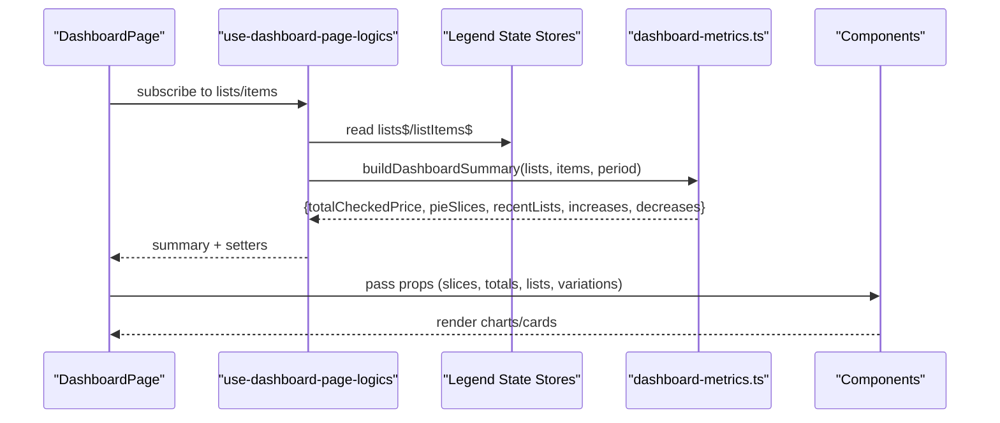
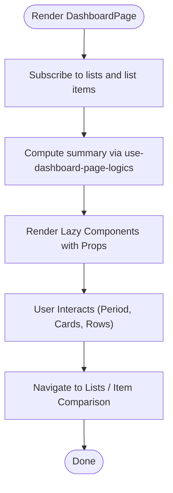
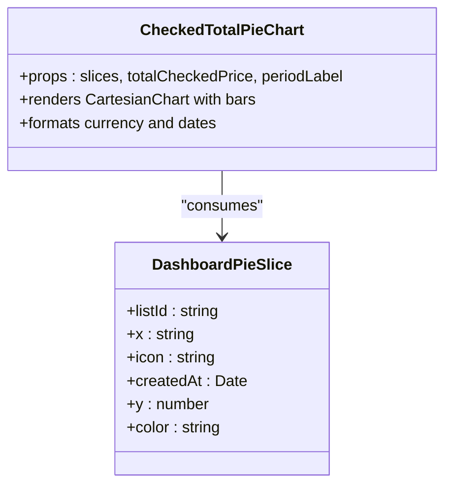
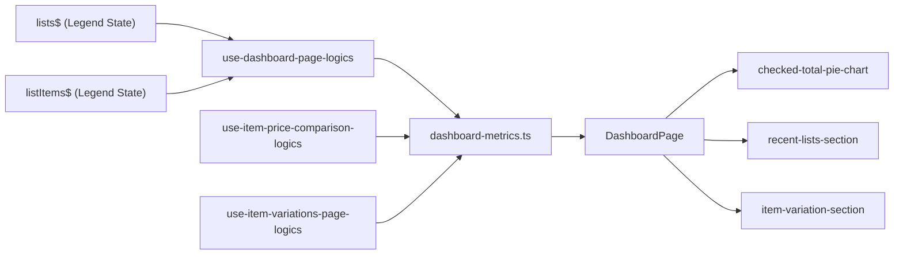

# Dashboard and Analytics

<cite>
**Referenced Files in This Document**
- [src/features/dashboard/page.tsx](file://src/features/dashboard/page.tsx)
- [src/features/dashboard/index.ts](file://src/features/dashboard/index.ts)
- [src/features/dashboard/types.ts](file://src/features/dashboard/types.ts)
- [src/features/dashboard/hooks/use-dashboard-page-logics.ts](file://src/features/dashboard/hooks/use-dashboard-page-logics.ts)
- [src/features/dashboard/hooks/use-item-price-comparison-logics.ts](file://src/features/dashboard/hooks/use-item-price-comparison-logics.ts)
- [src/features/dashboard/hooks/use-item-variations-page-logics.ts](file://src/features/dashboard/hooks/use-item-variations-page-logics.ts)
- [src/features/dashboard/utils/dashboard-metrics.ts](file://src/features/dashboard/utils/dashboard-metrics.ts)
- [src/features/dashboard/components/checked-total-pie-chart.tsx](file://src/features/dashboard/components/checked-total-pie-chart.tsx)
- [src/features/dashboard/components/daily-price-bar-chart.tsx](file://src/features/dashboard/components/daily-price-bar-chart.tsx)
- [src/features/dashboard/components/metric-card.tsx](file://src/features/dashboard/components/metric-card.tsx)
- [src/features/dashboard/components/period-filter.tsx](file://src/features/dashboard/components/period-filter.tsx)
- [src/features/dashboard/components/recent-list-square-card.tsx](file://src/features/dashboard/components/recent-list-square-card.tsx)
- [src/features/dashboard/components/recent-lists-section.tsx](file://src/features/dashboard/components/recent-lists-section.tsx)
- [src/features/dashboard/components/item-variation-row.tsx](file://src/features/dashboard/components/item-variation-row.tsx)
- [src/features/dashboard/components/item-variation-section.tsx](file://src/features/dashboard/components/item-variation-section.tsx)
</cite>

## Table of Contents
1. [Introduction](#introduction)
2. [Project Structure](#project-structure)
3. [Core Components](#core-components)
4. [Architecture Overview](#architecture-overview)
5. [Detailed Component Analysis](#detailed-component-analysis)
6. [Dependency Analysis](#dependency-analysis)
7. [Performance Considerations](#performance-considerations)
8. [Troubleshooting Guide](#troubleshooting-guide)
9. [Conclusion](#conclusion)
10. [Appendices](#appendices)

## Introduction
This document describes the PowerLists dashboard and analytics system. It covers the dashboard overview components (checked total visualization, daily price visualization, recent lists, and item variation trends), the underlying algorithms for metrics computation and data aggregation, real-time updates via reactive state, and the integration with Victory Native for visualization. It also documents the period filter, recent activity tracking, and practical guidance for customization, metric interpretation, and deriving analytical insights.

## Project Structure
The dashboard feature is organized by concerns:
- Page orchestrator renders the dashboard UI and composes lazy-loaded components.
- Hooks encapsulate reactive state subscriptions and derived computations.
- Utilities implement analytics algorithms and data transformations.
- Components render charts and cards using Victory Native and shared UI primitives.

**Diagram sources**
- [src/features/dashboard/page.tsx:49-132](file://src/features/dashboard/page.tsx#L49-L132)
- [src/features/dashboard/hooks/use-dashboard-page-logics.ts:41-97](file://src/features/dashboard/hooks/use-dashboard-page-logics.ts#L41-L97)
- [src/features/dashboard/hooks/use-item-price-comparison-logics.ts:32-81](file://src/features/dashboard/hooks/use-item-price-comparison-logics.ts#L32-L81)
- [src/features/dashboard/hooks/use-item-variations-page-logics.ts:33-93](file://src/features/dashboard/hooks/use-item-variations-page-logics.ts#L33-L93)
- [src/features/dashboard/utils/dashboard-metrics.ts:389-420](file://src/features/dashboard/utils/dashboard-metrics.ts#L389-L420)
- [src/features/dashboard/components/checked-total-pie-chart.tsx:34-181](file://src/features/dashboard/components/checked-total-pie-chart.tsx#L34-L181)
- [src/features/dashboard/components/daily-price-bar-chart.tsx:16-84](file://src/features/dashboard/components/daily-price-bar-chart.tsx#L16-L84)
- [src/features/dashboard/components/period-filter.tsx:13-34](file://src/features/dashboard/components/period-filter.tsx#L13-L34)
- [src/features/dashboard/components/recent-lists-section.tsx:15-42](file://src/features/dashboard/components/recent-lists-section.tsx#L15-L42)
- [src/features/dashboard/components/item-variation-section.tsx:18-69](file://src/features/dashboard/components/item-variation-section.tsx#L18-L69)

**Section sources**
- [src/features/dashboard/page.tsx:1-135](file://src/features/dashboard/page.tsx#L1-L135)
- [src/features/dashboard/index.ts:1-7](file://src/features/dashboard/index.ts#L1-L7)

## Core Components
- Dashboard page orchestrator:
  - Renders a responsive layout with a period filter, checked total visualization, recent lists carousel, and item variation highlights.
  - Uses lazy loading for components and suspense fallbacks for smooth UX.
  - Integrates navigation to list and item comparison screens.
- Period filter:
  - Provides quick selection among “All”, “Week”, “Month”, and “Year” periods.
- Checked total visualization:
  - Bar chart showing checked totals per list with theme-aware colors and responsive sizing.
- Recent lists section:
  - Horizontal scrollable grid of recent lists with key metrics.
- Item variation section:
  - Highlights top increases and decreases across items, with directional indicators and recent change percent.

**Section sources**
- [src/features/dashboard/page.tsx:49-132](file://src/features/dashboard/page.tsx#L49-L132)
- [src/features/dashboard/components/period-filter.tsx:13-34](file://src/features/dashboard/components/period-filter.tsx#L13-L34)
- [src/features/dashboard/components/checked-total-pie-chart.tsx:34-181](file://src/features/dashboard/components/checked-total-pie-chart.tsx#L34-L181)
- [src/features/dashboard/components/recent-lists-section.tsx:15-42](file://src/features/dashboard/components/recent-lists-section.tsx#L15-L42)
- [src/features/dashboard/components/item-variation-section.tsx:18-69](file://src/features/dashboard/components/item-variation-section.tsx#L18-L69)

## Architecture Overview
The dashboard follows a reactive architecture:
- State subscription:
  - Hooks subscribe to Legend state stores for lists and list items.
- Derived computations:
  - Metrics and visual summaries are computed from raw data and cached per period.
- Rendering:
  - Components receive props from hooks and render charts and cards.
- Navigation:
  - Router-driven navigation to list and item comparison pages.

**Diagram sources**
- [src/features/dashboard/page.tsx:49-132](file://src/features/dashboard/page.tsx#L49-L132)
- [src/features/dashboard/hooks/use-dashboard-page-logics.ts:41-97](file://src/features/dashboard/hooks/use-dashboard-page-logics.ts#L41-L97)
- [src/features/dashboard/utils/dashboard-metrics.ts:389-420](file://src/features/dashboard/utils/dashboard-metrics.ts#L389-L420)

## Detailed Component Analysis

### Dashboard Page Orchestration
- Responsibilities:
  - Manage period state and navigation handlers.
  - Compose lazy-loaded components and provide suspense fallbacks.
  - Pass derived props to child components.
- Reactive updates:
  - Subscribes to lists and list items state; recomputes summary on data changes.
- Navigation:
  - Routes to lists, individual list, and item comparison views.

**Diagram sources**
- [src/features/dashboard/page.tsx:49-132](file://src/features/dashboard/page.tsx#L49-L132)
- [src/features/dashboard/hooks/use-dashboard-page-logics.ts:41-97](file://src/features/dashboard/hooks/use-dashboard-page-logics.ts#L41-L97)

**Section sources**
- [src/features/dashboard/page.tsx:49-132](file://src/features/dashboard/page.tsx#L49-L132)

### Period Filter
- Purpose:
  - Switch between historical windows: all, week, month, year.
- Behavior:
  - Controlled tab selection updates the parent’s period state.

**Section sources**
- [src/features/dashboard/components/period-filter.tsx:13-34](file://src/features/dashboard/components/period-filter.tsx#L13-L34)

### Checked Total Visualization (Pie-style Bar Chart)
- Purpose:
  - Show distribution of checked totals across lists and the overall total for the selected period.
- Implementation highlights:
  - Converts accent tokens to theme colors.
  - Responsive chart width based on number of bars and screen width.
  - Horizontal scrolling container for small screens.
  - Empty state when no data is available.
- Data model:
  - Consumes DashboardPieSlice and totalCheckedPrice.

**Diagram sources**
- [src/features/dashboard/components/checked-total-pie-chart.tsx:34-181](file://src/features/dashboard/components/checked-total-pie-chart.tsx#L34-L181)
- [src/features/dashboard/types.ts:15-22](file://src/features/dashboard/types.ts#L15-L22)

**Section sources**
- [src/features/dashboard/components/checked-total-pie-chart.tsx:34-181](file://src/features/dashboard/components/checked-total-pie-chart.tsx#L34-L181)
- [src/features/dashboard/types.ts:15-22](file://src/features/dashboard/types.ts#L15-L22)

### Daily Price Visualization
- Purpose:
  - Display average unit price per day for a selected item across the chosen period.
- Implementation highlights:
  - Builds a daily series by aggregating multiple entries per day into an average.
  - Uses Victory Native CartesianChart with rounded bars.
  - Fallback message when insufficient history exists.

**Section sources**
- [src/features/dashboard/components/daily-price-bar-chart.tsx:16-84](file://src/features/dashboard/components/daily-price-bar-chart.tsx#L16-L84)
- [src/features/dashboard/utils/dashboard-metrics.ts:161-195](file://src/features/dashboard/utils/dashboard-metrics.ts#L161-L195)

### Recent Lists Section
- Purpose:
  - Showcase the most recently updated lists with key metrics (count, total, checked total).
- Implementation highlights:
  - Horizontal scroll for compact layout.
  - Navigation to a specific list on press.
  - Empty state when no lists are present.

**Section sources**
- [src/features/dashboard/components/recent-lists-section.tsx:15-42](file://src/features/dashboard/components/recent-lists-section.tsx#L15-L42)
- [src/features/dashboard/components/recent-list-square-card.tsx:18-47](file://src/features/dashboard/components/recent-list-square-card.tsx#L18-L47)
- [src/features/dashboard/types.ts:24-33](file://src/features/dashboard/types.ts#L24-L33)

### Item Variation Section
- Purpose:
  - Highlight top increases and decreases in unit price for items during the selected period.
- Implementation highlights:
  - Splits variations into increases and decreases.
  - Displays top N per column with directional badges.
  - Navigation to item comparison page with context.

**Section sources**
- [src/features/dashboard/components/item-variation-section.tsx:18-69](file://src/features/dashboard/components/item-variation-section.tsx#L18-L69)
- [src/features/dashboard/components/item-variation-row.tsx:14-50](file://src/features/dashboard/components/item-variation-row.tsx#L14-L50)
- [src/features/dashboard/types.ts:37-51](file://src/features/dashboard/types.ts#L37-L51)

### Metric Cards
- Purpose:
  - Present KPIs in a consistent card layout.
- Implementation highlights:
  - Minimal card with title, value, optional subtitle, and optional value styling.

**Section sources**
- [src/features/dashboard/components/metric-card.tsx:14-30](file://src/features/dashboard/components/metric-card.tsx#L14-L30)

## Dependency Analysis
- State management:
  - Hooks subscribe to Legend state stores for lists and list items.
- Data transformation:
  - dashboard-metrics.ts centralizes filtering, grouping, aggregation, and splitting logic.
- Visualization:
  - Victory Native components consume typed data structures and theme variables.
- Navigation:
  - Expo Router is used for programmatic navigation.

**Diagram sources**
- [src/features/dashboard/hooks/use-dashboard-page-logics.ts:41-97](file://src/features/dashboard/hooks/use-dashboard-page-logics.ts#L41-L97)
- [src/features/dashboard/hooks/use-item-price-comparison-logics.ts:32-81](file://src/features/dashboard/hooks/use-item-price-comparison-logics.ts#L32-L81)
- [src/features/dashboard/hooks/use-item-variations-page-logics.ts:33-93](file://src/features/dashboard/hooks/use-item-variations-page-logics.ts#L33-L93)
- [src/features/dashboard/utils/dashboard-metrics.ts:389-420](file://src/features/dashboard/utils/dashboard-metrics.ts#L389-L420)
- [src/features/dashboard/page.tsx:49-132](file://src/features/dashboard/page.tsx#L49-L132)

**Section sources**
- [src/features/dashboard/hooks/use-dashboard-page-logics.ts:41-97](file://src/features/dashboard/hooks/use-dashboard-page-logics.ts#L41-L97)
- [src/features/dashboard/hooks/use-item-price-comparison-logics.ts:32-81](file://src/features/dashboard/hooks/use-item-price-comparison-logics.ts#L32-L81)
- [src/features/dashboard/hooks/use-item-variations-page-logics.ts:33-93](file://src/features/dashboard/hooks/use-item-variations-page-logics.ts#L33-L93)
- [src/features/dashboard/utils/dashboard-metrics.ts:389-420](file://src/features/dashboard/utils/dashboard-metrics.ts#L389-L420)

## Performance Considerations
- Memoization and caching:
  - use-dashboard-page-logics caches summary per period to avoid recomputation on re-renders.
  - useMemo is used to derive normalized lists and items and to compute summary.
- Lazy loading:
  - Components are loaded lazily with Suspense fallbacks to reduce initial bundle size and improve perceived performance.
- Efficient aggregation:
  - Grouping by list ID and by normalized item title minimizes repeated scans.
  - Daily series aggregation averages multiple entries per day to reduce noise.
- Theme resolution:
  - Color resolution occurs once per render and is reused across bars.
- Window sizing:
  - Dynamic chart width prevents unnecessary horizontal scrolling and improves readability.

[No sources needed since this section provides general guidance]

## Troubleshooting Guide
- No data shown in charts:
  - Verify that lists and list items state is populated; the page indicates loading while either store is null.
  - Ensure items have valid timestamps; filtering relies on updatedAt/createdAt.
- Colors not rendering:
  - Accent tokens are resolved to theme colors; confirm theme variables are available.
- Empty recent lists:
  - Recent lists are derived from the most recently created lists; check list creation timestamps.
- Item comparison missing data:
  - Item variations require at least one priced entry; confirm items have price > 0 and are within the selected period.

**Section sources**
- [src/features/dashboard/page.tsx:50-51](file://src/features/dashboard/page.tsx#L50-L51)
- [src/features/dashboard/utils/dashboard-metrics.ts:25-37](file://src/features/dashboard/utils/dashboard-metrics.ts#L25-L37)
- [src/features/dashboard/components/checked-total-pie-chart.tsx:52-58](file://src/features/dashboard/components/checked-total-pie-chart.tsx#L52-L58)

## Conclusion
The PowerLists dashboard integrates reactive state, efficient data aggregation, and clean visualizations to deliver actionable insights. The modular design enables easy customization, while the period filter and real-time updates keep the analytics fresh and relevant. The Victory Native integration provides flexible, theme-aware charts suitable for both desktop and mobile contexts.

[No sources needed since this section summarizes without analyzing specific files]

## Appendices

### Dashboard Metrics Calculation Algorithms
- Period filtering:
  - Filters items by period boundaries using timestamps.
- Checked total:
  - Sums checked items’ total price per list and overall.
- Recent lists:
  - Sorts lists by creation/update time and computes totals and checked totals.
- Pie slices:
  - Aggregates checked totals per list with accent color tokens.
- Item variations:
  - Groups items by normalized title, sorts by date, and computes min/max/average/first/last unit prices, change percent, and direction.
  - Builds daily series by averaging multiple entries per day.
- Splitting increases/decreases:
  - Sorts by change percent to highlight extremes.
- Average daily variation:
  - Computes mean daily percent change across the daily series.

**Section sources**
- [src/features/dashboard/utils/dashboard-metrics.ts:65-88](file://src/features/dashboard/utils/dashboard-metrics.ts#L65-L88)
- [src/features/dashboard/utils/dashboard-metrics.ts:100-130](file://src/features/dashboard/utils/dashboard-metrics.ts#L100-L130)
- [src/features/dashboard/utils/dashboard-metrics.ts:132-152](file://src/features/dashboard/utils/dashboard-metrics.ts#L132-L152)
- [src/features/dashboard/utils/dashboard-metrics.ts:197-250](file://src/features/dashboard/utils/dashboard-metrics.ts#L197-L250)
- [src/features/dashboard/utils/dashboard-metrics.ts:325-348](file://src/features/dashboard/utils/dashboard-metrics.ts#L325-L348)
- [src/features/dashboard/utils/dashboard-metrics.ts:350-360](file://src/features/dashboard/utils/dashboard-metrics.ts#L350-L360)
- [src/features/dashboard/utils/dashboard-metrics.ts:370-387](file://src/features/dashboard/utils/dashboard-metrics.ts#L370-L387)

### Data Aggregation Strategies
- Grouping:
  - Items grouped by list ID for per-list metrics and by normalized item title for variations.
- Averaging:
  - Daily series aggregates multiple entries per day into an average unit price.
- Sorting:
  - Lists by recency, items by date, and variations by change percent.

**Section sources**
- [src/features/dashboard/utils/dashboard-metrics.ts:90-98](file://src/features/dashboard/utils/dashboard-metrics.ts#L90-L98)
- [src/features/dashboard/utils/dashboard-metrics.ts:161-195](file://src/features/dashboard/utils/dashboard-metrics.ts#L161-L195)
- [src/features/dashboard/utils/dashboard-metrics.ts:331-347](file://src/features/dashboard/utils/dashboard-metrics.ts#L331-L347)

### Real-Time Updates and Reactive Data
- State subscription:
  - Hooks subscribe to Legend state stores for lists and list items.
- Recompute on change:
  - Effects clear caches when data changes; memoized computations rebuild summaries.
- Lazy components:
  - Reduce initial load and improve responsiveness during frequent updates.

**Section sources**
- [src/features/dashboard/hooks/use-dashboard-page-logics.ts:47-78](file://src/features/dashboard/hooks/use-dashboard-page-logics.ts#L47-L78)
- [src/features/dashboard/page.tsx:12-30](file://src/features/dashboard/page.tsx#L12-L30)

### Period Filter Functionality
- Options:
  - All, Week, Month, Year.
- Labeling:
  - Localized labels for the selected period.

**Section sources**
- [src/features/dashboard/components/period-filter.tsx:13-34](file://src/features/dashboard/components/period-filter.tsx#L13-L34)
- [src/features/dashboard/utils/dashboard-metrics.ts:407-412](file://src/features/dashboard/utils/dashboard-metrics.ts#L407-L412)

### Recent Activity Tracking
- Lists:
  - Derived from list creation/update timestamps.
- Items:
  - Derived from item timestamps; filtered by period.

**Section sources**
- [src/features/dashboard/utils/dashboard-metrics.ts:105-130](file://src/features/dashboard/utils/dashboard-metrics.ts#L105-L130)
- [src/features/dashboard/utils/dashboard-metrics.ts:25-37](file://src/features/dashboard/utils/dashboard-metrics.ts#L25-L37)

### Performance Optimization Techniques
- Memoization:
  - Normalization and sorting are memoized; summary is cached per period.
- Lazy loading:
  - Components are lazy-loaded with Suspense fallbacks.
- Responsive charts:
  - Dynamic widths prevent overflow and improve readability.

**Section sources**
- [src/features/dashboard/hooks/use-dashboard-page-logics.ts:52-88](file://src/features/dashboard/hooks/use-dashboard-page-logics.ts#L52-L88)
- [src/features/dashboard/components/checked-total-pie-chart.tsx:92-96](file://src/features/dashboard/components/checked-total-pie-chart.tsx#L92-L96)

### Integration with Victory Native
- Charts:
  - CartesianChart renders bars with rounded corners and theme-aware axes.
- Theming:
  - Colors resolved from theme variables; fallbacks provided.
- Responsiveness:
  - Scroll containers and dynamic widths adapt to content and screen size.

**Section sources**
- [src/features/dashboard/components/checked-total-pie-chart.tsx:42-80](file://src/features/dashboard/components/checked-total-pie-chart.tsx#L42-L80)
- [src/features/dashboard/components/daily-price-bar-chart.tsx:24-37](file://src/features/dashboard/components/daily-price-bar-chart.tsx#L24-L37)

### Reactive Data Updates from State Management
- Subscription:
  - useValue subscribes to Legend state stores.
- Derivation:
  - useMemo derives normalized data and summary.
- Navigation:
  - Router params carry context for item comparisons.

**Section sources**
- [src/features/dashboard/hooks/use-dashboard-page-logics.ts:47-74](file://src/features/dashboard/hooks/use-dashboard-page-logics.ts#L47-L74)
- [src/features/dashboard/hooks/use-item-price-comparison-logics.ts:43-67](file://src/features/dashboard/hooks/use-item-price-comparison-logics.ts#L43-L67)

### Examples of Dashboard Customization
- Add new metric cards:
  - Use MetricCard with custom title/value/subtitle.
- Extend period options:
  - Add new period option in types and update label resolver.
- Customize chart appearance:
  - Adjust bar colors, corner radii, and axis formatting in chart components.
- Change recent lists count:
  - Modify the count parameter in buildRecentListCards.

**Section sources**
- [src/features/dashboard/components/metric-card.tsx:14-30](file://src/features/dashboard/components/metric-card.tsx#L14-L30)
- [src/features/dashboard/utils/dashboard-metrics.ts:105-114](file://src/features/dashboard/utils/dashboard-metrics.ts#L105-L114)
- [src/features/dashboard/components/checked-total-pie-chart.tsx:146-155](file://src/features/dashboard/components/checked-total-pie-chart.tsx#L146-L155)

### Metric Interpretation and Analytical Insights
- Checked total per list:
  - Indicates contribution to spending; compare across lists to identify hotspots.
- Daily price trends:
  - Detect volatility and seasonal patterns; use average daily variation to quantify stability.
- Item variations:
  - Increases suggest rising costs or availability issues; decreases suggest discounts or supply improvements.
- Recent lists:
  - Track engagement and spending spikes around newly created lists.

**Section sources**
- [src/features/dashboard/utils/dashboard-metrics.ts:370-387](file://src/features/dashboard/utils/dashboard-metrics.ts#L370-L387)
- [src/features/dashboard/components/item-variation-row.tsx:14-48](file://src/features/dashboard/components/item-variation-row.tsx#L14-L48)