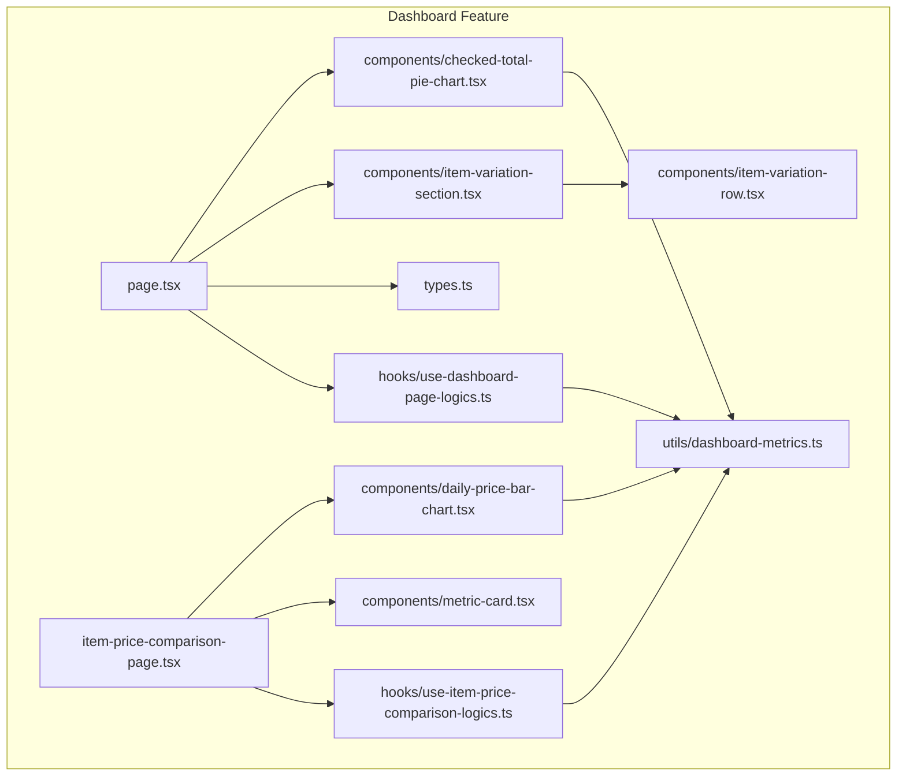
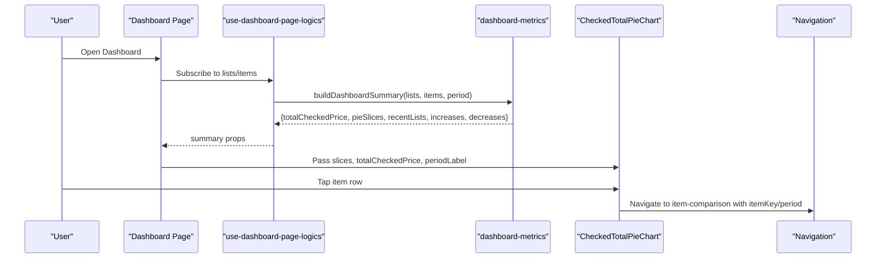
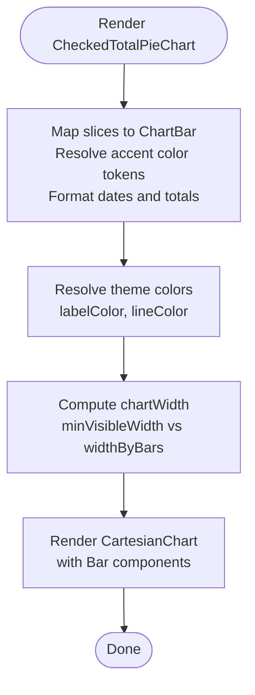
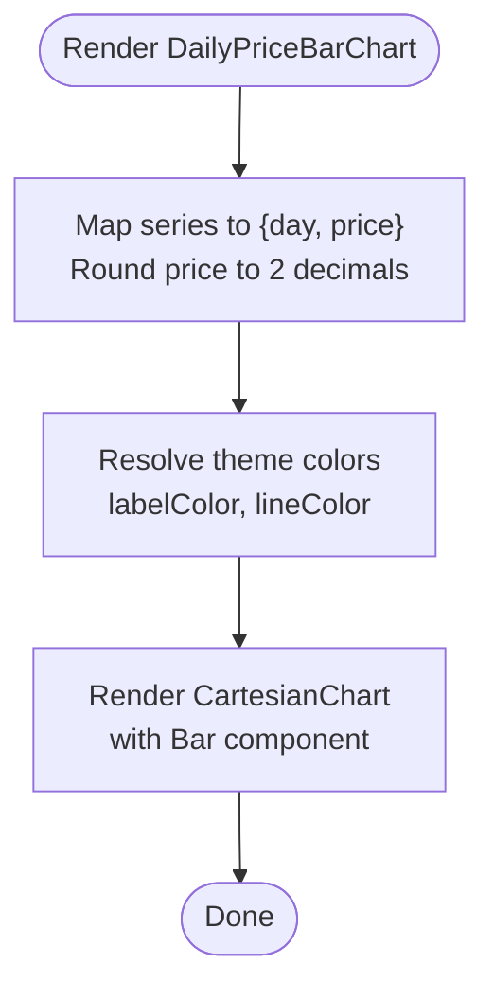
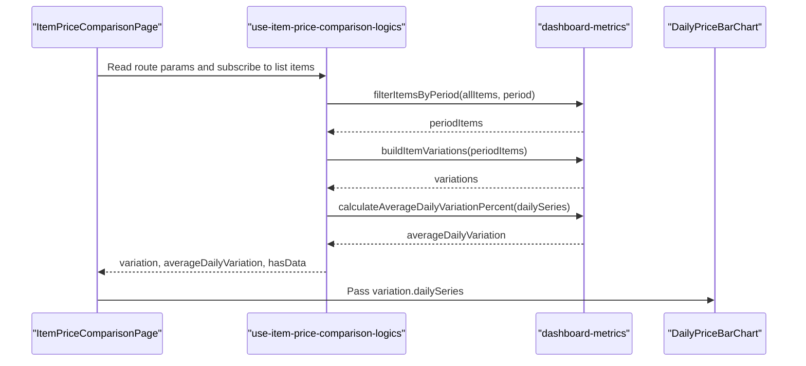
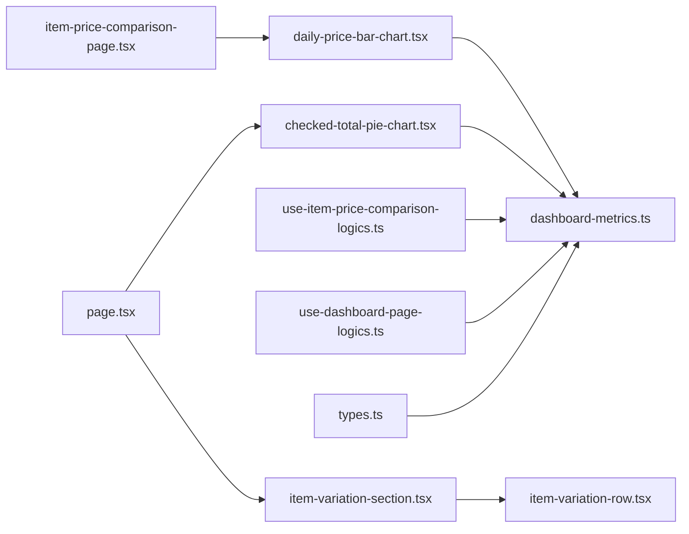

# Data Visualization and Charts

<cite>
**Referenced Files in This Document**
- [checked-total-pie-chart.tsx](file://src/features/dashboard/components/checked-total-pie-chart.tsx)
- [daily-price-bar-chart.tsx](file://src/features/dashboard/components/daily-price-bar-chart.tsx)
- [item-variation-row.tsx](file://src/features/dashboard/components/item-variation-row.tsx)
- [item-variation-section.tsx](file://src/features/dashboard/components/item-variation-section.tsx)
- [metric-card.tsx](file://src/features/dashboard/components/metric-card.tsx)
- [dashboard-metrics.ts](file://src/features/dashboard/utils/dashboard-metrics.ts)
- [use-dashboard-page-logics.ts](file://src/features/dashboard/hooks/use-dashboard-page-logics.ts)
- [use-item-price-comparison-logics.ts](file://src/features/dashboard/hooks/use-item-price-comparison-logics.ts)
- [page.tsx](file://src/features/dashboard/page.tsx)
- [item-price-comparison-page.tsx](file://src/features/dashboard/item-price-comparison-page.tsx)
- [index.ts](file://src/features/dashboard/components/index.ts)
- [types.ts](file://src/features/dashboard/types.ts)
</cite>

## Table of Contents
1. [Introduction](#introduction)
2. [Project Structure](#project-structure)
3. [Core Components](#core-components)
4. [Architecture Overview](#architecture-overview)
5. [Detailed Component Analysis](#detailed-component-analysis)
6. [Dependency Analysis](#dependency-analysis)
7. [Performance Considerations](#performance-considerations)
8. [Troubleshooting Guide](#troubleshooting-guide)
9. [Conclusion](#conclusion)

## Introduction
This document explains the dashboard data visualization components and their integration with Victory Native for rendering charts. It covers:
- The checked total pie chart (bar chart variant) implementation, including slice calculations, percentage computations, and visual styling.
- The daily price bar chart with data point aggregation, time series visualization, and responsive sizing.
- The item price comparison logic, including historical data retrieval, price trend analysis, and comparative calculations.
- Integration with Victory Native, data formatting requirements, and responsive chart sizing.
- Customization options, color schemes, and performance optimization techniques for large datasets.

## Project Structure
The dashboard visualization features are organized under the dashboard feature folder. Key files include:
- Components for charts and sections
- Hooks for data fetching and transformations
- Utility functions for metrics and aggregations
- Page integrations that render lazy-loaded components

**Diagram sources**
- [page.tsx:1-135](file://src/features/dashboard/page.tsx#L1-L135)
- [item-price-comparison-page.tsx:1-104](file://src/features/dashboard/item-price-comparison-page.tsx#L1-L104)
- [checked-total-pie-chart.tsx:1-184](file://src/features/dashboard/components/checked-total-pie-chart.tsx#L1-L184)
- [daily-price-bar-chart.tsx:1-85](file://src/features/dashboard/components/daily-price-bar-chart.tsx#L1-L85)
- [item-variation-section.tsx:1-70](file://src/features/dashboard/components/item-variation-section.tsx#L1-L70)
- [item-variation-row.tsx:1-51](file://src/features/dashboard/components/item-variation-row.tsx#L1-L51)
- [metric-card.tsx:1-31](file://src/features/dashboard/components/metric-card.tsx#L1-L31)
- [use-dashboard-page-logics.ts:1-98](file://src/features/dashboard/hooks/use-dashboard-page-logics.ts#L1-L98)
- [use-item-price-comparison-logics.ts:1-82](file://src/features/dashboard/hooks/use-item-price-comparison-logics.ts#L1-L82)
- [dashboard-metrics.ts:1-421](file://src/features/dashboard/utils/dashboard-metrics.ts#L1-L421)
- [types.ts:1-65](file://src/features/dashboard/types.ts#L1-L65)

**Section sources**
- [index.ts:1-9](file://src/features/dashboard/components/index.ts#L1-L9)
- [types.ts:1-65](file://src/features/dashboard/types.ts#L1-L65)

## Core Components
- Checked Total Pie Chart (bar chart): Renders a horizontal bar chart representing checked purchases per list, with dynamic width, theme-aware colors, and scrollable container.
- Daily Price Bar Chart: Renders a vertical bar chart of average unit price per day, with theme-aware axes and fixed height container.
- Item Variation Section: Displays top increases and decreases in item prices, with navigation to the item comparison page.
- Metric Card: A reusable card for displaying KPIs such as totals, averages, and deltas.
- Hooks and Utilities: Provide data filtering, aggregation, and transformation for charts and comparisons.

**Section sources**
- [checked-total-pie-chart.tsx:1-184](file://src/features/dashboard/components/checked-total-pie-chart.tsx#L1-L184)
- [daily-price-bar-chart.tsx:1-85](file://src/features/dashboard/components/daily-price-bar-chart.tsx#L1-L85)
- [item-variation-section.tsx:1-70](file://src/features/dashboard/components/item-variation-section.tsx#L1-L70)
- [item-variation-row.tsx:1-51](file://src/features/dashboard/components/item-variation-row.tsx#L1-L51)
- [metric-card.tsx:1-31](file://src/features/dashboard/components/metric-card.tsx#L1-L31)
- [use-dashboard-page-logics.ts:1-98](file://src/features/dashboard/hooks/use-dashboard-page-logics.ts#L1-L98)
- [use-item-price-comparison-logics.ts:1-82](file://src/features/dashboard/hooks/use-item-price-comparison-logics.ts#L1-L82)
- [dashboard-metrics.ts:1-421](file://src/features/dashboard/utils/dashboard-metrics.ts#L1-L421)

## Architecture Overview
The dashboard integrates lazy-loaded components with hooks that compute summaries and item variations. Victory Native renders charts with theme-aware styling and responsive sizing.

**Diagram sources**
- [page.tsx:49-132](file://src/features/dashboard/page.tsx#L49-L132)
- [use-dashboard-page-logics.ts:41-97](file://src/features/dashboard/hooks/use-dashboard-page-logics.ts#L41-L97)
- [dashboard-metrics.ts:389-405](file://src/features/dashboard/utils/dashboard-metrics.ts#L389-L405)
- [checked-total-pie-chart.tsx:34-183](file://src/features/dashboard/components/checked-total-pie-chart.tsx#L34-L183)

## Detailed Component Analysis

### Checked Total Pie Chart (Bar Chart Variant)
- Purpose: Visualize checked purchase totals per list with a horizontal bar chart.
- Slice calculations:
  - Aggregates checked items by list and computes total price per list.
  - Produces DashboardPieSlice entries with list metadata and computed values.
- Percentage computations:
  - Not a pie chart; however, percentages can be derived from individual slice totals and the overall totalCheckedPrice.
- Visual styling and responsive sizing:
  - Theme-aware colors resolved from accent tokens to hex values.
  - Dynamic chart width based on number of bars and screen width.
  - Scrollable container for small screens; fixed height container for consistent layout.
  - Axis labels and ticks configured with theme colors and fonts.
- Integration with Victory Native:
  - Uses CartesianChart and Bar primitives.
  - Rounds bar tops for visual appeal.

**Diagram sources**
- [checked-total-pie-chart.tsx:45-96](file://src/features/dashboard/components/checked-total-pie-chart.tsx#L45-L96)
- [dashboard-metrics.ts:132-152](file://src/features/dashboard/utils/dashboard-metrics.ts#L132-L152)

**Section sources**
- [checked-total-pie-chart.tsx:1-184](file://src/features/dashboard/components/checked-total-pie-chart.tsx#L1-L184)
- [dashboard-metrics.ts:132-152](file://src/features/dashboard/utils/dashboard-metrics.ts#L132-L152)

### Daily Price Bar Chart
- Purpose: Visualize average unit price over days as a bar chart.
- Data point aggregation:
  - Groups items by date key, sums amounts, and averages unit prices per day.
  - Produces DashboardDatePoint entries with averageUnitPrice and sampleCount.
- Time series visualization:
  - X-axis uses day labels; Y-axis shows currency-formatted values.
  - Fixed chart height for consistent appearance.
- Interactive features:
  - No interactive selection; static visualization.
- Integration with Victory Native:
  - Uses CartesianChart and Bar primitives with rounded corners.

**Diagram sources**
- [daily-price-bar-chart.tsx:17-78](file://src/features/dashboard/components/daily-price-bar-chart.tsx#L17-L78)
- [dashboard-metrics.ts:161-195](file://src/features/dashboard/utils/dashboard-metrics.ts#L161-L195)

**Section sources**
- [daily-price-bar-chart.tsx:1-85](file://src/features/dashboard/components/daily-price-bar-chart.tsx#L1-L85)
- [dashboard-metrics.ts:161-195](file://src/features/dashboard/utils/dashboard-metrics.ts#L161-L195)

### Item Price Comparison Logic
- Historical data retrieval:
  - Filters items by selected period using filterItemsByPeriod.
  - Builds item variations grouped by normalized title keys.
- Price trend analysis:
  - Computes first, previous, and last unit prices.
  - Calculates change percent and direction (increase/decrease/stable).
  - Computes average daily variation percent across consecutive days.
- Comparative calculations:
  - Provides min/max/average unit prices and total amount.
  - Exposes dailySeries for downstream charting.

**Diagram sources**
- [item-price-comparison-page.tsx:35-103](file://src/features/dashboard/item-price-comparison-page.tsx#L35-L103)
- [use-item-price-comparison-logics.ts:32-81](file://src/features/dashboard/hooks/use-item-price-comparison-logics.ts#L32-L81)
- [dashboard-metrics.ts:325-387](file://src/features/dashboard/utils/dashboard-metrics.ts#L325-L387)

**Section sources**
- [use-item-price-comparison-logics.ts:1-82](file://src/features/dashboard/hooks/use-item-price-comparison-logics.ts#L1-L82)
- [dashboard-metrics.ts:65-88](file://src/features/dashboard/utils/dashboard-metrics.ts#L65-L88)
- [dashboard-metrics.ts:197-250](file://src/features/dashboard/utils/dashboard-metrics.ts#L197-L250)
- [dashboard-metrics.ts:325-387](file://src/features/dashboard/utils/dashboard-metrics.ts#L325-L387)

### Integration with Victory Native, Data Formatting, and Responsive Sizing
- Victory Native integration:
  - CartesianChart is used for both bar charts with explicit xKey/yKeys and custom renderers via children functions.
  - Bar components receive points and chartBounds for precise rendering.
- Data formatting requirements:
  - Currency formatting via formatCurrency for labels and values.
  - Date formatting for X-axis labels using Intl.DateTimeFormat.
- Responsive chart sizing:
  - Screen width awareness for chart width calculation.
  - Fixed heights for consistent layouts; horizontal scrolling for overflow.

**Section sources**
- [checked-total-pie-chart.tsx:109-158](file://src/features/dashboard/components/checked-total-pie-chart.tsx#L109-L158)
- [daily-price-bar-chart.tsx:56-78](file://src/features/dashboard/components/daily-price-bar-chart.tsx#L56-L78)
- [dashboard-metrics.ts:43-49](file://src/features/dashboard/utils/dashboard-metrics.ts#L43-L49)

### Chart Customization Options, Color Schemes, and Animation Effects
- Color schemes:
  - Accent color tokens resolved to theme-specific hex values.
  - Theme variables for labelColor and lineColor ensure consistent visuals.
- Animation effects:
  - No explicit chart animations are present in the current implementation.
- Rounded corners:
  - Bars use roundedCorners for visual polish.

**Section sources**
- [checked-total-pie-chart.tsx:70-80](file://src/features/dashboard/components/checked-total-pie-chart.tsx#L70-L80)
- [daily-price-bar-chart.tsx:74-76](file://src/features/dashboard/components/daily-price-bar-chart.tsx#L74-L76)

## Dependency Analysis
The dashboard components rely on shared types, hooks, and utilities. The page orchestrates lazy-loaded components and passes computed props.

**Diagram sources**
- [types.ts:1-65](file://src/features/dashboard/types.ts#L1-L65)
- [dashboard-metrics.ts:1-421](file://src/features/dashboard/utils/dashboard-metrics.ts#L1-L421)
- [use-dashboard-page-logics.ts:1-98](file://src/features/dashboard/hooks/use-dashboard-page-logics.ts#L1-L98)
- [use-item-price-comparison-logics.ts:1-82](file://src/features/dashboard/hooks/use-item-price-comparison-logics.ts#L1-L82)
- [page.tsx:1-135](file://src/features/dashboard/page.tsx#L1-L135)
- [item-price-comparison-page.tsx:1-104](file://src/features/dashboard/item-price-comparison-page.tsx#L1-L104)
- [checked-total-pie-chart.tsx:1-184](file://src/features/dashboard/components/checked-total-pie-chart.tsx#L1-L184)
- [daily-price-bar-chart.tsx:1-85](file://src/features/dashboard/components/daily-price-bar-chart.tsx#L1-L85)
- [item-variation-section.tsx:1-70](file://src/features/dashboard/components/item-variation-section.tsx#L1-L70)
- [item-variation-row.tsx:1-51](file://src/features/dashboard/components/item-variation-row.tsx#L1-L51)

**Section sources**
- [page.tsx:1-135](file://src/features/dashboard/page.tsx#L1-L135)
- [item-price-comparison-page.tsx:1-104](file://src/features/dashboard/item-price-comparison-page.tsx#L1-L104)

## Performance Considerations
- Memoization:
  - useMemo is used to compute chart data and derived values, preventing unnecessary re-renders.
- Lazy loading:
  - Components are loaded lazily to reduce initial bundle size.
- Data grouping and aggregation:
  - Efficient Map-based grouping and Decimal-based arithmetic minimize overhead.
- Responsive sizing:
  - Dynamic width computation avoids excessive recomputation by basing on length and width.
- Recommendations:
  - For very large datasets, consider virtualized lists for item rows and pagination for series.
  - Debounce period changes to avoid frequent recomputations.
  - Use shallow equality checks for prop updates to further reduce re-renders.

[No sources needed since this section provides general guidance]

## Troubleshooting Guide
- Empty chart states:
  - Both charts display empty state messages when insufficient data is available.
- Navigation issues:
  - Ensure itemKey and period are passed correctly when navigating from the dashboard to the item comparison page.
- Theme mismatches:
  - Verify accent color tokens resolve to valid hex values via theme variables.
- Currency/date formatting:
  - Confirm locale and formatting functions are applied consistently across labels.

**Section sources**
- [checked-total-pie-chart.tsx:162-166](file://src/features/dashboard/components/checked-total-pie-chart.tsx#L162-L166)
- [daily-price-bar-chart.tsx:38-46](file://src/features/dashboard/components/daily-price-bar-chart.tsx#L38-L46)
- [item-price-comparison-page.tsx:64-73](file://src/features/dashboard/item-price-comparison-page.tsx#L64-L73)

## Conclusion
The dashboard visualization components leverage Victory Native to render responsive and theme-aware charts. The checked total bar chart aggregates checked purchases per list, while the daily price bar chart displays average unit prices over time. The item price comparison page provides detailed trend analysis and KPIs. Hooks and utilities encapsulate data processing, ensuring maintainability and scalability.

[No sources needed since this section summarizes without analyzing specific files]