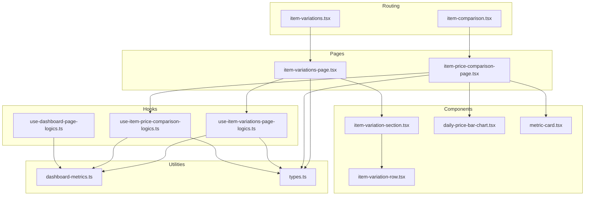
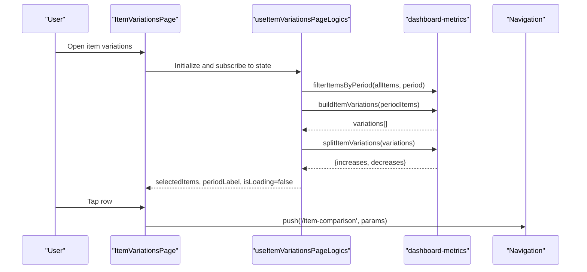
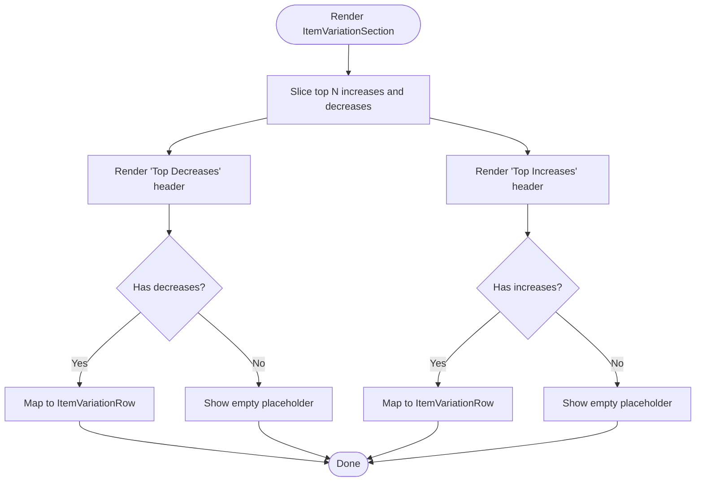
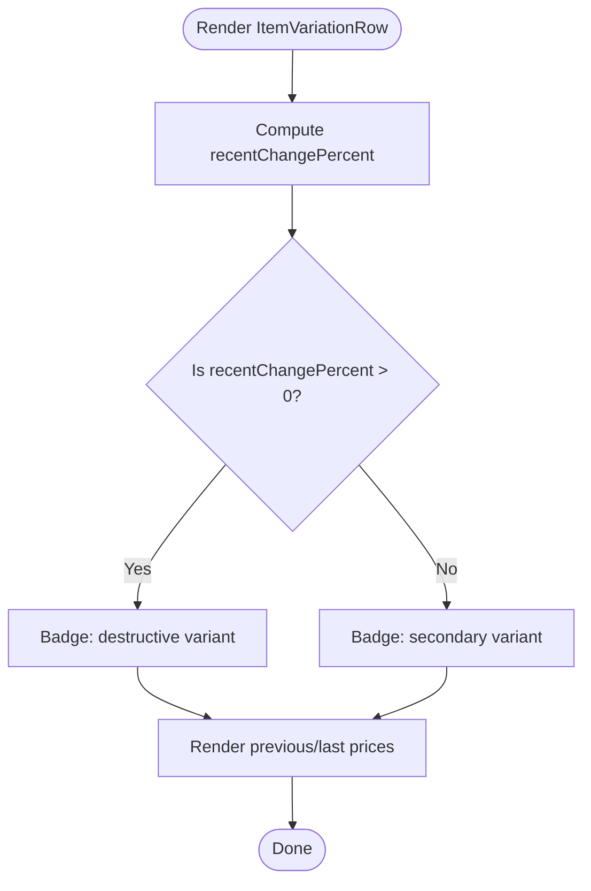
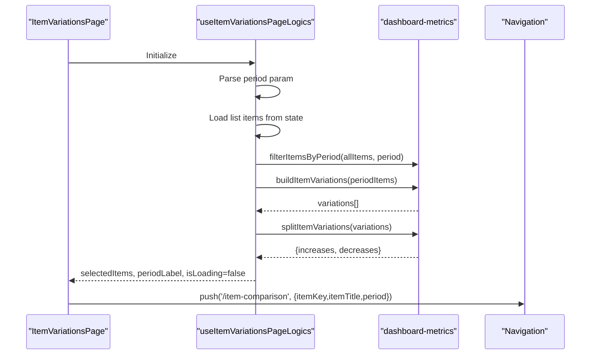
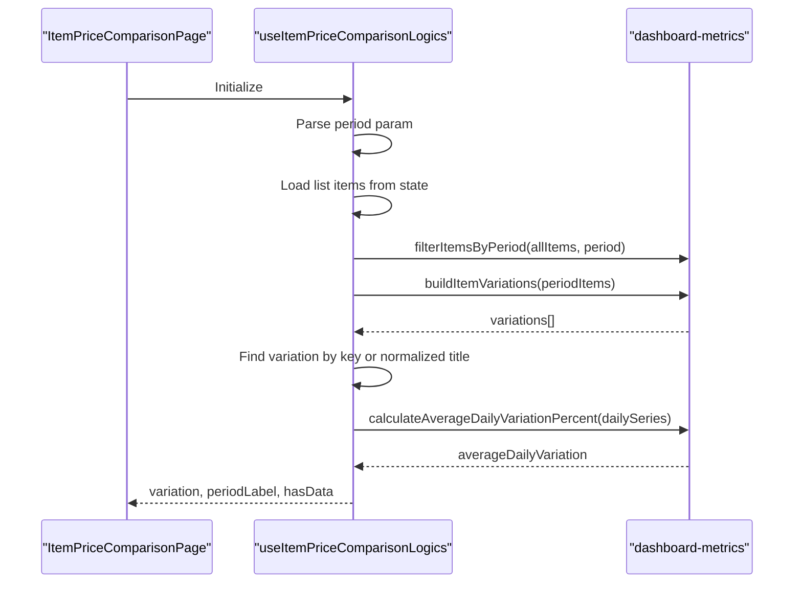
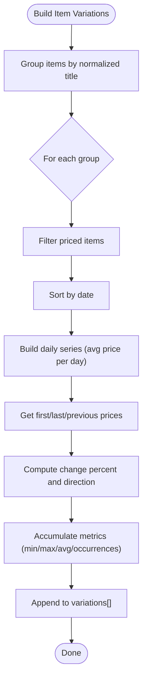
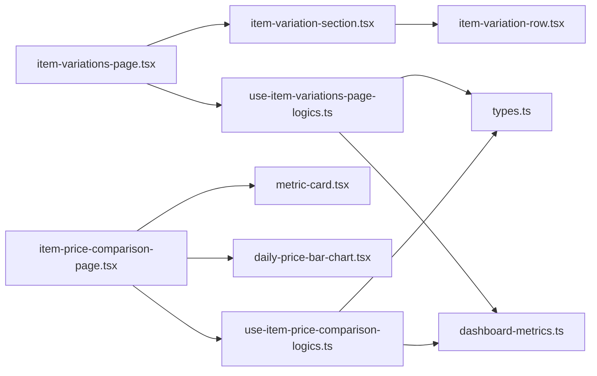

# Item Variations and Price Analysis

<cite>
**Referenced Files in This Document**
- [item-variations.tsx](file://src/app/(authenticated)/item-variations.tsx)
- [item-comparison.tsx](file://src/app/(authenticated)/item-comparison.tsx)
- [item-variations-page.tsx](file://src/features/dashboard/item-variations-page.tsx)
- [item-price-comparison-page.tsx](file://src/features/dashboard/item-price-comparison-page.tsx)
- [item-variation-section.tsx](file://src/features/dashboard/components/item-variation-section.tsx)
- [item-variation-row.tsx](file://src/features/dashboard/components/item-variation-row.tsx)
- [daily-price-bar-chart.tsx](file://src/features/dashboard/components/daily-price-bar-chart.tsx)
- [metric-card.tsx](file://src/features/dashboard/components/metric-card.tsx)
- [use-item-variations-page-logics.ts](file://src/features/dashboard/hooks/use-item-variations-page-logics.ts)
- [use-item-price-comparison-logics.ts](file://src/features/dashboard/hooks/use-item-price-comparison-logics.ts)
- [use-dashboard-page-logics.ts](file://src/features/dashboard/hooks/use-dashboard-page-logics.ts)
- [dashboard-metrics.ts](file://src/features/dashboard/utils/dashboard-metrics.ts)
- [types.ts](file://src/features/dashboard/types.ts)
</cite>

## Table of Contents
1. [Introduction](#introduction)
2. [Project Structure](#project-structure)
3. [Core Components](#core-components)
4. [Architecture Overview](#architecture-overview)
5. [Detailed Component Analysis](#detailed-component-analysis)
6. [Dependency Analysis](#dependency-analysis)
7. [Performance Considerations](#performance-considerations)
8. [Troubleshooting Guide](#troubleshooting-guide)
9. [Conclusion](#conclusion)

## Introduction
This document explains the item variations and price analysis system. It covers:
- The item variation section component that displays top increases and decreases with interactive navigation
- The item variation row component that shows price change indicators, percentage calculations, and visual distinctions
- The item variations page logic that aggregates data, computes price comparisons, and performs trend analysis
- Integration with the item comparison page, navigation parameters, and filtering strategies
- Performance optimizations for large datasets, caching, and real-time updates

## Project Structure
The system spans routing, pages, components, hooks, and utilities:
- Routing entry points forward to dashboard pages
- Pages orchestrate UI and lazy-loading
- Components render rows and charts
- Hooks encapsulate data fetching, filtering, and computations
- Utilities implement data aggregation, grouping, and analytics

**Diagram sources**
- [item-variations.tsx](file://src/app/(authenticated)/item-variations.tsx#L1-L2)
- [item-comparison.tsx](file://src/app/(authenticated)/item-comparison.tsx#L1-L2)
- [item-variations-page.tsx:1-95](file://src/features/dashboard/item-variations-page.tsx#L1-L95)
- [item-price-comparison-page.tsx:1-104](file://src/features/dashboard/item-price-comparison-page.tsx#L1-L104)
- [item-variation-section.tsx:1-70](file://src/features/dashboard/components/item-variation-section.tsx#L1-L70)
- [item-variation-row.tsx:1-51](file://src/features/dashboard/components/item-variation-row.tsx#L1-L51)
- [daily-price-bar-chart.tsx:1-85](file://src/features/dashboard/components/daily-price-bar-chart.tsx#L1-L85)
- [metric-card.tsx:1-31](file://src/features/dashboard/components/metric-card.tsx#L1-L31)
- [use-item-variations-page-logics.ts:1-94](file://src/features/dashboard/hooks/use-item-variations-page-logics.ts#L1-L94)
- [use-item-price-comparison-logics.ts:1-82](file://src/features/dashboard/hooks/use-item-price-comparison-logics.ts#L1-L82)
- [use-dashboard-page-logics.ts:1-98](file://src/features/dashboard/hooks/use-dashboard-page-logics.ts#L1-L98)
- [dashboard-metrics.ts:1-421](file://src/features/dashboard/utils/dashboard-metrics.ts#L1-L421)
- [types.ts:1-65](file://src/features/dashboard/types.ts#L1-L65)

**Section sources**
- [item-variations.tsx](file://src/app/(authenticated)/item-variations.tsx#L1-L2)
- [item-comparison.tsx](file://src/app/(authenticated)/item-comparison.tsx#L1-L2)
- [item-variations-page.tsx:1-95](file://src/features/dashboard/item-variations-page.tsx#L1-L95)
- [item-price-comparison-page.tsx:1-104](file://src/features/dashboard/item-price-comparison-page.tsx#L1-L104)
- [dashboard-metrics.ts:1-421](file://src/features/dashboard/utils/dashboard-metrics.ts#L1-L421)
- [types.ts:1-65](file://src/features/dashboard/types.ts#L1-L65)

## Core Components
- Item variation section: Displays top decreases and increases, with “see all” action and per-item press handlers
- Item variation row: Renders item title, percent change badge (positive/negative), previous and last unit prices
- Item variations page: Tabs for increases/decreases, period label, skeleton loading, lazy-loaded rows
- Item comparison page: Chart and metrics for a selected item, including daily series and average daily variation
- Hooks: Orchestrate data fetching, filtering, grouping, and navigation
- Utilities: Period filtering, grouping by normalized title, building variations, splitting increases/decreases, computing averages

**Section sources**
- [item-variation-section.tsx:1-70](file://src/features/dashboard/components/item-variation-section.tsx#L1-L70)
- [item-variation-row.tsx:1-51](file://src/features/dashboard/components/item-variation-row.tsx#L1-L51)
- [item-variations-page.tsx:1-95](file://src/features/dashboard/item-variations-page.tsx#L1-L95)
- [item-price-comparison-page.tsx:1-104](file://src/features/dashboard/item-price-comparison-page.tsx#L1-L104)
- [use-item-variations-page-logics.ts:1-94](file://src/features/dashboard/hooks/use-item-variations-page-logics.ts#L1-L94)
- [use-item-price-comparison-logics.ts:1-82](file://src/features/dashboard/hooks/use-item-price-comparison-logics.ts#L1-L82)
- [dashboard-metrics.ts:65-348](file://src/features/dashboard/utils/dashboard-metrics.ts#L65-L348)

## Architecture Overview
The system follows a layered pattern:
- UI pages orchestrate rendering and navigation
- Hooks fetch and transform data from state stores
- Utilities compute aggregations and analytics
- Components render UI with memoization and lazy loading

**Diagram sources**
- [item-variations-page.tsx:37-94](file://src/features/dashboard/item-variations-page.tsx#L37-L94)
- [use-item-variations-page-logics.ts:33-94](file://src/features/dashboard/hooks/use-item-variations-page-logics.ts#L33-L94)
- [dashboard-metrics.ts:65-360](file://src/features/dashboard/utils/dashboard-metrics.ts#L65-L360)

## Detailed Component Analysis

### Item Variation Section Component
- Purpose: Render top decreases and increases, with “see all” action and per-item press handler
- Behavior:
  - Limits rows per column to a fixed maximum
  - Displays empty state placeholders when no increases or decreases exist
  - Uses a row component for each item
- Navigation: Triggers item comparison via router with item key, title, and period

**Diagram sources**
- [item-variation-section.tsx:18-69](file://src/features/dashboard/components/item-variation-section.tsx#L18-L69)

**Section sources**
- [item-variation-section.tsx:1-70](file://src/features/dashboard/components/item-variation-section.tsx#L1-L70)

### Item Variation Row Component
- Purpose: Display a single item’s price change, previous and last unit prices, and a directional badge
- Calculation:
  - Percent change computed from previous vs last unit price when available; otherwise falls back to stored percent
  - Positive/negative determined by sign of percent change
  - Prefix sign included for readability
- Visuals:
  - Badge color reflects direction
  - Last unit price color indicates direction
  - Pressable container supports interaction

**Diagram sources**
- [item-variation-row.tsx:14-47](file://src/features/dashboard/components/item-variation-row.tsx#L14-L47)

**Section sources**
- [item-variation-row.tsx:1-51](file://src/features/dashboard/components/item-variation-row.tsx#L1-L51)

### Item Variations Page Logic
- Responsibilities:
  - Parse period from route parameters
  - Normalize and load list items from state
  - Filter items by period
  - Build variations and split into increases/decreases
  - Manage tab selection and navigation to item comparison
- Navigation parameters:
  - itemKey, itemTitle, period passed to item comparison page
- Loading and skeleton UI handled in the page

**Diagram sources**
- [item-variations-page.tsx:37-94](file://src/features/dashboard/item-variations-page.tsx#L37-L94)
- [use-item-variations-page-logics.ts:33-94](file://src/features/dashboard/hooks/use-item-variations-page-logics.ts#L33-L94)
- [dashboard-metrics.ts:65-360](file://src/features/dashboard/utils/dashboard-metrics.ts#L65-L360)

**Section sources**
- [use-item-variations-page-logics.ts:1-94](file://src/features/dashboard/hooks/use-item-variations-page-logics.ts#L1-L94)
- [item-variations-page.tsx:1-95](file://src/features/dashboard/item-variations-page.tsx#L1-L95)

### Item Comparison Page Logic
- Responsibilities:
  - Read itemKey and itemTitle from route parameters
  - Filter items by period and build variations
  - Resolve target variation by key or normalized title
  - Compute average daily variation percent from daily series
- UI:
  - Lazy loads chart and metric cards
  - Displays empty state when no data

**Diagram sources**
- [item-price-comparison-page.tsx:35-104](file://src/features/dashboard/item-price-comparison-page.tsx#L35-L104)
- [use-item-price-comparison-logics.ts:32-82](file://src/features/dashboard/hooks/use-item-price-comparison-logics.ts#L32-L82)
- [dashboard-metrics.ts:362-387](file://src/features/dashboard/utils/dashboard-metrics.ts#L362-L387)

**Section sources**
- [use-item-price-comparison-logics.ts:1-82](file://src/features/dashboard/hooks/use-item-price-comparison-logics.ts#L1-L82)
- [item-price-comparison-page.tsx:1-104](file://src/features/dashboard/item-price-comparison-page.tsx#L1-L104)

### Data Aggregation and Trend Analysis Utilities
- Period filtering:
  - Supports “all”, “week”, “month”, “year”
  - Uses item timestamps to include records within the window
- Grouping and normalization:
  - Groups items by normalized title
  - Builds daily series by averaging prices per day
- Variation computation:
  - Computes first/last/previous unit prices
  - Calculates percent change and direction
  - Splits increases and decreases and sorts accordingly
- Average daily variation:
  - Computes mean percent change across consecutive days

**Diagram sources**
- [dashboard-metrics.ts:197-250](file://src/features/dashboard/utils/dashboard-metrics.ts#L197-L250)
- [dashboard-metrics.ts:325-348](file://src/features/dashboard/utils/dashboard-metrics.ts#L325-L348)
- [dashboard-metrics.ts:350-360](file://src/features/dashboard/utils/dashboard-metrics.ts#L350-L360)

**Section sources**
- [dashboard-metrics.ts:65-387](file://src/features/dashboard/utils/dashboard-metrics.ts#L65-L387)
- [types.ts:35-51](file://src/features/dashboard/types.ts#L35-L51)

### Integration with Item Comparison Page
- Navigation:
  - From item variations page, navigate to item comparison with:
    - itemKey
    - itemTitle
    - period
- Resolution:
  - Item comparison resolves the target variation by key or normalized title
- Data filtering:
  - Both pages apply period filters before building variations

**Section sources**
- [use-item-variations-page-logics.ts:65-77](file://src/features/dashboard/hooks/use-item-variations-page-logics.ts#L65-L77)
- [use-item-price-comparison-logics.ts:55-67](file://src/features/dashboard/hooks/use-item-price-comparison-logics.ts#L55-L67)
- [dashboard-metrics.ts:65-88](file://src/features/dashboard/utils/dashboard-metrics.ts#L65-L88)

### Interactive Navigation and UI Patterns
- Tabs:
  - Increases/Decreases tabs switch the visible list
- Lazy loading:
  - Rows and chart/metrics are loaded lazily to improve initial render performance
- Skeletons:
  - Loading placeholders enhance perceived performance during async operations
- Pressable rows:
  - Each row is pressable and navigates to the comparison page

**Section sources**
- [item-variations-page.tsx:56-91](file://src/features/dashboard/item-variations-page.tsx#L56-L91)
- [item-variation-row.tsx:24-47](file://src/features/dashboard/components/item-variation-row.tsx#L24-L47)

## Dependency Analysis
- Pages depend on hooks for data and navigation
- Hooks depend on utilities for data transformations
- Components depend on props from hooks and types for shape safety
- State is accessed via a reactive store abstraction

**Diagram sources**
- [item-variations-page.tsx:1-95](file://src/features/dashboard/item-variations-page.tsx#L1-L95)
- [item-price-comparison-page.tsx:1-104](file://src/features/dashboard/item-price-comparison-page.tsx#L1-L104)
- [use-item-variations-page-logics.ts:1-94](file://src/features/dashboard/hooks/use-item-variations-page-logics.ts#L1-L94)
- [use-item-price-comparison-logics.ts:1-82](file://src/features/dashboard/hooks/use-item-price-comparison-logics.ts#L1-L82)
- [dashboard-metrics.ts:1-421](file://src/features/dashboard/utils/dashboard-metrics.ts#L1-L421)
- [types.ts:1-65](file://src/features/dashboard/types.ts#L1-L65)
- [item-variation-section.tsx:1-70](file://src/features/dashboard/components/item-variation-section.tsx#L1-L70)
- [item-variation-row.tsx:1-51](file://src/features/dashboard/components/item-variation-row.tsx#L1-L51)
- [daily-price-bar-chart.tsx:1-85](file://src/features/dashboard/components/daily-price-bar-chart.tsx#L1-L85)
- [metric-card.tsx:1-31](file://src/features/dashboard/components/metric-card.tsx#L1-L31)

**Section sources**
- [item-variations-page.tsx:1-95](file://src/features/dashboard/item-variations-page.tsx#L1-L95)
- [item-price-comparison-page.tsx:1-104](file://src/features/dashboard/item-price-comparison-page.tsx#L1-L104)
- [use-item-variations-page-logics.ts:1-94](file://src/features/dashboard/hooks/use-item-variations-page-logics.ts#L1-L94)
- [use-item-price-comparison-logics.ts:1-82](file://src/features/dashboard/hooks/use-item-price-comparison-logics.ts#L1-L82)
- [dashboard-metrics.ts:1-421](file://src/features/dashboard/utils/dashboard-metrics.ts#L1-L421)
- [types.ts:1-65](file://src/features/dashboard/types.ts#L1-L65)

## Performance Considerations
- Memoization:
  - Hooks use useMemo to avoid recomputation when dependencies are unchanged
- Caching:
  - Dashboard summary hook caches results per period to reduce repeated work
- Lazy loading:
  - Rows and heavy components are loaded lazily to defer expensive rendering
- Skeletons:
  - Provide instant feedback while data is being prepared
- Data normalization:
  - Items are normalized once and reused across computations
- Sorting and grouping:
  - Grouping by normalized title reduces case and whitespace inconsistencies
- Decimal arithmetic:
  - Utilities leverage decimal arithmetic for precise aggregations

**Section sources**
- [use-item-variations-page-logics.ts:42-59](file://src/features/dashboard/hooks/use-item-variations-page-logics.ts#L42-L59)
- [use-item-price-comparison-logics.ts:46-67](file://src/features/dashboard/hooks/use-item-price-comparison-logics.ts#L46-L67)
- [use-dashboard-page-logics.ts:41-88](file://src/features/dashboard/hooks/use-dashboard-page-logics.ts#L41-L88)
- [item-variations-page.tsx:11-35](file://src/features/dashboard/item-variations-page.tsx#L11-L35)
- [item-price-comparison-page.tsx:12-33](file://src/features/dashboard/item-price-comparison-page.tsx#L12-L33)
- [dashboard-metrics.ts:55-63](file://src/features/dashboard/utils/dashboard-metrics.ts#L55-L63)

## Troubleshooting Guide
- No data shown in item comparison:
  - Verify itemKey or itemTitle resolution; ensure the item exists in the filtered dataset
  - Confirm period parameter matches the intended range
- Empty variations list:
  - Check that items have valid prices and timestamps
  - Ensure period filtering includes relevant records
- Incorrect percent change:
  - Confirm previous vs last unit price availability; fallback to stored percent when needed
  - Validate direction calculation against recent delta
- Navigation issues:
  - Ensure navigation passes itemKey, itemTitle, and period parameters
  - Confirm router destination and lazy module registration

**Section sources**
- [use-item-price-comparison-logics.ts:55-67](file://src/features/dashboard/hooks/use-item-price-comparison-logics.ts#L55-L67)
- [dashboard-metrics.ts:217-225](file://src/features/dashboard/utils/dashboard-metrics.ts#L217-L225)
- [use-item-variations-page-logics.ts:65-77](file://src/features/dashboard/hooks/use-item-variations-page-logics.ts#L65-L77)

## Conclusion
The item variations and price analysis system provides a robust, efficient way to explore price trends across items. It combines responsive UI patterns with strong data utilities to deliver accurate insights, smooth navigation, and scalable performance for large datasets.