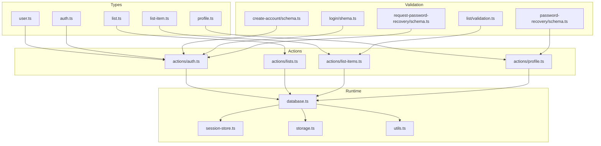
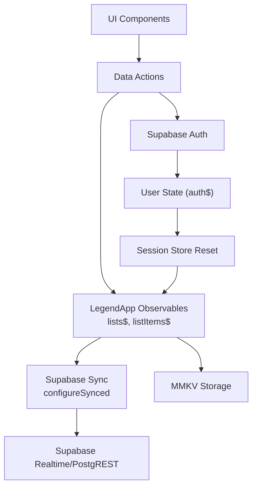
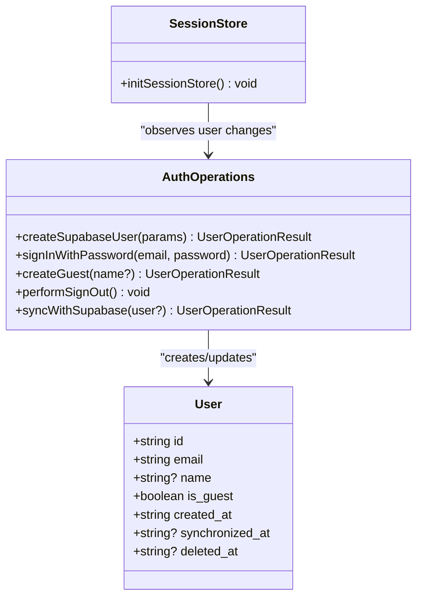
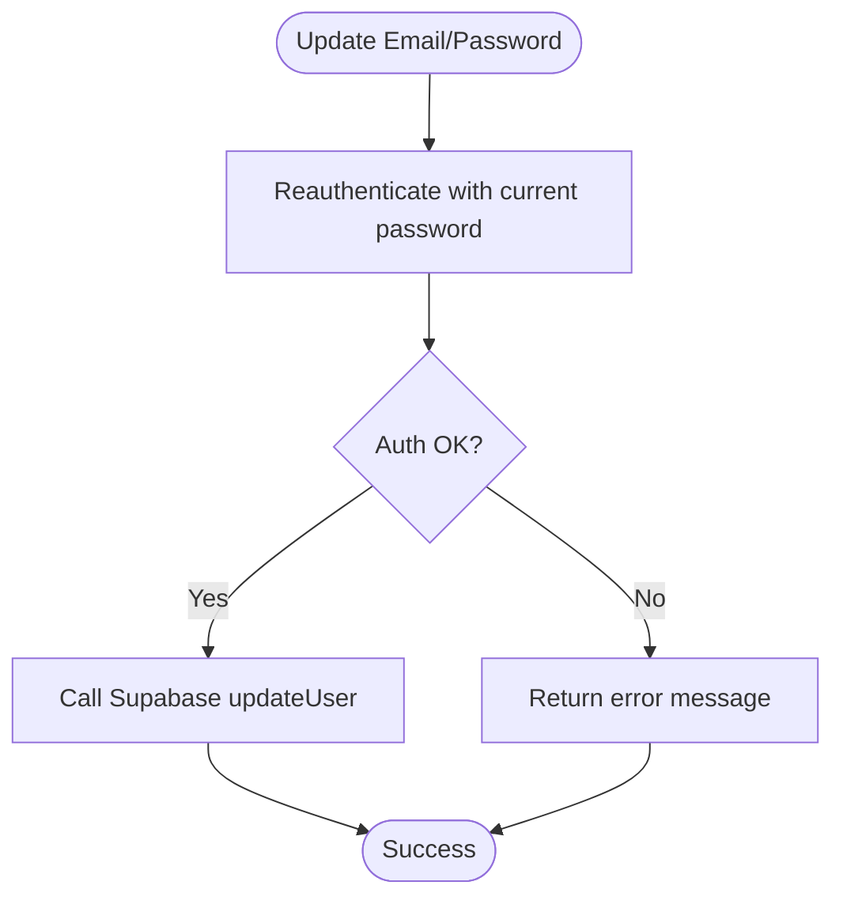
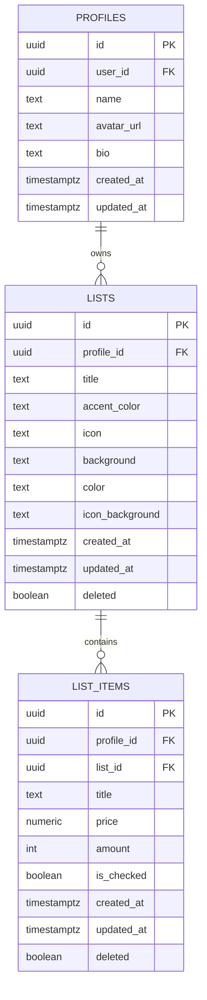
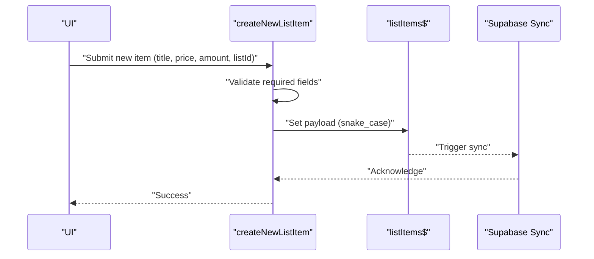
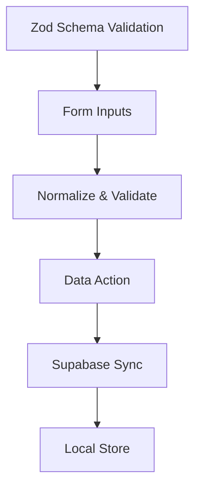
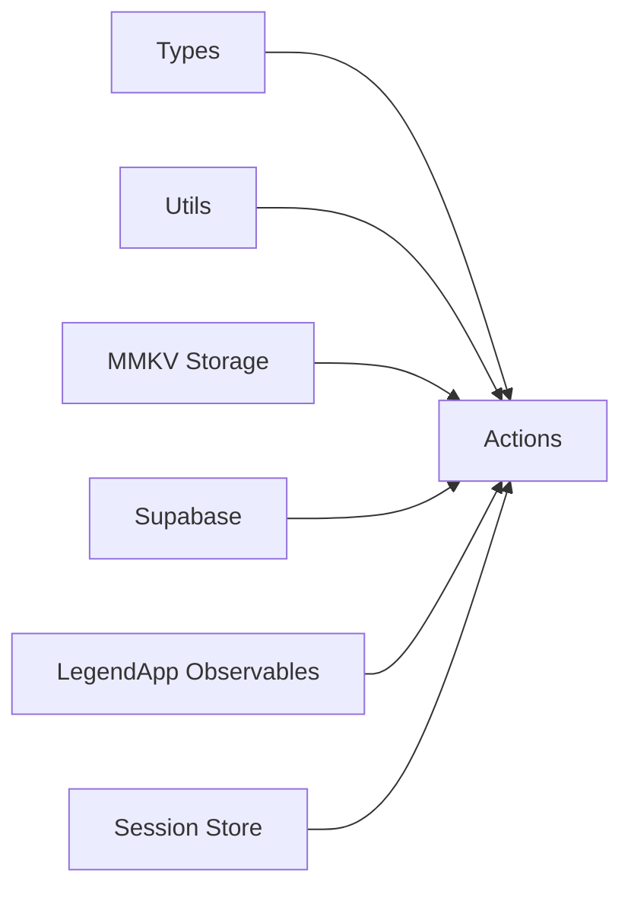

# Data Models and Types

<cite>
**Referenced Files in This Document**
- [src/data/types/user.ts](file://src/data/types/user.ts)
- [src/data/types/list.ts](file://src/data/types/list.ts)
- [src/data/types/list-item.ts](file://src/data/types/list-item.ts)
- [src/data/types/profile.ts](file://src/data/types/profile.ts)
- [src/data/types/auth.ts](file://src/data/types/auth.ts)
- [src/data/database.ts](file://src/data/database.ts)
- [src/data/session-store.ts](file://src/data/session-store.ts)
- [src/data/storage.ts](file://src/data/storage.ts)
- [src/data/utils.ts](file://src/data/utils.ts)
- [src/data/actions/auth.ts](file://src/data/actions/auth.ts)
- [src/data/actions/lists.ts](file://src/data/actions/lists.ts)
- [src/data/actions/list-items.ts](file://src/data/actions/list-items.ts)
- [src/data/actions/profile.ts](file://src/data/actions/profile.ts)
- [src/features/create-account/utils/schema.ts](file://src/features/create-account/utils/schema.ts)
- [src/features/login/utils/index.ts](file://src/features/login/utils/index.ts)
- [src/features/login/utils/shema.ts](file://src/features/login/utils/shema.ts)
- [src/features/password-recovery/utils/schema.ts](file://src/features/password-recovery/utils/schema.ts)
- [src/features/request-password-recovery/utils/schema.ts](file://src/features/request-password-recovery/utils/schema.ts)
- [src/features/list/utils/validation.ts](file://src/features/list/utils/validation.ts)
</cite>

## Table of Contents
1. [Introduction](#introduction)
2. [Project Structure](#project-structure)
3. [Core Components](#core-components)
4. [Architecture Overview](#architecture-overview)
5. [Detailed Component Analysis](#detailed-component-analysis)
6. [Dependency Analysis](#dependency-analysis)
7. [Performance Considerations](#performance-considerations)
8. [Troubleshooting Guide](#troubleshooting-guide)
9. [Conclusion](#conclusion)
10. [Appendices](#appendices)

## Introduction
This document provides comprehensive data model documentation for the PowerLists entities and type safety implementation. It covers:
- Entity definitions and relationships among User, Profile, List, and ListItem
- Authentication data structures and session management
- Validation schemas using Zod and custom validation utilities
- Data transformation patterns between client-side observables and Supabase
- Database relationships, foreign key constraints, and data integrity rules
- Entity lifecycle management, migration strategies, and type evolution considerations

## Project Structure
The data model and type safety are primarily defined under:
- Type definitions: src/data/types/*
- Actions and stores: src/data/actions/* and src/data/states/*
- Validation schemas: src/features/*/utils/schema.ts
- Session and persistence: src/data/database.ts, src/data/session-store.ts, src/data/storage.ts
- Utilities: src/data/utils.ts

**Diagram sources**
- [src/data/types/user.ts:1-44](file://src/data/types/user.ts#L1-L44)
- [src/data/types/list.ts:1-41](file://src/data/types/list.ts#L1-L41)
- [src/data/types/list-item.ts:1-38](file://src/data/types/list-item.ts#L1-L38)
- [src/data/types/profile.ts:1-29](file://src/data/types/profile.ts#L1-L29)
- [src/data/types/auth.ts:1-26](file://src/data/types/auth.ts#L1-L26)
- [src/data/actions/auth.ts:1-138](file://src/data/actions/auth.ts#L1-L138)
- [src/data/actions/lists.ts:1-211](file://src/data/actions/lists.ts#L1-L211)
- [src/data/actions/list-items.ts:1-193](file://src/data/actions/list-items.ts#L1-L193)
- [src/data/actions/profile.ts:1-53](file://src/data/actions/profile.ts#L1-L53)
- [src/data/database.ts:1-36](file://src/data/database.ts#L1-L36)
- [src/data/session-store.ts:1-24](file://src/data/session-store.ts#L1-L24)
- [src/data/storage.ts:1-74](file://src/data/storage.ts#L1-L74)
- [src/data/utils.ts:1-6](file://src/data/utils.ts#L1-L6)
- [src/features/create-account/utils/schema.ts:1-9](file://src/features/create-account/utils/schema.ts#L1-L9)
- [src/features/login/utils/shema.ts:1-2](file://src/features/login/utils/shema.ts#L1-L2)
- [src/features/password-recovery/utils/schema.ts:1-18](file://src/features/password-recovery/utils/schema.ts#L1-L18)
- [src/features/request-password-recovery/utils/schema.ts:1-6](file://src/features/request-password-recovery/utils/schema.ts#L1-L6)
- [src/features/list/utils/validation.ts:1-66](file://src/features/list/utils/validation.ts#L1-L66)

**Section sources**
- [src/data/types/user.ts:1-44](file://src/data/types/user.ts#L1-L44)
- [src/data/types/list.ts:1-41](file://src/data/types/list.ts#L1-L41)
- [src/data/types/list-item.ts:1-38](file://src/data/types/list-item.ts#L1-L38)
- [src/data/types/profile.ts:1-29](file://src/data/types/profile.ts#L1-L29)
- [src/data/types/auth.ts:1-26](file://src/data/types/auth.ts#L1-L26)
- [src/data/database.ts:1-36](file://src/data/database.ts#L1-L36)
- [src/data/session-store.ts:1-24](file://src/data/session-store.ts#L1-L24)
- [src/data/storage.ts:1-74](file://src/data/storage.ts#L1-L74)
- [src/data/utils.ts:1-6](file://src/data/utils.ts#L1-L6)
- [src/data/actions/auth.ts:1-138](file://src/data/actions/auth.ts#L1-L138)
- [src/data/actions/lists.ts:1-211](file://src/data/actions/lists.ts#L1-L211)
- [src/data/actions/list-items.ts:1-193](file://src/data/actions/list-items.ts#L1-L193)
- [src/data/actions/profile.ts:1-53](file://src/data/actions/profile.ts#L1-L53)
- [src/features/create-account/utils/schema.ts:1-9](file://src/features/create-account/utils/schema.ts#L1-L9)
- [src/features/login/utils/shema.ts:1-2](file://src/features/login/utils/shema.ts#L1-L2)
- [src/features/password-recovery/utils/schema.ts:1-18](file://src/features/password-recovery/utils/schema.ts#L1-L18)
- [src/features/request-password-recovery/utils/schema.ts:1-6](file://src/features/request-password-recovery/utils/schema.ts#L1-L6)
- [src/features/list/utils/validation.ts:1-66](file://src/features/list/utils/validation.ts#L1-L66)

## Core Components
This section documents the core entities and their type-safe definitions, relationships, and operational contracts.

- User
  - Purpose: Represents authenticated users and guest users with unified typing.
  - Key fields and constraints:
    - Authenticated user: derived from Supabase user type.
    - Guest user: includes id, optional name/email, is_guest flag, timestamps, and optional deletion markers.
    - Unified type supports null and guest variants.
  - Operations:
    - Creation via Supabase sign-up or guest creation.
    - Patch/update operations with conditional Supabase synchronization.
    - Sign-out resets stores and clears local state.
  - Related types: CreateUserParams, UpdateUserParams, UserOperationResult, isGuestUser guard.

- Profile
  - Purpose: Stores user preference and account information linked to a single Supabase user.
  - Schema summary:
    - id (PK), user_id (FK to auth.users), name (required), avatar_url (nullable), bio (nullable), timestamps.
  - Operations:
    - Create: Omit id/createdAt/updatedAt.
    - Update: Partial updates excluding id/userId/createdAt/updatedAt.
    - Delete: By id.

- List
  - Purpose: Shopping list container with metadata and relationship to Profile.
  - Schema summary:
    - id (PK), title (required), accentColor/icon/background/color/iconBackground, profileId (FK to profiles.id), timestamps, soft-deleted flag.
    - Optional embedded subset of ListItem fields for convenience.
  - Operations:
    - Create: Omit id/createdAt/updatedAt/deleted; automatically assigns profileId from current user.
    - Update: Omit profileId/createdAt.
    - Delete: By id.
    - Retrieve all filtered by profileId.

- ListItem
  - Purpose: Individual items within a List, with pricing, quantity, and categorization support.
  - Schema summary:
    - id (PK), profileId (FK to profiles.id), listId (FK to lists.id), title (nullable), price (nullable), amount (nullable), isChecked (boolean), timestamps, soft-deleted flag.
  - Operations:
    - Create: Omit id/createdAt/updatedAt/deleted; amount required; defaults for price/isChecked.
    - Update: Partial updates; isChecked must be boolean.
    - Toggle: isChecked flip.
    - Delete: By itemId.
    - Query: Filter by listId.

- Authentication and Session Management
  - Types:
    - GetUserAuthResult, MakeSignUpWithEmailAndPasswordProps, MakeSignInWithEmailAndPasswordProps, MakeSendPasswordRecoveryEmailProps, MakeSignInWithEmailAndPasswordResult.
  - Session store:
    - Watches user changes and resets related stores when user ID changes.
  - Persistence:
    - Local storage via MMKV adapter with encryption support and debug utilities.

**Section sources**
- [src/data/types/user.ts:1-44](file://src/data/types/user.ts#L1-L44)
- [src/data/types/profile.ts:1-29](file://src/data/types/profile.ts#L1-L29)
- [src/data/types/list.ts:1-41](file://src/data/types/list.ts#L1-L41)
- [src/data/types/list-item.ts:1-38](file://src/data/types/list-item.ts#L1-L38)
- [src/data/types/auth.ts:1-26](file://src/data/types/auth.ts#L1-L26)
- [src/data/session-store.ts:1-24](file://src/data/session-store.ts#L1-L24)
- [src/data/storage.ts:1-74](file://src/data/storage.ts#L1-L74)

## Architecture Overview
The system uses a hybrid local-first architecture with real-time synchronization to Supabase:
- Local state: LegendAppState observables for Lists and ListItems.
- Persistence: MMKV-backed storage for offline capability and fast reads.
- Sync: Supabase sync configured with merge mode, timestamps, and soft-delete handling.
- Authentication: Supabase Auth integrated with local user state and session watchers.

**Diagram sources**
- [src/data/database.ts:1-36](file://src/data/database.ts#L1-L36)
- [src/data/session-store.ts:1-24](file://src/data/session-store.ts#L1-L24)
- [src/data/actions/lists.ts:1-211](file://src/data/actions/lists.ts#L1-L211)
- [src/data/actions/list-items.ts:1-193](file://src/data/actions/list-items.ts#L1-L193)
- [src/data/actions/auth.ts:1-138](file://src/data/actions/auth.ts#L1-L138)

## Detailed Component Analysis

### User Entity and Authentication Data Structures
- Unified user type supports:
  - Supabase AuthUser
  - Guest user variant with is_guest flag and timestamps
  - Null for anonymous sessions
- Authentication operations:
  - Sign-in, sign-up, guest creation, sign-out
  - Synchronization with Supabase user data
  - Error handling with typed messages
- Session management:
  - Watches auth$.user and resets dependent stores on user change

**Diagram sources**
- [src/data/types/user.ts:1-44](file://src/data/types/user.ts#L1-L44)
- [src/data/actions/auth.ts:1-138](file://src/data/actions/auth.ts#L1-L138)
- [src/data/session-store.ts:1-24](file://src/data/session-store.ts#L1-L24)

**Section sources**
- [src/data/types/user.ts:1-44](file://src/data/types/user.ts#L1-L44)
- [src/data/actions/auth.ts:1-138](file://src/data/actions/auth.ts#L1-L138)
- [src/data/session-store.ts:1-24](file://src/data/session-store.ts#L1-L24)

### Profile Entity for Preferences and Account Information
- Schema alignment with database:
  - id (PK), user_id (FK to auth.users), name (required), avatar_url/bio (nullable), timestamps.
- Operations:
  - Create: Omit id/createdAt/updatedAt.
  - Update: Partial excluding id/userId/createdAt/updatedAt.
  - Delete: By id.
- Security-sensitive updates:
  - Email/password changes require current password reauthentication against Supabase.

**Diagram sources**
- [src/data/actions/profile.ts:1-53](file://src/data/actions/profile.ts#L1-L53)
- [src/data/types/profile.ts:1-29](file://src/data/types/profile.ts#L1-L29)

**Section sources**
- [src/data/types/profile.ts:1-29](file://src/data/types/profile.ts#L1-L29)
- [src/data/actions/profile.ts:1-53](file://src/data/actions/profile.ts#L1-L53)

### List Entity Schema, Relationships, and Validation Rules
- Schema:
  - id (PK), title (required), accentColor/icon/background/color/iconBackground, profileId (FK to profiles.id), timestamps, soft-deleted flag.
  - Optional embedded subset of ListItem fields for convenience.
- Relationships:
  - One-to-many with ListItem via listId.
  - Many-to-one with Profile via profileId.
- Validation and lifecycle:
  - Creation requires title/accentColor/icon and assigns profileId from current user.
  - Updates exclude profileId/createdAt.
  - Deletion triggers removal from observable store and sync to Supabase.
  - Retrieval converts snake_case to camelCase and filters by profileId.

**Diagram sources**
- [src/data/types/list.ts:1-41](file://src/data/types/list.ts#L1-L41)
- [src/data/types/list-item.ts:1-38](file://src/data/types/list-item.ts#L1-L38)
- [src/data/types/profile.ts:1-29](file://src/data/types/profile.ts#L1-L29)

**Section sources**
- [src/data/types/list.ts:1-41](file://src/data/types/list.ts#L1-L41)
- [src/data/actions/lists.ts:1-211](file://src/data/actions/lists.ts#L1-L211)

### ListItem Entity with Pricing, Quantity, and Categorization Fields
- Schema:
  - id (PK), profileId (FK to profiles.id), listId (FK to lists.id), title (nullable), price (nullable), amount (nullable), isChecked (boolean), timestamps, soft-deleted flag.
- Operations:
  - Create: Requires title and amount; defaults price/isChecked; assigns profileId from current user.
  - Update: Partial updates; isChecked must be boolean.
  - Toggle: Flip isChecked via observable mutation.
  - Delete: Remove from observable store.
- Validation:
  - Custom validation utilities enforce minimum length for title and positive numeric amount.

**Diagram sources**
- [src/data/actions/list-items.ts:1-193](file://src/data/actions/list-items.ts#L1-L193)
- [src/features/list/utils/validation.ts:1-66](file://src/features/list/utils/validation.ts#L1-L66)

**Section sources**
- [src/data/types/list-item.ts:1-38](file://src/data/types/list-item.ts#L1-L38)
- [src/data/actions/list-items.ts:1-193](file://src/data/actions/list-items.ts#L1-L193)
- [src/features/list/utils/validation.ts:1-66](file://src/features/list/utils/validation.ts#L1-L66)

### Type Validation Schemas Using Zod and Data Transformation Patterns
- Zod schemas:
  - Create account: email and password validation with localized messages.
  - Password recovery: minimum length and confirmation match.
  - Request password recovery: email validation.
- Data transformation:
  - Supabase format conversion utilities transform between camelCase and snake_case for Postgres compatibility.
  - Timestamp normalization and soft-delete fields are standardized across sync.

**Diagram sources**
- [src/features/create-account/utils/schema.ts:1-9](file://src/features/create-account/utils/schema.ts#L1-L9)
- [src/features/password-recovery/utils/schema.ts:1-18](file://src/features/password-recovery/utils/schema.ts#L1-L18)
- [src/features/request-password-recovery/utils/schema.ts:1-6](file://src/features/request-password-recovery/utils/schema.ts#L1-L6)
- [src/lib/supabase/utils.ts:1-200](file://src/lib/supabase/utils.ts#L1-L200)

**Section sources**
- [src/features/create-account/utils/schema.ts:1-9](file://src/features/create-account/utils/schema.ts#L1-L9)
- [src/features/password-recovery/utils/schema.ts:1-18](file://src/features/password-recovery/utils/schema.ts#L1-L18)
- [src/features/request-password-recovery/utils/schema.ts:1-6](file://src/features/request-password-recovery/utils/schema.ts#L1-L6)
- [src/lib/supabase/utils.ts:1-200](file://src/lib/supabase/utils.ts#L1-L200)

## Dependency Analysis
- Internal dependencies:
  - Actions depend on types, database utilities, and storage.
  - Session store depends on auth state and resets related stores.
  - Lists and ListItems actions rely on Supabase format conversion utilities.
- External dependencies:
  - Supabase for authentication and real-time synchronization.
  - LegendAppState for observable state management.
  - MMKV for local persistence.

**Diagram sources**
- [src/data/actions/lists.ts:1-211](file://src/data/actions/lists.ts#L1-L211)
- [src/data/actions/list-items.ts:1-193](file://src/data/actions/list-items.ts#L1-L193)
- [src/data/database.ts:1-36](file://src/data/database.ts#L1-L36)
- [src/data/session-store.ts:1-24](file://src/data/session-store.ts#L1-L24)
- [src/data/storage.ts:1-74](file://src/data/storage.ts#L1-L74)
- [src/data/utils.ts:1-6](file://src/data/utils.ts#L1-L6)

**Section sources**
- [src/data/actions/lists.ts:1-211](file://src/data/actions/lists.ts#L1-L211)
- [src/data/actions/list-items.ts:1-193](file://src/data/actions/list-items.ts#L1-L193)
- [src/data/database.ts:1-36](file://src/data/database.ts#L1-L36)
- [src/data/session-store.ts:1-24](file://src/data/session-store.ts#L1-L24)
- [src/data/storage.ts:1-74](file://src/data/storage.ts#L1-L74)
- [src/data/utils.ts:1-6](file://src/data/utils.ts#L1-L6)

## Performance Considerations
- Local-first design minimizes network latency and enables offline operation.
- Merge-mode synchronization reduces conflicts and ensures eventual consistency.
- Observables update incrementally, triggering targeted syncs rather than full reloads.
- UUID generation avoids collisions and supports distributed creation.
- MMKV provides efficient serialization and optional encryption for sensitive data.

## Troubleshooting Guide
- Authentication failures:
  - Verify credentials and handle Supabase AuthError messages.
  - Use handleError utility to normalize error reporting.
- Session resets:
  - When user changes, session store resets related stores; ensure UI reinitializes correctly.
- Data sync issues:
  - Confirm field mappings (camelCase vs snake_case) and timestamp fields.
  - Check soft-delete handling and retry configuration.
- Storage anomalies:
  - Use debugStorage to inspect persisted keys and values.
  - Clear storage carefully using clearAllStorage for diagnostics.

**Section sources**
- [src/data/actions/auth.ts:135-138](file://src/data/actions/auth.ts#L135-L138)
- [src/data/session-store.ts:10-23](file://src/data/session-store.ts#L10-L23)
- [src/data/database.ts:13-29](file://src/data/database.ts#L13-L29)
- [src/data/storage.ts:54-62](file://src/data/storage.ts#L54-L62)

## Conclusion
PowerLists employs a robust, type-safe data model with clear entity boundaries and strong validation. The combination of Supabase authentication and real-time sync, local observables, and MMKV persistence delivers a responsive and reliable user experience. The documented schemas, relationships, and lifecycle patterns provide a foundation for maintaining data integrity and evolving the system over time.

## Appendices

### Database Relationships and Integrity Rules
- Foreign Keys:
  - lists.profile_id → profiles.id
  - list_items.profile_id → profiles.id
  - list_items.list_id → lists.id
- Constraints:
  - Soft deletes via boolean deleted flag with fieldDeleted mapping.
  - Timestamps normalized via fieldCreatedAt and fieldUpdatedAt.
  - Unique and nullable constraints reflected in type definitions.

**Section sources**
- [src/data/types/list.ts:11-16](file://src/data/types/list.ts#L11-L16)
- [src/data/types/list-item.ts:3-12](file://src/data/types/list-item.ts#L3-L12)
- [src/data/types/profile.ts:11-19](file://src/data/types/profile.ts#L11-L19)
- [src/data/database.ts:23-26](file://src/data/database.ts#L23-L26)

### Migration Strategies and Type Evolution
- Backward compatibility:
  - Keep legacy types temporarily while migrating consumers.
  - Use guards (e.g., isGuestUser) to handle variant types safely.
- Schema evolution:
  - Add optional fields to types and handle nulls gracefully.
  - Update Zod schemas and validation utilities alongside type changes.
- Operational safety:
  - Incremental rollout of new fields with default values.
  - Maintain conversion utilities for consistent data shape across layers.

**Section sources**
- [src/data/types/user.ts:37-43](file://src/data/types/user.ts#L37-L43)
- [src/data/actions/lists.ts:79-122](file://src/data/actions/lists.ts#L79-L122)
- [src/data/actions/list-items.ts:53-104](file://src/data/actions/list-items.ts#L53-L104)