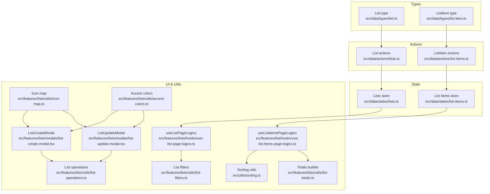
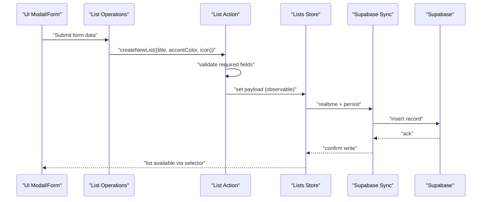
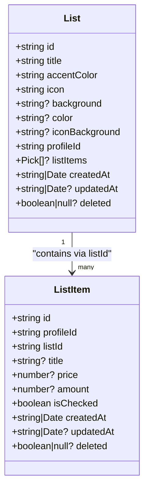
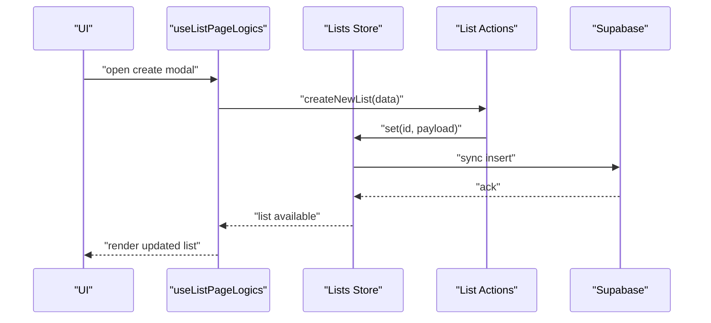
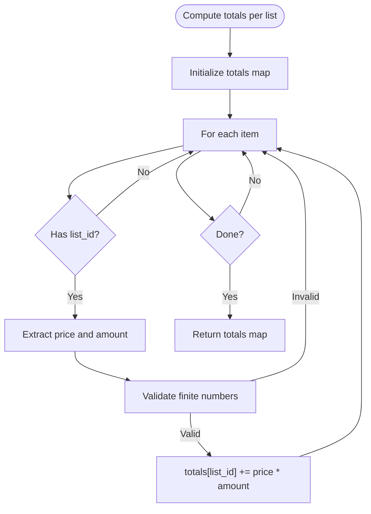
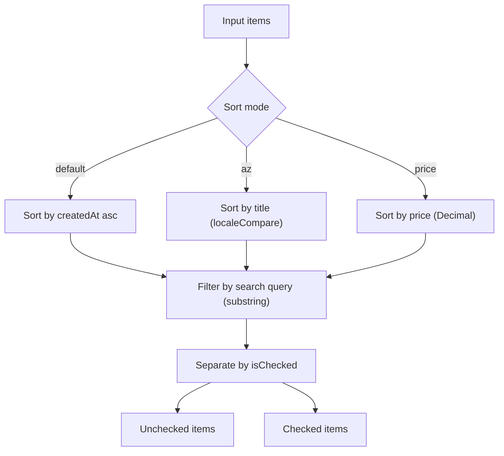
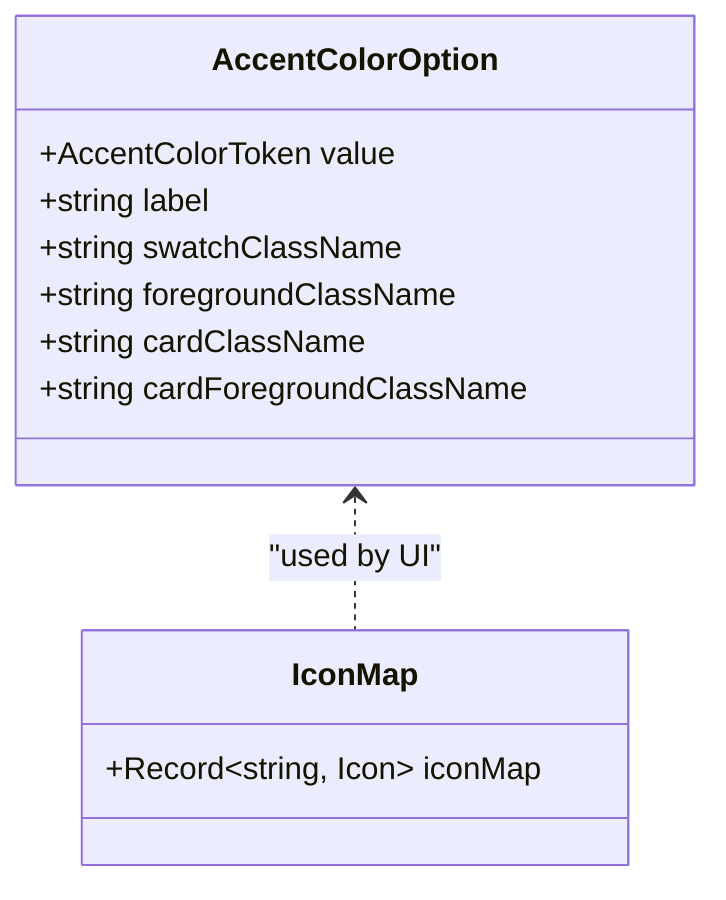
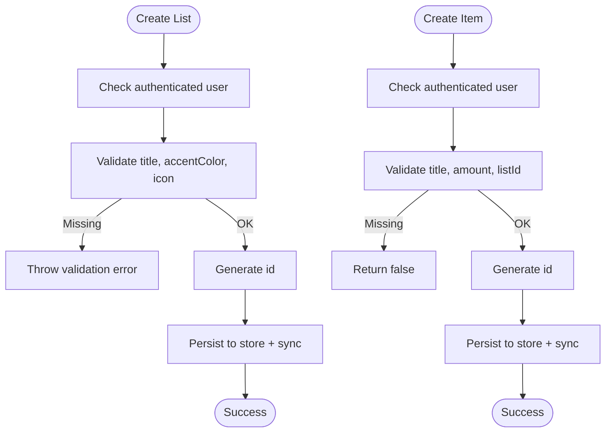
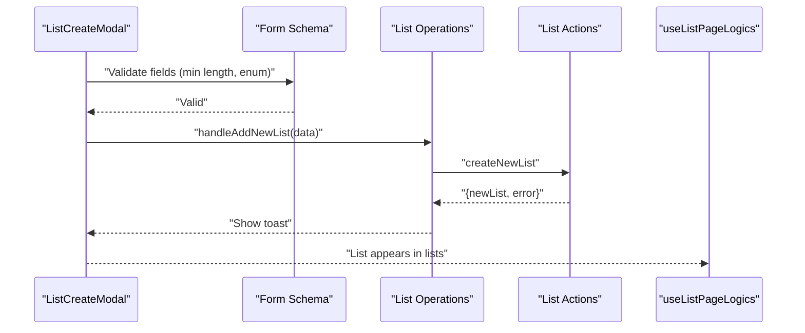
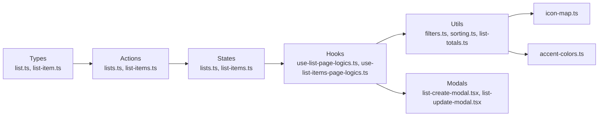

# List Entity Model

<cite>
**Referenced Files in This Document**
- [src/data/types/list.ts](file://src/data/types/list.ts)
- [src/data/types/list-item.ts](file://src/data/types/list-item.ts)
- [src/data/actions/lists.ts](file://src/data/actions/lists.ts)
- [src/data/actions/list-items.ts](file://src/data/actions/list-items.ts)
- [src/data/states/lists.ts](file://src/data/states/lists.ts)
- [src/data/states/list-items.ts](file://src/data/states/list-items.ts)
- [src/features/lists/utils/list-filters.ts](file://src/features/lists/utils/list-filters.ts)
- [src/features/lists/utils/list-operations.ts](file://src/features/lists/utils/list-operations.ts)
- [src/features/lists/utils/list-totals.ts](file://src/features/lists/utils/list-totals.ts)
- [src/features/lists/utils/icon-map.ts](file://src/features/lists/utils/icon-map.ts)
- [src/features/lists/utils/accent-colors.ts](file://src/features/lists/utils/accent-colors.ts)
- [src/features/lists/hooks/use-list-page-logics.ts](file://src/features/lists/hooks/use-list-page-logics.ts)
- [src/features/list/hooks/use-list-items-page-logics.ts](file://src/features/list/hooks/use-list-items-page-logics.ts)
- [src/features/lists/modals/list-create-modal.tsx](file://src/features/lists/modals/list-create-modal.tsx)
- [src/features/lists/modals/list-update-modal.tsx](file://src/features/lists/modals/list-update-modal.tsx)
- [src/utils/sorting.ts](file://src/utils/sorting.ts)
</cite>

## Table of Contents
1. [Introduction](#introduction)
2. [Project Structure](#project-structure)
3. [Core Components](#core-components)
4. [Architecture Overview](#architecture-overview)
5. [Detailed Component Analysis](#detailed-component-analysis)
6. [Dependency Analysis](#dependency-analysis)
7. [Performance Considerations](#performance-considerations)
8. [Troubleshooting Guide](#troubleshooting-guide)
9. [Conclusion](#conclusion)

## Introduction
This document describes the List entity model in PowerLists, focusing on the data schema, relationships with ListItem, list management operations, sorting and filtering, categorization and color/icon systems, validation rules, and practical CRUD usage patterns. It consolidates type definitions, action handlers, state synchronization, UI integrations, and utility functions to present a complete picture of how Lists and ListItems are modeled and manipulated.

## Project Structure
The List model spans type definitions, data access actions, observable state stores, UI logic, and utilities:
- Types define the canonical List and ListItem shapes and operation signatures.
- Actions encapsulate create/update/delete operations and integrate with the local observable store and remote persistence.
- States connect to Supabase via an observable synchronization layer.
- Utilities implement filtering, sorting, totals computation, and UI-related selections (icons/colors).
- Hooks orchestrate UI logic around lists and list items.

**Diagram sources**
- [src/data/types/list.ts:1-41](file://src/data/types/list.ts#L1-L41)
- [src/data/types/list-item.ts:1-38](file://src/data/types/list-item.ts#L1-L38)
- [src/data/actions/lists.ts:1-211](file://src/data/actions/lists.ts#L1-L211)
- [src/data/actions/list-items.ts:1-193](file://src/data/actions/list-items.ts#L1-L193)
- [src/data/states/lists.ts:1-27](file://src/data/states/lists.ts#L1-L27)
- [src/data/states/list-items.ts:1-24](file://src/data/states/list-items.ts#L1-L24)
- [src/features/lists/utils/list-filters.ts:1-14](file://src/features/lists/utils/list-filters.ts#L1-L14)
- [src/features/lists/utils/list-operations.ts:1-73](file://src/features/lists/utils/list-operations.ts#L1-L73)
- [src/features/lists/utils/list-totals.ts:1-32](file://src/features/lists/utils/list-totals.ts#L1-L32)
- [src/features/lists/utils/icon-map.ts:1-20](file://src/features/lists/utils/icon-map.ts#L1-L20)
- [src/features/lists/utils/accent-colors.ts:1-93](file://src/features/lists/utils/accent-colors.ts#L1-L93)
- [src/features/lists/hooks/use-list-page-logics.ts:1-82](file://src/features/lists/hooks/use-list-page-logics.ts#L1-L82)
- [src/features/list/hooks/use-list-items-page-logics.ts:1-124](file://src/features/list/hooks/use-list-items-page-logics.ts#L1-L124)
- [src/features/lists/modals/list-create-modal.tsx:1-151](file://src/features/lists/modals/list-create-modal.tsx#L1-L151)
- [src/features/lists/modals/list-update-modal.tsx:1-171](file://src/features/lists/modals/list-update-modal.tsx#L1-L171)
- [src/utils/sorting.ts:1-54](file://src/utils/sorting.ts#L1-L54)

**Section sources**
- [src/data/types/list.ts:1-41](file://src/data/types/list.ts#L1-L41)
- [src/data/types/list-item.ts:1-38](file://src/data/types/list-item.ts#L1-L38)
- [src/data/actions/lists.ts:1-211](file://src/data/actions/lists.ts#L1-L211)
- [src/data/actions/list-items.ts:1-193](file://src/data/actions/list-items.ts#L1-L193)
- [src/data/states/lists.ts:1-27](file://src/data/states/lists.ts#L1-L27)
- [src/data/states/list-items.ts:1-24](file://src/data/states/list-items.ts#L1-L24)
- [src/features/lists/utils/list-filters.ts:1-14](file://src/features/lists/utils/list-filters.ts#L1-L14)
- [src/features/lists/utils/list-operations.ts:1-73](file://src/features/lists/utils/list-operations.ts#L1-L73)
- [src/features/lists/utils/list-totals.ts:1-32](file://src/features/lists/utils/list-totals.ts#L1-L32)
- [src/features/lists/utils/icon-map.ts:1-20](file://src/features/lists/utils/icon-map.ts#L1-L20)
- [src/features/lists/utils/accent-colors.ts:1-93](file://src/features/lists/utils/accent-colors.ts#L1-L93)
- [src/features/lists/hooks/use-list-page-logics.ts:1-82](file://src/features/lists/hooks/use-list-page-logics.ts#L1-L82)
- [src/features/list/hooks/use-list-items-page-logics.ts:1-124](file://src/features/list/hooks/use-list-items-page-logics.ts#L1-L124)
- [src/features/lists/modals/list-create-modal.tsx:1-151](file://src/features/lists/modals/list-create-modal.tsx#L1-L151)
- [src/features/lists/modals/list-update-modal.tsx:1-171](file://src/features/lists/modals/list-update-modal.tsx#L1-L171)
- [src/utils/sorting.ts:1-54](file://src/utils/sorting.ts#L1-L54)

## Core Components
- List interface: Defines the list identity, metadata, and optional embedded items subset used in list cards.
- ListItem interface: Defines individual shopping list entries with price, amount, and checked state.
- List actions: Encapsulate create, update, delete, and retrieval of lists.
- List item actions: Encapsulate create, update, delete, toggle checked, and retrieval of list items.
- State stores: Observable stores synchronized with Supabase for offline-first behavior.
- UI utilities: Filtering, sorting, totals calculation, icon/color selection, and modal-driven forms.

Key properties of List:
- Identity: id, profileId
- Presentation: title, accentColor, icon, background, color, iconBackground
- Timestamps: createdAt, updatedAt
- Deletion flag: deleted
- Embedded items subset: listItems (partial ListItem fields)

Relationships:
- One-to-many: List contains multiple ListItem instances linked by listId.
- Optional embedded subset: listItems on List enables quick rendering of summary metrics on list cards.

Validation and constraints:
- Required fields for list creation: title, accentColor, icon.
- Required fields for item creation: title, amount, listId; price is nullable.
- Checked state defaults to false when omitted.

**Section sources**
- [src/data/types/list.ts:1-41](file://src/data/types/list.ts#L1-L41)
- [src/data/types/list-item.ts:1-38](file://src/data/types/list-item.ts#L1-L38)
- [src/data/actions/lists.ts:79-122](file://src/data/actions/lists.ts#L79-L122)
- [src/data/actions/list-items.ts:53-104](file://src/data/actions/list-items.ts#L53-L104)
- [src/data/states/lists.ts:5-26](file://src/data/states/lists.ts#L5-L26)
- [src/data/states/list-items.ts:5-23](file://src/data/states/list-items.ts#L5-L23)

## Architecture Overview
The List model integrates with Supabase via observable stores. Changes propagate through actions to the store, triggering real-time synchronization and persistence. UI hooks compute derived data such as totals and filtered lists, while utilities enforce sorting and filtering.

**Diagram sources**
- [src/features/lists/modals/list-create-modal.tsx:70-88](file://src/features/lists/modals/list-create-modal.tsx#L70-L88)
- [src/features/lists/utils/list-operations.ts:9-34](file://src/features/lists/utils/list-operations.ts#L9-L34)
- [src/data/actions/lists.ts:79-122](file://src/data/actions/lists.ts#L79-L122)
- [src/data/states/lists.ts:5-26](file://src/data/states/lists.ts#L5-L26)

## Detailed Component Analysis

### List Data Model
The List interface defines the canonical shape for list records and supports partial item subsets for efficient list views.

**Diagram sources**
- [src/data/types/list.ts:3-16](file://src/data/types/list.ts#L3-L16)
- [src/data/types/list-item.ts:1-12](file://src/data/types/list-item.ts#L1-L12)

**Section sources**
- [src/data/types/list.ts:1-41](file://src/data/types/list.ts#L1-L41)
- [src/data/types/list-item.ts:1-38](file://src/data/types/list-item.ts#L1-L38)

### List Management Operations
- Create: Validates presence of title, accentColor, icon; generates id; writes to observable store; triggers sync.
- Update: Validates presence of id, title, accentColor, icon; updates observable fields; returns updated list.
- Delete: Validates id; deletes from observable store; triggers sync.
- Retrieve: Reads from observable store and converts keys to camelCase for consistent typing.

**Diagram sources**
- [src/features/lists/hooks/use-list-page-logics.ts:48-50](file://src/features/lists/hooks/use-list-page-logics.ts#L48-L50)
- [src/data/actions/lists.ts:79-122](file://src/data/actions/lists.ts#L79-L122)
- [src/data/states/lists.ts:5-26](file://src/data/states/lists.ts#L5-L26)

**Section sources**
- [src/data/actions/lists.ts:37-52](file://src/data/actions/lists.ts#L37-L52)
- [src/data/actions/lists.ts:79-122](file://src/data/actions/lists.ts#L79-L122)
- [src/data/actions/lists.ts:144-170](file://src/data/actions/lists.ts#L144-L170)
- [src/data/actions/lists.ts:187-203](file://src/data/actions/lists.ts#L187-L203)
- [src/data/states/lists.ts:5-26](file://src/data/states/lists.ts#L5-L26)

### Relationship Between List and ListItem
- Foreign key: ListItem.listId references List.id.
- Aggregation: Totals are computed per list by multiplying price × amount for each item.
- Filtering: Lists can be filtered by title; items can be filtered by title and sorted by date, name, or price.

**Diagram sources**
- [src/features/lists/utils/list-totals.ts:9-31](file://src/features/lists/utils/list-totals.ts#L9-L31)

**Section sources**
- [src/data/types/list-item.ts:1-12](file://src/data/types/list-item.ts#L1-L12)
- [src/features/lists/utils/list-totals.ts:1-32](file://src/features/lists/utils/list-totals.ts#L1-L32)

### Sorting and Filtering Mechanisms
- List filtering: Case-insensitive substring match on title; default sort by reverse creation timestamp.
- Item sorting: Three modes—default (by creation date), alphabetical (A–Z), and by price.
- Separation by status: Items can be split into checked and unchecked sets after sorting.

**Diagram sources**
- [src/features/lists/utils/list-filters.ts:3-13](file://src/features/lists/utils/list-filters.ts#L3-L13)
- [src/utils/sorting.ts:35-44](file://src/utils/sorting.ts#L35-L44)
- [src/utils/sorting.ts:46-53](file://src/utils/sorting.ts#L46-L53)

**Section sources**
- [src/features/lists/utils/list-filters.ts:1-14](file://src/features/lists/utils/list-filters.ts#L1-L14)
- [src/utils/sorting.ts:1-54](file://src/utils/sorting.ts#L1-L54)

### Categorization, Priority Systems, and Organization Features
- Color scheme: Accent color tokens support primary, secondary, muted, destructive, success, warning, info.
- Icon selection: Predefined icon map for consistent visual identification.
- Organization: Lists are scoped by profileId; items are scoped by listId; both are filtered server-side and client-side.

**Diagram sources**
- [src/features/lists/utils/accent-colors.ts:13-20](file://src/features/lists/utils/accent-colors.ts#L13-L20)
- [src/features/lists/utils/accent-colors.ts:24-65](file://src/features/lists/utils/accent-colors.ts#L24-L65)
- [src/features/lists/utils/icon-map.ts:11-19](file://src/features/lists/utils/icon-map.ts#L11-L19)

**Section sources**
- [src/features/lists/utils/accent-colors.ts:1-93](file://src/features/lists/utils/accent-colors.ts#L1-L93)
- [src/features/lists/utils/icon-map.ts:1-20](file://src/features/lists/utils/icon-map.ts#L1-L20)
- [src/data/states/lists.ts:10-14](file://src/data/states/lists.ts#L10-L14)
- [src/data/states/list-items.ts:10-11](file://src/data/states/list-items.ts#L10-L11)

### Data Validation Rules and Business Logic Enforcement
- List creation requires title, accentColor, icon; profileId is injected from current user context.
- Item creation requires title, amount, listId; price is optional; isChecked defaults to false when omitted.
- Update operations validate presence of required fields and update observable fields atomically.
- UI forms enforce minimum length for titles and restrict color choices to predefined tokens.

**Diagram sources**
- [src/data/actions/lists.ts:84-88](file://src/data/actions/lists.ts#L84-L88)
- [src/data/actions/list-items.ts:61-69](file://src/data/actions/list-items.ts#L61-L69)

**Section sources**
- [src/data/actions/lists.ts:79-122](file://src/data/actions/lists.ts#L79-L122)
- [src/data/actions/list-items.ts:53-104](file://src/data/actions/list-items.ts#L53-L104)
- [src/features/lists/modals/list-create-modal.tsx:26-30](file://src/features/lists/modals/list-create-modal.tsx#L26-L30)
- [src/features/lists/modals/list-update-modal.tsx:30-34](file://src/features/lists/modals/list-update-modal.tsx#L30-L34)

### Examples of List CRUD Operations and Common Manipulation Patterns
- Create list: Open create modal, submit form, observe success toast and updated list in UI.
- Update list: Open update modal, adjust title/icon/color, save changes, observe success feedback.
- Delete list: Trigger delete action, UI reflects removal after sync.
- Manage items: Filter by title, sort by date/name/price, toggle checked state, compute totals and payable totals.

**Diagram sources**
- [src/features/lists/modals/list-create-modal.tsx:70-88](file://src/features/lists/modals/list-create-modal.tsx#L70-L88)
- [src/features/lists/utils/list-operations.ts:9-34](file://src/features/lists/utils/list-operations.ts#L9-L34)
- [src/data/actions/lists.ts:79-122](file://src/data/actions/lists.ts#L79-L122)
- [src/features/lists/hooks/use-list-page-logics.ts:48-50](file://src/features/lists/hooks/use-list-page-logics.ts#L48-L50)

**Section sources**
- [src/features/lists/modals/list-create-modal.tsx:1-151](file://src/features/lists/modals/list-create-modal.tsx#L1-L151)
- [src/features/lists/modals/list-update-modal.tsx:1-171](file://src/features/lists/modals/list-update-modal.tsx#L1-L171)
- [src/features/lists/utils/list-operations.ts:1-73](file://src/features/lists/utils/list-operations.ts#L1-L73)
- [src/features/list/hooks/use-list-items-page-logics.ts:1-124](file://src/features/list/hooks/use-list-items-page-logics.ts#L1-L124)

## Dependency Analysis
The following diagram highlights how UI components, hooks, actions, and utilities depend on each other and on the shared types.

**Diagram sources**
- [src/data/types/list.ts:1-41](file://src/data/types/list.ts#L1-L41)
- [src/data/types/list-item.ts:1-38](file://src/data/types/list-item.ts#L1-L38)
- [src/data/actions/lists.ts:1-211](file://src/data/actions/lists.ts#L1-L211)
- [src/data/actions/list-items.ts:1-193](file://src/data/actions/list-items.ts#L1-L193)
- [src/data/states/lists.ts:1-27](file://src/data/states/lists.ts#L1-L27)
- [src/data/states/list-items.ts:1-24](file://src/data/states/list-items.ts#L1-L24)
- [src/features/lists/hooks/use-list-page-logics.ts:1-82](file://src/features/lists/hooks/use-list-page-logics.ts#L1-L82)
- [src/features/list/hooks/use-list-items-page-logics.ts:1-124](file://src/features/list/hooks/use-list-items-page-logics.ts#L1-L124)
- [src/features/lists/utils/list-filters.ts:1-14](file://src/features/lists/utils/list-filters.ts#L1-L14)
- [src/utils/sorting.ts:1-54](file://src/utils/sorting.ts#L1-L54)
- [src/features/lists/utils/list-totals.ts:1-32](file://src/features/lists/utils/list-totals.ts#L1-L32)
- [src/features/lists/utils/icon-map.ts:1-20](file://src/features/lists/utils/icon-map.ts#L1-L20)
- [src/features/lists/utils/accent-colors.ts:1-93](file://src/features/lists/utils/accent-colors.ts#L1-L93)
- [src/features/lists/modals/list-create-modal.tsx:1-151](file://src/features/lists/modals/list-create-modal.tsx#L1-L151)
- [src/features/lists/modals/list-update-modal.tsx:1-171](file://src/features/lists/modals/list-update-modal.tsx#L1-L171)

**Section sources**
- [src/data/types/list.ts:1-41](file://src/data/types/list.ts#L1-L41)
- [src/data/types/list-item.ts:1-38](file://src/data/types/list-item.ts#L1-L38)
- [src/data/actions/lists.ts:1-211](file://src/data/actions/lists.ts#L1-L211)
- [src/data/actions/list-items.ts:1-193](file://src/data/actions/list-items.ts#L1-L193)
- [src/data/states/lists.ts:1-27](file://src/data/states/lists.ts#L1-L27)
- [src/data/states/list-items.ts:1-24](file://src/data/states/list-items.ts#L1-L24)
- [src/features/lists/hooks/use-list-page-logics.ts:1-82](file://src/features/lists/hooks/use-list-page-logics.ts#L1-L82)
- [src/features/list/hooks/use-list-items-page-logics.ts:1-124](file://src/features/list/hooks/use-list-items-page-logics.ts#L1-L124)
- [src/features/lists/utils/list-filters.ts:1-14](file://src/features/lists/utils/list-filters.ts#L1-L14)
- [src/utils/sorting.ts:1-54](file://src/utils/sorting.ts#L1-L54)
- [src/features/lists/utils/list-totals.ts:1-32](file://src/features/lists/utils/list-totals.ts#L1-L32)
- [src/features/lists/utils/icon-map.ts:1-20](file://src/features/lists/utils/icon-map.ts#L1-L20)
- [src/features/lists/utils/accent-colors.ts:1-93](file://src/features/lists/utils/accent-colors.ts#L1-L93)
- [src/features/lists/modals/list-create-modal.tsx:1-151](file://src/features/lists/modals/list-create-modal.tsx#L1-L151)
- [src/features/lists/modals/list-update-modal.tsx:1-171](file://src/features/lists/modals/list-update-modal.tsx#L1-L171)

## Performance Considerations
- Prefer filtering and sorting on the client side only after fetching from the observable store to minimize network calls.
- Use memoization in hooks to avoid recomputation of filtered lists and totals.
- Keep embedded listItems on List minimal to reduce payload sizes when rendering list cards.
- Use decimal arithmetic for totals to prevent floating-point precision issues.

## Troubleshooting Guide
Common issues and resolutions:
- Authentication errors during list/item creation: Ensure the current user is authenticated before invoking actions.
- Missing required fields: Validate title, accentColor, icon for lists; title, amount, listId for items.
- Real-time sync delays: Confirm that the observable store is properly initialized and that the realtime filter matches the current profileId.
- Incorrect totals: Verify that price and amount are finite numbers and that totals aggregation excludes invalid entries.

**Section sources**
- [src/data/actions/lists.ts:84-88](file://src/data/actions/lists.ts#L84-L88)
- [src/data/actions/list-items.ts:61-69](file://src/data/actions/list-items.ts#L61-L69)
- [src/data/states/lists.ts:17-21](file://src/data/states/lists.ts#L17-L21)
- [src/data/states/list-items.ts:17-21](file://src/data/states/list-items.ts#L17-L21)
- [src/features/lists/utils/list-totals.ts:19-21](file://src/features/lists/utils/list-totals.ts#L19-L21)

## Conclusion
The List entity model in PowerLists combines a clean type definition with robust actions and observable state synchronization. Lists and items are tightly integrated with UI hooks and utilities to provide filtering, sorting, totals computation, and rich presentation via icons and accent colors. Validation rules and scoped access ensure data integrity and user isolation.