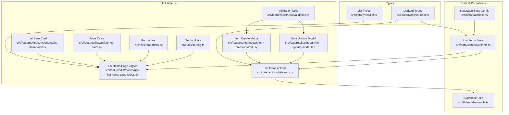
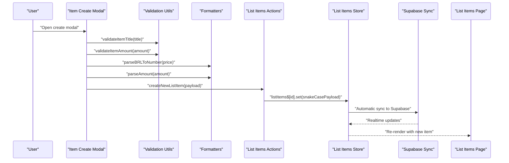
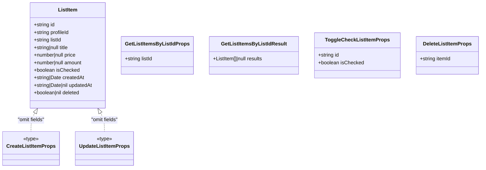
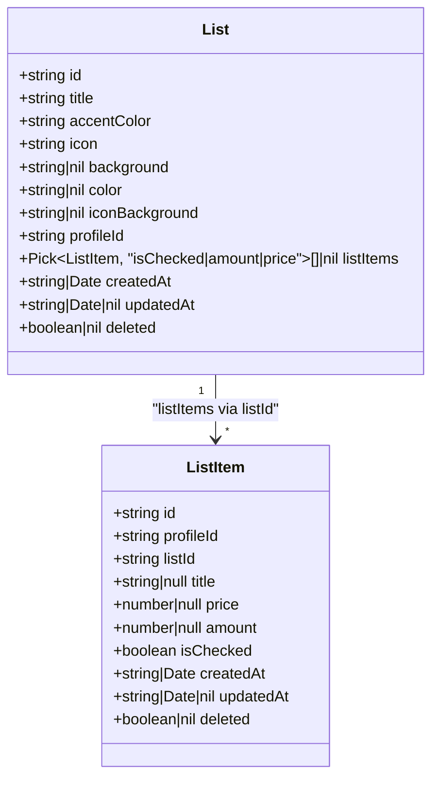
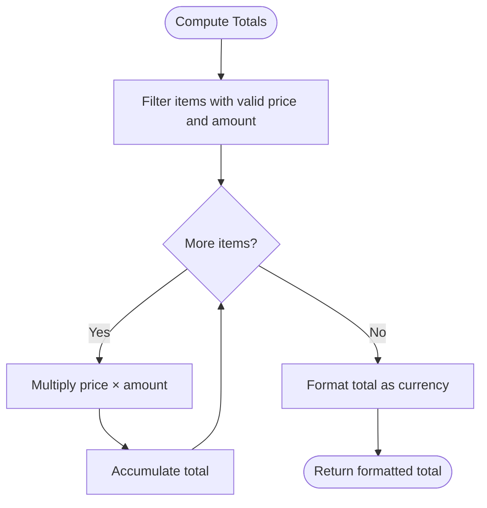
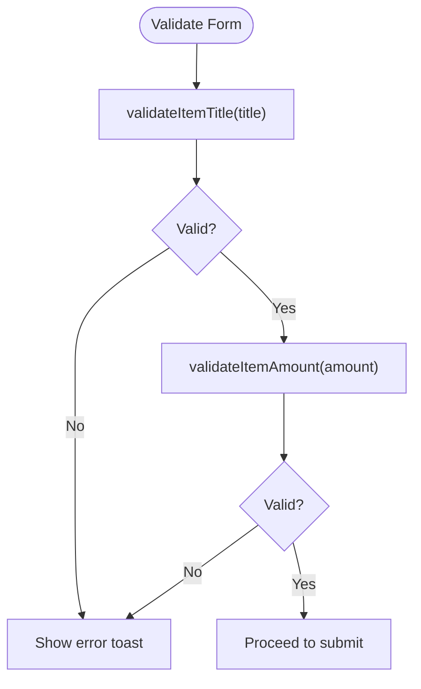
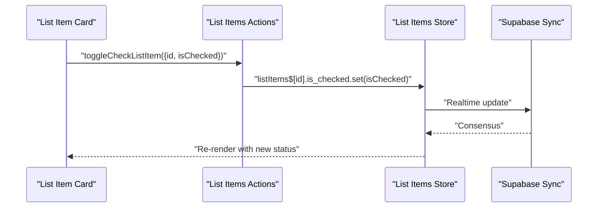
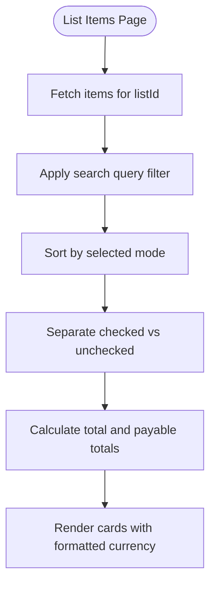
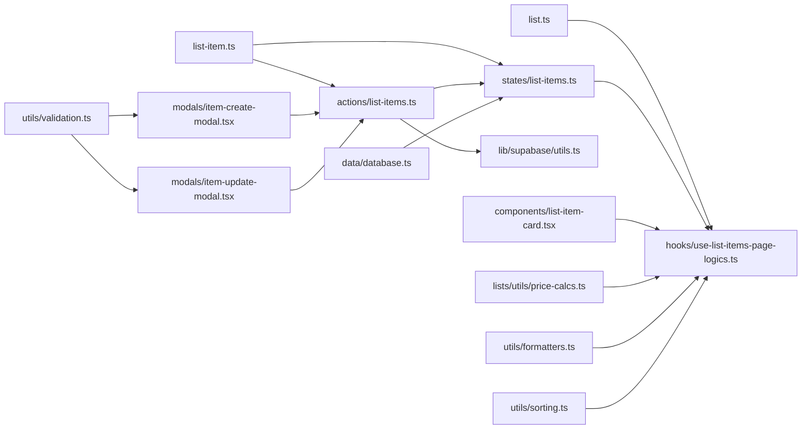
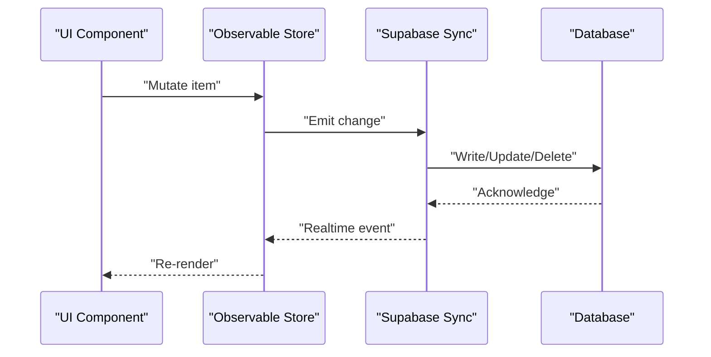

# ListItem Entity Model

<cite>
**Referenced Files in This Document**
- [src/data/types/list-item.ts](file://src/data/types/list-item.ts)
- [src/data/types/list.ts](file://src/data/types/list.ts)
- [src/data/actions/list-items.ts](file://src/data/actions/list-items.ts)
- [src/data/states/list-items.ts](file://src/data/states/list-items.ts)
- [src/features/list/components/list-item-card.tsx](file://src/features/list/components/list-item-card.tsx)
- [src/features/list/hooks/use-list-items-page-logics.ts](file://src/features/list/hooks/use-list-items-page-logics.ts)
- [src/features/list/utils/validation.ts](file://src/features/list/utils/validation.ts)
- [src/features/list/modals/item-create-modal.tsx](file://src/features/list/modals/item-create-modal.tsx)
- [src/features/list/modals/item-update-modal.tsx](file://src/features/list/modals/item-update-modal.tsx)
- [src/features/lists/utils/price-calcs.ts](file://src/features/lists/utils/price-calcs.ts)
- [src/utils/formatters.ts](file://src/utils/formatters.ts)
- [src/utils/sorting.ts](file://src/utils/sorting.ts)
- [src/data/database.ts](file://src/data/database.ts)
- [src/lib/supabase/utils.ts](file://src/lib/supabase/utils.ts)
</cite>

## Table of Contents
1. [Introduction](#introduction)
2. [Project Structure](#project-structure)
3. [Core Components](#core-components)
4. [Architecture Overview](#architecture-overview)
5. [Detailed Component Analysis](#detailed-component-analysis)
6. [Dependency Analysis](#dependency-analysis)
7. [Performance Considerations](#performance-considerations)
8. [Troubleshooting Guide](#troubleshooting-guide)
9. [Conclusion](#conclusion)
10. [Appendices](#appendices)

## Introduction
This document provides comprehensive data model documentation for the ListItem entity in PowerLists. It explains the ListItem interface structure, relationships with List entities, pricing and quantity calculations, purchase status management, data validation rules, and operational features such as creation, updates, toggling status, deletion, sorting, filtering, totals computation, and currency formatting. It also outlines the data flow from UI components to state management and persistence.

## Project Structure
The ListItem model is defined in shared TypeScript types and consumed across UI screens, modal forms, and state management layers. The following diagram shows how the key files relate to the ListItem entity.

**Diagram sources**
- [src/data/types/list-item.ts:1-38](file://src/data/types/list-item.ts#L1-L38)
- [src/data/types/list.ts:1-41](file://src/data/types/list.ts#L1-L41)
- [src/data/states/list-items.ts:1-24](file://src/data/states/list-items.ts#L1-L24)
- [src/data/database.ts:1-36](file://src/data/database.ts#L1-L36)
- [src/lib/supabase/utils.ts:1-10](file://src/lib/supabase/utils.ts#L1-L10)
- [src/features/list/components/list-item-card.tsx:1-142](file://src/features/list/components/list-item-card.tsx#L1-L142)
- [src/features/list/hooks/use-list-items-page-logics.ts:1-124](file://src/features/list/hooks/use-list-items-page-logics.ts#L1-L124)
- [src/features/list/utils/validation.ts:1-66](file://src/features/list/utils/validation.ts#L1-L66)
- [src/features/lists/utils/price-calcs.ts:1-18](file://src/features/lists/utils/price-calcs.ts#L1-L18)
- [src/utils/formatters.ts:1-46](file://src/utils/formatters.ts#L1-L46)
- [src/utils/sorting.ts:1-53](file://src/utils/sorting.ts#L1-L53)
- [src/features/list/modals/item-create-modal.tsx:1-188](file://src/features/list/modals/item-create-modal.tsx#L1-L188)
- [src/features/list/modals/item-update-modal.tsx:1-201](file://src/features/list/modals/item-update-modal.tsx#L1-L201)
- [src/data/actions/list-items.ts:1-193](file://src/data/actions/list-items.ts#L1-L193)

**Section sources**
- [src/data/types/list-item.ts:1-38](file://src/data/types/list-item.ts#L1-L38)
- [src/data/types/list.ts:1-41](file://src/data/types/list.ts#L1-L41)
- [src/data/states/list-items.ts:1-24](file://src/data/states/list-items.ts#L1-L24)
- [src/data/actions/list-items.ts:1-193](file://src/data/actions/list-items.ts#L1-L193)
- [src/features/list/components/list-item-card.tsx:1-142](file://src/features/list/components/list-item-card.tsx#L1-L142)
- [src/features/list/hooks/use-list-items-page-logics.ts:1-124](file://src/features/list/hooks/use-list-items-page-logics.ts#L1-L124)
- [src/features/list/utils/validation.ts:1-66](file://src/features/list/utils/validation.ts#L1-L66)
- [src/features/list/modals/item-create-modal.tsx:1-188](file://src/features/list/modals/item-create-modal.tsx#L1-L188)
- [src/features/list/modals/item-update-modal.tsx:1-201](file://src/features/list/modals/item-update-modal.tsx#L1-L201)
- [src/features/lists/utils/price-calcs.ts:1-18](file://src/features/lists/utils/price-calcs.ts#L1-L18)
- [src/utils/formatters.ts:1-46](file://src/utils/formatters.ts#L1-L46)
- [src/utils/sorting.ts:1-53](file://src/utils/sorting.ts#L1-L53)
- [src/data/database.ts:1-36](file://src/data/database.ts#L1-L36)
- [src/lib/supabase/utils.ts:1-10](file://src/lib/supabase/utils.ts#L1-L10)

## Core Components
- ListItem interface: Defines the shape of a shopping list item, including identifiers, metadata, pricing, quantity, and purchase status.
- List interface: Defines a shopping list container that aggregates items and includes presentation attributes.
- State store: Centralized observable store for list items synchronized with Supabase and persisted locally.
- Actions: CRUD operations for list items, including creation, updates, toggling checked status, and deletion.
- UI components: Cards and modals for displaying and editing items, with validation and formatting.
- Utilities: Sorting, totals calculation, currency formatting, and validation helpers.

Key properties of ListItem:
- id: Unique identifier for the item.
- profileId: Owner identifier for scoping data per user.
- listId: Identifies the List to which the item belongs.
- title: Human-readable name for the item; nullable.
- price: Unit price; nullable.
- amount: Quantity; nullable.
- isChecked: Boolean indicating purchase completion.
- createdAt/updatedAt/deleted: Timestamps and soft-deletion flag.

Relationships:
- One List contains many ListItem entries via listId.
- ListItem belongs to a single List but can be filtered and aggregated by List.

**Section sources**
- [src/data/types/list-item.ts:1-38](file://src/data/types/list-item.ts#L1-L38)
- [src/data/types/list.ts:1-41](file://src/data/types/list.ts#L1-L41)
- [src/data/states/list-items.ts:1-24](file://src/data/states/list-items.ts#L1-L24)

## Architecture Overview
The ListItem lifecycle spans UI input, validation, action dispatch, state mutation, and persistence. The figure below maps the end-to-end flow for creating and displaying a ListItem.

**Diagram sources**
- [src/features/list/modals/item-create-modal.tsx:1-188](file://src/features/list/modals/item-create-modal.tsx#L1-L188)
- [src/features/list/utils/validation.ts:1-66](file://src/features/list/utils/validation.ts#L1-L66)
- [src/utils/formatters.ts:1-46](file://src/utils/formatters.ts#L1-L46)
- [src/data/actions/list-items.ts:1-193](file://src/data/actions/list-items.ts#L1-L193)
- [src/data/states/list-items.ts:1-24](file://src/data/states/list-items.ts#L1-L24)
- [src/data/database.ts:1-36](file://src/data/database.ts#L1-L36)

## Detailed Component Analysis

### ListItem Interface and Types
The ListItem interface defines the canonical shape of an item, including identifiers, optional metadata, pricing, quantity, and status. Supporting types define operation parameters and results for fetching, creating, updating, toggling, and deleting items.

**Diagram sources**
- [src/data/types/list-item.ts:1-38](file://src/data/types/list-item.ts#L1-L38)

**Section sources**
- [src/data/types/list-item.ts:1-38](file://src/data/types/list-item.ts#L1-L38)

### Relationship with List Entities
The List entity aggregates items and includes presentation attributes. The ListItem listId links items to a parent List. The List type exposes a subset of item fields for convenience in list-level computations.

**Diagram sources**
- [src/data/types/list.ts:1-41](file://src/data/types/list.ts#L1-L41)
- [src/data/types/list-item.ts:1-12](file://src/data/types/list-item.ts#L1-L12)

**Section sources**
- [src/data/types/list.ts:1-41](file://src/data/types/list.ts#L1-L41)
- [src/data/types/list-item.ts:1-12](file://src/data/types/list-item.ts#L1-L12)

### Pricing Calculations, Quantity Management, and Cost Aggregation
- Currency formatting uses locale-specific formatting for Brazilian Real.
- Totals are computed by multiplying unit price by quantity per item and summing across the list.
- Utilities provide robust parsing for price and amount inputs, ensuring non-negative values and proper rounding.

**Diagram sources**
- [src/features/lists/utils/price-calcs.ts:1-18](file://src/features/lists/utils/price-calcs.ts#L1-L18)
- [src/utils/formatters.ts:1-46](file://src/utils/formatters.ts#L1-L46)

**Section sources**
- [src/features/lists/utils/price-calcs.ts:1-18](file://src/features/lists/utils/price-calcs.ts#L1-L18)
- [src/utils/formatters.ts:1-46](file://src/utils/formatters.ts#L1-L46)

### Data Validation Rules
Validation ensures data integrity at input time:
- Title length minimum is enforced.
- Amount must be greater than zero; defaults applied when invalid.
- Price parsing handles decimal separators and negative/invalid values.

**Diagram sources**
- [src/features/list/utils/validation.ts:1-66](file://src/features/list/utils/validation.ts#L1-L66)
- [src/features/list/modals/item-create-modal.tsx:1-188](file://src/features/list/modals/item-create-modal.tsx#L1-L188)
- [src/features/list/modals/item-update-modal.tsx:1-201](file://src/features/list/modals/item-update-modal.tsx#L1-L201)

**Section sources**
- [src/features/list/utils/validation.ts:1-66](file://src/features/list/utils/validation.ts#L1-L66)
- [src/features/list/modals/item-create-modal.tsx:1-188](file://src/features/list/modals/item-create-modal.tsx#L1-L188)
- [src/features/list/modals/item-update-modal.tsx:1-201](file://src/features/list/modals/item-update-modal.tsx#L1-L201)

### Item Manipulation Operations
- Creation: Modal captures title, price, and amount; validation runs; action persists item to store and triggers sync.
- Update: Modal preloads current values; validation ensures constraints; action merges changes into store.
- Toggle status: Action flips isChecked for an item; UI reflects immediate change.
- Deletion: Action removes item from store; sync propagates to backend.

**Diagram sources**
- [src/features/list/components/list-item-card.tsx:1-142](file://src/features/list/components/list-item-card.tsx#L1-L142)
- [src/data/actions/list-items.ts:109-127](file://src/data/actions/list-items.ts#L109-L127)
- [src/data/states/list-items.ts:1-24](file://src/data/states/list-items.ts#L1-L24)

**Section sources**
- [src/data/actions/list-items.ts:1-193](file://src/data/actions/list-items.ts#L1-L193)
- [src/features/list/components/list-item-card.tsx:1-142](file://src/features/list/components/list-item-card.tsx#L1-L142)

### Sorting, Filtering, and Totals on the List Items Page
- Filtering: Search query filters items by title substring.
- Sorting: Supports default (by creation date), alphabetical, and price-based ordering.
- Totals: Computes total cost and payable total (only checked items).
- Accent colors: Derived from the parent List’s accent color for UI theming.

**Diagram sources**
- [src/features/list/hooks/use-list-items-page-logics.ts:1-124](file://src/features/list/hooks/use-list-items-page-logics.ts#L1-L124)
- [src/utils/sorting.ts:1-53](file://src/utils/sorting.ts#L1-L53)
- [src/utils/formatters.ts:1-46](file://src/utils/formatters.ts#L1-L46)

**Section sources**
- [src/features/list/hooks/use-list-items-page-logics.ts:1-124](file://src/features/list/hooks/use-list-items-page-logics.ts#L1-L124)
- [src/utils/sorting.ts:1-53](file://src/utils/sorting.ts#L1-L53)
- [src/utils/formatters.ts:1-46](file://src/utils/formatters.ts#L1-L46)

### Bulk Operations, Duplication, and Import/Export
- Bulk operations: Not implemented in the current codebase. The store supports batch-like updates via observable mutations, but explicit bulk APIs are not present.
- Item duplication: Not implemented in the current codebase.
- Import/export: Not implemented in the current codebase.

Recommendations:
- Introduce explicit bulk APIs for creation/update/delete.
- Add duplication utilities that clone item fields and append a suffix to the title.
- Add import/export utilities leveraging CSV or JSON formats with schema validation.

[No sources needed since this section provides general guidance]

### Examples of Item Manipulation and Common Scenarios
- Creating an item with a title, unit price, and quantity, then verifying the computed total and currency formatting in the list view.
- Updating an item’s price or quantity and observing the recalculation of totals.
- Marking items as purchased to move them from total to payable total.
- Filtering items by partial title matches and sorting by price to prioritize purchases.

[No sources needed since this section provides general guidance]

## Dependency Analysis
The following diagram highlights dependencies among core ListItem-related modules.

**Diagram sources**
- [src/data/types/list-item.ts:1-38](file://src/data/types/list-item.ts#L1-L38)
- [src/data/types/list.ts:1-41](file://src/data/types/list.ts#L1-L41)
- [src/data/actions/list-items.ts:1-193](file://src/data/actions/list-items.ts#L1-L193)
- [src/data/states/list-items.ts:1-24](file://src/data/states/list-items.ts#L1-L24)
- [src/data/database.ts:1-36](file://src/data/database.ts#L1-L36)
- [src/lib/supabase/utils.ts:1-10](file://src/lib/supabase/utils.ts#L1-L10)
- [src/features/list/components/list-item-card.tsx:1-142](file://src/features/list/components/list-item-card.tsx#L1-L142)
- [src/features/list/hooks/use-list-items-page-logics.ts:1-124](file://src/features/list/hooks/use-list-items-page-logics.ts#L1-L124)
- [src/features/list/modals/item-create-modal.tsx:1-188](file://src/features/list/modals/item-create-modal.tsx#L1-L188)
- [src/features/list/modals/item-update-modal.tsx:1-201](file://src/features/list/modals/item-update-modal.tsx#L1-L201)
- [src/features/list/utils/validation.ts:1-66](file://src/features/list/utils/validation.ts#L1-L66)
- [src/features/lists/utils/price-calcs.ts:1-18](file://src/features/lists/utils/price-calcs.ts#L1-L18)
- [src/utils/formatters.ts:1-46](file://src/utils/formatters.ts#L1-L46)
- [src/utils/sorting.ts:1-53](file://src/utils/sorting.ts#L1-L53)

**Section sources**
- [src/data/actions/list-items.ts:1-193](file://src/data/actions/list-items.ts#L1-L193)
- [src/data/states/list-items.ts:1-24](file://src/data/states/list-items.ts#L1-L24)
- [src/data/database.ts:1-36](file://src/data/database.ts#L1-L36)
- [src/lib/supabase/utils.ts:1-10](file://src/lib/supabase/utils.ts#L1-L10)
- [src/features/list/hooks/use-list-items-page-logics.ts:1-124](file://src/features/list/hooks/use-list-items-page-logics.ts#L1-L124)
- [src/utils/sorting.ts:1-53](file://src/utils/sorting.ts#L1-L53)
- [src/utils/formatters.ts:1-46](file://src/utils/formatters.ts#L1-L46)
- [src/features/lists/utils/price-calcs.ts:1-18](file://src/features/lists/utils/price-calcs.ts#L1-L18)
- [src/features/list/utils/validation.ts:1-66](file://src/features/list/utils/validation.ts#L1-L66)
- [src/features/list/modals/item-create-modal.tsx:1-188](file://src/features/list/modals/item-create-modal.tsx#L1-L188)
- [src/features/list/modals/item-update-modal.tsx:1-201](file://src/features/list/modals/item-update-modal.tsx#L1-L201)
- [src/features/list/components/list-item-card.tsx:1-142](file://src/features/list/components/list-item-card.tsx#L1-L142)

## Performance Considerations
- Decimal arithmetic: Using precise decimal libraries prevents floating-point errors in totals.
- Memoization: Page logic memoizes filtered, sorted, and computed totals to avoid unnecessary recalculations.
- Real-time updates: Supabase synchronization keeps UI in sync with minimal manual refresh logic.
- Currency formatting: Formatting is localized and cached via NumberFormat instances.

[No sources needed since this section provides general guidance]

## Troubleshooting Guide
Common issues and resolutions:
- Missing required fields during creation: Validation and actions guard against missing data; ensure listId and title are provided.
- Invalid amount or price: Parsing utilities enforce minimums and sanitize inputs; adjust UI defaults accordingly.
- Toggle status failures: Verify item existence and boolean isChecked type before invoking toggle.
- Sync delays: Supabase sync is asynchronous; UI relies on observable updates; ensure store subscriptions are active.

**Section sources**
- [src/features/list/utils/validation.ts:1-66](file://src/features/list/utils/validation.ts#L1-L66)
- [src/data/actions/list-items.ts:53-104](file://src/data/actions/list-items.ts#L53-L104)
- [src/data/states/list-items.ts:1-24](file://src/data/states/list-items.ts#L1-L24)
- [src/data/database.ts:1-36](file://src/data/database.ts#L1-L36)

## Conclusion
The ListItem entity model in PowerLists is a well-defined, type-safe structure integrated with robust state management, real-time synchronization, and UI-driven operations. It supports essential shopping list features including pricing and quantity calculations, purchase status tracking, validation, sorting, filtering, and totals computation. While advanced features like bulk operations, duplication, and import/export are not currently implemented, the architecture provides clear extension points for future enhancements.

## Appendices

### Appendix A: Data Flow from UI to Persistence

**Diagram sources**
- [src/data/states/list-items.ts:1-24](file://src/data/states/list-items.ts#L1-L24)
- [src/data/database.ts:1-36](file://src/data/database.ts#L1-L36)