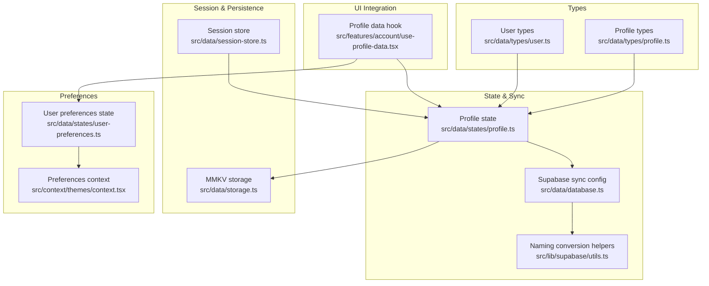
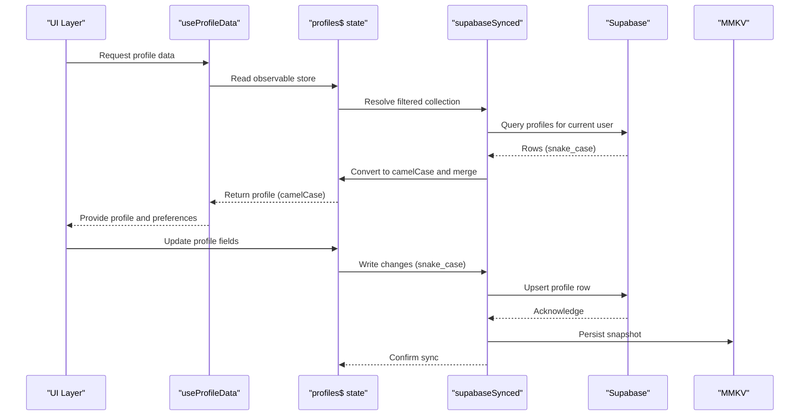
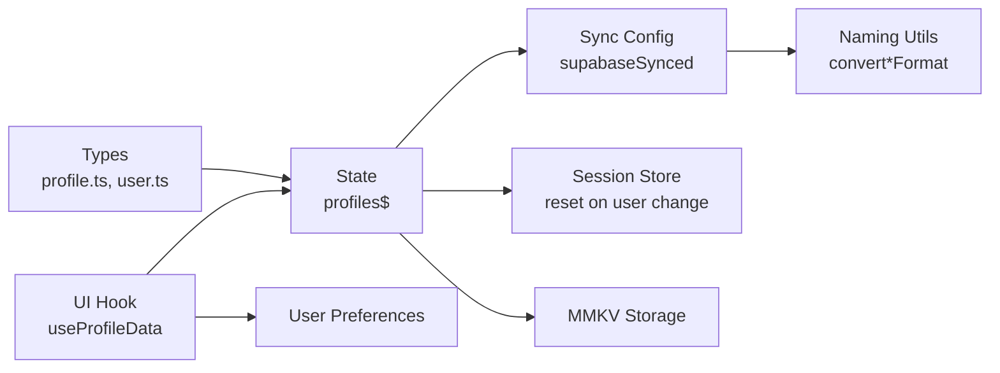

# Profile Entity Model

<cite>
**Referenced Files in This Document**
- [profile.ts](file://src/data/types/profile.ts)
- [user.ts](file://src/data/types/user.ts)
- [profile.ts](file://src/data/states/profile.ts)
- [database.ts](file://src/data/database.ts)
- [session-store.ts](file://src/data/session-store.ts)
- [storage.ts](file://src/data/storage.ts)
- [utils.ts](file://src/lib/supabase/utils.ts)
- [profile.ts](file://src/features/account/use-profile-data.tsx)
- [user-preferences.ts](file://src/data/states/user-preferences.ts)
- [context.tsx](file://src/context/themes/context.tsx)
- [sync.ts](file://src/services/sync.ts)
</cite>

## Table of Contents
1. [Introduction](#introduction)
2. [Project Structure](#project-structure)
3. [Core Components](#core-components)
4. [Architecture Overview](#architecture-overview)
5. [Detailed Component Analysis](#detailed-component-analysis)
6. [Dependency Analysis](#dependency-analysis)
7. [Performance Considerations](#performance-considerations)
8. [Troubleshooting Guide](#troubleshooting-guide)
9. [Conclusion](#conclusion)
10. [Appendices](#appendices)

## Introduction
This document defines the Profile entity model in PowerLists, focusing on the data schema, relationships with the User entity, preference management, validation and update mechanisms, synchronization with user sessions, and migration and persistence strategies. It consolidates type definitions, state management, database synchronization, and session lifecycle to provide a complete understanding of how profile data is modeled and managed across the application.

## Project Structure
The Profile model spans several layers:
- Types define the canonical shape of Profile and related operations.
- State management integrates with Supabase via a synced observable store.
- Session management ensures profile data resets when the user changes.
- Persistence uses MMKV for offline availability and resilience.
- Preferences are decoupled from Profile but integrated at runtime.

**Diagram sources**
- [profile.ts:1-29](file://src/data/types/profile.ts#L1-L29)
- [user.ts:1-44](file://src/data/types/user.ts#L1-L44)
- [profile.ts:1-194](file://src/data/states/profile.ts#L1-L194)
- [database.ts:1-36](file://src/data/database.ts#L1-L36)
- [utils.ts:1-10](file://src/lib/supabase/utils.ts#L1-L10)
- [session-store.ts:1-24](file://src/data/session-store.ts#L1-L24)
- [storage.ts:1-74](file://src/data/storage.ts#L1-L74)
- [user-preferences.ts:1-28](file://src/data/states/user-preferences.ts#L1-L28)
- [context.tsx:1-18](file://src/context/themes/context.tsx#L1-L18)
- [profile.ts:1-18](file://src/features/account/use-profile-data.tsx#L1-L18)

**Section sources**
- [profile.ts:1-29](file://src/data/types/profile.ts#L1-L29)
- [user.ts:1-44](file://src/data/types/user.ts#L1-L44)
- [profile.ts:1-194](file://src/data/states/profile.ts#L1-L194)
- [database.ts:1-36](file://src/data/database.ts#L1-L36)
- [utils.ts:1-10](file://src/lib/supabase/utils.ts#L1-L10)
- [session-store.ts:1-24](file://src/data/session-store.ts#L1-L24)
- [storage.ts:1-74](file://src/data/storage.ts#L1-L74)
- [user-preferences.ts:1-28](file://src/data/states/user-preferences.ts#L1-L28)
- [context.tsx:1-18](file://src/context/themes/context.tsx#L1-L18)
- [profile.ts:1-18](file://src/features/account/use-profile-data.tsx#L1-L18)

## Core Components
- Profile data model: Defines the canonical fields and operation types for Profile.
- Profile state: Provides CRUD operations backed by a synced observable store.
- User model: Distinguishes authenticated users from guest users and supports unified user operations.
- Session lifecycle: Resets profile state when the active user changes.
- Persistence: Uses MMKV for offline availability and cross-session continuity.
- Preferences: Separate from Profile, but integrated at runtime for theme and color scheme.

**Section sources**
- [profile.ts:1-29](file://src/data/types/profile.ts#L1-L29)
- [profile.ts:1-194](file://src/data/states/profile.ts#L1-L194)
- [user.ts:1-44](file://src/data/types/user.ts#L1-L44)
- [session-store.ts:1-24](file://src/data/session-store.ts#L1-L24)
- [storage.ts:1-74](file://src/data/storage.ts#L1-L74)
- [user-preferences.ts:1-28](file://src/data/states/user-preferences.ts#L1-L28)

## Architecture Overview
The Profile entity is represented in two forms:
- Database schema (snake_case): Stored in Supabase with strict column definitions.
- Application types (camelCase): Used in TypeScript code and synchronized via naming conversion.

Profile state is configured to:
- Sync with Supabase using a merged mode and MMKV persistence.
- Filter by the current user’s identifier.
- Persist locally and retry synchronization on failures.

**Diagram sources**
- [profile.ts:1-18](file://src/features/account/use-profile-data.tsx#L1-L18)
- [profile.ts:10-20](file://src/data/states/profile.ts#L10-L20)
- [database.ts:13-29](file://src/data/database.ts#L13-L29)
- [utils.ts:3-9](file://src/lib/supabase/utils.ts#L3-L9)
- [storage.ts:1-23](file://src/data/storage.ts#L1-L23)

## Detailed Component Analysis

### Profile Data Model
- Fields:
  - Identifier and ownership: id, userId
  - Personal info: name
  - Media and biographical: avatarUrl, bio
  - Timestamps: createdAt, updatedAt
- Operation types:
  - CreateProfileType: excludes id, timestamps
  - UpdateProfileType: partial updates excluding id, userId, timestamps
  - DeleteProfileType: minimal deletion payload

Validation and constraints:
- Name is required during creation and updates.
- Unique constraint on user_id implies one profile per user.
- Timestamps are managed automatically by the backend and synchronized.

**Section sources**
- [profile.ts:1-29](file://src/data/types/profile.ts#L1-L29)

### Relationship Between Profile and User
- One-to-one: Each authenticated user has exactly one profile.
- Ownership: Profile.userId references the authenticated user id.
- Guest users: Identified by a flag; they do not participate in the same profile lifecycle as authenticated users.

Practical implications:
- Profile retrieval filters by the current user id.
- Session changes trigger profile store reset to avoid stale data.

**Section sources**
- [user.ts:5-13](file://src/data/types/user.ts#L5-L13)
- [database.ts:31-35](file://src/data/database.ts#L31-L35)
- [session-store.ts:10-22](file://src/data/session-store.ts#L10-L22)

### Profile CRUD Operations
- Retrieve: Reads the single profile for the current user from the synced store.
- Create: Generates a new id, validates presence of name, and writes to the store (synced to Supabase).
- Update: Requires name; updates individual fields and sets updated_at.
- Delete: Removes the profile row for the current user.

Naming conversion:
- Writes to Supabase use snake_case; reads are converted to camelCase for application use.

**Section sources**
- [profile.ts:33-48](file://src/data/states/profile.ts#L33-L48)
- [profile.ts:61-103](file://src/data/states/profile.ts#L61-L103)
- [profile.ts:121-159](file://src/data/states/profile.ts#L121-L159)
- [profile.ts:171-186](file://src/data/states/profile.ts#L171-L186)
- [utils.ts:3-9](file://src/lib/supabase/utils.ts#L3-L9)

### Preference Management
- Theme and color scheme: Managed separately in user preferences state.
- Persistence: Preferences are persisted via MMKV and synced across sessions.
- Integration: The profile data hook exposes theme and color scheme alongside profile data.

Scope of preferences:
- Theme selection
- Color scheme (light/dark/system)
- Background color token

Note: Notification preferences and language settings are not part of the Profile entity in the current codebase.

**Section sources**
- [user-preferences.ts:6-10](file://src/data/states/user-preferences.ts#L6-L10)
- [user-preferences.ts:12-25](file://src/data/states/user-preferences.ts#L12-L25)
- [context.tsx:1-18](file://src/context/themes/context.tsx#L1-L18)
- [profile.ts:1-18](file://src/features/account/use-profile-data.tsx#L1-L18)

### Session Synchronization and Reset
- The session store observes the active user and resets profile state when the user id changes.
- This prevents stale profile data from persisting across user sessions.

**Section sources**
- [session-store.ts:7-22](file://src/data/session-store.ts#L7-L22)
- [profile.ts:188-193](file://src/data/states/profile.ts#L188-L193)

### Data Validation and Update Mechanisms
- Required fields: name is mandatory for creation and updates.
- Conditional updates: avatarUrl and bio accept undefined to skip updates.
- Timestamps: updated_at is set on each update; createdAt is set on creation.

**Section sources**
- [profile.ts:67-69](file://src/data/states/profile.ts#L67-L69)
- [profile.ts:127-128](file://src/data/states/profile.ts#L127-L128)
- [profile.ts:149-149](file://src/data/states/profile.ts#L149-L149)

### Persistence and Migration
- Persistence: Profiles are persisted in MMKV under a dedicated namespace and metadata key.
- Migration: Lists are migrated to a new user by updating their profile_id; similar migrations for profiles could follow the same pattern.

**Section sources**
- [storage.ts:1-23](file://src/data/storage.ts#L1-L23)
- [profile.ts:190-192](file://src/data/states/profile.ts#L190-L192)
- [sync.ts:183-187](file://src/services/sync.ts#L183-L187)

### UI Integration Example
- The profile data hook aggregates user, profile, and preferences for consumption in UI components.
- It derives the current profile from the observable store keyed by the current user id.

**Section sources**
- [profile.ts:7-15](file://src/features/account/use-profile-data.tsx#L7-L15)

## Dependency Analysis
Profile depends on:
- Types for shape and operations
- State layer for observable and synced store
- Database configuration for Supabase connectivity and persistence
- Naming conversion utilities for field casing
- Session store for lifecycle management
- Storage for persistence

**Diagram sources**
- [profile.ts:1-29](file://src/data/types/profile.ts#L1-L29)
- [user.ts:1-44](file://src/data/types/user.ts#L1-L44)
- [profile.ts:1-194](file://src/data/states/profile.ts#L1-L194)
- [database.ts:13-29](file://src/data/database.ts#L13-L29)
- [utils.ts:1-10](file://src/lib/supabase/utils.ts#L1-L10)
- [session-store.ts:1-24](file://src/data/session-store.ts#L1-L24)
- [storage.ts:1-74](file://src/data/storage.ts#L1-L74)
- [profile.ts:1-18](file://src/features/account/use-profile-data.tsx#L1-L18)
- [user-preferences.ts:1-28](file://src/data/states/user-preferences.ts#L1-L28)

**Section sources**
- [profile.ts:1-20](file://src/data/states/profile.ts#L1-L20)
- [database.ts:13-29](file://src/data/database.ts#L13-L29)
- [utils.ts:1-10](file://src/lib/supabase/utils.ts#L1-L10)
- [session-store.ts:1-24](file://src/data/session-store.ts#L1-L24)
- [storage.ts:1-74](file://src/data/storage.ts#L1-L74)
- [profile.ts:1-18](file://src/features/account/use-profile-data.tsx#L1-L18)
- [user-preferences.ts:1-28](file://src/data/states/user-preferences.ts#L1-L28)

## Performance Considerations
- Sync mode: Merged mode reduces conflicts and optimizes reconciliation.
- Retry strategy: Infinite retries improve reliability for offline scenarios.
- Local persistence: MMKV minimizes network round-trips and accelerates UI responsiveness.
- Field updates: Partial updates avoid unnecessary writes and reduce bandwidth.

[No sources needed since this section provides general guidance]

## Troubleshooting Guide
Common issues and resolutions:
- Profile not found: Occurs when no profile exists for the current user id; ensure creation ran successfully.
- Authentication errors: Creation requires an authenticated user; verify session state.
- Incorrect casing: Ensure writes use snake_case and reads are converted to camelCase.
- Stale data after logout/login: Session store resets profile state; confirm reset triggers.

**Section sources**
- [profile.ts:67-69](file://src/data/states/profile.ts#L67-L69)
- [profile.ts:131-133](file://src/data/states/profile.ts#L131-L133)
- [session-store.ts:15-21](file://src/data/session-store.ts#L15-L21)
- [utils.ts:3-9](file://src/lib/supabase/utils.ts#L3-L9)

## Conclusion
The Profile entity in PowerLists is a compact, strongly typed model that extends user identity with personal details and preferences. Its state is reliably synchronized with Supabase, persisted locally, and seamlessly integrated into the session lifecycle. While preferences are handled separately, the profile data model provides a solid foundation for user customization and future enhancements.

[No sources needed since this section summarizes without analyzing specific files]

## Appendices

### Appendix A: Profile Schema Reference
- Columns:
  - id: primary key
  - user_id: unique, references auth.users
  - name: required
  - avatar_url: nullable
  - bio: nullable
  - created_at: timestamp
  - updated_at: timestamp (nullable)

**Section sources**
- [profile.ts:1-19](file://src/data/types/profile.ts#L1-L19)

### Appendix B: Preference Configuration Examples
- Theme selection: Choose among available theme keys.
- Color scheme: Toggle between light, dark, or system.
- Background color: Apply a named CSS variable token.

**Section sources**
- [user-preferences.ts:6-10](file://src/data/states/user-preferences.ts#L6-L10)
- [user-preferences.ts:12-25](file://src/data/states/user-preferences.ts#L12-L25)