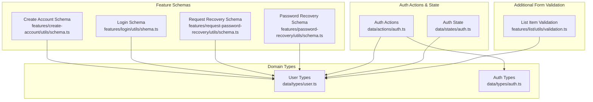
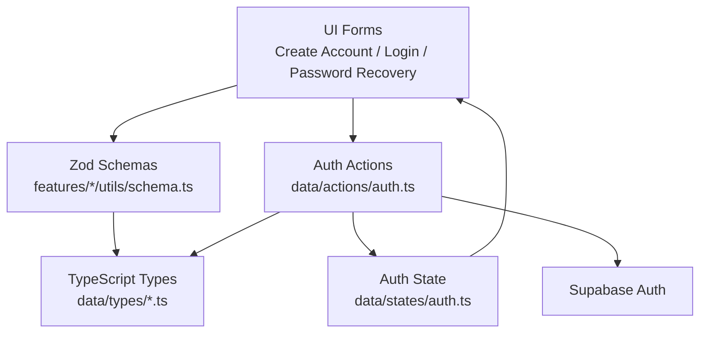
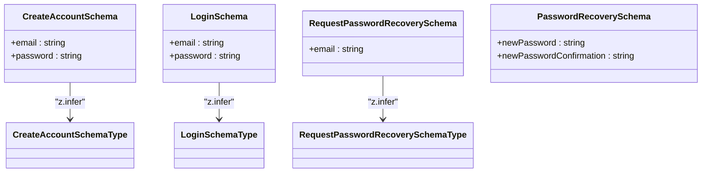
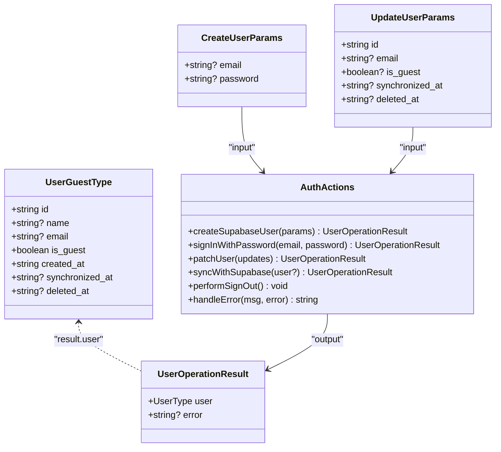
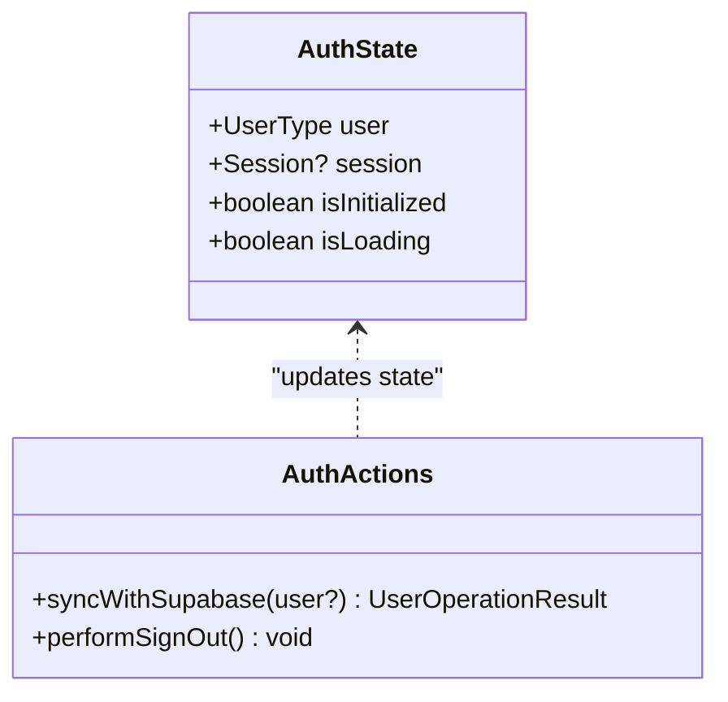
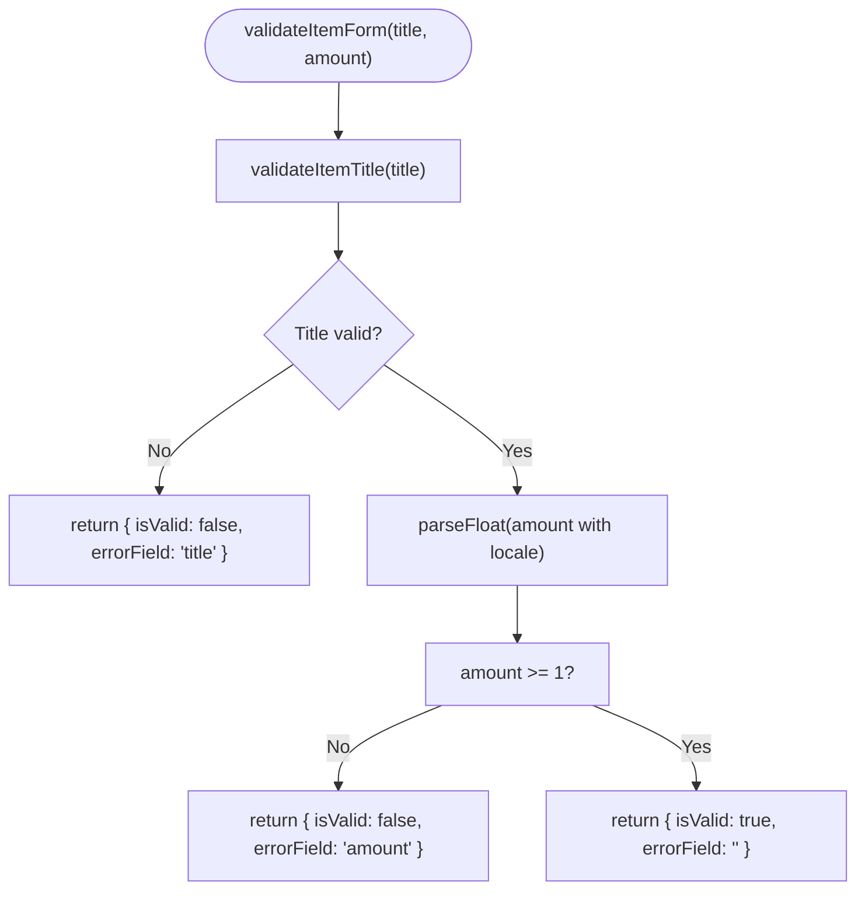
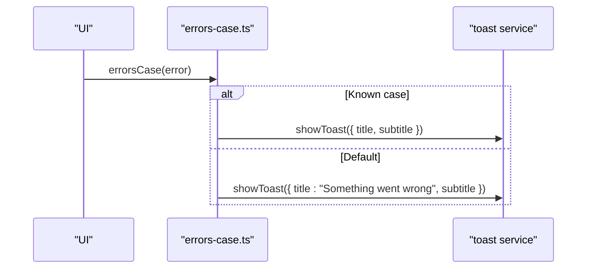
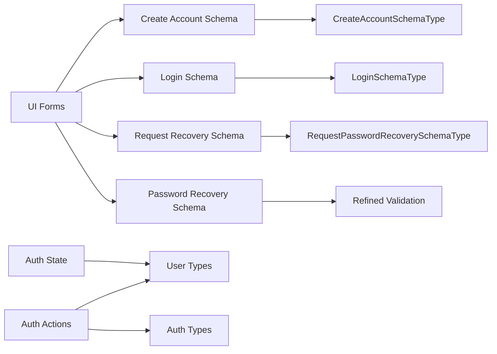

# Type Validation and Schemas

<cite>
**Referenced Files in This Document**
- [src/data/types/auth.ts](file://src/data/types/auth.ts)
- [src/data/types/user.ts](file://src/data/types/user.ts)
- [src/data/actions/auth.ts](file://src/data/actions/auth.ts)
- [src/data/states/auth.ts](file://src/data/states/auth.ts)
- [src/features/create-account/utils/schema.ts](file://src/features/create-account/utils/schema.ts)
- [src/features/create-account/types.ts](file://src/features/create-account/types.ts)
- [src/features/login/utils/shema.ts](file://src/features/login/utils/shema.ts)
- [src/features/login/types.ts](file://src/features/login/types.ts)
- [src/features/request-password-recovery/utils/schema.ts](file://src/features/request-password-recovery/utils/schema.ts)
- [src/features/request-password-recovery/utils/errors-case.ts](file://src/features/request-password-recovery/utils/errors-case.ts)
- [src/features/request-password-recovery/types.ts](file://src/features/request-password-recovery/types.ts)
- [src/features/password-recovery/utils/schema.ts](file://src/features/password-recovery/utils/schema.ts)
- [src/features/list/utils/validation.ts](file://src/features/list/utils/validation.ts)
</cite>

## Table of Contents
1. [Introduction](#introduction)
2. [Project Structure](#project-structure)
3. [Core Components](#core-components)
4. [Architecture Overview](#architecture-overview)
5. [Detailed Component Analysis](#detailed-component-analysis)
6. [Dependency Analysis](#dependency-analysis)
7. [Performance Considerations](#performance-considerations)
8. [Troubleshooting Guide](#troubleshooting-guide)
9. [Conclusion](#conclusion)
10. [Appendices](#appendices)

## Introduction
This document explains how PowerLists implements type validation and schemas across the application. It focuses on:
- Zod-based runtime validation schemas for forms (registration, login, password recovery)
- TypeScript interfaces and types used for user and auth domain modeling
- Type-safe transformation patterns and middleware-like wrappers around authentication operations
- Error handling strategies, user feedback mechanisms, and data sanitization
- Practical guidance for evolving schemas while maintaining backward compatibility

## Project Structure
Validation and schema-related code is organized by feature and domain:
- Feature-level Zod schemas live under each feature’s utils directory
- TypeScript domain types live under data/types
- Authentication action wrappers and state reside under data/actions and data/states
- Additional form-level validations (non-Zod) exist for list item forms

**Diagram sources**
- [src/features/create-account/utils/schema.ts:1-9](file://src/features/create-account/utils/schema.ts#L1-L9)
- [src/features/login/utils/shema.ts:1-9](file://src/features/login/utils/shema.ts#L1-L9)
- [src/features/request-password-recovery/utils/schema.ts:1-6](file://src/features/request-password-recovery/utils/schema.ts#L1-L6)
- [src/features/password-recovery/utils/schema.ts:1-18](file://src/features/password-recovery/utils/schema.ts#L1-L18)
- [src/data/types/user.ts:1-44](file://src/data/types/user.ts#L1-L44)
- [src/data/types/auth.ts:1-26](file://src/data/types/auth.ts#L1-L26)
- [src/data/actions/auth.ts:1-138](file://src/data/actions/auth.ts#L1-L138)
- [src/data/states/auth.ts:1-34](file://src/data/states/auth.ts#L1-L34)
- [src/features/list/utils/validation.ts:1-66](file://src/features/list/utils/validation.ts#L1-L66)

**Section sources**
- [src/features/create-account/utils/schema.ts:1-9](file://src/features/create-account/utils/schema.ts#L1-L9)
- [src/features/login/utils/shema.ts:1-9](file://src/features/login/utils/shema.ts#L1-L9)
- [src/features/request-password-recovery/utils/schema.ts:1-6](file://src/features/request-password-recovery/utils/schema.ts#L1-L6)
- [src/features/password-recovery/utils/schema.ts:1-18](file://src/features/password-recovery/utils/schema.ts#L1-L18)
- [src/data/types/user.ts:1-44](file://src/data/types/user.ts#L1-L44)
- [src/data/types/auth.ts:1-26](file://src/data/types/auth.ts#L1-L26)
- [src/data/actions/auth.ts:1-138](file://src/data/actions/auth.ts#L1-L138)
- [src/data/states/auth.ts:1-34](file://src/data/states/auth.ts#L1-L34)
- [src/features/list/utils/validation.ts:1-66](file://src/features/list/utils/validation.ts#L1-L66)

## Core Components
- Zod schemas for forms:
  - Registration: enforces email validity and minimum password length
  - Login: enforces email validity and minimum password length
  - Request password recovery: enforces email validity
  - Password recovery: enforces minimum length and cross-field equality via refine
- TypeScript domain types:
  - User model supporting guest and authenticated users
  - Auth operation parameters/results and helpers
- Auth action wrappers:
  - Safe wrappers around Supabase auth operations with typed results
  - Centralized error handling and user synchronization
- Auth state:
  - Observable state persisted locally with session metadata
- Additional form-level validation:
  - List item title and amount validation with user feedback

**Section sources**
- [src/features/create-account/utils/schema.ts:1-9](file://src/features/create-account/utils/schema.ts#L1-L9)
- [src/features/login/utils/shema.ts:1-9](file://src/features/login/utils/shema.ts#L1-L9)
- [src/features/request-password-recovery/utils/schema.ts:1-6](file://src/features/request-password-recovery/utils/schema.ts#L1-L6)
- [src/features/password-recovery/utils/schema.ts:1-18](file://src/features/password-recovery/utils/schema.ts#L1-L18)
- [src/data/types/user.ts:1-44](file://src/data/types/user.ts#L1-L44)
- [src/data/types/auth.ts:1-26](file://src/data/types/auth.ts#L1-L26)
- [src/data/actions/auth.ts:1-138](file://src/data/actions/auth.ts#L1-L138)
- [src/data/states/auth.ts:1-34](file://src/data/states/auth.ts#L1-L34)
- [src/features/list/utils/validation.ts:1-66](file://src/features/list/utils/validation.ts#L1-L66)

## Architecture Overview
The validation architecture separates concerns:
- Feature-level Zod schemas define input contracts for forms
- TypeScript types define domain models and operation signatures
- Auth actions wrap external service calls with typed results and centralized error handling
- Auth state persists and synchronizes user/session data

**Diagram sources**
- [src/features/create-account/utils/schema.ts:1-9](file://src/features/create-account/utils/schema.ts#L1-L9)
- [src/features/login/utils/shema.ts:1-9](file://src/features/login/utils/shema.ts#L1-L9)
- [src/features/request-password-recovery/utils/schema.ts:1-6](file://src/features/request-password-recovery/utils/schema.ts#L1-L6)
- [src/features/password-recovery/utils/schema.ts:1-18](file://src/features/password-recovery/utils/schema.ts#L1-L18)
- [src/data/types/user.ts:1-44](file://src/data/types/user.ts#L1-L44)
- [src/data/types/auth.ts:1-26](file://src/data/types/auth.ts#L1-L26)
- [src/data/actions/auth.ts:1-138](file://src/data/actions/auth.ts#L1-L138)
- [src/data/states/auth.ts:1-34](file://src/data/states/auth.ts#L1-L34)

## Detailed Component Analysis

### Zod Schemas and Type-Safe Inference
- Registration schema enforces:
  - Email format
  - Minimum password length
- Login schema enforces:
  - Email format
  - Minimum password length
- Request password recovery schema enforces:
  - Email format
- Password recovery schema enforces:
  - Minimum length for new password
  - Cross-field equality via refine for confirmation field
- Type inference:
  - Feature-specific types infer TypeScript types from Zod schemas for safe usage in UI and actions

**Diagram sources**
- [src/features/create-account/utils/schema.ts:1-9](file://src/features/create-account/utils/schema.ts#L1-L9)
- [src/features/create-account/types.ts:1-4](file://src/features/create-account/types.ts#L1-L4)
- [src/features/login/utils/shema.ts:1-9](file://src/features/login/utils/shema.ts#L1-L9)
- [src/features/login/types.ts:1-4](file://src/features/login/types.ts#L1-L4)
- [src/features/request-password-recovery/utils/schema.ts:1-6](file://src/features/request-password-recovery/utils/schema.ts#L1-L6)
- [src/features/request-password-recovery/types.ts:1-4](file://src/features/request-password-recovery/types.ts#L1-L4)
- [src/features/password-recovery/utils/schema.ts:1-18](file://src/features/password-recovery/utils/schema.ts#L1-L18)

**Section sources**
- [src/features/create-account/utils/schema.ts:1-9](file://src/features/create-account/utils/schema.ts#L1-L9)
- [src/features/create-account/types.ts:1-4](file://src/features/create-account/types.ts#L1-L4)
- [src/features/login/utils/shema.ts:1-9](file://src/features/login/utils/shema.ts#L1-L9)
- [src/features/login/types.ts:1-4](file://src/features/login/types.ts#L1-L4)
- [src/features/request-password-recovery/utils/schema.ts:1-6](file://src/features/request-password-recovery/utils/schema.ts#L1-L6)
- [src/features/request-password-recovery/types.ts:1-4](file://src/features/request-password-recovery/types.ts#L1-L4)
- [src/features/password-recovery/utils/schema.ts:1-18](file://src/features/password-recovery/utils/schema.ts#L1-L18)

### Authentication Domain Types and Helpers
- User model supports:
  - Guest user representation
  - Discriminator helper to identify guests
- Auth operation parameters/results:
  - Typed parameters for create/update operations
  - Consistent result shape with optional error messages
- Auth action wrappers:
  - Safe wrappers around Supabase auth operations
  - Centralized error handling and user synchronization
  - Session and user persistence via observable state

**Diagram sources**
- [src/data/types/user.ts:1-44](file://src/data/types/user.ts#L1-L44)
- [src/data/actions/auth.ts:1-138](file://src/data/actions/auth.ts#L1-L138)

**Section sources**
- [src/data/types/user.ts:1-44](file://src/data/types/user.ts#L1-L44)
- [src/data/actions/auth.ts:1-138](file://src/data/actions/auth.ts#L1-L138)

### Auth State and Persistence
- Observable auth state with:
  - Persisted user via MMKV
  - Session metadata
  - Initialization/loading flags
- Used by auth actions to update UI and synchronize user data

**Diagram sources**
- [src/data/states/auth.ts:1-34](file://src/data/states/auth.ts#L1-L34)
- [src/data/actions/auth.ts:1-138](file://src/data/actions/auth.ts#L1-L138)

**Section sources**
- [src/data/states/auth.ts:1-34](file://src/data/states/auth.ts#L1-L34)
- [src/data/actions/auth.ts:1-138](file://src/data/actions/auth.ts#L1-L138)

### Form-Level Validation Utilities (List Items)
- Validates:
  - Title minimum length
  - Amount numeric conversion and positivity
- Returns structured result with error field identification
- Emits user-facing toast notifications on validation failure

**Diagram sources**
- [src/features/list/utils/validation.ts:1-66](file://src/features/list/utils/validation.ts#L1-L66)

**Section sources**
- [src/features/list/utils/validation.ts:1-66](file://src/features/list/utils/validation.ts#L1-L66)

### Error Handling Strategies and User Feedback
- Centralized error handling in auth actions:
  - Typed error extraction and user-friendly messages
- Feature-specific error mapping:
  - Request password recovery maps domain-specific error cases to user-facing toasts
- Toast-based user feedback:
  - Immediate, localized notifications for invalid inputs and operational failures

**Diagram sources**
- [src/features/request-password-recovery/utils/errors-case.ts:1-43](file://src/features/request-password-recovery/utils/errors-case.ts#L1-L43)

**Section sources**
- [src/data/actions/auth.ts:135-137](file://src/data/actions/auth.ts#L135-L137)
- [src/features/request-password-recovery/utils/errors-case.ts:1-43](file://src/features/request-password-recovery/utils/errors-case.ts#L1-L43)

### Data Sanitization Patterns
- Zod checks:
  - Trimming whitespace for sensitive fields
  - Minimum length enforcement
- Locale-aware refinement:
  - Password recovery schema uses locale configuration and cross-field refinement
- Numeric parsing:
  - List item amount parsing with locale decimal comma handling

**Section sources**
- [src/features/create-account/utils/schema.ts:1-9](file://src/features/create-account/utils/schema.ts#L1-L9)
- [src/features/login/utils/shema.ts:1-9](file://src/features/login/utils/shema.ts#L1-L9)
- [src/features/password-recovery/utils/schema.ts:1-18](file://src/features/password-recovery/utils/schema.ts#L1-L18)
- [src/features/list/utils/validation.ts:32-42](file://src/features/list/utils/validation.ts#L32-L42)

### Schema Evolution and Backward Compatibility
- Keep Zod schemas close to feature boundaries for controlled evolution
- Use type inference to maintain alignment between schemas and TypeScript types
- Add refinements and checks incrementally; preserve existing fields when extending
- Maintain legacy types temporarily during migration windows
- Versioning at runtime:
  - Introduce discriminators or version fields in domain types when evolving user or auth models
  - Keep backward-compatible parsing logic in action wrappers

[No sources needed since this section provides general guidance]

## Dependency Analysis
Key relationships:
- Feature schemas depend on Zod mini and feed into feature-specific types
- Auth actions depend on domain types and state; they orchestrate Supabase interactions
- UI forms consume both Zod schemas and inferred types for safe typing

**Diagram sources**
- [src/features/create-account/utils/schema.ts:1-9](file://src/features/create-account/utils/schema.ts#L1-L9)
- [src/features/create-account/types.ts:1-4](file://src/features/create-account/types.ts#L1-L4)
- [src/features/login/utils/shema.ts:1-9](file://src/features/login/utils/shema.ts#L1-L9)
- [src/features/login/types.ts:1-4](file://src/features/login/types.ts#L1-L4)
- [src/features/request-password-recovery/utils/schema.ts:1-6](file://src/features/request-password-recovery/utils/schema.ts#L1-L6)
- [src/features/request-password-recovery/types.ts:1-4](file://src/features/request-password-recovery/types.ts#L1-L4)
- [src/features/password-recovery/utils/schema.ts:1-18](file://src/features/password-recovery/utils/schema.ts#L1-L18)
- [src/data/actions/auth.ts:1-138](file://src/data/actions/auth.ts#L1-L138)
- [src/data/types/user.ts:1-44](file://src/data/types/user.ts#L1-L44)
- [src/data/types/auth.ts:1-26](file://src/data/types/auth.ts#L1-L26)
- [src/data/states/auth.ts:1-34](file://src/data/states/auth.ts#L1-L34)

**Section sources**
- [src/features/create-account/utils/schema.ts:1-9](file://src/features/create-account/utils/schema.ts#L1-L9)
- [src/features/create-account/types.ts:1-4](file://src/features/create-account/types.ts#L1-L4)
- [src/features/login/utils/shema.ts:1-9](file://src/features/login/utils/shema.ts#L1-L9)
- [src/features/login/types.ts:1-4](file://src/features/login/types.ts#L1-L4)
- [src/features/request-password-recovery/utils/schema.ts:1-6](file://src/features/request-password-recovery/utils/schema.ts#L1-L6)
- [src/features/request-password-recovery/types.ts:1-4](file://src/features/request-password-recovery/types.ts#L1-L4)
- [src/features/password-recovery/utils/schema.ts:1-18](file://src/features/password-recovery/utils/schema.ts#L1-L18)
- [src/data/actions/auth.ts:1-138](file://src/data/actions/auth.ts#L1-L138)
- [src/data/types/user.ts:1-44](file://src/data/types/user.ts#L1-L44)
- [src/data/types/auth.ts:1-26](file://src/data/types/auth.ts#L1-L26)
- [src/data/states/auth.ts:1-34](file://src/data/states/auth.ts#L1-L34)

## Performance Considerations
- Prefer lightweight Zod checks and avoid expensive computations inside schemas
- Use refinement sparingly; cache derived values when reused across validations
- Keep UI-level validations synchronous and fast; delegate heavy work to background tasks
- Persist user state efficiently to minimize redundant network calls

[No sources needed since this section provides general guidance]

## Troubleshooting Guide
Common issues and resolutions:
- Invalid email or password:
  - Ensure Zod schemas are applied before submission
  - Use feature-specific types to guarantee correct shapes
- Password mismatch on recovery:
  - Rely on cross-field refine in the password recovery schema
- Excessive recovery emails:
  - Map server-side rate-limit errors to user-facing toasts
- Unexpected errors:
  - Use centralized error handling to extract meaningful messages

**Section sources**
- [src/features/password-recovery/utils/schema.ts:10-17](file://src/features/password-recovery/utils/schema.ts#L10-L17)
- [src/features/request-password-recovery/utils/errors-case.ts:1-43](file://src/features/request-password-recovery/utils/errors-case.ts#L1-L43)
- [src/data/actions/auth.ts:135-137](file://src/data/actions/auth.ts#L135-L137)

## Conclusion
PowerLists combines Zod schemas, TypeScript types, and action wrappers to enforce robust validation and type safety. Feature-level schemas ensure consistent input contracts, while domain types and action wrappers centralize auth logic and error handling. UI feedback is immediate and user-focused, and additional form-level validations protect against malformed data. For future evolution, keep schemas close to features, leverage type inference, and introduce versioning carefully in domain types and action wrappers.

## Appendices
- Integration tips:
  - Use z.infer to derive TypeScript types from Zod schemas for form handlers
  - Wrap external service calls in typed action functions to normalize errors and state updates
  - Emit toasts for both schema-level and runtime validation failures

[No sources needed since this section provides general guidance]