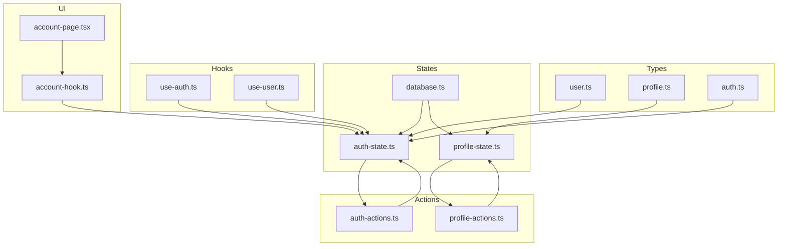
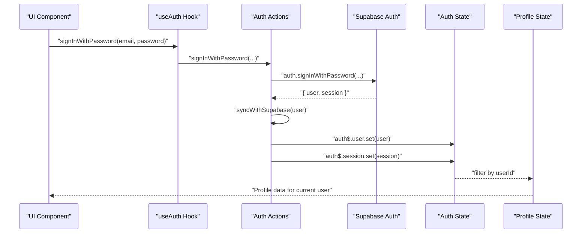
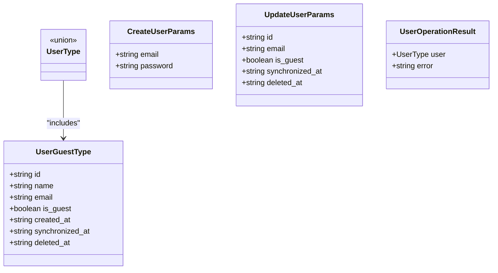
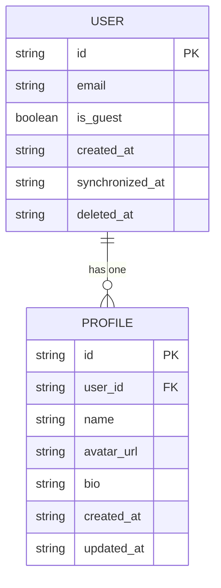
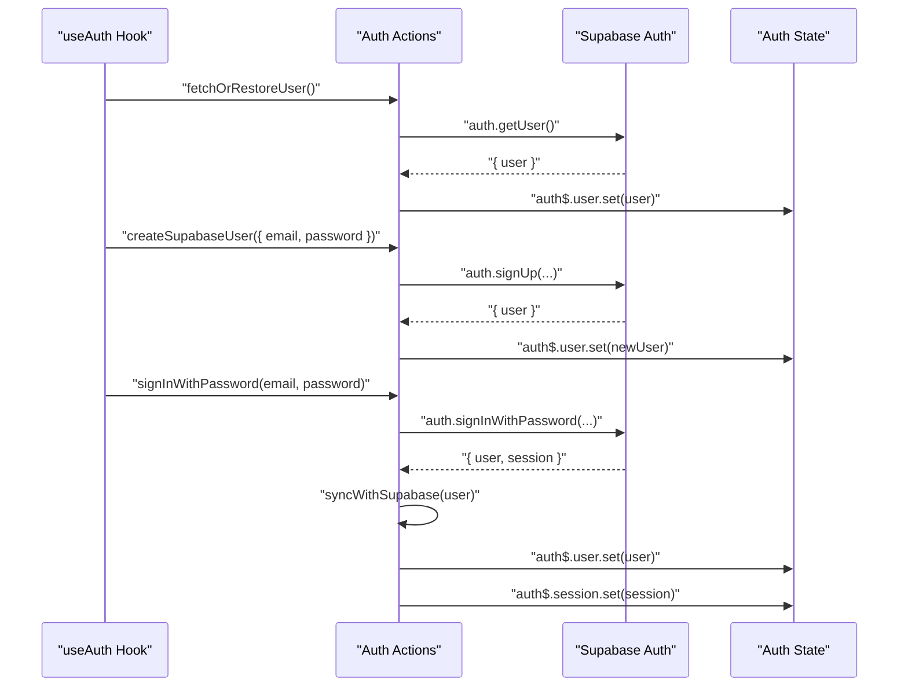
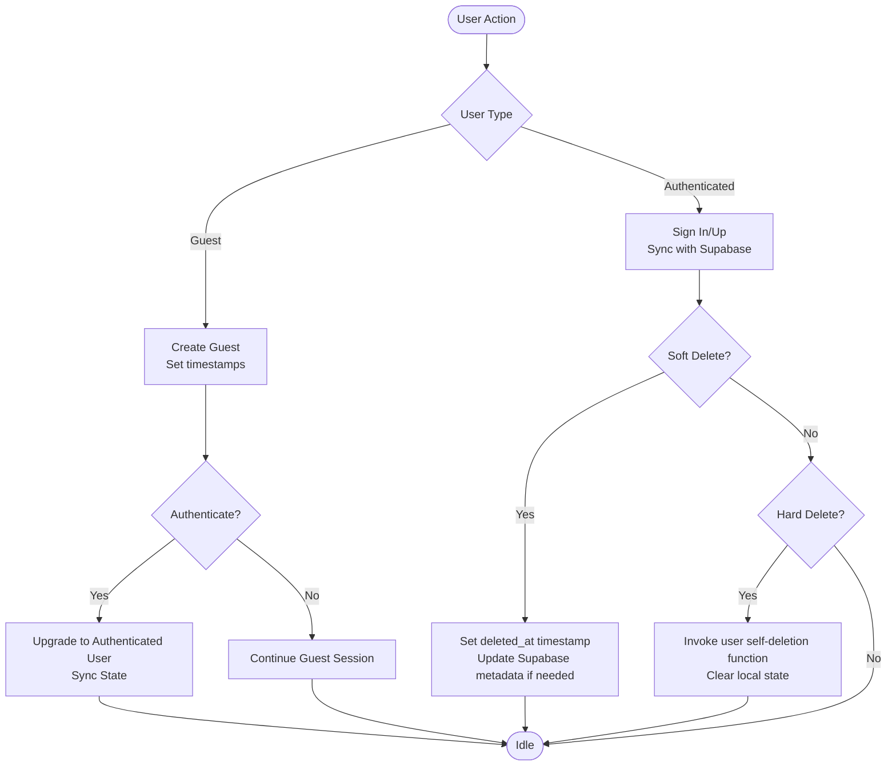
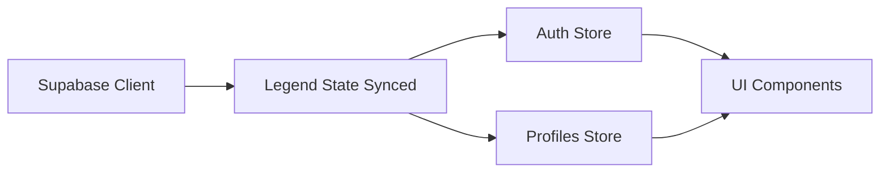
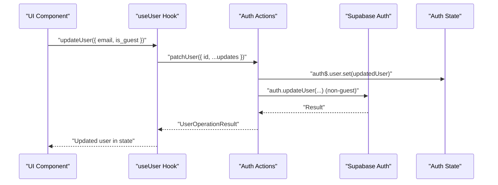
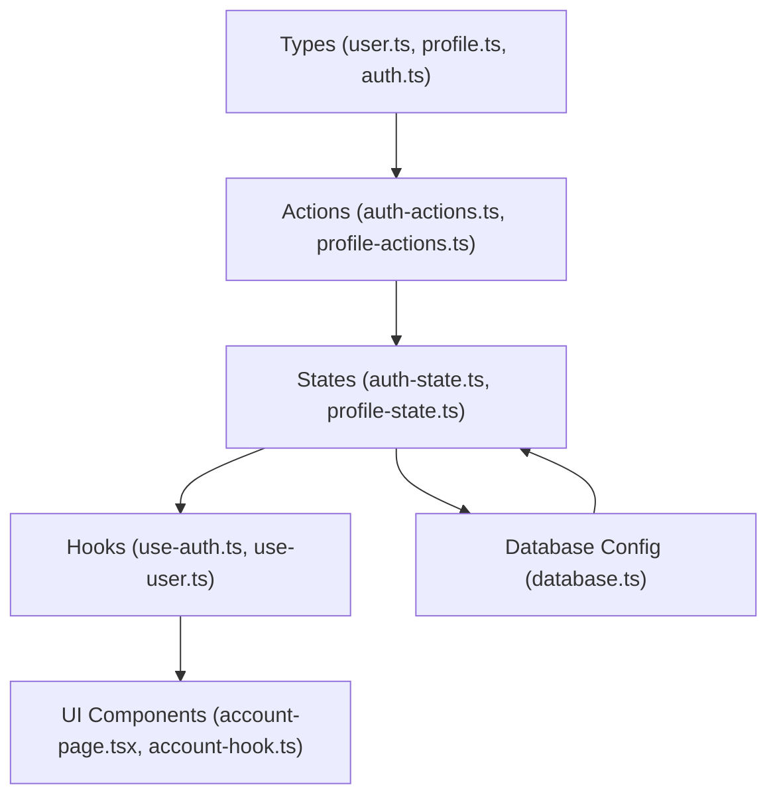

# User Entity Model

<cite>
**Referenced Files in This Document**
- [user.ts](file://src/data/types/user.ts)
- [profile.ts](file://src/data/types/profile.ts)
- [auth.ts](file://src/data/types/auth.ts)
- [auth-state.ts](file://src/data/states/auth.ts)
- [profile-state.ts](file://src/data/states/profile.ts)
- [auth-actions.ts](file://src/data/actions/auth.ts)
- [profile-actions.ts](file://src/data/actions/profile.ts)
- [use-auth.ts](file://src/hooks/use-auth.ts)
- [use-user.ts](file://src/hooks/use-user.ts)
- [account-page.tsx](file://src/features/account/page.tsx)
- [account-hook.ts](file://src/features/account/use-profile-data.tsx)
- [database.ts](file://src/data/database.ts)
</cite>

## Table of Contents
1. [Introduction](#introduction)
2. [Project Structure](#project-structure)
3. [Core Components](#core-components)
4. [Architecture Overview](#architecture-overview)
5. [Detailed Component Analysis](#detailed-component-analysis)
6. [Dependency Analysis](#dependency-analysis)
7. [Performance Considerations](#performance-considerations)
8. [Troubleshooting Guide](#troubleshooting-guide)
9. [Conclusion](#conclusion)
10. [Appendices](#appendices)

## Introduction
This document provides comprehensive data model documentation for the User entity in PowerLists. It covers the User interface structure, relationships with the Profile entity, authentication-related data types, lifecycle events, validation requirements, security considerations, Supabase integration, and practical usage patterns. The goal is to help developers understand how user data flows through the application state and interacts with Supabase authentication and real-time synchronization.

## Project Structure
The User model spans several layers:
- Types define the shape of user and profile data, including guest users and authentication results.
- Actions encapsulate user operations such as sign-in, sign-up, guest creation, and soft/hard deletion.
- States maintain the application's reactive user/session state and synchronize with Supabase.
- Hooks expose convenient APIs for UI components to interact with user data.
- Profile state and actions manage user preferences and settings linked to each user.

**Diagram sources**
- [user.ts:1-44](file://src/data/types/user.ts#L1-L44)
- [profile.ts:1-29](file://src/data/types/profile.ts#L1-L29)
- [auth.ts:1-26](file://src/data/types/auth.ts#L1-L26)
- [auth-state.ts:1-34](file://src/data/states/auth.ts#L1-L34)
- [profile-state.ts:1-194](file://src/data/states/profile.ts#L1-L194)
- [auth-actions.ts:1-138](file://src/data/actions/auth.ts#L1-L138)
- [profile-actions.ts:1-53](file://src/data/actions/profile.ts#L1-L53)
- [use-auth.ts:1-261](file://src/hooks/use-auth.ts#L1-L261)
- [use-user.ts:1-85](file://src/hooks/use-user.ts#L1-L85)
- [account-page.tsx:1-70](file://src/features/account/page.tsx#L1-L70)
- [account-hook.ts:1-18](file://src/features/account/use-profile-data.tsx#L1-L18)
- [database.ts:1-36](file://src/data/database.ts#L1-L36)

**Section sources**
- [user.ts:1-44](file://src/data/types/user.ts#L1-L44)
- [profile.ts:1-29](file://src/data/types/profile.ts#L1-L29)
- [auth.ts:1-26](file://src/data/types/auth.ts#L1-L26)
- [auth-state.ts:1-34](file://src/data/states/auth.ts#L1-L34)
- [profile-state.ts:1-194](file://src/data/states/profile.ts#L1-L194)
- [auth-actions.ts:1-138](file://src/data/actions/auth.ts#L1-L138)
- [profile-actions.ts:1-53](file://src/data/actions/profile.ts#L1-L53)
- [use-auth.ts:1-261](file://src/hooks/use-auth.ts#L1-L261)
- [use-user.ts:1-85](file://src/hooks/use-user.ts#L1-L85)
- [account-page.tsx:1-70](file://src/features/account/page.tsx#L1-L70)
- [account-hook.ts:1-18](file://src/features/account/use-profile-data.tsx#L1-L18)
- [database.ts:1-36](file://src/data/database.ts#L1-L36)

## Core Components
This section documents the User and related data structures, including guest users, authentication results, and user operation outcomes.

- User types and guest user representation:
  - UserType unions Supabase user, guest user, or null.
  - UserGuestType includes identifiers, guest flag, timestamps, and optional deletion markers.
  - Validation and helpers: isGuestUser predicate to distinguish guest users.

- Authentication-related types:
  - GetUserAuthResult wraps the authenticated user or null.
  - Sign-up/sign-in parameters and results include user and session data.
  - Password recovery parameters.

- User operation parameters and results:
  - CreateUserParams supports email and password for new users.
  - UpdateUserParams supports updates to user attributes including guest flag and timestamps.
  - UserOperationResult standardizes success/error responses.

**Section sources**
- [user.ts:1-44](file://src/data/types/user.ts#L1-L44)
- [auth.ts:1-26](file://src/data/types/auth.ts#L1-L26)

## Architecture Overview
The User model integrates with Supabase authentication and real-time synchronization via Legend State. The flow below illustrates how user data moves through the system during sign-in, session checks, and profile retrieval.

**Diagram sources**
- [use-auth.ts:76-121](file://src/hooks/use-auth.ts#L76-L121)
- [auth-actions.ts:99-110](file://src/data/actions/auth.ts#L99-L110)
- [auth-state.ts:22-33](file://src/data/states/auth.ts#L22-L33)
- [profile-state.ts:10-20](file://src/data/states/profile.ts#L10-L20)

## Detailed Component Analysis

### User Data Model
The User entity supports two primary forms:
- Supabase-authenticated users: Full user object with authentication metadata.
- Guest users: Lightweight user records for anonymous sessions with a guest flag and timestamps.

Key characteristics:
- User ID: Unique identifier used to link profiles and enforce ownership.
- Email: Required for authenticated users; optional for guests.
- Name: Optional display name for guests.
- Metadata: Timestamps for creation, synchronization, and deletion; guest flag distinguishes ephemeral sessions.

**Diagram sources**
- [user.ts:3-43](file://src/data/types/user.ts#L3-L43)

**Section sources**
- [user.ts:1-44](file://src/data/types/user.ts#L1-L44)

### Profile Relationship
Each user has a single associated profile containing personal details and preferences. The profile state filters data by the current user ID and synchronizes with Supabase.

- Profile schema fields:
  - id: Primary key.
  - userId: Foreign key linking to the user.
  - name: Required display name.
  - avatarUrl: Optional avatar URL.
  - bio: Optional biography.
  - createdAt/updatedAt: Timestamps for creation and updates.

- Operations:
  - Create profile with validation for authenticated users and required name.
  - Update profile fields with automatic timestamp updates.
  - Delete profile with cascade-like behavior through observable deletion.

**Diagram sources**
- [user.ts:5-13](file://src/data/types/user.ts#L5-L13)
- [profile.ts:11-19](file://src/data/types/profile.ts#L11-L19)
- [profile-state.ts:10-20](file://src/data/states/profile.ts#L10-L20)

**Section sources**
- [profile.ts:1-29](file://src/data/types/profile.ts#L1-L29)
- [profile-state.ts:1-194](file://src/data/states/profile.ts#L1-L194)

### Authentication and Session Management
Authentication types and flows:
- GetUserAuthResult: Wraps the authenticated user or null.
- Sign-up/sign-in parameters and results include user and session data.
- Session persistence and restoration are handled through Supabase and local state.

Key operations:
- fetchOrRestoreUser: Restores cached user or queries Supabase for the current user.
- createSupabaseUser: Creates a new authenticated user and sets local state.
- signInWithPassword: Authenticates a user and synchronizes state with Supabase.
- syncWithSupabase: Ensures local user state matches Supabase user data.
- createGuest: Creates a temporary guest user for anonymous sessions.
- performSignOut: Logs out the user, clears state, and resets related stores.

**Diagram sources**
- [auth-actions.ts:16-30](file://src/data/actions/auth.ts#L16-L30)
- [auth-actions.ts:32-50](file://src/data/actions/auth.ts#L32-L50)
- [auth-actions.ts:99-110](file://src/data/actions/auth.ts#L99-L110)
- [auth-state.ts:22-33](file://src/data/states/auth.ts#L22-L33)

**Section sources**
- [auth.ts:1-26](file://src/data/types/auth.ts#L1-L26)
- [auth-actions.ts:1-138](file://src/data/actions/auth.ts#L1-L138)
- [auth-state.ts:1-34](file://src/data/states/auth.ts#L1-L34)

### User Lifecycle Events and Data Validation
Lifecycle stages and validations:
- Guest creation: Generates a unique ID and sets timestamps; name is optional.
- Authentication transitions: Guest users become authenticated upon sign-in; state sync ensures consistency.
- Soft deletion: Marks user as deleted with a timestamp; updates Supabase user metadata for non-guest users.
- Hard deletion: Invokes serverless function for authenticated users; clears local state.

Validation requirements:
- Email and password required for sign-up/sign-in.
- Name required when creating or updating a profile.
- User ID required for updates and deletions.

**Diagram sources**
- [use-user.ts:39-82](file://src/hooks/use-user.ts#L39-L82)
- [auth-actions.ts:112-125](file://src/data/actions/auth.ts#L112-L125)
- [auth-actions.ts:127-133](file://src/data/actions/auth.ts#L127-L133)

**Section sources**
- [use-user.ts:1-85](file://src/hooks/use-user.ts#L1-L85)
- [auth-actions.ts:1-138](file://src/data/actions/auth.ts#L1-L138)

### Security Considerations
- Guest user isolation: Guest users are ephemeral and do not interact with Supabase authentication, reducing exposure.
- Session management: Uses Supabase sessions; UI hooks check sessions and gracefully degrade to guest mode when absent.
- Re-authentication for sensitive operations: Profile email/password updates require current password verification against Supabase.
- Data deletion: Soft deletion preserves audit trails; hard deletion invokes backend functions for secure removal.

**Section sources**
- [profile-actions.ts:3-28](file://src/data/actions/profile.ts#L3-L28)
- [use-user.ts:39-82](file://src/hooks/use-user.ts#L39-L82)
- [auth-actions.ts:127-133](file://src/data/actions/auth.ts#L127-L133)

### Integration with Supabase Authentication and Application State
Supabase integration:
- Supabase client is configured for synced state and persistence.
- Real-time synchronization merges local and remote changes with conflict resolution.
- Current user ID extraction enables filtering of user-specific data (e.g., profiles).

**Diagram sources**
- [database.ts:13-35](file://src/data/database.ts#L13-L35)
- [profile-state.ts:10-20](file://src/data/states/profile.ts#L10-L20)
- [auth-state.ts:22-33](file://src/data/states/auth.ts#L22-L33)

**Section sources**
- [database.ts:1-36](file://src/data/database.ts#L1-L36)
- [profile-state.ts:1-194](file://src/data/states/profile.ts#L1-L194)
- [auth-state.ts:1-34](file://src/data/states/auth.ts#L1-L34)

### Examples of User Data Manipulation and Common Query Patterns
Common operations and patterns:
- Retrieve current user: Access the reactive user value from auth state.
- Update user email/password: Use profile actions that reauthenticate with current credentials before updating Supabase.
- Create profile: Validate authenticated user and required name; create profile record and synchronize.
- Update profile: Fetch existing profile, apply updates, and set updated_at timestamp.
- Delete profile: Retrieve profile and delete from store to trigger synchronization.
- Sign in/up: Use hooks to handle loading states, error handling, and session restoration.
- Guest mode: Create guest users for anonymous experiences; upgrade to authenticated users upon sign-in.

**Diagram sources**
- [use-user.ts:14-20](file://src/hooks/use-user.ts#L14-L20)
- [auth-actions.ts:52-70](file://src/data/actions/auth.ts#L52-L70)
- [auth-state.ts:22-33](file://src/data/states/auth.ts#L22-L33)

**Section sources**
- [use-user.ts:1-85](file://src/hooks/use-user.ts#L1-L85)
- [profile-actions.ts:30-52](file://src/data/actions/profile.ts#L30-L52)
- [profile-state.ts:61-103](file://src/data/states/profile.ts#L61-L103)
- [profile-state.ts:121-159](file://src/data/states/profile.ts#L121-L159)
- [profile-state.ts:171-186](file://src/data/states/profile.ts#L171-L186)
- [use-auth.ts:76-121](file://src/hooks/use-auth.ts#L76-L121)

## Dependency Analysis
The User model depends on:
- Types for shape definitions and validation helpers.
- Actions for business logic and Supabase interactions.
- States for reactive storage and synchronization.
- Hooks for UI integration and error handling.
- Profile state for user preference and settings management.

**Diagram sources**
- [user.ts:1-44](file://src/data/types/user.ts#L1-L44)
- [profile.ts:1-29](file://src/data/types/profile.ts#L1-L29)
- [auth.ts:1-26](file://src/data/types/auth.ts#L1-L26)
- [auth-actions.ts:1-138](file://src/data/actions/auth.ts#L1-L138)
- [profile-actions.ts:1-53](file://src/data/actions/profile.ts#L1-L53)
- [auth-state.ts:1-34](file://src/data/states/auth.ts#L1-L34)
- [profile-state.ts:1-194](file://src/data/states/profile.ts#L1-L194)
- [use-auth.ts:1-261](file://src/hooks/use-auth.ts#L1-L261)
- [use-user.ts:1-85](file://src/hooks/use-user.ts#L1-L85)
- [account-page.tsx:1-70](file://src/features/account/page.tsx#L1-L70)
- [account-hook.ts:1-18](file://src/features/account/use-profile-data.tsx#L1-L18)
- [database.ts:1-36](file://src/data/database.ts#L1-L36)

**Section sources**
- [user.ts:1-44](file://src/data/types/user.ts#L1-L44)
- [profile.ts:1-29](file://src/data/types/profile.ts#L1-L29)
- [auth.ts:1-26](file://src/data/types/auth.ts#L1-L26)
- [auth-actions.ts:1-138](file://src/data/actions/auth.ts#L1-L138)
- [profile-actions.ts:1-53](file://src/data/actions/profile.ts#L1-L53)
- [auth-state.ts:1-34](file://src/data/states/auth.ts#L1-L34)
- [profile-state.ts:1-194](file://src/data/states/profile.ts#L1-L194)
- [use-auth.ts:1-261](file://src/hooks/use-auth.ts#L1-L261)
- [use-user.ts:1-85](file://src/hooks/use-user.ts#L1-L85)
- [account-page.tsx:1-70](file://src/features/account/page.tsx#L1-L70)
- [account-hook.ts:1-18](file://src/features/account/use-profile-data.tsx#L1-L18)
- [database.ts:1-36](file://src/data/database.ts#L1-L36)

## Performance Considerations
- Reactive synchronization: Legend State automatically syncs changes to Supabase, minimizing manual persistence logic but requiring careful handling of network conditions.
- Local persistence: Auth and profile stores persist locally to reduce cold-start latency and improve offline resilience.
- Filtering and selection: Profile state filters by current user ID to limit data volume and avoid cross-user access.
- Batch operations: Prefer atomic updates to minimize redundant sync cycles.

## Troubleshooting Guide
Common issues and resolutions:
- Authentication failures: Validate email/password presence and handle Supabase error messages via the shared error handler.
- Session restoration: If Supabase session is missing, degrade to guest mode and mark user as guest.
- Profile creation errors: Ensure the user is authenticated and the name is provided; check conversion utilities for Supabase format.
- Soft/hard deletion errors: Verify user identity and guest status; non-guest users require backend function invocation for hard deletion.

**Section sources**
- [auth-actions.ts:135-137](file://src/data/actions/auth.ts#L135-L137)
- [use-auth.ts:67-73](file://src/hooks/use-auth.ts#L67-L73)
- [profile-state.ts:67-69](file://src/data/states/profile.ts#L67-L69)
- [use-user.ts:39-61](file://src/hooks/use-user.ts#L39-L61)
- [use-user.ts:63-82](file://src/hooks/use-user.ts#L63-L82)

## Conclusion
The User entity model in PowerLists combines Supabase authentication with reactive state management to provide a robust foundation for user accounts, guest sessions, and profile preferences. The design emphasizes clear separation of concerns, strong typing, and seamless integration with Supabase for authentication, real-time synchronization, and secure data operations.

## Appendices
- Additional UI integration: The account screen demonstrates how user and profile data are presented and manipulated in the UI, including logout and modal interactions.

**Section sources**
- [account-page.tsx:1-70](file://src/features/account/page.tsx#L1-L70)
- [account-hook.ts:1-18](file://src/features/account/use-profile-data.tsx#L1-L18)