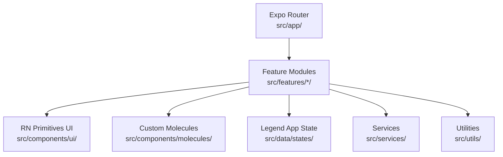
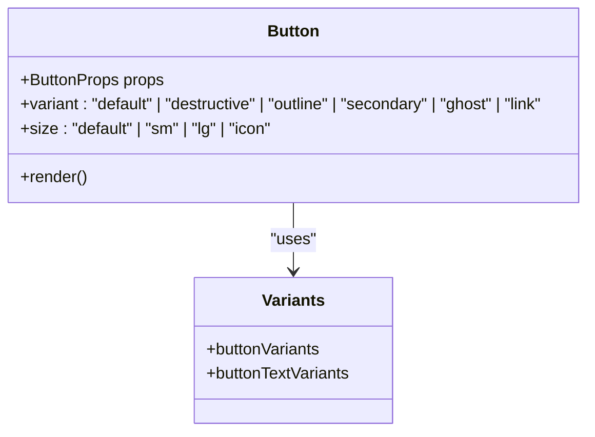
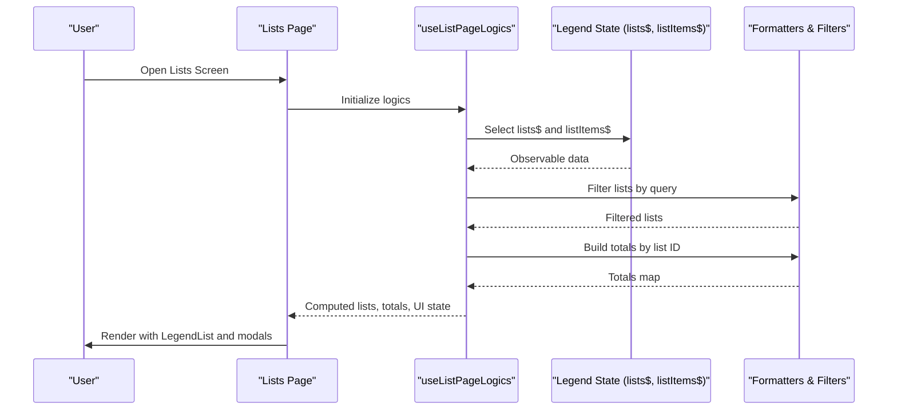
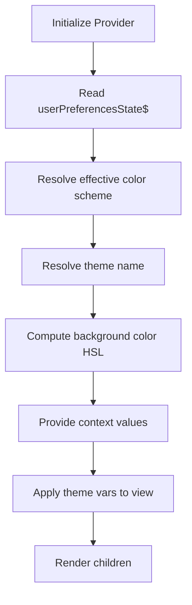
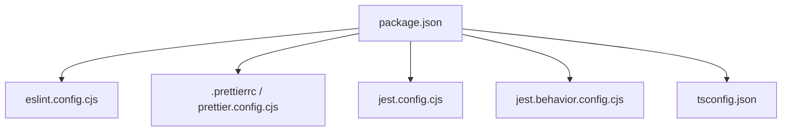

# Development Guidelines

<cite>
**Referenced Files in This Document**
- [RULES.md](file://__docs__/RULES.md)
- [package.json](file://package.json)
- [eslint.config.cjs](file://eslint.config.cjs)
- [.prettierrc](file://.prettierrc)
- [prettier.config.cjs](file://prettier.config.cjs)
- [jest.config.cjs](file://jest.config.cjs)
- [jest.behavior.config.cjs](file://jest.behavior.config.cjs)
- [tsconfig.json](file://tsconfig.json)
- [.editorconfig](file://.editorconfig)
- [.gitignore](file://.gitignore)
- [src/components/ui/button.tsx](file://src/components/ui/button.tsx)
- [src/components/molecules/circular-carousel/index.tsx](file://src/components/molecules/circular-carousel/index.tsx)
- [src/features/lists/page.tsx](file://src/features/lists/page.tsx)
- [src/features/lists/hooks/use-list-page-logics.ts](file://src/features/lists/hooks/use-list-page-logics.ts)
- [src/data/states/lists.ts](file://src/data/states/lists.ts)
- [src/context/themes/provider.tsx](file://src/context/themes/provider.tsx)
</cite>

## Table of Contents
1. [Introduction](#introduction)
2. [Project Structure](#project-structure)
3. [Core Components](#core-components)
4. [Architecture Overview](#architecture-overview)
5. [Detailed Component Analysis](#detailed-component-analysis)
6. [Dependency Analysis](#dependency-analysis)
7. [Performance Considerations](#performance-considerations)
8. [Troubleshooting Guide](#troubleshooting-guide)
9. [Conclusion](#conclusion)
10. [Appendices](#appendices)

## Introduction
This document defines the development guidelines for PowerLists, covering code style, component architecture, feature development workflow, testing, documentation, performance, and collaboration practices. It consolidates existing project standards and provides practical guidance for contributors to maintain consistency and quality across the codebase.

## Project Structure
PowerLists follows a modular, feature-driven structure with clear boundaries between UI primitives, shared components, data/state, services, and feature modules. The routing is file-based via Expo Router under src/app/, while features are organized under src/features/.

```mermaid
graph TB
subgraph "App Shell"
APP["Expo Router (src/app/)"]
end
subgraph "Features"
LISTS["Lists Feature<br/>src/features/lists/"]
AUTH["Auth Feature<br/>src/features/auth/"]
CREATE_ACCOUNT["Create Account Feature<br/>src/features/create-account/"]
LOGIN["Login Feature<br/>src/features/login/"]
PASSWORD_RECOVERY["Password Recovery Feature<br/>src/features/password-recovery/"]
REQUEST_PASSWORD_RECOVERY["Request Password Recovery Feature<br/>src/features/request-password-recovery/"]
ACCOUNT["Account Feature<br/>src/features/account/"]
DASHBOARD["Dashboard Feature<br/>src/features/dashboard/"]
VOICE_ASSISTANT["Voice Assistant Feature<br/>src/features/voice-assistant/"]
ONBOARDING["Onboarding Feature<br/>src/features/onboarding/"]
end
subgraph "Shared"
UI["UI Primitives<br/>src/components/ui/"]
MOLECULES["Molecules<br/>src/components/molecules/"]
SWIPEABLE["Swipeable<br/>src/components/swipeable/"]
TOPBAR["Top Bar<br/>src/components/top-bar/"]
ERROR_BOUNDARY["Error Boundary<br/>src/components/error-boundary/"]
THEMES["Themes Provider<br/>src/context/themes/"]
end
subgraph "Data & State"
STATES["Legend App States<br/>src/data/states/"]
ACTIONS["Actions<br/>src/data/actions/"]
TYPES["Types<br/>src/data/types/"]
DATABASE["Database & Supabase<br/>src/data/database.ts"]
end
subgraph "Services"
SERVICES["Services<br/>src/services/"]
end
subgraph "Utilities"
UTILS["Utils<br/>src/utils/"]
LIB["Lib<br/>src/lib/"]
end
APP --> LISTS
APP --> AUTH
APP --> CREATE_ACCOUNT
APP --> LOGIN
APP --> PASSWORD_RECOVERY
APP --> REQUEST_PASSWORD_RECOVERY
APP --> ACCOUNT
APP --> DASHBOARD
APP --> VOICE_ASSISTANT
APP --> ONBOARDING
LISTS --> UI
LISTS --> MOLECULES
LISTS --> SWIPEABLE
LISTS --> TOPBAR
LISTS --> THEMES
LISTS --> STATES
LISTS --> ACTIONS
LISTS --> SERVICES
LISTS --> UTILS
LISTS --> LIB
AUTH --> UI
AUTH --> SERVICES
AUTH --> UTILS
CREATE_ACCOUNT --> UI
CREATE_ACCOUNT --> SERVICES
CREATE_ACCOUNT --> UTILS
LOGIN --> UI
LOGIN --> SERVICES
LOGIN --> UTILS
PASSWORD_RECOVERY --> UI
PASSWORD_RECOVERY --> SERVICES
PASSWORD_RECOVERY --> UTILS
REQUEST_PASSWORD_RECOVERY --> UI
REQUEST_PASSWORD_RECOVERY --> SERVICES
REQUEST_PASSWORD_RECOVERY --> UTILS
ACCOUNT --> UI
ACCOUNT --> SERVICES
ACCOUNT --> UTILS
DASHBOARD --> UI
DASHBOARD --> SERVICES
DASHBOARD --> UTILS
VOICE_ASSISTANT --> UI
VOICE_ASSISTANT --> SERVICES
VOICE_ASSISTANT --> UTILS
ONBOARDING --> UI
ONBOARDING --> SERVICES
ONBOARDING --> UTILS
LISTS --> DATABASE
AUTH --> DATABASE
CREATE_ACCOUNT --> DATABASE
LOGIN --> DATABASE
PASSWORD_RECOVERY --> DATABASE
REQUEST_PASSWORD_RECOVERY --> DATABASE
ACCOUNT --> DATABASE
DASHBOARD --> DATABASE
VOICE_ASSISTANT --> DATABASE
ONBOARDING --> DATABASE
```

**Diagram sources**
- [src/features/lists/page.tsx:1-98](file://src/features/lists/page.tsx#L1-L98)
- [src/features/lists/hooks/use-list-page-logics.ts:1-82](file://src/features/lists/hooks/use-list-page-logics.ts#L1-L82)
- [src/data/states/lists.ts:1-27](file://src/data/states/lists.ts#L1-L27)
- [src/context/themes/provider.tsx:1-156](file://src/context/themes/provider.tsx#L1-L156)

**Section sources**
- [RULES.md:17-39](file://__docs__/RULES.md#L17-L39)
- [RULES.md:25-34](file://__docs__/RULES.md#L25-L34)

## Core Components
This section documents the foundational development standards that apply across the codebase.

- Code Style Standards
  - Formatting: Prettier with print width 100, single quotes, bracket on the same line, trailing comma ES5, and Tailwind plugin.
  - Linting: ESLint with Expo config and Prettier recommended rules; Node globals for Babel config.
  - Scripts: Unified lint and format commands; auto-fix and write modes included.
  - EditorConfig: UTF-8, LF line endings, 2-space indentation, insert final newline.

- Commit Message Conventions
  - Conventional commits are required for all contributions.

- Branching Strategy
  - Feature branches: feature/<feature-name>
  - Fix branches: fix/<issue-name>
  - Chore branches: chore/<task-name>

- Pull Request Guidelines
  - All changes must include a PR description referencing related issues and summarizing changes.
  - PRs must pass linting, formatting, and tests before merging.

- Testing Requirements
  - Jest configurations exist for property-based and behavior tests.
  - Property tests: src/features/*/utils/__tests__/.../*.property.test.ts
  - Behavior tests: src/features/*/components/__tests__/.../*.test.tsx
  - Module name mapping supports path aliases and mocks for native modules.

- Documentation Standards
  - Document public APIs and complex logic.
  - Keep README and documentation current.
  - Use JSDoc for exported functions and classes.
  - Maintain accurate type definitions.

- Performance Optimization Guidelines
  - Optimize list rendering using LegendList and similar techniques.
  - Implement proper image loading and caching.
  - Minimize re-renders through memoization and proper state management.
  - Profile performance regularly using Expo DevTools.

- Accessibility Rules
  - Ensure all interactive elements have proper accessibility labels.
  - Support screen readers and other assistive technologies.
  - Follow WCAG 2.1 AA guidelines.
  - Test with accessibility tools and real users.

- Security Rules
  - Never hardcode secrets or credentials.
  - Use environment variables for configuration.
  - Validate all user inputs.
  - Sanitize outputs to prevent XSS attacks.
  - Follow secure coding practices for mobile applications.

**Section sources**
- [.prettierrc:1-7](file://.prettierrc#L1-L7)
- [prettier.config.cjs:1-11](file://prettier.config.cjs#L1-L11)
- [eslint.config.cjs:1-17](file://eslint.config.cjs#L1-L17)
- [package.json:4-12](file://package.json#L4-L12)
- [.editorconfig:1-9](file://.editorconfig#L1-L9)
- [RULES.md:101-154](file://__docs__/RULES.md#L101-L154)
- [jest.config.cjs:1-23](file://jest.config.cjs#L1-L23)
- [jest.behavior.config.cjs:1-27](file://jest.behavior.config.cjs#L1-L27)

## Architecture Overview
PowerLists employs a layered architecture:
- Routing: File-based routing via Expo Router under src/app/.
- Features: Feature modules encapsulate pages, hooks, components, modals, and utilities.
- State: Global state managed by Legend App with observable stores and Supabase synchronization.
- UI: Shared primitives from @rn-primitives and custom components under src/components/ui/ and src/components/molecules/.
- Services: Centralized services for toasts and synchronization.
- Utilities: Shared utilities for formatting, sorting, and platform helpers.

**Diagram sources**
- [src/features/lists/page.tsx:1-98](file://src/features/lists/page.tsx#L1-L98)
- [src/data/states/lists.ts:1-27](file://src/data/states/lists.ts#L1-L27)
- [src/context/themes/provider.tsx:1-156](file://src/context/themes/provider.tsx#L1-L156)

## Detailed Component Analysis

### UI Button Component
The Button primitive demonstrates variant composition with CVA, className merging, and responsive platform behavior. It integrates with text variants and supports multiple sizes and variants.

**Diagram sources**
- [src/components/ui/button.tsx:1-109](file://src/components/ui/button.tsx#L1-L109)

**Section sources**
- [src/components/ui/button.tsx:1-109](file://src/components/ui/button.tsx#L1-L109)

### Circular Carousel Component
The Circular Carousel showcases advanced animated rendering with Reanimated, FlatList paging, and dynamic blur effects. It calculates interpolated transforms and blur intensities based on scroll position.

**Diagram sources**
- [src/components/molecules/circular-carousel/index.tsx:1-192](file://src/components/molecules/circular-carousel/index.tsx#L1-L192)

**Section sources**
- [src/components/molecules/circular-carousel/index.tsx:1-192](file://src/components/molecules/circular-carousel/index.tsx#L1-L192)

### Lists Feature Page and Hooks
The Lists feature demonstrates:
- Page component using lazy loading, suspense, and LegendList for efficient rendering.
- Hooks orchestrating state selection, filtering, and modal orchestration.
- State synchronization with Supabase via Legend App.

**Diagram sources**
- [src/features/lists/page.tsx:1-98](file://src/features/lists/page.tsx#L1-L98)
- [src/features/lists/hooks/use-list-page-logics.ts:1-82](file://src/features/lists/hooks/use-list-page-logics.ts#L1-L82)
- [src/data/states/lists.ts:1-27](file://src/data/states/lists.ts#L1-L27)

**Section sources**
- [src/features/lists/page.tsx:1-98](file://src/features/lists/page.tsx#L1-L98)
- [src/features/lists/hooks/use-list-page-logics.ts:1-82](file://src/features/lists/hooks/use-list-page-logics.ts#L1-L82)
- [src/data/states/lists.ts:1-27](file://src/data/states/lists.ts#L1-L27)

### Themes Provider
The Themes Provider manages theme and color scheme selection, merges theme variables into the view style, and persists user preferences.

**Diagram sources**
- [src/context/themes/provider.tsx:1-156](file://src/context/themes/provider.tsx#L1-L156)

**Section sources**
- [src/context/themes/provider.tsx:1-156](file://src/context/themes/provider.tsx#L1-L156)

## Dependency Analysis
The project relies on a curated set of libraries and tools:
- Runtime: Expo, React, React Native, Legend App, Supabase JS, Sonner Native, Tabler Icons, Reanimated, Skia, Victory Native.
- Tooling: ESLint (Expo config + Prettier), Prettier (with Tailwind plugin), Jest, TypeScript, Tailwind CSS, NativeWind.

**Diagram sources**
- [package.json:1-118](file://package.json#L1-L118)
- [eslint.config.cjs:1-17](file://eslint.config.cjs#L1-L17)
- [.prettierrc:1-7](file://.prettierrc#L1-L7)
- [prettier.config.cjs:1-11](file://prettier.config.cjs#L1-L11)
- [tsconfig.json:1-13](file://tsconfig.json#L1-L13)
- [jest.config.cjs:1-23](file://jest.config.cjs#L1-L23)
- [jest.behavior.config.cjs:1-27](file://jest.behavior.config.cjs#L1-L27)

**Section sources**
- [package.json:1-118](file://package.json#L1-L118)

## Performance Considerations
- Prefer LegendList and similar virtualized lists for large datasets.
- Use memoization (useMemo, useCallback) to minimize re-renders.
- Lazy-load heavy components with React.lazy and Suspense.
- Optimize animations with Reanimated and avoid layout thrashing.
- Profile with Expo DevTools and address bottlenecks iteratively.

[No sources needed since this section provides general guidance]

## Troubleshooting Guide
- Formatting/Linting Failures
  - Run yarn lint and yarn format to auto-fix and validate.
  - Ensure Prettier and ESLint configs align with project settings.

- Test Execution
  - Use targeted Jest runs with the provided configs for property and behavior tests.
  - Verify moduleNameMapper and mocks for native modules.

- Type Errors
  - Confirm tsconfig extends Expo base and includes path aliases.
  - Keep types aligned with Supabase schemas and Zod forms.

- Environment Issues
  - Check .env.example and ensure environment variables are configured locally.
  - Verify .gitignore excludes sensitive files and caches.

**Section sources**
- [package.json:4-12](file://package.json#L4-L12)
- [jest.config.cjs:1-23](file://jest.config.cjs#L1-L23)
- [jest.behavior.config.cjs:1-27](file://jest.behavior.config.cjs#L1-L27)
- [tsconfig.json:1-13](file://tsconfig.json#L1-L13)
- [.gitignore:1-174](file://.gitignore#L1-L174)

## Conclusion
These guidelines consolidate PowerLists’ development standards and workflows. By adhering to the established conventions—component architecture, state management, UI primitives, testing, documentation, performance, and collaboration—you ensure consistency, maintainability, and high-quality outcomes across the project.

[No sources needed since this section summarizes without analyzing specific files]

## Appendices

### Code Style and Formatting Reference
- Prettier configuration: printWidth 100, singleQuote true, bracketSameLine true, trailingComma es5, Tailwind plugin enabled.
- ESLint configuration: Expo flat config plus Prettier recommended rules; Node globals for Babel config.
- EditorConfig: UTF-8, LF, indent_size 2, indent_style space, insert_final_newline.

**Section sources**
- [.prettierrc:1-7](file://.prettierrc#L1-L7)
- [prettier.config.cjs:1-11](file://prettier.config.cjs#L1-L11)
- [eslint.config.cjs:1-17](file://eslint.config.cjs#L1-L17)
- [.editorconfig:1-9](file://.editorconfig#L1-L9)

### Component Naming Conventions
- Files: kebab-case (e.g., list-create-modal.tsx, use-list-page-logics.ts)
- Components: PascalCase (e.g., CardList, ListCreateModal)
- Hooks: use prefix (e.g., useListPageLogics, useAuth)
- Observables: $ suffix (e.g., lists$, profile$)
- Prop types: Props suffix (e.g., CardListProps)

**Section sources**
- [RULES.md:79-88](file://__docs__/RULES.md#L79-L88)

### File Organization Patterns
- Feature modules: page.tsx, index.ts, types.ts, hooks/, components/, modals/, utils/
- Shared UI: src/components/ui/ (primitives) and src/components/molecules/
- Data/state: src/data/states/, src/data/actions/, src/data/types/
- Services: src/services/
- Utilities: src/utils/

**Section sources**
- [RULES.md:25-34](file://__docs__/RULES.md#L25-L34)
- [RULES.md:36-39](file://__docs__/RULES.md#L36-L39)

### Architectural Decision-Making Guidelines
- Routing: File-based with Expo Router in src/app/.
- State: Global observable state via Legend App with Supabase sync.
- UI: Prefer @rn-primitives; customize with CVA and Tailwind.
- Forms: React Hook Form + Zod; derive types from schemas.
- Styling: NativeWind/Tailwind with className props; merge with cn().
- Data: Convert between snake_case and camelCase helpers; favor observable updates.

**Section sources**
- [RULES.md:17-39](file://__docs__/RULES.md#L17-L39)
- [RULES.md:68-78](file://__docs__/RULES.md#L68-L78)
- [RULES.md:89-95](file://__docs__/RULES.md#L89-L95)

### Git Workflow and Pull Requests
- Branch naming: feature/<feature-name>, fix/<issue-name>, chore/<task-name>
- Commit messages: conventional commits
- PR process: describe changes, reference issues, ensure CI passes

**Section sources**
- [RULES.md:113-119](file://__docs__/RULES.md#L113-L119)