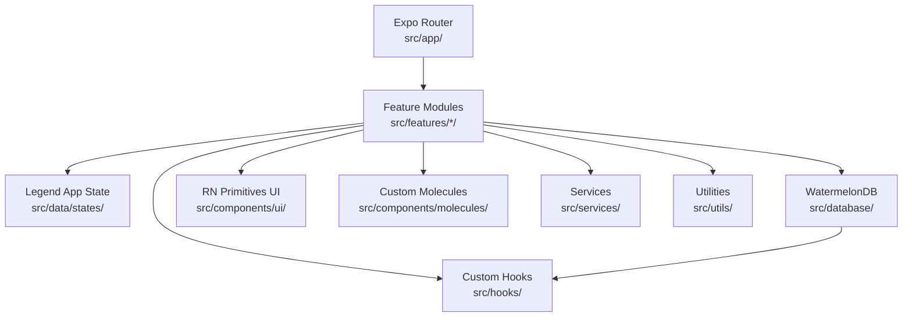
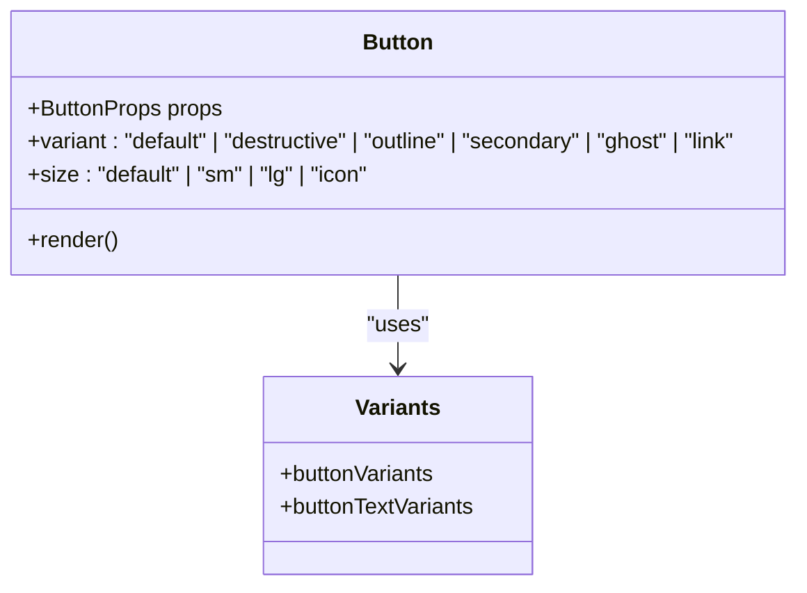
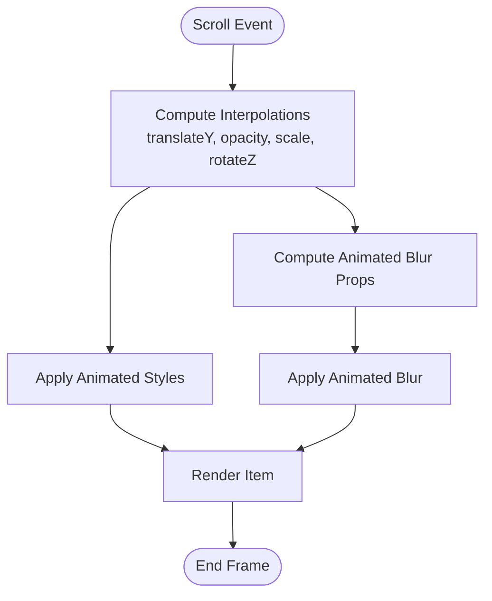
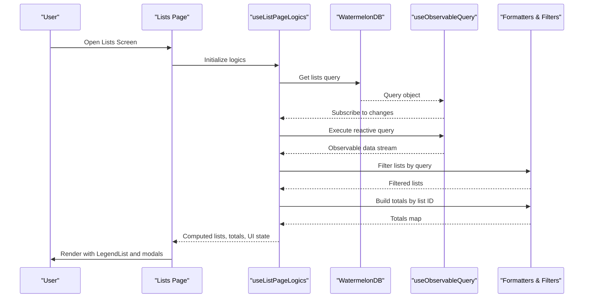
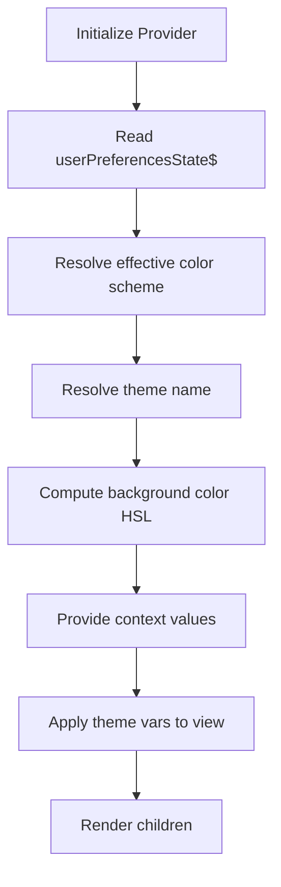
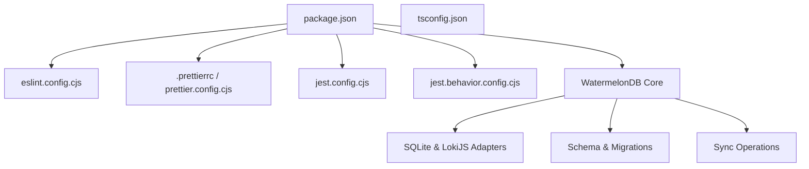

# Development Guidelines

<cite>
**Referenced Files in This Document**
- [RULES.md](file://__docs__/RULES.md)
- [package.json](file://package.json)
- [eslint.config.cjs](file://eslint.config.cjs)
- [.prettierrc](file://.prettierrc)
- [prettier.config.cjs](file://prettier.config.cjs)
- [jest.config.cjs](file://jest.config.cjs)
- [jest.behavior.config.cjs](file://jest.behavior.config.cjs)
- [tsconfig.json](file://tsconfig.json)
- [.editorconfig](file://.editorconfig)
- [.gitignore](file://.gitignore)
- [src/components/ui/button.tsx](file://src/components/ui/button.tsx)
- [src/components/molecules/circular-carousel/index.tsx](file://src/components/molecules/circular-carousel/index.tsx)
- [src/features/lists/page.tsx](file://src/features/lists/page.tsx)
- [src/features/lists/hooks/use-list-page-logics.ts](file://src/features/lists/hooks/use-list-page-logics.ts)
- [src/data/states/lists.ts](file://src/data/states/lists.ts)
- [src/context/themes/provider.tsx](file://src/context/themes/provider.tsx)
- [src/database/index.ts](file://src/database/index.ts)
- [src/database/schema.ts](file://src/database/schema.ts)
- [src/database/models/List.ts](file://src/database/models/List.ts)
- [src/database/models/ListItem.ts](file://src/database/models/ListItem.ts)
- [src/database/models/Profile.ts](file://src/database/models/Profile.ts)
- [src/database/operations/lists.ts](file://src/database/operations/lists.ts)
- [src/database/operations/listItems.ts](file://src/database/operations/listItems.ts)
- [src/database/operations/profile.ts](file://src/database/operations/profile.ts)
- [src/database/migrations.ts](file://src/database/migrations.ts)
- [src/database/sync.ts](file://src/database/sync.ts)
- [src/hooks/use-observable-query.ts](file://src/hooks/use-observable-query.ts)
- [src/features/account/use-profile-data.tsx](file://src/features/account/use-profile-data.tsx)
</cite>

## Update Summary
**Changes Made**
- Added comprehensive WatermelonDB integration section covering database schema design, model implementations, and reactive query patterns
- Updated database architecture overview to include WatermelonDB adapters and migration strategies
- Added reactive query usage patterns with useObservableQuery() hook documentation
- Enhanced data layer architecture with WatermelonDB operations and synchronization
- Updated dependency analysis to include WatermelonDB and related packages

## Table of Contents
1. [Introduction](#introduction)
2. [Project Structure](#project-structure)
3. [Core Components](#core-components)
4. [Architecture Overview](#architecture-overview)
5. [WatermelonDB Integration](#watermelondb-integration)
6. [Database Schema Design](#database-schema-design)
7. [Model Implementations](#model-implementations)
8. [Reactive Query Patterns](#reactive-query-patterns)
9. [Database Operations Layer](#database-operations-layer)
10. [Data Synchronization](#data-synchronization)
11. [Detailed Component Analysis](#detailed-component-analysis)
12. [Dependency Analysis](#dependency-analysis)
13. [Performance Considerations](#performance-considerations)
14. [Troubleshooting Guide](#troubleshooting-guide)
15. [Conclusion](#conclusion)
16. [Appendices](#appendices)

## Introduction
This document defines the development guidelines for PowerLists, covering code style, component architecture, feature development workflow, testing, documentation, performance, and collaboration practices. It consolidates existing project standards and provides practical guidance for contributors to maintain consistency and quality across the codebase. The guidelines now include comprehensive coverage of WatermelonDB integration patterns, database schema design, model implementations, and reactive query usage with useObservableQuery() hooks.

## Project Structure
PowerLists follows a modular, feature-driven structure with clear boundaries between UI primitives, shared components, data/state, services, and feature modules. The routing is file-based via Expo Router under src/app/, while features are organized under src/features/. The data layer now includes comprehensive WatermelonDB integration for local database operations.

```mermaid
graph TB
subgraph "App Shell"
APP["Expo Router (src/app/)"]
end
subgraph "Features"
LISTS["Lists Feature<br/>src/features/lists/"]
AUTH["Auth Feature<br/>src/features/auth/"]
CREATE_ACCOUNT["Create Account Feature<br/>src/features/create-account/"]
LOGIN["Login Feature<br/>src/features/login/"]
PASSWORD_RECOVERY["Password Recovery Feature<br/>src/features/password-recovery/"]
REQUEST_PASSWORD_RECOVERY["Request Password Recovery Feature<br/>src/features/request-password-recovery/"]
ACCOUNT["Account Feature<br/>src/features/account/"]
DASHBOARD["Dashboard Feature<br/>src/features/dashboard/"]
VOICE_ASSISTANT["Voice Assistant Feature<br/>src/features/voice-assistant/"]
ONBOARDING["Onboarding Feature<br/>src/features/onboarding/"]
end
subgraph "Shared"
UI["UI Primitives<br/>src/components/ui/"]
MOLECULES["Molecules<br/>src/components/molecules/"]
SWIPEABLE["Swipeable<br/>src/components/swipeable/"]
TOPBAR["Top Bar<br/>src/components/top-bar/"]
ERROR_BOUNDARY["Error Boundary<br/>src/components/error-boundary/"]
THEMES["Themes Provider<br/>src/context/themes/"]
HOOKS["Custom Hooks<br/>src/hooks/"]
end
subgraph "Data & State"
DATABASE["WatermelonDB<br/>src/database/"]
STATES["Legend App States<br/>src/data/states/"]
ACTIONS["Actions<br/>src/data/actions/"]
TYPES["Types<br/>src/data/types/"]
SERVICES["Services<br/>src/services/"]
end
subgraph "Utilities"
UTILS["Utils<br/>src/utils/"]
LIB["Lib<br/>src/lib/"]
end
APP --> LISTS
APP --> AUTH
APP --> CREATE_ACCOUNT
APP --> LOGIN
APP --> PASSWORD_RECOVERY
APP --> REQUEST_PASSWORD_RECOVERY
APP --> ACCOUNT
APP --> DASHBOARD
APP --> VOICE_ASSISTANT
APP --> ONBOARDING
LISTS --> UI
LISTS --> MOLECULES
LISTS --> SWIPEABLE
LISTS --> TOPBAR
LISTS --> THEMES
LISTS --> HOOKS
LISTS --> DATABASE
LISTS --> STATES
LISTS --> ACTIONS
LISTS --> SERVICES
LISTS --> UTILS
LISTS --> LIB
AUTH --> UI
AUTH --> SERVICES
AUTH --> UTILS
AUTH --> DATABASE
CREATE_ACCOUNT --> UI
CREATE_ACCOUNT --> SERVICES
CREATE_ACCOUNT --> UTILS
CREATE_ACCOUNT --> DATABASE
LOGIN --> UI
LOGIN --> SERVICES
LOGIN --> UTILS
LOGIN --> DATABASE
PASSWORD_RECOVERY --> UI
PASSWORD_RECOVERY --> SERVICES
PASSWORD_RECOVERY --> UTILS
REQUEST_PASSWORD_RECOVERY --> UI
REQUEST_PASSWORD_RECOVERY --> SERVICES
REQUEST_PASSWORD_RECOVERY --> UTILS
REQUEST_PASSWORD_RECOVERY --> DATABASE
ACCOUNT --> UI
ACCOUNT --> SERVICES
ACCOUNT --> UTILS
ACCOUNT --> DATABASE
ACCOUNT --> HOOKS
DASHBOARD --> UI
DASHBOARD --> SERVICES
DASHBOARD --> UTILS
DASHBOARD --> DATABASE
VOICE_ASSISTANT --> UI
VOICE_ASSISTANT --> SERVICES
VOICE_ASSISTANT --> UTILS
VOICE_ASSISTANT --> DATABASE
ONBOARDING --> UI
ONBOARDING --> SERVICES
ONBOARDING --> UTILS
ONBOARDING --> DATABASE
DATABASE --> HOOKS
```

**Diagram sources**
- [src/features/lists/page.tsx:1-98](file://src/features/lists/page.tsx#L1-L98)
- [src/features/lists/hooks/use-list-page-logics.ts:1-90](file://src/features/lists/hooks/use-list-page-logics.ts#L1-L90)
- [src/data/states/lists.ts:1-27](file://src/data/states/lists.ts#L1-L27)
- [src/context/themes/provider.tsx:1-156](file://src/context/themes/provider.tsx#L1-L156)
- [src/database/index.ts:1-33](file://src/database/index.ts#L1-L33)

**Section sources**
- [RULES.md:17-39](file://__docs__/RULES.md#L17-L39)
- [RULES.md:25-34](file://__docs__/RULES.md#L25-L34)

## Core Components
This section documents the foundational development standards that apply across the codebase, including the new WatermelonDB integration patterns.

- Code Style Standards
  - Formatting: Prettier with print width 100, single quotes, bracket on the same line, trailing comma ES5, and Tailwind plugin.
  - Linting: ESLint with Expo config and Prettier recommended rules; Node globals for Babel config.
  - Scripts: Unified lint and format commands; auto-fix and write modes included.
  - EditorConfig: UTF-8, LF line endings, 2-space indentation, insert final newline.

- Commit Message Conventions
  - Conventional commits are required for all contributions.

- Branching Strategy
  - Feature branches: feature/<feature-name>
  - Fix branches: fix/<issue-name>
  - Chore branches: chore/<task-name>

- Pull Request Guidelines
  - All changes must include a PR description referencing related issues and summarizing changes.
  - PRs must pass linting, formatting, and tests before merging.

- Testing Requirements
  - Jest configurations exist for property-based and behavior tests.
  - Property tests: src/features/*/utils/__tests__/.../*.property.test.ts
  - Behavior tests: src/features/*/components/__tests__/.../*.test.tsx
  - Module name mapping supports path aliases and mocks for native modules.

- Documentation Standards
  - Document public APIs and complex logic.
  - Keep README and documentation current.
  - Use JSDoc for exported functions and classes.
  - Maintain accurate type definitions.

- Performance Optimization Guidelines
  - Optimize list rendering using LegendList and similar techniques.
  - Implement proper image loading and caching.
  - Minimize re-renders through memoization and proper state management.
  - Profile performance regularly using Expo DevTools.
  - Use WatermelonDB's reactive queries for efficient data binding.

- Accessibility Rules
  - Ensure all interactive elements have proper accessibility labels.
  - Support screen readers and other assistive technologies.
  - Follow WCAG 2.1 AA guidelines.
  - Test with accessibility tools and real users.

- Security Rules
  - Never hardcode secrets or credentials.
  - Use environment variables for configuration.
  - Validate all user inputs.
  - Sanitize outputs to prevent XSS attacks.
  - Follow secure coding practices for mobile applications.

**Section sources**
- [.prettierrc:1-7](file://.prettierrc#L1-L7)
- [prettier.config.cjs:1-11](file://prettier.config.cjs#L1-L11)
- [eslint.config.cjs:1-17](file://eslint.config.cjs#L1-L17)
- [package.json:4-12](file://package.json#L4-L12)
- [.editorconfig:1-9](file://.editorconfig#L1-L9)
- [RULES.md:101-154](file://__docs__/RULES.md#L101-L154)
- [jest.config.cjs:1-23](file://jest.config.cjs#L1-L23)
- [jest.behavior.config.cjs:1-27](file://jest.behavior.config.cjs#L1-L27)

## Architecture Overview
PowerLists employs a layered architecture with comprehensive WatermelonDB integration:
- Routing: File-based routing via Expo Router under src/app/.
- Features: Feature modules encapsulate pages, hooks, components, modals, and utilities.
- State: Global state managed by Legend App with observable stores and Supabase synchronization.
- Database: WatermelonDB for local data persistence with reactive query patterns.
- UI: Shared primitives from @rn-primitives and custom components under src/components/ui/ and src/components/molecules/.
- Services: Centralized services for toasts, synchronization, and authentication.
- Utilities: Shared utilities for formatting, sorting, and platform helpers.

**Diagram sources**
- [src/features/lists/page.tsx:1-98](file://src/features/lists/page.tsx#L1-L98)
- [src/data/states/lists.ts:1-27](file://src/data/states/lists.ts#L1-L27)
- [src/context/themes/provider.tsx:1-156](file://src/context/themes/provider.tsx#L1-L156)
- [src/database/index.ts:1-33](file://src/database/index.ts#L1-L33)

## WatermelonDB Integration
PowerLists implements comprehensive WatermelonDB integration for local data persistence with platform-specific adapters and reactive query patterns.

### Database Adapter Configuration
The application uses platform-specific adapters for optimal performance:
- Web: LokiJSAdapter with IndexedDB support for browser environments
- Mobile: SQLiteAdapter with JSI enabled for native performance
- Migration support: Automatic schema migrations with safe SQL execution

### Reactive Query System
Custom hook for reactive database queries:
- useObservableQuery() provides real-time data binding
- Automatic subscription management with cleanup
- Type-safe query results with generic constraints

**Section sources**
- [src/database/index.ts:1-33](file://src/database/index.ts#L1-L33)
- [src/hooks/use-observable-query.ts:1-14](file://src/hooks/use-observable-query.ts#L1-L14)

## Database Schema Design
The WatermelonDB schema defines three core entities with proper indexing and relationships for optimal query performance.

### Schema Versioning
- Current version: 2
- Migration strategy: Safe SQL execution for column removal
- Backward compatibility: Maintained through optional columns

### Entity Relationships
- Profiles → Lists (one-to-many)
- Lists → ListItems (one-to-many)
- Cascading soft deletes through deleted_at timestamps

### Indexing Strategy
- profile_id indexed on lists and list_items for fast profile queries
- list_id indexed on list_items for efficient list filtering
- User ID indexed on profiles for authentication-based queries

**Section sources**
- [src/database/schema.ts:1-46](file://src/database/schema.ts#L1-L46)
- [src/database/migrations.ts:1-17](file://src/database/migrations.ts#L1-L17)

## Model Implementations
Each model implements WatermelonDB decorators for type safety and relationship management.

### Profile Model
Represents user profiles with authentication metadata:
- Text fields: name, avatar_url, bio
- String fields: user_id
- Timestamps: created_at, updated_at, deleted_at
- Relationship: has_many lists

### List Model  
Represents shopping lists with user customization:
- Text fields: title, accent_color, icon
- String fields: profile_id
- Timestamps: created_at, updated_at, deleted_at
- Relationship: belongs_to profile, has_many list_items

### ListItem Model
Represents individual items within lists:
- Optional text: title
- Numeric fields: price, amount
- Boolean: is_checked
- String fields: profile_id, list_id
- Timestamps: created_at, updated_at, deleted_at
- Relationship: belongs_to list

**Section sources**
- [src/database/models/Profile.ts:1-21](file://src/database/models/Profile.ts#L1-L21)
- [src/database/models/List.ts:1-23](file://src/database/models/List.ts#L1-L23)
- [src/database/models/ListItem.ts:1-20](file://src/database/models/ListItem.ts#L1-L20)

## Reactive Query Patterns
The application uses reactive queries extensively for real-time data binding between database changes and UI updates.

### Query Construction
- Profile queries: Filter by user_id with soft delete protection
- List queries: Filter by profile_id with active records only
- List item queries: Filter by profile_id for user isolation

### Hook Implementation
The useObservableQuery() hook provides:
- Automatic subscription to query results
- State management for reactive updates
- Cleanup on component unmount
- Generic type safety for model instances

### Usage Examples
- Lists feature: Real-time list filtering and total calculations
- Account feature: Profile data binding with theme preferences
- Dashboard: Live metrics calculation from reactive data streams

**Section sources**
- [src/features/lists/hooks/use-list-page-logics.ts:1-90](file://src/features/lists/hooks/use-list-page-logics.ts#L1-L90)
- [src/features/account/use-profile-data.tsx:1-31](file://src/features/account/use-profile-data.tsx#L1-L31)
- [src/hooks/use-observable-query.ts:1-14](file://src/hooks/use-observable-query.ts#L1-L14)

## Database Operations Layer
The operations layer provides type-safe CRUD operations with proper transaction handling and error management.

### Lists Operations
- Query construction with Q.where() filters
- Create/update/delete with proper timestamps
- Soft delete pattern through deleted_at field
- Transaction wrapping for atomic operations

### List Items Operations  
- Toggle check states with immediate UI updates
- Partial updates for flexible field modifications
- Price and amount calculations through totals computation
- User isolation through profile_id filtering

### Authentication Operations
- Password reauthentication before sensitive operations
- Secure credential validation
- Error handling for invalid credentials
- Integration with Supabase authentication service

**Section sources**
- [src/database/operations/lists.ts:1-65](file://src/database/operations/lists.ts#L1-L65)
- [src/database/operations/listItems.ts:1-79](file://src/database/operations/listItems.ts#L1-L79)
- [src/database/operations/profile.ts:1-53](file://src/database/operations/profile.ts#L1-L53)

## Data Synchronization
The application implements bidirectional synchronization between local WatermelonDB and remote Supabase backend.

### Sync Architecture
- Real-time channel monitoring for database changes
- Pull/push synchronization with conflict resolution
- RPC-based communication for change detection
- Atomic transaction handling during sync

### Real-time Subscriptions
- PostgreSQL changes channel for live updates
- Automatic sync triggering on data changes
- Error handling and retry mechanisms
- Channel lifecycle management

### Conflict Resolution
- SendCreatedAsUpdated flag for proper handling
- Last pulled timestamp tracking
- Change processing with error boundaries
- Status logging for debugging

**Section sources**
- [src/database/sync.ts:1-57](file://src/database/sync.ts#L1-L57)

## Detailed Component Analysis

### UI Button Component
The Button primitive demonstrates variant composition with CVA, className merging, and responsive platform behavior. It integrates with text variants and supports multiple sizes and variants.

**Diagram sources**
- [src/components/ui/button.tsx:1-109](file://src/components/ui/button.tsx#L1-L109)

**Section sources**
- [src/components/ui/button.tsx:1-109](file://src/components/ui/button.tsx#L1-L109)

### Circular Carousel Component
The Circular Carousel showcases advanced animated rendering with Reanimated, FlatList paging, and dynamic blur effects. It calculates interpolated transforms and blur intensities based on scroll position.

**Diagram sources**
- [src/components/molecules/circular-carousel/index.tsx:1-192](file://src/components/molecules/circular-carousel/index.tsx#L1-L192)

**Section sources**
- [src/components/molecules/circular-carousel/index.tsx:1-192](file://src/components/molecules/circular-carousel/index.tsx#L1-L192)

### Lists Feature Page and Hooks
The Lists feature demonstrates:
- Page component using lazy loading, suspense, and LegendList for efficient rendering.
- Hooks orchestrating state selection, filtering, and modal orchestration.
- State synchronization with Supabase via Legend App.
- Reactive database queries with useObservableQuery() for real-time updates.

**Diagram sources**
- [src/features/lists/page.tsx:1-98](file://src/features/lists/page.tsx#L1-L98)
- [src/features/lists/hooks/use-list-page-logics.ts:1-90](file://src/features/lists/hooks/use-list-page-logics.ts#L1-L90)
- [src/data/states/lists.ts:1-27](file://src/data/states/lists.ts#L1-L27)
- [src/hooks/use-observable-query.ts:1-14](file://src/hooks/use-observable-query.ts#L1-L14)

**Section sources**
- [src/features/lists/page.tsx:1-98](file://src/features/lists/page.tsx#L1-L98)
- [src/features/lists/hooks/use-list-page-logics.ts:1-90](file://src/features/lists/hooks/use-list-page-logics.ts#L1-L90)
- [src/data/states/lists.ts:1-27](file://src/data/states/lists.ts#L1-L27)

### Themes Provider
The Themes Provider manages theme and color scheme selection, merges theme variables into the view style, and persists user preferences.

**Diagram sources**
- [src/context/themes/provider.tsx:1-156](file://src/context/themes/provider.tsx#L1-L156)

**Section sources**
- [src/context/themes/provider.tsx:1-156](file://src/context/themes/provider.tsx#L1-L156)

## Dependency Analysis
The project relies on a curated set of libraries and tools, including comprehensive WatermelonDB integration:
- Runtime: Expo, React, React Native, Legend App, Supabase JS, Sonner Native, Tabler Icons, Reanimated, Skia, Victory Native, WatermelonDB.
- Database: WatermelonDB with SQLite and LokiJS adapters, schema migrations, sync operations.
- Tooling: ESLint (Expo config + Prettier), Prettier (with Tailwind plugin), Jest, TypeScript, Tailwind CSS, NativeWind.

**Diagram sources**
- [package.json:1-118](file://package.json#L1-L118)
- [eslint.config.cjs:1-17](file://eslint.config.cjs#L1-L17)
- [.prettierrc:1-7](file://.prettierrc#L1-L7)
- [prettier.config.cjs:1-11](file://prettier.config.cjs#L1-L11)
- [tsconfig.json:1-13](file://tsconfig.json#L1-L13)
- [jest.config.cjs:1-23](file://jest.config.cjs#L1-L23)
- [jest.behavior.config.cjs:1-27](file://jest.behavior.config.cjs#L1-L27)
- [src/database/index.ts:1-33](file://src/database/index.ts#L1-L33)

**Section sources**
- [package.json:1-118](file://package.json#L1-L118)

## Performance Considerations
- Prefer LegendList and similar virtualized lists for large datasets.
- Use memoization (useMemo, useCallback) to minimize re-renders.
- Lazy-load heavy components with React.lazy and Suspense.
- Optimize animations with Reanimated and avoid layout thrashing.
- Use WatermelonDB's reactive queries for efficient data binding.
- Implement proper indexing strategies for frequently queried columns.
- Batch database operations within transactions for better performance.
- Profile with Expo DevTools and address bottlenecks iteratively.

## Troubleshooting Guide
- Formatting/Linting Failures
  - Run yarn lint and yarn format to auto-fix and validate.
  - Ensure Prettier and ESLint configs align with project settings.

- Test Execution
  - Use targeted Jest runs with the provided configs for property and behavior tests.
  - Verify moduleNameMapper and mocks for native modules.

- Type Errors
  - Confirm tsconfig extends Expo base and includes path aliases.
  - Keep types aligned with Supabase schemas and Zod forms.

- Environment Issues
  - Check .env.example and ensure environment variables are configured locally.
  - Verify .gitignore excludes sensitive files and caches.

- Database Issues
  - Verify WatermelonDB adapter initialization for target platform.
  - Check migration execution and schema version compatibility.
  - Monitor sync operation logs for real-time subscription failures.

**Section sources**
- [package.json:4-12](file://package.json#L4-L12)
- [jest.config.cjs:1-23](file://jest.config.cjs#L1-L23)
- [jest.behavior.config.cjs:1-27](file://jest.behavior.config.cjs#L1-L27)
- [tsconfig.json:1-13](file://tsconfig.json#L1-L13)
- [.gitignore:1-174](file://.gitignore#L1-L174)
- [src/database/index.ts:1-33](file://src/database/index.ts#L1-L33)

## Conclusion
These guidelines consolidate PowerLists' development standards and workflows, including comprehensive WatermelonDB integration patterns. By adhering to the established conventions—component architecture, state management, UI primitives, database design, reactive query patterns, testing, documentation, performance, and collaboration—you ensure consistency, maintainability, and high-quality outcomes across the project. The WatermelonDB integration provides robust local data persistence with reactive query patterns, enabling real-time UI updates and offline capabilities.

## Appendices

### Code Style and Formatting Reference
- Prettier configuration: printWidth 100, singleQuote true, bracketSameLine true, trailingComma es5, Tailwind plugin enabled.
- ESLint configuration: Expo flat config plus Prettier recommended rules; Node globals for Babel config.
- EditorConfig: UTF-8, LF, indent_size 2, indent_style space, insert_final_newline.

**Section sources**
- [.prettierrc:1-7](file://.prettierrc#L1-L7)
- [prettier.config.cjs:1-11](file://prettier.config.cjs#L1-L11)
- [eslint.config.cjs:1-17](file://eslint.config.cjs#L1-L17)
- [.editorconfig:1-9](file://.editorconfig#L1-L9)

### Component Naming Conventions
- Files: kebab-case (e.g., list-create-modal.tsx, use-list-page-logics.ts)
- Components: PascalCase (e.g., CardList, ListCreateModal)
- Hooks: use prefix (e.g., useListPageLogics, useAuth, useObservableQuery)
- Observables: $ suffix (e.g., lists$, profile$)
- Prop types: Props suffix (e.g., CardListProps)

**Section sources**
- [RULES.md:79-88](file://__docs__/RULES.md#L79-L88)

### File Organization Patterns
- Feature modules: page.tsx, index.ts, types.ts, hooks/, components/, modals/, utils/
- Shared UI: src/components/ui/ (primitives) and src/components/molecules/
- Database: src/database/ (schema.ts, models/, operations/, migrations.ts, sync.ts)
- Custom hooks: src/hooks/ (useObservableQuery, use-auth, use-user)
- Data/state: src/data/states/, src/data/actions/, src/data/types/
- Services: src/services/
- Utilities: src/utils/

**Section sources**
- [RULES.md:25-34](file://__docs__/RULES.md#L25-L34)
- [RULES.md:36-39](file://__docs__/RULES.md#L36-L39)

### Architectural Decision-Making Guidelines
- Routing: File-based with Expo Router in src/app/.
- State: Global observable state via Legend App with Supabase sync.
- Database: WatermelonDB for local persistence with reactive queries.
- UI: Prefer @rn-primitives; customize with CVA and Tailwind.
- Forms: React Hook Form + Zod; derive types from schemas.
- Styling: NativeWind/Tailwind with className props; merge with cn().
- Data: Convert between snake_case and camelCase helpers; favor observable updates.
- Synchronization: Bidirectional sync with Supabase for real-time data consistency.

**Section sources**
- [RULES.md:17-39](file://__docs__/RULES.md#L17-L39)
- [RULES.md:68-78](file://__docs__/RULES.md#L68-L78)
- [RULES.md:89-95](file://__docs__/RULES.md#L89-L95)

### Git Workflow and Pull Requests
- Branch naming: feature/<feature-name>, fix/<issue-name>, chore/<task-name>
- Commit messages: conventional commits
- PR process: describe changes, reference issues, ensure CI passes

**Section sources**
- [RULES.md:113-119](file://__docs__/RULES.md#L113-L119)

### WatermelonDB Integration Guidelines
- Schema design: Define table schemas with proper indexing and relationships
- Model implementation: Use decorators for type safety and relationship mapping
- Query patterns: Use Q.where() for filtering with soft delete protection
- Reactive queries: Implement useObservableQuery() for real-time data binding
- Operations layer: Create type-safe CRUD operations with transaction handling
- Synchronization: Implement bidirectional sync with Supabase for data consistency
- Migration strategy: Use schemaMigrations for safe schema evolution

**Section sources**
- [src/database/schema.ts:1-46](file://src/database/schema.ts#L1-L46)
- [src/database/models/List.ts:1-23](file://src/database/models/List.ts#L1-L23)
- [src/database/models/ListItem.ts:1-20](file://src/database/models/ListItem.ts#L1-L20)
- [src/database/models/Profile.ts:1-21](file://src/database/models/Profile.ts#L1-L21)
- [src/hooks/use-observable-query.ts:1-14](file://src/hooks/use-observable-query.ts#L1-L14)
- [src/database/operations/lists.ts:1-65](file://src/database/operations/lists.ts#L1-L65)
- [src/database/operations/listItems.ts:1-79](file://src/database/operations/listItems.ts#L1-L79)
- [src/database/sync.ts:1-57](file://src/database/sync.ts#L1-L57)