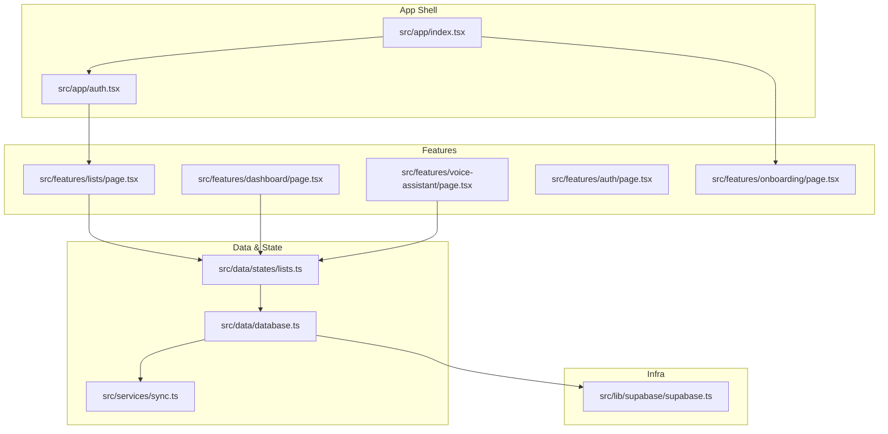
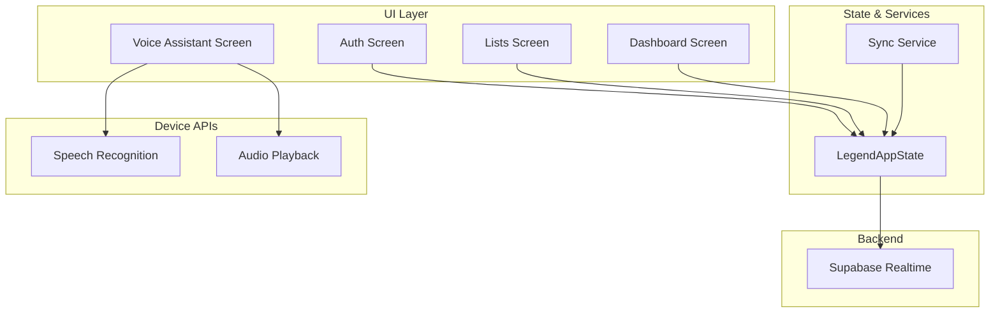
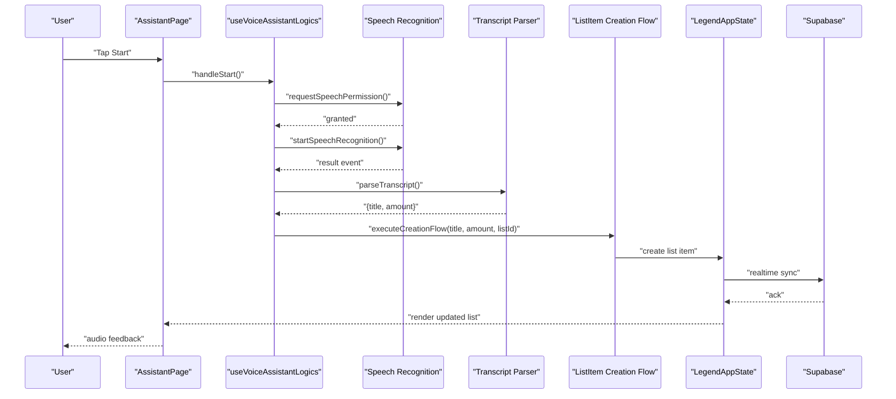
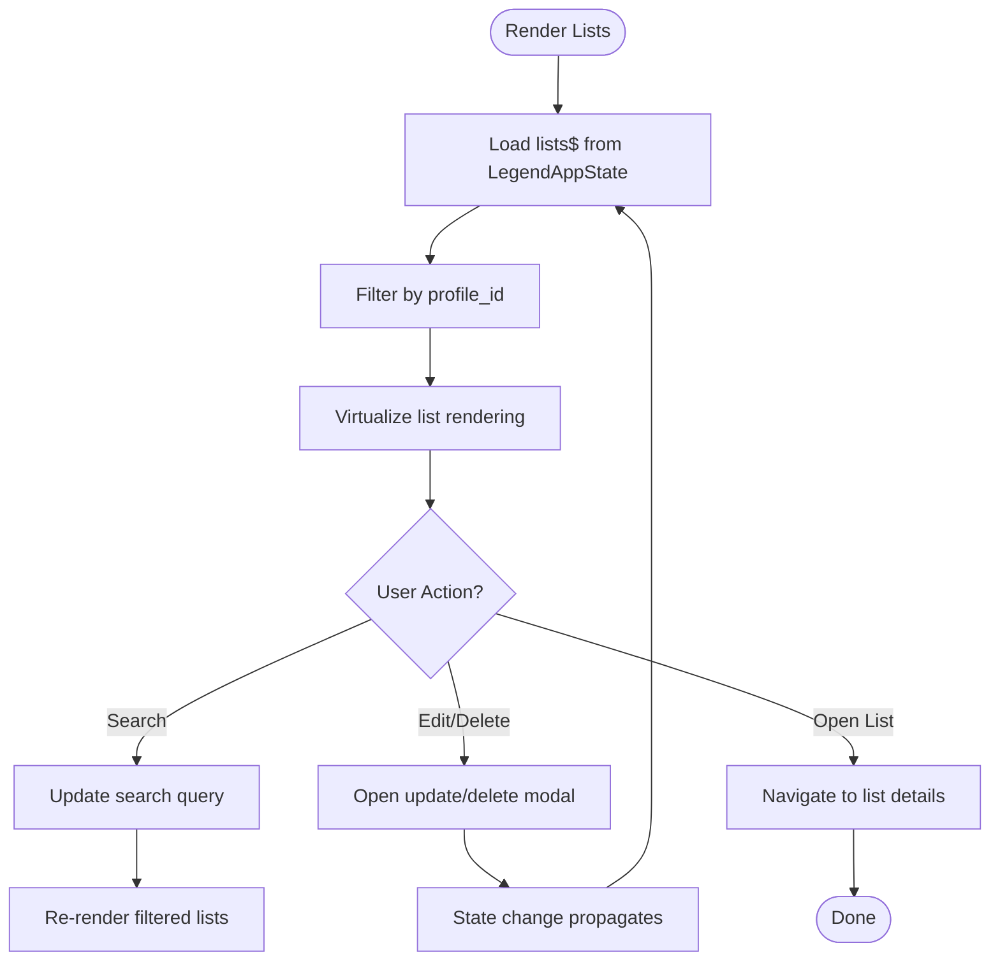
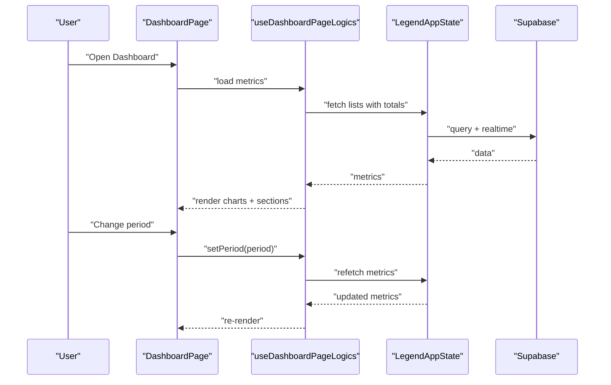
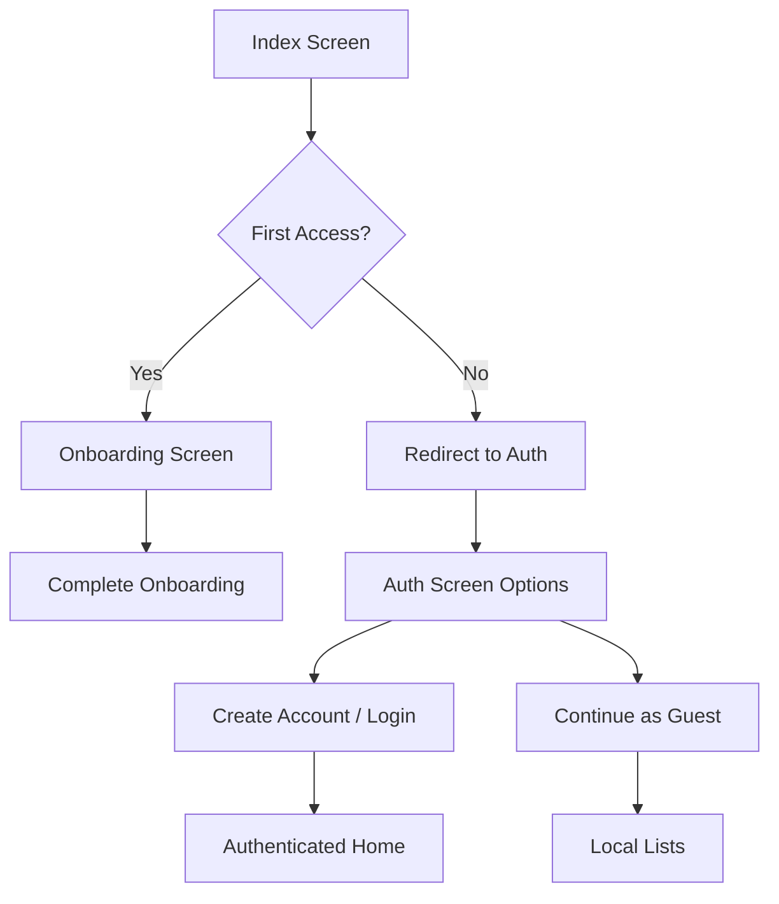
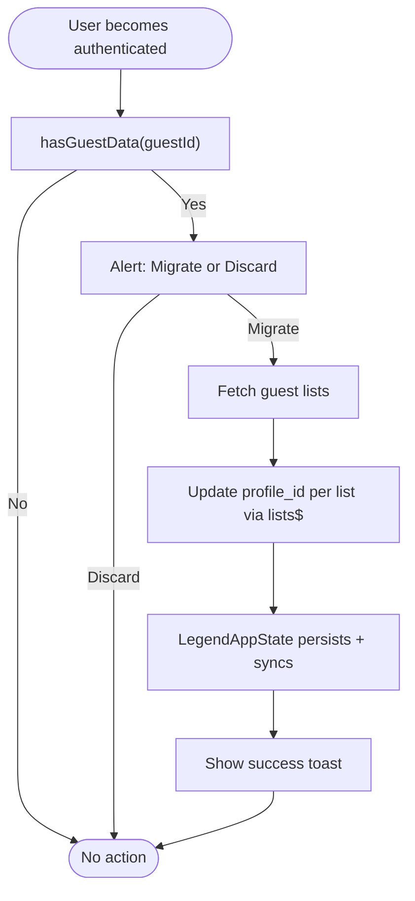
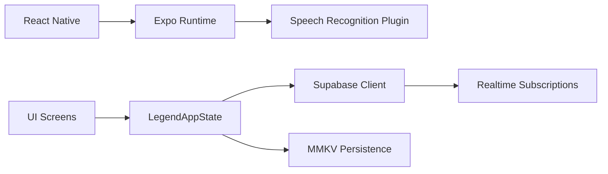

# Project Overview

<cite>
**Referenced Files in This Document**
- [package.json](file://package.json)
- [app.json](file://app.json)
- [src/app/index.tsx](file://src/app/index.tsx)
- [src/features/voice-assistant/page.tsx](file://src/features/voice-assistant/page.tsx)
- [src/features/voice-assistant/hooks/use-voice-assistant-logics.ts](file://src/features/voice-assistant/hooks/use-voice-assistant-logics.ts)
- [src/features/dashboard/page.tsx](file://src/features/dashboard/page.tsx)
- [src/features/lists/page.tsx](file://src/features/lists/page.tsx)
- [src/data/states/lists.ts](file://src/data/states/lists.ts)
- [src/data/database.ts](file://src/data/database.ts)
- [src/lib/supabase/supabase.ts](file://src/lib/supabase/supabase.ts)
- [src/services/sync.ts](file://src/services/sync.ts)
- [src/features/auth/page.tsx](file://src/features/auth/page.tsx)
- [src/features/onboarding/page.tsx](file://src/features/onboarding/page.tsx)
</cite>

## Table of Contents
1. [Introduction](#introduction)
2. [Project Structure](#project-structure)
3. [Core Components](#core-components)
4. [Architecture Overview](#architecture-overview)
5. [Detailed Component Analysis](#detailed-component-analysis)
6. [Dependency Analysis](#dependency-analysis)
7. [Performance Considerations](#performance-considerations)
8. [Troubleshooting Guide](#troubleshooting-guide)
9. [Conclusion](#conclusion)

## Introduction
PowerLists is a voice-controlled shopping list management application designed to streamline the process of creating, organizing, and tracking shopping lists. Its core value proposition lies in enabling hands-free list creation through natural speech commands, while delivering a seamless, real-time, and cross-platform experience. Users can choose between local-first workflows and cloud-backed synchronization, ensuring flexibility and privacy.

Target audience:
- Everyday consumers who want a fast, frictionless way to capture shopping items via voice
- Users seeking a unified dashboard to analyze spending trends and list performance
- Teams or families sharing lists with real-time synchronization across devices

Key features:
- Voice recognition capabilities powered by device speech APIs
- Real-time synchronization via Supabase and LegendAppState
- Dashboard analytics for checked totals, recent lists, and item variations
- Cross-platform deployment using React Native and Expo

## Project Structure
The project follows a feature-based structure with clear separation between UI, data, services, and infrastructure. Pages and features are organized under src/features and src/app, while shared components live under src/components. Data states and persistence integrate with LegendAppState and Supabase.

**Diagram sources**
- [src/app/index.tsx:1-14](file://src/app/index.tsx#L1-L14)
- [src/features/lists/page.tsx:1-98](file://src/features/lists/page.tsx#L1-L98)
- [src/features/dashboard/page.tsx:1-135](file://src/features/dashboard/page.tsx#L1-L135)
- [src/features/voice-assistant/page.tsx:1-60](file://src/features/voice-assistant/page.tsx#L1-L60)
- [src/features/auth/page.tsx:1-56](file://src/features/auth/page.tsx#L1-L56)
- [src/features/onboarding/page.tsx:1-10](file://src/features/onboarding/page.tsx#L1-L10)
- [src/data/states/lists.ts:1-27](file://src/data/states/lists.ts#L1-L27)
- [src/data/database.ts:1-36](file://src/data/database.ts#L1-L36)
- [src/services/sync.ts:1-203](file://src/services/sync.ts#L1-L203)
- [src/lib/supabase/supabase.ts:1-29](file://src/lib/supabase/supabase.ts#L1-L29)

**Section sources**
- [package.json:1-118](file://package.json#L1-L118)
- [app.json:1-98](file://app.json#L1-L98)
- [src/app/index.tsx:1-14](file://src/app/index.tsx#L1-L14)

## Core Components
- Voice Assistant: Provides a conversational interface for adding list items via speech, with manual and continuous modes, audio feedback, and transcript parsing.
- Lists Management: Displays lists with search, totals, and swipe actions; integrates with real-time state and persistence.
- Dashboard: Visualizes checked totals, recent lists, and item variations with lazy-loaded components and reactive updates.
- Authentication and Onboarding: Guides new users through onboarding and offers guest/local-first or authenticated/cloud workflows.
- Data Synchronization: Implements guest-to-user data migration and real-time syncing using Supabase and LegendAppState.

Practical examples:
- Adding items by voice: Start voice assistant, speak an item and quantity, and watch it appear in the list with audio confirmation.
- Sharing lists: Switch from guest mode to authenticated mode; lists sync automatically across devices.
- Analyzing spending: Open the dashboard, filter by period, and review checked totals and popular items.

**Section sources**
- [src/features/voice-assistant/page.tsx:1-60](file://src/features/voice-assistant/page.tsx#L1-L60)
- [src/features/voice-assistant/hooks/use-voice-assistant-logics.ts:1-213](file://src/features/voice-assistant/hooks/use-voice-assistant-logics.ts#L1-L213)
- [src/features/lists/page.tsx:1-98](file://src/features/lists/page.tsx#L1-L98)
- [src/features/dashboard/page.tsx:1-135](file://src/features/dashboard/page.tsx#L1-L135)
- [src/features/auth/page.tsx:1-56](file://src/features/auth/page.tsx#L1-L56)
- [src/features/onboarding/page.tsx:1-10](file://src/features/onboarding/page.tsx#L1-L10)
- [src/services/sync.ts:1-203](file://src/services/sync.ts#L1-L203)

## Architecture Overview
PowerLists uses a modern React Native + Expo stack with a reactive state layer and a real-time backend. The voice assistant leverages device speech APIs, while data is persisted locally and synchronized to the cloud via Supabase. LegendAppState orchestrates state, persistence, and real-time subscriptions.

**Diagram sources**
- [src/features/auth/page.tsx:1-56](file://src/features/auth/page.tsx#L1-L56)
- [src/features/lists/page.tsx:1-98](file://src/features/lists/page.tsx#L1-L98)
- [src/features/dashboard/page.tsx:1-135](file://src/features/dashboard/page.tsx#L1-L135)
- [src/features/voice-assistant/page.tsx:1-60](file://src/features/voice-assistant/page.tsx#L1-L60)
- [src/data/database.ts:1-36](file://src/data/database.ts#L1-L36)
- [src/services/sync.ts:1-203](file://src/services/sync.ts#L1-L203)
- [src/lib/supabase/supabase.ts:1-29](file://src/lib/supabase/supabase.ts#L1-L29)

## Detailed Component Analysis

### Voice Assistant Workflow
The voice assistant enables hands-free item creation with optional continuous listening. It manages permissions, speech events, transcript parsing, and audio feedback, then triggers the list item creation flow.

**Diagram sources**
- [src/features/voice-assistant/page.tsx:1-60](file://src/features/voice-assistant/page.tsx#L1-L60)
- [src/features/voice-assistant/hooks/use-voice-assistant-logics.ts:1-213](file://src/features/voice-assistant/hooks/use-voice-assistant-logics.ts#L1-L213)

**Section sources**
- [src/features/voice-assistant/page.tsx:1-60](file://src/features/voice-assistant/page.tsx#L1-L60)
- [src/features/voice-assistant/hooks/use-voice-assistant-logics.ts:1-213](file://src/features/voice-assistant/hooks/use-voice-assistant-logics.ts#L1-L213)

### Lists and Real-Time State
The lists screen renders a virtualized list of shopping lists, integrates with LegendAppState for reactive updates, and supports search and swipe actions. Real-time filtering ensures each user sees only their data.

**Diagram sources**
- [src/features/lists/page.tsx:1-98](file://src/features/lists/page.tsx#L1-L98)
- [src/data/states/lists.ts:1-27](file://src/data/states/lists.ts#L1-L27)
- [src/data/database.ts:1-36](file://src/data/database.ts#L1-L36)

**Section sources**
- [src/features/lists/page.tsx:1-98](file://src/features/lists/page.tsx#L1-L98)
- [src/data/states/lists.ts:1-27](file://src/data/states/lists.ts#L1-L27)
- [src/data/database.ts:1-36](file://src/data/database.ts#L1-L36)

### Dashboard Analytics
The dashboard lazily loads analytics components and reacts to period filters. It computes metrics like checked totals and item variations, and navigates to detailed views on demand.

**Diagram sources**
- [src/features/dashboard/page.tsx:1-135](file://src/features/dashboard/page.tsx#L1-L135)
- [src/data/states/lists.ts:1-27](file://src/data/states/lists.ts#L1-L27)
- [src/data/database.ts:1-36](file://src/data/database.ts#L1-L36)

**Section sources**
- [src/features/dashboard/page.tsx:1-135](file://src/features/dashboard/page.tsx#L1-L135)

### Authentication and Onboarding
The app starts with onboarding and then routes authenticated users to the home screen. The auth screen presents options for account creation, login, or continuing as a guest.

**Diagram sources**
- [src/app/index.tsx:1-14](file://src/app/index.tsx#L1-L14)
- [src/features/onboarding/page.tsx:1-10](file://src/features/onboarding/page.tsx#L1-L10)
- [src/features/auth/page.tsx:1-56](file://src/features/auth/page.tsx#L1-L56)

**Section sources**
- [src/app/index.tsx:1-14](file://src/app/index.tsx#L1-L14)
- [src/features/onboarding/page.tsx:1-10](file://src/features/onboarding/page.tsx#L1-L10)
- [src/features/auth/page.tsx:1-56](file://src/features/auth/page.tsx#L1-L56)

### Data Synchronization and Migration
The SyncService detects guest data and migrates it to authenticated user accounts. It updates list ownership via LegendAppState, which automatically syncs to Supabase.

**Diagram sources**
- [src/services/sync.ts:1-203](file://src/services/sync.ts#L1-L203)
- [src/data/states/lists.ts:1-27](file://src/data/states/lists.ts#L1-L27)
- [src/data/database.ts:1-36](file://src/data/database.ts#L1-L36)

**Section sources**
- [src/services/sync.ts:1-203](file://src/services/sync.ts#L1-L203)
- [src/data/states/lists.ts:1-27](file://src/data/states/lists.ts#L1-L27)
- [src/data/database.ts:1-36](file://src/data/database.ts#L1-L36)

## Dependency Analysis
- React Native and Expo provide the cross-platform runtime and device integrations (speech, audio, navigation).
- LegendAppState powers reactive state, persistence, and real-time synchronization.
- Supabase supplies backend services, authentication, and real-time subscriptions.
- Device speech recognition is configured via Expo plugins and app.json.

**Diagram sources**
- [package.json:1-118](file://package.json#L1-L118)
- [app.json:1-98](file://app.json#L1-L98)
- [src/lib/supabase/supabase.ts:1-29](file://src/lib/supabase/supabase.ts#L1-L29)
- [src/data/database.ts:1-36](file://src/data/database.ts#L1-L36)

**Section sources**
- [package.json:1-118](file://package.json#L1-L118)
- [app.json:1-98](file://app.json#L1-L98)
- [src/lib/supabase/supabase.ts:1-29](file://src/lib/supabase/supabase.ts#L1-L29)
- [src/data/database.ts:1-36](file://src/data/database.ts#L1-L36)

## Performance Considerations
- Virtualized lists reduce rendering overhead on large datasets.
- Lazy loading of dashboard components improves initial load performance.
- Reactive state minimizes redundant network calls by subscribing only to relevant records.
- Local persistence with MMKV reduces cold-start latency and offline readiness.

## Troubleshooting Guide
- Microphone permission denied: The voice assistant checks permissions and shows a warning toast; guide users to grant permissions in system settings.
- Speech recognition errors: Errors surface as toasts with actionable messages; the assistant stops recording and resets state.
- Guest-to-user migration failures: Errors are captured and surfaced via toasts; users can retry after resolving underlying issues.

**Section sources**
- [src/features/voice-assistant/hooks/use-voice-assistant-logics.ts:1-213](file://src/features/voice-assistant/hooks/use-voice-assistant-logics.ts#L1-L213)
- [src/services/sync.ts:1-203](file://src/services/sync.ts#L1-L203)

## Conclusion
PowerLists combines voice-first UX with robust real-time synchronization and insightful analytics to deliver a practical, scalable shopping list solution. Its modular architecture, built on React Native, Expo, Supabase, and LegendAppState, supports rapid iteration and cross-platform distribution while maintaining a smooth user experience.