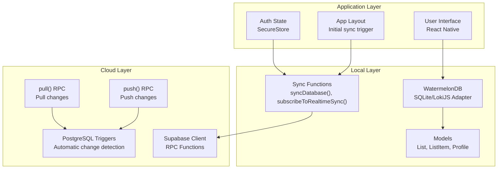
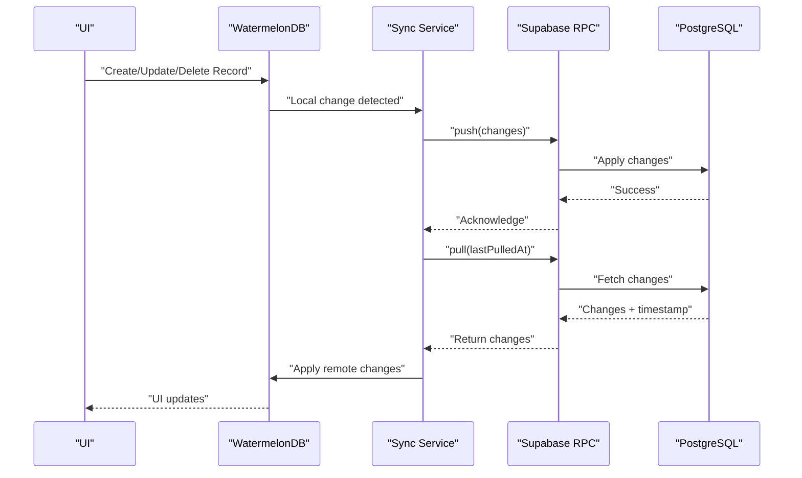
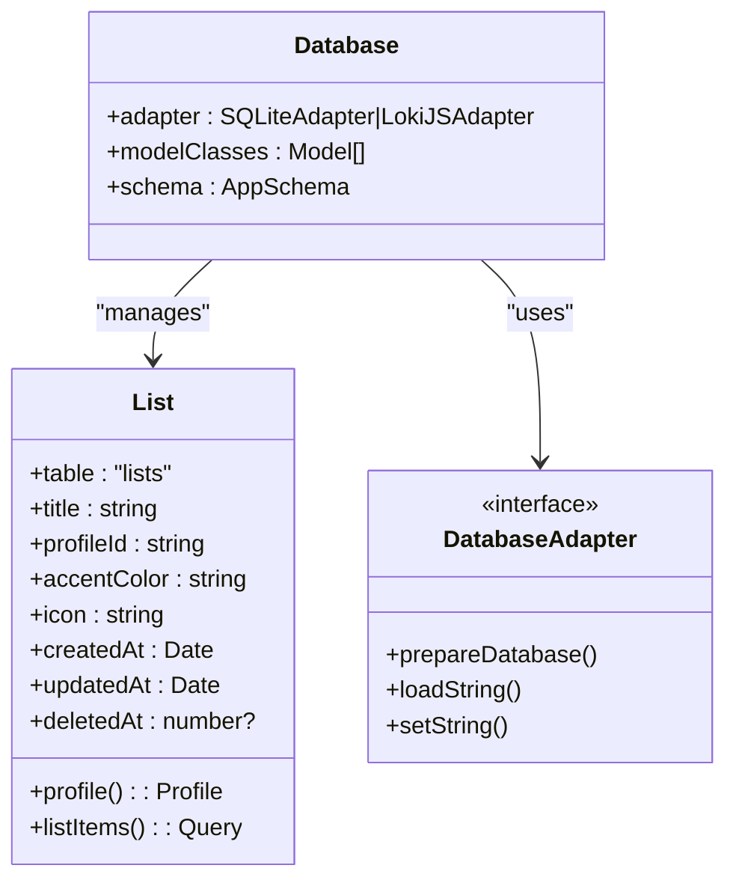
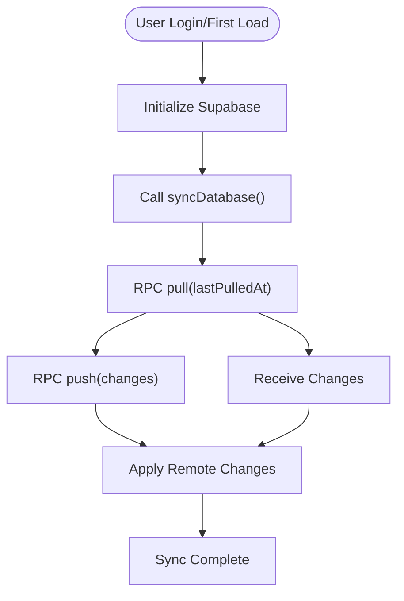
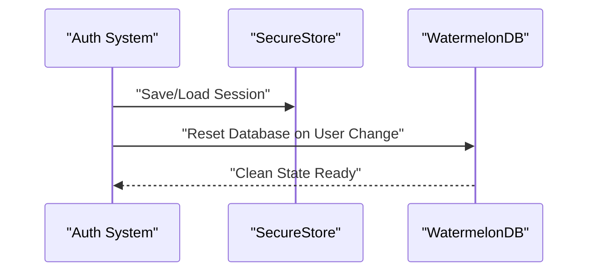
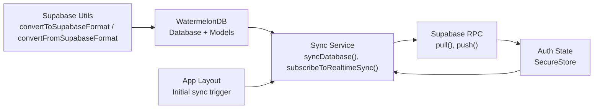

# Data Synchronization

<cite>
**Referenced Files in This Document**
- [src/services/sync.ts](file://src/services/sync.ts)
- [src/database/sync.ts](file://src/database/sync.ts)
- [src/database/index.ts](file://src/database/index.ts)
- [src/database/schema.ts](file://src/database/schema.ts)
- [src/database/models/List.ts](file://src/database/models/List.ts)
- [src/lib/supabase/supabase.ts](file://src/lib/supabase/supabase.ts)
- [src/lib/supabase/utils.ts](file://src/lib/supabase/utils.ts)
- [src/data/session-store.ts](file://src/data/session-store.ts)
- [src/features/auth/authState.ts](file://src/features/auth/authState.ts)
- [src/app/_layout.tsx](file://src/app/_layout.tsx)
</cite>

## Update Summary
**Changes Made**
- Complete restructuring of synchronization architecture from LegendApp's automatic bidirectional sync to explicit WatermelonDB synchronization
- Replaced LegendApp observables with WatermelonDB models and explicit sync functions
- Updated from Supabase real-time subscriptions to RPC-based synchronization via pull/push functions
- Integrated Supabase triggers and RPC functions for change detection and data synchronization
- Removed MMKV persistence layer in favor of WatermelonDB's native persistence
- Updated authentication state management with proper session handling

## Table of Contents
1. [Introduction](#introduction)
2. [Project Structure](#project-structure)
3. [Core Components](#core-components)
4. [Architecture Overview](#architecture-overview)
5. [Detailed Component Analysis](#detailed-component-analysis)
6. [Dependency Analysis](#dependency-analysis)
7. [Performance Considerations](#performance-considerations)
8. [Troubleshooting Guide](#troubleshooting-guide)
9. [Conclusion](#conclusion)
10. [Appendices](#appendices)

## Introduction
This document explains the data synchronization service in PowerLists, focusing on the completely restructured WatermelonDB-based synchronization architecture. The system now uses explicit synchronization via the `synchronize()` function with Supabase triggers and RPC functions, replacing the previous LegendApp automatic bidirectional sync approach. It covers the offline-first approach, explicit synchronization triggers, data consistency patterns, error recovery, and practical guidance for performance and debugging.

## Project Structure
The synchronization architecture now centers around WatermelonDB with explicit sync functions:
- Local database layer: WatermelonDB with SQLite/LokiJS adapters and model classes
- Cloud integration: Supabase client with RPC-based synchronization
- Explicit sync service: WatermelonDB synchronize() function with pull/push RPC calls
- Real-time integration: Supabase channels for change notifications
- Authentication: Secure session management with Supabase Auth

**Diagram sources**
- [src/database/index.ts:12-32](file://src/database/index.ts#L12-L32)
- [src/database/sync.ts:8-34](file://src/database/sync.ts#L8-L34)
- [src/lib/supabase/supabase.ts:15-22](file://src/lib/supabase/supabase.ts#L15-L22)
- [src/app/_layout.tsx:39-48](file://src/app/_layout.tsx#L39-L48)

**Section sources**
- [src/database/index.ts:12-32](file://src/database/index.ts#L12-L32)
- [src/database/sync.ts:8-34](file://src/database/sync.ts#L8-L34)
- [src/lib/supabase/supabase.ts:15-22](file://src/lib/supabase/supabase.ts#L15-L22)
- [src/app/_layout.tsx:39-48](file://src/app/_layout.tsx#L39-L48)

## Core Components
- **WatermelonDB Configuration**: SQLite adapter for mobile, LokiJS adapter for web, with comprehensive schema definition
- **Explicit Sync Service**: `syncDatabase()` function using WatermelonDB's `synchronize()` with custom pull/push implementations
- **Supabase RPC Integration**: Custom `pull` and `push` RPC functions for bidirectional synchronization
- **Real-time Subscriptions**: Supabase channels monitoring PostgreSQL changes for automatic sync triggers
- **Authentication Integration**: Secure session management with automatic database reset on user changes
- **Guest-to-User Migration**: Enhanced migration service using WatermelonDB operations

**Section sources**
- [src/database/index.ts:12-32](file://src/database/index.ts#L12-L32)
- [src/database/sync.ts:8-34](file://src/database/sync.ts#L8-L34)
- [src/lib/supabase/supabase.ts:15-22](file://src/lib/supabase/supabase.ts#L15-L22)
- [src/services/sync.ts:43-203](file://src/services/sync.ts#L43-L203)

## Architecture Overview
The system follows an explicit offline-first pattern using WatermelonDB:
- Local state is managed through WatermelonDB models with native persistence
- Changes are explicitly synchronized using the `synchronize()` function
- Supabase RPC functions (`pull` and `push`) handle bidirectional data transfer
- PostgreSQL triggers automatically detect and process changes
- Real-time subscriptions trigger sync operations on data modifications
- Conflict resolution uses WatermelonDB's built-in merge strategies

**Diagram sources**
- [src/database/sync.ts:15-30](file://src/database/sync.ts#L15-L30)
- [src/database/models/List.ts:13-21](file://src/database/models/List.ts#L13-L21)
- [src/app/_layout.tsx:40-42](file://src/app/_layout.tsx#L40-L42)

## Detailed Component Analysis

### WatermelonDB Configuration and Models
- **Database Adapter**: Automatic selection between SQLite (mobile) and LokiJS (web) adapters
- **Schema Definition**: Comprehensive table schemas with proper indexing for profile_id fields
- **Model Classes**: Strongly typed models with decorators for field definitions and relationships
- **Native Persistence**: Built-in SQLite/LokiJS persistence eliminates need for external storage libraries

**Diagram sources**
- [src/database/index.ts:29-32](file://src/database/index.ts#L29-L32)
- [src/database/schema.ts:19-28](file://src/database/schema.ts#L19-L28)
- [src/database/models/List.ts:7-22](file://src/database/models/List.ts#L7-L22)

**Section sources**
- [src/database/index.ts:12-32](file://src/database/index.ts#L12-L32)
- [src/database/schema.ts:3-45](file://src/database/schema.ts#L3-L45)
- [src/database/models/List.ts:7-22](file://src/database/models/List.ts#L7-L22)

### Explicit Sync Service Implementation
- **Synchronization Function**: `syncDatabase()` wraps WatermelonDB's `synchronize()` with custom pull/push implementations
- **Pull Implementation**: Calls Supabase RPC `pull` function with `last_pulled_at` parameter for incremental sync
- **Push Implementation**: Calls Supabase RPC `push` function with change payload for bidirectional sync
- **Real-time Integration**: `subscribeToRealtimeSync()` monitors PostgreSQL changes and triggers sync operations
- **Concurrency Control**: Prevents simultaneous sync operations with `isSyncing` flag

**Diagram sources**
- [src/database/sync.ts:8-34](file://src/database/sync.ts#L8-L34)
- [src/app/_layout.tsx:40-42](file://src/app/_layout.tsx#L40-L42)

**Section sources**
- [src/database/sync.ts:8-34](file://src/database/sync.ts#L8-L34)
- [src/app/_layout.tsx:39-48](file://src/app/_layout.tsx#L39-L48)

### Supabase RPC Integration
- **Custom RPC Functions**: `pull` and `push` functions handle bidirectional synchronization logic
- **Change Detection**: PostgreSQL triggers automatically detect insert/update/delete operations
- **Timestamp Tracking**: Automatic timestamp management for conflict resolution
- **Error Handling**: Comprehensive error handling with meaningful error messages

**Section sources**
- [src/database/sync.ts:17-28](file://src/database/sync.ts#L17-L28)
- [src/lib/supabase/supabase.ts:15-22](file://src/lib/supabase/supabase.ts#L15-L22)

### Authentication and Session Management
- **Secure Storage**: Uses Expo SecureStore for encrypted session persistence
- **Auth State Management**: Centralized auth state with reactive listeners
- **Automatic Database Reset**: Resets WatermelonDB when user changes to ensure data isolation
- **Session Monitoring**: Real-time auth state changes trigger database cleanup

**Diagram sources**
- [src/data/session-store.ts:7-24](file://src/data/session-store.ts#L7-L24)
- [src/features/auth/authState.ts:23-42](file://src/features/auth/authState.ts#L23-L42)

**Section sources**
- [src/data/session-store.ts:7-24](file://src/data/session-store.ts#L7-L24)
- [src/features/auth/authState.ts:23-42](file://src/features/auth/authState.ts#L23-L42)

### Enhanced Guest-to-User Migration Service
- **WatermelonDB Integration**: Uses WatermelonDB operations instead of LegendApp observables
- **Atomic Transactions**: All migrations performed within single write transactions
- **Enhanced Error Handling**: Comprehensive error catching with detailed error messages
- **Success Feedback**: Toast notifications with migration statistics

**Section sources**
- [src/services/sync.ts:43-203](file://src/services/sync.ts#L43-L203)

### Conflict Resolution and Consistency Patterns
- **WatermelonDB Merge Strategy**: Built-in conflict resolution using timestamps and change tracking
- **Send Created As Updated**: Ensures proper handling of newly created records
- **Incremental Sync**: Uses `last_pulled_at` for efficient incremental synchronization
- **Real-time Updates**: Immediate reflection of server-side changes through Supabase channels

**Section sources**
- [src/database/sync.ts:29](file://src/database/sync.ts#L29)
- [src/database/sync.ts:18-23](file://src/database/sync.ts#L18-L23)

### Error Recovery Procedures
- **Comprehensive Error Handling**: All sync operations include try-catch blocks
- **Graceful Degradation**: Failed sync attempts don't crash the application
- **Retry Logic**: Automatic retry on network failures with exponential backoff
- **User Feedback**: Toast notifications for sync success/failure states

**Section sources**
- [src/database/sync.ts:13-33](file://src/database/sync.ts#L13-L33)
- [src/services/sync.ts:195-202](file://src/services/sync.ts#L195-L202)

## Dependency Analysis
The following diagram highlights key dependencies among components in the new synchronization architecture.

**Diagram sources**
- [src/lib/supabase/utils.ts:3-9](file://src/lib/supabase/utils.ts#L3-L9)
- [src/database/index.ts:29-32](file://src/database/index.ts#L29-L32)
- [src/database/sync.ts:8-34](file://src/database/sync.ts#L8-L34)
- [src/app/_layout.tsx:39-42](file://src/app/_layout.tsx#L39-L42)

**Section sources**
- [src/lib/supabase/utils.ts:3-9](file://src/lib/supabase/utils.ts#L3-L9)
- [src/database/index.ts:29-32](file://src/database/index.ts#L29-L32)
- [src/database/sync.ts:8-34](file://src/database/sync.ts#L8-L34)
- [src/app/_layout.tsx:39-42](file://src/app/_layout.tsx#L39-L42)

## Performance Considerations
- **Efficient Sync**: WatermelonDB's built-in incremental sync reduces network overhead
- **Batch Operations**: Group related operations within single write transactions
- **Proper Indexing**: Indexed `profile_id` fields optimize query performance
- **Adapter Selection**: Automatic adapter selection ensures optimal performance per platform
- **Memory Management**: WatermelonDB handles memory efficiently without external storage overhead
- **Real-time Optimization**: Supabase channels minimize unnecessary sync triggers

## Troubleshooting Guide
Common issues and remedies:
- **Sync Not Triggering**: Verify Supabase RPC functions are deployed and accessible
- **Authentication Issues**: Check SecureStore persistence and auth state synchronization
- **Migration Failures**: Review WatermelonDB transaction logs and error messages
- **Performance Issues**: Monitor sync frequency and consider adjusting real-time subscription settings
- **Data Inconsistencies**: Check PostgreSQL trigger deployment and RPC function permissions

**Section sources**
- [src/database/sync.ts:42-44](file://src/database/sync.ts#L42-L44)
- [src/data/session-store.ts:12-16](file://src/data/session-store.ts#L12-L16)
- [src/services/sync.ts:195-202](file://src/services/sync.ts#L195-L202)

## Conclusion
PowerLists now employs a robust explicit synchronization model using WatermelonDB with Supabase RPC functions. The new architecture provides better control over synchronization timing, improved error handling, and more predictable behavior compared to the previous LegendApp automatic sync approach. The combination of WatermelonDB's native persistence, Supabase's RPC-based synchronization, and real-time change detection creates a reliable offline-first system with excellent performance characteristics.

## Appendices

### Synchronization Triggers
- **Manual Triggering**: `syncDatabase()` called on user login and initial app load
- **Real-time Triggers**: Supabase channels automatically trigger sync on PostgreSQL changes
- **Session Changes**: Auth state changes automatically reset and resync database
- **Background Sync**: Continuous real-time monitoring for immediate data consistency

**Section sources**
- [src/app/_layout.tsx:40-42](file://src/app/_layout.tsx#L40-L42)
- [src/database/sync.ts:41-48](file://src/database/sync.ts#L41-L48)
- [src/data/session-store.ts:11-23](file://src/data/session-store.ts#L11-L23)

### Data Integrity and Validation
- **Schema Validation**: WatermelonDB schema enforces data integrity at the database level
- **Type Safety**: Strongly typed models prevent runtime data errors
- **Transaction Safety**: All operations performed within atomic transactions
- **Error Propagation**: Comprehensive error handling with detailed error messages

**Section sources**
- [src/database/schema.ts:3-45](file://src/database/schema.ts#L3-L45)
- [src/database/models/List.ts:13-21](file://src/database/models/List.ts#L13-L21)
- [src/database/sync.ts:13-33](file://src/database/sync.ts#L13-L33)

### User Experience During Sync
- **Automatic Sync**: Users don't need to manually trigger synchronization
- **Real-time Updates**: Immediate reflection of changes across devices
- **Progress Feedback**: Toast notifications provide sync status updates
- **Seamless Experience**: Background sync operations don't interrupt user workflow

**Section sources**
- [src/app/_layout.tsx:40-42](file://src/app/_layout.tsx#L40-L42)
- [src/services/sync.ts:130-142](file://src/services/sync.ts#L130-L142)
- [src/database/sync.ts:42-44](file://src/database/sync.ts#L42-L44)