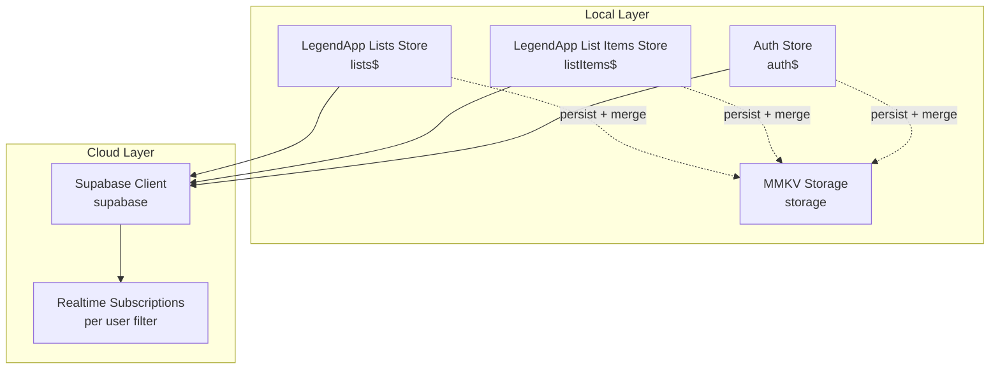
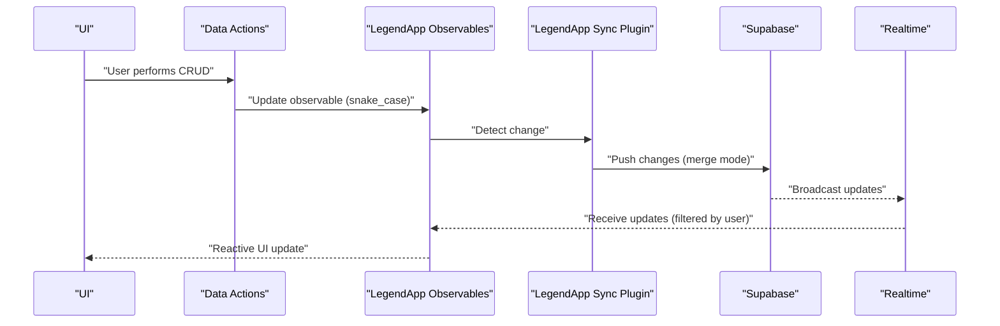
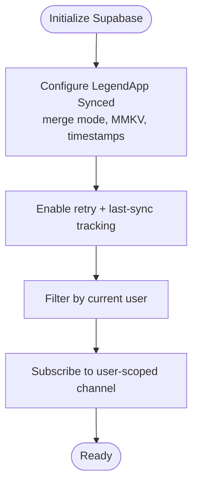
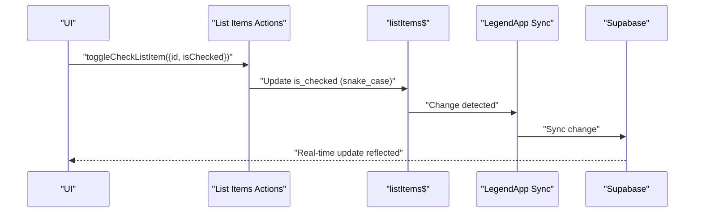
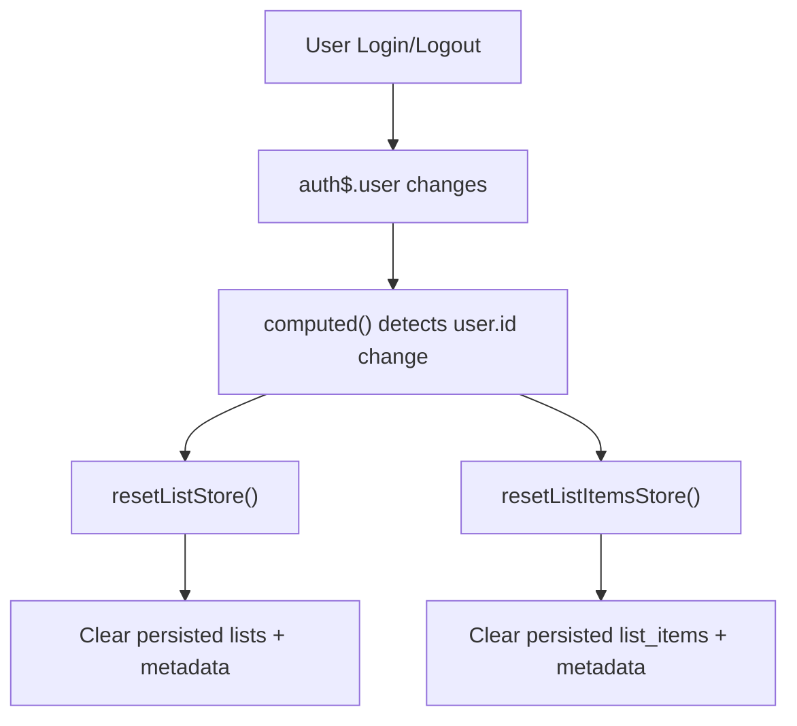
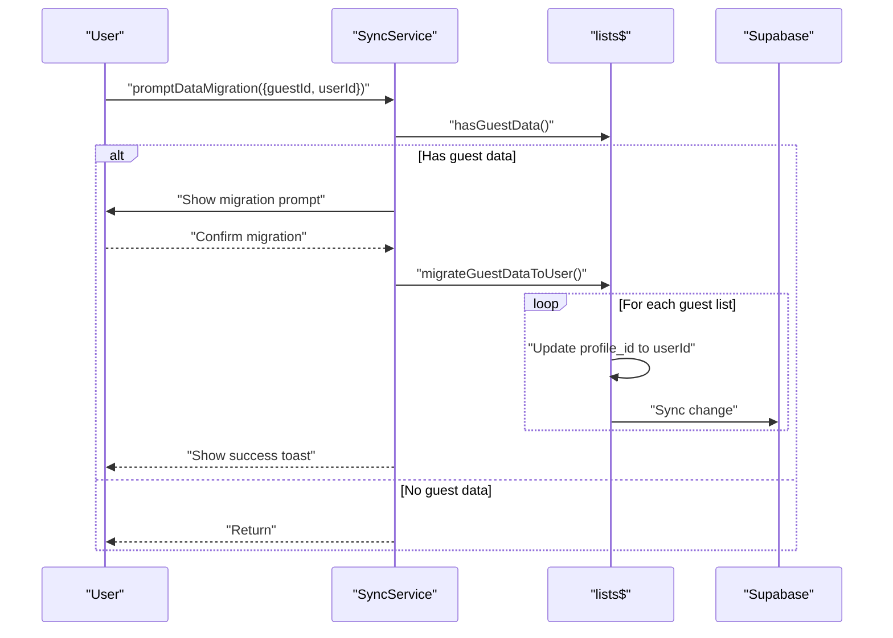
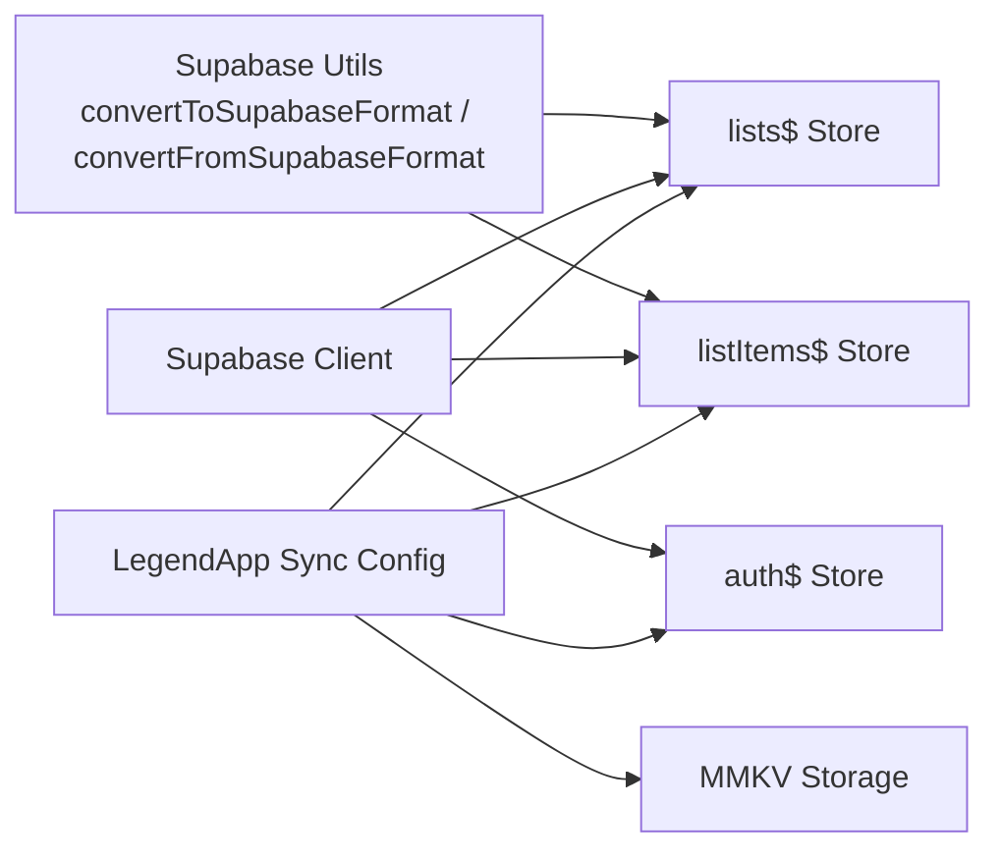

# Data Synchronization

<cite>
**Referenced Files in This Document**
- [src/services/sync.ts](file://src/services/sync.ts)
- [src/data/database.ts](file://src/data/database.ts)
- [src/data/storage.ts](file://src/data/storage.ts)
- [src/data/session-store.ts](file://src/data/session-store.ts)
- [src/data/states/lists.ts](file://src/data/states/lists.ts)
- [src/data/states/auth.ts](file://src/data/states/auth.ts)
- [src/data/actions/lists.ts](file://src/data/actions/lists.ts)
- [src/data/actions/list-items.ts](file://src/data/actions/list-items.ts)
- [src/lib/supabase/supabase.ts](file://src/lib/supabase/supabase.ts)
- [src/lib/supabase/utils.ts](file://src/lib/supabase/utils.ts)
- [src/services/index.ts](file://src/services/index.ts)
</cite>

## Table of Contents
1. [Introduction](#introduction)
2. [Project Structure](#project-structure)
3. [Core Components](#core-components)
4. [Architecture Overview](#architecture-overview)
5. [Detailed Component Analysis](#detailed-component-analysis)
6. [Dependency Analysis](#dependency-analysis)
7. [Performance Considerations](#performance-considerations)
8. [Troubleshooting Guide](#troubleshooting-guide)
9. [Conclusion](#conclusion)
10. [Appendices](#appendices)

## Introduction
This document explains the data synchronization service in PowerLists, focusing on how local state integrates with the cloud database, how conflicts are resolved, and how real-time updates are coordinated. It covers the offline-first approach, synchronization triggers, data consistency patterns, error recovery, and practical guidance for performance and debugging. The system leverages LegendApp State for reactive, synchronized observables, MMKV for local persistence, and Supabase for cloud storage and real-time subscriptions.

## Project Structure
The synchronization architecture spans several layers:
- Local state and persistence: LegendApp observables configured with MMKV persistence and Supabase sync plugins.
- Cloud integration: Supabase client configured with MMKV-backed auth storage.
- Actions and services: Business logic for CRUD operations and guest-to-user data migration.
- Real-time updates: Supabase real-time subscriptions scoped per authenticated user.



**Diagram sources**
- [src/data/database.ts:13-29](file://src/data/database.ts#L13-L29)
- [src/data/states/lists.ts:5-26](file://src/data/states/lists.ts#L5-L26)
- [src/data/actions/list-items.ts:1-193](file://src/data/actions/list-items.ts#L1-L193)
- [src/data/states/auth.ts:22-33](file://src/data/states/auth.ts#L22-L33)
- [src/data/storage.ts:1-74](file://src/data/storage.ts#L1-L74)
- [src/lib/supabase/supabase.ts:21-28](file://src/lib/supabase/supabase.ts#L21-L28)

**Section sources**
- [src/data/database.ts:13-29](file://src/data/database.ts#L13-L29)
- [src/data/states/lists.ts:5-26](file://src/data/states/lists.ts#L5-L26)
- [src/data/actions/list-items.ts:1-193](file://src/data/actions/list-items.ts#L1-L193)
- [src/data/states/auth.ts:22-33](file://src/data/states/auth.ts#L22-L33)
- [src/data/storage.ts:1-74](file://src/data/storage.ts#L1-L74)
- [src/lib/supabase/supabase.ts:21-28](file://src/lib/supabase/supabase.ts#L21-L28)

## Core Components
- Supabase configuration with MMKV-backed auth storage and client initialization.
- LegendApp synced configuration enabling offline-first, merge-mode synchronization, and persistent caching.
- Lists and list items stores with per-user filtering and real-time subscriptions.
- Auth store with persisted session and user identity.
- Sync service for guest-to-user data migration and user prompts.
- Utility functions to convert between camelCase and snake_case for Supabase compatibility.

**Section sources**
- [src/lib/supabase/supabase.ts:21-28](file://src/lib/supabase/supabase.ts#L21-L28)
- [src/data/database.ts:13-29](file://src/data/database.ts#L13-L29)
- [src/data/states/lists.ts:5-26](file://src/data/states/lists.ts#L5-L26)
- [src/data/states/auth.ts:22-33](file://src/data/states/auth.ts#L22-L33)
- [src/services/sync.ts:41-202](file://src/services/sync.ts#L41-L202)
- [src/lib/supabase/utils.ts:1-10](file://src/lib/supabase/utils.ts#L1-L10)

## Architecture Overview
The system follows an offline-first pattern:
- Local state is observable and persisted via MMKV.
- Changes are synchronized to Supabase through LegendApp’s synced configuration.
- Real-time updates are received via Supabase subscriptions filtered by the current user.
- Conflict resolution uses merge mode with timestamps and last-sync tracking.



**Diagram sources**
- [src/data/actions/lists.ts:79-122](file://src/data/actions/lists.ts#L79-L122)
- [src/data/actions/list-items.ts:53-104](file://src/data/actions/list-items.ts#L53-L104)
- [src/data/database.ts:13-29](file://src/data/database.ts#L13-L29)
- [src/data/states/lists.ts:17-21](file://src/data/states/lists.ts#L17-L21)
- [src/lib/supabase/supabase.ts:21-28](file://src/lib/supabase/supabase.ts#L21-L28)

## Detailed Component Analysis

### Supabase and Sync Configuration
- Supabase client is initialized with environment variables and MMKV-backed auth storage.
- LegendApp synced configuration enables:
  - Persistence via MMKV.
  - Merge mode synchronization.
  - Timestamp fields for created/updated/deleted tracking.
  - Infinite retries and last-sync change tracking.
- Current user retrieval is derived from the auth store.



**Diagram sources**
- [src/lib/supabase/supabase.ts:21-28](file://src/lib/supabase/supabase.ts#L21-L28)
- [src/data/database.ts:13-29](file://src/data/database.ts#L13-L29)
- [src/data/states/lists.ts:17-21](file://src/data/states/lists.ts#L17-L21)
- [src/data/states/auth.ts:22-33](file://src/data/states/auth.ts#L22-L33)

**Section sources**
- [src/lib/supabase/supabase.ts:21-28](file://src/lib/supabase/supabase.ts#L21-L28)
- [src/data/database.ts:13-29](file://src/data/database.ts#L13-L29)
- [src/data/states/lists.ts:17-21](file://src/data/states/lists.ts#L17-L21)
- [src/data/states/auth.ts:22-33](file://src/data/states/auth.ts#L22-L33)

### Lists Store and Real-Time Filtering
- The lists store is configured as a synced observable with:
  - Collection name and select fields.
  - Filter by current user’s profile_id.
  - Real-time subscription with dynamic filter based on current user.
  - Retry policy and persistence name.
- CRUD actions update the observable, triggering sync and real-time propagation.

```mermaid
classDiagram
class ListsStore {
+initial : Record<string, any>
+collection : "lists"
+select() : QueryBuilder
+filter() : QueryBuilder
+realtime.filter : "profile_id=eq.{userId}"
+retry : infinite
+persist : "lists"
}
class Actions {
+getAllLists()
+createNewList(props)
+updateList(props)
+deleteList(id)
}
ListsStore <.. Actions : "updates observable"
```

**Diagram sources**
- [src/data/states/lists.ts:5-26](file://src/data/states/lists.ts#L5-L26)
- [src/data/actions/lists.ts:37-122](file://src/data/actions/lists.ts#L37-L122)

**Section sources**
- [src/data/states/lists.ts:5-26](file://src/data/states/lists.ts#L5-L26)
- [src/data/actions/lists.ts:37-122](file://src/data/actions/lists.ts#L37-L122)

### List Items Store and Operations
- List items are similarly configured with per-user filtering and real-time updates.
- Operations include fetching all items, fetching by list, creating, toggling checked status, updating, and deleting.
- All mutations update the observable store, which triggers sync and real-time updates.



**Diagram sources**
- [src/data/actions/list-items.ts:109-127](file://src/data/actions/list-items.ts#L109-L127)
- [src/data/states/lists.ts:17-21](file://src/data/states/lists.ts#L17-L21)
- [src/data/database.ts:13-29](file://src/data/database.ts#L13-L29)

**Section sources**
- [src/data/actions/list-items.ts:109-127](file://src/data/actions/list-items.ts#L109-L127)
- [src/data/states/lists.ts:17-21](file://src/data/states/lists.ts#L17-L21)

### Authentication and Session Management
- Auth store persists user and session using MMKV.
- A session watcher resets list and list items stores when the user ID changes, ensuring data isolation per user.



**Diagram sources**
- [src/data/states/auth.ts:22-33](file://src/data/states/auth.ts#L22-L33)
- [src/data/session-store.ts:10-23](file://src/data/session-store.ts#L10-L23)
- [src/data/actions/lists.ts:205-210](file://src/data/actions/lists.ts#L205-L210)
- [src/data/actions/list-items.ts:188-192](file://src/data/actions/list-items.ts#L188-L192)
- [src/data/storage.ts:1-74](file://src/data/storage.ts#L1-L74)

**Section sources**
- [src/data/states/auth.ts:22-33](file://src/data/states/auth.ts#L22-L33)
- [src/data/session-store.ts:10-23](file://src/data/session-store.ts#L10-L23)
- [src/data/actions/lists.ts:205-210](file://src/data/actions/lists.ts#L205-L210)
- [src/data/actions/list-items.ts:188-192](file://src/data/actions/list-items.ts#L188-L192)
- [src/data/storage.ts:1-74](file://src/data/storage.ts#L1-L74)

### Guest-to-User Data Migration Service
- Detects whether a guest has lists locally.
- Prompts the user to migrate data to their authenticated account.
- Performs migration by updating the profile_id of each guest-owned list in the observable store, which triggers automatic sync to Supabase.
- Provides success/error feedback via toasts.



**Diagram sources**
- [src/services/sync.ts:102-150](file://src/services/sync.ts#L102-L150)
- [src/services/sync.ts:166-201](file://src/services/sync.ts#L166-L201)
- [src/data/states/lists.ts:17-21](file://src/data/states/lists.ts#L17-L21)
- [src/data/database.ts:13-29](file://src/data/database.ts#L13-L29)

**Section sources**
- [src/services/sync.ts:41-202](file://src/services/sync.ts#L41-L202)

### Conflict Resolution and Consistency Patterns
- Merge mode ensures local changes are merged with remote updates without overwriting uncommitted work.
- Timestamp fields (created_at, updated_at) and deleted flag support deterministic reconciliation.
- Last-sync tracking minimizes redundant sync operations.
- Real-time subscriptions ensure UI reflects server-side changes immediately for the current user.

**Section sources**
- [src/data/database.ts:20-28](file://src/data/database.ts#L20-L28)
- [src/data/states/lists.ts:17-21](file://src/data/states/lists.ts#L17-L21)

### Error Recovery Procedures
- All actions and services catch errors and return structured results or log failures.
- Infinite retry policies for sync and persistence reduce transient failure impact.
- Reset routines clear persisted data and reinitialize stores when switching users.

**Section sources**
- [src/data/actions/lists.ts:37-52](file://src/data/actions/lists.ts#L37-L52)
- [src/data/actions/list-items.ts:18-29](file://src/data/actions/list-items.ts#L18-L29)
- [src/data/database.ts:26-28](file://src/data/database.ts#L26-L28)
- [src/data/session-store.ts:15-22](file://src/data/session-store.ts#L15-L22)

## Dependency Analysis
The following diagram highlights key dependencies among components involved in synchronization.



**Diagram sources**
- [src/lib/supabase/utils.ts:1-10](file://src/lib/supabase/utils.ts#L1-L10)
- [src/lib/supabase/supabase.ts:21-28](file://src/lib/supabase/supabase.ts#L21-L28)
- [src/data/database.ts:13-29](file://src/data/database.ts#L13-L29)
- [src/data/states/lists.ts:5-26](file://src/data/states/lists.ts#L5-L26)
- [src/data/actions/list-items.ts:1-193](file://src/data/actions/list-items.ts#L1-L193)
- [src/data/states/auth.ts:22-33](file://src/data/states/auth.ts#L22-L33)
- [src/data/storage.ts:1-74](file://src/data/storage.ts#L1-L74)

**Section sources**
- [src/lib/supabase/utils.ts:1-10](file://src/lib/supabase/utils.ts#L1-L10)
- [src/lib/supabase/supabase.ts:21-28](file://src/lib/supabase/supabase.ts#L21-L28)
- [src/data/database.ts:13-29](file://src/data/database.ts#L13-L29)
- [src/data/states/lists.ts:5-26](file://src/data/states/lists.ts#L5-L26)
- [src/data/actions/list-items.ts:1-193](file://src/data/actions/list-items.ts#L1-L193)
- [src/data/states/auth.ts:22-33](file://src/data/states/auth.ts#L22-L33)
- [src/data/storage.ts:1-74](file://src/data/storage.ts#L1-L74)

## Performance Considerations
- Prefer batched updates to minimize sync churn; update observable fields in sequence rather than triggering multiple writes.
- Use the built-in retry and infinite retry policies to handle intermittent connectivity gracefully.
- Keep local filters tight (per-user) to limit the volume of data synchronized.
- Avoid unnecessary conversions; leverage the existing conversion utilities for consistency.
- Clear persisted metadata when resetting stores to prevent stale state accumulation.

[No sources needed since this section provides general guidance]

## Troubleshooting Guide
Common issues and remedies:
- No real-time updates: Verify the user filter expression and that the user is logged in; confirm the auth store is persisted and readable.
- Stale data after login/logout: Ensure the session watcher resets stores and clears persisted metadata.
- Migration not applied: Confirm the observable mutation updates profile_id and that sync is enabled; check for error messages and toasts.
- Storage corruption or unexpected state: Use storage debug utilities to inspect keys and values; clear selective keys or all storage as needed.

**Section sources**
- [src/data/states/lists.ts:17-21](file://src/data/states/lists.ts#L17-L21)
- [src/data/session-store.ts:10-23](file://src/data/session-store.ts#L10-L23)
- [src/data/storage.ts:54-62](file://src/data/storage.ts#L54-L62)
- [src/services/sync.ts:166-201](file://src/services/sync.ts#L166-L201)

## Conclusion
PowerLists employs a robust offline-first synchronization model combining LegendApp observables, MMKV persistence, and Supabase real-time capabilities. Merge-mode synchronization, per-user filtering, and infinite retry policies ensure reliable data consistency and resilience against network issues. The guest-to-user migration service provides a smooth user experience for consolidating local data into authenticated accounts. By following the recommended practices and leveraging the built-in utilities, developers can maintain high-quality synchronization behavior while preserving user productivity.

## Appendices

### Synchronization Triggers
- Observable mutations in lists$ and listItems$ trigger sync to Supabase.
- Real-time subscriptions receive updates scoped to the current user.
- Session changes reset stores and clear persisted data to maintain isolation.

**Section sources**
- [src/data/actions/lists.ts:101-102](file://src/data/actions/lists.ts#L101-L102)
- [src/data/actions/list-items.ts:97-98](file://src/data/actions/list-items.ts#L97-L98)
- [src/data/states/lists.ts:17-21](file://src/data/states/lists.ts#L17-L21)
- [src/data/session-store.ts:15-22](file://src/data/session-store.ts#L15-L22)

### Data Integrity and Validation
- Conversion utilities ensure consistent key casing between local and Supabase formats.
- Strict validation in actions prevents malformed payloads and maintains referential integrity.

**Section sources**
- [src/lib/supabase/utils.ts:1-10](file://src/lib/supabase/utils.ts#L1-L10)
- [src/data/actions/lists.ts:84-87](file://src/data/actions/lists.ts#L84-L87)
- [src/data/actions/list-items.ts:61-69](file://src/data/actions/list-items.ts#L61-L69)

### User Experience During Sync
- Toast notifications provide immediate feedback for migration outcomes.
- Alerts guide users through migration decisions.
- Real-time updates keep the UI responsive and consistent.

**Section sources**
- [src/services/sync.ts:129-141](file://src/services/sync.ts#L129-L141)
- [src/services/sync.ts:112-148](file://src/services/sync.ts#L112-L148)
- [src/data/states/lists.ts:17-21](file://src/data/states/lists.ts#L17-L21)