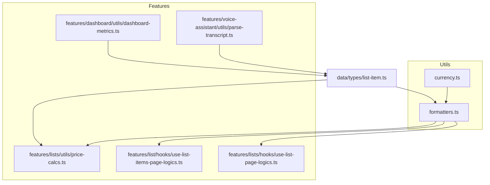
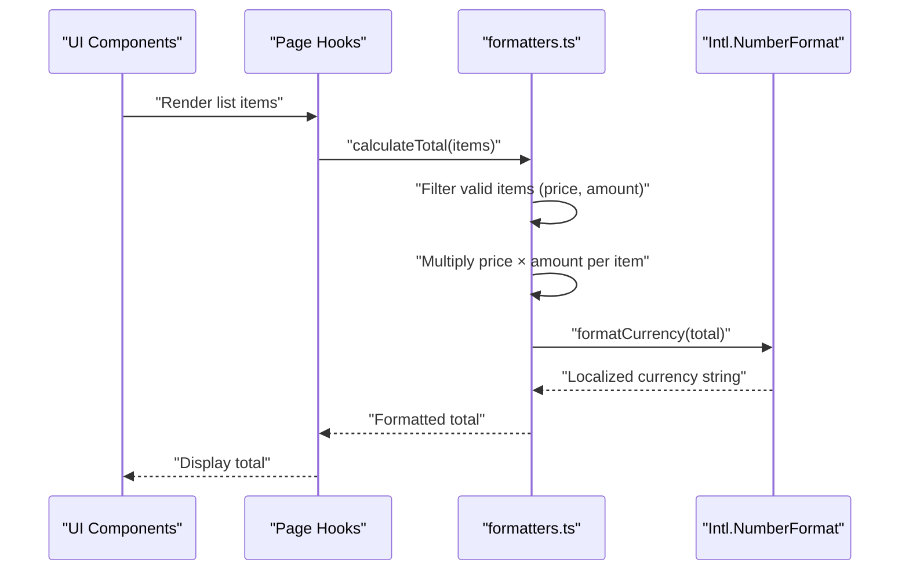
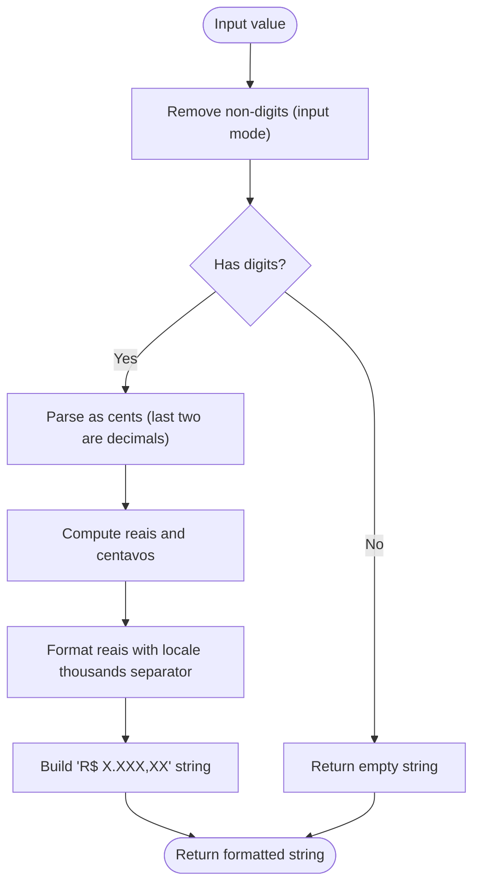
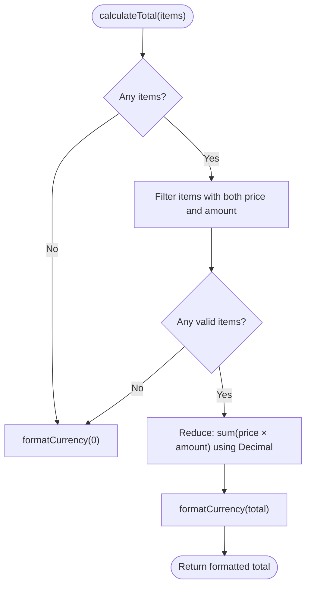
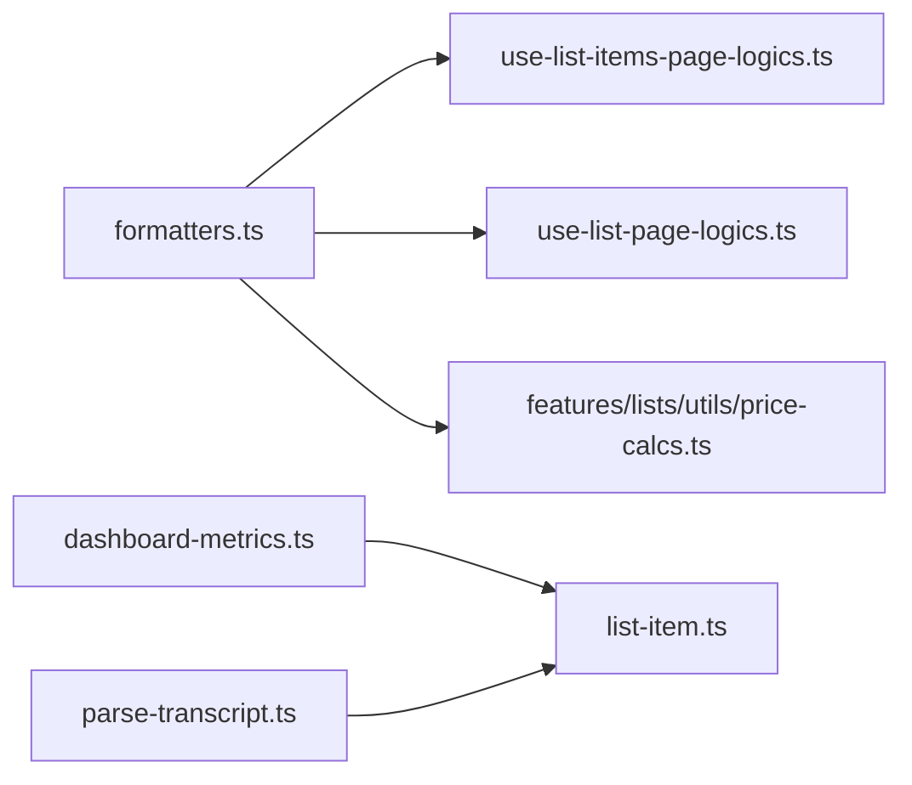
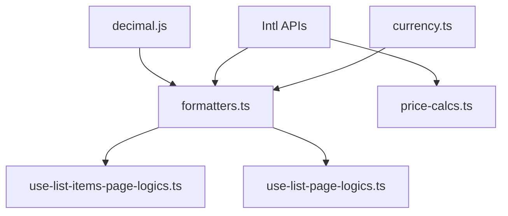

# Formatting Utilities

<cite>
**Referenced Files in This Document**
- [currency.ts](file://src/utils/currency.ts)
- [formatters.ts](file://src/utils/formatters.ts)
- [price-calcs.ts](file://src/features/lists/utils/price-calcs.ts)
- [use-list-items-page-logics.ts](file://src/features/list/hooks/use-list-items-page-logics.ts)
- [use-list-page-logics.ts](file://src/features/lists/hooks/use-list-page-logics.ts)
- [list-item.ts](file://src/data/types/list-item.ts)
- [dashboard-metrics.ts](file://src/features/dashboard/utils/dashboard-metrics.ts)
- [parse-transcript.ts](file://src/features/voice-assistant/utils/parse-transcript.ts)
- [currency.property.test.ts](file://src/utils/__tests__/currency.property.test.ts)
- [formatters.property.test.ts](file://src/utils/__tests__/formatters.property.test.ts)
- [price-calcs.property.test.ts](file://src/features/lists/utils/__tests__/price-calcs.property.test.ts)
</cite>

## Table of Contents
1. [Introduction](#introduction)
2. [Project Structure](#project-structure)
3. [Core Components](#core-components)
4. [Architecture Overview](#architecture-overview)
5. [Detailed Component Analysis](#detailed-component-analysis)
6. [Dependency Analysis](#dependency-analysis)
7. [Performance Considerations](#performance-considerations)
8. [Troubleshooting Guide](#troubleshooting-guide)
9. [Conclusion](#conclusion)

## Introduction
This document explains the formatting utilities in PowerLists with a focus on:
- Currency formatting functions for Brazilian Real (BRL), including locale-specific formatting, decimal precision handling, and currency symbol management
- General formatters utility covering price parsing, amount normalization, totals calculation, and string manipulation
- Formatting patterns, localization support, and internationalization considerations
- Practical usage across price display, totals computation, and UI text
- Performance characteristics, caching strategies, and customization options for locales and formats

## Project Structure
The formatting utilities are organized under the utils module and integrated into features such as lists and dashboards. The primary modules are:
- Currency helpers for BRL display and parsing
- General formatters for price/amount parsing and totals calculation
- Feature-specific utilities that reuse the general formatters
- Tests validating behavior and edge cases

**Diagram sources**
- [currency.ts:1-40](file://src/utils/currency.ts#L1-L40)
- [formatters.ts:1-46](file://src/utils/formatters.ts#L1-L46)
- [price-calcs.ts:1-17](file://src/features/lists/utils/price-calcs.ts#L1-L17)
- [use-list-items-page-logics.ts:1-75](file://src/features/list/hooks/use-list-items-page-logics.ts#L1-L75)
- [use-list-page-logics.ts:1-45](file://src/features/lists/hooks/use-list-page-logics.ts#L1-L45)
- [list-item.ts:1-38](file://src/data/types/list-item.ts#L1-L38)
- [dashboard-metrics.ts:1-53](file://src/features/dashboard/utils/dashboard-metrics.ts#L1-L53)
- [parse-transcript.ts:1-224](file://src/features/voice-assistant/utils/parse-transcript.ts#L1-L224)

**Section sources**
- [currency.ts:1-40](file://src/utils/currency.ts#L1-L40)
- [formatters.ts:1-46](file://src/utils/formatters.ts#L1-L46)
- [price-calcs.ts:1-17](file://src/features/lists/utils/price-calcs.ts#L1-L17)
- [use-list-items-page-logics.ts:1-75](file://src/features/list/hooks/use-list-items-page-logics.ts#L1-L75)
- [use-list-page-logics.ts:1-45](file://src/features/lists/hooks/use-list-page-logics.ts#L1-L45)
- [list-item.ts:1-38](file://src/data/types/list-item.ts#L1-L38)
- [dashboard-metrics.ts:1-53](file://src/features/dashboard/utils/dashboard-metrics.ts#L1-L53)
- [parse-transcript.ts:1-224](file://src/features/voice-assistant/utils/parse-transcript.ts#L1-L224)

## Core Components
- Currency helpers (BRL):
  - Format raw digits into a localized BRL display string
  - Parse a localized BRL string back to a number
  - Convert stored numeric prices to an editable BRL input string
- General formatters:
  - Format numbers to BRL currency via Intl.NumberFormat
  - Parse price strings to normalized numbers with 2 decimals
  - Normalize amounts to integers ≥ 1
  - Compute totals from item lists with Decimal precision

These utilities are used across list pages, totals computation, and dashboard metrics.

**Section sources**
- [currency.ts:1-40](file://src/utils/currency.ts#L1-L40)
- [formatters.ts:1-46](file://src/utils/formatters.ts#L1-L46)
- [price-calcs.ts:1-17](file://src/features/lists/utils/price-calcs.ts#L1-L17)

## Architecture Overview
The formatting architecture centers on reusable utilities that encapsulate locale-specific formatting and robust parsing. The general formatters module exports a shared currency formatter configured for pt-BR/BRL, while the currency module provides BRL-specific helpers for masked input and editing scenarios. Feature modules import these utilities to present consistent, localized formatting.

**Diagram sources**
- [formatters.ts:32-45](file://src/utils/formatters.ts#L32-L45)
- [use-list-items-page-logics.ts:65-75](file://src/features/list/hooks/use-list-items-page-logics.ts#L65-L75)
- [use-list-page-logics.ts:35-45](file://src/features/lists/hooks/use-list-page-logics.ts#L35-L45)

## Detailed Component Analysis

### Currency Helpers (BRL)
The BRL helpers provide:
- Input formatting: converts raw digit strings into a localized BRL display string
- Parsing: converts a localized BRL string back to a number
- Editing conversion: transforms stored numeric prices into an editable BRL input string

Implementation highlights:
- Uses locale-aware number formatting for thousands separators
- Maintains 2-decimal precision implicitly via integer arithmetic in input formatting
- Normalizes currency symbols and separators during parsing

**Diagram sources**
- [currency.ts:6-14](file://src/utils/currency.ts#L6-L14)

Practical usage examples:
- Masking user input for price entry
- Displaying prices in lists and totals
- Converting stored numeric prices back to editable BRL strings

**Section sources**
- [currency.ts:1-40](file://src/utils/currency.ts#L1-L40)

### General Formatters Utility
The general formatters utility provides:
- A shared Intl.NumberFormat instance configured for pt-BR/BRL
- Price parsing with comma-to-period normalization and 2-decimal rounding
- Amount normalization ensuring a minimum of 1
- Total calculation across list items using Decimal for precise arithmetic

**Diagram sources**
- [formatters.ts:32-45](file://src/utils/formatters.ts#L32-L45)

Practical usage examples:
- Computing visible totals in list views
- Formatting list-level totals in hooks
- Ensuring consistent currency formatting across the app

**Section sources**
- [formatters.ts:1-46](file://src/utils/formatters.ts#L1-L46)

### Feature Integrations
- Lists totals:
  - Page logic computes totals for sorted and checked items
  - Hook logic memoizes totals for performance
- Dashboard metrics:
  - Uses Intl.DateTimeFormat for localized date labels
  - Demonstrates locale-specific formatting patterns
- Voice assistant:
  - Parses Portuguese numeric words into quantities for list items
  - Complements formatting by normalizing user input

**Diagram sources**
- [use-list-items-page-logics.ts:65-75](file://src/features/list/hooks/use-list-items-page-logics.ts#L65-L75)
- [use-list-page-logics.ts:35-45](file://src/features/lists/hooks/use-list-page-logics.ts#L35-L45)
- [price-calcs.ts:1-17](file://src/features/lists/utils/price-calcs.ts#L1-L17)
- [dashboard-metrics.ts:43-49](file://src/features/dashboard/utils/dashboard-metrics.ts#L43-L49)
- [list-item.ts:1-38](file://src/data/types/list-item.ts#L1-L38)
- [parse-transcript.ts:194-224](file://src/features/voice-assistant/utils/parse-transcript.ts#L194-L224)

**Section sources**
- [use-list-items-page-logics.ts:1-75](file://src/features/list/hooks/use-list-items-page-logics.ts#L1-L75)
- [use-list-page-logics.ts:1-45](file://src/features/lists/hooks/use-list-page-logics.ts#L1-L45)
- [price-calcs.ts:1-17](file://src/features/lists/utils/price-calcs.ts#L1-L17)
- [dashboard-metrics.ts:1-53](file://src/features/dashboard/utils/dashboard-metrics.ts#L1-L53)
- [parse-transcript.ts:1-224](file://src/features/voice-assistant/utils/parse-transcript.ts#L1-L224)

## Dependency Analysis
- Internal dependencies:
  - currency.ts is independent and can be used standalone
  - formatters.ts depends on Decimal.js for precise arithmetic and exports a shared Intl.NumberFormat instance
  - price-calcs.ts duplicates a local Intl.NumberFormat instance; prefer importing from formatters.ts to reduce duplication
- External dependencies:
  - Decimal.js ensures precise financial calculations
  - Intl APIs provide locale-aware formatting and parsing

**Diagram sources**
- [formatters.ts:1-12](file://src/utils/formatters.ts#L1-L12)
- [price-calcs.ts:1-17](file://src/features/lists/utils/price-calcs.ts#L1-L17)
- [use-list-items-page-logics.ts:1-10](file://src/features/list/hooks/use-list-items-page-logics.ts#L1-L10)
- [use-list-page-logics.ts:1-10](file://src/features/lists/hooks/use-list-page-logics.ts#L1-L10)
- [currency.ts:1-40](file://src/utils/currency.ts#L1-L40)

**Section sources**
- [formatters.ts:1-12](file://src/utils/formatters.ts#L1-L12)
- [price-calcs.ts:1-17](file://src/features/lists/utils/price-calcs.ts#L1-L17)

## Performance Considerations
- Currency formatting:
  - Reuse a single Intl.NumberFormat instance (already done in formatters.ts) to avoid repeated construction overhead
  - Prefer memoization in UI hooks for totals derived from large lists
- Decimal arithmetic:
  - Using Decimal.js prevents floating-point drift in totals; keep this pattern for financial computations
- Parsing:
  - Price parsing normalizes commas to periods and rounds to 2 decimals; ensure inputs are sanitized before parsing
- Localization:
  - Avoid constructing new Intl.NumberFormat instances per render; define once and reuse
- Caching strategies:
  - Cache formatted totals keyed by item arrays to prevent recomputation on shallow updates
  - For date labels in dashboards, cache Intl.DateTimeFormat instances per locale

[No sources needed since this section provides general guidance]

## Troubleshooting Guide
Common issues and resolutions:
- Price parsing returning zero:
  - Ensure input replaces comma with period and handles empty strings
  - Negative values are normalized to zero; validate upstream if negative inputs are invalid
- Amount normalization:
  - Amounts less than 1 are normalized to 1; adjust validation if lower quantities are allowed
- Totals mismatch:
  - Verify that items include both price and amount; only valid pairs contribute to totals
- Locale formatting inconsistencies:
  - Confirm that the locale is pt-BR and currency is BRL across all formatters
- Input mask behavior:
  - For BRL input masks, ensure digits-only processing and correct centavo rounding

Validation references:
- Currency tests confirm round-trip preservation of cents across formatting and parsing
- Formatters tests validate price parsing, amount normalization, and totals against a Decimal oracle
- Price-calcs tests ensure consistent formatting across feature utilities

**Section sources**
- [currency.property.test.ts:1-43](file://src/utils/__tests__/currency.property.test.ts#L1-L43)
- [formatters.property.test.ts:1-88](file://src/utils/__tests__/formatters.property.test.ts#L1-L88)
- [price-calcs.property.test.ts:42-92](file://src/features/lists/utils/__tests__/price-calcs.property.test.ts#L42-L92)

## Conclusion
PowerLists’ formatting utilities provide a cohesive, locale-aware foundation for currency display and financial computations. By centralizing formatting logic and leveraging Decimal.js for precision, the system ensures correctness and maintainability. Integrations across list pages, totals computation, and dashboard metrics demonstrate consistent usage patterns. For future enhancements, consider consolidating duplicate Intl.NumberFormat instances and expanding locale support through configurable formatters.