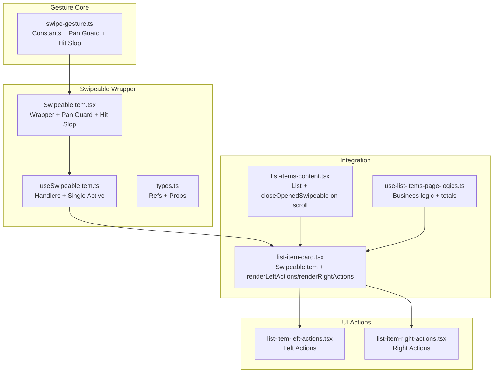
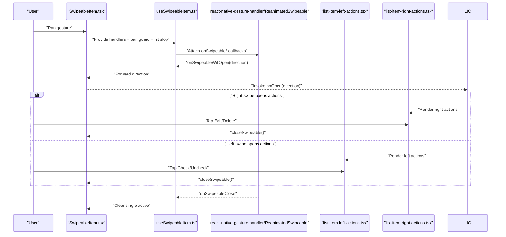
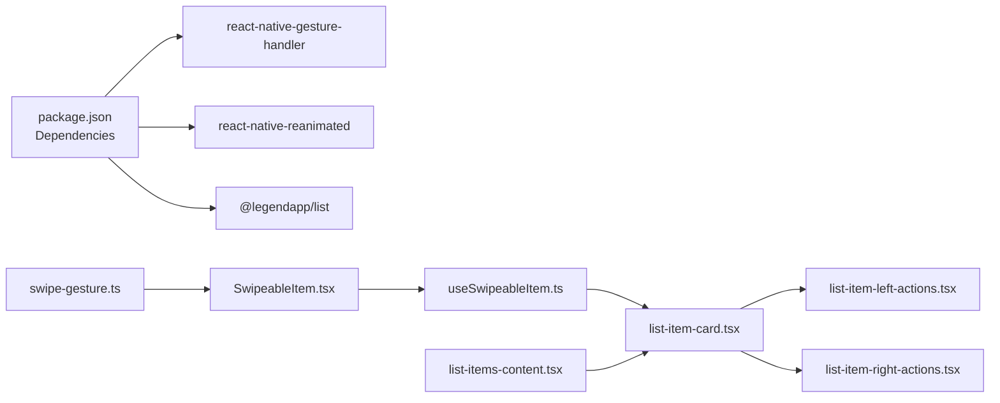

# Gesture Handling

<cite>
**Referenced Files in This Document**
- [swipe-gesture.ts](file://src/lib/swipe-gesture.ts)
- [SwipeableItem.tsx](file://src/components/swipeable/SwipeableItem.tsx)
- [useSwipeableItem.ts](file://src/components/swipeable/useSwipeableItem.ts)
- [types.ts](file://src/components/swipeable/types.ts)
- [index.tsx](file://src/components/swipeable/index.tsx)
- [list-item-card.tsx](file://src/features/list/components/list-item-card.tsx)
- [list-item-left-actions.tsx](file://src/features/list/components/list-item-left-actions.tsx)
- [list-item-right-actions.tsx](file://src/features/list/components/list-item-right-actions.tsx)
- [list-items-content.tsx](file://src/features/list/components/list-items-content.tsx)
- [use-list-items-page-logics.ts](file://src/features/list/hooks/use-list-items-page-logics.ts)
- [package.json](file://package.json)
</cite>

## Table of Contents
1. [Introduction](#introduction)
2. [Project Structure](#project-structure)
3. [Core Components](#core-components)
4. [Architecture Overview](#architecture-overview)
5. [Detailed Component Analysis](#detailed-component-analysis)
6. [Dependency Analysis](#dependency-analysis)
7. [Performance Considerations](#performance-considerations)
8. [Troubleshooting Guide](#troubleshooting-guide)
9. [Conclusion](#conclusion)
10. [Appendices](#appendices)

## Introduction
This document explains the gesture handling system for swipe interactions in PowerLists. It covers the swipe gesture detection implementation, sensitivity thresholds, platform-specific hit slop behavior, configuration options, callback handlers, lifecycle events, and integration with UI components. It also provides guidance on performance optimization, cross-platform compatibility, accessibility considerations, and customization options for different gesture behaviors.

## Project Structure
The gesture system is composed of:
- A shared gesture configuration module that defines sensitivity thresholds and platform-specific hit slop calculations.
- A composable SwipeableItem wrapper around the underlying gesture library’s swipeable component.
- A hook that manages open/close callbacks and ensures single active swipe at a time.
- UI components that render actionable surfaces for left/right swipe gestures.
- Integration points inside list items and list containers to coordinate gesture behavior and performance.

**Diagram sources**
- [swipe-gesture.ts:1-29](file://src/lib/swipe-gesture.ts#L1-L29)
- [SwipeableItem.tsx:1-39](file://src/components/swipeable/SwipeableItem.tsx#L1-L39)
- [useSwipeableItem.ts:1-64](file://src/components/swipeable/useSwipeableItem.ts#L1-L64)
- [types.ts:1-39](file://src/components/swipeable/types.ts#L1-L39)
- [list-item-card.tsx:1-142](file://src/features/list/components/list-item-card.tsx#L1-L142)
- [list-item-left-actions.tsx:1-51](file://src/features/list/components/list-item-left-actions.tsx#L1-L51)
- [list-item-right-actions.tsx:1-54](file://src/features/list/components/list-item-right-actions.tsx#L1-L54)
- [list-items-content.tsx:1-57](file://src/features/list/components/list-items-content.tsx#L1-L57)
- [use-list-items-page-logics.ts:1-124](file://src/features/list/hooks/use-list-items-page-logics.ts#L1-L124)

**Section sources**
- [swipe-gesture.ts:1-29](file://src/lib/swipe-gesture.ts#L1-L29)
- [SwipeableItem.tsx:1-39](file://src/components/swipeable/SwipeableItem.tsx#L1-L39)
- [useSwipeableItem.ts:1-64](file://src/components/swipeable/useSwipeableItem.ts#L1-L64)
- [types.ts:1-39](file://src/components/swipeable/types.ts#L1-L39)
- [list-item-card.tsx:1-142](file://src/features/list/components/list-item-card.tsx#L1-L142)
- [list-item-left-actions.tsx:1-51](file://src/features/list/components/list-item-left-actions.tsx#L1-L51)
- [list-item-right-actions.tsx:1-54](file://src/features/list/components/list-item-right-actions.tsx#L1-L54)
- [list-items-content.tsx:1-57](file://src/features/list/components/list-items-content.tsx#L1-L57)
- [use-list-items-page-logics.ts:1-124](file://src/features/list/hooks/use-list-items-page-logics.ts#L1-L124)

## Core Components
- Gesture configuration constants and helpers define:
  - Active horizontal offset range to accept a pan as a swipe.
  - Vertical offset threshold to fail a pan if vertical drift exceeds it.
  - Minimum pan distance to avoid accidental triggers.
  - Platform-specific hit slop calculation for touch acceptance near edges.
- SwipeableItem wraps the gesture library’s swipeable component, applies the pan guard, and injects hit slop and handler callbacks.
- useSwipeableItem centralizes open/close callbacks and enforces a single active swipe at a time.
- UI action components render left/right panels for swipe actions and coordinate closing the swipeable after an action.

Key responsibilities:
- Sensitivity thresholds and hit slop ensure reliable gesture recognition across devices.
- Callback handlers expose open/close lifecycle events and directionality.
- Integration with list items and lists ensures consistent behavior during scrolling and multi-item interactions.

**Section sources**
- [swipe-gesture.ts:4-26](file://src/lib/swipe-gesture.ts#L4-L26)
- [SwipeableItem.tsx:10-38](file://src/components/swipeable/SwipeableItem.tsx#L10-L38)
- [useSwipeableItem.ts:6-56](file://src/components/swipeable/useSwipeableItem.ts#L6-L56)
- [types.ts:10-38](file://src/components/swipeable/types.ts#L10-L38)

## Architecture Overview
The gesture pipeline integrates low-level gesture configuration with UI components and list containers:

**Diagram sources**
- [SwipeableItem.tsx:10-38](file://src/components/swipeable/SwipeableItem.tsx#L10-L38)
- [useSwipeableItem.ts:11-37](file://src/components/swipeable/useSwipeableItem.ts#L11-L37)
- [list-item-card.tsx:42-50](file://src/features/list/components/list-item-card.tsx#L42-L50)
- [list-item-left-actions.tsx:25-28](file://src/features/list/components/list-item-left-actions.tsx#L25-L28)
- [list-item-right-actions.tsx:22-30](file://src/features/list/components/list-item-right-actions.tsx#L22-L30)

## Detailed Component Analysis

### Gesture Configuration Module
- Defines:
  - Horizontal active offset window to accept a pan as a swipe.
  - Vertical fail offset to reject swipes with significant vertical drift.
  - Minimum pan distance to reduce accidental triggers.
  - Platform-specific hit slop ratios for Android and iOS to adjust touch acceptance near the left edge.
- Provides:
  - A reusable pan gesture guard configured with the above thresholds.
  - A function to compute hit slop based on screen width or a provided width value.

Implementation highlights:
- Uses platform selection to apply different hit slop ratios per OS.
- Exposes a memoized hit slop derived from window width to adapt to orientation changes.

**Section sources**
- [swipe-gesture.ts:4-26](file://src/lib/swipe-gesture.ts#L4-L26)

### SwipeableItem Wrapper
- Wraps the gesture library’s swipeable component.
- Computes a pan guard and hit slop once per mount and updates on dimension changes.
- Exposes imperative close method via a ref.
- Passes gesture handlers and configuration to the underlying swipeable.

Integration points:
- Receives onOpen/onClose callbacks from parent components.
- Applies simultaneous gesture support via the pan guard to coordinate with other pan gestures.

**Section sources**
- [SwipeableItem.tsx:10-38](file://src/components/swipeable/SwipeableItem.tsx#L10-L38)
- [types.ts:30-38](file://src/components/swipeable/types.ts#L30-L38)

### useSwipeableItem Hook
- Manages the single-active-swipe pattern:
  - Closes any previously opened swipeable when a new one opens.
  - Tracks the currently opened instance to clear state on unmount.
- Exposes handlers for:
  - onSwipeableWillOpen: early stage before animation starts.
  - onSwipeableOpen: after opening completes, with direction.
  - onSwipeableWillClose/onSwipeableClose: cleanup and notifications.
- Provides a static utility to close the currently opened swipeable.

**Section sources**
- [useSwipeableItem.ts:6-56](file://src/components/swipeable/useSwipeableItem.ts#L6-L56)
- [useSwipeableItem.ts:58-63](file://src/components/swipeable/useSwipeableItem.ts#L58-L63)

### UI Action Panels
- Left actions panel:
  - Presents a primary action (e.g., mark/unmark) with an optional status indicator.
  - Closes the swipeable before invoking the action.
- Right actions panel:
  - Presents secondary actions (e.g., edit/delete) with distinct variants.
  - Closes the swipeable before invoking the action.

These panels are rendered conditionally by the list item card depending on the swipe direction and item state.

**Section sources**
- [list-item-left-actions.tsx:18-48](file://src/features/list/components/list-item-left-actions.tsx#L18-L48)
- [list-item-right-actions.tsx:16-51](file://src/features/list/components/list-item-right-actions.tsx#L16-L51)

### List Item Card Integration
- Renders a SwipeableItem with:
  - Friction, threshold, drag offsets, and overshoot settings for smooth animations.
  - Direction-aware rendering of left/right actions.
  - On-open logic to auto-execute a left-swipe action (e.g., toggle check) while preventing conflicts with other open swipeables.
- Uses memoization to avoid unnecessary re-renders.

**Section sources**
- [list-item-card.tsx:77-127](file://src/features/list/components/list-item-card.tsx#L77-L127)
- [list-item-card.tsx:130-139](file://src/features/list/components/list-item-card.tsx#L130-L139)

### List Container Coordination
- The list container closes any open swipeable when scrolling begins, preventing accidental interactions during rapid scrolling.
- Uses a virtualized list with estimated item sizes and draw distances to optimize rendering performance.

**Section sources**
- [list-items-content.tsx:20-54](file://src/features/list/components/list-items-content.tsx#L20-L54)

### Business Logic and Navigation Patterns
- The page logic orchestrates list data, sorting, filtering, and totals.
- Navigation patterns integrate with swipe actions (e.g., opening assistant) but are separate from gesture handling.

**Section sources**
- [use-list-items-page-logics.ts:14-123](file://src/features/list/hooks/use-list-items-page-logics.ts#L14-L123)

## Dependency Analysis
- External libraries:
  - react-native-gesture-handler and react-native-reanimated provide the gesture engine and animated swipeable component.
  - @legendapp/list provides a performant virtualized list used in the items container.
- Internal dependencies:
  - The swipeable wrapper depends on the gesture configuration module.
  - UI action panels depend on the list item card, which depends on the swipeable wrapper.

**Diagram sources**
- [package.json:72-88](file://package.json#L72-L88)
- [swipe-gesture.ts:1-2](file://src/lib/swipe-gesture.ts#L1-L2)
- [SwipeableItem.tsx:3-8](file://src/components/swipeable/SwipeableItem.tsx#L3-L8)
- [useSwipeableItem.ts:1-2](file://src/components/swipeable/useSwipeableItem.ts#L1-L2)
- [list-item-card.tsx:1-9](file://src/features/list/components/list-item-card.tsx#L1-L9)
- [list-item-left-actions.tsx:1-8](file://src/features/list/components/list-item-left-actions.tsx#L1-L8)
- [list-item-right-actions.tsx:1-8](file://src/features/list/components/list-item-right-actions.tsx#L1-L8)
- [list-items-content.tsx:1-5](file://src/features/list/components/list-items-content.tsx#L1-L5)

**Section sources**
- [package.json:72-88](file://package.json#L72-L88)
- [swipe-gesture.ts:1-2](file://src/lib/swipe-gesture.ts#L1-L2)
- [SwipeableItem.tsx:3-8](file://src/components/swipeable/SwipeableItem.tsx#L3-L8)
- [useSwipeableItem.ts:1-2](file://src/components/swipeable/useSwipeableItem.ts#L1-L2)
- [list-item-card.tsx:1-9](file://src/features/list/components/list-item-card.tsx#L1-L9)
- [list-item-left-actions.tsx:1-8](file://src/features/list/components/list-item-left-actions.tsx#L1-L8)
- [list-item-right-actions.tsx:1-8](file://src/features/list/components/list-item-right-actions.tsx#L1-L8)
- [list-items-content.tsx:1-5](file://src/features/list/components/list-items-content.tsx#L1-L5)

## Performance Considerations
- Virtualized list rendering:
  - The list container uses estimated item sizes and draw distances to minimize layout work and improve scroll performance.
- Memoization:
  - List item components and swipeable handlers leverage memoization to avoid unnecessary re-renders.
- Gesture thresholds:
  - Minimum distance and fail offsets reduce accidental gesture triggers, decreasing wasted computation.
- Single active swipe:
  - Ensures only one swipeable is open at a time, reducing layout thrash and animation conflicts.
- Imperative close on scroll:
  - Closing open swipeables on scroll prevents stale UI states and reduces memory pressure.

Recommendations:
- Keep action panels lightweight and avoid heavy computations in render callbacks.
- Tune thresholds and overshoot parameters per device characteristics if needed.
- Monitor gesture conflicts in dense lists and consider adjusting thresholds or adding explicit gesture prioritization.

**Section sources**
- [list-items-content.tsx:17-18](file://src/features/list/components/list-items-content.tsx#L17-L18)
- [list-item-card.tsx:130-139](file://src/features/list/components/list-item-card.tsx#L130-L139)
- [useSwipeableItem.ts:6-16](file://src/components/swipeable/useSwipeableItem.ts#L6-L16)

## Troubleshooting Guide
Common issues and resolutions:
- Gesture not triggering:
  - Verify minimum distance and active offset thresholds are appropriate for the device density.
  - Confirm hit slop is calculated for the current window width and platform.
- Accidental triggers:
  - Increase minimum distance or tighten active/fail offsets.
  - Ensure vertical drift does not exceed the fail offset threshold.
- Conflicting gestures:
  - Use the pan guard to coordinate with external gestures.
  - Ensure only one swipeable is open at a time; use the provided utility to close the current swipeable.
- Actions not firing:
  - Confirm that action panels call the close function before executing their callbacks.
  - Ensure onOpen logic does not immediately close the swipeable when the intended action is to keep it open.

**Section sources**
- [swipe-gesture.ts:10-14](file://src/lib/swipe-gesture.ts#L10-L14)
- [SwipeableItem.tsx:16-17](file://src/components/swipeable/SwipeableItem.tsx#L16-L17)
- [useSwipeableItem.ts:58-63](file://src/components/swipeable/useSwipeableItem.ts#L58-L63)
- [list-item-left-actions.tsx:25-28](file://src/features/list/components/list-item-left-actions.tsx#L25-L28)
- [list-item-right-actions.tsx:22-30](file://src/features/list/components/list-item-right-actions.tsx#L22-L30)

## Conclusion
The gesture handling system in PowerLists combines platform-aware thresholds, a robust pan guard, and a single-active-swipe policy to deliver reliable swipe interactions. The modular design enables easy customization of thresholds, overshoot behavior, and action panels while maintaining performance through memoization and virtualized rendering. The integration with list items and containers ensures consistent behavior across navigation and interactive elements.

## Appendices

### Cross-Platform Compatibility
- Platform-specific hit slop ratios are applied automatically to align with platform touch target expectations.
- The pan guard and gesture thresholds are tuned to reduce false positives on both Android and iOS.

**Section sources**
- [swipe-gesture.ts:16-26](file://src/lib/swipe-gesture.ts#L16-L26)

### Accessibility Considerations
- Prefer keyboard or voice commands for users who cannot perform swipe gestures.
- Ensure action buttons in left/right panels are reachable and clearly labeled.
- Provide visual feedback for swipeable state transitions.
- Avoid relying solely on swipe gestures for critical actions; offer alternative controls.

[No sources needed since this section provides general guidance]

### Customization Options
- Thresholds and overshoot:
  - Adjust friction, thresholds, drag offsets, and overshoot settings in the list item card to fine-tune feel.
- Gesture sensitivity:
  - Modify minimum distance and active/fail offsets in the gesture configuration module.
- Action panels:
  - Extend left/right action panels with additional actions or icons as needed.
- Lifecycle callbacks:
  - Use onOpen/onClose to trigger analytics, animations, or state changes.

**Section sources**
- [list-item-card.tsx:78-90](file://src/features/list/components/list-item-card.tsx#L78-L90)
- [swipe-gesture.ts:4-14](file://src/lib/swipe-gesture.ts#L4-L14)
- [list-item-left-actions.tsx:18-48](file://src/features/list/components/list-item-left-actions.tsx#L18-L48)
- [list-item-right-actions.tsx:16-51](file://src/features/list/components/list-item-right-actions.tsx#L16-L51)