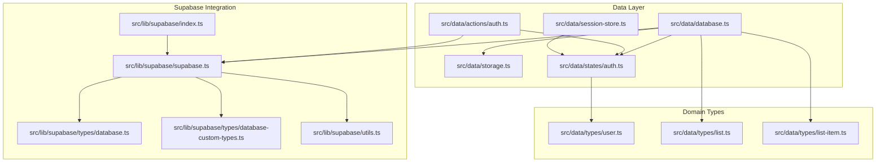
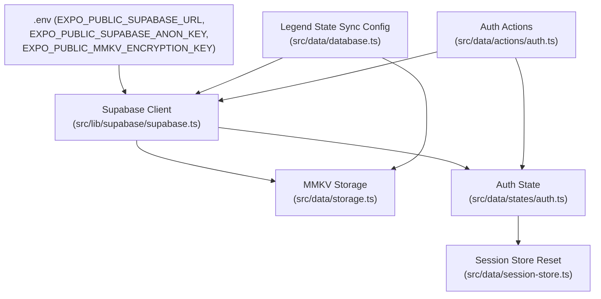
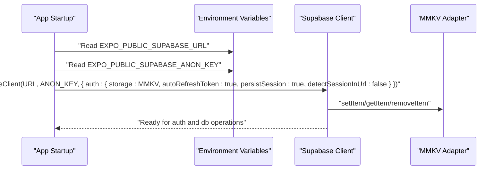
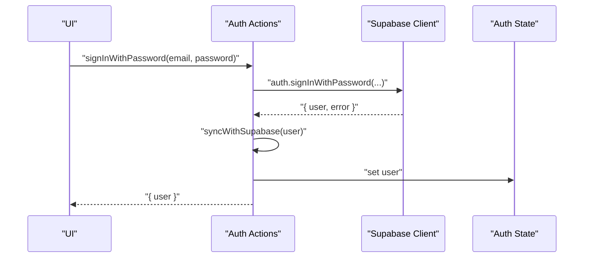
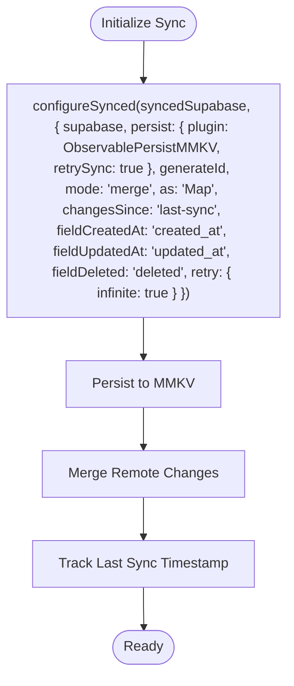
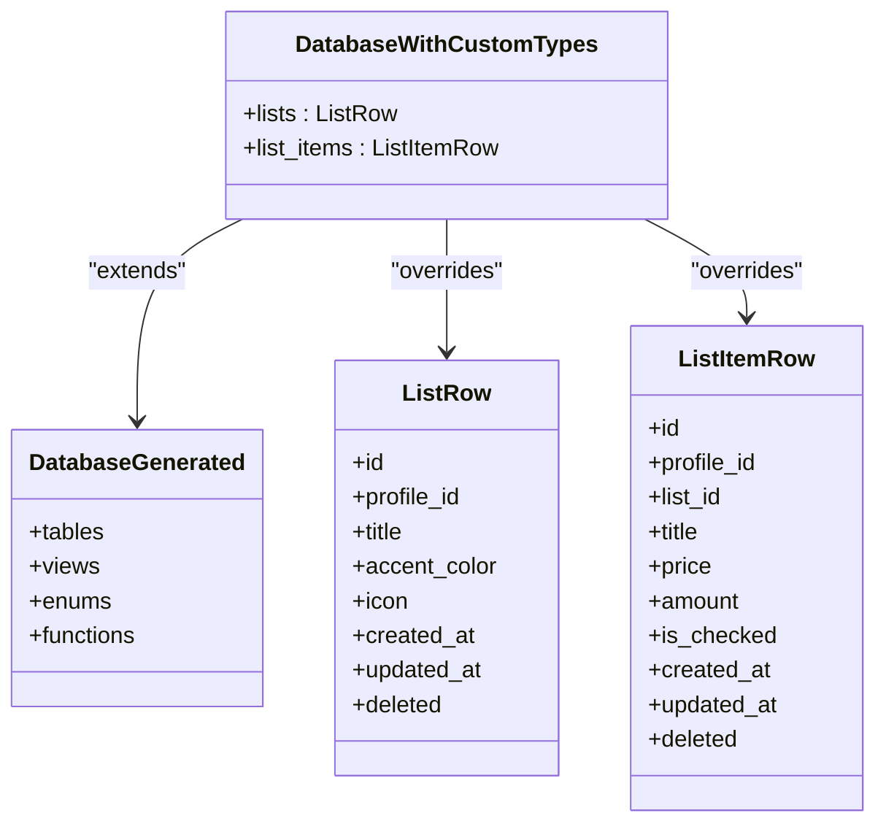
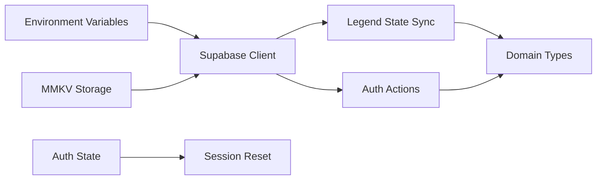

# Integration Libraries

<cite>
**Referenced Files in This Document**
- [src/lib/supabase/supabase.ts](file://src/lib/supabase/supabase.ts)
- [src/lib/supabase/index.ts](file://src/lib/supabase/index.ts)
- [src/lib/supabase/utils.ts](file://src/lib/supabase/utils.ts)
- [src/lib/supabase/types/database.ts](file://src/lib/supabase/types/database.ts)
- [src/lib/supabase/types/database-custom-types.ts](file://src/lib/supabase/types/database-custom-types.ts)
- [src/data/database.ts](file://src/data/database.ts)
- [src/data/storage.ts](file://src/data/storage.ts)
- [src/data/session-store.ts](file://src/data/session-store.ts)
- [src/data/actions/auth.ts](file://src/data/actions/auth.ts)
- [src/data/states/auth.ts](file://src/data/states/auth.ts)
- [src/data/types/user.ts](file://src/data/types/user.ts)
- [src/data/types/list.ts](file://src/data/types/list.ts)
- [src/data/types/list-item.ts](file://src/data/types/list-item.ts)
</cite>

## Table of Contents
1. [Introduction](#introduction)
2. [Project Structure](#project-structure)
3. [Core Components](#core-components)
4. [Architecture Overview](#architecture-overview)
5. [Detailed Component Analysis](#detailed-component-analysis)
6. [Dependency Analysis](#dependency-analysis)
7. [Performance Considerations](#performance-considerations)
8. [Troubleshooting Guide](#troubleshooting-guide)
9. [Conclusion](#conclusion)

## Introduction
This document describes the integration libraries powering PowerLists, with a primary focus on the Supabase integration. It explains how the Supabase client is initialized, configured, and used for authentication and database operations. It also documents the synchronization layer, offline persistence, and the type-safe database schema integration. The guide covers initialization, configuration options, environment-specific settings, authentication flows, database queries, real-time subscription patterns, error handling, security considerations, performance optimization, and troubleshooting.

## Project Structure
The integration libraries are organized under a dedicated module that encapsulates Supabase client creation, type definitions, and utilities. Supporting data-layer modules handle synchronization, persistence, and session management.

**Diagram sources**
- [src/lib/supabase/supabase.ts:1-29](file://src/lib/supabase/supabase.ts#L1-L29)
- [src/lib/supabase/types/database.ts:1-810](file://src/lib/supabase/types/database.ts#L1-L810)
- [src/lib/supabase/types/database-custom-types.ts:1-47](file://src/lib/supabase/types/database-custom-types.ts#L1-L47)
- [src/lib/supabase/utils.ts:1-10](file://src/lib/supabase/utils.ts#L1-L10)
- [src/lib/supabase/index.ts:1-4](file://src/lib/supabase/index.ts#L1-L4)
- [src/data/database.ts:1-36](file://src/data/database.ts#L1-L36)
- [src/data/storage.ts:1-74](file://src/data/storage.ts#L1-L74)
- [src/data/session-store.ts:1-24](file://src/data/session-store.ts#L1-L24)
- [src/data/actions/auth.ts:1-138](file://src/data/actions/auth.ts#L1-L138)
- [src/data/states/auth.ts:1-34](file://src/data/states/auth.ts#L1-L34)
- [src/data/types/user.ts:1-44](file://src/data/types/user.ts#L1-L44)
- [src/data/types/list.ts:1-41](file://src/data/types/list.ts#L1-L41)
- [src/data/types/list-item.ts:1-38](file://src/data/types/list-item.ts#L1-L38)

**Section sources**
- [src/lib/supabase/supabase.ts:1-29](file://src/lib/supabase/supabase.ts#L1-L29)
- [src/lib/supabase/index.ts:1-4](file://src/lib/supabase/index.ts#L1-L4)
- [src/data/database.ts:1-36](file://src/data/database.ts#L1-L36)
- [src/data/storage.ts:1-74](file://src/data/storage.ts#L1-L74)
- [src/data/session-store.ts:1-24](file://src/data/session-store.ts#L1-L24)
- [src/data/actions/auth.ts:1-138](file://src/data/actions/auth.ts#L1-L138)
- [src/data/states/auth.ts:1-34](file://src/data/states/auth.ts#L1-L34)
- [src/lib/supabase/types/database.ts:1-810](file://src/lib/supabase/types/database.ts#L1-L810)
- [src/lib/supabase/types/database-custom-types.ts:1-47](file://src/lib/supabase/types/database-custom-types.ts#L1-L47)
- [src/data/types/user.ts:1-44](file://src/data/types/user.ts#L1-L44)
- [src/data/types/list.ts:1-41](file://src/data/types/list.ts#L1-L41)
- [src/data/types/list-item.ts:1-38](file://src/data/types/list-item.ts#L1-L38)

## Core Components
- Supabase client initialization and configuration with environment variables and MMKV-backed auth storage adapter.
- Type-safe database schema integration with custom row types for improved developer experience.
- Synchronized state and offline persistence via Legend State and MMKV.
- Authentication actions and state management with guest support and session cleanup.
- Utilities for key conversion between camelCase and snake_case to align with Supabase conventions.

**Section sources**
- [src/lib/supabase/supabase.ts:1-29](file://src/lib/supabase/supabase.ts#L1-L29)
- [src/lib/supabase/types/database.ts:1-810](file://src/lib/supabase/types/database.ts#L1-L810)
- [src/lib/supabase/types/database-custom-types.ts:1-47](file://src/lib/supabase/types/database-custom-types.ts#L1-L47)
- [src/data/database.ts:1-36](file://src/data/database.ts#L1-L36)
- [src/data/storage.ts:1-74](file://src/data/storage.ts#L1-L74)
- [src/data/actions/auth.ts:1-138](file://src/data/actions/auth.ts#L1-L138)
- [src/data/states/auth.ts:1-34](file://src/data/states/auth.ts#L1-L34)
- [src/lib/supabase/utils.ts:1-10](file://src/lib/supabase/utils.ts#L1-L10)

## Architecture Overview
The Supabase integration sits at the foundation of the data layer. The Supabase client is configured with environment variables and an MMKV-backed storage adapter for auth persistence. The data layer uses Legend State to synchronize local state with remote data, persisting to MMKV for offline readiness. Authentication state is managed separately and drives session lifecycle and store resets.

**Diagram sources**
- [src/lib/supabase/supabase.ts:6-28](file://src/lib/supabase/supabase.ts#L6-L28)
- [src/data/storage.ts:10-23](file://src/data/storage.ts#L10-L23)
- [src/data/states/auth.ts:22-33](file://src/data/states/auth.ts#L22-L33)
- [src/data/database.ts:13-29](file://src/data/database.ts#L13-L29)
- [src/data/actions/auth.ts:16-133](file://src/data/actions/auth.ts#L16-L133)
- [src/data/session-store.ts:10-22](file://src/data/session-store.ts#L10-L22)

## Detailed Component Analysis

### Supabase Client Initialization and Configuration
- Environment variables:
  - EXPO_PUBLIC_SUPABASE_URL: Supabase project URL.
  - EXPO_PUBLIC_SUPABASE_ANON_KEY: Supabase anonymous/public API key.
  - EXPO_PUBLIC_MMKV_ENCRYPTION_KEY: Optional encryption key for MMKV storage.
- Auth configuration:
  - Uses MMKV adapter for storing session data.
  - Auto-refreshes tokens and persists sessions.
  - Disables URL session detection for safer routing.
- Key conversion utilities:
  - Converts between camelCase and snake_case to match Supabase column naming.

**Diagram sources**
- [src/lib/supabase/supabase.ts:6-28](file://src/lib/supabase/supabase.ts#L6-L28)
- [src/data/storage.ts:10-23](file://src/data/storage.ts#L10-L23)

**Section sources**
- [src/lib/supabase/supabase.ts:1-29](file://src/lib/supabase/supabase.ts#L1-L29)
- [src/data/storage.ts:1-74](file://src/data/storage.ts#L1-L74)
- [src/lib/supabase/utils.ts:1-10](file://src/lib/supabase/utils.ts#L1-L10)

### Authentication Handling
- Fetch or restore user:
  - Attempts to read cached user; otherwise calls getUser() and sets state.
- Sign up:
  - Creates a new user with email/password; marks as non-guest and synchronizes.
- Sign in:
  - Authenticates with email/password and synchronizes with backend.
- Patch user:
  - Updates local state and, if applicable, updates the email in Supabase.
- Sync with Supabase:
  - Ensures local user reflects backend state and marks as non-guest.
- Guest user:
  - Creates a temporary guest user with a generated ID.
- Sign out:
  - Signs out from Supabase, clears auth state, and resets related stores.

**Diagram sources**
- [src/data/actions/auth.ts:99-110](file://src/data/actions/auth.ts#L99-L110)
- [src/data/actions/auth.ts:72-97](file://src/data/actions/auth.ts#L72-L97)
- [src/data/states/auth.ts:22-33](file://src/data/states/auth.ts#L22-L33)

**Section sources**
- [src/data/actions/auth.ts:1-138](file://src/data/actions/auth.ts#L1-L138)
- [src/data/states/auth.ts:1-34](file://src/data/states/auth.ts#L1-L34)
- [src/data/types/user.ts:1-44](file://src/data/types/user.ts#L1-L44)

### Database Operations and Synchronization
- Legend State synced configuration:
  - Integrates with Supabase via a synced plugin.
  - Persists to MMKV with retry on sync failures.
  - Generates IDs locally and merges changes.
  - Tracks timestamps and deletion flags.
- Session-scoped store reset:
  - Watches for user ID changes and resets lists, list items, and profiles to ensure data isolation per session.

**Diagram sources**
- [src/data/database.ts:13-29](file://src/data/database.ts#L13-L29)

**Section sources**
- [src/data/database.ts:1-36](file://src/data/database.ts#L1-L36)
- [src/data/session-store.ts:1-24](file://src/data/session-store.ts#L1-L24)

### Type-Safe Database Schema
- Generated types define the full schema for public and storage tables, views, enums, and functions.
- Custom row types override generated types for lists and list_items to enforce consistent field names and shapes.
- Exported helpers for tables, inserts, updates, enums, and composite types simplify typed queries.

**Diagram sources**
- [src/lib/supabase/types/database.ts:34-174](file://src/lib/supabase/types/database.ts#L34-L174)
- [src/lib/supabase/types/database-custom-types.ts:7-46](file://src/lib/supabase/types/database-custom-types.ts#L7-L46)

**Section sources**
- [src/lib/supabase/types/database.ts:1-810](file://src/lib/supabase/types/database.ts#L1-L810)
- [src/lib/supabase/types/database-custom-types.ts:1-47](file://src/lib/supabase/types/database-custom-types.ts#L1-L47)

### Real-Time Subscriptions and Offline Persistence
- Supabase client supports real-time subscriptions via PostgREST and Supabase Realtime.
- Legend State synchronized configuration enables offline-first behavior with automatic retries and merge strategies.
- MMKV persistence ensures data remains available across app restarts and network outages.

Note: Subscription setup and usage are performed through the Supabase client and Legend State plugins. Consult the Supabase documentation for channel management and event handling specifics.

[No sources needed since this section provides general guidance]

### Security Considerations
- Environment variables:
  - Keep Supabase credentials out of client-side code by using EXPO_PUBLIC_* prefixed variables for client-side consumption.
  - Use EXPO_PUBLIC_MMKV_ENCRYPTION_KEY to encrypt sensitive local storage.
- Token handling:
  - Auto-refresh tokens and persistent sessions improve UX while maintaining security.
  - Disable URL session detection to avoid accidental token extraction from URLs.
- Guest users:
  - Limit capabilities for guest users and migrate to authenticated accounts when possible.

**Section sources**
- [src/lib/supabase/supabase.ts:6-28](file://src/lib/supabase/supabase.ts#L6-L28)
- [src/data/storage.ts:10-23](file://src/data/storage.ts#L10-L23)
- [src/data/actions/auth.ts:112-125](file://src/data/actions/auth.ts#L112-L125)

## Dependency Analysis
The integration libraries exhibit low coupling and high cohesion:
- Supabase client depends on environment variables and MMKV storage.
- Data synchronization depends on the Supabase client and Legend State.
- Authentication actions depend on Supabase auth and update the auth state.
- Session store reset depends on auth state changes.

**Diagram sources**
- [src/lib/supabase/supabase.ts:6-28](file://src/lib/supabase/supabase.ts#L6-L28)
- [src/data/storage.ts:10-23](file://src/data/storage.ts#L10-L23)
- [src/data/database.ts:13-29](file://src/data/database.ts#L13-L29)
- [src/data/actions/auth.ts:16-133](file://src/data/actions/auth.ts#L16-L133)
- [src/data/states/auth.ts:22-33](file://src/data/states/auth.ts#L22-L33)
- [src/data/session-store.ts:10-22](file://src/data/session-store.ts#L10-L22)

**Section sources**
- [src/lib/supabase/supabase.ts:1-29](file://src/lib/supabase/supabase.ts#L1-L29)
- [src/data/database.ts:1-36](file://src/data/database.ts#L1-L36)
- [src/data/actions/auth.ts:1-138](file://src/data/actions/auth.ts#L1-L138)
- [src/data/states/auth.ts:1-34](file://src/data/states/auth.ts#L1-L34)
- [src/data/session-store.ts:1-24](file://src/data/session-store.ts#L1-L24)
- [src/data/storage.ts:1-74](file://src/data/storage.ts#L1-L74)

## Performance Considerations
- Use merge mode and change tracking to minimize redundant writes during synchronization.
- Enable retry with infinite attempts for transient network failures.
- Persist to MMKV to reduce cold-start latency and avoid repeated network calls.
- Convert keys efficiently to avoid unnecessary transformations in hot paths.
- Prefer batched operations and limit real-time subscriptions to necessary channels.

[No sources needed since this section provides general guidance]

## Troubleshooting Guide
Common issues and resolutions:
- Missing environment variables:
  - Ensure EXPO_PUBLIC_SUPABASE_URL and EXPO_PUBLIC_SUPABASE_ANON_KEY are present.
  - Verify encryption key for MMKV if enabled.
- Authentication errors:
  - Check handleError usage to extract meaningful messages from AuthError instances.
  - Confirm sign-out clears local state and resets stores.
- Synchronization failures:
  - Review retry configuration and last-sync tracking.
  - Validate field names for created_at, updated_at, and deleted flags.
- Guest user limitations:
  - Migrate guest users to authenticated accounts to unlock full functionality.

**Section sources**
- [src/lib/supabase/supabase.ts:6-28](file://src/lib/supabase/supabase.ts#L6-L28)
- [src/data/actions/auth.ts:135-137](file://src/data/actions/auth.ts#L135-L137)
- [src/data/actions/auth.ts:127-133](file://src/data/actions/auth.ts#L127-L133)
- [src/data/database.ts:26-28](file://src/data/database.ts#L26-L28)
- [src/data/storage.ts:10-23](file://src/data/storage.ts#L10-L23)

## Conclusion
The Supabase integration in PowerLists is designed for reliability, type safety, and offline-first behavior. By combining a well-configured Supabase client, MMKV-backed persistence, Legend State synchronization, and robust authentication actions, the system delivers a seamless user experience across online and offline scenarios. Adhering to the security and performance recommendations outlined here will help maintain a secure and responsive application.