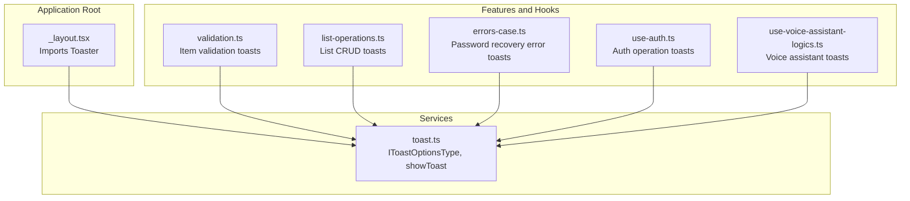
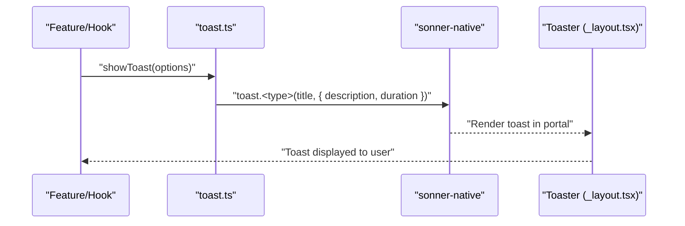
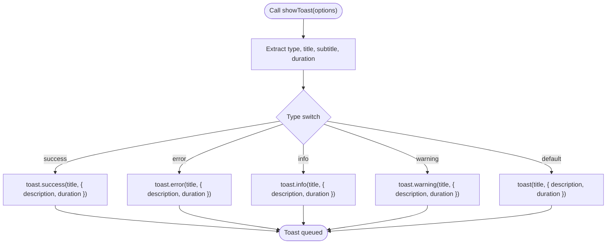
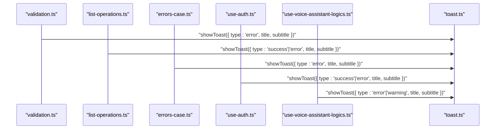
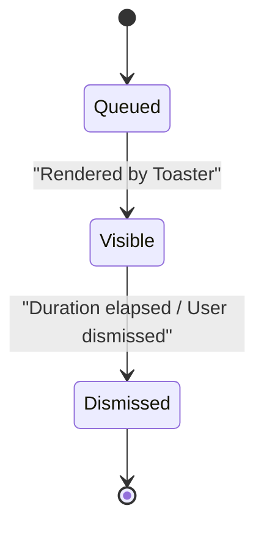
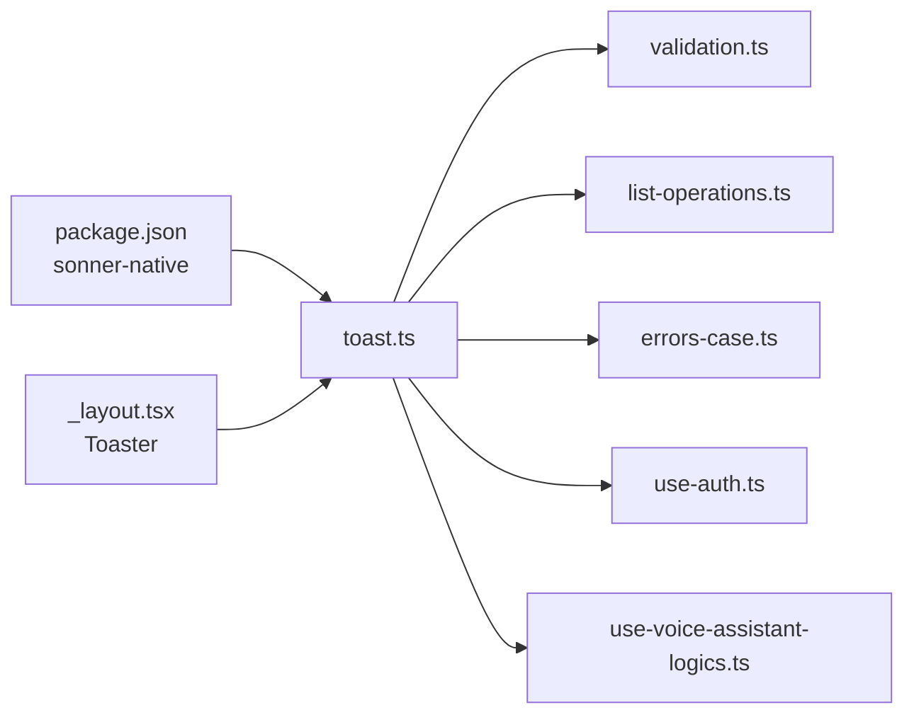

# Notification Services

<cite>
**Referenced Files in This Document**
- [toast.ts](file://src/services/toast.ts)
- [_layout.tsx](file://src/app/_layout.tsx)
- [validation.ts](file://src/features/list/utils/validation.ts)
- [list-operations.ts](file://src/features/lists/utils/list-operations.ts)
- [errors-case.ts](file://src/features/request-password-recovery/utils/errors-case.ts)
- [use-auth.ts](file://src/hooks/use-auth.ts)
- [use-voice-assistant-logics.ts](file://src/features/voice-assistant/hooks/use-voice-assistant-logics.ts)
- [package.json](file://package.json)
</cite>

## Table of Contents
1. [Introduction](#introduction)
2. [Project Structure](#project-structure)
3. [Core Components](#core-components)
4. [Architecture Overview](#architecture-overview)
5. [Detailed Component Analysis](#detailed-component-analysis)
6. [Dependency Analysis](#dependency-analysis)
7. [Performance Considerations](#performance-considerations)
8. [Troubleshooting Guide](#troubleshooting-guide)
9. [Conclusion](#conclusion)

## Introduction
This document describes the notification services in PowerLists, focusing on the toast notification system built with sonner-native. It explains the IToastOptionsType interface, the showToast function parameters, supported notification types, configuration options, lifecycle, error handling strategies, and accessibility considerations. Practical usage examples are included across scenarios such as successful operations, error handling, and user feedback. Guidance is also provided on positioning, timing, and user experience best practices.

## Project Structure
The notification system is implemented as a thin wrapper around sonner-native and is integrated at the application root level via the Toaster component. The service is consumed across multiple features and hooks to deliver contextual feedback to users.

**Diagram sources**
- [_layout.tsx:7-53](file://src/app/_layout.tsx#L7-L53)
- [toast.ts:1-43](file://src/services/toast.ts#L1-L43)
- [validation.ts:1-66](file://src/features/list/utils/validation.ts#L1-L66)
- [list-operations.ts:1-73](file://src/features/lists/utils/list-operations.ts#L1-L73)
- [errors-case.ts:1-43](file://src/features/request-password-recovery/utils/errors-case.ts#L1-L43)
- [use-auth.ts:1-261](file://src/hooks/use-auth.ts#L1-L261)
- [use-voice-assistant-logics.ts:1-213](file://src/features/voice-assistant/hooks/use-voice-assistant-logics.ts#L1-L213)

**Section sources**
- [_layout.tsx:1-63](file://src/app/_layout.tsx#L1-L63)
- [toast.ts:1-43](file://src/services/toast.ts#L1-L43)

## Core Components
- IToastOptionsType: Defines the shape of toast options, including type, title, optional subtitle, and optional duration.
- showToast: A unified function that delegates to sonner-native’s toast methods based on type, passing title, description (subtitle), and duration.

Key characteristics:
- Supported types: success, error, info, warning.
- Optional duration: passed through to sonner-native.
- Fallback behavior: if type does not match supported values, it falls back to the generic toast method.

**Section sources**
- [toast.ts:3-8](file://src/services/toast.ts#L3-L8)
- [toast.ts:24-43](file://src/services/toast.ts#L24-L43)

## Architecture Overview
The toast system is centralized in a single service module and rendered globally via the Toaster component at the root layout. Consumers import showToast from the service and pass structured options. The Toaster renders notifications in a portal host, ensuring consistent positioning and stacking behavior.

**Diagram sources**
- [toast.ts:24-43](file://src/services/toast.ts#L24-L43)
- [_layout.tsx:53-53](file://src/app/_layout.tsx#L53-L53)

**Section sources**
- [_layout.tsx:53-53](file://src/app/_layout.tsx#L53-L53)
- [toast.ts:24-43](file://src/services/toast.ts#L24-L43)

## Detailed Component Analysis

### IToastOptionsType and showToast
- IToastOptionsType enforces strict typing for toast options, ensuring callers provide a valid type and a title, with optional subtitle and duration.
- showToast maps the type to the appropriate sonner-native method, extracting subtitle as description and forwarding duration.

**Diagram sources**
- [toast.ts:24-43](file://src/services/toast.ts#L24-L43)

**Section sources**
- [toast.ts:3-8](file://src/services/toast.ts#L3-L8)
- [toast.ts:24-43](file://src/services/toast.ts#L24-L43)

### Integration Patterns Across Features
- Validation utilities: show error toasts for invalid item fields with concise messages and guidance.
- List operations: show success toasts after create/update; show error toasts on failures.
- Password recovery: show type-specific toasts for various error conditions.
- Authentication: show success toasts for login/signup/logout; show error toasts for failures with handled messages.
- Voice assistant: show error toasts for speech recognition errors and warning toasts for missing permissions.

**Diagram sources**
- [validation.ts:13-22](file://src/features/list/utils/validation.ts#L13-L22)
- [list-operations.ts:19-33](file://src/features/lists/utils/list-operations.ts#L19-L33)
- [errors-case.ts:4-41](file://src/features/request-password-recovery/utils/errors-case.ts#L4-L41)
- [use-auth.ts:109-118](file://src/hooks/use-auth.ts#L109-L118)
- [use-voice-assistant-logics.ts:105-110](file://src/features/voice-assistant/hooks/use-voice-assistant-logics.ts#L105-L110)

**Section sources**
- [validation.ts:13-22](file://src/features/list/utils/validation.ts#L13-L22)
- [list-operations.ts:19-33](file://src/features/lists/utils/list-operations.ts#L19-L33)
- [errors-case.ts:4-41](file://src/features/request-password-recovery/utils/errors-case.ts#L4-L41)
- [use-auth.ts:109-118](file://src/hooks/use-auth.ts#L109-L118)
- [use-voice-assistant-logics.ts:105-110](file://src/features/voice-assistant/hooks/use-voice-assistant-logics.ts#L105-L110)

### Notification Lifecycle
- Creation: showToast is invoked with options; the service delegates to sonner-native.
- Rendering: Toaster renders the toast in the portal host at the root layout.
- Dismissal: Duration is controlled by the duration option; sonner-native handles automatic dismissal and user interaction (e.g., tap to dismiss).
- Cleanup: Toasts are ephemeral; sonner-native manages memory and DOM-like cleanup internally.

**Diagram sources**
- [_layout.tsx:53-53](file://src/app/_layout.tsx#L53-L53)
- [toast.ts:24-43](file://src/services/toast.ts#L24-L43)

**Section sources**
- [_layout.tsx:53-53](file://src/app/_layout.tsx#L53-L53)
- [toast.ts:24-43](file://src/services/toast.ts#L24-L43)

### Accessibility Considerations
- Sonner-native integrates with React Native’s accessibility framework; ensure content is concise and actionable.
- Prefer short, scannable titles and subtitles; avoid dense text.
- Keep durations reasonable to allow users to read and act on notifications.
- Avoid color-only cues; pair icons or labels with text for clarity.

[No sources needed since this section provides general guidance]

### Practical Usage Examples
- Successful list creation: show a success toast with a concise title and confirmation message.
- Validation failure: show an error toast with a clear, actionable subtitle.
- Password recovery error: show an error toast tailored to the specific error case.
- Authentication success/error: show success toasts on login/signup/logout; show error toasts with handled messages on failure.
- Voice assistant permission error: show a warning toast prompting the user to grant permissions.

**Section sources**
- [list-operations.ts:19-23](file://src/features/lists/utils/list-operations.ts#L19-L23)
- [validation.ts:14-20](file://src/features/list/utils/validation.ts#L14-L20)
- [errors-case.ts:5-10](file://src/features/request-password-recovery/utils/errors-case.ts#L5-L10)
- [use-auth.ts:109-118](file://src/hooks/use-auth.ts#L109-L118)
- [use-voice-assistant-logics.ts:120-126](file://src/features/voice-assistant/hooks/use-voice-assistant-logics.ts#L120-L126)

## Dependency Analysis
- External library: sonner-native is declared as a dependency and imported in the service and root layout.
- Internal integration: toast.ts is consumed by multiple features and hooks; Toaster is rendered in the root layout.

**Diagram sources**
- [package.json:80-80](file://package.json#L80-L80)
- [toast.ts:1-1](file://src/services/toast.ts#L1-L1)
- [_layout.tsx:7-53](file://src/app/_layout.tsx#L7-L53)

**Section sources**
- [package.json:80-80](file://package.json#L80-L80)
- [toast.ts:1-1](file://src/services/toast.ts#L1-L1)
- [_layout.tsx:7-53](file://src/app/_layout.tsx#L7-L53)

## Performance Considerations
- Toasts are lightweight; keep messages concise to minimize rendering overhead.
- Avoid excessive toast bursts in rapid succession; batch or debounce notifications where appropriate.
- Use sensible durations to balance visibility and user experience.

[No sources needed since this section provides general guidance]

## Troubleshooting Guide
- Toast not appearing:
  - Verify Toaster is rendered in the root layout.
  - Ensure showToast is called with a valid type and title.
- Incorrect type behavior:
  - Confirm type is one of success, error, info, warning; otherwise it falls back to the generic toast method.
- Duration not applied:
  - Ensure duration is provided as a number; sonner-native applies defaults if omitted.

**Section sources**
- [_layout.tsx:53-53](file://src/app/_layout.tsx#L53-L53)
- [toast.ts:24-43](file://src/services/toast.ts#L24-L43)

## Conclusion
The notification service in PowerLists leverages sonner-native through a simple, typed interface and a unified showToast function. By centralizing toast creation and rendering via the Toaster at the application root, the system ensures consistent, accessible, and user-friendly feedback across features. Following the recommended patterns and best practices outlined here will help maintain clarity, reliability, and a positive user experience.