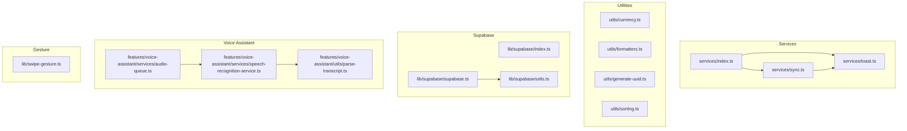
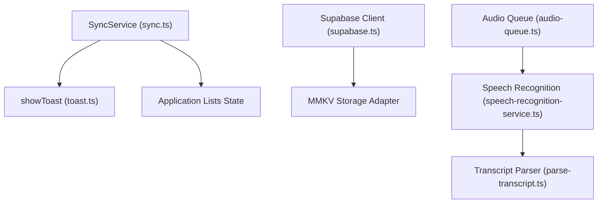
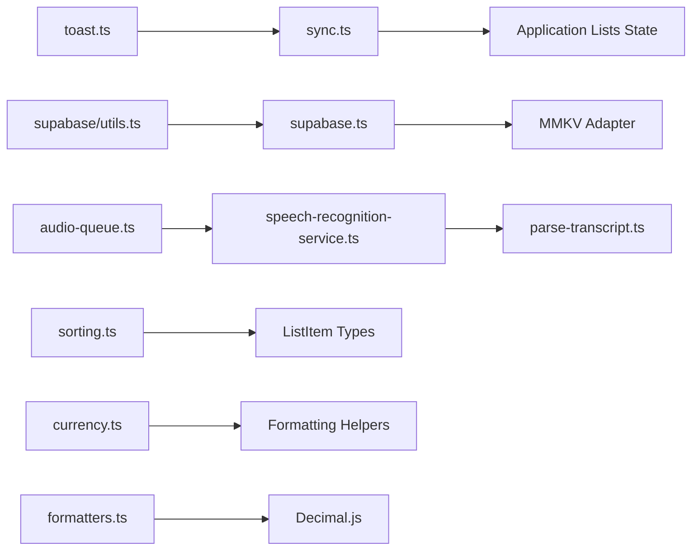

# Services and Utilities

<cite>
**Referenced Files in This Document**
- [src/services/index.ts](file://src/services/index.ts)
- [src/services/toast.ts](file://src/services/toast.ts)
- [src/services/sync.ts](file://src/services/sync.ts)
- [src/utils/currency.ts](file://src/utils/currency.ts)
- [src/utils/formatters.ts](file://src/utils/formatters.ts)
- [src/utils/generate-uuid.ts](file://src/utils/generate-uuid.ts)
- [src/utils/sorting.ts](file://src/utils/sorting.ts)
- [src/lib/swipe-gesture.ts](file://src/lib/swipe-gesture.ts)
- [src/lib/supabase/index.ts](file://src/lib/supabase/index.ts)
- [src/lib/supabase/supabase.ts](file://src/lib/supabase/supabase.ts)
- [src/lib/supabase/utils.ts](file://src/lib/supabase/utils.ts)
- [src/features/voice-assistant/services/audio-queue.ts](file://src/features/voice-assistant/services/audio-queue.ts)
- [src/features/voice-assistant/services/speech-recognition-service.ts](file://src/features/voice-assistant/services/speech-recognition-service.ts)
- [src/features/voice-assistant/utils/parse-transcript.ts](file://src/features/voice-assistant/utils/parse-transcript.ts)
</cite>

## Table of Contents
1. [Introduction](#introduction)
2. [Project Structure](#project-structure)
3. [Core Components](#core-components)
4. [Architecture Overview](#architecture-overview)
5. [Detailed Component Analysis](#detailed-component-analysis)
6. [Dependency Analysis](#dependency-analysis)
7. [Performance Considerations](#performance-considerations)
8. [Troubleshooting Guide](#troubleshooting-guide)
9. [Conclusion](#conclusion)
10. [Appendices](#appendices)

## Introduction
This document provides comprehensive documentation for PowerLists services and utility functions. It covers:
- Toast notification service
- Synchronization service for guest-to-user data migration
- Currency formatting utilities
- Date/time and price formatters
- UUID generation
- Sorting algorithms for list items
- Swipe gesture handling
- Supabase integration utilities
- Voice assistant audio queue and speech recognition utilities

It explains implementation patterns, error handling strategies, performance considerations, composition and reuse of utilities, and integration points with the broader application architecture. Examples of usage, configuration options, and extension points are included.

## Project Structure
The services and utilities are organized by domain and responsibility:
- Services: centralized exports and implementations under src/services
- Utilities: under src/utils for formatting, sorting, UUID generation, and currency helpers
- Supabase integration: under src/lib/supabase
- Voice assistant utilities: under src/features/voice-assistant/services and utils
- Swipe gesture utilities: under src/lib/swipe-gesture.ts

**Diagram sources**
- [src/services/index.ts:1-3](file://src/services/index.ts#L1-L3)
- [src/services/toast.ts:1-44](file://src/services/toast.ts#L1-L44)
- [src/services/sync.ts:1-203](file://src/services/sync.ts#L1-L203)
- [src/utils/currency.ts:1-40](file://src/utils/currency.ts#L1-L40)
- [src/utils/formatters.ts:1-46](file://src/utils/formatters.ts#L1-L46)
- [src/utils/generate-uuid.ts:1-19](file://src/utils/generate-uuid.ts#L1-L19)
- [src/utils/sorting.ts:1-54](file://src/utils/sorting.ts#L1-L54)
- [src/lib/supabase/index.ts:1-4](file://src/lib/supabase/index.ts#L1-L4)
- [src/lib/supabase/supabase.ts:1-29](file://src/lib/supabase/supabase.ts#L1-L29)
- [src/lib/supabase/utils.ts:1-10](file://src/lib/supabase/utils.ts#L1-L10)
- [src/features/voice-assistant/services/audio-queue.ts:1-60](file://src/features/voice-assistant/services/audio-queue.ts#L1-L60)
- [src/features/voice-assistant/services/speech-recognition-service.ts:1-54](file://src/features/voice-assistant/services/speech-recognition-service.ts#L1-L54)
- [src/features/voice-assistant/utils/parse-transcript.ts:1-225](file://src/features/voice-assistant/utils/parse-transcript.ts#L1-L225)
- [src/lib/swipe-gesture.ts:1-29](file://src/lib/swipe-gesture.ts#L1-L29)

**Section sources**
- [src/services/index.ts:1-3](file://src/services/index.ts#L1-L3)
- [src/services/toast.ts:1-44](file://src/services/toast.ts#L1-L44)
- [src/services/sync.ts:1-203](file://src/services/sync.ts#L1-L203)
- [src/utils/currency.ts:1-40](file://src/utils/currency.ts#L1-L40)
- [src/utils/formatters.ts:1-46](file://src/utils/formatters.ts#L1-L46)
- [src/utils/generate-uuid.ts:1-19](file://src/utils/generate-uuid.ts#L1-L19)
- [src/utils/sorting.ts:1-54](file://src/utils/sorting.ts#L1-L54)
- [src/lib/supabase/index.ts:1-4](file://src/lib/supabase/index.ts#L1-L4)
- [src/lib/supabase/supabase.ts:1-29](file://src/lib/supabase/supabase.ts#L1-L29)
- [src/lib/supabase/utils.ts:1-10](file://src/lib/supabase/utils.ts#L1-L10)
- [src/features/voice-assistant/services/audio-queue.ts:1-60](file://src/features/voice-assistant/services/audio-queue.ts#L1-L60)
- [src/features/voice-assistant/services/speech-recognition-service.ts:1-54](file://src/features/voice-assistant/services/speech-recognition-service.ts#L1-L54)
- [src/features/voice-assistant/utils/parse-transcript.ts:1-225](file://src/features/voice-assistant/utils/parse-transcript.ts#L1-L225)
- [src/lib/swipe-gesture.ts:1-29](file://src/lib/swipe-gesture.ts#L1-L29)

## Core Components
- Toast notification service: centralized wrapper around a native toast library with typed options and consistent UX.
- Synchronization service: manages guest-to-user data migration with user prompts, state checks, and success/error feedback.
- Currency utilities: formatting, parsing, and conversion helpers for BRL amounts.
- Formatters: currency formatting via Intl and robust parsing for price/amount with Decimal precision.
- UUID generator: secure random UUID v4 generation for guest profiles.
- Sorting utilities: flexible item sorting by date, name, or price with separation by checked/unchecked.
- Swipe gesture utilities: platform-aware gesture configuration for consistent swipe UX.
- Supabase integration: client initialization with MMKV-backed auth storage and key conversion helpers.
- Voice assistant utilities: audio queue sequencing, speech recognition lifecycle, and transcript parsing.

**Section sources**
- [src/services/toast.ts:1-44](file://src/services/toast.ts#L1-L44)
- [src/services/sync.ts:1-203](file://src/services/sync.ts#L1-L203)
- [src/utils/currency.ts:1-40](file://src/utils/currency.ts#L1-L40)
- [src/utils/formatters.ts:1-46](file://src/utils/formatters.ts#L1-L46)
- [src/utils/generate-uuid.ts:1-19](file://src/utils/generate-uuid.ts#L1-L19)
- [src/utils/sorting.ts:1-54](file://src/utils/sorting.ts#L1-L54)
- [src/lib/swipe-gesture.ts:1-29](file://src/lib/swipe-gesture.ts#L1-L29)
- [src/lib/supabase/supabase.ts:1-29](file://src/lib/supabase/supabase.ts#L1-L29)
- [src/lib/supabase/utils.ts:1-10](file://src/lib/supabase/utils.ts#L1-L10)
- [src/features/voice-assistant/services/audio-queue.ts:1-60](file://src/features/voice-assistant/services/audio-queue.ts#L1-L60)
- [src/features/voice-assistant/services/speech-recognition-service.ts:1-54](file://src/features/voice-assistant/services/speech-recognition-service.ts#L1-L54)
- [src/features/voice-assistant/utils/parse-transcript.ts:1-225](file://src/features/voice-assistant/utils/parse-transcript.ts#L1-L225)

## Architecture Overview
The services and utilities integrate with the application’s state and persistence layers:
- SyncService relies on application state to detect guest data and trigger migrations.
- Supabase client integrates with MMKV for persistent auth sessions.
- Voice assistant utilities encapsulate platform-specific audio and speech APIs.
- Formatting and sorting utilities are pure and reusable across components.

**Diagram sources**
- [src/services/sync.ts:1-203](file://src/services/sync.ts#L1-L203)
- [src/services/toast.ts:1-44](file://src/services/toast.ts#L1-L44)
- [src/lib/supabase/supabase.ts:1-29](file://src/lib/supabase/supabase.ts#L1-L29)
- [src/features/voice-assistant/services/audio-queue.ts:1-60](file://src/features/voice-assistant/services/audio-queue.ts#L1-L60)
- [src/features/voice-assistant/services/speech-recognition-service.ts:1-54](file://src/features/voice-assistant/services/speech-recognition-service.ts#L1-L54)
- [src/features/voice-assistant/utils/parse-transcript.ts:1-225](file://src/features/voice-assistant/utils/parse-transcript.ts#L1-L225)

## Detailed Component Analysis

### Toast Notification Service
Purpose:
- Provide a unified, typed interface for displaying native toasts with consistent behavior.

Key behaviors:
- Accepts a type discriminator and optional subtitle/duration.
- Delegates to a native toast library based on type.
- Centralizes presentation logic for uniform UX.

Usage pattern:
- Import the service and call the function with structured options.
- Combine with success/error feedback from other services.

Error handling:
- The function itself does not throw; it delegates to the underlying library.

Performance considerations:
- Minimal overhead; ensure duration aligns with UX needs.

Extension points:
- Add new types by extending the type union and mapping in the switch.
- Introduce theme or icon mapping per type.

**Section sources**
- [src/services/toast.ts:1-44](file://src/services/toast.ts#L1-L44)

### Synchronization Service
Purpose:
- Migrate guest user data to authenticated user accounts during sign-in or first-access flows.

Key behaviors:
- Detects presence of guest-owned lists in application state.
- Prompts the user via a native alert dialog with migration options.
- Updates list ownership by mutating state (which triggers automatic Supabase sync).
- Reports success/failure with counts and messages.

Processing logic:
- hasGuestData: filters lists by profile_id and returns boolean.
- getGuestListsCount: counts matching lists.
- promptDataMigration: shows alert, invokes migration on confirm.
- migrateGuestDataToUser: updates profile_id for each guest list and returns a result object.

Error handling:
- All methods catch errors and return safe fallbacks (false, 0, or structured error result).
- Uses native Alert for mobile UX.

Performance considerations:
- Filtering and mutation operate on current in-memory state; complexity proportional to number of lists.
- Avoid blocking UI by keeping operations synchronous and minimal.

Integration points:
- Depends on application state for lists and on the toast service for feedback.
- Relies on automatic Supabase synchronization through state updates.

**Section sources**
- [src/services/sync.ts:1-203](file://src/services/sync.ts#L1-L203)

### Currency Formatting Utilities
Purpose:
- Provide consistent formatting and parsing for Brazilian Real (BRL) amounts across the app.

Key behaviors:
- formatBRL: converts raw digit input (cents) to a localized BRL string.
- parseBRLToNumber: parses formatted BRL strings back to numeric values.
- numberToBRLInput: converts stored numbers to editable BRL strings.

Implementation patterns:
- Robust cleaning of currency strings (removes currency symbols, normalizes thousands/decimals).
- Uses locale-aware formatting for readability.

Error handling:
- Graceful fallbacks to empty string or zero when input is invalid.

Performance considerations:
- Pure functions; negligible overhead.
- Prefer Decimal-based calculations elsewhere for precise totals.

**Section sources**
- [src/utils/currency.ts:1-40](file://src/utils/currency.ts#L1-L40)

### Date/Time and Price Formatters
Purpose:
- Provide robust formatting and parsing for currency, prices, and quantities.

Key behaviors:
- formatCurrency: uses Intl.NumberFormat for BRL formatting.
- parsePrice: cleans and parses price strings with Decimal precision, clamps negatives, rounds to two decimals.
- parseAmount: cleans and parses amount strings, ensures minimum of 1.
- calculateTotal: computes totals from item arrays using Decimal arithmetic.

Implementation patterns:
- Decimal.js ensures predictable rounding and arithmetic.
- Defensive filtering of invalid items before aggregation.

Error handling:
- Try/catch blocks and default values prevent crashes on malformed inputs.

Performance considerations:
- Decimal arithmetic is slower than primitives; reserve for financial computations.

**Section sources**
- [src/utils/formatters.ts:1-46](file://src/utils/formatters.ts#L1-L46)

### UUID Generation Functions
Purpose:
- Generate unique identifiers for guest profiles and other entities requiring randomness.

Key behaviors:
- Wraps a UUID v4 generator with React Native’s random values polyfill.
- Returns a standard UUID string.

Implementation patterns:
- Minimal wrapper around a well-tested library.
- Suitable for guest user creation and ephemeral entities.

Performance considerations:
- One-time cost per generation; negligible in practice.

**Section sources**
- [src/utils/generate-uuid.ts:1-19](file://src/utils/generate-uuid.ts#L1-L19)

### Sorting Algorithms
Purpose:
- Provide flexible sorting of list items by date, name, or price, with separation by checked/unchecked.

Key behaviors:
- sortItemsByDate: sorts by creation timestamp.
- sortItemsByName: locale-aware alphabetical sort in Portuguese.
- sortItemsByPrice: numeric sort using Decimal comparisons.
- sortItems: dispatches to appropriate sorter by mode.
- separateItemsByStatus: splits items into checked and unchecked groups after sorting.

Implementation patterns:
- Non-destructive sorting via array spread.
- Mode-driven selection for extensibility.

Performance considerations:
- Sorting complexity proportional to O(n log n); acceptable for typical list sizes.
- LocaleCompare may be slower than ASCII comparisons; keep within reasonable bounds.

**Section sources**
- [src/utils/sorting.ts:1-54](file://src/utils/sorting.ts#L1-L54)

### Swipe Gesture Handling
Purpose:
- Provide platform-aware gesture configuration for swipeable list items.

Key behaviors:
- Constants define thresholds and offsets for reliable gestures.
- createPanGuard: builds a pan gesture with min distance and offset tolerances.
- getSwipeHitSlop: computes left hit slop based on device width and platform.

Implementation patterns:
- Exported constants and factory function enable reuse across components.
- Platform-specific ratios ensure consistent UX across Android/iOS.

Performance considerations:
- Gesture configuration is lightweight; impacts UI responsiveness minimally.

**Section sources**
- [src/lib/swipe-gesture.ts:1-29](file://src/lib/swipe-gesture.ts#L1-L29)

### Supabase Integration Utilities
Purpose:
- Initialize Supabase client with persistent auth storage and provide key conversion helpers.

Key behaviors:
- supabase client: creates a client with URL/anon key from environment variables and configures MMKV-backed auth storage.
- convertToSupabaseFormat: decamelizes keys for backend compatibility.
- convertFromSupabaseFormat: camelizes keys for frontend consumption.

Implementation patterns:
- Environment variables for credentials; adapter for MMKV storage.
- Key conversion utilities reduce friction when syncing data.

Performance considerations:
- Client initialization is one-time; storage adapter adds persistence overhead only on auth operations.

**Section sources**
- [src/lib/supabase/supabase.ts:1-29](file://src/lib/supabase/supabase.ts#L1-L29)
- [src/lib/supabase/utils.ts:1-10](file://src/lib/supabase/utils.ts#L1-L10)
- [src/lib/supabase/index.ts:1-4](file://src/lib/supabase/index.ts#L1-L4)

### Audio Processing Utilities
Purpose:
- Provide sequential audio playback with UI rendering guarantees and fallback handling.

Key behaviors:
- playAndWait: waits for audio completion with a listener and a time-based fallback.
- createAudioQueue: returns a function that chains audio playback, ensuring non-overlapping sounds and allowing UI to render between plays.

Implementation patterns:
- Promise chaining with requestAnimationFrame to synchronize with UI updates.
- Fallback timeout prevents hanging when listeners fail.

Performance considerations:
- Ensures smooth UX by preventing overlapping audio; slight latency due to animation frames.

**Section sources**
- [src/features/voice-assistant/services/audio-queue.ts:1-60](file://src/features/voice-assistant/services/audio-queue.ts#L1-L60)

### Speech Recognition Utilities
Purpose:
- Manage speech recognition lifecycle and map platform events to user-friendly messages.

Key behaviors:
- requestSpeechPermission: requests microphone permissions.
- startSpeechRecognition/stopSpeechRecognition: control recognition with default options.
- getTranscriptFromResultEvent: extracts final transcripts.
- getErrorMessageFromEvent: maps error codes to localized messages.

Implementation patterns:
- Defaults encapsulated in a constant; options can be extended per call.
- Error mapping centralizes user-facing messaging.

Performance considerations:
- Continuous recognition can be resource-intensive; stop when not needed.

**Section sources**
- [src/features/voice-assistant/services/speech-recognition-service.ts:1-54](file://src/features/voice-assistant/services/speech-recognition-service.ts#L1-L54)

### Transcript Parsing Utilities
Purpose:
- Parse Portuguese speech transcripts into structured item data (title, amount).

Key behaviors:
- Tokenization and greedy matching of numeric words.
- Supports digits, teens, tens, hundreds, and compound forms.
- Returns default amount of 1 when none found.

Implementation patterns:
- Lookup tables and sets for efficient number recognition.
- Two-phase parsing: numeric tokens first, then written numbers.

Performance considerations:
- Complexity proportional to token count; optimized with early exits.

**Section sources**
- [src/features/voice-assistant/utils/parse-transcript.ts:1-225](file://src/features/voice-assistant/utils/parse-transcript.ts#L1-L225)

## Dependency Analysis
This section maps dependencies among the documented components.

**Diagram sources**
- [src/services/toast.ts:1-44](file://src/services/toast.ts#L1-L44)
- [src/services/sync.ts:1-203](file://src/services/sync.ts#L1-L203)
- [src/lib/supabase/supabase.ts:1-29](file://src/lib/supabase/supabase.ts#L1-L29)
- [src/lib/supabase/utils.ts:1-10](file://src/lib/supabase/utils.ts#L1-L10)
- [src/features/voice-assistant/services/audio-queue.ts:1-60](file://src/features/voice-assistant/services/audio-queue.ts#L1-L60)
- [src/features/voice-assistant/services/speech-recognition-service.ts:1-54](file://src/features/voice-assistant/services/speech-recognition-service.ts#L1-L54)
- [src/features/voice-assistant/utils/parse-transcript.ts:1-225](file://src/features/voice-assistant/utils/parse-transcript.ts#L1-L225)
- [src/utils/sorting.ts:1-54](file://src/utils/sorting.ts#L1-L54)
- [src/utils/currency.ts:1-40](file://src/utils/currency.ts#L1-L40)
- [src/utils/formatters.ts:1-46](file://src/utils/formatters.ts#L1-L46)

**Section sources**
- [src/services/sync.ts:1-203](file://src/services/sync.ts#L1-L203)
- [src/services/toast.ts:1-44](file://src/services/toast.ts#L1-L44)
- [src/lib/supabase/supabase.ts:1-29](file://src/lib/supabase/supabase.ts#L1-L29)
- [src/lib/supabase/utils.ts:1-10](file://src/lib/supabase/utils.ts#L1-L10)
- [src/features/voice-assistant/services/audio-queue.ts:1-60](file://src/features/voice-assistant/services/audio-queue.ts#L1-L60)
- [src/features/voice-assistant/services/speech-recognition-service.ts:1-54](file://src/features/voice-assistant/services/speech-recognition-service.ts#L1-L54)
- [src/features/voice-assistant/utils/parse-transcript.ts:1-225](file://src/features/voice-assistant/utils/parse-transcript.ts#L1-L225)
- [src/utils/sorting.ts:1-54](file://src/utils/sorting.ts#L1-L54)
- [src/utils/currency.ts:1-40](file://src/utils/currency.ts#L1-L40)
- [src/utils/formatters.ts:1-46](file://src/utils/formatters.ts#L1-L46)

## Performance Considerations
- Toast and gesture utilities are lightweight and suitable for frequent calls.
- Sorting and parsing utilities are efficient for typical list sizes; avoid repeated heavy computations in tight loops.
- Decimal-based calculations ensure accuracy but incur overhead; use sparingly for totals.
- Audio queue introduces small delays via animation frames; beneficial for UI stability.
- Supabase client initialization is one-time; MMKV adapter adds persistence cost only on auth operations.
- Speech recognition should be stopped when not in use to save resources.

[No sources needed since this section provides general guidance]

## Troubleshooting Guide
Common issues and resolutions:
- Toast not appearing: verify the underlying library is initialized and the function is called with valid options.
- Migration appears stuck: ensure state updates are occurring and that the alert callback resolves promises properly.
- Currency parsing errors: confirm input sanitization and locale decimal separators.
- Sorting inconsistencies: verify item timestamps and titles; ensure locale settings match expectations.
- Swipe gestures ignored: adjust hit slop and offset thresholds; test on target platforms.
- Supabase auth not persisting: check environment variables and MMKV adapter configuration.
- Audio queue stalls: inspect fallback timeouts and listener subscriptions; ensure players are reset before replay.
- Speech recognition permission denied: guide users to grant permissions and handle error messages gracefully.

**Section sources**
- [src/services/toast.ts:1-44](file://src/services/toast.ts#L1-L44)
- [src/services/sync.ts:1-203](file://src/services/sync.ts#L1-L203)
- [src/utils/formatters.ts:1-46](file://src/utils/formatters.ts#L1-L46)
- [src/utils/sorting.ts:1-54](file://src/utils/sorting.ts#L1-L54)
- [src/lib/swipe-gesture.ts:1-29](file://src/lib/swipe-gesture.ts#L1-L29)
- [src/lib/supabase/supabase.ts:1-29](file://src/lib/supabase/supabase.ts#L1-L29)
- [src/features/voice-assistant/services/audio-queue.ts:1-60](file://src/features/voice-assistant/services/audio-queue.ts#L1-L60)
- [src/features/voice-assistant/services/speech-recognition-service.ts:1-54](file://src/features/voice-assistant/services/speech-recognition-service.ts#L1-L54)

## Conclusion
The services and utilities in PowerLists are designed for clarity, safety, and reusability. They provide consistent UX through toasts, robust data migration via the sync service, precise formatting and sorting, and reliable Supabase integration. Voice assistant utilities offer a cohesive audio and speech pipeline. By following the documented patterns and considering the performance and error-handling notes, developers can extend and maintain functionality effectively.

[No sources needed since this section summarizes without analyzing specific files]

## Appendices
- Usage examples and configuration options are embedded in the JSDoc comments of each module.
- Extension points include adding new toast types, expanding sort modes, introducing new Supabase key conversions, and augmenting speech error mappings.

[No sources needed since this section provides general guidance]