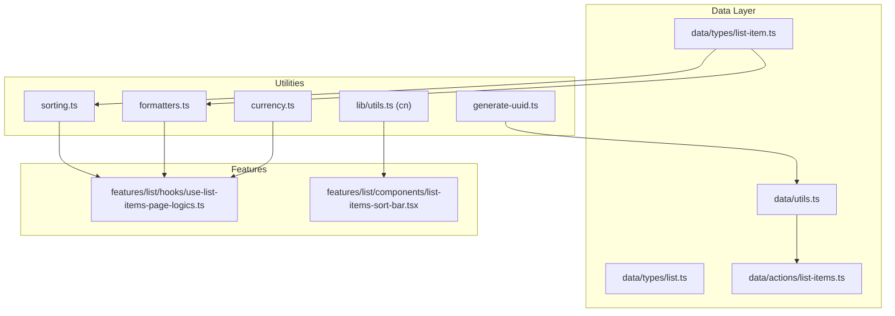
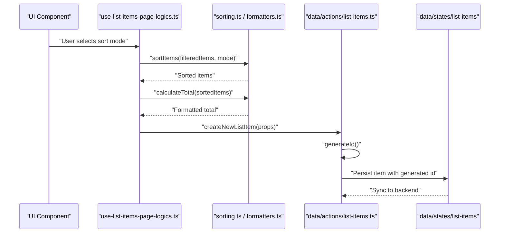
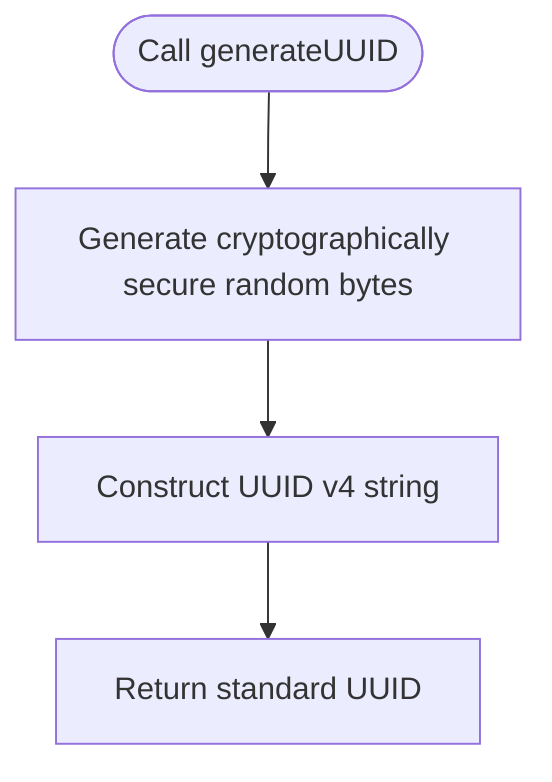
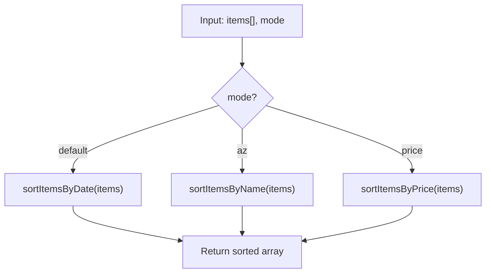
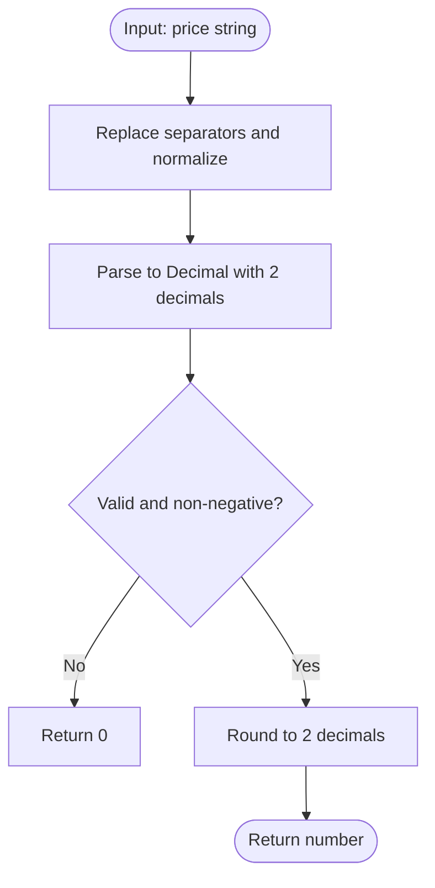
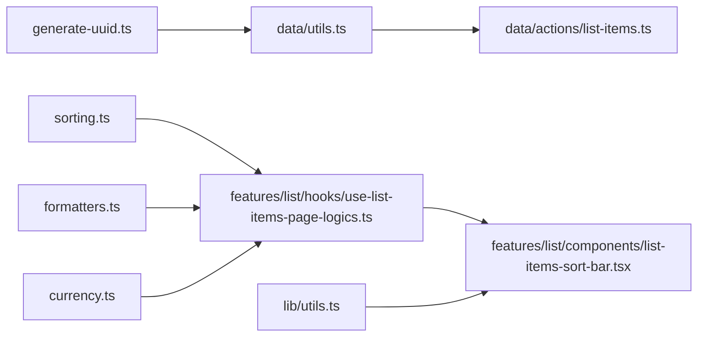

# Utility Functions

<cite>
**Referenced Files in This Document**
- [generate-uuid.ts](file://src/utils/generate-uuid.ts)
- [sorting.ts](file://src/utils/sorting.ts)
- [currency.ts](file://src/utils/currency.ts)
- [formatters.ts](file://src/utils/formatters.ts)
- [utils.ts](file://src/lib/utils.ts)
- [list-item.ts](file://src/data/types/list-item.ts)
- [list.ts](file://src/data/types/list.ts)
- [list-items.ts](file://src/data/actions/list-items.ts)
- [use-list-items-page-logics.ts](file://src/features/list/hooks/use-list-items-page-logics.ts)
- [list-items-sort-bar.tsx](file://src/features/list/components/list-items-sort-bar.tsx)
- [currency.property.test.ts](file://src/utils/__tests__/currency.property.test.ts)
- [formatters.property.test.ts](file://src/utils/__tests__/formatters.property.test.ts)
</cite>

## Table of Contents
1. [Introduction](#introduction)
2. [Project Structure](#project-structure)
3. [Core Components](#core-components)
4. [Architecture Overview](#architecture-overview)
5. [Detailed Component Analysis](#detailed-component-analysis)
6. [Dependency Analysis](#dependency-analysis)
7. [Performance Considerations](#performance-considerations)
8. [Troubleshooting Guide](#troubleshooting-guide)
9. [Conclusion](#conclusion)
10. [Appendices](#appendices)

## Introduction
This document provides comprehensive documentation for the utility functions in PowerLists. It focuses on:
- UUID generation utility and its role in local identity creation
- Sorting utilities for list items, including comparison functions, sort modes, and data structure handling
- Currency and formatting utilities for price parsing, formatting, and totals calculation
- Utility function composition patterns, reusability principles, and integration with the application’s data layer
- Practical usage examples, performance characteristics, error handling, edge cases, and optimization strategies

## Project Structure
Utilities are organized under the src/utils directory and integrated across features, data actions, and UI components. Key integration points include:
- UUID generation used during local item creation
- Sorting utilities consumed by list item pages and UI controls
- Formatting utilities used for totals and currency display
- Tailwind utility helpers for class merging

**Diagram sources**
- [generate-uuid.ts:1-19](file://src/utils/generate-uuid.ts#L1-L19)
- [sorting.ts:1-54](file://src/utils/sorting.ts#L1-L54)
- [currency.ts:1-40](file://src/utils/currency.ts#L1-L40)
- [formatters.ts:1-46](file://src/utils/formatters.ts#L1-L46)
- [utils.ts:1-7](file://src/lib/utils.ts#L1-L7)
- [list-item.ts:1-38](file://src/data/types/list-item.ts#L1-L38)
- [list.ts:1-41](file://src/data/types/list.ts#L1-L41)
- [list-items.ts:1-193](file://src/data/actions/list-items.ts#L1-L193)
- [use-list-items-page-logics.ts:1-124](file://src/features/list/hooks/use-list-items-page-logics.ts#L1-L124)
- [list-items-sort-bar.tsx:1-53](file://src/features/list/components/list-items-sort-bar.tsx#L1-L53)

**Section sources**
- [generate-uuid.ts:1-19](file://src/utils/generate-uuid.ts#L1-L19)
- [sorting.ts:1-54](file://src/utils/sorting.ts#L1-L54)
- [currency.ts:1-40](file://src/utils/currency.ts#L1-L40)
- [formatters.ts:1-46](file://src/utils/formatters.ts#L1-L46)
- [utils.ts:1-7](file://src/lib/utils.ts#L1-L7)
- [list-item.ts:1-38](file://src/data/types/list-item.ts#L1-L38)
- [list.ts:1-41](file://src/data/types/list.ts#L1-L41)
- [list-items.ts:1-193](file://src/data/actions/list-items.ts#L1-L193)
- [use-list-items-page-logics.ts:1-124](file://src/features/list/hooks/use-list-items-page-logics.ts#L1-L124)
- [list-items-sort-bar.tsx:1-53](file://src/features/list/components/list-items-sort-bar.tsx#L1-L53)

## Core Components
- UUID Generation Utility
  - Purpose: Generate unique identifiers for local entities (e.g., guest users, local items)
  - Implementation: Thin wrapper around a cryptographically secure UUID v4 generator
  - Integration: Used during local item creation via the data layer
- Sorting Utilities
  - Purpose: Provide deterministic ordering of list items by date, name, or price
  - Modes: default (date), az (name), price (numeric)
  - Data Handling: Operates on typed list item arrays and separates checked/unchecked items
- Currency and Formatting Utilities
  - Purpose: Format user input into BRL currency strings, parse BRL strings back to numbers, and compute totals
  - Precision: Uses decimal arithmetic to avoid floating-point errors
- Tailwind Class Merging Utility
  - Purpose: Merge and deduplicate Tailwind CSS classes safely

**Section sources**
- [generate-uuid.ts:1-19](file://src/utils/generate-uuid.ts#L1-L19)
- [sorting.ts:1-54](file://src/utils/sorting.ts#L1-L54)
- [currency.ts:1-40](file://src/utils/currency.ts#L1-L40)
- [formatters.ts:1-46](file://src/utils/formatters.ts#L1-L46)
- [utils.ts:1-7](file://src/lib/utils.ts#L1-L7)

## Architecture Overview
The utilities integrate with the data layer and UI features as follows:
- Local ID generation is invoked during item creation
- Sorting and totals computation are performed in the list items page logic
- UI components consume sort modes and display totals using formatting utilities

**Diagram sources**
- [use-list-items-page-logics.ts:62-73](file://src/features/list/hooks/use-list-items-page-logics.ts#L62-L73)
- [sorting.ts:35-44](file://src/utils/sorting.ts#L35-L44)
- [formatters.ts:32-45](file://src/utils/formatters.ts#L32-L45)
- [list-items.ts:53-104](file://src/data/actions/list-items.ts#L53-L104)

## Detailed Component Analysis

### UUID Generation Utility
- Unique Identifier Creation
  - Uses a cryptographically secure random number generator and UUID v4
  - Returns a standard UUID string suitable for local and remote synchronization
- Collision Avoidance
  - UUID v4 ensures extremely low probability of collisions in practice
  - No explicit collision detection or retry mechanism is implemented
- Performance Characteristics
  - Constant-time operation with minimal overhead
  - Single function call per entity creation
- Usage Scenarios
  - Generating IDs for newly created list items before persisting to the store
- Error Handling and Edge Cases
  - No explicit error handling in the utility; relies on underlying library
  - Consumers should validate returned IDs before persistence
- Best Practices for Extension
  - Keep the utility stateless and deterministic for testing
  - Centralize ID generation to avoid duplication across modules

**Diagram sources**
- [generate-uuid.ts:16-18](file://src/utils/generate-uuid.ts#L16-L18)

**Section sources**
- [generate-uuid.ts:1-19](file://src/utils/generate-uuid.ts#L1-L19)
- [list-items.ts:71-75](file://src/data/actions/list-items.ts#L71-L75)

### Sorting Utilities
- Comparison Functions
  - Date-based sorting compares normalized timestamps derived from createdAt
  - Name-based sorting trims titles and uses locale-aware comparison for pt-BR
  - Price-based sorting uses decimal arithmetic for precise numeric comparisons
- Sort Algorithms and Modes
  - sortItems delegates to specific comparators based on SortMode
  - separateItemsByStatus builds on sortItems to partition checked and unchecked items
- Data Structure Handling
  - All functions operate on arrays of typed list items and return new arrays (no mutation)
- Usage in Application
  - Consumed by the list items page logic to order items according to user selection
  - Exposed to UI via a sort bar component
- Error Handling and Edge Cases
  - Handles missing or empty fields gracefully (fallbacks to zero or empty strings)
  - Locale-sensitive sorting avoids case sensitivity issues
- Performance Considerations
  - Sorting complexity is O(n log n); filtering adds O(n)
  - Memoization in the consuming hook prevents unnecessary recomputation

**Diagram sources**
- [sorting.ts:35-44](file://src/utils/sorting.ts#L35-L44)
- [sorting.ts:10-16](file://src/utils/sorting.ts#L10-L16)
- [sorting.ts:18-25](file://src/utils/sorting.ts#L18-L25)
- [sorting.ts:27-33](file://src/utils/sorting.ts#L27-L33)

**Section sources**
- [sorting.ts:1-54](file://src/utils/sorting.ts#L1-L54)
- [list-item.ts:1-12](file://src/data/types/list-item.ts#L1-L12)
- [use-list-items-page-logics.ts:62-73](file://src/features/list/hooks/use-list-items-page-logics.ts#L62-L73)
- [list-items-sort-bar.tsx:15-19](file://src/features/list/components/list-items-sort-bar.tsx#L15-L19)

### Currency and Formatting Utilities
- Formatting and Parsing
  - formatBRL converts raw digit strings into BRL display format
  - parseBRLToNumber converts BRL display strings back to numeric values
  - numberToBRLInput formats numeric prices for input editing
- Totals Calculation
  - calculateTotal computes the sum of price × amount for list items with decimal precision
  - Uses locale-aware currency formatting for display
- Error Handling and Edge Cases
  - Robust defaults for missing or invalid inputs
  - Decimal arithmetic ensures accurate rounding and comparisons
- Tests and Validation
  - Property-based tests confirm cent-preserving round-trips and correctness against a decimal oracle

**Diagram sources**
- [formatters.ts:14-21](file://src/utils/formatters.ts#L14-L21)

**Section sources**
- [currency.ts:1-40](file://src/utils/currency.ts#L1-L40)
- [formatters.ts:1-46](file://src/utils/formatters.ts#L1-L46)
- [formatters.property.test.ts:26-31](file://src/utils/__tests__/formatters.property.test.ts#L26-L31)
- [currency.property.test.ts:7-18](file://src/utils/__tests__/currency.property.test.ts#L7-L18)

### Tailwind Class Merging Utility
- Purpose: Safely merge and deduplicate Tailwind CSS classes
- Usage: Applied in UI components to dynamically apply accent styles based on list configuration

**Section sources**
- [utils.ts:1-7](file://src/lib/utils.ts#L1-L7)
- [list-items-sort-bar.tsx:36-45](file://src/features/list/components/list-items-sort-bar.tsx#L36-L45)

## Dependency Analysis
- Internal Dependencies
  - Sorting utilities depend on typed list item definitions and decimal arithmetic
  - Formatting utilities depend on decimal arithmetic and locale-aware number formatting
  - UUID utility depends on a secure random source and UUID library
- External Dependencies
  - UUID generation relies on a cross-platform random source and uuid library
  - Decimal arithmetic is used for precise financial calculations
- Coupling and Cohesion
  - Utilities are cohesive and loosely coupled; they expose pure functions
  - Integration occurs through data actions and feature hooks, minimizing tight coupling

**Diagram sources**
- [generate-uuid.ts:1-19](file://src/utils/generate-uuid.ts#L1-L19)
- [list-items.ts:16](file://src/data/actions/list-items.ts#L16)
- [sorting.ts:1-54](file://src/utils/sorting.ts#L1-L54)
- [use-list-items-page-logics.ts:1-124](file://src/features/list/hooks/use-list-items-page-logics.ts#L1-L124)
- [list-items-sort-bar.tsx:1-53](file://src/features/list/components/list-items-sort-bar.tsx#L1-L53)
- [currency.ts:1-40](file://src/utils/currency.ts#L1-L40)
- [utils.ts:1-7](file://src/lib/utils.ts#L1-L7)

**Section sources**
- [list-items.ts:16](file://src/data/actions/list-items.ts#L16)
- [use-list-items-page-logics.ts:11-12](file://src/features/list/hooks/use-list-items-page-logics.ts#L11-L12)

## Performance Considerations
- UUID Generation
  - Minimal overhead; negligible impact on performance
- Sorting
  - O(n log n) per comparator; memoization in the consuming hook avoids repeated work
  - Filtering after sorting is O(n); keep filter and sort steps separate for clarity
- Currency and Formatting
  - Decimal arithmetic is slower than primitive numbers but necessary for accuracy
  - Formatting operations are lightweight; cache formatted strings when reused frequently
- UI Rendering
  - Prefer memoized selectors and computed totals to reduce re-renders
  - Batch updates to the store to minimize synchronization overhead

## Troubleshooting Guide
- UUID Generation Issues
  - Symptom: Empty or invalid IDs
  - Resolution: Verify secure random source initialization and underlying library availability
- Sorting Problems
  - Symptom: Incorrect ordering or missing items
  - Resolution: Ensure input arrays are properly typed and non-null; confirm sort mode values
- Currency Parsing Failures
  - Symptom: Unexpected zeros or incorrect totals
  - Resolution: Validate input strings and separators; confirm decimal precision handling
- Formatting Edge Cases
  - Symptom: Incorrect locale formatting or rounding errors
  - Resolution: Confirm locale settings and decimal rounding behavior; use provided utilities consistently

**Section sources**
- [generate-uuid.ts:16-18](file://src/utils/generate-uuid.ts#L16-L18)
- [sorting.ts:10-16](file://src/utils/sorting.ts#L10-L16)
- [formatters.ts:14-21](file://src/utils/formatters.ts#L14-L21)

## Conclusion
The utility functions in PowerLists are designed for clarity, precision, and composability:
- UUID generation provides reliable local identity creation
- Sorting utilities offer flexible, locale-aware ordering with robust edge-case handling
- Currency and formatting utilities ensure accurate financial computations and consistent display
- Integration with the data layer and UI features demonstrates reusable, testable patterns

## Appendices
- Usage Examples
  - Sorting: Apply sortItems with a chosen mode in the list items page logic
  - Totals: Compute totals using calculateTotal on sorted or filtered item sets
  - Currency: Format user input with formatBRL or numberToBRLInput; parse with parseBRLToNumber
  - IDs: Generate IDs during local item creation via the data actions
- Best Practices
  - Encapsulate utility usage behind pure functions
  - Use memoization to avoid redundant computations
  - Validate inputs early and provide sensible defaults
  - Leverage decimal arithmetic for financial data
  - Keep tests focused on behavior and edge cases