# Data Synchronization and Persistence

<cite>
**Referenced Files in This Document**
- [database.ts](file://src/data/database.ts)
- [storage.ts](file://src/data/storage.ts)
- [supabase.ts](file://src/lib/supabase/supabase.ts)
- [utils.ts](file://src/lib/supabase/utils.ts)
- [lists.ts](file://src/data/states/lists.ts)
- [list-items.ts](file://src/data/states/list-items.ts)
- [lists.ts](file://src/data/actions/lists.ts)
- [list-items.ts](file://src/data/actions/list-items.ts)
- [sync.ts](file://src/services/sync.ts)
- [swipe-gesture.ts](file://src/lib/swipe-gesture.ts)
- [useSwipeableItem.ts](file://src/components/swipeable/useSwipeableItem.ts)
- [auth.ts](file://src/data/states/auth.ts)
</cite>

## Table of Contents
1. [Introduction](#introduction)
2. [Project Structure](#project-structure)
3. [Core Components](#core-components)
4. [Architecture Overview](#architecture-overview)
5. [Detailed Component Analysis](#detailed-component-analysis)
6. [Dependency Analysis](#dependency-analysis)
7. [Performance Considerations](#performance-considerations)
8. [Troubleshooting Guide](#troubleshooting-guide)
9. [Conclusion](#conclusion)
10. [Appendices](#appendices)

## Introduction
This document explains the data synchronization and persistence strategy for shopping lists in the application. It covers the dual-storage architecture that combines cloud-based Supabase synchronization with local MMKV storage for offline-first behavior. It also documents real-time synchronization, conflict resolution, data consistency guarantees, offline caching, sync queuing, background synchronization, reactive state management via LegendAppState, migration and recovery procedures, swipe gesture integration for quick actions, and performance optimizations for large datasets.

## Project Structure
The data layer is organized around three pillars:
- Reactive state management with LegendAppState for automatic UI updates
- Supabase-backed synchronization with merge-mode conflict resolution
- Local MMKV persistence for offline-first behavior

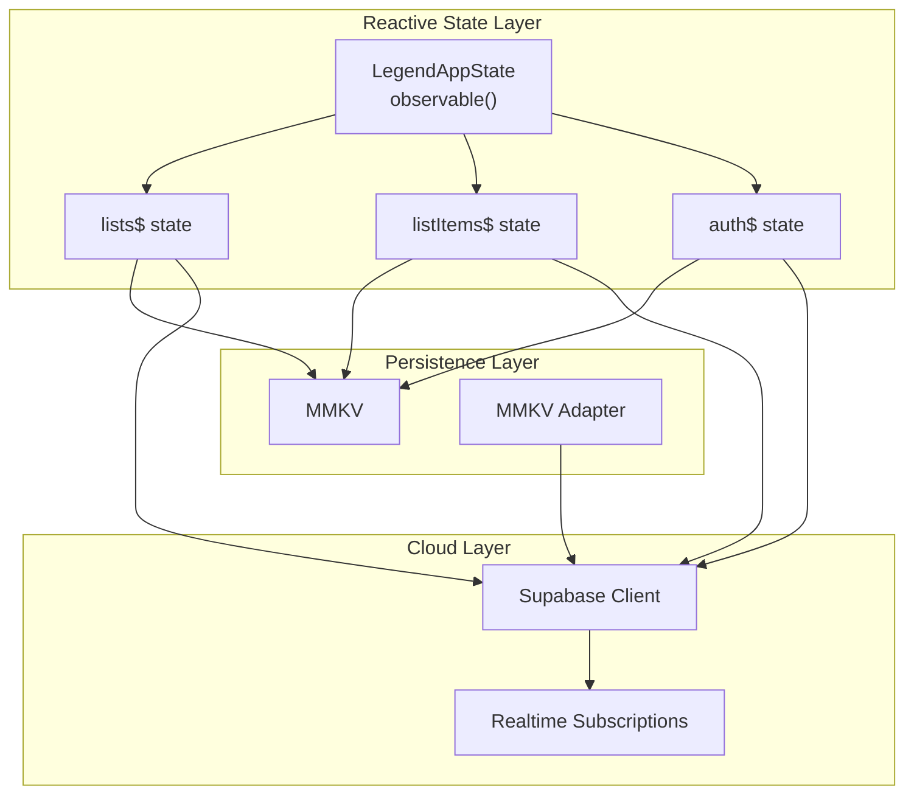

**Diagram sources**
- [database.ts:13-29](file://src/data/database.ts#L13-L29)
- [lists.ts:5-26](file://src/data/states/lists.ts#L5-L26)
- [list-items.ts:5-23](file://src/data/states/list-items.ts#L5-L23)
- [auth.ts:22-33](file://src/data/states/auth.ts#L22-L33)
- [supabase.ts:21-28](file://src/lib/supabase/supabase.ts#L21-L28)
- [storage.ts:9-23](file://src/data/storage.ts#L9-L23)

**Section sources**
- [database.ts:1-36](file://src/data/database.ts#L1-L36)
- [lists.ts:1-27](file://src/data/states/lists.ts#L1-L27)
- [list-items.ts:1-24](file://src/data/states/list-items.ts#L1-L24)
- [auth.ts:1-34](file://src/data/states/auth.ts#L1-L34)
- [supabase.ts:1-29](file://src/lib/supabase/supabase.ts#L1-L29)
- [storage.ts:1-74](file://src/data/storage.ts#L1-L74)

## Core Components
- Dual-storage configuration: Supabase synchronization configured with MMKV persistence and merge-mode conflict resolution.
- Reactive stores: lists$ and listItems$ observable stores bound to Supabase collections with per-user filtering and realtime subscriptions.
- Auth state: synced observable with MMKV persistence for user/session state.
- Supabase client: configured with MMKV-backed auth storage adapter for seamless offline sessions.
- Utility conversion: humps-based key conversion between camelCase and snake_case for Supabase compatibility.
- Sync service: guest-to-user data migration and prompt flow.
- Swipe gestures: optimized pan gesture configuration and swipeable item lifecycle management.

**Section sources**
- [database.ts:13-29](file://src/data/database.ts#L13-L29)
- [lists.ts:5-26](file://src/data/states/lists.ts#L5-L26)
- [list-items.ts:5-23](file://src/data/states/list-items.ts#L5-L23)
- [auth.ts:22-33](file://src/data/states/auth.ts#L22-L33)
- [supabase.ts:21-28](file://src/lib/supabase/supabase.ts#L21-L28)
- [utils.ts:3-9](file://src/lib/supabase/utils.ts#L3-L9)
- [sync.ts:41-202](file://src/services/sync.ts#L41-L202)
- [swipe-gesture.ts:10-28](file://src/lib/swipe-gesture.ts#L10-L28)
- [useSwipeableItem.ts:6-56](file://src/components/swipeable/useSwipeableItem.ts#L6-L56)

## Architecture Overview
The system implements an offline-first, real-time synchronization model:
- Local cache: MMKV persists observable stores for lists and list items.
- Cloud sync: Supabase synchronizes observable changes with remote tables.
- Conflict resolution: Merge mode ensures local edits are preserved while syncing remote changes.
- Realtime updates: Supabase Realtime subscriptions deliver server-side changes to the local store.
- Reactive UI: LegendAppState triggers automatic UI updates across devices.

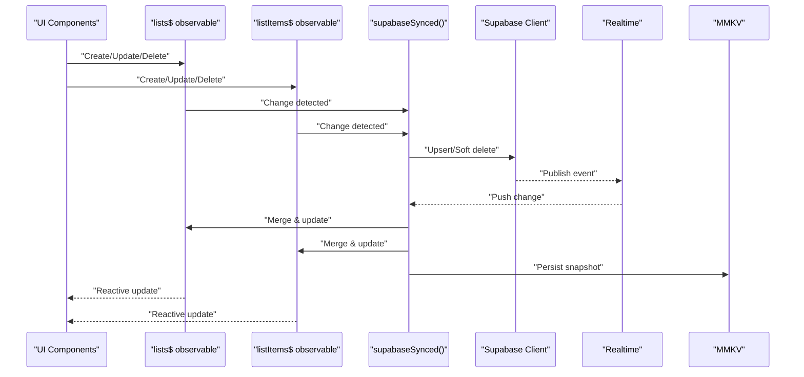

**Diagram sources**
- [database.ts:13-29](file://src/data/database.ts#L13-L29)
- [lists.ts:5-26](file://src/data/states/lists.ts#L5-L26)
- [list-items.ts:5-23](file://src/data/states/list-items.ts#L5-L23)
- [supabase.ts:21-28](file://src/lib/supabase/supabase.ts#L21-L28)

## Detailed Component Analysis

### Supabase Synchronization and Merge Mode
- Configuration: supabaseSynced wraps LegendAppState with Supabase plugin, enabling automatic persistence and synchronization.
- Persistence: MMKV plugin persists snapshots locally with retry on sync failures.
- Conflict resolution: merge mode merges remote changes with local updates, preserving local edits.
- Timestamp fields: created_at, updated_at, deleted mapped for proper change detection.
- Change window: changesSince set to last-sync to minimize bandwidth and improve performance.

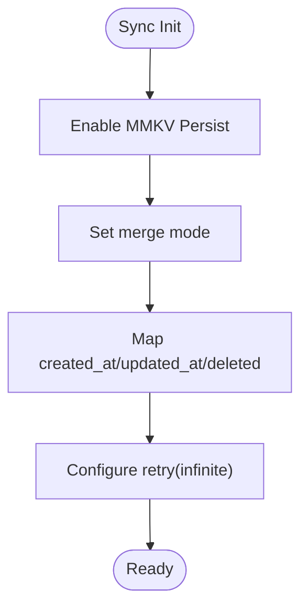

**Diagram sources**
- [database.ts:13-29](file://src/data/database.ts#L13-L29)

**Section sources**
- [database.ts:13-29](file://src/data/database.ts#L13-L29)

### Reactive Stores: Lists and List Items
- lists$: observable bound to Supabase collection "lists", filtered by profile_id, with realtime subscription and retry.
- listItems$: observable bound to "list_items", filtered by profile_id, with realtime subscription and retry.
- Both stores use snake_case payloads for Supabase and camelCase for TypeScript types via conversion utilities.

```mermaid
classDiagram
class ListsState {
+initial : Record
+collection : "lists"
+select() : QueryBuilder
+filter() : QueryBuilder
+actions : ["read","create","update","delete"]
+persist : {name : "lists"}
+realtime : {filter}
+retry : {infinite : true}
}
class ListItemsState {
+initial : Record
+collection : "list_items"
+select() : QueryBuilder
+filter() : QueryBuilder
+actions : ["read","create","update","delete"]
+persist : {name : "list_items"}
+retry : {infinite : true}
+realtime : {filter}
}
class SupabaseSynced {
+configureSynced()
+merge mode
+changesSince : "last-sync"
+fieldCreatedAt
+fieldUpdatedAt
+fieldDeleted
}
ListsState --> SupabaseSynced : "configured with"
ListItemsState --> SupabaseSynced : "configured with"
```

**Diagram sources**
- [lists.ts:5-26](file://src/data/states/lists.ts#L5-L26)
- [list-items.ts:5-23](file://src/data/states/list-items.ts#L5-L23)
- [database.ts:13-29](file://src/data/database.ts#L13-L29)

**Section sources**
- [lists.ts:5-26](file://src/data/states/lists.ts#L5-L26)
- [list-items.ts:5-23](file://src/data/states/list-items.ts#L5-L23)

### Supabase Client and MMKV Auth Storage
- Supabase client configured with MMKV-backed auth storage adapter for session persistence and auto-refresh.
- Ensures offline sessions remain valid and rehydrated after app restarts.

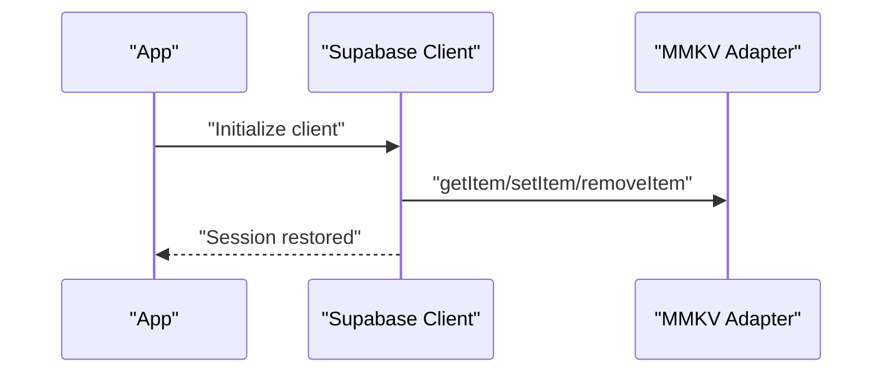

**Diagram sources**
- [supabase.ts:21-28](file://src/lib/supabase/supabase.ts#L21-L28)
- [storage.ts:65-73](file://src/data/storage.ts#L65-L73)

**Section sources**
- [supabase.ts:21-28](file://src/lib/supabase/supabase.ts#L21-L28)
- [storage.ts:9-23](file://src/data/storage.ts#L9-L23)

### Data Actions: CRUD Operations
- Lists CRUD: createNewList, updateList, deleteList operate on lists$ observable, triggering sync automatically.
- List items CRUD: createNewListItem, toggleCheckListItem, updateListItem, deleteListItem operate on listItems$ observable.
- Key conversions: convertToSupabaseFormat and convertFromSupabaseFormat ensure correct key casing for Supabase.

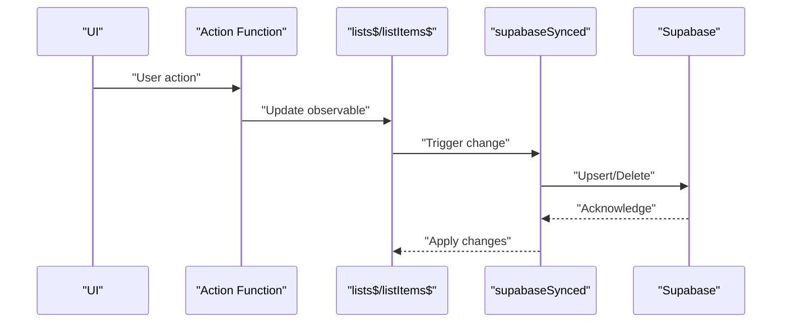

**Diagram sources**
- [lists.ts:79-122](file://src/data/actions/lists.ts#L79-L122)
- [list-items.ts:53-104](file://src/data/actions/list-items.ts#L53-L104)
- [utils.ts:3-9](file://src/lib/supabase/utils.ts#L3-L9)

**Section sources**
- [lists.ts:37-52](file://src/data/actions/lists.ts#L37-L52)
- [lists.ts:79-122](file://src/data/actions/lists.ts#L79-L122)
- [lists.ts:144-170](file://src/data/actions/lists.ts#L144-L170)
- [lists.ts:187-203](file://src/data/actions/lists.ts#L187-L203)
- [list-items.ts:18-29](file://src/data/actions/list-items.ts#L18-L29)
- [list-items.ts:34-48](file://src/data/actions/list-items.ts#L34-L48)
- [list-items.ts:53-104](file://src/data/actions/list-items.ts#L53-L104)
- [list-items.ts:109-127](file://src/data/actions/list-items.ts#L109-L127)
- [list-items.ts:132-166](file://src/data/actions/list-items.ts#L132-L166)
- [list-items.ts:171-186](file://src/data/actions/list-items.ts#L171-L186)
- [utils.ts:3-9](file://src/lib/supabase/utils.ts#L3-L9)

### Offline-First and Background Synchronization
- Local cache: MMKV persists observable snapshots for lists and list items.
- Retry strategy: infinite retry configured for both stores and supabaseSynced to recover from transient failures.
- Realtime subscriptions: per-user filters ensure only relevant events are received.
- Background sync: LegendAppState continues to queue and apply changes while offline; sync resumes upon connectivity.

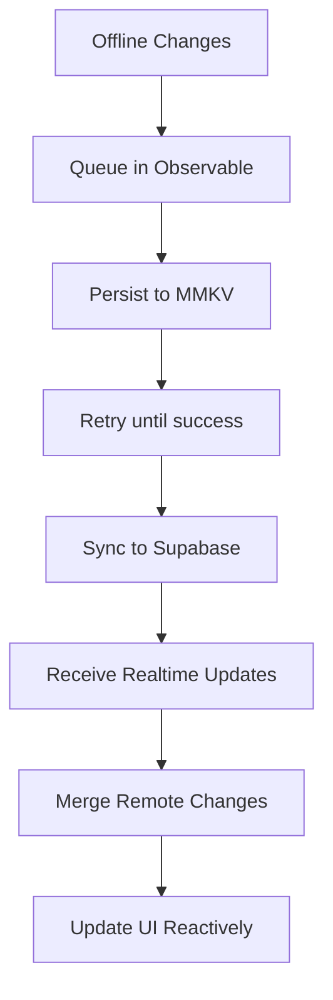

**Diagram sources**
- [database.ts:15-29](file://src/data/database.ts#L15-L29)
- [lists.ts:17-21](file://src/data/states/lists.ts#L17-L21)
- [list-items.ts:13-17](file://src/data/states/list-items.ts#L13-L17)

**Section sources**
- [database.ts:15-29](file://src/data/database.ts#L15-L29)
- [lists.ts:17-21](file://src/data/states/lists.ts#L17-L21)
- [list-items.ts:13-17](file://src/data/states/list-items.ts#L13-L17)

### Conflict Resolution and Data Consistency
- Merge mode: incoming changes are merged with local state, preserving local edits.
- Timestamp fields: created_at, updated_at, deleted support accurate change detection and ordering.
- Last-sync window: changesSince "last-sync" minimizes redundant sync work.
- Retry: infinite retry reduces risk of stale data due to transient network issues.

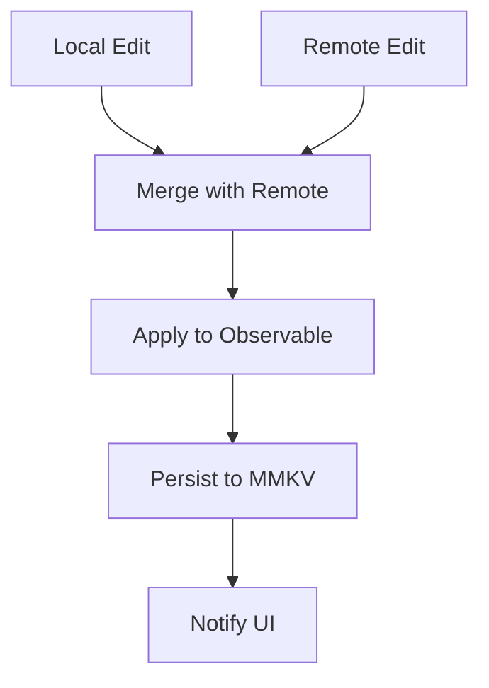

**Diagram sources**
- [database.ts:20-26](file://src/data/database.ts#L20-L26)

**Section sources**
- [database.ts:20-26](file://src/data/database.ts#L20-L26)

### Reactive State Management with LegendAppState
- enableReactTracking warns about missing reactive usage, ensuring consistent updates.
- auth$, lists$, and listItems$ observables drive UI updates automatically.
- Realtime filters ensure only relevant events update the store.

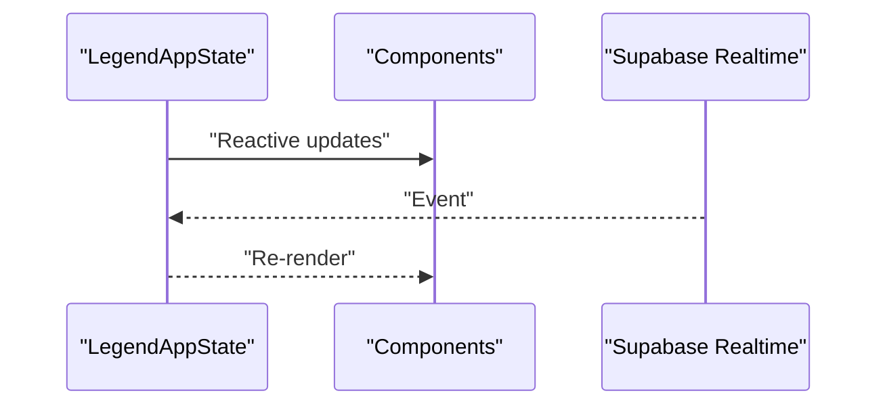

**Diagram sources**
- [database.ts:9-11](file://src/data/database.ts#L9-L11)
- [lists.ts:17-21](file://src/data/states/lists.ts#L17-L21)
- [list-items.ts:17-21](file://src/data/states/list-items.ts#L17-L21)

**Section sources**
- [database.ts:9-11](file://src/data/database.ts#L9-L11)
- [auth.ts:22-33](file://src/data/states/auth.ts#L22-L33)
- [lists.ts:17-21](file://src/data/states/lists.ts#L17-L21)
- [list-items.ts:17-21](file://src/data/states/list-items.ts#L17-L21)

### Data Migration and Recovery Procedures
- Guest-to-user migration: detects guest lists and migrates ownership to authenticated user by updating profile_id.
- User prompts: Alert-based flow informs users about pending migrations and confirms action.
- Recovery: clearing storage and resetting stores allows clean slate recovery.

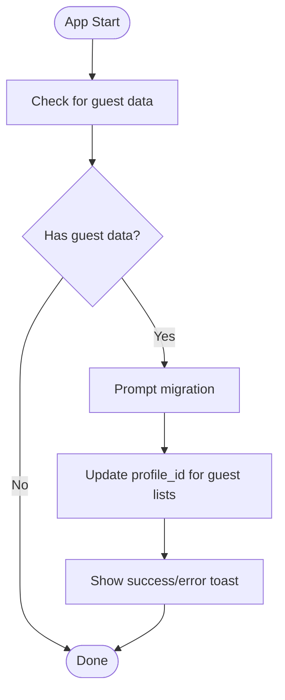

**Diagram sources**
- [sync.ts:48-60](file://src/services/sync.ts#L48-L60)
- [sync.ts:102-150](file://src/services/sync.ts#L102-L150)
- [sync.ts:166-201](file://src/services/sync.ts#L166-L201)

**Section sources**
- [sync.ts:48-60](file://src/services/sync.ts#L48-L60)
- [sync.ts:102-150](file://src/services/sync.ts#L102-L150)
- [sync.ts:166-201](file://src/services/sync.ts#L166-L201)

### Swipe Gesture Integration for Quick Actions
- Pan gesture configuration: minDistance, activeOffsetX, failOffsetY tuned for responsive feedback.
- Platform-specific hit slop: Android and iOS ratios adjust touch area sensitivity.
- Swipeable lifecycle: centralized handler manages open/close state and prevents multiple simultaneous swipes.

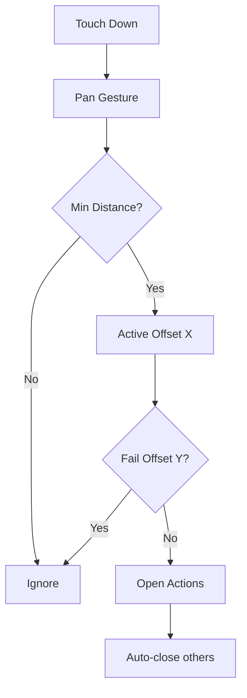

**Diagram sources**
- [swipe-gesture.ts:10-26](file://src/lib/swipe-gesture.ts#L10-L26)
- [useSwipeableItem.ts:6-56](file://src/components/swipeable/useSwipeableItem.ts#L6-L56)

**Section sources**
- [swipe-gesture.ts:10-26](file://src/lib/swipe-gesture.ts#L10-L26)
- [useSwipeableItem.ts:6-56](file://src/components/swipeable/useSwipeableItem.ts#L6-L56)

## Dependency Analysis
The following diagram shows how core modules depend on each other to achieve offline-first synchronization.

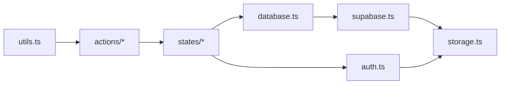

**Diagram sources**
- [utils.ts:3-9](file://src/lib/supabase/utils.ts#L3-L9)
- [lists.ts:1-211](file://src/data/actions/lists.ts#L1-L211)
- [list-items.ts:1-193](file://src/data/actions/list-items.ts#L1-L193)
- [lists.ts:1-27](file://src/data/states/lists.ts#L1-L27)
- [list-items.ts:1-24](file://src/data/states/list-items.ts#L1-L24)
- [database.ts:1-36](file://src/data/database.ts#L1-L36)
- [supabase.ts:1-29](file://src/lib/supabase/supabase.ts#L1-L29)
- [storage.ts:1-74](file://src/data/storage.ts#L1-L74)
- [auth.ts:1-34](file://src/data/states/auth.ts#L1-L34)

**Section sources**
- [utils.ts:3-9](file://src/lib/supabase/utils.ts#L3-L9)
- [lists.ts:1-211](file://src/data/actions/lists.ts#L1-L211)
- [list-items.ts:1-193](file://src/data/actions/list-items.ts#L1-L193)
- [lists.ts:1-27](file://src/data/states/lists.ts#L1-L27)
- [list-items.ts:1-24](file://src/data/states/list-items.ts#L1-L24)
- [database.ts:1-36](file://src/data/database.ts#L1-L36)
- [supabase.ts:1-29](file://src/lib/supabase/supabase.ts#L1-L29)
- [storage.ts:1-74](file://src/data/storage.ts#L1-L74)
- [auth.ts:1-34](file://src/data/states/auth.ts#L1-L34)

## Performance Considerations
- Merge mode reduces conflicts and network overhead by applying incremental changes.
- changesSince "last-sync" limits sync scope to recent changes.
- Infinite retry improves resilience but should be monitored to avoid excessive background work.
- Realtime subscriptions filter by profile_id to minimize event volume.
- Large dataset optimization: prefer paginated queries and selective field retrieval; leverage indexes on profile_id and timestamps in Supabase.
- Key conversion utilities reduce payload mismatches and improve reliability.

[No sources needed since this section provides general guidance]

## Troubleshooting Guide
- No data visible offline: verify MMKV persistence is enabled and storage keys exist.
- Sync not resuming: check retry configuration and network connectivity; inspect logs for persistent failures.
- Conflicts appear: confirm merge mode is active and timestamps are being updated.
- Realtime not updating: ensure realtime filter matches current user and connection is established.
- Migration failures: review guest data presence and user authentication state before migration.

**Section sources**
- [database.ts:15-29](file://src/data/database.ts#L15-L29)
- [lists.ts:17-21](file://src/data/states/lists.ts#L17-L21)
- [list-items.ts:13-17](file://src/data/states/list-items.ts#L13-L17)
- [sync.ts:166-201](file://src/services/sync.ts#L166-L201)

## Conclusion
The application achieves robust offline-first synchronization by combining LegendAppState’s reactive stores with Supabase’s real-time capabilities and MMKV’s local persistence. Merge-mode conflict resolution, targeted realtime filters, and infinite retry ensure consistent, resilient data across devices. The migration service and storage utilities provide practical recovery and maintenance pathways. Swipe gestures enhance usability for quick actions, while performance tuning supports large datasets.

[No sources needed since this section summarizes without analyzing specific files]

## Appendices
- Backup strategies: export store snapshots to MMKV and periodically back up MMKV container (platform-specific).
- Recovery procedures: clear storage and reset stores to restore clean state; rely on sync to rebuild from cloud.

[No sources needed since this section provides general guidance]