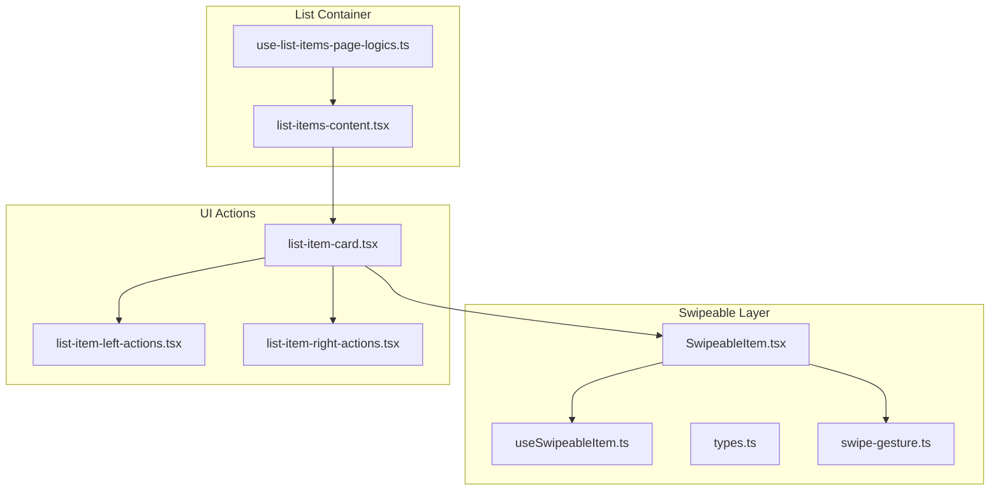
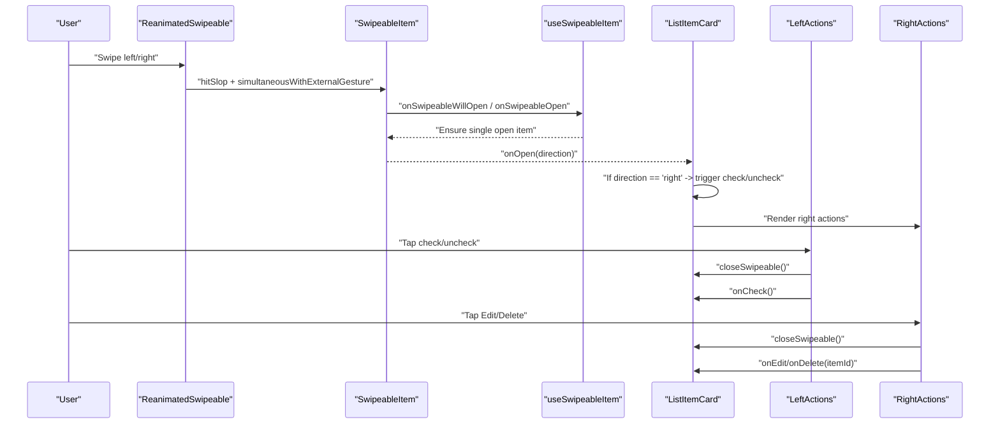
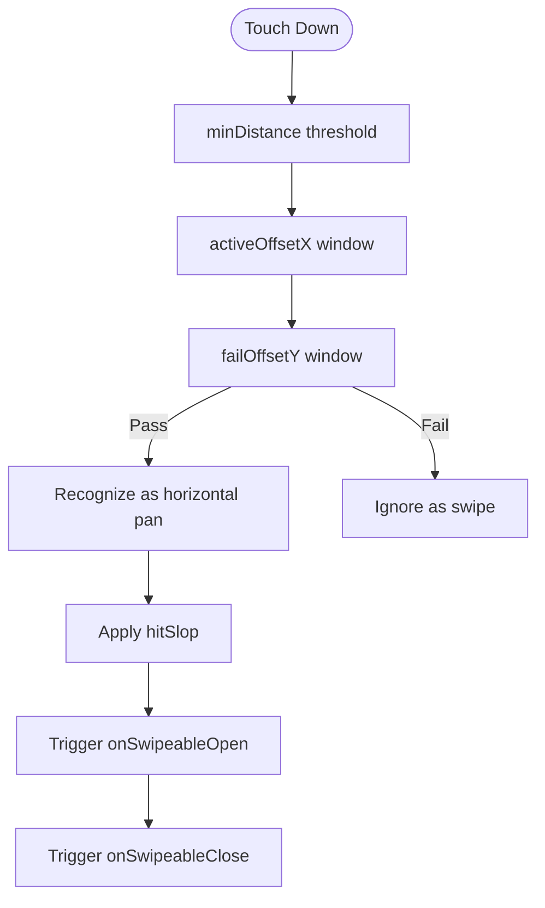
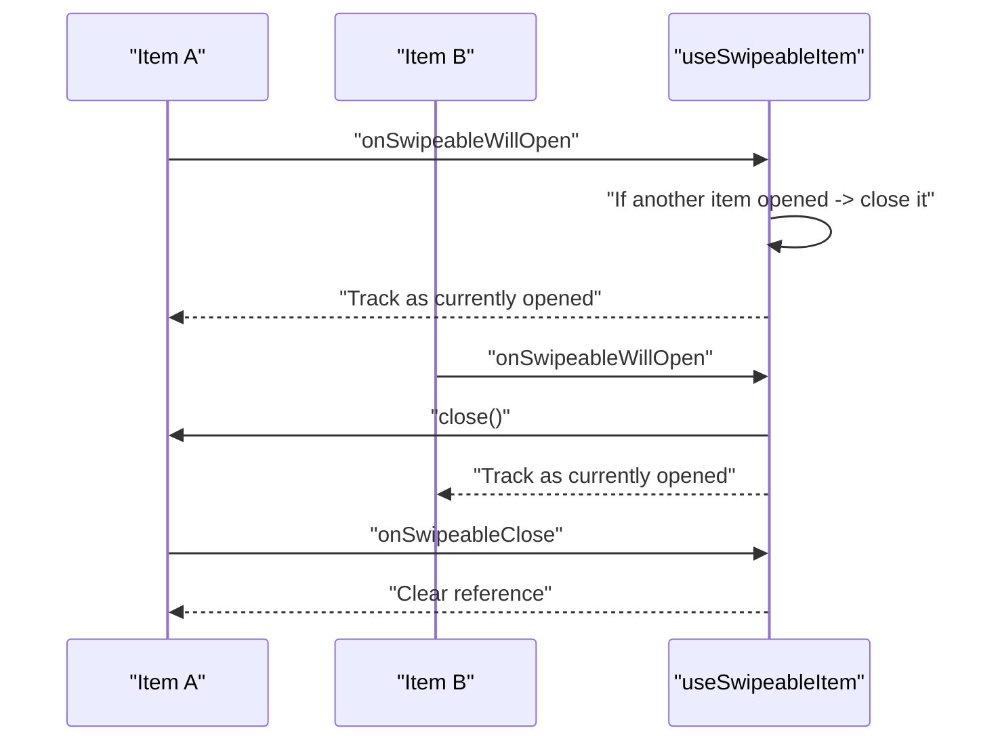
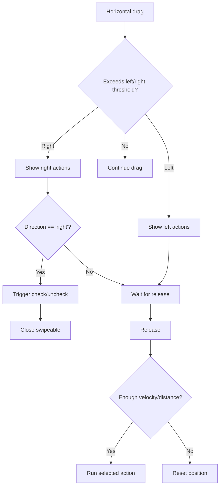
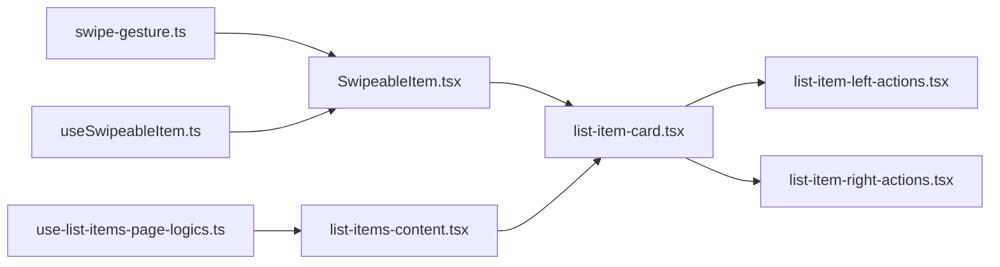

# Gesture Controls and Interactions

<cite>
**Referenced Files in This Document**
- [SwipeableItem.tsx](file://src/components/swipeable/SwipeableItem.tsx)
- [useSwipeableItem.ts](file://src/components/swipeable/useSwipeableItem.ts)
- [types.ts](file://src/components/swipeable/types.ts)
- [swipe-gesture.ts](file://src/lib/swipe-gesture.ts)
- [list-item-card.tsx](file://src/features/list/components/list-item-card.tsx)
- [list-item-left-actions.tsx](file://src/features/list/components/list-item-left-actions.tsx)
- [list-item-right-actions.tsx](file://src/features/list/components/list-item-right-actions.tsx)
- [list-items-content.tsx](file://src/features/list/components/list-items-content.tsx)
- [use-list-items-page-logics.ts](file://src/features/list/hooks/use-list-items-page-logics.ts)
- [card-list-right-actions.tsx](file://src/features/lists/components/card-list-right-actions.tsx)
- [react-native-reanimated.cjs](file://__mocks__/react-native-reanimated.cjs)
- [package.json](file://package.json)
</cite>

## Table of Contents
1. [Introduction](#introduction)
2. [Project Structure](#project-structure)
3. [Core Components](#core-components)
4. [Architecture Overview](#architecture-overview)
5. [Detailed Component Analysis](#detailed-component-analysis)
6. [Dependency Analysis](#dependency-analysis)
7. [Performance Considerations](#performance-considerations)
8. [Troubleshooting Guide](#troubleshooting-guide)
9. [Conclusion](#conclusion)
10. [Appendices](#appendices)

## Introduction
This document explains the gesture-based interactions for item management, focusing on swipe-to-action functionality. It covers left and right swipe gestures for quick actions such as check/uncheck and edit/delete operations, the swipe animation system, threshold detection, and action execution timing. It also documents the integration with React Native Gesture Handler and Reanimated for smooth animations, gesture customization, action mapping, accessibility considerations for users with motor impairments, and performance optimizations for large item lists.

## Project Structure
The gesture system is composed of:
- A reusable SwipeableItem wrapper around ReanimatedSwipeable
- A hook that manages open/close lifecycle and global single-open behavior
- Gesture configuration utilities for platform-specific thresholds and hit slop
- List item cards that define left/right actions and thresholds
- Action components for check/uncheck and edit/delete
- A list container that coordinates scroll and closing of swiped items

**Diagram sources**
- [SwipeableItem.tsx:1-39](file://src/components/swipeable/SwipeableItem.tsx#L1-L39)
- [useSwipeableItem.ts:1-64](file://src/components/swipeable/useSwipeableItem.ts#L1-L64)
- [types.ts:1-39](file://src/components/swipeable/types.ts#L1-L39)
- [swipe-gesture.ts:1-29](file://src/lib/swipe-gesture.ts#L1-L29)
- [list-item-card.tsx:1-142](file://src/features/list/components/list-item-card.tsx#L1-L142)
- [list-item-left-actions.tsx:1-51](file://src/features/list/components/list-item-left-actions.tsx#L1-L51)
- [list-item-right-actions.tsx:1-54](file://src/features/list/components/list-item-right-actions.tsx#L1-L54)
- [list-items-content.tsx:1-57](file://src/features/list/components/list-items-content.tsx#L1-L57)
- [use-list-items-page-logics.ts:1-124](file://src/features/list/hooks/use-list-items-page-logics.ts#L1-L124)

**Section sources**
- [SwipeableItem.tsx:1-39](file://src/components/swipeable/SwipeableItem.tsx#L1-L39)
- [useSwipeableItem.ts:1-64](file://src/components/swipeable/useSwipeableItem.ts#L1-L64)
- [swipe-gesture.ts:1-29](file://src/lib/swipe-gesture.ts#L1-L29)
- [list-item-card.tsx:1-142](file://src/features/list/components/list-item-card.tsx#L1-L142)
- [list-items-content.tsx:1-57](file://src/features/list/components/list-items-content.tsx#L1-L57)

## Core Components
- SwipeableItem: A forwardRef wrapper around ReanimatedSwipeable that injects gesture guards, hitSlop, and lifecycle handlers. It exposes a close method via imperative handle.
- useSwipeableItem: Manages open/close callbacks, ensures only one item remains open at a time, and cleans up references on unmount.
- swipe-gesture utilities: Provide platform-aware hitSlop calculation and a pan gesture guard to improve swipe recognition robustness.
- List item card: Defines thresholds, overshoot behavior, and renders left/right action panels. It wires swipe direction to actions (e.g., right swipe triggers check/uncheck).
- Action components: Left action toggles item status; right action panel offers Edit/Delete.

**Section sources**
- [SwipeableItem.tsx:10-38](file://src/components/swipeable/SwipeableItem.tsx#L10-L38)
- [useSwipeableItem.ts:6-56](file://src/components/swipeable/useSwipeableItem.ts#L6-L56)
- [swipe-gesture.ts:10-26](file://src/lib/swipe-gesture.ts#L10-L26)
- [list-item-card.tsx:36-90](file://src/features/list/components/list-item-card.tsx#L36-L90)
- [list-item-left-actions.tsx:18-47](file://src/features/list/components/list-item-left-actions.tsx#L18-L47)
- [list-item-right-actions.tsx:16-49](file://src/features/list/components/list-item-right-actions.tsx#L16-L49)

## Architecture Overview
The gesture pipeline integrates gesture recognition, lifecycle management, and UI rendering:

**Diagram sources**
- [SwipeableItem.tsx:19-32](file://src/components/swipeable/SwipeableItem.tsx#L19-L32)
- [useSwipeableItem.ts:11-37](file://src/components/swipeable/useSwipeableItem.ts#L11-L37)
- [list-item-card.tsx:42-75](file://src/features/list/components/list-item-card.tsx#L42-L75)
- [list-item-left-actions.tsx:25-28](file://src/features/list/components/list-item-left-actions.tsx#L25-L28)
- [list-item-right-actions.tsx:22-30](file://src/features/list/components/list-item-right-actions.tsx#L22-L30)

## Detailed Component Analysis

### SwipeableItem and Gesture Integration
- Gesture guard: A Pan gesture configured with minimum distance and active/fail offsets prevents accidental activation and improves vertical scroll handling.
- HitSlop: Platform-specific left hitSlop allows touch initiation near the screen edge, improving discoverability and usability.
- Lifecycle handlers: The component forwards open/close events to the parent while ensuring mutual exclusivity of opened items.

**Diagram sources**
- [swipe-gesture.ts:10-14](file://src/lib/swipe-gesture.ts#L10-L14)
- [swipe-gesture.ts:16-26](file://src/lib/swipe-gesture.ts#L16-L26)
- [SwipeableItem.tsx:16-32](file://src/components/swipeable/SwipeableItem.tsx#L16-L32)

**Section sources**
- [swipe-gesture.ts:10-26](file://src/lib/swipe-gesture.ts#L10-L26)
- [SwipeableItem.tsx:16-32](file://src/components/swipeable/SwipeableItem.tsx#L16-L32)

### SwipeableItem Lifecycle Management
- Single-open behavior: When a new item opens, any previously opened item is closed automatically.
- Cleanup: References are cleared on unmount to avoid leaks.

**Diagram sources**
- [useSwipeableItem.ts:11-37](file://src/components/swipeable/useSwipeableItem.ts#L11-L37)

**Section sources**
- [useSwipeableItem.ts:6-56](file://src/components/swipeable/useSwipeableItem.ts#L6-L56)

### List Item Card: Thresholds, Overshoot, and Action Mapping
- Thresholds: Defined per side to control when actions become visible.
- Overshoot: Enables elastic effect beyond thresholds for tactile feedback.
- Directional action: Right swipe triggers immediate check/uncheck; left swipe reveals status toggle; right action panel provides Edit/Delete.

**Diagram sources**
- [list-item-card.tsx:42-75](file://src/features/list/components/list-item-card.tsx#L42-L75)
- [list-item-left-actions.tsx:25-28](file://src/features/list/components/list-item-left-actions.tsx#L25-L28)
- [list-item-right-actions.tsx:22-30](file://src/features/list/components/list-item-right-actions.tsx#L22-L30)

**Section sources**
- [list-item-card.tsx:36-90](file://src/features/list/components/list-item-card.tsx#L36-L90)

### Action Components: Check/Uncheck and Edit/Delete
- Left action: Toggle item status; closes swipeable and invokes parent handler.
- Right action panel: Provides Edit and Delete actions; closes swipeable and invokes parent handlers with item ID.

**Section sources**
- [list-item-left-actions.tsx:18-47](file://src/features/list/components/list-item-left-actions.tsx#L18-L47)
- [list-item-right-actions.tsx:16-49](file://src/features/list/components/list-item-right-actions.tsx#L16-L49)

### List Container: Scroll and Global Close
- The list container listens to scroll start to programmatically close any open swipeable, preventing accidental interactions during scrolling.
- Uses a virtualized list with estimated sizes and draw distance for performance.

**Section sources**
- [list-items-content.tsx:30-32](file://src/features/list/components/list-items-content.tsx#L30-L32)
- [list-items-content.tsx:35-52](file://src/features/list/components/list-items-content.tsx#L35-L52)

### Accessibility Considerations
- Motor impairments: Provide larger hit areas and adjustable thresholds. Ensure sufficient contrast and clear affordance for actions.
- Alternative controls: Offer keyboard or voice commands to perform the same actions as swipe gestures.
- Feedback: Use haptic or audible cues when actions are triggered.
- Focus management: Ensure focused elements are reachable without requiring swipe gestures.

[No sources needed since this section provides general guidance]

## Dependency Analysis
- External libraries:
  - react-native-gesture-handler: Provides ReanimatedSwipeable and gesture primitives.
  - react-native-reanimated: Powers animations and shared values for smooth motion.
- Internal dependencies:
  - swipe-gesture utilities feed into SwipeableItem.
  - useSwipeableItem orchestrates lifecycle and global state.
  - List item components consume thresholds and action handlers.

**Diagram sources**
- [swipe-gesture.ts:10-26](file://src/lib/swipe-gesture.ts#L10-L26)
- [SwipeableItem.tsx:16-32](file://src/components/swipeable/SwipeableItem.tsx#L16-L32)
- [useSwipeableItem.ts:11-37](file://src/components/swipeable/useSwipeableItem.ts#L11-L37)
- [list-item-card.tsx:36-90](file://src/features/list/components/list-item-card.tsx#L36-L90)
- [list-items-content.tsx:35-52](file://src/features/list/components/list-items-content.tsx#L35-L52)
- [use-list-items-page-logics.ts:14-123](file://src/features/list/hooks/use-list-items-page-logics.ts#L14-L123)

**Section sources**
- [package.json:72-76](file://package.json#L72-L76)
- [swipe-gesture.ts:1-29](file://src/lib/swipe-gesture.ts#L1-L29)
- [SwipeableItem.tsx:1-39](file://src/components/swipeable/SwipeableItem.tsx#L1-L39)
- [useSwipeableItem.ts:1-64](file://src/components/swipeable/useSwipeableItem.ts#L1-L64)
- [list-item-card.tsx:1-142](file://src/features/list/components/list-item-card.tsx#L1-L142)
- [list-items-content.tsx:1-57](file://src/features/list/components/list-items-content.tsx#L1-L57)
- [use-list-items-page-logics.ts:1-124](file://src/features/list/hooks/use-list-items-page-logics.ts#L1-L124)

## Performance Considerations
- Virtualization: The list uses an estimated item size and draw distance to render only visible items efficiently.
- Memoization: List item components and action components are memoized to prevent unnecessary re-renders.
- Gesture optimization: Using a pan guard reduces false positives and improves responsiveness.
- Animation backend: Reanimated offloads animations to the UI thread for smoothness.

Recommendations:
- Keep action panels lightweight and avoid heavy computations inside render functions.
- Use stable callbacks and memoization for action handlers.
- Monitor memory usage with long lists; leverage recycling and proper key extraction.

**Section sources**
- [list-items-content.tsx:17-18](file://src/features/list/components/list-items-content.tsx#L17-L18)
- [list-item-card.tsx:130-139](file://src/features/list/components/list-item-card.tsx#L130-L139)

## Troubleshooting Guide
- Swipe does not trigger:
  - Verify hitSlop is applied and platform-specific ratios are correct.
  - Ensure simultaneousWithExternalGesture is set to the pan guard.
- Multiple items open simultaneously:
  - Confirm useSwipeableItem is wired and that the global reference is updated on open/close.
- Actions not firing:
  - Check that onOpen direction handling and action components’ closeSwipeable are invoked.
- Scroll conflicts:
  - Ensure the list’s scroll start handler calls closeOpenedSwipeable.

**Section sources**
- [SwipeableItem.tsx:16-32](file://src/components/swipeable/SwipeableItem.tsx#L16-L32)
- [useSwipeableItem.ts:11-37](file://src/components/swipeable/useSwipeableItem.ts#L11-L37)
- [list-items-content.tsx:30-32](file://src/features/list/components/list-items-content.tsx#L30-L32)

## Conclusion
The gesture system combines a robust gesture recognizer, lifecycle management, and platform-aware thresholds to deliver responsive swipe-to-action interactions. With virtualization, memoization, and Reanimated-backed animations, it scales to large lists while maintaining smooth UX. Action components encapsulate behavior cleanly, and the list container coordinates global state to prevent conflicts.

## Appendices

### Gesture Customization Examples
- Adjust thresholds:
  - Modify left/right thresholds in the list item card to fine-tune when actions appear.
- Overshoot and friction:
  - Tune overshoot and overshootFriction for tactile feedback and bounce behavior.
- HitSlop and pan guard:
  - Customize hitSlop ratios and pan guard parameters for different devices and orientations.

**Section sources**
- [list-item-card.tsx:80-87](file://src/features/list/components/list-item-card.tsx#L80-L87)
- [swipe-gesture.ts:16-26](file://src/lib/swipe-gesture.ts#L16-L26)
- [swipe-gesture.ts:10-14](file://src/lib/swipe-gesture.ts#L10-L14)

### Action Mapping Reference
- Right swipe:
  - Triggers immediate check/uncheck via onOpen direction handling.
- Left actions:
  - Toggle item status; closes swipeable and invokes parent handler.
- Right actions:
  - Edit/Delete; closes swipeable and invokes handlers with item ID.

**Section sources**
- [list-item-card.tsx:42-75](file://src/features/list/components/list-item-card.tsx#L42-L75)
- [list-item-left-actions.tsx:25-28](file://src/features/list/components/list-item-left-actions.tsx#L25-L28)
- [list-item-right-actions.tsx:22-30](file://src/features/list/components/list-item-right-actions.tsx#L22-L30)

### Accessibility Checklist
- Provide keyboard shortcuts for check/uncheck, edit, and delete.
- Ensure high contrast and large touch targets for actions.
- Add audible/haptic feedback for gesture completion.
- Allow disabling gestures for users who need alternative input methods.

[No sources needed since this section provides general guidance]