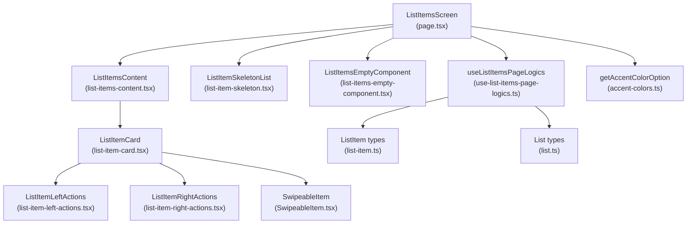
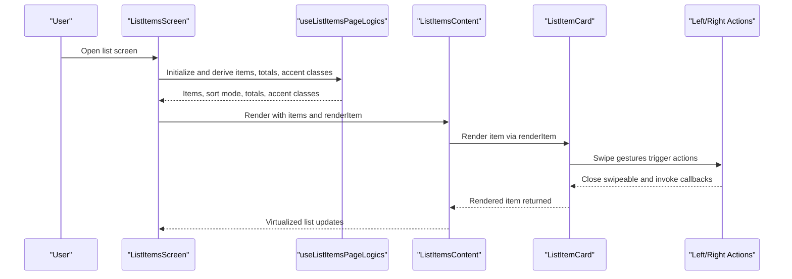
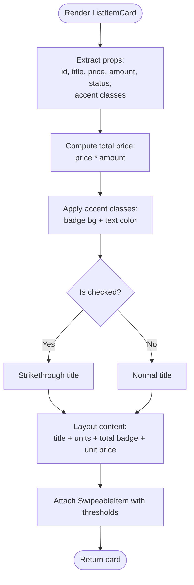
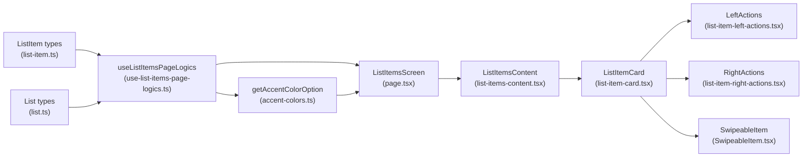

# Item Display and Rendering

<cite>
**Referenced Files in This Document**
- [list-item-card.tsx](file://src/features/list/components/list-item-card.tsx)
- [list-item-left-actions.tsx](file://src/features/list/components/list-item-left-actions.tsx)
- [list-item-right-actions.tsx](file://src/features/list/components/list-item-right-actions.tsx)
- [list-item-skeleton.tsx](file://src/features/list/components/list-item-skeleton.tsx)
- [list-items-empty-component.tsx](file://src/features/list/components/list-items-empty-component.tsx)
- [list-items-content.tsx](file://src/features/list/components/list-items-content.tsx)
- [page.tsx](file://src/features/list/page.tsx)
- [use-list-items-page-logics.ts](file://src/features/list/hooks/use-list-items-page-logics.ts)
- [SwipeableItem.tsx](file://src/components/swipeable/SwipeableItem.tsx)
- [use-gradual-animation.tsx](file://src/hooks/use-gradual-animation.tsx)
- [accent-colors.ts](file://src/features/lists/utils/accent-colors.ts)
- [list-item.ts](file://src/data/types/list-item.ts)
- [list.ts](file://src/data/types/list.ts)
</cite>

## Table of Contents
1. [Introduction](#introduction)
2. [Project Structure](#project-structure)
3. [Core Components](#core-components)
4. [Architecture Overview](#architecture-overview)
5. [Detailed Component Analysis](#detailed-component-analysis)
6. [Dependency Analysis](#dependency-analysis)
7. [Performance Considerations](#performance-considerations)
8. [Troubleshooting Guide](#troubleshooting-guide)
9. [Conclusion](#conclusion)

## Introduction
This document explains how list items are displayed and rendered in the list interface. It covers the ListItemCard component architecture, visual hierarchy, typography scaling, responsive design patterns, skeleton loading for perceived performance, empty state handling, gradual animations, conditional rendering based on item status, dynamic styling via accent colors, and performance optimizations such as virtualization and memoization.

## Project Structure
The list item rendering pipeline centers around a screen page that orchestrates data, UI, and interactions, delegating item rendering to a virtualized list container and individual item cards. Swipe gestures enable contextual actions, while skeleton loaders and empty states improve UX during data transitions.

**Diagram sources**
- [page.tsx:18-155](file://src/features/list/page.tsx#L18-L155)
- [list-items-content.tsx:20-54](file://src/features/list/components/list-items-content.tsx#L20-L54)
- [list-item-card.tsx:24-128](file://src/features/list/components/list-item-card.tsx#L24-L128)
- [list-item-left-actions.tsx:18-50](file://src/features/list/components/list-item-left-actions.tsx#L18-L50)
- [list-item-right-actions.tsx:16-53](file://src/features/list/components/list-item-right-actions.tsx#L16-L53)
- [SwipeableItem.tsx:10-38](file://src/components/swipeable/SwipeableItem.tsx#L10-L38)
- [use-list-items-page-logics.ts:14-123](file://src/features/list/hooks/use-list-items-page-logics.ts#L14-L123)
- [accent-colors.ts:80-83](file://src/features/lists/utils/accent-colors.ts#L80-L83)
- [list-item.ts:1-38](file://src/data/types/list-item.ts#L1-L38)
- [list.ts:1-41](file://src/data/types/list.ts#L1-L41)

**Section sources**
- [page.tsx:18-155](file://src/features/list/page.tsx#L18-L155)
- [list-items-content.tsx:20-54](file://src/features/list/components/list-items-content.tsx#L20-L54)

## Core Components
- ListItemCard: Renders a single list item with swipeable actions, conditional status styling, and dynamic accent colors.
- ListItemsContent: Virtualized list container using a Legend list with estimated sizes, draw distance, and recycling.
- ListItemSkeleton and ListItemSkeletonList: Skeleton placeholders for initial load and batch rendering.
- ListItemsEmptyComponent: Friendly empty state with a call-to-action styled with accent colors.
- SwipeableItem: Gesture wrapper enabling left/right swipe actions with thresholds and overshoot.
- useListItemsPageLogics: Orchestrates data fetching, filtering, sorting, totals, and accent color derivation.

**Section sources**
- [list-item-card.tsx:24-142](file://src/features/list/components/list-item-card.tsx#L24-L142)
- [list-items-content.tsx:20-57](file://src/features/list/components/list-items-content.tsx#L20-L57)
- [list-item-skeleton.tsx:5-26](file://src/features/list/components/list-item-skeleton.tsx#L5-L26)
- [list-items-empty-component.tsx:10-24](file://src/features/list/components/list-items-empty-component.tsx#L10-L24)
- [SwipeableItem.tsx:10-38](file://src/components/swipeable/SwipeableItem.tsx#L10-L38)
- [use-list-items-page-logics.ts:14-123](file://src/features/list/hooks/use-list-items-page-logics.ts#L14-L123)

## Architecture Overview
The list interface composes a screen that manages state and passes data down to a virtualized list. Each item is rendered by a memoized card component that applies conditional styles and gesture-driven actions. Skeleton loaders and an empty component provide UX continuity during async operations.

**Diagram sources**
- [page.tsx:18-155](file://src/features/list/page.tsx#L18-L155)
- [use-list-items-page-logics.ts:14-123](file://src/features/list/hooks/use-list-items-page-logics.ts#L14-L123)
- [list-items-content.tsx:20-54](file://src/features/list/components/list-items-content.tsx#L20-L54)
- [list-item-card.tsx:24-128](file://src/features/list/components/list-item-card.tsx#L24-L128)
- [list-item-left-actions.tsx:18-50](file://src/features/list/components/list-item-left-actions.tsx#L18-L50)
- [list-item-right-actions.tsx:16-53](file://src/features/list/components/list-item-right-actions.tsx#L16-L53)

## Detailed Component Analysis

### ListItemCard: Visual Hierarchy, Typography, and Conditional Rendering
- Visual hierarchy:
  - Left area: Title with optional strikethrough when checked; unit count below title.
  - Center: Flexible spacing to align content.
  - Right area: Total price badge with accent background/foreground; unit price below.
- Typography scaling:
  - Title uses a base-semibold size; muted text for unit count and unit price.
  - Badge text is bold and compact for dense presentation.
- Conditional rendering:
  - Title shows a fallback when missing.
  - Strikethrough applied when item is checked.
  - Left action button text and icon change based on current status.
- Dynamic styling:
  - Accent background and foreground classes applied to badge and button text.
- Swipe gestures:
  - Right swipe triggers check/uncheck; left swipe opens contextual actions.

**Diagram sources**
- [list-item-card.tsx:24-128](file://src/features/list/components/list-item-card.tsx#L24-L128)
- [list-item-left-actions.tsx:18-50](file://src/features/list/components/list-item-left-actions.tsx#L18-L50)
- [list-item-right-actions.tsx:16-53](file://src/features/list/components/list-item-right-actions.tsx#L16-L53)

**Section sources**
- [list-item-card.tsx:24-142](file://src/features/list/components/list-item-card.tsx#L24-L142)
- [list-item-left-actions.tsx:18-50](file://src/features/list/components/list-item-left-actions.tsx#L18-L50)
- [list-item-right-actions.tsx:16-53](file://src/features/list/components/list-item-right-actions.tsx#L16-L53)

### SwipeableItem: Gesture Handling and Thresholds
- Provides a swipeable container with configurable thresholds, drag offsets, and overshoot behavior.
- Exposes a ref method to programmatically close opened actions.
- Integrates with gesture handlers and window-aware hit slop for responsive touch zones.

**Section sources**
- [SwipeableItem.tsx:10-38](file://src/components/swipeable/SwipeableItem.tsx#L10-L38)

### ListItemsContent: Virtualization and Empty State
- Uses a Legend list with:
  - Estimated item size and draw distance for efficient offscreen rendering.
  - Recycling enabled to minimize DOM churn.
  - Key extractor and extra data to avoid unnecessary re-renders.
- Handles scroll start to close any open swipeable panels.
- Renders an empty component when the list is empty, passing accent classes for consistent theming.

**Section sources**
- [list-items-content.tsx:20-57](file://src/features/list/components/list-items-content.tsx#L20-L57)

### Skeleton Loading System
- Single item skeleton: Placeholder row with avatar and text lines.
- Batch skeleton list: Repeats skeletons for initial load or when data is unavailable.
- Used in the screen to indicate loading state until items are ready.

**Section sources**
- [list-item-skeleton.tsx:5-26](file://src/features/list/components/list-item-skeleton.tsx#L5-L26)
- [page.tsx:82](file://src/features/list/page.tsx#L82)

### Empty State Handling
- Empty component displays a themed call-to-action and guidance message.
- Themed with accent background and foreground classes for brand consistency.

**Section sources**
- [list-items-empty-component.tsx:10-24](file://src/features/list/components/list-items-empty-component.tsx#L10-L24)
- [list-items-content.tsx:46-51](file://src/features/list/components/list-items-content.tsx#L46-L51)

### Gradual Animation System
- Hook exposes a shared value tracking keyboard height to drive gradual animations.
- Useful for adjusting layout spacing during keyboard appearance.

**Section sources**
- [use-gradual-animation.tsx:4-20](file://src/hooks/use-gradual-animation.tsx#L4-L20)

### Dynamic Styling Based on Accent Colors
- Accent color tokens define semantic color sets.
- Utilities derive card background and foreground classes from a chosen token.
- Page logics compute accent classes from the current list’s accent color and pass them to item components.

**Section sources**
- [accent-colors.ts:1-93](file://src/features/lists/utils/accent-colors.ts#L1-L93)
- [use-list-items-page-logics.ts:79-82](file://src/features/list/hooks/use-list-items-page-logics.ts#L79-L82)
- [list-item-card.tsx:30-32](file://src/features/list/components/list-item-card.tsx#L30-L32)

### Responsive Design Patterns
- Window-aware hit slop and gesture guards adapt to device width.
- Swipe thresholds and drag offsets tuned per direction for predictable interactions.
- Skeleton placeholders scale proportionally to device width.

**Section sources**
- [SwipeableItem.tsx:14-17](file://src/components/swipeable/SwipeableItem.tsx#L14-L17)
- [list-item-card.tsx:77-90](file://src/features/list/components/list-item-card.tsx#L77-L90)
- [list-item-skeleton.tsx:7-14](file://src/features/list/components/list-item-skeleton.tsx#L7-L14)

## Dependency Analysis
The rendering pipeline depends on:
- Data types for items and lists.
- Page logics for derived state and totals.
- Utility functions for accent colors and formatting.
- Virtualized list for performance and empty state handling.

**Diagram sources**
- [list-item.ts:1-38](file://src/data/types/list-item.ts#L1-L38)
- [list.ts:1-41](file://src/data/types/list.ts#L1-L41)
- [use-list-items-page-logics.ts:14-123](file://src/features/list/hooks/use-list-items-page-logics.ts#L14-L123)
- [accent-colors.ts:80-83](file://src/features/lists/utils/accent-colors.ts#L80-L83)
- [page.tsx:18-155](file://src/features/list/page.tsx#L18-L155)
- [list-items-content.tsx:20-54](file://src/features/list/components/list-items-content.tsx#L20-L54)
- [list-item-card.tsx:24-128](file://src/features/list/components/list-item-card.tsx#L24-L128)
- [list-item-left-actions.tsx:18-50](file://src/features/list/components/list-item-left-actions.tsx#L18-L50)
- [list-item-right-actions.tsx:16-53](file://src/features/list/components/list-item-right-actions.tsx#L16-L53)
- [SwipeableItem.tsx:10-38](file://src/components/swipeable/SwipeableItem.tsx#L10-L38)

**Section sources**
- [list-item.ts:1-38](file://src/data/types/list-item.ts#L1-L38)
- [list.ts:1-41](file://src/data/types/list.ts#L1-L41)
- [use-list-items-page-logics.ts:14-123](file://src/features/list/hooks/use-list-items-page-logics.ts#L14-L123)
- [accent-colors.ts:80-83](file://src/features/lists/utils/accent-colors.ts#L80-L83)
- [page.tsx:18-155](file://src/features/list/page.tsx#L18-L155)
- [list-items-content.tsx:20-54](file://src/features/list/components/list-items-content.tsx#L20-L54)
- [list-item-card.tsx:24-128](file://src/features/list/components/list-item-card.tsx#L24-L128)
- [list-item-left-actions.tsx:18-50](file://src/features/list/components/list-item-left-actions.tsx#L18-L50)
- [list-item-right-actions.tsx:16-53](file://src/features/list/components/list-item-right-actions.tsx#L16-L53)
- [SwipeableItem.tsx:10-38](file://src/components/swipeable/SwipeableItem.tsx#L10-L38)

## Performance Considerations
- Virtualization and recycling:
  - Estimated item size and draw distance reduce layout work.
  - Recycle items to minimize mount/unmount overhead.
- Memoization:
  - Individual item card uses React.memo with a strict equality check on props.
  - Page-level rendering function is memoized to prevent re-renders when dependencies are unchanged.
- Data normalization:
  - Items are normalized to ensure numeric defaults for price and amount.
- Gesture efficiency:
  - Pan guard and window-aware hit slop optimize gesture responsiveness.
- Lazy loading:
  - The list content is wrapped in Suspense with a skeleton fallback to defer heavy rendering.

**Section sources**
- [list-items-content.tsx:17-44](file://src/features/list/components/list-items-content.tsx#L17-L44)
- [list-item-card.tsx:130-139](file://src/features/list/components/list-item-card.tsx#L130-L139)
- [page.tsx:45-68](file://src/features/list/page.tsx#L45-L68)
- [use-list-items-page-logics.ts:22-31](file://src/features/list/hooks/use-list-items-page-logics.ts#L22-L31)
- [SwipeableItem.tsx:16-17](file://src/components/swipeable/SwipeableItem.tsx#L16-L17)
- [page.tsx:105-112](file://src/features/list/page.tsx#L105-L112)

## Troubleshooting Guide
- Items not appearing:
  - Verify list ID param and that items are filtered by list ID.
  - Confirm that the virtualized list receives non-empty data and key extractor is correct.
- Swipe actions not triggering:
  - Ensure thresholds and drag offsets are appropriate for the device width.
  - Check that the swipeable ref is attached and close is called after actions.
- Empty state not visible:
  - Confirm that ListEmptyComponent is passed and that items array is truly empty.
- Accent colors not applied:
  - Validate that the current list’s accent color resolves to a known token and that classes are computed before rendering.
- Typographic issues:
  - Ensure fallback text is present for missing titles and that muted variants are used for secondary text.

**Section sources**
- [use-list-items-page-logics.ts:15-31](file://src/features/list/hooks/use-list-items-page-logics.ts#L15-L31)
- [list-items-content.tsx:40-51](file://src/features/list/components/list-items-content.tsx#L40-L51)
- [SwipeableItem.tsx:21-23](file://src/components/swipeable/SwipeableItem.tsx#L21-L23)
- [accent-colors.ts:80-83](file://src/features/lists/utils/accent-colors.ts#L80-L83)
- [list-item-card.tsx:99-101](file://src/features/list/components/list-item-card.tsx#L99-L101)

## Conclusion
The list item rendering system combines a virtualized list, memoized item cards, gesture-driven actions, and consistent theming to deliver a responsive and accessible shopping list experience. Skeleton loaders and empty states improve perceived performance and usability, while memoization and virtualization keep large lists performant.