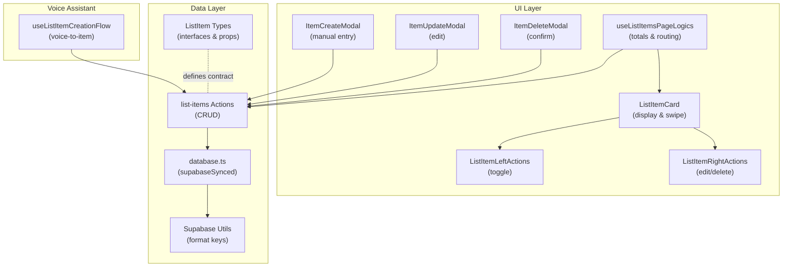
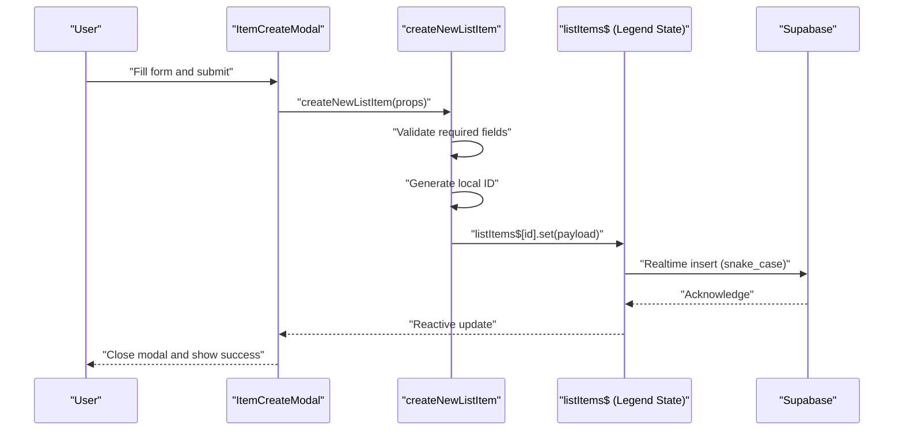
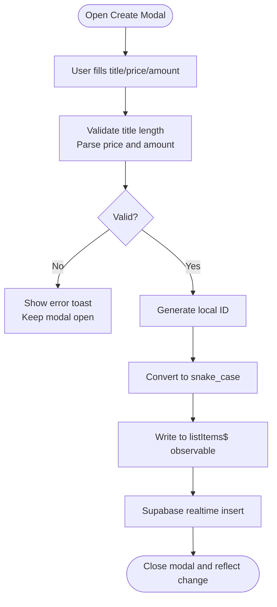
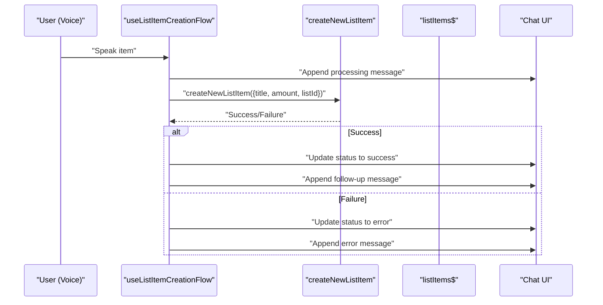
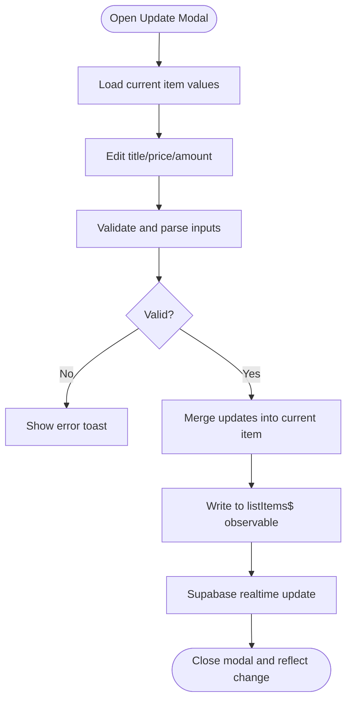
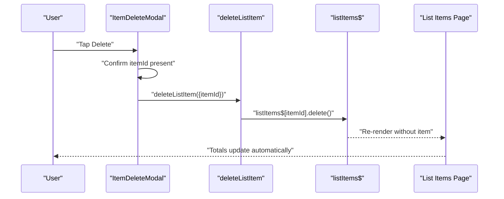
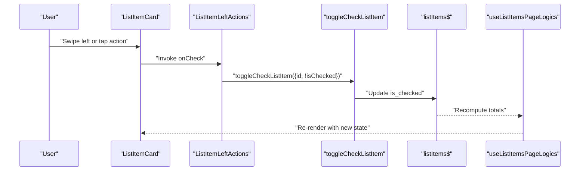
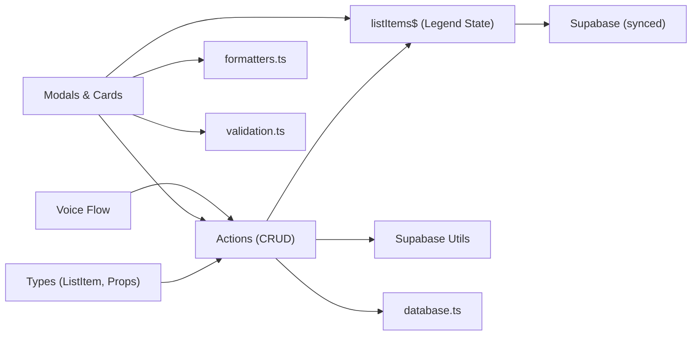

# Item Lifecycle Management

<cite>
**Referenced Files in This Document**
- [src/data/types/list-item.ts](file://src/data/types/list-item.ts)
- [src/data/states/list-items.ts](file://src/data/states/list-items.ts)
- [src/data/actions/list-items.ts](file://src/data/actions/list-items.ts)
- [src/data/database.ts](file://src/data/database.ts)
- [src/lib/supabase/utils.ts](file://src/lib/supabase/utils.ts)
- [src/data/utils.ts](file://src/data/utils.ts)
- [src/features/list/components/list-item-card.tsx](file://src/features/list/components/list-item-card.tsx)
- [src/features/list/components/list-item-left-actions.tsx](file://src/features/list/components/list-item-left-actions.tsx)
- [src/features/list/components/list-item-right-actions.tsx](file://src/features/list/components/list-item-right-actions.tsx)
- [src/features/list/modals/item-create-modal.tsx](file://src/features/list/modals/item-create-modal.tsx)
- [src/features/list/modals/item-update-modal.tsx](file://src/features/list/modals/item-update-modal.tsx)
- [src/features/list/modals/item-delete-modal.tsx](file://src/features/list/modals/item-delete-modal.tsx)
- [src/features/list/hooks/use-list-items-page-logics.ts](file://src/features/list/hooks/use-list-items-page-logics.ts)
- [src/features/list/utils/validation.ts](file://src/features/list/utils/validation.ts)
- [src/features/voice-assistant/hooks/use-list-item-creation-flow.ts](file://src/features/voice-assistant/hooks/use-list-item-creation-flow.ts)
- [src/utils/formatters.ts](file://src/utils/formatters.ts)
</cite>

## Table of Contents
1. [Introduction](#introduction)
2. [Project Structure](#project-structure)
3. [Core Components](#core-components)
4. [Architecture Overview](#architecture-overview)
5. [Detailed Component Analysis](#detailed-component-analysis)
6. [Dependency Analysis](#dependency-analysis)
7. [Performance Considerations](#performance-considerations)
8. [Troubleshooting Guide](#troubleshooting-guide)
9. [Conclusion](#conclusion)

## Introduction
This document explains the complete item lifecycle within the shopping list system, covering creation (manual and voice), modification, deletion, state transitions (checked/unchecked), and real-time synchronization across devices. It documents validation rules, error handling, and data consistency mechanisms enforced by the backend and frontend layers.

## Project Structure
The item lifecycle spans three primary layers:
- Data Types and Actions: Define item shape, operations, and server-side persistence.
- States and Sync: Reactive store synchronized with Supabase for real-time updates.
- UI and Voice: Forms, cards, swipe gestures, and voice assistant integration.



**Diagram sources**
- [src/features/list/modals/item-create-modal.tsx:1-188](file://src/features/list/modals/item-create-modal.tsx#L1-L188)
- [src/features/list/modals/item-update-modal.tsx:1-201](file://src/features/list/modals/item-update-modal.tsx#L1-L201)
- [src/features/list/modals/item-delete-modal.tsx:1-68](file://src/features/list/modals/item-delete-modal.tsx#L1-L68)
- [src/features/list/components/list-item-card.tsx:1-142](file://src/features/list/components/list-item-card.tsx#L1-L142)
- [src/features/list/components/list-item-left-actions.tsx:1-51](file://src/features/list/components/list-item-left-actions.tsx#L1-L51)
- [src/features/list/components/list-item-right-actions.tsx:1-54](file://src/features/list/components/list-item-right-actions.tsx#L1-L54)
- [src/features/list/hooks/use-list-items-page-logics.ts:1-124](file://src/features/list/hooks/use-list-items-page-logics.ts#L1-L124)
- [src/data/types/list-item.ts:1-38](file://src/data/types/list-item.ts#L1-L38)
- [src/data/actions/list-items.ts:1-193](file://src/data/actions/list-items.ts#L1-L193)
- [src/lib/supabase/utils.ts:1-10](file://src/lib/supabase/utils.ts#L1-L10)
- [src/data/database.ts:1-36](file://src/data/database.ts#L1-L36)
- [src/features/voice-assistant/hooks/use-list-item-creation-flow.ts:1-96](file://src/features/voice-assistant/hooks/use-list-item-creation-flow.ts#L1-L96)

**Section sources**
- [src/data/types/list-item.ts:1-38](file://src/data/types/list-item.ts#L1-L38)
- [src/data/states/list-items.ts:1-24](file://src/data/states/list-items.ts#L1-L24)
- [src/data/actions/list-items.ts:1-193](file://src/data/actions/list-items.ts#L1-L193)
- [src/data/database.ts:1-36](file://src/data/database.ts#L1-L36)
- [src/lib/supabase/utils.ts:1-10](file://src/lib/supabase/utils.ts#L1-L10)
- [src/data/utils.ts:1-6](file://src/data/utils.ts#L1-L6)
- [src/features/list/components/list-item-card.tsx:1-142](file://src/features/list/components/list-item-card.tsx#L1-L142)
- [src/features/list/components/list-item-left-actions.tsx:1-51](file://src/features/list/components/list-item-left-actions.tsx#L1-L51)
- [src/features/list/components/list-item-right-actions.tsx:1-54](file://src/features/list/components/list-item-right-actions.tsx#L1-L54)
- [src/features/list/modals/item-create-modal.tsx:1-188](file://src/features/list/modals/item-create-modal.tsx#L1-L188)
- [src/features/list/modals/item-update-modal.tsx:1-201](file://src/features/list/modals/item-update-modal.tsx#L1-L201)
- [src/features/list/modals/item-delete-modal.tsx:1-68](file://src/features/list/modals/item-delete-modal.tsx#L1-L68)
- [src/features/list/hooks/use-list-items-page-logics.ts:1-124](file://src/features/list/hooks/use-list-items-page-logics.ts#L1-L124)
- [src/features/list/utils/validation.ts:1-66](file://src/features/list/utils/validation.ts#L1-L66)
- [src/features/voice-assistant/hooks/use-list-item-creation-flow.ts:1-96](file://src/features/voice-assistant/hooks/use-list-item-creation-flow.ts#L1-L96)
- [src/utils/formatters.ts:1-46](file://src/utils/formatters.ts#L1-L46)

## Core Components
- Data Types: Define the item model, CRUD props, and operation results.
- Actions: Implement create, read (via selector), update, toggle, and delete with validation and error handling.
- States: Reactive store synchronized with Supabase for real-time updates and offline persistence.
- UI Modals: Zod-based forms with currency parsing and amount normalization.
- Voice Assistant: End-to-end voice-to-item creation with feedback and status updates.
- Formatters: Currency formatting and totals calculation.

**Section sources**
- [src/data/types/list-item.ts:1-38](file://src/data/types/list-item.ts#L1-L38)
- [src/data/actions/list-items.ts:1-193](file://src/data/actions/list-items.ts#L1-L193)
- [src/data/states/list-items.ts:1-24](file://src/data/states/list-items.ts#L1-L24)
- [src/features/list/modals/item-create-modal.tsx:1-188](file://src/features/list/modals/item-create-modal.tsx#L1-L188)
- [src/features/list/modals/item-update-modal.tsx:1-201](file://src/features/list/modals/item-update-modal.tsx#L1-L201)
- [src/features/list/modals/item-delete-modal.tsx:1-68](file://src/features/list/modals/item-delete-modal.tsx#L1-L68)
- [src/features/voice-assistant/hooks/use-list-item-creation-flow.ts:1-96](file://src/features/voice-assistant/hooks/use-list-item-creation-flow.ts#L1-L96)
- [src/utils/formatters.ts:1-46](file://src/utils/formatters.ts#L1-L46)

## Architecture Overview
The system uses a reactive store synchronized with Supabase. All mutations propagate through the store to the database and to other clients in real time. UI components subscribe to the store and re-render automatically.



**Diagram sources**
- [src/features/list/modals/item-create-modal.tsx:79-110](file://src/features/list/modals/item-create-modal.tsx#L79-L110)
- [src/data/actions/list-items.ts:53-104](file://src/data/actions/list-items.ts#L53-L104)
- [src/data/states/list-items.ts:5-23](file://src/data/states/list-items.ts#L5-L23)
- [src/lib/supabase/utils.ts:3-9](file://src/lib/supabase/utils.ts#L3-L9)

## Detailed Component Analysis

### Item Creation Workflow (Manual Entry)
- Validation and Parsing:
  - Title minimum length enforced.
  - Price parsed from BRL input to number; defaults to null if empty.
  - Amount parsed to integer; normalized to minimum 1.
- Execution:
  - Generates a local UUID.
  - Converts payload to snake_case for Supabase.
  - Writes to the reactive store; triggers real-time sync.
- Error Handling:
  - Logs and returns failure on missing user, invalid payload, or exceptions.
  - Modal displays user-friendly toast on failure.



**Diagram sources**
- [src/features/list/modals/item-create-modal.tsx:79-110](file://src/features/list/modals/item-create-modal.tsx#L79-L110)
- [src/data/actions/list-items.ts:53-104](file://src/data/actions/list-items.ts#L53-L104)
- [src/lib/supabase/utils.ts:3-9](file://src/lib/supabase/utils.ts#L3-L9)
- [src/data/utils.ts:5-6](file://src/data/utils.ts#L5-L6)

**Section sources**
- [src/features/list/modals/item-create-modal.tsx:22-66](file://src/features/list/modals/item-create-modal.tsx#L22-L66)
- [src/data/actions/list-items.ts:53-104](file://src/data/actions/list-items.ts#L53-L104)
- [src/features/list/utils/validation.ts:13-23](file://src/features/list/utils/validation.ts#L13-L23)
- [src/utils/formatters.ts:14-30](file://src/utils/formatters.ts#L14-L30)

### Voice Command Integration
- Flow:
  - Assistant acknowledges processing and plays audio cue.
  - Creates item via the same action used by the modal.
  - Updates chat messages with success/error status and plays appropriate audio.
- UX:
  - Follow-up prompt encourages additional voice commands after success.



**Diagram sources**
- [src/features/voice-assistant/hooks/use-list-item-creation-flow.ts:27-92](file://src/features/voice-assistant/hooks/use-list-item-creation-flow.ts#L27-L92)
- [src/data/actions/list-items.ts:53-104](file://src/data/actions/list-items.ts#L53-L104)

**Section sources**
- [src/features/voice-assistant/hooks/use-list-item-creation-flow.ts:1-96](file://src/features/voice-assistant/hooks/use-list-item-creation-flow.ts#L1-L96)

### Item Modification Workflow
- Validation:
  - Title minimum length enforced.
  - Price and amount parsed similarly to creation.
- Execution:
  - Reads current item from store, merges updates, and writes back.
  - Real-time update propagates to other clients.
- Error Handling:
  - Catches exceptions and shows a toast; modal remains open to retry.



**Diagram sources**
- [src/features/list/modals/item-update-modal.tsx:88-110](file://src/features/list/modals/item-update-modal.tsx#L88-L110)
- [src/data/actions/list-items.ts:132-166](file://src/data/actions/list-items.ts#L132-L166)
- [src/features/list/utils/validation.ts:52-65](file://src/features/list/utils/validation.ts#L52-L65)

**Section sources**
- [src/features/list/modals/item-update-modal.tsx:24-73](file://src/features/list/modals/item-update-modal.tsx#L24-L73)
- [src/data/actions/list-items.ts:132-166](file://src/data/actions/list-items.ts#L132-L166)
- [src/features/list/utils/validation.ts:13-43](file://src/features/list/utils/validation.ts#L13-L43)

### Deletion Process
- Confirmation Dialog:
  - Displays item title and warns about irreversibility.
- Execution:
  - Validates presence of itemId.
  - Deletes from the reactive store; triggers real-time delete.
- Cascade Effects:
  - Deletion removes the item from all clients immediately.
  - Totals recalculate automatically due to reactive subscriptions.



**Diagram sources**
- [src/features/list/modals/item-delete-modal.tsx:30-40](file://src/features/list/modals/item-delete-modal.tsx#L30-L40)
- [src/data/actions/list-items.ts:171-186](file://src/data/actions/list-items.ts#L171-L186)
- [src/features/list/hooks/use-list-items-page-logics.ts:70-73](file://src/features/list/hooks/use-list-items-page-logics.ts#L70-L73)

**Section sources**
- [src/features/list/modals/item-delete-modal.tsx:1-68](file://src/features/list/modals/item-delete-modal.tsx#L1-L68)
- [src/data/actions/list-items.ts:171-186](file://src/data/actions/list-items.ts#L171-L186)

### Checked/Unchecked State Transitions
- UI Interaction:
  - Swipe left or press left action toggles status.
  - Card reflects visual state (line-through when checked).
- Execution:
  - Calls toggle action with id and target isChecked.
  - Store mutation triggers real-time update.
- Impact on Totals:
  - Payable total considers only checked items.
  - Sorting and filtering remain consistent with reactive updates.



**Diagram sources**
- [src/features/list/components/list-item-card.tsx:42-50](file://src/features/list/components/list-item-card.tsx#L42-L50)
- [src/features/list/components/list-item-left-actions.tsx:25-28](file://src/features/list/components/list-item-left-actions.tsx#L25-L28)
- [src/data/actions/list-items.ts:109-127](file://src/data/actions/list-items.ts#L109-L127)
- [src/features/list/hooks/use-list-items-page-logics.ts:40-46](file://src/features/list/hooks/use-list-items-page-logics.ts#L40-L46)
- [src/utils/formatters.ts:32-45](file://src/utils/formatters.ts#L32-L45)

**Section sources**
- [src/features/list/components/list-item-card.tsx:24-75](file://src/features/list/components/list-item-card.tsx#L24-L75)
- [src/features/list/components/list-item-left-actions.tsx:18-48](file://src/features/list/components/list-item-left-actions.tsx#L18-L48)
- [src/data/actions/list-items.ts:109-127](file://src/data/actions/list-items.ts#L109-L127)
- [src/features/list/hooks/use-list-items-page-logics.ts:70-73](file://src/features/list/hooks/use-list-items-page-logics.ts#L70-L73)
- [src/utils/formatters.ts:32-45](file://src/utils/formatters.ts#L32-L45)

### Integration with LegendAppState for Reactive Updates
- Store Definition:
  - Uses a synced observable configured for Supabase with persistence and retries.
  - Filters by profile_id and exposes realtime channel.
- Real-Time Behavior:
  - All mutations (create/update/delete/toggle) propagate instantly to other clients.
  - Offline-first with MMKV persistence and merge mode.
- UI Subscriptions:
  - Page logic subscribes to store, filters by list_id, and computes derived values (totals, checked items).

```mermaid
classDiagram
class ListItemsStore {
+initial : Record<string, any>
+collection : "list_items"
+select() : QueryBuilder
+filter(select) : QueryBuilder
+actions : ["read","create","update","delete"]
+persist : {name : "list_items"}
+realtime : {filter}
}
class DatabaseConfig {
+supabaseSynced(config)
+getCurrentUserId()
}
ListItemsStore --> DatabaseConfig : "configured by"
```

**Diagram sources**
- [src/data/states/list-items.ts:5-23](file://src/data/states/list-items.ts#L5-L23)
- [src/data/database.ts:13-35](file://src/data/database.ts#L13-L35)

**Section sources**
- [src/data/states/list-items.ts:1-24](file://src/data/states/list-items.ts#L1-L24)
- [src/data/database.ts:1-36](file://src/data/database.ts#L1-L36)
- [src/features/list/hooks/use-list-items-page-logics.ts:22-31](file://src/features/list/hooks/use-list-items-page-logics.ts#L22-L31)

## Dependency Analysis
- Data Types define the contract for all operations.
- Actions depend on:
  - Types for props/results.
  - Store for persistence and real-time updates.
  - Supabase utils for key conversion.
  - Database config for synced store setup.
- UI depends on:
  - Actions for mutations.
  - Store for reactive reads.
  - Formatters for currency and totals.
  - Validation utilities for input rules.



**Diagram sources**
- [src/data/types/list-item.ts:1-38](file://src/data/types/list-item.ts#L1-L38)
- [src/data/actions/list-items.ts:1-193](file://src/data/actions/list-items.ts#L1-L193)
- [src/data/states/list-items.ts:1-24](file://src/data/states/list-items.ts#L1-L24)
- [src/data/database.ts:1-36](file://src/data/database.ts#L1-L36)
- [src/lib/supabase/utils.ts:1-10](file://src/lib/supabase/utils.ts#L1-L10)
- [src/utils/formatters.ts:1-46](file://src/utils/formatters.ts#L1-L46)
- [src/features/list/utils/validation.ts:1-66](file://src/features/list/utils/validation.ts#L1-L66)
- [src/features/voice-assistant/hooks/use-list-item-creation-flow.ts:1-96](file://src/features/voice-assistant/hooks/use-list-item-creation-flow.ts#L1-L96)

**Section sources**
- [src/data/actions/list-items.ts:1-193](file://src/data/actions/list-items.ts#L1-L193)
- [src/data/states/list-items.ts:1-24](file://src/data/states/list-items.ts#L1-L24)
- [src/features/list/modals/item-create-modal.tsx:1-188](file://src/features/list/modals/item-create-modal.tsx#L1-L188)
- [src/features/list/modals/item-update-modal.tsx:1-201](file://src/features/list/modals/item-update-modal.tsx#L1-L201)
- [src/features/list/modals/item-delete-modal.tsx:1-68](file://src/features/list/modals/item-delete-modal.tsx#L1-L68)
- [src/features/list/components/list-item-card.tsx:1-142](file://src/features/list/components/list-item-card.tsx#L1-L142)
- [src/features/list/hooks/use-list-items-page-logics.ts:1-124](file://src/features/list/hooks/use-list-items-page-logics.ts#L1-L124)
- [src/features/voice-assistant/hooks/use-list-item-creation-flow.ts:1-96](file://src/features/voice-assistant/hooks/use-list-item-creation-flow.ts#L1-L96)

## Performance Considerations
- Reactive Rendering:
  - Memoization in list item card prevents unnecessary renders.
  - Selector-based filtering avoids recomputing unrelated items.
- Formatting and Calculations:
  - Decimal.js ensures precise currency arithmetic.
  - Totals computed from filtered and sorted arrays; memoization reduces recalculation.
- Network Efficiency:
  - Supabase merge mode and persisted cache reduce redundant fetches.
  - Real-time updates minimize polling and keep UI fresh.

[No sources needed since this section provides general guidance]

## Troubleshooting Guide
- Creation Failures:
  - Missing user or invalid payload leads to early return; check console logs and ensure required fields are present.
- Update Failures:
  - If item not found, action throws; verify id exists in store.
- Toggle Failures:
  - Ensure id and boolean isChecked are provided; verify item exists before toggling.
- Deletion Failures:
  - Confirm itemId is provided and item exists; otherwise, action throws.
- Validation Errors:
  - Title must be at least 3 characters; amount must be ≥ 1.
  - Price parsing handles commas and negative values gracefully.

**Section sources**
- [src/data/actions/list-items.ts:59-104](file://src/data/actions/list-items.ts#L59-L104)
- [src/data/actions/list-items.ts:138-166](file://src/data/actions/list-items.ts#L138-L166)
- [src/data/actions/list-items.ts:112-127](file://src/data/actions/list-items.ts#L112-L127)
- [src/data/actions/list-items.ts:171-186](file://src/data/actions/list-items.ts#L171-L186)
- [src/features/list/utils/validation.ts:13-43](file://src/features/list/utils/validation.ts#L13-L43)

## Conclusion
The item lifecycle is fully encapsulated by a robust, reactive architecture:
- Strong typing and validation enforce business rules at the edges.
- Centralized actions and a synced store ensure data consistency and real-time synchronization.
- UI components provide intuitive workflows for manual entry, voice commands, editing, and deletion.
- Derived computations (totals, checked items) remain accurate through reactive updates.