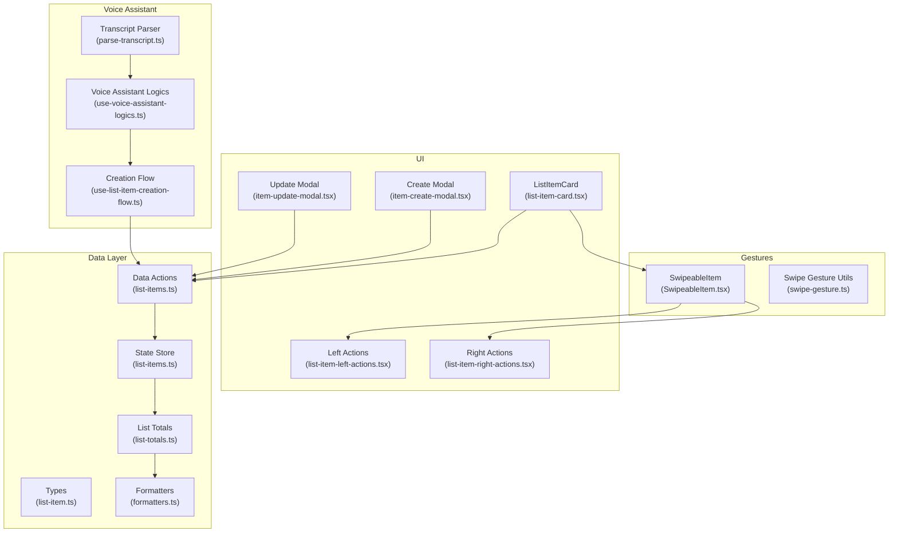
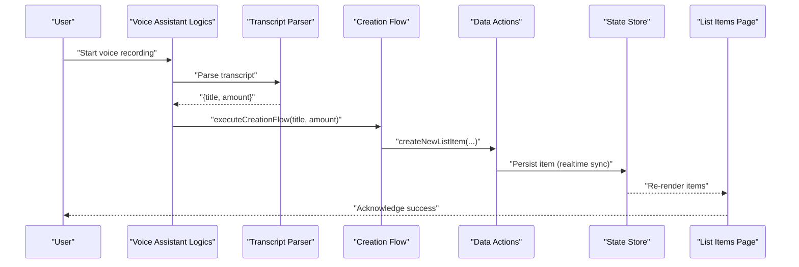
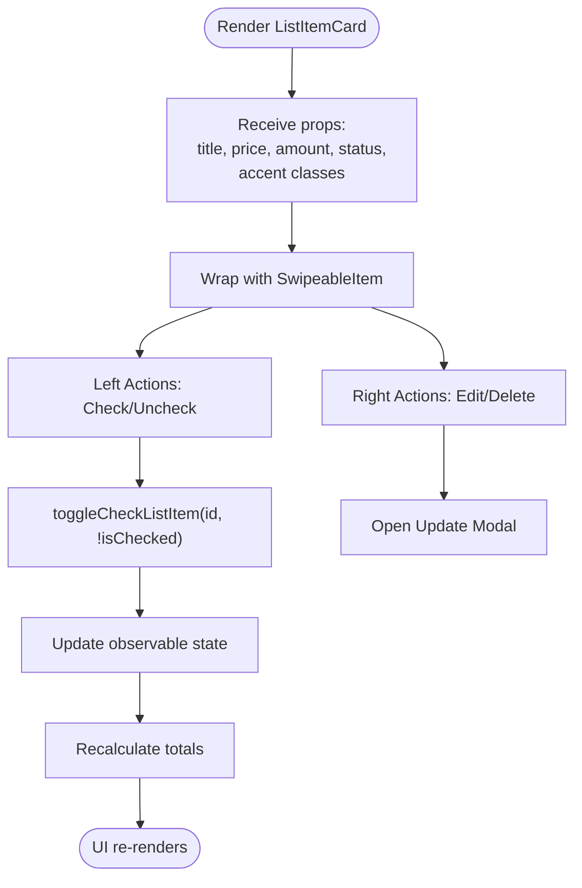
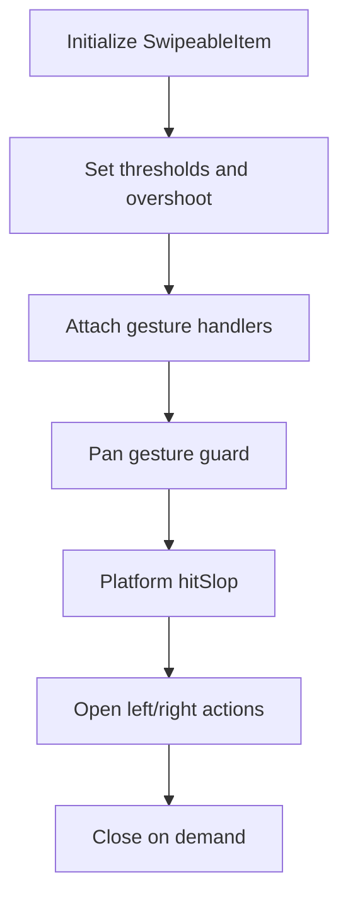
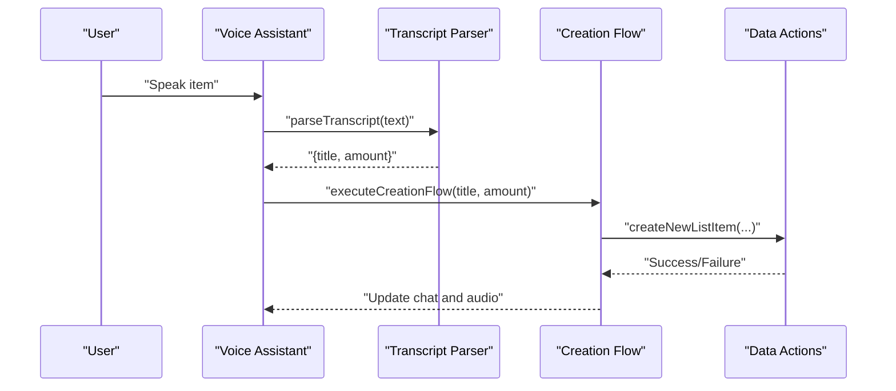
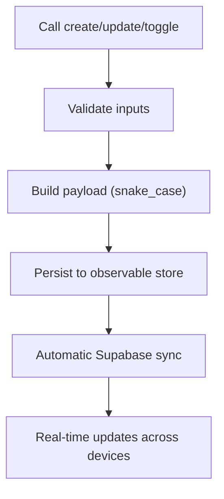
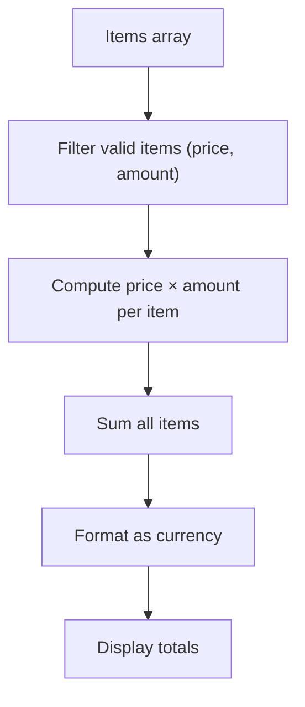
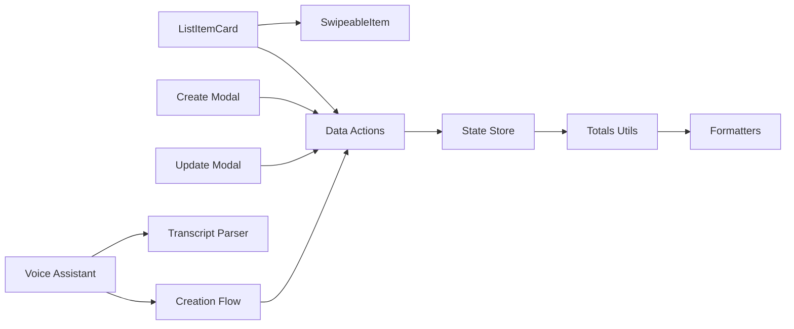

# Item Management System

<cite>
**Referenced Files in This Document**
- [src/features/list/components/list-item-card.tsx](file://src/features/list/components/list-item-card.tsx)
- [src/features/list/components/list-item-left-actions.tsx](file://src/features/list/components/list-item-left-actions.tsx)
- [src/features/list/components/list-item-right-actions.tsx](file://src/features/list/components/list-item-right-actions.tsx)
- [src/components/swipeable/SwipeableItem.tsx](file://src/components/swipeable/SwipeableItem.tsx)
- [src/lib/swipe-gesture.ts](file://src/lib/swipe-gesture.ts)
- [src/features/list/modals/item-create-modal.tsx](file://src/features/list/modals/item-create-modal.tsx)
- [src/features/list/modals/item-update-modal.tsx](file://src/features/list/modals/item-update-modal.tsx)
- [src/features/list/hooks/use-list-items-page-logics.ts](file://src/features/list/hooks/use-list-items-page-logics.ts)
- [src/features/voice-assistant/hooks/use-list-item-creation-flow.ts](file://src/features/voice-assistant/hooks/use-list-item-creation-flow.ts)
- [src/features/voice-assistant/hooks/use-voice-assistant-logics.ts](file://src/features/voice-assistant/hooks/use-voice-assistant-logics.ts)
- [src/features/voice-assistant/utils/parse-transcript.ts](file://src/features/voice-assistant/utils/parse-transcript.ts)
- [src/data/actions/list-items.ts](file://src/data/actions/list-items.ts)
- [src/data/types/list-item.ts](file://src/data/types/list-item.ts)
- [src/data/states/list-items.ts](file://src/data/states/list-items.ts)
- [src/features/lists/utils/list-totals.ts](file://src/features/lists/utils/list-totals.ts)
- [src/utils/formatters.ts](file://src/utils/formatters.ts)
- [src/features/list/utils/validation.ts](file://src/features/list/utils/validation.ts)
</cite>

## Table of Contents
1. [Introduction](#introduction)
2. [Project Structure](#project-structure)
3. [Core Components](#core-components)
4. [Architecture Overview](#architecture-overview)
5. [Detailed Component Analysis](#detailed-component-analysis)
6. [Dependency Analysis](#dependency-analysis)
7. [Performance Considerations](#performance-considerations)
8. [Troubleshooting Guide](#troubleshooting-guide)
9. [Conclusion](#conclusion)

## Introduction
This document describes the item management system within shopping lists. It covers the complete item lifecycle from creation via voice commands and manual entry to updates and deletions, including bulk operations support. It documents item properties (name, quantity, unit price, total cost, status), swipe-to-action gestures, modal-based editing with validation, list totals calculation, and real-time synchronization across devices.

## Project Structure
The item management system spans UI components, gesture handling, forms, voice assistant integration, data actions, and state synchronization.



**Diagram sources**
- [src/features/list/components/list-item-card.tsx:1-142](file://src/features/list/components/list-item-card.tsx#L1-L142)
- [src/features/list/components/list-item-left-actions.tsx:1-51](file://src/features/list/components/list-item-left-actions.tsx#L1-L51)
- [src/features/list/components/list-item-right-actions.tsx:1-54](file://src/features/list/components/list-item-right-actions.tsx#L1-L54)
- [src/components/swipeable/SwipeableItem.tsx:1-39](file://src/components/swipeable/SwipeableItem.tsx#L1-L39)
- [src/lib/swipe-gesture.ts:1-29](file://src/lib/swipe-gesture.ts#L1-L29)
- [src/features/list/modals/item-create-modal.tsx:1-188](file://src/features/list/modals/item-create-modal.tsx#L1-L188)
- [src/features/list/modals/item-update-modal.tsx:1-201](file://src/features/list/modals/item-update-modal.tsx#L1-L201)
- [src/features/voice-assistant/hooks/use-voice-assistant-logics.ts:1-213](file://src/features/voice-assistant/hooks/use-voice-assistant-logics.ts#L1-L213)
- [src/features/voice-assistant/hooks/use-list-item-creation-flow.ts:1-96](file://src/features/voice-assistant/hooks/use-list-item-creation-flow.ts#L1-L96)
- [src/features/voice-assistant/utils/parse-transcript.ts:1-225](file://src/features/voice-assistant/utils/parse-transcript.ts#L1-L225)
- [src/data/actions/list-items.ts:1-193](file://src/data/actions/list-items.ts#L1-L193)
- [src/data/types/list-item.ts:1-38](file://src/data/types/list-item.ts#L1-L38)
- [src/data/states/list-items.ts:1-24](file://src/data/states/list-items.ts#L1-L24)
- [src/features/lists/utils/list-totals.ts:1-32](file://src/features/lists/utils/list-totals.ts#L1-L32)
- [src/utils/formatters.ts:1-46](file://src/utils/formatters.ts#L1-L46)

**Section sources**
- [src/features/list/components/list-item-card.tsx:1-142](file://src/features/list/components/list-item-card.tsx#L1-L142)
- [src/components/swipeable/SwipeableItem.tsx:1-39](file://src/components/swipeable/SwipeableItem.tsx#L1-L39)
- [src/lib/swipe-gesture.ts:1-29](file://src/lib/swipe-gesture.ts#L1-L29)
- [src/features/list/modals/item-create-modal.tsx:1-188](file://src/features/list/modals/item-create-modal.tsx#L1-L188)
- [src/features/list/modals/item-update-modal.tsx:1-201](file://src/features/list/modals/item-update-modal.tsx#L1-L201)
- [src/features/list/hooks/use-list-items-page-logics.ts:1-124](file://src/features/list/hooks/use-list-items-page-logics.ts#L1-L124)
- [src/features/voice-assistant/hooks/use-voice-assistant-logics.ts:1-213](file://src/features/voice-assistant/hooks/use-voice-assistant-logics.ts#L1-L213)
- [src/features/voice-assistant/hooks/use-list-item-creation-flow.ts:1-96](file://src/features/voice-assistant/hooks/use-list-item-creation-flow.ts#L1-L96)
- [src/features/voice-assistant/utils/parse-transcript.ts:1-225](file://src/features/voice-assistant/utils/parse-transcript.ts#L1-L225)
- [src/data/actions/list-items.ts:1-193](file://src/data/actions/list-items.ts#L1-L193)
- [src/data/types/list-item.ts:1-38](file://src/data/types/list-item.ts#L1-L38)
- [src/data/states/list-items.ts:1-24](file://src/data/states/list-items.ts#L1-L24)
- [src/features/lists/utils/list-totals.ts:1-32](file://src/features/lists/utils/list-totals.ts#L1-L32)
- [src/utils/formatters.ts:1-46](file://src/utils/formatters.ts#L1-L46)

## Core Components
- Item rendering and swipe actions: ListItemCard renders item details, total cost, and status, and integrates with SwipeableItem for left/right actions.
- Swipeable gesture system: SwipeableItem wraps ReanimatedSwipeable with platform-specific hitSlop and pan guards.
- Modals for creation and updates: ItemCreateModal and ItemUpdateModal provide form validation and submission flows.
- Voice assistant integration: Voice assistant parses speech transcripts into item titles and quantities, then triggers item creation flow.
- Data actions and state: createNewListItem, updateListItem, toggleCheckListItem orchestrate persistence and real-time sync.
- Totals calculation: calculateTotal and buildTotalsByListId compute list totals and payable totals.

**Section sources**
- [src/features/list/components/list-item-card.tsx:11-142](file://src/features/list/components/list-item-card.tsx#L11-L142)
- [src/components/swipeable/SwipeableItem.tsx:10-39](file://src/components/swipeable/SwipeableItem.tsx#L10-L39)
- [src/lib/swipe-gesture.ts:10-29](file://src/lib/swipe-gesture.ts#L10-L29)
- [src/features/list/modals/item-create-modal.tsx:22-110](file://src/features/list/modals/item-create-modal.tsx#L22-L110)
- [src/features/list/modals/item-update-modal.tsx:24-110](file://src/features/list/modals/item-update-modal.tsx#L24-L110)
- [src/features/voice-assistant/hooks/use-voice-assistant-logics.ts:69-111](file://src/features/voice-assistant/hooks/use-voice-assistant-logics.ts#L69-L111)
- [src/features/voice-assistant/hooks/use-list-item-creation-flow.ts:27-92](file://src/features/voice-assistant/hooks/use-list-item-creation-flow.ts#L27-L92)
- [src/data/actions/list-items.ts:53-104](file://src/data/actions/list-items.ts#L53-L104)
- [src/data/actions/list-items.ts:132-166](file://src/data/actions/list-items.ts#L132-L166)
- [src/data/actions/list-items.ts:109-127](file://src/data/actions/list-items.ts#L109-L127)
- [src/utils/formatters.ts:32-45](file://src/utils/formatters.ts#L32-L45)
- [src/features/lists/utils/list-totals.ts:9-31](file://src/features/lists/utils/list-totals.ts#L9-L31)

## Architecture Overview
The system follows a layered architecture:
- UI layer: Renders items, handles swipe gestures, and opens modals.
- Voice assistant layer: Parses speech and triggers item creation.
- Data layer: Performs CRUD operations and manages real-time synchronization.
- State layer: Observable store synchronized with Supabase for cross-device updates.



**Diagram sources**
- [src/features/voice-assistant/hooks/use-voice-assistant-logics.ts:78-99](file://src/features/voice-assistant/hooks/use-voice-assistant-logics.ts#L78-L99)
- [src/features/voice-assistant/utils/parse-transcript.ts:194-224](file://src/features/voice-assistant/utils/parse-transcript.ts#L194-L224)
- [src/features/voice-assistant/hooks/use-list-item-creation-flow.ts:27-92](file://src/features/voice-assistant/hooks/use-list-item-creation-flow.ts#L27-L92)
- [src/data/actions/list-items.ts:53-104](file://src/data/actions/list-items.ts#L53-L104)
- [src/data/states/list-items.ts:5-23](file://src/data/states/list-items.ts#L5-L23)
- [src/features/list/hooks/use-list-items-page-logics.ts:22-31](file://src/features/list/hooks/use-list-items-page-logics.ts#L22-L31)

## Detailed Component Analysis

### Item Rendering and Swipe Actions
ListItemCard displays item title, amount, unit price, and computed total cost. It integrates SwipeableItem to enable left and right swipe actions:
- Left action: Quick check/uncheck toggle.
- Right action: Open edit/delete options.



**Diagram sources**
- [src/features/list/components/list-item-card.tsx:24-128](file://src/features/list/components/list-item-card.tsx#L24-L128)
- [src/features/list/components/list-item-left-actions.tsx:18-48](file://src/features/list/components/list-item-left-actions.tsx#L18-L48)
- [src/features/list/components/list-item-right-actions.tsx:16-51](file://src/features/list/components/list-item-right-actions.tsx#L16-L51)
- [src/data/actions/list-items.ts:109-127](file://src/data/actions/list-items.ts#L109-L127)
- [src/features/list/hooks/use-list-items-page-logics.ts:72-73](file://src/features/list/hooks/use-list-items-page-logics.ts#L72-L73)

**Section sources**
- [src/features/list/components/list-item-card.tsx:11-142](file://src/features/list/components/list-item-card.tsx#L11-L142)
- [src/features/list/components/list-item-left-actions.tsx:10-51](file://src/features/list/components/list-item-left-actions.tsx#L10-L51)
- [src/features/list/components/list-item-right-actions.tsx:9-54](file://src/features/list/components/list-item-right-actions.tsx#L9-L54)
- [src/data/actions/list-items.ts:109-127](file://src/data/actions/list-items.ts#L109-L127)
- [src/features/list/hooks/use-list-items-page-logics.ts:70-73](file://src/features/list/hooks/use-list-items-page-logics.ts#L70-L73)

### Swipeable Gesture System
SwipeableItem configures thresholds, overshoot, and hitSlop for smooth gestures. Gesture utilities define platform-specific hitSlop and pan guards to prevent accidental swipes.



**Diagram sources**
- [src/components/swipeable/SwipeableItem.tsx:10-39](file://src/components/swipeable/SwipeableItem.tsx#L10-L39)
- [src/lib/swipe-gesture.ts:10-29](file://src/lib/swipe-gesture.ts#L10-L29)

**Section sources**
- [src/components/swipeable/SwipeableItem.tsx:10-39](file://src/components/swipeable/SwipeableItem.tsx#L10-L39)
- [src/lib/swipe-gesture.ts:10-29](file://src/lib/swipe-gesture.ts#L10-L29)

### Modal-Based Editing System
ItemCreateModal and ItemUpdateModal provide controlled editing experiences:
- Validation: Zod schemas enforce minimum length for title and numeric parsing for amount/price.
- Formatting: Currency inputs formatted as BRL; amounts rounded to integer with minimum 1.
- Submission: Calls createNewListItem or updateListItem; shows toasts on error; resets form on close.

```mermaid
sequenceDiagram
participant User as "User"
participant Create as "Create Modal"
participant Form as "Form Validation"
participant Actions as "Data Actions"
participant State as "State Store"
User->>Create : "Open Create Modal"
Create->>Form : "Validate title, amount, price"
Form-->>Create : "Errors or ok"
User->>Create : "Submit"
Create->>Actions : "createNewListItem(...)"
Actions->>State : "Persist item"
State-->>Create : "Success"
Create-->>User : "Close and show success"
```

**Diagram sources**
- [src/features/list/modals/item-create-modal.tsx:57-110](file://src/features/list/modals/item-create-modal.tsx#L57-L110)
- [src/data/actions/list-items.ts:53-104](file://src/data/actions/list-items.ts#L53-L104)
- [src/data/states/list-items.ts:5-23](file://src/data/states/list-items.ts#L5-L23)

**Section sources**
- [src/features/list/modals/item-create-modal.tsx:22-110](file://src/features/list/modals/item-create-modal.tsx#L22-L110)
- [src/features/list/modals/item-update-modal.tsx:24-110](file://src/features/list/modals/item-update-modal.tsx#L24-L110)
- [src/data/actions/list-items.ts:53-104](file://src/data/actions/list-items.ts#L53-L104)
- [src/data/actions/list-items.ts:132-166](file://src/data/actions/list-items.ts#L132-L166)

### Voice Command Integration
Voice assistant parses Portuguese speech into item title and quantity, then executes a creation flow:
- Parsing: Numbers in words or digits extracted; defaults to 1 if none found.
- Flow: Acknowledges processing, persists item, updates chat messages, plays audio feedback.



**Diagram sources**
- [src/features/voice-assistant/hooks/use-voice-assistant-logics.ts:78-99](file://src/features/voice-assistant/hooks/use-voice-assistant-logics.ts#L78-L99)
- [src/features/voice-assistant/utils/parse-transcript.ts:194-224](file://src/features/voice-assistant/utils/parse-transcript.ts#L194-L224)
- [src/features/voice-assistant/hooks/use-list-item-creation-flow.ts:27-92](file://src/features/voice-assistant/hooks/use-list-item-creation-flow.ts#L27-L92)
- [src/data/actions/list-items.ts:53-104](file://src/data/actions/list-items.ts#L53-L104)

**Section sources**
- [src/features/voice-assistant/hooks/use-voice-assistant-logics.ts:19-213](file://src/features/voice-assistant/hooks/use-voice-assistant-logics.ts#L19-L213)
- [src/features/voice-assistant/utils/parse-transcript.ts:194-224](file://src/features/voice-assistant/utils/parse-transcript.ts#L194-L224)
- [src/features/voice-assistant/hooks/use-list-item-creation-flow.ts:22-96](file://src/features/voice-assistant/hooks/use-list-item-creation-flow.ts#L22-L96)

### Data Actions and Real-Time Synchronization
Data actions encapsulate persistence and synchronization:
- createNewListItem: Validates inputs, generates ID, converts to snake_case, sets observable, triggers Supabase sync.
- updateListItem: Merges partial updates, converts to snake_case, updates observable.
- toggleCheckListItem: Updates checked status in observable, triggering sync.
- State store: Supabase-synced observable filtered by current user; supports realtime subscription and retries.



**Diagram sources**
- [src/data/actions/list-items.ts:53-104](file://src/data/actions/list-items.ts#L53-L104)
- [src/data/actions/list-items.ts:132-166](file://src/data/actions/list-items.ts#L132-L166)
- [src/data/actions/list-items.ts:109-127](file://src/data/actions/list-items.ts#L109-L127)
- [src/data/states/list-items.ts:5-23](file://src/data/states/list-items.ts#L5-L23)

**Section sources**
- [src/data/actions/list-items.ts:53-104](file://src/data/actions/list-items.ts#L53-L104)
- [src/data/actions/list-items.ts:132-166](file://src/data/actions/list-items.ts#L132-L166)
- [src/data/actions/list-items.ts:109-127](file://src/data/actions/list-items.ts#L109-L127)
- [src/data/states/list-items.ts:5-23](file://src/data/states/list-items.ts#L5-L23)

### Totals Calculation and Status Tracking
- Per-item total cost: Computed as price × amount and formatted as currency.
- List totals: Sum of per-item totals; payable total excludes unchecked items.
- Status tracking: isChecked toggled via gesture or action; affects visibility and totals.



**Diagram sources**
- [src/utils/formatters.ts:32-45](file://src/utils/formatters.ts#L32-L45)
- [src/features/lists/utils/list-totals.ts:9-31](file://src/features/lists/utils/list-totals.ts#L9-L31)
- [src/features/list/components/list-item-card.tsx:106-122](file://src/features/list/components/list-item-card.tsx#L106-L122)

**Section sources**
- [src/utils/formatters.ts:32-45](file://src/utils/formatters.ts#L32-L45)
- [src/features/lists/utils/list-totals.ts:9-31](file://src/features/lists/utils/list-totals.ts#L9-L31)
- [src/features/list/components/list-item-card.tsx:106-122](file://src/features/list/components/list-item-card.tsx#L106-L122)

## Dependency Analysis
Key dependencies and relationships:
- ListItemCard depends on SwipeableItem and action handlers to toggle status and open modals.
- Modals depend on data actions and formatters for submission and display.
- Voice assistant depends on transcript parser and creation flow to create items.
- Data actions depend on state store for persistence and Supabase for synchronization.
- Totals computation depends on item arrays and formatters.



**Diagram sources**
- [src/features/list/components/list-item-card.tsx:1-142](file://src/features/list/components/list-item-card.tsx#L1-L142)
- [src/components/swipeable/SwipeableItem.tsx:1-39](file://src/components/swipeable/SwipeableItem.tsx#L1-L39)
- [src/features/list/modals/item-create-modal.tsx:1-188](file://src/features/list/modals/item-create-modal.tsx#L1-L188)
- [src/features/list/modals/item-update-modal.tsx:1-201](file://src/features/list/modals/item-update-modal.tsx#L1-L201)
- [src/features/voice-assistant/hooks/use-voice-assistant-logics.ts:1-213](file://src/features/voice-assistant/hooks/use-voice-assistant-logics.ts#L1-L213)
- [src/features/voice-assistant/utils/parse-transcript.ts:1-225](file://src/features/voice-assistant/utils/parse-transcript.ts#L1-L225)
- [src/features/voice-assistant/hooks/use-list-item-creation-flow.ts:1-96](file://src/features/voice-assistant/hooks/use-list-item-creation-flow.ts#L1-L96)
- [src/data/actions/list-items.ts:1-193](file://src/data/actions/list-items.ts#L1-L193)
- [src/data/states/list-items.ts:1-24](file://src/data/states/list-items.ts#L1-L24)
- [src/features/lists/utils/list-totals.ts:1-32](file://src/features/lists/utils/list-totals.ts#L1-L32)
- [src/utils/formatters.ts:1-46](file://src/utils/formatters.ts#L1-L46)

**Section sources**
- [src/features/list/components/list-item-card.tsx:1-142](file://src/features/list/components/list-item-card.tsx#L1-L142)
- [src/data/actions/list-items.ts:1-193](file://src/data/actions/list-items.ts#L1-L193)
- [src/data/states/list-items.ts:1-24](file://src/data/states/list-items.ts#L1-L24)
- [src/utils/formatters.ts:1-46](file://src/utils/formatters.ts#L1-L46)

## Performance Considerations
- Memoization: ListItem uses React.memo with equality checks to avoid unnecessary re-renders.
- Decimal arithmetic: Uses decimal.js for precise currency calculations to prevent floating-point errors.
- Efficient totals: Totals computed from observable snapshots; memoized via useMemo to minimize recalculation.
- Gesture thresholds: Tuned thresholds and overshoot reduce accidental swipes and improve UX responsiveness.
- Real-time sync: Supabase-backed observable store ensures minimal latency for cross-device updates.

[No sources needed since this section provides general guidance]

## Troubleshooting Guide
Common issues and resolutions:
- Validation errors in modals: Title must be at least three characters; amount must be ≥ 1. Errors surfaced via form state and toasts.
- Voice recognition permission: If denied, assistant prompts for permission and shows a warning toast.
- Speech recognition errors: Errors captured and displayed as toasts; assistant resets state and stops recording.
- Sync failures: State store retries indefinitely; check network connectivity and user authentication.
- Swipe gestures not responding: Verify hitSlop and pan guards; ensure thresholds are appropriate for device size.

**Section sources**
- [src/features/list/utils/validation.ts:13-65](file://src/features/list/utils/validation.ts#L13-L65)
- [src/features/voice-assistant/hooks/use-voice-assistant-logics.ts:113-139](file://src/features/voice-assistant/hooks/use-voice-assistant-logics.ts#L113-L139)
- [src/features/voice-assistant/hooks/use-voice-assistant-logics.ts:101-111](file://src/features/voice-assistant/hooks/use-voice-assistant-logics.ts#L101-L111)
- [src/data/states/list-items.ts:14-17](file://src/data/states/list-items.ts#L14-L17)

## Conclusion
The item management system provides a robust, real-time shopping list experience with voice-driven creation, intuitive swipe gestures, and reliable modal-based editing. Totals calculation and status tracking ensure accurate financial insights, while Supabase-powered synchronization keeps data consistent across devices.

[No sources needed since this section summarizes without analyzing specific files]