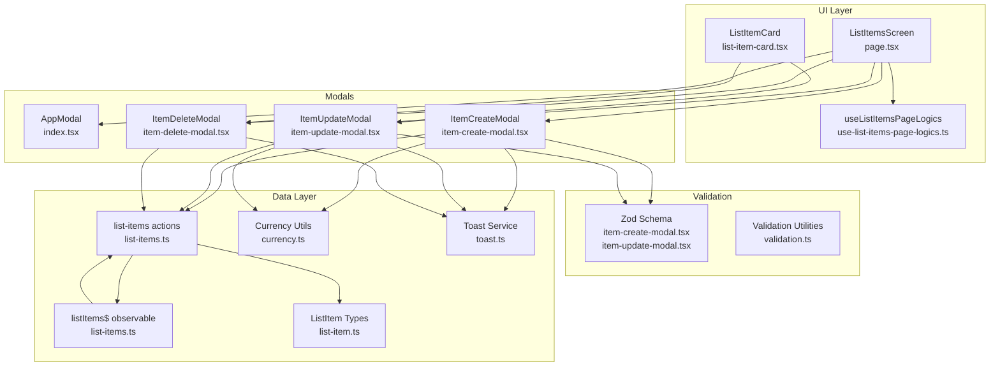
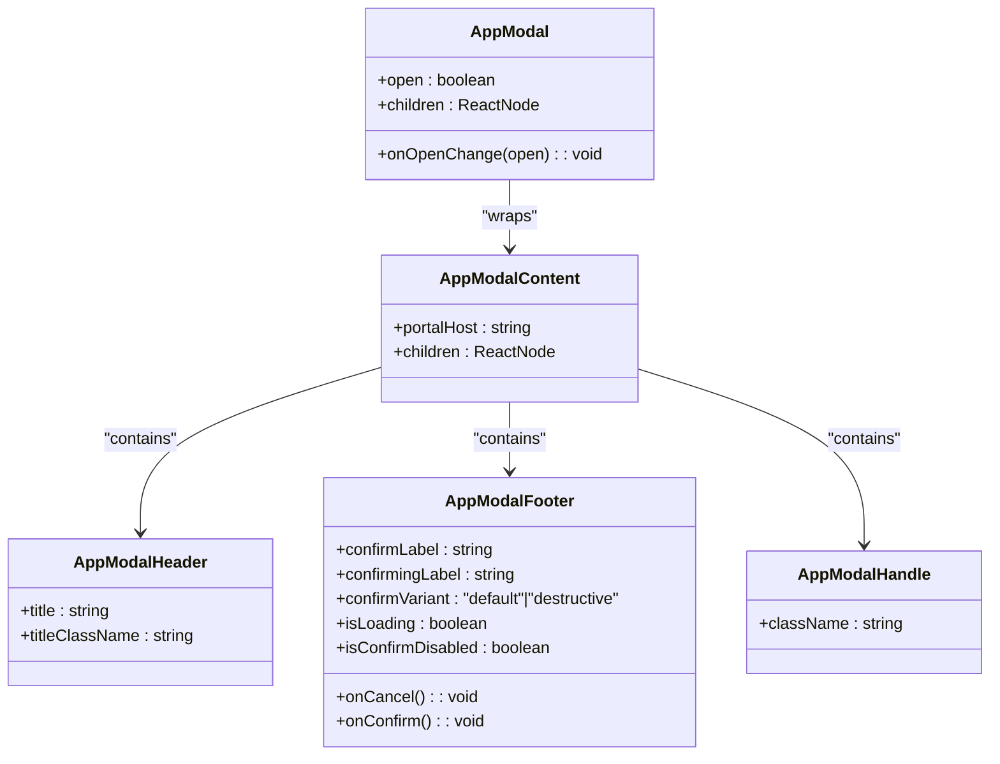
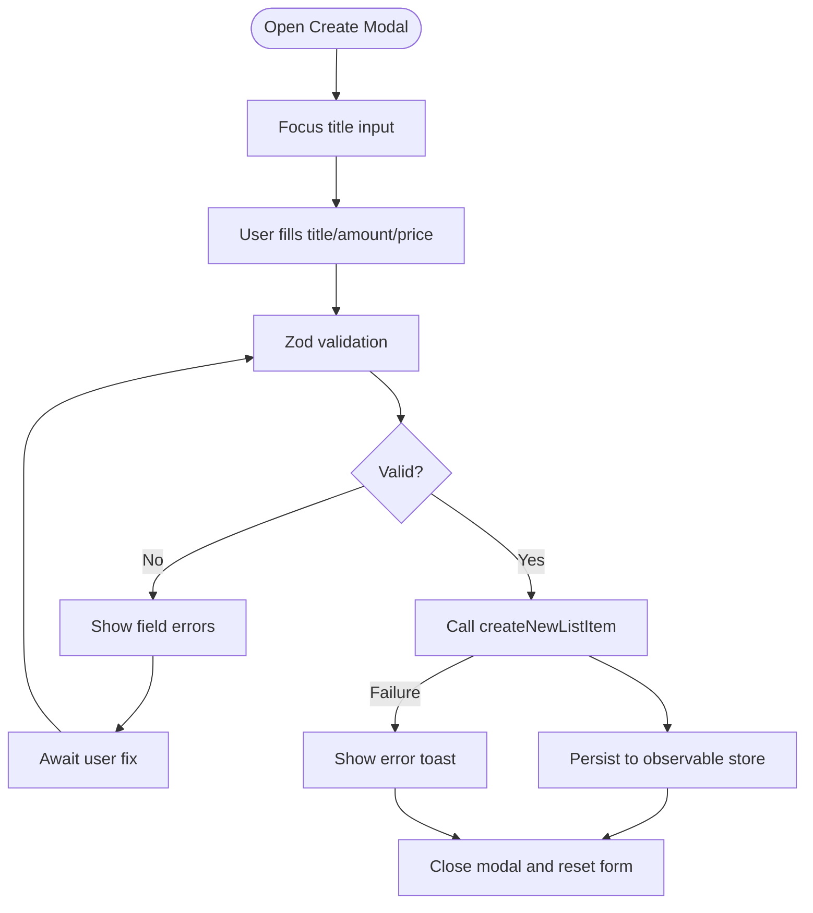
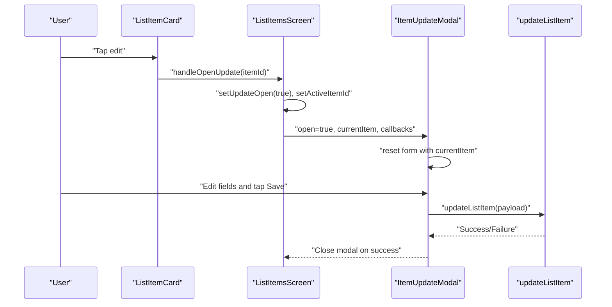
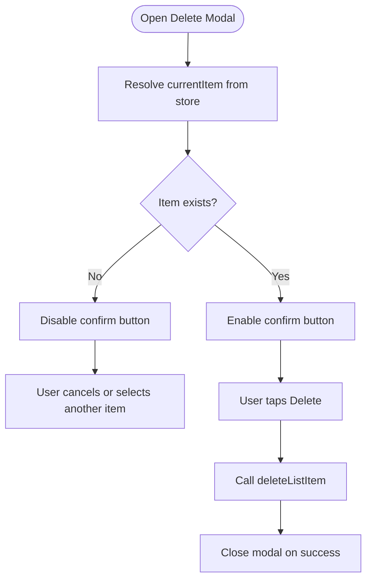
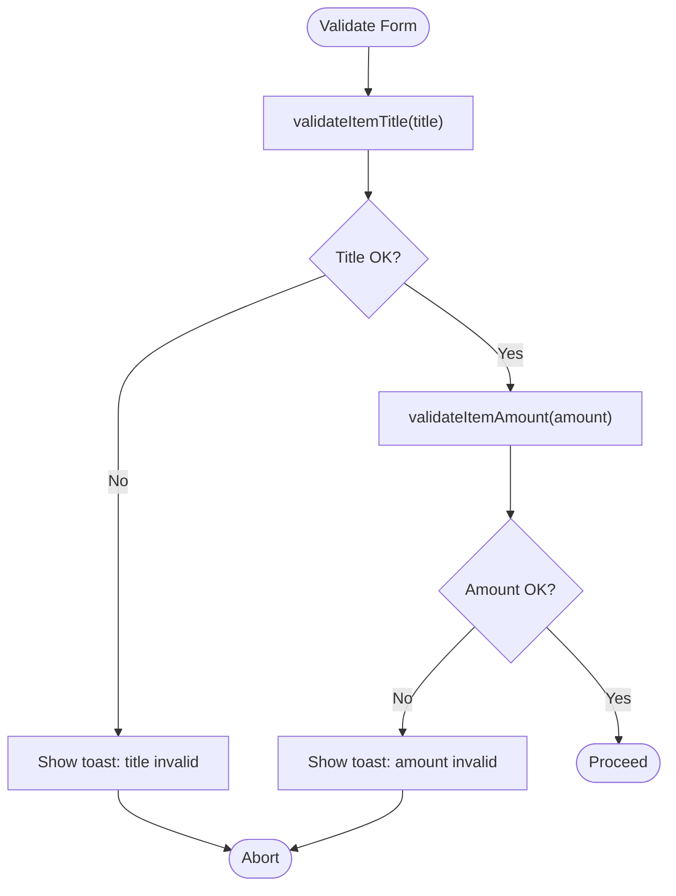
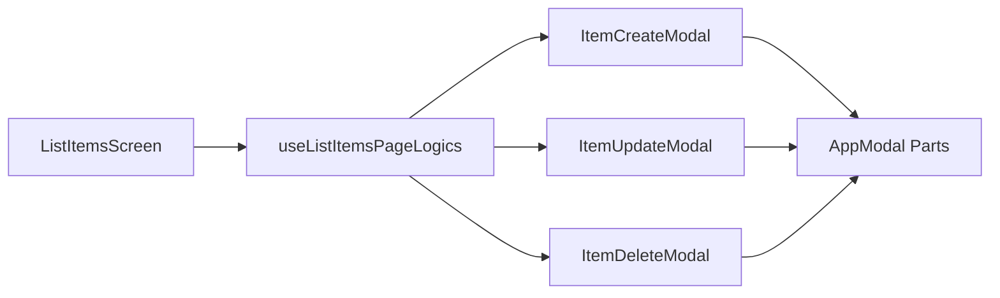
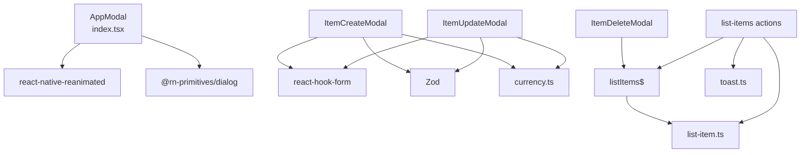

# Modal Editing System

<cite>
**Referenced Files in This Document**
- [index.tsx](file://src/components/molecules/app-modal/index.tsx)
- [types.ts](file://src/components/molecules/app-modal/types.ts)
- [item-create-modal.tsx](file://src/features/list/modals/item-create-modal.tsx)
- [item-update-modal.tsx](file://src/features/list/modals/item-update-modal.tsx)
- [item-delete-modal.tsx](file://src/features/list/modals/item-delete-modal.tsx)
- [validation.ts](file://src/features/list/utils/validation.ts)
- [use-list-items-page-logics.ts](file://src/features/list/hooks/use-list-items-page-logics.ts)
- [page.tsx](file://src/features/list/page.tsx)
- [list-item.ts](file://src/data/types/list-item.ts)
- [list-items.ts](file://src/data/states/list-items.ts)
- [list-items.ts](file://src/data/actions/list-items.ts)
- [currency.ts](file://src/utils/currency.ts)
- [toast.ts](file://src/services/toast.ts)
- [list-item-card.tsx](file://src/features/list/components/list-item-card.tsx)
</cite>

## Table of Contents
1. [Introduction](#introduction)
2. [Project Structure](#project-structure)
3. [Core Components](#core-components)
4. [Architecture Overview](#architecture-overview)
5. [Detailed Component Analysis](#detailed-component-analysis)
6. [Dependency Analysis](#dependency-analysis)
7. [Performance Considerations](#performance-considerations)
8. [Troubleshooting Guide](#troubleshooting-guide)
9. [Conclusion](#conclusion)

## Introduction
This document describes the modal-based editing system for item management in the application. It covers the three modal types—creation, update, and deletion—along with the underlying AppModal component architecture, validation and error handling mechanisms, form state management, and state synchronization between modals and the main list view. The goal is to provide a clear understanding of how users interact with item creation, editing, and deletion via modals, and how the system ensures consistent behavior and reliable data updates.

## Project Structure
The modal editing system is organized around a shared AppModal component and three specialized item modals. The main list page composes these modals and manages their open/close state and active item context. Data operations are handled by action functions that update the observable store, which synchronizes with the backend.



**Diagram sources**
- [page.tsx:18-155](file://src/features/list/page.tsx#L18-L155)
- [use-list-items-page-logics.ts:14-123](file://src/features/list/hooks/use-list-items-page-logics.ts#L14-L123)
- [list-item-card.tsx:24-142](file://src/features/list/components/list-item-card.tsx#L24-L142)
- [index.tsx:36-225](file://src/components/molecules/app-modal/index.tsx#L36-L225)
- [item-create-modal.tsx:47-187](file://src/features/list/modals/item-create-modal.tsx#L47-L187)
- [item-update-modal.tsx:49-200](file://src/features/list/modals/item-update-modal.tsx#L49-L200)
- [item-delete-modal.tsx:23-67](file://src/features/list/modals/item-delete-modal.tsx#L23-L67)
- [validation.ts:13-65](file://src/features/list/utils/validation.ts#L13-L65)
- [list-items.ts:53-104](file://src/data/actions/list-items.ts#L53-L104)
- [list-items.ts:132-166](file://src/data/actions/list-items.ts#L132-L166)
- [list-items.ts:171-186](file://src/data/actions/list-items.ts#L171-L186)
- [list-items.ts:5-23](file://src/data/states/list-items.ts#L5-L23)
- [list-item.ts:1-38](file://src/data/types/list-item.ts#L1-L38)
- [currency.ts:6-39](file://src/utils/currency.ts#L6-L39)
- [toast.ts:24-43](file://src/services/toast.ts#L24-L43)

**Section sources**
- [page.tsx:18-155](file://src/features/list/page.tsx#L18-L155)
- [use-list-items-page-logics.ts:14-123](file://src/features/list/hooks/use-list-items-page-logics.ts#L14-L123)

## Core Components
- AppModal: A reusable modal container with overlay, content, header, footer, and draggable handle. Provides consistent animations, accessibility, and drag-to-dismiss behavior.
- ItemCreateModal: Form-based modal for creating new items with validation for title length and amount parsing, currency formatting, and submission handling.
- ItemUpdateModal: Edit modal pre-populated with current item data, validation, keyboard navigation, and submission handling.
- ItemDeleteModal: Confirmation modal for deleting items with destructive styling and state-driven enablement.
- Validation utilities: Title and amount validators with user-facing toast feedback.
- Data actions and store: CRUD operations for list items backed by an observable store synchronized with the backend.

**Section sources**
- [index.tsx:36-225](file://src/components/molecules/app-modal/index.tsx#L36-L225)
- [item-create-modal.tsx:47-187](file://src/features/list/modals/item-create-modal.tsx#L47-L187)
- [item-update-modal.tsx:49-200](file://src/features/list/modals/item-update-modal.tsx#L49-L200)
- [item-delete-modal.tsx:23-67](file://src/features/list/modals/item-delete-modal.tsx#L23-L67)
- [validation.ts:13-65](file://src/features/list/utils/validation.ts#L13-L65)
- [list-items.ts:53-104](file://src/data/actions/list-items.ts#L53-L104)
- [list-items.ts:132-166](file://src/data/actions/list-items.ts#L132-L166)
- [list-items.ts:171-186](file://src/data/actions/list-items.ts#L171-L186)

## Architecture Overview
The modal system is composed around a single AppModal component that encapsulates presentation and behavior. Each item modal composes AppModal parts (content, header, handle, footer) and adds its own form logic and validation. The main list screen orchestrates modal visibility and passes contextual props (e.g., listId, active item). Data mutations are performed via action functions that update the observable store, ensuring immediate UI updates and eventual backend synchronization.

```mermaid
sequenceDiagram
participant User as "User"
participant Screen as "ListItemsScreen"
participant Create as "ItemCreateModal"
participant App as "AppModal"
participant Actions as "createNewListItem"
participant Store as "listItems$"
User->>Screen : "Tap Add Item"
Screen->>Screen : "setCreateOpen(true)"
Screen->>Create : "open=true, listId, callbacks"
Create->>App : "Render modal parts"
User->>Create : "Fill form and tap Save"
Create->>Actions : "createNewListItem(payload)"
Actions->>Store : "Persist item"
Store-->>Screen : "Re-render list"
Actions-->>Create : "Success/Failure"
Create-->>Screen : "Close modal"
```

**Diagram sources**
- [page.tsx:137-143](file://src/features/list/page.tsx#L137-L143)
- [item-create-modal.tsx:79-110](file://src/features/list/modals/item-create-modal.tsx#L79-L110)
- [list-items.ts:53-104](file://src/data/actions/list-items.ts#L53-L104)
- [list-items.ts:5-23](file://src/data/states/list-items.ts#L5-L23)

## Detailed Component Analysis

### AppModal Component Architecture
AppModal provides a consistent foundation for all modals:
- Contexts: AppModalContext and AppModalDragContext propagate open state and drag behavior.
- Overlay and Content: Full-window overlay with animated transitions and keyboard-avoiding layout.
- Drag Handle: Pan gesture enables drag-to-dismiss with spring physics.
- Footer: Standardized buttons with loading and disabled states.
- Accessibility: Proper labeling and focus management.



**Diagram sources**
- [index.tsx:36-225](file://src/components/molecules/app-modal/index.tsx#L36-L225)
- [types.ts:6-41](file://src/components/molecules/app-modal/types.ts#L6-L41)

**Section sources**
- [index.tsx:36-225](file://src/components/molecules/app-modal/index.tsx#L36-L225)
- [types.ts:6-41](file://src/components/molecules/app-modal/types.ts#L6-L41)

### Creation Modal (ItemCreateModal)
- Purpose: Create new list items with title, optional price, and amount.
- Validation: Zod schema enforces minimum title length; amount is parsed to integer with a floor of 1.
- Currency: Price input is formatted as BRL during typing and parsed back to numeric on submit.
- Feedback: Loading state and error toasts on failure; modal resets on close.
- Focus Management: Auto-focuses the title field on open.



**Diagram sources**
- [item-create-modal.tsx:62-110](file://src/features/list/modals/item-create-modal.tsx#L62-L110)
- [item-create-modal.tsx:22-28](file://src/features/list/modals/item-create-modal.tsx#L22-L28)
- [currency.ts:6-26](file://src/utils/currency.ts#L6-L26)
- [toast.ts:24-43](file://src/services/toast.ts#L24-L43)

**Section sources**
- [item-create-modal.tsx:47-187](file://src/features/list/modals/item-create-modal.tsx#L47-L187)
- [item-create-modal.tsx:22-28](file://src/features/list/modals/item-create-modal.tsx#L22-L28)
- [currency.ts:6-26](file://src/utils/currency.ts#L6-L26)

### Update Modal (ItemUpdateModal)
- Purpose: Edit existing items with pre-filled values and validation.
- Pre-population: Resets form with current item data on open; focuses price or title depending on context.
- Validation: Same Zod rules as creation; footer disables confirm when invalid.
- Keyboard Navigation: Next/done actions move focus across fields and submit on last field.
- Feedback: Loading state and error toast on failure; modal closes on success.



**Diagram sources**
- [list-item-card.tsx:52-75](file://src/features/list/components/list-item-card.tsx#L52-L75)
- [use-list-items-page-logics.ts:52-60](file://src/features/list/hooks/use-list-items-page-logics.ts#L52-L60)
- [item-update-modal.tsx:61-110](file://src/features/list/modals/item-update-modal.tsx#L61-L110)
- [list-items.ts:132-166](file://src/data/actions/list-items.ts#L132-L166)

**Section sources**
- [item-update-modal.tsx:49-200](file://src/features/list/modals/item-update-modal.tsx#L49-L200)
- [use-list-items-page-logics.ts:52-60](file://src/features/list/hooks/use-list-items-page-logics.ts#L52-L60)
- [list-item-card.tsx:52-75](file://src/features/list/components/list-item-card.tsx#L52-L75)

### Deletion Modal (ItemDeleteModal)
- Purpose: Confirm deletion of an item with destructive styling.
- Context: Resolves current item from the observable store using the active item ID.
- Behavior: Disables confirm when no item ID is present; closes on successful deletion.



**Diagram sources**
- [item-delete-modal.tsx:23-40](file://src/features/list/modals/item-delete-modal.tsx#L23-L40)
- [list-items.ts:171-186](file://src/data/actions/list-items.ts#L171-L186)
- [list-items.ts:5-23](file://src/data/states/list-items.ts#L5-L23)

**Section sources**
- [item-delete-modal.tsx:23-67](file://src/features/list/modals/item-delete-modal.tsx#L23-L67)

### Validation System
- Zod Schemas: Both creation and update modals define a shared schema enforcing:
  - Title minimum length.
  - Optional price and amount fields.
- Amount Parsing: Uses decimal arithmetic to ensure whole units with a minimum of 1.
- Currency Parsing/Formatting: Ensures consistent BRL display and conversion.
- Utility Validators: Standalone helpers for title and amount validation with user-facing toasts.



**Diagram sources**
- [item-create-modal.tsx:22-28](file://src/features/list/modals/item-create-modal.tsx#L22-L28)
- [item-update-modal.tsx:24-28](file://src/features/list/modals/item-update-modal.tsx#L24-L28)
- [validation.ts:13-43](file://src/features/list/utils/validation.ts#L13-L43)
- [currency.ts:6-26](file://src/utils/currency.ts#L6-L26)

**Section sources**
- [item-create-modal.tsx:22-28](file://src/features/list/modals/item-create-modal.tsx#L22-L28)
- [item-update-modal.tsx:24-28](file://src/features/list/modals/item-update-modal.tsx#L24-L28)
- [validation.ts:13-43](file://src/features/list/utils/validation.ts#L13-L43)
- [currency.ts:6-26](file://src/utils/currency.ts#L6-L26)

### Error Handling, Form State, and User Feedback
- Form State: Controlled inputs via react-hook-form with Zod resolver; errors surfaced per field.
- Loading States: Footer buttons reflect isLoading and disable interactions during submission.
- Toasts: Centralized toast service displays success/error/info/warning messages consistently.
- Action Failures: Modals catch exceptions and show user-friendly toasts; they avoid crashing the UI.

**Section sources**
- [item-create-modal.tsx:79-110](file://src/features/list/modals/item-create-modal.tsx#L79-L110)
- [item-update-modal.tsx:88-110](file://src/features/list/modals/item-update-modal.tsx#L88-L110)
- [item-delete-modal.tsx:30-40](file://src/features/list/modals/item-delete-modal.tsx#L30-L40)
- [toast.ts:24-43](file://src/services/toast.ts#L24-L43)

### Modal Composition Patterns and Prop Drilling Prevention
- Composition: Each modal composes AppModal parts (Content, Header, Handle, Footer) to maintain consistent UI/UX.
- Props: Modals receive open/onOpenChange callbacks and contextual data (listId, currentItem, accent colors).
- State Synchronization: The main screen holds open state and active item ID, passing them down to modals. This minimizes prop drilling by centralizing state in a single hook and passing only necessary props.



**Diagram sources**
- [page.tsx:18-43](file://src/features/list/page.tsx#L18-L43)
- [use-list-items-page-logics.ts:14-123](file://src/features/list/hooks/use-list-items-page-logics.ts#L14-L123)

**Section sources**
- [page.tsx:18-43](file://src/features/list/page.tsx#L18-L43)
- [use-list-items-page-logics.ts:14-123](file://src/features/list/hooks/use-list-items-page-logics.ts#L14-L123)

## Dependency Analysis
- Modal Dependencies:
  - AppModal depends on react-native-reanimated for animations and gestures, and @rn-primitives/dialog for primitive modal semantics.
  - Item modals depend on react-hook-form for form state and Zod for validation.
- Data Dependencies:
  - Actions depend on the observable store (listItems$) and database utilities for persistence and real-time synchronization.
  - Types define the shape of persisted data and action signatures.
- Utility Dependencies:
  - Currency utilities normalize price input/output.
  - Toast service provides unified feedback.



**Diagram sources**
- [index.tsx:1-18](file://src/components/molecules/app-modal/index.tsx#L1-L18)
- [item-create-modal.tsx:1-6](file://src/features/list/modals/item-create-modal.tsx#L1-L6)
- [item-update-modal.tsx:1-6](file://src/features/list/modals/item-update-modal.tsx#L1-L6)
- [item-delete-modal.tsx:1-11](file://src/features/list/modals/item-delete-modal.tsx#L1-L11)
- [list-items.ts:53-104](file://src/data/actions/list-items.ts#L53-L104)
- [list-item.ts:1-38](file://src/data/types/list-item.ts#L1-L38)
- [currency.ts:6-26](file://src/utils/currency.ts#L6-L26)
- [toast.ts:24-43](file://src/services/toast.ts#L24-L43)

**Section sources**
- [index.tsx:1-18](file://src/components/molecules/app-modal/index.tsx#L1-L18)
- [item-create-modal.tsx:1-6](file://src/features/list/modals/item-create-modal.tsx#L1-L6)
- [item-update-modal.tsx:1-6](file://src/features/list/modals/item-update-modal.tsx#L1-L6)
- [item-delete-modal.tsx:1-11](file://src/features/list/modals/item-delete-modal.tsx#L1-L11)
- [list-items.ts:53-104](file://src/data/actions/list-items.ts#L53-L104)
- [list-item.ts:1-38](file://src/data/types/list-item.ts#L1-L38)
- [currency.ts:6-26](file://src/utils/currency.ts#L6-L26)
- [toast.ts:24-43](file://src/services/toast.ts#L24-L43)

## Performance Considerations
- Rendering:
  - Memoization: ListItemCard uses React.memo to prevent unnecessary re-renders.
  - Lazy loading: List content is wrapped in Suspense to defer heavy rendering until after mount.
- Animations:
  - AppModal uses spring-based animations and gesture handling optimized for mobile performance.
- State Updates:
  - Observable store updates trigger minimal re-renders; avoid excessive deep updates by keeping payloads small.
- Input Formatting:
  - Currency formatting occurs on input changes; keep formatting logic efficient to avoid jank on fast typing.

[No sources needed since this section provides general guidance]

## Troubleshooting Guide
- Modal does not open:
  - Verify the main screen sets the appropriate open state and passes it to the modal.
  - Ensure the modal’s onOpenChange callback updates the parent state.
- Form validation fails silently:
  - Check Zod resolver configuration and ensure errors are rendered in the modal.
  - Confirm that the footer’s isConfirmDisabled aligns with form validity.
- Price input not formatting correctly:
  - Ensure the input handler applies currency formatting and that parsing converts back to number on submit.
- Toast not appearing:
  - Confirm the toast service is imported and invoked with correct parameters.
- Item not updating/deleting:
  - Verify the action function receives required fields and that the observable store reflects changes.

**Section sources**
- [page.tsx:137-152](file://src/features/list/page.tsx#L137-L152)
- [item-create-modal.tsx:135-137](file://src/features/list/modals/item-create-modal.tsx#L135-L137)
- [item-update-modal.tsx:139-141](file://src/features/list/modals/item-update-modal.tsx#L139-L141)
- [currency.ts:6-26](file://src/utils/currency.ts#L6-L26)
- [toast.ts:24-43](file://src/services/toast.ts#L24-L43)
- [list-items.ts:132-166](file://src/data/actions/list-items.ts#L132-L166)
- [list-items.ts:171-186](file://src/data/actions/list-items.ts#L171-L186)

## Conclusion
The modal editing system leverages a robust AppModal foundation to deliver consistent, accessible, and performant item management experiences. Through centralized state orchestration, controlled forms with Zod validation, and observable data synchronization, the system ensures reliable user interactions and seamless updates across the UI. The creation, update, and deletion modals each address specific use cases while sharing common patterns for styling, behavior, and feedback, resulting in a cohesive and maintainable architecture.