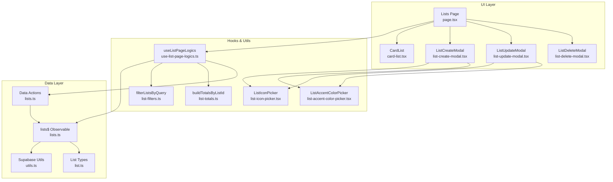
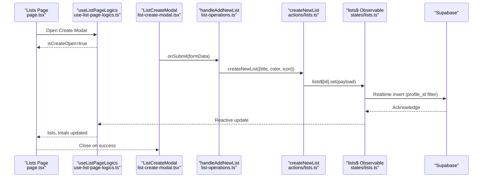
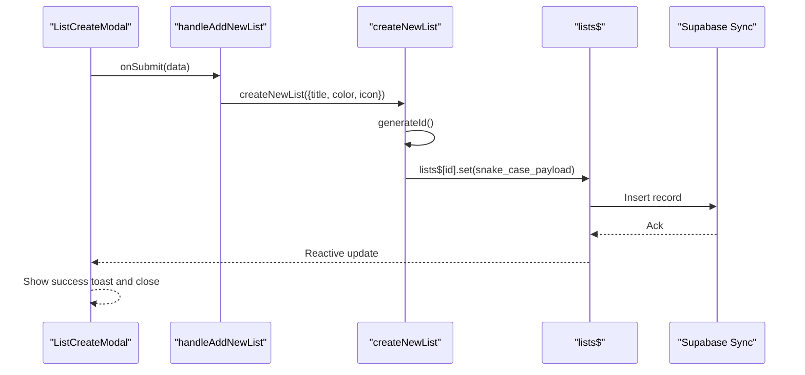
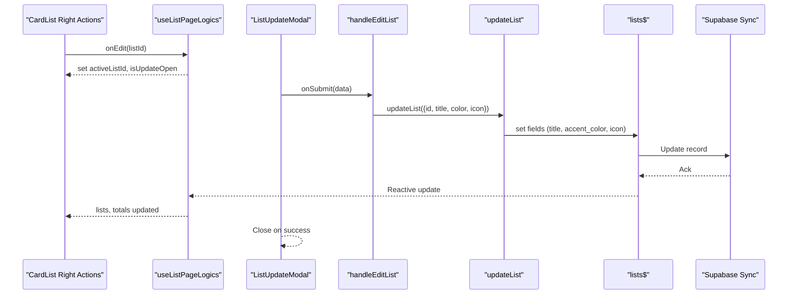
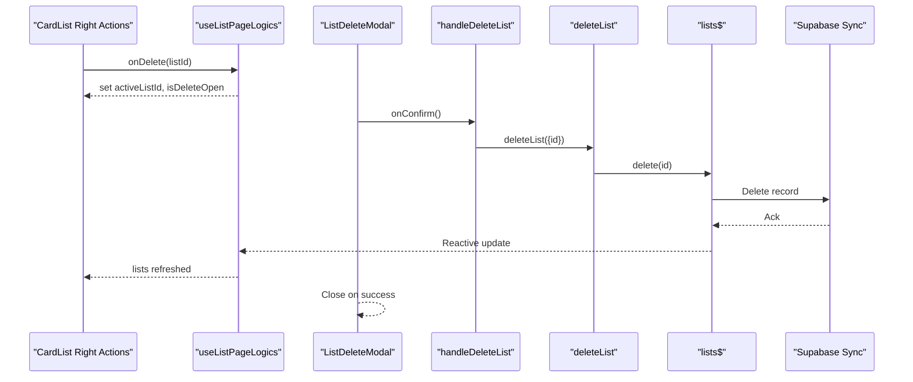
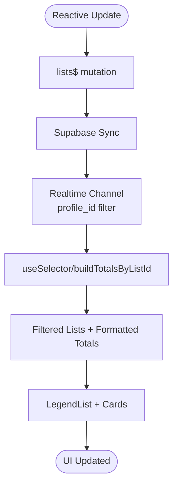
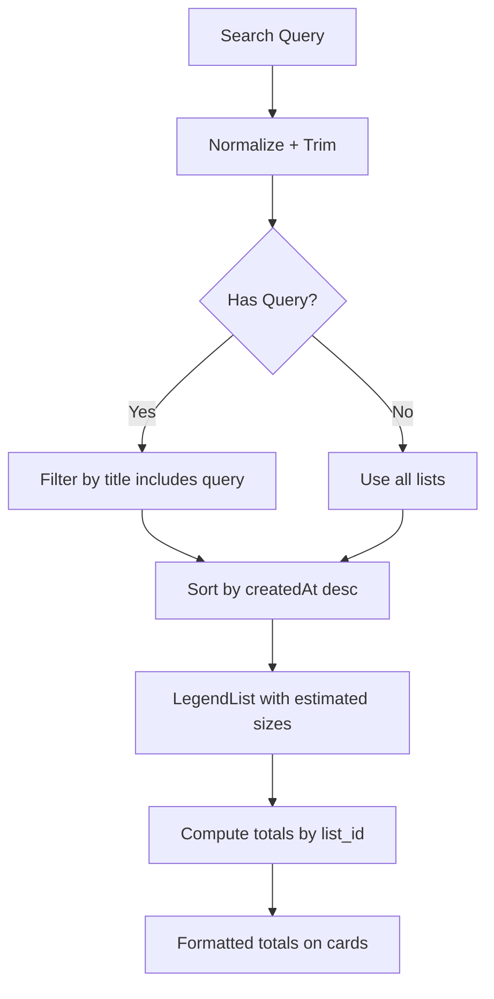
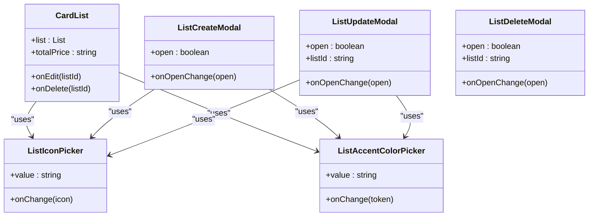
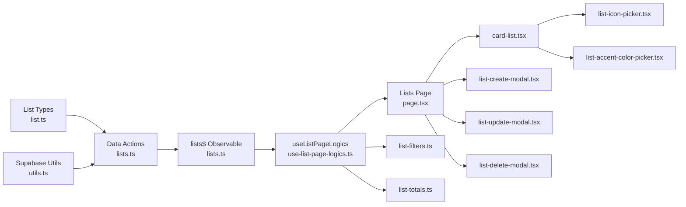

# List CRUD Operations

<cite>
**Referenced Files in This Document**
- [page.tsx](file://src/features/lists/page.tsx)
- [use-list-page-logics.ts](file://src/features/lists/hooks/use-list-page-logics.ts)
- [lists.ts](file://src/data/states/lists.ts)
- [lists.ts](file://src/data/actions/lists.ts)
- [list-operations.ts](file://src/features/lists/utils/list-operations.ts)
- [list-filters.ts](file://src/features/lists/utils/list-filters.ts)
- [list-totals.ts](file://src/features/lists/utils/list-totals.ts)
- [card-list.tsx](file://src/features/lists/components/card-list.tsx)
- [list-icon-picker.tsx](file://src/features/lists/components/list-icon-picker.tsx)
- [list-accent-color-picker.tsx](file://src/features/lists/components/list-accent-color-picker.tsx)
- [list-create-modal.tsx](file://src/features/lists/modals/list-create-modal.tsx)
- [list-update-modal.tsx](file://src/features/lists/modals/list-update-modal.tsx)
- [list-delete-modal.tsx](file://src/features/lists/modals/list-delete-modal.tsx)
- [list.ts](file://src/data/types/list.ts)
- [utils.ts](file://src/lib/supabase/utils.ts)
</cite>

## Table of Contents
1. [Introduction](#introduction)
2. [Project Structure](#project-structure)
3. [Core Components](#core-components)
4. [Architecture Overview](#architecture-overview)
5. [Detailed Component Analysis](#detailed-component-analysis)
6. [Dependency Analysis](#dependency-analysis)
7. [Performance Considerations](#performance-considerations)
8. [Troubleshooting Guide](#troubleshooting-guide)
9. [Conclusion](#conclusion)

## Introduction
This document explains the complete lifecycle of list CRUD operations in the shopping list management system. It covers list creation with form validation, icon selection, accent color configuration, and initial setup; modification workflows for name, icon, color, and metadata; deletion with confirmation and cascade handling; reactive state management using LegendAppState for real-time updates; filtering, search, and pagination strategies; and integration with card-based UI and modal systems.

## Project Structure
The list management feature is organized around:
- Page container orchestrating UI, state, and modals
- Hooks managing reactive data and derived computations
- Data layer with observable state synchronized to Supabase
- Utilities for filtering, totals, and icon/color pickers
- Modals implementing create, update, and delete workflows
- Card component rendering list entries with swipe actions

**Diagram sources**
- [page.tsx:1-98](file://src/features/lists/page.tsx#L1-L98)
- [use-list-page-logics.ts:1-82](file://src/features/lists/hooks/use-list-page-logics.ts#L1-L82)
- [lists.ts:1-27](file://src/data/states/lists.ts#L1-L27)
- [lists.ts:1-211](file://src/data/actions/lists.ts#L1-L211)
- [list-operations.ts:1-73](file://src/features/lists/utils/list-operations.ts#L1-L73)
- [list-filters.ts:1-14](file://src/features/lists/utils/list-filters.ts#L1-L14)
- [list-totals.ts:1-32](file://src/features/lists/utils/list-totals.ts#L1-L32)
- [card-list.tsx:1-97](file://src/features/lists/components/card-list.tsx#L1-L97)
- [list-icon-picker.tsx:1-57](file://src/features/lists/components/list-icon-picker.tsx#L1-L57)
- [list-accent-color-picker.tsx:1-53](file://src/features/lists/components/list-accent-color-picker.tsx#L1-L53)
- [list-create-modal.tsx:1-151](file://src/features/lists/modals/list-create-modal.tsx#L1-L151)
- [list-update-modal.tsx:1-171](file://src/features/lists/modals/list-update-modal.tsx#L1-L171)
- [list-delete-modal.tsx:1-68](file://src/features/lists/modals/list-delete-modal.tsx#L1-L68)
- [list.ts:1-41](file://src/data/types/list.ts#L1-L41)
- [utils.ts:1-10](file://src/lib/supabase/utils.ts#L1-L10)

**Section sources**
- [page.tsx:1-98](file://src/features/lists/page.tsx#L1-L98)
- [use-list-page-logics.ts:1-82](file://src/features/lists/hooks/use-list-page-logics.ts#L1-L82)

## Core Components
- Lists page container renders the list grid, search bar, FAB, and modals; delegates logic to a hook.
- Hook manages reactive lists, derived totals, search query, and modal state.
- Data layer exposes an observable lists store synchronized to Supabase with realtime filters and persistence.
- Modals encapsulate create/update/delete forms with validation and submission.
- Card component displays list metadata, handles navigation, and swipe actions.
- Utilities provide filtering, totals computation, icon mapping, and accent color tokens.

**Section sources**
- [page.tsx:24-98](file://src/features/lists/page.tsx#L24-L98)
- [use-list-page-logics.ts:13-82](file://src/features/lists/hooks/use-list-page-logics.ts#L13-L82)
- [lists.ts:5-27](file://src/data/states/lists.ts#L5-L27)
- [lists.ts:1-211](file://src/data/actions/lists.ts#L1-L211)
- [card-list.tsx:24-97](file://src/features/lists/components/card-list.tsx#L24-L97)
- [list-filters.ts:1-14](file://src/features/lists/utils/list-filters.ts#L1-L14)
- [list-totals.ts:1-32](file://src/features/lists/utils/list-totals.ts#L1-L32)
- [list-icon-picker.tsx:16-57](file://src/features/lists/components/list-icon-picker.tsx#L16-L57)
- [list-accent-color-picker.tsx:17-53](file://src/features/lists/components/list-accent-color-picker.tsx#L17-L53)

## Architecture Overview
The system uses LegendAppState for reactive state and Supabase for persistence and realtime synchronization. The flow is:
- UI triggers actions via modals and page logic
- Actions mutate the observable lists store
- Store syncs to Supabase; realtime filters ensure per-user isolation
- Page re-renders automatically due to reactive selectors and memoization

**Diagram sources**
- [page.tsx:59-92](file://src/features/lists/page.tsx#L59-L92)
- [use-list-page-logics.ts:48-60](file://src/features/lists/hooks/use-list-page-logics.ts#L48-L60)
- [list-create-modal.tsx:70-88](file://src/features/lists/modals/list-create-modal.tsx#L70-L88)
- [list-operations.ts:9-34](file://src/features/lists/utils/list-operations.ts#L9-L34)
- [lists.ts:79-122](file://src/data/actions/lists.ts#L79-L122)
- [lists.ts:5-27](file://src/data/states/lists.ts#L5-L27)

## Detailed Component Analysis

### List Creation Lifecycle
- Form validation ensures minimum length for title and defaults for icon/color.
- On submit, the modal calls a handler that invokes the action to create a new list.
- The action generates an ID, prepares payload, writes to the observable store, and triggers Supabase sync.
- UI shows success feedback and closes the modal.

**Diagram sources**
- [list-create-modal.tsx:70-88](file://src/features/lists/modals/list-create-modal.tsx#L70-L88)
- [list-operations.ts:9-34](file://src/features/lists/utils/list-operations.ts#L9-L34)
- [lists.ts:79-122](file://src/data/actions/lists.ts#L79-L122)
- [lists.ts:5-27](file://src/data/states/lists.ts#L5-L27)

**Section sources**
- [list-create-modal.tsx:26-53](file://src/features/lists/modals/list-create-modal.tsx#L26-L53)
- [list-create-modal.tsx:70-88](file://src/features/lists/modals/list-create-modal.tsx#L70-L88)
- [list-operations.ts:9-34](file://src/features/lists/utils/list-operations.ts#L9-L34)
- [lists.ts:79-122](file://src/data/actions/lists.ts#L79-L122)

### List Modification Workflow
- Update modal loads current values and enables save only when changes exist.
- Validation enforces minimum title length; icon and color are optional but validated.
- Submission calls the handler, which invokes the update action.
- The action updates observable fields; Supabase sync propagates changes.
- UI reflects updates instantly due to reactive selectors.

**Diagram sources**
- [card-list.tsx:46-56](file://src/features/lists/components/card-list.tsx#L46-L56)
- [use-list-page-logics.ts:52-60](file://src/features/lists/hooks/use-list-page-logics.ts#L52-L60)
- [list-update-modal.tsx:83-100](file://src/features/lists/modals/list-update-modal.tsx#L83-L100)
- [list-operations.ts:36-62](file://src/features/lists/utils/list-operations.ts#L36-L62)
- [lists.ts:144-170](file://src/data/actions/lists.ts#L144-L170)
- [lists.ts:5-27](file://src/data/states/lists.ts#L5-L27)

**Section sources**
- [list-update-modal.tsx:30-78](file://src/features/lists/modals/list-update-modal.tsx#L30-L78)
- [list-update-modal.tsx:83-113](file://src/features/lists/modals/list-update-modal.tsx#L83-L113)
- [list-operations.ts:36-62](file://src/features/lists/utils/list-operations.ts#L36-L62)
- [lists.ts:144-170](file://src/data/actions/lists.ts#L144-L170)

### List Deletion Process
- Delete modal confirms destructive action and disables confirm if no listId.
- Submission calls the handler, which invokes the delete action.
- The action deletes the observable record; Supabase sync removes it.
- UI updates immediately; the modal closes after success.

**Diagram sources**
- [card-list.tsx:46-56](file://src/features/lists/components/card-list.tsx#L46-L56)
- [use-list-page-logics.ts:57-60](file://src/features/lists/hooks/use-list-page-logics.ts#L57-L60)
- [list-delete-modal.tsx:30-40](file://src/features/lists/modals/list-delete-modal.tsx#L30-L40)
- [list-operations.ts:64-72](file://src/features/lists/utils/list-operations.ts#L64-L72)
- [lists.ts:187-203](file://src/data/actions/lists.ts#L187-L203)
- [lists.ts:5-27](file://src/data/states/lists.ts#L5-L27)

**Section sources**
- [list-delete-modal.tsx:23-40](file://src/features/lists/modals/list-delete-modal.tsx#L23-L40)
- [list-operations.ts:64-72](file://src/features/lists/utils/list-operations.ts#L64-L72)
- [lists.ts:187-203](file://src/data/actions/lists.ts#L187-L203)

### Reactive State Management with LegendAppState
- The lists store is an observable synced to Supabase with:
  - Select fields including nested list items
  - Filter by current profile_id
  - Realtime channel scoped to the user
  - Persistence and retry behavior
- The page hook subscribes to lists and computes derived totals and filtered lists reactively.
- Memoization prevents unnecessary re-renders; UI updates automatically when data changes.

**Diagram sources**
- [lists.ts:5-27](file://src/data/states/lists.ts#L5-L27)
- [use-list-page-logics.ts:28-46](file://src/features/lists/hooks/use-list-page-logics.ts#L28-L46)
- [list-totals.ts:9-31](file://src/features/lists/utils/list-totals.ts#L9-L31)

**Section sources**
- [lists.ts:5-27](file://src/data/states/lists.ts#L5-L27)
- [use-list-page-logics.ts:19-46](file://src/features/lists/hooks/use-list-page-logics.ts#L19-L46)

### Filtering, Search, and Pagination Strategies
- Filtering and search:
  - Normalize query and filter by title inclusion
  - Sort descending by created date for recency
- Pagination:
  - Uses a virtualized list with estimated item size and draw distance
  - Recycles items to optimize rendering performance
- Totals:
  - Aggregates list items by list_id using decimal arithmetic
  - Formats totals per list for display

**Diagram sources**
- [list-filters.ts:3-13](file://src/features/lists/utils/list-filters.ts#L3-L13)
- [page.tsx:73-84](file://src/features/lists/page.tsx#L73-L84)
- [list-totals.ts:9-31](file://src/features/lists/utils/list-totals.ts#L9-L31)

**Section sources**
- [list-filters.ts:1-14](file://src/features/lists/utils/list-filters.ts#L1-L14)
- [page.tsx:16-17](file://src/features/lists/page.tsx#L16-L17)
- [page.tsx:73-84](file://src/features/lists/page.tsx#L73-L84)
- [list-totals.ts:1-32](file://src/features/lists/utils/list-totals.ts#L1-L32)

### Integration with Card-Based UI and Modals
- CardList renders list metadata, applies accent color classes, and supports swipe-to-edit/delete.
- Modals provide structured forms with validation, controlled inputs, and footer actions.
- Icon picker and accent color picker expose curated options and maintain accessibility labels.

**Diagram sources**
- [card-list.tsx:24-97](file://src/features/lists/components/card-list.tsx#L24-L97)
- [list-icon-picker.tsx:16-57](file://src/features/lists/components/list-icon-picker.tsx#L16-L57)
- [list-accent-color-picker.tsx:17-53](file://src/features/lists/components/list-accent-color-picker.tsx#L17-L53)
- [list-create-modal.tsx:39-151](file://src/features/lists/modals/list-create-modal.tsx#L39-L151)
- [list-update-modal.tsx:44-171](file://src/features/lists/modals/list-update-modal.tsx#L44-L171)
- [list-delete-modal.tsx:23-68](file://src/features/lists/modals/list-delete-modal.tsx#L23-L68)

**Section sources**
- [card-list.tsx:24-97](file://src/features/lists/components/card-list.tsx#L24-L97)
- [list-icon-picker.tsx:16-57](file://src/features/lists/components/list-icon-picker.tsx#L16-L57)
- [list-accent-color-picker.tsx:17-53](file://src/features/lists/components/list-accent-color-picker.tsx#L17-L53)
- [list-create-modal.tsx:39-151](file://src/features/lists/modals/list-create-modal.tsx#L39-L151)
- [list-update-modal.tsx:44-171](file://src/features/lists/modals/list-update-modal.tsx#L44-L171)
- [list-delete-modal.tsx:23-68](file://src/features/lists/modals/list-delete-modal.tsx#L23-L68)

## Dependency Analysis
- Data types define the canonical shape for lists and CRUD signatures.
- Actions depend on the observable store and utilities for key conversion.
- Hooks depend on actions and utilities for filtering/totals.
- UI components depend on icons/colors utilities and modal handlers.

**Diagram sources**
- [list.ts:1-41](file://src/data/types/list.ts#L1-L41)
- [lists.ts:1-211](file://src/data/actions/lists.ts#L1-L211)
- [utils.ts:1-10](file://src/lib/supabase/utils.ts#L1-L10)
- [lists.ts:5-27](file://src/data/states/lists.ts#L5-L27)
- [use-list-page-logics.ts:1-82](file://src/features/lists/hooks/use-list-page-logics.ts#L1-L82)
- [page.tsx:1-98](file://src/features/lists/page.tsx#L1-L98)
- [list-filters.ts:1-14](file://src/features/lists/utils/list-filters.ts#L1-L14)
- [list-totals.ts:1-32](file://src/features/lists/utils/list-totals.ts#L1-L32)
- [card-list.tsx:1-97](file://src/features/lists/components/card-list.tsx#L1-L97)
- [list-icon-picker.tsx:1-57](file://src/features/lists/components/list-icon-picker.tsx#L1-L57)
- [list-accent-color-picker.tsx:1-53](file://src/features/lists/components/list-accent-color-picker.tsx#L1-L53)
- [list-create-modal.tsx:1-151](file://src/features/lists/modals/list-create-modal.tsx#L1-L151)
- [list-update-modal.tsx:1-171](file://src/features/lists/modals/list-update-modal.tsx#L1-L171)
- [list-delete-modal.tsx:1-68](file://src/features/lists/modals/list-delete-modal.tsx#L1-L68)

**Section sources**
- [list.ts:1-41](file://src/data/types/list.ts#L1-L41)
- [lists.ts:1-211](file://src/data/actions/lists.ts#L1-L211)
- [utils.ts:1-10](file://src/lib/supabase/utils.ts#L1-L10)
- [lists.ts:5-27](file://src/data/states/lists.ts#L5-L27)
- [use-list-page-logics.ts:1-82](file://src/features/lists/hooks/use-list-page-logics.ts#L1-L82)
- [page.tsx:1-98](file://src/features/lists/page.tsx#L1-L98)

## Performance Considerations
- Virtualized rendering: Estimated item size and draw distance reduce layout work; recycling items improves scroll performance.
- Reactive memoization: Derived totals and filtered lists computed once per change and reused across renders.
- Minimal re-renders: Memoized card props and selective updates prevent unnecessary UI churn.
- Efficient aggregation: Decimal arithmetic minimizes floating-point errors in totals.

[No sources needed since this section provides general guidance]

## Troubleshooting Guide
- Validation failures:
  - Title must meet minimum length; invalid submissions focus the title input and show error messages.
- Submission errors:
  - Toast notifications inform users when create/edit/delete fails; modals remain open to retry.
- Realtime desync:
  - Ensure the user is authenticated and the realtime filter matches the current profile_id.
- Cascading effects:
  - Deleting a list triggers deletion of associated list items via the data layer; verify backend cascade rules if needed.

**Section sources**
- [list-create-modal.tsx:90-94](file://src/features/lists/modals/list-create-modal.tsx#L90-L94)
- [list-update-modal.tsx:102-113](file://src/features/lists/modals/list-update-modal.tsx#L102-L113)
- [lists.ts:5-27](file://src/data/states/lists.ts#L5-L27)

## Conclusion
The list CRUD system combines reactive state, robust validation, and a clean separation of concerns across UI, hooks, actions, and utilities. Users benefit from immediate feedback, consistent visuals via icon and color pickers, and reliable synchronization across devices through Supabase. Filtering, totals, and pagination ensure scalable performance on large datasets.