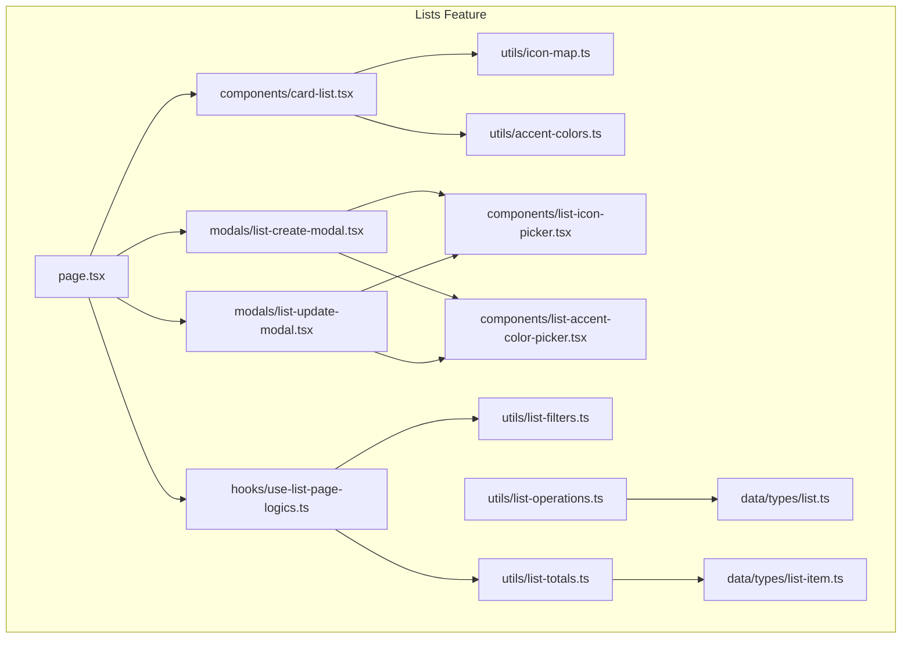
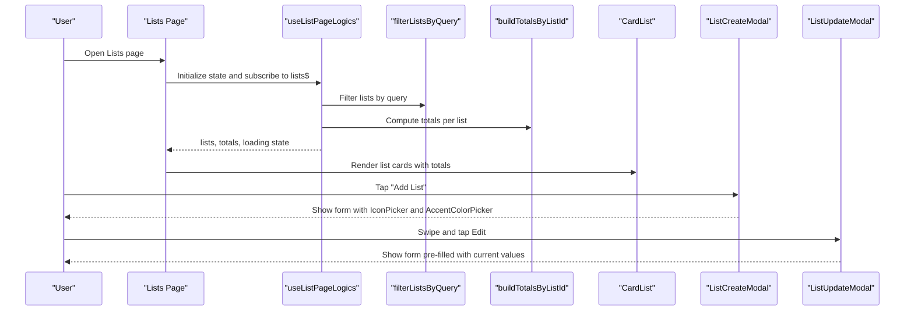
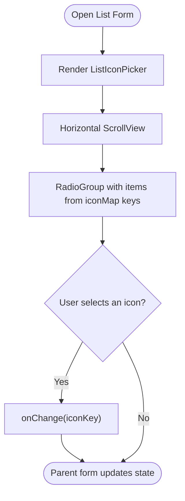
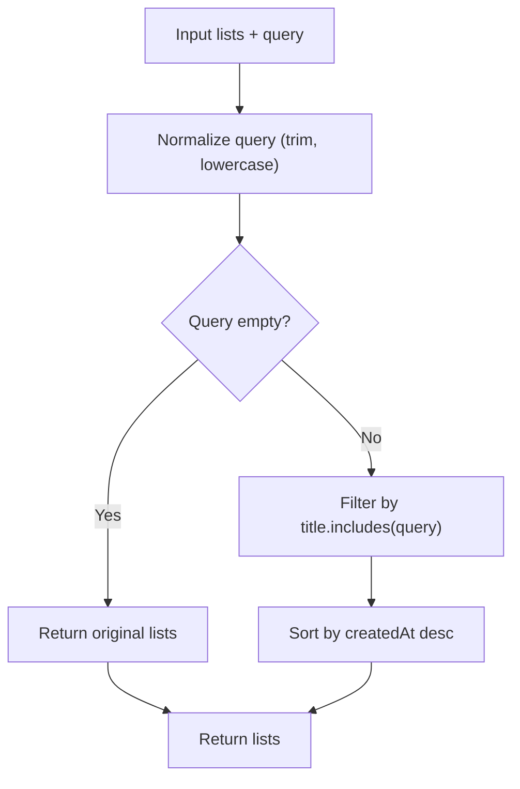
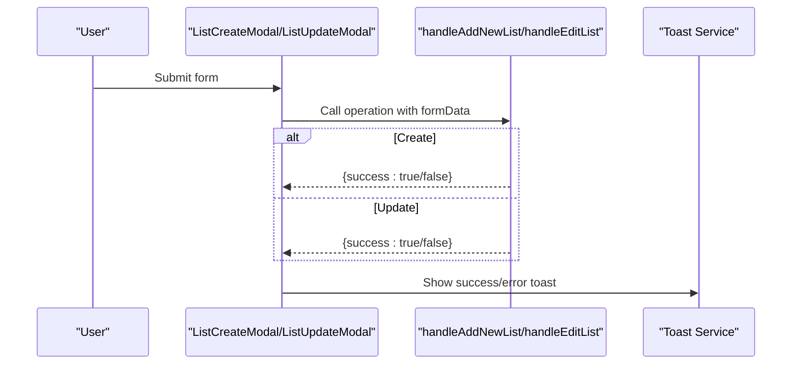
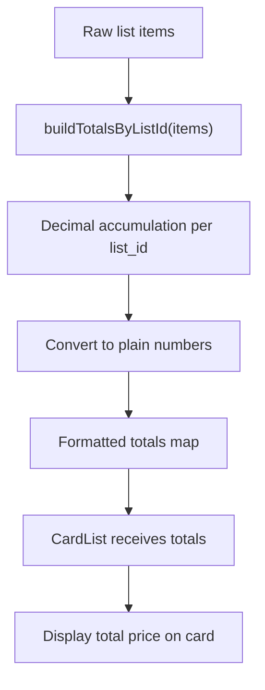
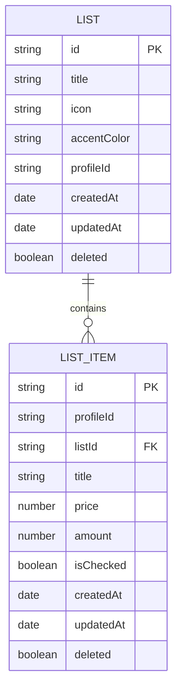
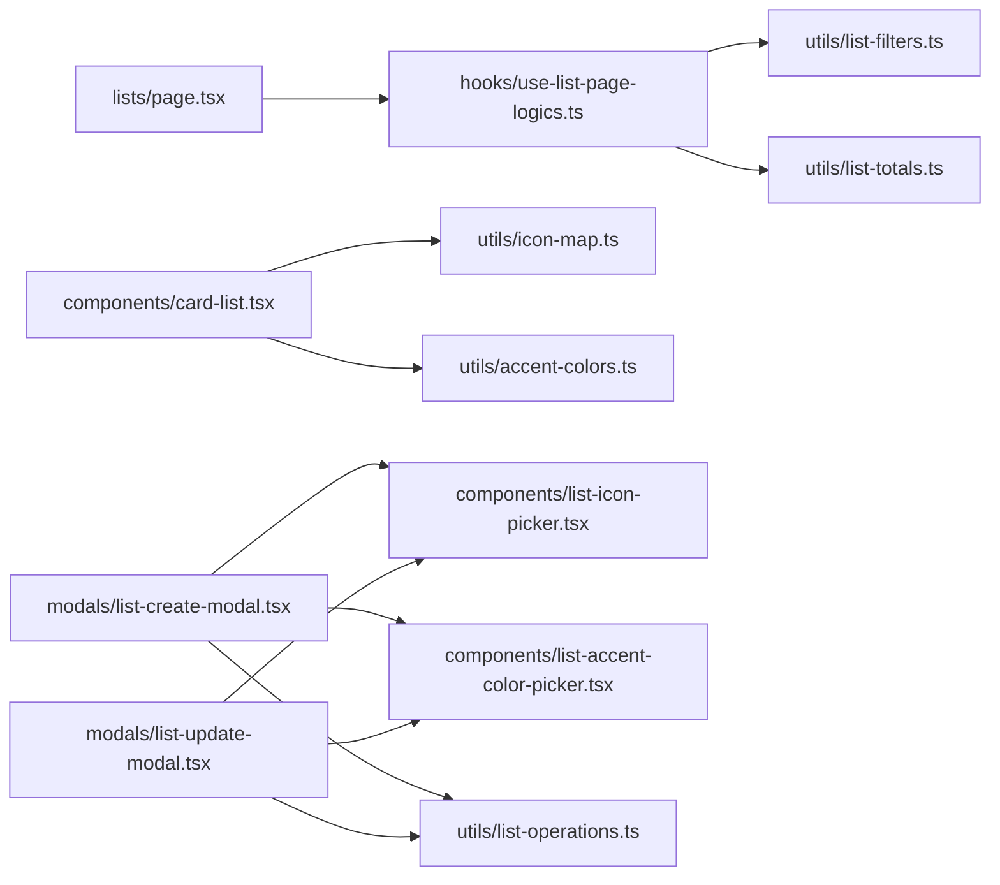

# List Organization Features

<cite>
**Referenced Files in This Document**
- [src/features/lists/components/list-icon-picker.tsx](file://src/features/lists/components/list-icon-picker.tsx)
- [src/features/lists/components/list-accent-color-picker.tsx](file://src/features/lists/components/list-accent-color-picker.tsx)
- [src/features/lists/utils/icon-map.ts](file://src/features/lists/utils/icon-map.ts)
- [src/features/lists/utils/accent-colors.ts](file://src/features/lists/utils/accent-colors.ts)
- [src/features/lists/utils/list-filters.ts](file://src/features/lists/utils/list-filters.ts)
- [src/features/lists/utils/list-operations.ts](file://src/features/lists/utils/list-operations.ts)
- [src/features/lists/page.tsx](file://src/features/lists/page.tsx)
- [src/features/lists/components/card-list.tsx](file://src/features/lists/components/card-list.tsx)
- [src/features/lists/hooks/use-list-page-logics.ts](file://src/features/lists/hooks/use-list-page-logics.ts)
- [src/features/lists/modals/list-create-modal.tsx](file://src/features/lists/modals/list-create-modal.tsx)
- [src/features/lists/modals/list-update-modal.tsx](file://src/features/lists/modals/list-update-modal.tsx)
- [src/features/lists/utils/list-totals.ts](file://src/features/lists/utils/list-totals.ts)
- [src/data/types/list.ts](file://src/data/types/list.ts)
- [src/data/types/list-item.ts](file://src/data/types/list-item.ts)
</cite>

## Table of Contents
1. [Introduction](#introduction)
2. [Project Structure](#project-structure)
3. [Core Components](#core-components)
4. [Architecture Overview](#architecture-overview)
5. [Detailed Component Analysis](#detailed-component-analysis)
6. [Dependency Analysis](#dependency-analysis)
7. [Performance Considerations](#performance-considerations)
8. [Troubleshooting Guide](#troubleshooting-guide)
9. [Conclusion](#conclusion)
10. [Appendices](#appendices)

## Introduction
This document explains how PowerLists organizes and personalizes shopping lists. It covers the icon selection system, accent color theming, filtering and sorting, list operations (create, update, delete), and practical strategies for categorization and visual organization. It also outlines how templates and predefined categories can support common shopping scenarios.

## Project Structure
The list organization features are implemented primarily under the lists feature module:
- UI pickers for icons and accent colors
- Filtering and totals computation utilities
- Page and modal components for list creation/update
- Card rendering and swipe actions for list entries
- Types for lists and list items



**Diagram sources**
- [src/features/lists/page.tsx:1-98](file://src/features/lists/page.tsx#L1-L98)
- [src/features/lists/hooks/use-list-page-logics.ts:1-82](file://src/features/lists/hooks/use-list-page-logics.ts#L1-L82)
- [src/features/lists/components/card-list.tsx:1-97](file://src/features/lists/components/card-list.tsx#L1-L97)
- [src/features/lists/components/list-icon-picker.tsx:1-57](file://src/features/lists/components/list-icon-picker.tsx#L1-L57)
- [src/features/lists/components/list-accent-color-picker.tsx:1-53](file://src/features/lists/components/list-accent-color-picker.tsx#L1-L53)
- [src/features/lists/utils/list-filters.ts:1-14](file://src/features/lists/utils/list-filters.ts#L1-L14)
- [src/features/lists/utils/list-operations.ts:1-73](file://src/features/lists/utils/list-operations.ts#L1-L73)
- [src/features/lists/utils/list-totals.ts:1-32](file://src/features/lists/utils/list-totals.ts#L1-L32)
- [src/features/lists/modals/list-create-modal.tsx:1-151](file://src/features/lists/modals/list-create-modal.tsx#L1-L151)
- [src/features/lists/modals/list-update-modal.tsx:1-171](file://src/features/lists/modals/list-update-modal.tsx#L1-L171)
- [src/features/lists/utils/icon-map.ts:1-20](file://src/features/lists/utils/icon-map.ts#L1-L20)
- [src/features/lists/utils/accent-colors.ts:1-93](file://src/features/lists/utils/accent-colors.ts#L1-L93)
- [src/data/types/list.ts:1-41](file://src/data/types/list.ts#L1-L41)
- [src/data/types/list-item.ts:1-38](file://src/data/types/list-item.ts#L1-L38)

**Section sources**
- [src/features/lists/page.tsx:1-98](file://src/features/lists/page.tsx#L1-L98)
- [src/features/lists/hooks/use-list-page-logics.ts:1-82](file://src/features/lists/hooks/use-list-page-logics.ts#L1-L82)

## Core Components
- Icon Picker: Horizontal scrollable radio group selecting from a curated set of shopping-related icons.
- Accent Color Picker: Horizontal scrollable radio group selecting from a semantic color palette.
- List Filters: Search by title with automatic recency sort.
- List Operations: Create, update, and delete lists with feedback.
- List Totals: Aggregates per list for display on cards.
- List Cards: Swipeable cards with icon and accent color applied consistently.

**Section sources**
- [src/features/lists/components/list-icon-picker.tsx:1-57](file://src/features/lists/components/list-icon-picker.tsx#L1-L57)
- [src/features/lists/components/list-accent-color-picker.tsx:1-53](file://src/features/lists/components/list-accent-color-picker.tsx#L1-L53)
- [src/features/lists/utils/list-filters.ts:1-14](file://src/features/lists/utils/list-filters.ts#L1-L14)
- [src/features/lists/utils/list-operations.ts:1-73](file://src/features/lists/utils/list-operations.ts#L1-L73)
- [src/features/lists/utils/list-totals.ts:1-32](file://src/features/lists/utils/list-totals.ts#L1-L32)
- [src/features/lists/components/card-list.tsx:1-97](file://src/features/lists/components/card-list.tsx#L1-L97)

## Architecture Overview
The lists page orchestrates data fetching, filtering, totals computation, and rendering. Modals provide forms for creating and updating lists, integrating the icon and color pickers. The card component renders each list with its icon and accent color, and swipe actions expose edit/delete.



**Diagram sources**
- [src/features/lists/page.tsx:1-98](file://src/features/lists/page.tsx#L1-L98)
- [src/features/lists/hooks/use-list-page-logics.ts:1-82](file://src/features/lists/hooks/use-list-page-logics.ts#L1-L82)
- [src/features/lists/utils/list-filters.ts:1-14](file://src/features/lists/utils/list-filters.ts#L1-L14)
- [src/features/lists/utils/list-totals.ts:1-32](file://src/features/lists/utils/list-totals.ts#L1-L32)
- [src/features/lists/components/card-list.tsx:1-97](file://src/features/lists/components/card-list.tsx#L1-L97)
- [src/features/lists/modals/list-create-modal.tsx:1-151](file://src/features/lists/modals/list-create-modal.tsx#L1-L151)
- [src/features/lists/modals/list-update-modal.tsx:1-171](file://src/features/lists/modals/list-update-modal.tsx#L1-L171)

## Detailed Component Analysis

### Icon Selection System
- Available icons are defined as a map keyed by semantic names and mapped to Tabler icon components.
- The icon picker renders a horizontal scrollable row of circular radio items, each displaying an icon.
- Selected icon is propagated via a callback to parent forms.



**Diagram sources**
- [src/features/lists/components/list-icon-picker.tsx:1-57](file://src/features/lists/components/list-icon-picker.tsx#L1-L57)
- [src/features/lists/utils/icon-map.ts:1-20](file://src/features/lists/utils/icon-map.ts#L1-L20)

**Section sources**
- [src/features/lists/components/list-icon-picker.tsx:1-57](file://src/features/lists/components/list-icon-picker.tsx#L1-L57)
- [src/features/lists/utils/icon-map.ts:1-20](file://src/features/lists/utils/icon-map.ts#L1-L20)

### Accent Color System
- Semantic tokens define a fixed set of accent colors (e.g., primary, destructive, success, warning, info).
- Each token maps to Tailwind-like class names for background, foreground, and card variants.
- The color picker renders a horizontal row of color swatches; selection resolves to a validated token.
- Cards apply the selected token’s background/foreground classes consistently.

```mermaid
classDiagram
class AccentColorToken {
<<enum>>
"primary"
"secondary"
"muted"
"destructive"
"success"
"warning"
"info"
}
class AccentColorOption {
+value : AccentColorToken
+label : string
+swatchClassName : string
+foregroundClassName : string
+cardClassName : string
+cardForegroundClassName : string
}
class AccentColors {
+DEFAULT_ACCENT_COLOR : AccentColorToken
+LIST_ACCENT_COLOR_OPTIONS : AccentColorOption[]
+isAccentColorToken(value) : boolean
+getAccentColorToken(value) : AccentColorToken
+getAccentColorOption(value) : AccentColorOption
+getAccentColorCardClasses(value) : {backgroundClassName, foregroundClassName}
}
AccentColors --> AccentColorToken : "validates"
AccentColors --> AccentColorOption : "returns"
```

**Diagram sources**
- [src/features/lists/utils/accent-colors.ts:1-93](file://src/features/lists/utils/accent-colors.ts#L1-L93)

**Section sources**
- [src/features/lists/components/list-accent-color-picker.tsx:1-53](file://src/features/lists/components/list-accent-color-picker.tsx#L1-L53)
- [src/features/lists/utils/accent-colors.ts:1-93](file://src/features/lists/utils/accent-colors.ts#L1-L93)
- [src/features/lists/components/card-list.tsx:1-97](file://src/features/lists/components/card-list.tsx#L1-L97)

### Filtering and Sorting
- Search: Filters lists by title substring match (case-insensitive).
- Sort: Defaults to recency (newest first) when a query is present; otherwise preserves input order.



**Diagram sources**
- [src/features/lists/utils/list-filters.ts:1-14](file://src/features/lists/utils/list-filters.ts#L1-L14)

**Section sources**
- [src/features/lists/utils/list-filters.ts:1-14](file://src/features/lists/utils/list-filters.ts#L1-L14)
- [src/features/lists/hooks/use-list-page-logics.ts:33-36](file://src/features/lists/hooks/use-list-page-logics.ts#L33-L36)

### List Operations
- Create: Submits title, icon, and color; displays success/error toast.
- Update: Loads current values into the form; validates changes; submits updates.
- Delete: Delegates to action layer; returns success state.



**Diagram sources**
- [src/features/lists/utils/list-operations.ts:1-73](file://src/features/lists/utils/list-operations.ts#L1-L73)
- [src/features/lists/modals/list-create-modal.tsx:70-88](file://src/features/lists/modals/list-create-modal.tsx#L70-L88)
- [src/features/lists/modals/list-update-modal.tsx:83-99](file://src/features/lists/modals/list-update-modal.tsx#L83-L99)

**Section sources**
- [src/features/lists/utils/list-operations.ts:1-73](file://src/features/lists/utils/list-operations.ts#L1-L73)
- [src/features/lists/modals/list-create-modal.tsx:1-151](file://src/features/lists/modals/list-create-modal.tsx#L1-L151)
- [src/features/lists/modals/list-update-modal.tsx:1-171](file://src/features/lists/modals/list-update-modal.tsx#L1-L171)

### List Totals and Rendering
- Totals: Aggregates price × amount per list using decimal arithmetic.
- Rendering: Cards show title and total price; icon and accent color are applied consistently.



**Diagram sources**
- [src/features/lists/utils/list-totals.ts:1-32](file://src/features/lists/utils/list-totals.ts#L1-L32)
- [src/features/lists/hooks/use-list-page-logics.ts:28-46](file://src/features/lists/hooks/use-list-page-logics.ts#L28-L46)
- [src/features/lists/components/card-list.tsx:1-97](file://src/features/lists/components/card-list.tsx#L1-L97)

**Section sources**
- [src/features/lists/utils/list-totals.ts:1-32](file://src/features/lists/utils/list-totals.ts#L1-L32)
- [src/features/lists/hooks/use-list-page-logics.ts:28-46](file://src/features/lists/hooks/use-list-page-logics.ts#L28-L46)
- [src/features/lists/components/card-list.tsx:1-97](file://src/features/lists/components/card-list.tsx#L1-L97)

### List Types and Persistence
- List entity includes identifiers, title, icon, accent color, timestamps, and optional deletion flag.
- List items include identifiers, list association, pricing, amounts, and checked state.



**Diagram sources**
- [src/data/types/list.ts:1-41](file://src/data/types/list.ts#L1-L41)
- [src/data/types/list-item.ts:1-38](file://src/data/types/list-item.ts#L1-L38)

**Section sources**
- [src/data/types/list.ts:1-41](file://src/data/types/list.ts#L1-L41)
- [src/data/types/list-item.ts:1-38](file://src/data/types/list-item.ts#L1-L38)

## Dependency Analysis
- The lists page depends on the logic hook for filtering and totals.
- The logic hook depends on filtering and totals utilities.
- Card list depends on icon map and accent colors for visual rendering.
- Modals depend on pickers and operations for persistence.
- Operations depend on backend actions and toast service.



**Diagram sources**
- [src/features/lists/page.tsx:1-98](file://src/features/lists/page.tsx#L1-L98)
- [src/features/lists/hooks/use-list-page-logics.ts:1-82](file://src/features/lists/hooks/use-list-page-logics.ts#L1-L82)
- [src/features/lists/utils/list-filters.ts:1-14](file://src/features/lists/utils/list-filters.ts#L1-L14)
- [src/features/lists/utils/list-totals.ts:1-32](file://src/features/lists/utils/list-totals.ts#L1-L32)
- [src/features/lists/components/card-list.tsx:1-97](file://src/features/lists/components/card-list.tsx#L1-L97)
- [src/features/lists/components/list-icon-picker.tsx:1-57](file://src/features/lists/components/list-icon-picker.tsx#L1-L57)
- [src/features/lists/components/list-accent-color-picker.tsx:1-53](file://src/features/lists/components/list-accent-color-picker.tsx#L1-L53)
- [src/features/lists/modals/list-create-modal.tsx:1-151](file://src/features/lists/modals/list-create-modal.tsx#L1-L151)
- [src/features/lists/modals/list-update-modal.tsx:1-171](file://src/features/lists/modals/list-update-modal.tsx#L1-L171)
- [src/features/lists/utils/list-operations.ts:1-73](file://src/features/lists/utils/list-operations.ts#L1-L73)

**Section sources**
- [src/features/lists/page.tsx:1-98](file://src/features/lists/page.tsx#L1-L98)
- [src/features/lists/hooks/use-list-page-logics.ts:1-82](file://src/features/lists/hooks/use-list-page-logics.ts#L1-L82)

## Performance Considerations
- Virtualized lists: The page uses a virtualized list renderer to efficiently render large sets of cards.
- Memoization: Card props equality check prevents unnecessary re-renders.
- Lazy loading: Card list component is loaded lazily to reduce initial bundle size.
- Efficient filtering: Filtering and sorting are computed from normalized data and memoized.

[No sources needed since this section provides general guidance]

## Troubleshooting Guide
- Icon not visible: Ensure the icon key exists in the icon map; the card falls back to a default icon if unknown.
- Accent color not applied: Verify the selected token is valid; invalid values fall back to the default token.
- Search yields unexpected results: Confirm query normalization and that titles are stored consistently.
- Toast messages: Success/error notifications are shown after create/update operations; check network conditions if operations fail.

**Section sources**
- [src/features/lists/components/card-list.tsx:28-33](file://src/features/lists/components/card-list.tsx#L28-L33)
- [src/features/lists/utils/accent-colors.ts:71-78](file://src/features/lists/utils/accent-colors.ts#L71-L78)
- [src/features/lists/utils/list-filters.ts:3-13](file://src/features/lists/utils/list-filters.ts#L3-L13)
- [src/features/lists/utils/list-operations.ts:19-33](file://src/features/lists/utils/list-operations.ts#L19-L33)

## Conclusion
PowerLists provides a cohesive system for organizing shopping lists through customizable icons and semantic accent colors, robust filtering and totals computation, and intuitive create/update flows. The architecture cleanly separates UI pickers, logic, and persistence, enabling maintainable enhancements such as templates and predefined categories.

[No sources needed since this section summarizes without analyzing specific files]

## Appendices

### Icon Options
- cart
- credit-card-chip
- baby-carriage
- bag-suitcase
- ambulance
- book
- chef-hat

These keys map to specific icon components and are rendered in the icon picker.

**Section sources**
- [src/features/lists/utils/icon-map.ts:11-19](file://src/features/lists/utils/icon-map.ts#L11-L19)
- [src/features/lists/components/list-icon-picker.tsx:29-52](file://src/features/lists/components/list-icon-picker.tsx#L29-L52)

### Accent Color Tokens
- primary
- destructive
- success
- warning
- info

Each token defines background, foreground, and card class names for consistent theming.

**Section sources**
- [src/features/lists/utils/accent-colors.ts:1-93](file://src/features/lists/utils/accent-colors.ts#L1-L93)

### Filtering and Sorting Behavior
- Search: Case-insensitive substring match on titles.
- Sort: Newest lists appear first when a query is active; otherwise, order reflects input.

**Section sources**
- [src/features/lists/utils/list-filters.ts:3-13](file://src/features/lists/utils/list-filters.ts#L3-L13)
- [src/features/lists/hooks/use-list-page-logics.ts:33-36](file://src/features/lists/hooks/use-list-page-logics.ts#L33-L36)

### List Operations Summary
- Create: Submits title, icon, and color; shows success/error toast.
- Update: Loads current values; validates changes; persists updates.
- Delete: Delegates to action layer.

**Section sources**
- [src/features/lists/utils/list-operations.ts:9-34](file://src/features/lists/utils/list-operations.ts#L9-L34)
- [src/features/lists/utils/list-operations.ts:36-62](file://src/features/lists/utils/list-operations.ts#L36-L62)
- [src/features/lists/utils/list-operations.ts:64-72](file://src/features/lists/utils/list-operations.ts#L64-L72)

### Practical Organization Strategies
- Categorization: Use distinct icons and accent colors to visually separate categories (e.g., groceries, pharmacy, travel).
- Priority: Combine color tokens to signal urgency (e.g., warning for high-priority items).
- Templates: Predefined combinations of icon and color can be suggested for common scenarios (e.g., weekly groceries with a cart icon and primary color).
- Sorting: Rely on recency sorting to keep active lists prominent; refine with search queries.

[No sources needed since this section provides general guidance]