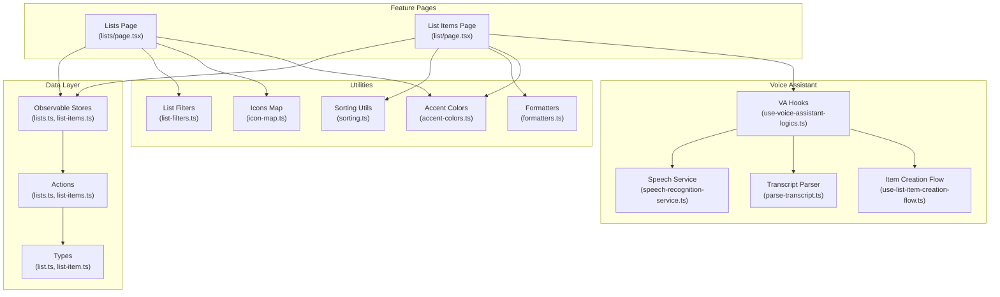
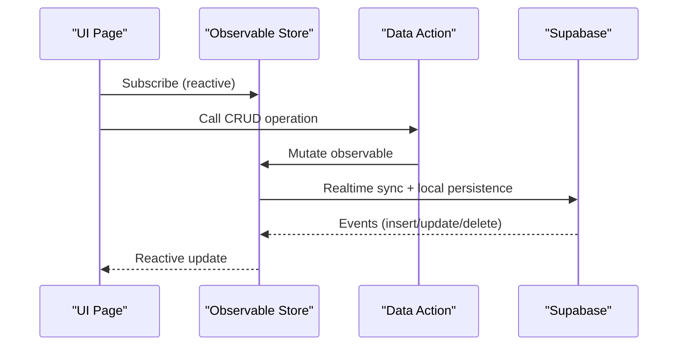
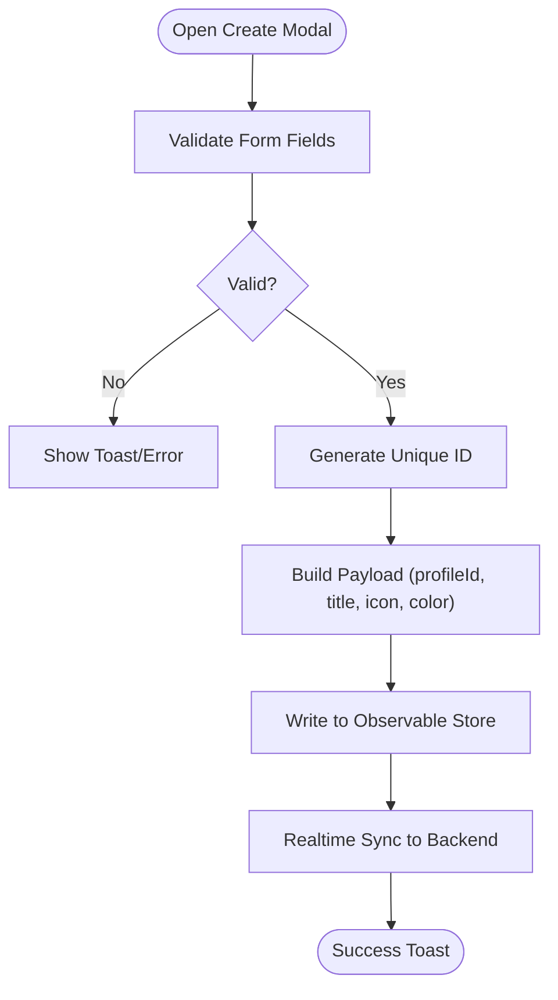
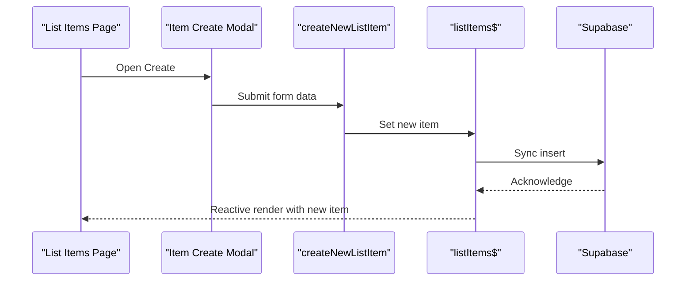
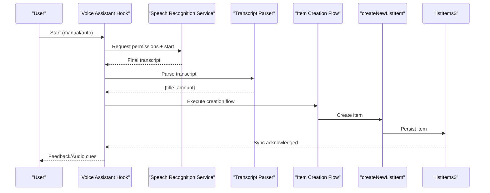
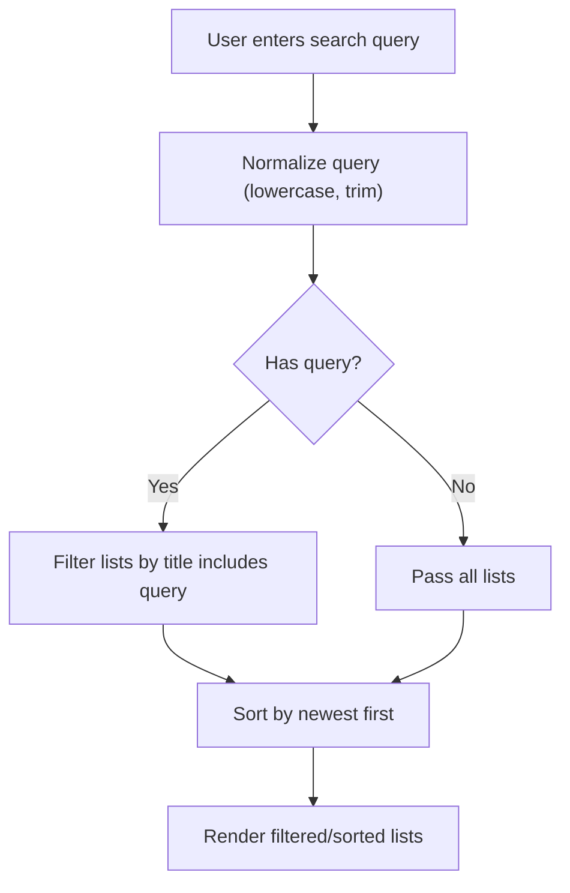
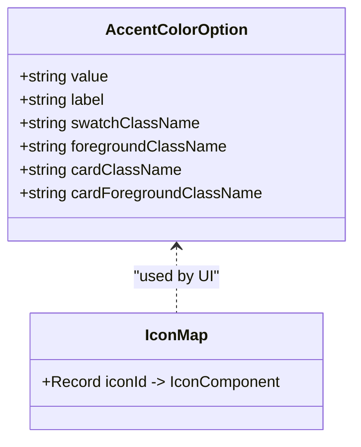
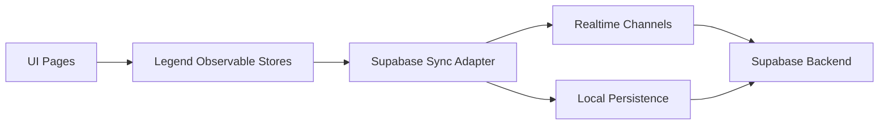
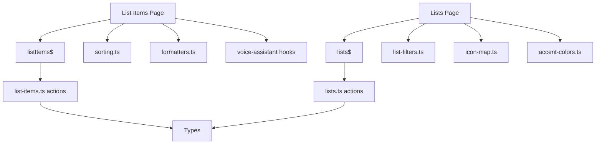

# Shopping List Management

<cite>
**Referenced Files in This Document**
- [src/data/types/list.ts](file://src/data/types/list.ts)
- [src/data/types/list-item.ts](file://src/data/types/list-item.ts)
- [src/features/lists/page.tsx](file://src/features/lists/page.tsx)
- [src/features/list/page.tsx](file://src/features/list/page.tsx)
- [src/data/states/lists.ts](file://src/data/states/lists.ts)
- [src/data/states/list-items.ts](file://src/data/states/list-items.ts)
- [src/data/actions/lists.ts](file://src/data/actions/lists.ts)
- [src/data/actions/list-items.ts](file://src/data/actions/list-items.ts)
- [src/features/lists/hooks/use-list-page-logics.ts](file://src/features/lists/hooks/use-list-page-logics.ts)
- [src/features/list/hooks/use-list-items-page-logics.ts](file://src/features/list/hooks/use-list-items-page-logics.ts)
- [src/features/lists/utils/list-filters.ts](file://src/features/lists/utils/list-filters.ts)
- [src/features/lists/utils/list-operations.ts](file://src/features/lists/utils/list-operations.ts)
- [src/features/lists/utils/icon-map.ts](file://src/features/lists/utils/icon-map.ts)
- [src/features/lists/utils/accent-colors.ts](file://src/features/lists/utils/accent-colors.ts)
- [src/features/lists/modals/list-create-modal.tsx](file://src/features/lists/modals/list-create-modal.tsx)
- [src/features/list/modals/item-create-modal.tsx](file://src/features/list/modals/item-create-modal.tsx)
- [src/features/voice-assistant/hooks/use-voice-assistant-logics.ts](file://src/features/voice-assistant/hooks/use-voice-assistant-logics.ts)
- [src/features/voice-assistant/services/speech-recognition-service.ts](file://src/features/voice-assistant/services/speech-recognition-service.ts)
- [src/features/voice-assistant/utils/parse-transcript.ts](file://src/features/voice-assistant/utils/parse-transcript.ts)
- [src/features/voice-assistant/hooks/use-list-item-creation-flow.ts](file://src/features/voice-assistant/hooks/use-list-item-creation-flow.ts)
- [src/services/sync.ts](file://src/services/sync.ts)
- [src/services/toast.ts](file://src/services/toast.ts)
- [src/utils/formatters.ts](file://src/utils/formatters.ts)
- [src/utils/sorting.ts](file://src/utils/sorting.ts)
</cite>

## Table of Contents
1. [Introduction](#introduction)
2. [Project Structure](#project-structure)
3. [Core Components](#core-components)
4. [Architecture Overview](#architecture-overview)
5. [Detailed Component Analysis](#detailed-component-analysis)
6. [Dependency Analysis](#dependency-analysis)
7. [Performance Considerations](#performance-considerations)
8. [Troubleshooting Guide](#troubleshooting-guide)
9. [Conclusion](#conclusion)
10. [Appendices](#appendices)

## Introduction
This document describes the shopping list management system, covering the lifecycle of list creation, modification, and deletion; list organization, categorization, and prioritization; item management operations (add, update, delete, bulk operations); voice-controlled item creation via natural language processing; filtering, sorting, and search; visual customization (icons, accent colors); reactive state management with real-time synchronization and offline persistence; and examples of list sharing, collaboration, and data export/import.

## Project Structure
The system is organized around feature-driven modules with clear separation of concerns:
- Data types define the canonical shapes for lists and items.
- Data actions encapsulate CRUD operations against the observable stores.
- Observable stores integrate with Supabase for real-time synchronization and local persistence.
- Feature pages orchestrate UI rendering and user interactions.
- Utilities provide filtering, sorting, formatting, and accent/color mapping.
- Voice assistant integrates speech recognition and NLP parsing to create items.

**Diagram sources**
- [src/features/lists/page.tsx:1-98](file://src/features/lists/page.tsx#L1-L98)
- [src/features/list/page.tsx:1-158](file://src/features/list/page.tsx#L1-L158)
- [src/data/types/list.ts:1-41](file://src/data/types/list.ts#L1-L41)
- [src/data/types/list-item.ts:1-38](file://src/data/types/list-item.ts#L1-L38)
- [src/data/actions/lists.ts:1-211](file://src/data/actions/lists.ts#L1-L211)
- [src/data/actions/list-items.ts:1-193](file://src/data/actions/list-items.ts#L1-L193)
- [src/data/states/lists.ts:1-27](file://src/data/states/lists.ts#L1-L27)
- [src/data/states/list-items.ts:1-24](file://src/data/states/list-items.ts#L1-L24)
- [src/features/lists/utils/list-filters.ts:1-14](file://src/features/lists/utils/list-filters.ts#L1-L14)
- [src/utils/sorting.ts](file://src/utils/sorting.ts)
- [src/utils/formatters.ts](file://src/utils/formatters.ts)
- [src/features/lists/utils/icon-map.ts:1-20](file://src/features/lists/utils/icon-map.ts#L1-L20)
- [src/features/lists/utils/accent-colors.ts:1-93](file://src/features/lists/utils/accent-colors.ts#L1-L93)
- [src/features/voice-assistant/hooks/use-voice-assistant-logics.ts:1-213](file://src/features/voice-assistant/hooks/use-voice-assistant-logics.ts#L1-L213)
- [src/features/voice-assistant/services/speech-recognition-service.ts:1-54](file://src/features/voice-assistant/services/speech-recognition-service.ts#L1-L54)
- [src/features/voice-assistant/utils/parse-transcript.ts](file://src/features/voice-assistant/utils/parse-transcript.ts)
- [src/features/voice-assistant/hooks/use-list-item-creation-flow.ts](file://src/features/voice-assistant/hooks/use-list-item-creation-flow.ts)

**Section sources**
- [src/features/lists/page.tsx:1-98](file://src/features/lists/page.tsx#L1-L98)
- [src/features/list/page.tsx:1-158](file://src/features/list/page.tsx#L1-L158)
- [src/data/types/list.ts:1-41](file://src/data/types/list.ts#L1-L41)
- [src/data/types/list-item.ts:1-38](file://src/data/types/list-item.ts#L1-L38)
- [src/data/states/lists.ts:1-27](file://src/data/states/lists.ts#L1-L27)
- [src/data/states/list-items.ts:1-24](file://src/data/states/list-items.ts#L1-L24)

## Core Components
- Data types define the canonical shapes for lists and items, including optional nested list items for quick totals and timestamps for auditability.
- Observable stores connect to Supabase for real-time synchronization and local persistence, scoped per user profile.
- Actions encapsulate CRUD operations, enforce validation, and trigger observable updates that propagate to the UI and backend.
- Feature pages orchestrate reactive state, UI rendering, and user interactions, including search, sorting, and modals.

Key responsibilities:
- Lists: creation, update (title, icon, accent color), deletion, filtering by search query, and derived totals computation.
- Items: creation, update, toggle checked, deletion, search, and sorting; totals computed from checked items.

**Section sources**
- [src/data/types/list.ts:1-41](file://src/data/types/list.ts#L1-L41)
- [src/data/types/list-item.ts:1-38](file://src/data/types/list-item.ts#L1-L38)
- [src/data/states/lists.ts:1-27](file://src/data/states/lists.ts#L1-L27)
- [src/data/states/list-items.ts:1-24](file://src/data/states/list-items.ts#L1-L24)
- [src/data/actions/lists.ts:1-211](file://src/data/actions/lists.ts#L1-L211)
- [src/data/actions/list-items.ts:1-193](file://src/data/actions/list-items.ts#L1-L193)

## Architecture Overview
The system follows a reactive architecture:
- UI pages subscribe to observable stores via Legend state.
- Stores synchronize with Supabase in real time and persist locally.
- Actions mutate observables, triggering UI reactivity and backend sync.
- Utilities provide filtering, sorting, formatting, and visual customization.

**Diagram sources**
- [src/data/states/lists.ts:5-26](file://src/data/states/lists.ts#L5-L26)
- [src/data/states/list-items.ts:5-23](file://src/data/states/list-items.ts#L5-L23)
- [src/data/actions/lists.ts:79-122](file://src/data/actions/lists.ts#L79-L122)
- [src/data/actions/list-items.ts:53-104](file://src/data/actions/list-items.ts#L53-L104)

## Detailed Component Analysis

### Lists Lifecycle and Organization
- Creation: Modal captures title, icon, and accent color; action generates an ID, sets profile-scoped fields, and writes to the observable store.
- Modification: Update modal allows editing title, icon, and color; action updates observable fields and syncs to backend.
- Deletion: Action deletes the list record; UI reacts automatically via store subscription.
- Filtering and sorting: Lists are filtered by search query and sorted by recency; totals are computed per list and formatted for display.
- Visual customization: Icons mapped via a predefined set; accent colors mapped to Tailwind-like class tokens.

**Diagram sources**
- [src/features/lists/modals/list-create-modal.tsx:70-88](file://src/features/lists/modals/list-create-modal.tsx#L70-L88)
- [src/data/actions/lists.ts:79-122](file://src/data/actions/lists.ts#L79-L122)
- [src/data/states/lists.ts:5-26](file://src/data/states/lists.ts#L5-L26)

**Section sources**
- [src/features/lists/modals/list-create-modal.tsx:1-151](file://src/features/lists/modals/list-create-modal.tsx#L1-L151)
- [src/data/actions/lists.ts:79-170](file://src/data/actions/lists.ts#L79-L170)
- [src/features/lists/utils/list-filters.ts:1-14](file://src/features/lists/utils/list-filters.ts#L1-L14)
- [src/features/lists/utils/icon-map.ts:1-20](file://src/features/lists/utils/icon-map.ts#L1-L20)
- [src/features/lists/utils/accent-colors.ts:1-93](file://src/features/lists/utils/accent-colors.ts#L1-L93)
- [src/features/lists/hooks/use-list-page-logics.ts:1-82](file://src/features/lists/hooks/use-list-page-logics.ts#L1-L82)

### Items Lifecycle and Prioritization
- Creation: Modal captures title, amount, and optional price; action validates fields, generates ID, and writes to store.
- Update: Modal supports editing title, price, amount, and checked status; action merges partial updates.
- Toggle checked: Action flips the boolean flag; UI reflects immediate change.
- Deletion: Action removes item; UI updates reactively.
- Prioritization: Sorting modes applied to items; totals computed from checked items; payable total shown in footer.

**Diagram sources**
- [src/features/list/modals/item-create-modal.tsx:79-110](file://src/features/list/modals/item-create-modal.tsx#L79-L110)
- [src/data/actions/list-items.ts:53-104](file://src/data/actions/list-items.ts#L53-L104)
- [src/data/states/list-items.ts:5-23](file://src/data/states/list-items.ts#L5-L23)

**Section sources**
- [src/features/list/modals/item-create-modal.tsx:1-188](file://src/features/list/modals/item-create-modal.tsx#L1-L188)
- [src/data/actions/list-items.ts:53-186](file://src/data/actions/list-items.ts#L53-L186)
- [src/features/list/hooks/use-list-items-page-logics.ts:1-124](file://src/features/list/hooks/use-list-items-page-logics.ts#L1-L124)
- [src/utils/sorting.ts](file://src/utils/sorting.ts)
- [src/utils/formatters.ts](file://src/utils/formatters.ts)

### Voice-Controlled Item Creation Flow
- Permission and recognition: Requests microphone permission and starts speech recognition with Portuguese locale.
- Transcript handling: On final result, parses transcript into item title and quantity.
- Creation flow: Executes item creation with assistant feedback and audio cues.
- Modes: Manual and auto modes; auto mode restarts recognition after successful parse.

**Diagram sources**
- [src/features/voice-assistant/hooks/use-voice-assistant-logics.ts:19-99](file://src/features/voice-assistant/hooks/use-voice-assistant-logics.ts#L19-L99)
- [src/features/voice-assistant/services/speech-recognition-service.ts:19-53](file://src/features/voice-assistant/services/speech-recognition-service.ts#L19-L53)
- [src/features/voice-assistant/utils/parse-transcript.ts](file://src/features/voice-assistant/utils/parse-transcript.ts)
- [src/features/voice-assistant/hooks/use-list-item-creation-flow.ts](file://src/features/voice-assistant/hooks/use-list-item-creation-flow.ts)
- [src/data/actions/list-items.ts:53-104](file://src/data/actions/list-items.ts#L53-L104)
- [src/data/states/list-items.ts:5-23](file://src/data/states/list-items.ts#L5-L23)

**Section sources**
- [src/features/voice-assistant/hooks/use-voice-assistant-logics.ts:1-213](file://src/features/voice-assistant/hooks/use-voice-assistant-logics.ts#L1-L213)
- [src/features/voice-assistant/services/speech-recognition-service.ts:1-54](file://src/features/voice-assistant/services/speech-recognition-service.ts#L1-L54)

### Filtering, Sorting, and Search
- Lists: Filter by trimmed lowercase query match against titles; sort by reverse chronological order.
- Items: Filter by trimmed lowercase query match against titles; apply selected sort mode; compute totals from checked items.

**Diagram sources**
- [src/features/lists/utils/list-filters.ts:3-13](file://src/features/lists/utils/list-filters.ts#L3-L13)
- [src/features/lists/hooks/use-list-page-logics.ts:33-36](file://src/features/lists/hooks/use-list-page-logics.ts#L33-L36)

**Section sources**
- [src/features/lists/utils/list-filters.ts:1-14](file://src/features/lists/utils/list-filters.ts#L1-L14)
- [src/features/list/hooks/use-list-items-page-logics.ts:62-69](file://src/features/list/hooks/use-list-items-page-logics.ts#L62-L69)
- [src/utils/sorting.ts](file://src/utils/sorting.ts)

### Visual Organization: Icons and Accent Colors
- Icons: A predefined map associates icon identifiers to Tabler icons for consistent UI.
- Accent colors: Token-based palette with Tailwind-like class mappings for backgrounds, foregrounds, and cards; default token enforced.

**Diagram sources**
- [src/features/lists/utils/accent-colors.ts:13-92](file://src/features/lists/utils/accent-colors.ts#L13-L92)
- [src/features/lists/utils/icon-map.ts:11-19](file://src/features/lists/utils/icon-map.ts#L11-L19)

**Section sources**
- [src/features/lists/utils/accent-colors.ts:1-93](file://src/features/lists/utils/accent-colors.ts#L1-L93)
- [src/features/lists/utils/icon-map.ts:1-20](file://src/features/lists/utils/icon-map.ts#L1-L20)

### Reactive State Management, Real-Time Sync, and Offline Persistence
- Stores: Observables configured with Supabase synced collections, filters by profile ID, and enable persistence and retries.
- Realtime: Subscriptions filter by profile ID; updates propagate instantly to UI.
- Offline: Local persistence enables offline edits; sync resumes when connectivity returns.

**Diagram sources**
- [src/data/states/lists.ts:5-26](file://src/data/states/lists.ts#L5-L26)
- [src/data/states/list-items.ts:5-23](file://src/data/states/list-items.ts#L5-L23)
- [src/services/sync.ts](file://src/services/sync.ts)

**Section sources**
- [src/data/states/lists.ts:1-27](file://src/data/states/lists.ts#L1-L27)
- [src/data/states/list-items.ts:1-24](file://src/data/states/list-items.ts#L1-L24)

### Bulk Operations
- Current implementation focuses on single-item operations (create, update, delete, toggle). There is no explicit bulk operation utility in the reviewed files. Totals and filtering operate per item; bulk actions would require extending the actions and UI.

[No sources needed since this section summarizes absence of explicit bulk operations in the reviewed files]

## Dependency Analysis
- UI depends on observable stores via Legend state.
- Actions depend on stores and utilities for formatting/validation.
- Stores depend on Supabase client and sync adapter.
- Voice assistant depends on speech recognition service and parser.

**Diagram sources**
- [src/features/lists/page.tsx:1-98](file://src/features/lists/page.tsx#L1-L98)
- [src/features/list/page.tsx:1-158](file://src/features/list/page.tsx#L1-L158)
- [src/data/states/lists.ts:1-27](file://src/data/states/lists.ts#L1-L27)
- [src/data/states/list-items.ts:1-24](file://src/data/states/list-items.ts#L1-L24)
- [src/data/actions/lists.ts:1-211](file://src/data/actions/lists.ts#L1-L211)
- [src/data/actions/list-items.ts:1-193](file://src/data/actions/list-items.ts#L1-L193)
- [src/features/lists/utils/list-filters.ts:1-14](file://src/features/lists/utils/list-filters.ts#L1-L14)
- [src/utils/sorting.ts](file://src/utils/sorting.ts)
- [src/utils/formatters.ts](file://src/utils/formatters.ts)
- [src/features/lists/utils/icon-map.ts:1-20](file://src/features/lists/utils/icon-map.ts#L1-L20)
- [src/features/lists/utils/accent-colors.ts:1-93](file://src/features/lists/utils/accent-colors.ts#L1-L93)
- [src/features/voice-assistant/hooks/use-voice-assistant-logics.ts:1-213](file://src/features/voice-assistant/hooks/use-voice-assistant-logics.ts#L1-L213)

**Section sources**
- [src/features/lists/hooks/use-list-page-logics.ts:1-82](file://src/features/lists/hooks/use-list-page-logics.ts#L1-L82)
- [src/features/list/hooks/use-list-items-page-logics.ts:1-124](file://src/features/list/hooks/use-list-items-page-logics.ts#L1-L124)

## Performance Considerations
- Virtualized lists: Lists page uses a virtualized list renderer with estimated item size and draw distance to improve scroll performance.
- Selective recomputation: Memoized computations for totals and filtered lists reduce unnecessary renders.
- Real-time updates: Reactive stores minimize manual polling; ensure UI selectors are granular to avoid broad re-renders.
- Formatting: Currency and totals are computed once per render cycle; cache where appropriate.

[No sources needed since this section provides general guidance]

## Troubleshooting Guide
- Speech recognition errors: Hook surfaces standardized messages for common errors (permission denied, network issues). Show user-friendly toasts and reset state on errors.
- Validation failures: Forms use Zod resolvers; invalid submissions focus the first invalid field and display error messages.
- Sync issues: Stores enable retries; observe store state and show connectivity indicators if needed.

**Section sources**
- [src/features/voice-assistant/services/speech-recognition-service.ts:10-53](file://src/features/voice-assistant/services/speech-recognition-service.ts#L10-L53)
- [src/features/voice-assistant/hooks/use-voice-assistant-logics.ts:101-111](file://src/features/voice-assistant/hooks/use-voice-assistant-logics.ts#L101-L111)
- [src/features/lists/modals/list-create-modal.tsx:90-92](file://src/features/lists/modals/list-create-modal.tsx#L90-L92)
- [src/features/list/modals/item-create-modal.tsx:100-107](file://src/features/list/modals/item-create-modal.tsx#L100-L107)

## Conclusion
The shopping list management system combines robust reactive state management, real-time synchronization, and a polished UI to support list and item lifecycles. Visual customization, voice-assisted creation, and search/filtering enhance usability. Extending the system with bulk operations, sharing/collaboration, and export/import would further align with modern productivity expectations.

## Appendices

### Examples and How-To References
- Create a list: Use the create modal and submit form; see [ListCreateModal.onSubmit:70-88](file://src/features/lists/modals/list-create-modal.tsx#L70-L88).
- Update a list: Open update modal and adjust title, icon, or color; see [lists.ts update:144-170](file://src/data/actions/lists.ts#L144-L170).
- Delete a list: Trigger delete modal; see [lists.ts delete:187-203](file://src/data/actions/lists.ts#L187-L203).
- Add an item: Use item create modal; see [ItemCreateModal.onSubmit:79-110](file://src/features/list/modals/item-create-modal.tsx#L79-L110).
- Toggle item checked: Use toggle handler; see [toggleCheckListItem:109-127](file://src/data/actions/list-items.ts#L109-L127).
- Voice item creation: Start assistant and speak; see [useVoiceAssistantLogics:141-163](file://src/features/voice-assistant/hooks/use-voice-assistant-logics.ts#L141-L163).
- Filter lists: Enter query in top bar; see [filterListsByQuery:3-13](file://src/features/lists/utils/list-filters.ts#L3-L13).
- Sort items: Change sort mode in list items page; see [useListItemsPageLogics.sortMode:34-69](file://src/features/list/hooks/use-list-items-page-logics.ts#L34-L69).
- Visual customization: Choose icon and accent color in list create/update; see [iconMap:11-19](file://src/features/lists/utils/icon-map.ts#L11-L19), [accentColors:24-92](file://src/features/lists/utils/accent-colors.ts#L24-L92).